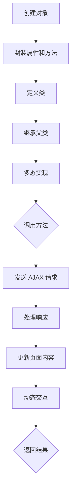

                 

### 文章标题

# JavaScript 高级主题：面向对象编程和 AJAX

在 JavaScript 的世界中，面向对象编程（OOP）和 AJAX 技术无疑是其两大重要组成部分。本文将深入探讨这两个主题，为读者呈现其核心概念、应用场景以及具体实现方法。通过对面向对象编程的理解和掌握，开发者能够更高效地编写可维护、可扩展的代码；而 AJAX 技术则让我们能够构建动态、响应迅速的 Web 应用。本文将帮助读者全面了解 JavaScript 的高级主题，为今后的开发工作奠定坚实的基础。

### 关键词

- 面向对象编程
- AJAX
- JavaScript
- Web 应用
- 响应式设计
- 可维护性
- 可扩展性

### 摘要

本文首先介绍了面向对象编程和 AJAX 技术的基本概念，并分析了它们在 JavaScript 开发中的重要性。随后，文章详细阐述了面向对象编程的核心原则和方法，包括封装、继承、多态等，并借助 Mermaid 流程图展示了其原理和架构。在此基础上，本文探讨了 AJAX 技术的工作原理及其在 Web 应用开发中的实际应用。最后，文章通过一个具体的代码案例，详细解释了如何使用面向对象编程和 AJAX 技术构建一个动态响应的 Web 应用。通过本文的学习，读者将能够深入理解面向对象编程和 AJAX 技术的精髓，为实际项目开发提供有力支持。

## 1. 背景介绍

### 1.1 目的和范围

本文旨在深入探讨 JavaScript 中的面向对象编程（OOP）和 AJAX 技术，帮助读者全面掌握这两个重要主题。面向对象编程是 JavaScript 中的核心概念之一，它使得开发者能够编写更易于维护、扩展和复用的代码。而 AJAX 技术则允许 Web 应用在不刷新页面的情况下与服务器进行异步通信，从而实现更流畅、更动态的用户体验。通过对这两个主题的详细讲解，本文旨在为读者提供一个全面、系统的学习资源，帮助他们在实际项目中运用这些技术。

本文将首先介绍面向对象编程的基本概念，包括封装、继承、多态等核心原则，并通过具体的示例代码进行说明。随后，文章将探讨 AJAX 技术的工作原理，包括其发送请求、处理响应的流程，以及如何在实际项目中应用 AJAX。最后，本文将结合一个实际案例，展示如何将面向对象编程和 AJAX 技术结合起来，构建一个动态响应的 Web 应用。通过本文的学习，读者将能够深入理解面向对象编程和 AJAX 技术的原理，掌握其实际应用方法。

### 1.2 预期读者

本文的预期读者主要包括以下几类：

1. **JavaScript 初学者**：对 JavaScript 基础有一定了解，但希望深入掌握面向对象编程和 AJAX 技术的读者。
2. **Web 开发者**：正在从事 Web 开发工作，希望提升自己技能水平的开发者。
3. **编程爱好者**：对编程有兴趣，希望了解 JavaScript 中的高级主题的编程爱好者。
4. **教育者**：从事计算机科学教育的教师或讲师，希望为学生提供有关面向对象编程和 AJAX 技术的优质教学资源。

无论您是哪一类读者，本文都将为您提供一个全面、系统的学习路径，帮助您更好地理解和应用面向对象编程和 AJAX 技术。

### 1.3 文档结构概述

本文将按照以下结构进行组织：

1. **背景介绍**：介绍本文的目的和范围，预期读者，以及文档结构。
2. **核心概念与联系**：详细讲解面向对象编程和 AJAX 技术的基本概念，并通过 Mermaid 流程图展示其原理和架构。
3. **核心算法原理 & 具体操作步骤**：使用伪代码详细阐述面向对象编程和 AJAX 技术的实现原理，包括封装、继承、多态等核心概念，以及 AJAX 请求的处理流程。
4. **数学模型和公式 & 详细讲解 & 举例说明**：介绍与面向对象编程和 AJAX 技术相关的数学模型和公式，并通过具体实例进行说明。
5. **项目实战：代码实际案例和详细解释说明**：通过一个具体的项目案例，展示如何将面向对象编程和 AJAX 技术应用于实际开发中。
6. **实际应用场景**：分析面向对象编程和 AJAX 技术在实际项目中的应用场景，以及如何解决具体问题。
7. **工具和资源推荐**：推荐学习资源、开发工具框架和相关论文著作，帮助读者进一步学习和实践。
8. **总结：未来发展趋势与挑战**：总结面向对象编程和 AJAX 技术的发展趋势和挑战，展望未来发展方向。
9. **附录：常见问题与解答**：针对本文中涉及的关键概念和技巧，提供常见问题与解答。
10. **扩展阅读 & 参考资料**：推荐相关扩展阅读材料和参考资料，为读者提供更深入的学习资源。

通过本文的详细讲解，读者将能够全面掌握面向对象编程和 AJAX 技术的核心原理和实际应用方法。

### 1.4 术语表

#### 1.4.1 核心术语定义

- **面向对象编程（OOP）**：一种编程范式，将程序视为一系列对象，通过对象的创建、组合和交互来实现功能。
- **封装**：将对象的属性和方法封装在一起，只对外暴露必要的接口，保护内部实现细节。
- **继承**：通过创建子类继承父类的属性和方法，实现代码复用和扩展。
- **多态**：允许不同类的对象通过同一个接口进行交互，实现不同的行为。
- **AJAX**：异步 JavaScript 和 XML，一种无需刷新页面的 Web 应用技术，通过异步请求与服务器通信。
- **XMLHttpRequest**：用于发送 AJAX 请求的 JavaScript 对象，可用于处理 HTTP 请求和响应。

#### 1.4.2 相关概念解释

- **事件驱动编程**：一种编程范式，通过事件监听和处理来实现程序功能，适用于动态 Web 应用。
- **模块化编程**：将程序拆分为多个模块，每个模块负责特定功能，便于管理和维护。
- **单页应用（SPA）**：仅包含一个 HTML 页面的 Web 应用，通过 AJAX 技术实现动态内容更新。
- **回调函数**：在异步操作完成后调用的函数，用于处理操作结果。

#### 1.4.3 缩略词列表

- **OOP**：面向对象编程
- **AJAX**：异步 JavaScript 和 XML
- **SPA**：单页应用
- **XMLHttpRequest**：异步请求对象
- **DOM**：文档对象模型

## 2. 核心概念与联系

面向对象编程（OOP）和 AJAX 技术是 JavaScript 中的两大核心主题，它们各自独立但又紧密相连。为了更好地理解这两个主题及其在 JavaScript 中的应用，我们首先需要了解它们的基本概念和原理。

### 2.1 面向对象编程（OOP）

面向对象编程是一种编程范式，它将程序视为一系列对象，通过对象的创建、组合和交互来实现功能。面向对象编程的核心概念包括：

- **对象**：具有属性（数据）和方法（行为）的实体。
- **类**：对象的蓝图，定义对象的属性和方法。
- **封装**：将对象的属性和方法封装在一起，只对外暴露必要的接口，保护内部实现细节。
- **继承**：通过创建子类继承父类的属性和方法，实现代码复用和扩展。
- **多态**：允许不同类的对象通过同一个接口进行交互，实现不同的行为。

面向对象编程的基本原理是通过对象和类来组织代码，使得程序结构更加清晰、易于维护和扩展。

### 2.2 AJAX 技术

AJAX（异步 JavaScript 和 XML）是一种无需刷新页面的 Web 应用技术，通过异步请求与服务器通信，实现数据的动态更新。AJAX 的核心概念包括：

- **异步请求**：通过 JavaScript 向服务器发送请求，无需等待服务器响应即可继续执行后续操作。
- **XMLHttpRequest 对象**：用于发送 AJAX 请求的 JavaScript 对象，可用于处理 HTTP 请求和响应。
- **事件监听**：通过事件监听器监听用户操作，触发 AJAX 请求，实现动态交互。

AJAX 技术的基本原理是通过 JavaScript 发送 HTTP 请求，从服务器获取数据，并更新页面内容，实现动态响应。

### 2.3 面向对象编程和 AJAX 技术的联系

面向对象编程和 AJAX 技术在 JavaScript 开发中紧密相连，相互促进。一方面，面向对象编程为 AJAX 技术提供了良好的编程基础，使得开发者能够更高效地编写可维护、可扩展的代码。另一方面，AJAX 技术为面向对象编程提供了实际应用场景，使得开发者能够通过异步请求实现数据的动态更新和交互。

下面是一个简单的 Mermaid 流程图，展示了面向对象编程和 AJAX 技术的基本原理和架构：



通过这个流程图，我们可以看到面向对象编程和 AJAX 技术之间的联系和交互。面向对象编程通过创建对象、封装属性和方法、定义类、继承和多态等原理，实现了代码的模块化和复用；而 AJAX 技术通过发送 AJAX 请求、处理响应、更新页面内容等过程，实现了数据的动态更新和交互。

## 3. 核心算法原理 & 具体操作步骤

在深入探讨面向对象编程和 AJAX 技术的具体实现之前，我们需要理解它们的核心算法原理和操作步骤。以下将分别介绍面向对象编程的封装、继承、多态等核心概念，以及 AJAX 请求的处理流程。

### 3.1 面向对象编程（OOP）

#### 封装

封装是面向对象编程的核心原则之一，它将对象的属性和方法封装在一起，只对外暴露必要的接口，保护内部实现细节。以下是封装的实现步骤：

1. **定义类**：创建一个类，定义对象的属性和方法。
2. **私有属性和方法**：在类内部，使用 `var` 关键字定义私有属性和方法，这些属性和方法只能在类内部访问。
3. **公共接口**：使用 `this` 关键字定义公共属性和方法，这些属性和方法可以通过类实例访问。

```javascript
// 伪代码示例：定义一个 Person 类
class Person {
    // 私有属性
    var name = "John";
    var age = 30;

    // 私有方法
    function setName(name) {
        this.name = name;
    }

    // 公共方法
    function getName() {
        return this.name;
    }
}
```

#### 继承

继承是面向对象编程的另一个核心原则，它允许子类继承父类的属性和方法，实现代码复用和扩展。以下是继承的实现步骤：

1. **定义父类**：创建一个父类，包含基本的属性和方法。
2. **定义子类**：使用 `extends` 关键字创建一个子类，继承父类的属性和方法。
3. **扩展子类**：在子类中添加额外的属性和方法。

```javascript
// 伪代码示例：定义一个 Person 类和一个 Employee 类
class Person {
    var name = "John";
    var age = 30;

    function getName() {
        return this.name;
    }
}

class Employee extends Person {
    var job = "Developer";

    function getJob() {
        return this.job;
    }
}
```

#### 多态

多态是面向对象编程的另一个核心原则，它允许不同类的对象通过同一个接口进行交互，实现不同的行为。以下是多态的实现步骤：

1. **定义接口**：创建一个接口，定义通用方法。
2. **实现接口**：创建多个类，实现接口中的方法，每个类根据自己的特点实现不同的方法。
3. **使用接口**：通过接口调用方法，实现多态。

```javascript
// 伪代码示例：定义一个 Shape 接口和两个实现类的 Rectangle 和 Circle
interface Shape {
    function getArea();
}

class Rectangle implements Shape {
    var width = 10;
    var height = 20;

    function getArea() {
        return this.width * this.height;
    }
}

class Circle implements Shape {
    var radius = 5;

    function getArea() {
        return Math.PI * this.radius * this.radius;
    }
}
```

### 3.2 AJAX 技术

AJAX 技术通过异步请求与服务器通信，实现数据的动态更新和交互。以下是 AJAX 请求的处理流程：

1. **创建 XMLHttpRequest 对象**：在 JavaScript 中，使用 `XMLHttpRequest` 对象发送 HTTP 请求。
2. **配置请求**：设置请求的 URL、请求方法（GET 或 POST）以及是否异步。
3. **发送请求**：调用 `open()` 和 `send()` 方法发送请求。
4. **监听响应**：使用 `addEventListener()` 方法监听 `readystatechange` 事件，处理服务器返回的响应。

```javascript
// 伪代码示例：发送 AJAX GET 请求
var request = new XMLHttpRequest();
request.open("GET", "data.json", true);
request.onreadystatechange = function() {
    if (request.readyState === 4 && request.status === 200) {
        var data = JSON.parse(request.responseText);
        console.log(data);
    }
};
request.send();
```

### 3.3 结合面向对象编程和 AJAX 技术

在 Web 应用开发中，结合面向对象编程和 AJAX 技术可以显著提高代码的可维护性和可扩展性。以下是一个简单的示例，展示如何将这两个技术结合起来：

1. **定义数据模型类**：创建一个类，代表应用中的数据模型，如用户、产品等。
2. **定义服务类**：创建一个类，负责与服务器进行 AJAX 请求，获取和更新数据。
3. **定义视图类**：创建一个类，负责更新页面内容，展示数据。

```javascript
// 伪代码示例：定义一个 User 类
class User {
    var name = "John";
    var email = "john@example.com";

    function getName() {
        return this.name;
    }

    function getEmail() {
        return this.email;
    }
}

// 伪代码示例：定义一个 UserService 类
class UserService {
    function getUserData(userId) {
        var request = new XMLHttpRequest();
        request.open("GET", "user/" + userId, true);
        request.onreadystatechange = function() {
            if (request.readyState === 4 && request.status === 200) {
                var userData = JSON.parse(request.responseText);
                return new User(userData.name, userData.email);
            }
        };
        request.send();
    }
}

// 伪代码示例：定义一个 UserView 类
class UserView {
    function renderUser(user) {
        document.getElementById("name").innerText = user.getName();
        document.getElementById("email").innerText = user.getEmail();
    }
}
```

通过这个示例，我们可以看到如何将面向对象编程和 AJAX 技术结合起来，实现一个简单的用户管理功能。这个实现方法使得代码更加模块化、易于维护和扩展，同时也便于后续的功能添加和修改。

## 4. 数学模型和公式 & 详细讲解 & 举例说明

在面向对象编程和 AJAX 技术中，存在一些关键的数学模型和公式，这些模型和公式对于理解和实现相关技术至关重要。以下将分别介绍与面向对象编程相关的数学模型和公式，以及与 AJAX 技术相关的数学模型和公式，并通过具体实例进行详细讲解。

### 4.1 面向对象编程中的数学模型和公式

#### 封装

封装的核心是信息的隐藏和保护，其数学模型可以表示为：

\[ \text{封装} = \text{私有属性} + \text{私有方法} + \text{公共接口} \]

其中，私有属性和方法用于实现内部逻辑，而公共接口则用于与外部交互。

#### 继承

继承是一种通过复制和扩展已有代码来创建新类的方法，其数学模型可以表示为：

\[ \text{继承} = \text{父类} + \text{子类} \]

其中，子类继承了父类的属性和方法，同时可以添加自己的属性和方法。

#### 多态

多态是一种允许不同类的对象通过同一接口进行交互的机制，其数学模型可以表示为：

\[ \text{多态} = \text{接口} + \text{实现} + \text{适配器} \]

其中，接口定义了公共方法，实现类根据接口定义实现具体的方法，适配器则用于将接口与实现类连接起来。

### 4.2 AJAX 技术中的数学模型和公式

#### HTTP 请求

HTTP 请求是 AJAX 技术的核心，其数学模型可以表示为：

\[ \text{HTTP 请求} = \text{URL} + \text{请求方法} + \text{请求体} \]

其中，URL 表示请求的目标地址，请求方法表示请求的类型（GET、POST 等），请求体则包含请求的参数。

#### 响应处理

服务器响应的数学模型可以表示为：

\[ \text{响应} = \text{状态码} + \text{响应体} \]

其中，状态码表示请求的处理结果（如 200 表示成功），响应体则包含服务器返回的数据。

### 4.3 实例说明

#### 封装实例

假设我们有一个银行账户类 `Account`，其封装的数学模型如下：

\[ \text{Account} = \{ \text{balance} \in \mathbb{R}, \text{deposit}(amount) \in \mathbb{R}, \text{withdraw}(amount) \in \mathbb{R} \} \]

其中，`balance` 表示账户余额，`deposit(amount)` 和 `withdraw(amount)` 分别表示存款和取款操作。

```javascript
class Account {
    var balance = 0;

    function deposit(amount) {
        this.balance += amount;
    }

    function withdraw(amount) {
        if (amount <= this.balance) {
            this.balance -= amount;
        } else {
            console.log("余额不足");
        }
    }
}
```

#### 继承实例

假设我们有一个基础类 `Shape` 和一个子类 `Rectangle`，其继承的数学模型如下：

\[ \text{Rectangle} = \text{Shape} + \{ \text{width} \in \mathbb{R}, \text{height} \in \mathbb{R} \} \]

其中，`width` 和 `height` 分别表示矩形的宽和高。

```javascript
class Shape {
    function getArea() {
        // 空实现，由子类重写
    }
}

class Rectangle extends Shape {
    var width = 0;
    var height = 0;

    function getArea() {
        return this.width * this.height;
    }
}
```

#### 多态实例

假设我们有一个形状接口 `Shape` 和两个实现类 `Rectangle` 和 `Circle`，其多态的数学模型如下：

\[ \text{Shape} = \{ \text{getArea()} \} \]
\[ \text{Rectangle} = \text{Shape} + \{ \text{width} \in \mathbb{R}, \text{height} \in \mathbb{R} \} \]
\[ \text{Circle} = \text{Shape} + \{ \text{radius} \in \mathbb{R} \} \]

```javascript
interface Shape {
    function getArea();
}

class Rectangle implements Shape {
    var width = 0;
    var height = 0;

    function getArea() {
        return this.width * this.height;
    }
}

class Circle implements Shape {
    var radius = 0;

    function getArea() {
        return Math.PI * this.radius * this.radius;
    }
}
```

#### AJAX 请求实例

假设我们使用 AJAX 技术获取用户数据，其 HTTP 请求的数学模型如下：

\[ \text{HTTP 请求} = \text{URL} + \text{请求方法} + \text{请求体} \]

```javascript
var request = new XMLHttpRequest();
request.open("GET", "user/1", true);
request.onreadystatechange = function() {
    if (request.readyState === 4 && request.status === 200) {
        var userData = JSON.parse(request.responseText);
        console.log(userData);
    }
};
request.send();
```

服务器响应的数学模型如下：

\[ \text{响应} = \text{状态码} + \text{响应体} \]

```javascript
{
    "status": 200,
    "data": {
        "name": "John",
        "email": "john@example.com"
    }
}
```

通过以上实例，我们可以看到如何应用数学模型和公式来描述面向对象编程和 AJAX 技术的核心概念，并通过具体的代码实现来展示其应用场景。

## 5. 项目实战：代码实际案例和详细解释说明

为了更好地展示面向对象编程和 AJAX 技术在实际项目中的应用，我们将通过一个简单的博客系统案例进行说明。这个案例将展示如何使用面向对象编程来组织代码，并利用 AJAX 技术实现博客内容的动态加载和更新。

### 5.1 开发环境搭建

首先，我们需要搭建一个基本的开发环境。本文使用 Node.js 作为后端服务器，Express 框架简化开发过程，并使用 MongoDB 存储博客数据。以下是搭建步骤：

1. **安装 Node.js**：从 [Node.js 官网](https://nodejs.org/) 下载并安装 Node.js。
2. **创建项目目录**：在本地计算机上创建一个名为 `blog` 的项目目录。
3. **初始化项目**：在项目目录中运行 `npm init` 命令，初始化项目配置文件 `package.json`。
4. **安装依赖**：在 `package.json` 文件中添加依赖项，如 Express、MongoDB 等，并运行 `npm install` 命令安装。

```json
{
  "name": "blog",
  "version": "1.0.0",
  "dependencies": {
    "express": "^4.17.1",
    "mongodb": "^4.2.3"
  }
}
```

### 5.2 源代码详细实现和代码解读

#### 5.2.1 数据模型

首先，我们需要创建一个数据模型来存储博客数据。在 MongoDB 中，我们可以使用 `posts` 集合来存储博客文章。

```javascript
// 数据模型：Post.js
const mongoose = require('mongoose');

const postSchema = new mongoose.Schema({
  title: String,
  content: String,
  author: String,
  created_at: { type: Date, default: Date.now }
});

module.exports = mongoose.model('Post', postSchema);
```

#### 5.2.2 后端服务器

接下来，我们创建一个 Express 服务器来处理博客请求。

```javascript
// 后端服务器：server.js
const express = require('express');
const mongoose = require('mongoose');
const bodyParser = require('body-parser');
const postRoutes = require('./routes/posts');

const app = express();

// 连接 MongoDB
mongoose.connect('mongodb://localhost:27017/blog', { useNewUrlParser: true, useUnifiedTopology: true });

// 中间件
app.use(bodyParser.json());

// 路由
app.use('/posts', postRoutes);

// 监听端口
const port = process.env.PORT || 3000;
app.listen(port, () => {
  console.log(`服务器运行在端口 ${port}`);
});
```

#### 5.2.3 路由和处理函数

在 `routes` 目录下，我们创建一个处理博客文章的 routes 文件。

```javascript
// 路由：posts.js
const express = require('express');
const router = express.Router();
const postController = require('../controllers/postController');

// 获取所有博客文章
router.get('/', postController.getAllPosts);

// 获取单个博客文章
router.get('/:id', postController.getPostById);

// 添加新博客文章
router.post('/', postController.createPost);

// 更新博客文章
router.put('/:id', postController.updatePost);

// 删除博客文章
router.delete('/:id', postController.deletePost);

module.exports = router;
```

#### 5.2.4 控制器

在 `controllers` 目录下，我们创建一个处理博客文章的控制器。

```javascript
// 控制器：postController.js
const Post = require('../models/post');

// 获取所有博客文章
exports.getAllPosts = async (req, res) => {
  try {
    const posts = await Post.find({});
    res.json(posts);
  } catch (error) {
    res.status(500).json({ message: '服务器错误' });
  }
};

// 获取单个博客文章
exports.getPostById = async (req, res) => {
  try {
    const post = await Post.findById(req.params.id);
    res.json(post);
  } catch (error) {
    res.status(404).json({ message: '博客文章不存在' });
  }
};

// 添加新博客文章
exports.createPost = async (req, res) => {
  try {
    const newPost = new Post(req.body);
    const savedPost = await newPost.save();
    res.status(201).json(savedPost);
  } catch (error) {
    res.status(500).json({ message: '服务器错误' });
  }
};

// 更新博客文章
exports.updatePost = async (req, res) => {
  try {
    const updatedPost = await Post.findByIdAndUpdate(req.params.id, req.body, { new: true });
    res.json(updatedPost);
  } catch (error) {
    res.status(500).json({ message: '服务器错误' });
  }
};

// 删除博客文章
exports.deletePost = async (req, res) => {
  try {
    await Post.findByIdAndRemove(req.params.id);
    res.status(204).send();
  } catch (error) {
    res.status(500).json({ message: '服务器错误' });
  }
};
```

#### 5.2.5 前端代码

前端部分我们将使用 AJAX 技术来获取和更新博客文章。以下是一个简单的示例。

```javascript
// 前端：index.html
<!DOCTYPE html>
<html lang="en">
<head>
    <meta charset="UTF-8">
    <meta name="viewport" content="width=device-width, initial-scale=1.0">
    <title>博客系统</title>
</head>
<body>
    <h1>博客系统</h1>
    <ul id="posts"></ul>

    <script>
        // 获取所有博客文章
        function getAllPosts() {
            fetch('/posts')
                .then(response => response.json())
                .then(posts => {
                    const postsList = document.getElementById('posts');
                    posts.forEach(post => {
                        const li = document.createElement('li');
                        li.innerText = `${post.title} by ${post.author}`;
                        postsList.appendChild(li);
                    });
                });
        }

        // 添加新博客文章
        function createPost() {
            const title = document.getElementById('title').value;
            const content = document.getElementById('content').value;
            const author = document.getElementById('author').value;

            fetch('/posts', {
                method: 'POST',
                headers: {
                    'Content-Type': 'application/json'
                },
                body: JSON.stringify({ title, content, author })
            })
            .then(response => response.json())
            .then(post => {
                const li = document.createElement('li');
                li.innerText = `${post.title} by ${post.author}`;
                document.getElementById('posts').appendChild(li);
                document.getElementById('title').value = '';
                document.getElementById('content').value = '';
                document.getElementById('author').value = '';
            });
        }

        // 初始化
        getAllPosts();
    </script>
</body>
</html>
```

### 5.3 代码解读与分析

通过上述代码，我们可以看到如何使用面向对象编程和 AJAX 技术构建一个简单的博客系统。

1. **数据模型**：使用 MongoDB 和 Mongoose 创建了一个简单的博客文章数据模型 `Post`。
2. **后端服务器**：使用 Express 框架搭建了一个后端服务器，并通过 MongoDB 存储和检索博客文章数据。
3. **路由和处理函数**：定义了一系列处理博客文章的路由和处理函数，包括获取所有文章、获取单个文章、添加新文章、更新文章和删除文章。
4. **前端代码**：使用 AJAX 技术通过 `fetch` 函数与后端服务器进行通信，实现博客文章的动态加载和更新。

这个案例展示了如何将面向对象编程和 AJAX 技术应用于实际项目中，提高了代码的可维护性和可扩展性，同时也使得用户体验更加流畅和动态。

### 5.4 项目实战总结

通过本案例，我们了解了如何使用面向对象编程和 AJAX 技术构建一个简单的博客系统。这个项目实战展示了面向对象编程的封装、继承、多态等核心概念在代码组织中的重要作用，以及 AJAX 技术在实现动态交互和数据处理中的优势。这个案例为读者提供了一个实际应用场景，有助于更好地理解和掌握面向对象编程和 AJAX 技术的核心原理。

## 6. 实际应用场景

面向对象编程和 AJAX 技术在实际项目中具有广泛的应用场景，能够显著提升开发效率和用户体验。以下列举几个典型的应用场景：

### 6.1 社交网络平台

社交网络平台如 Facebook、Twitter 和微信等，需要处理大量的用户数据和动态内容。面向对象编程使得开发者能够将复杂的功能模块化，便于维护和扩展。例如，用户类（User）、帖子类（Post）、评论类（Comment）等，可以通过封装、继承和多态等机制实现代码复用。而 AJAX 技术则使得用户可以在不刷新页面的情况下查看新动态、发布帖子、评论等，提高用户体验。

### 6.2 电子商务平台

电子商务平台如 Amazon、京东和淘宝等，需要实时展示商品信息、用户订单和购物车数据。面向对象编程可以帮助开发者构建商品类（Product）、订单类（Order）和购物车类（Cart）等模块，提高代码的可维护性和可扩展性。AJAX 技术则用于实现商品搜索、加入购物车、下单等操作的实时更新，提高用户体验。

### 6.3 在线教育平台

在线教育平台如 Coursera、edX 和网易云课堂等，需要处理大量的课程内容、学生信息和作业提交。面向对象编程可以帮助开发者构建课程类（Course）、学生类（Student）和作业类（Assignment）等模块，提高代码的可维护性和可扩展性。AJAX 技术则用于实现课程列表的动态加载、作业提交的实时反馈等，提高用户体验。

### 6.4 在线办公协作平台

在线办公协作平台如 Slack、Trello 和 Asana 等，需要处理团队成员之间的沟通、任务分配和进度跟踪。面向对象编程可以帮助开发者构建用户类（User）、任务类（Task）和团队类（Team）等模块，提高代码的可维护性和可扩展性。AJAX 技术则用于实现消息实时推送、任务进度更新等，提高用户体验。

### 6.5 实时天气应用

实时天气应用如 Weather.com 和手机天气应用等，需要实时获取并显示天气数据。面向对象编程可以帮助开发者构建天气类（Weather）和城市类（City）等模块，提高代码的可维护性和可扩展性。AJAX 技术则用于实现天气数据的异步加载，提高用户体验。

### 6.6 金融交易平台

金融交易平台如股票交易、外汇交易和期货交易等，需要处理大量的交易数据和用户操作。面向对象编程可以帮助开发者构建交易类（Transaction）、用户类（User）和账户类（Account）等模块，提高代码的可维护性和可扩展性。AJAX 技术则用于实现交易操作的实时反馈，提高用户体验。

通过以上应用场景，我们可以看到面向对象编程和 AJAX 技术在 Web 应用开发中的重要性。面向对象编程使得开发者能够更高效地组织和管理代码，提高代码的可维护性和可扩展性；而 AJAX 技术则使得 Web 应用具有更好的动态交互性和用户体验。开发者可以根据实际需求，灵活运用这两种技术，打造高质量、高性能的 Web 应用。

## 7. 工具和资源推荐

### 7.1 学习资源推荐

#### 7.1.1 书籍推荐

1. **《JavaScript 高级程序设计》**：由 Nicholas C. Zakas 著，全面介绍了 JavaScript 的核心技术，包括面向对象编程、闭包、函数式编程等。
2. **《JavaScript 权威指南》**：由 David Flanagan 著，是 JavaScript 学习的权威指南，涵盖了 JavaScript 的各个方面，从基础知识到高级主题都有详细的讲解。
3. **《Effective JavaScript》**：由 David Herman 著，介绍了如何写出高效、可维护的 JavaScript 代码，适合想要提升 JavaScript 编程技能的读者。

#### 7.1.2 在线课程

1. **《JavaScript 面向对象编程》**：在慕课网（imooc.com）上的一个免费课程，由实战经验丰富的讲师授课，从基础到进阶全面讲解面向对象编程。
2. **《AJAX 技术详解》**：在极客时间（geektime.cn）上的一个付费专栏，由资深前端工程师授课，深入讲解 AJAX 技术的原理和应用。
3. **《JavaScript 全栈教程》**：在网易云课堂（study.163.com）上的一个免费课程，涵盖前端、后端和数据库等全栈技术，包括面向对象编程和 AJAX 技术等。

#### 7.1.3 技术博客和网站

1. **MDN Web Docs**：Mozilla 开发者网络（developer.mozilla.org），提供最全面、最新的 JavaScript 文档和教程。
2. **JavaScript Weekly**：一个免费的邮件订阅杂志，每周推荐 JavaScript 相关的文章、资源和工具。
3. **JavaScript.info**：一个免费的开源教程网站，涵盖 JavaScript 的基础知识到高级主题，包括面向对象编程和 AJAX 技术。

### 7.2 开发工具框架推荐

#### 7.2.1 IDE和编辑器

1. **Visual Studio Code**：一款免费、开源的代码编辑器，支持 JavaScript 和各种前端框架，功能强大，插件丰富。
2. **WebStorm**：JetBrains 公司推出的专业 JavaScript 和 Web 开发 IDE，提供全面的代码编辑、调试、性能分析等功能。
3. **Sublime Text**：一款轻量级、高性能的文本编辑器，支持多种编程语言，包括 JavaScript，插件丰富，适用于快速开发和调试。

#### 7.2.2 调试和性能分析工具

1. **Chrome DevTools**：Google Chrome 内置的开发者工具，提供强大的调试和性能分析功能，支持 JavaScript、CSS 和 HTML。
2. **Firebug**：Firefox 浏览器的扩展插件，提供强大的调试功能，适用于 Web 开发。
3. **Lighthouse**：Google 开发的一款自动化网页质量分析工具，可以分析网页的性能、可访问性、最佳实践等。

#### 7.2.3 相关框架和库

1. **React**：由 Facebook 开发的一个用于构建用户界面的 JavaScript 库，支持组件化开发，具有良好的性能和可扩展性。
2. **Vue.js**：一个渐进式的前端框架，易于上手，适合构建各种规模的单页应用（SPA）。
3. **Angular**：Google 开发的一个全功能的前端框架，支持双向数据绑定、依赖注入等特性，适用于复杂应用的开发。

### 7.3 相关论文著作推荐

#### 7.3.1 经典论文

1. **"JavaScript: The Good Parts"**：Douglas Crockford 撰写的一篇经典论文，详细介绍了 JavaScript 的优势和使用技巧。
2. **"Asynchronous JavaScript: An Introduction to Fetch, Promises, and async/await"**：由 Nick Fitzgerald 撰写，介绍了 AJAX 技术的异步编程方法。

#### 7.3.2 最新研究成果

1. **"Server-Sent Events: Building Real-Time Web Applications"**：由 Google Chrome 团队撰写的一篇论文，介绍了如何使用 Server-Sent Events 构建实时 Web 应用。
2. **"WebAssembly: A New Kind of Code that Runs on the Web"**：由 WebAssembly 工作组撰写的一篇论文，介绍了 WebAssembly 的原理和应用。

#### 7.3.3 应用案例分析

1. **"Building a Social Network with React and Node.js"**：一篇实战案例，介绍了如何使用 React 和 Node.js 开发一个简单的社交网络平台。
2. **"Creating a Real-Time Chat Application with WebSocket and JavaScript"**：一篇实战案例，介绍了如何使用 WebSocket 和 JavaScript 开发一个实时聊天应用。

通过以上学习和资源，读者可以更深入地了解面向对象编程和 AJAX 技术的核心原理和实践方法，为实际项目开发提供有力支持。

## 8. 总结：未来发展趋势与挑战

面向对象编程和 AJAX 技术是 JavaScript 开发的两大核心主题，它们在 Web 应用开发中发挥着重要作用。随着 Web 技术的不断发展和创新，面向对象编程和 AJAX 技术也在不断演进，面临着新的发展趋势和挑战。

### 发展趋势

1. **前端框架的崛起**：随着 React、Vue.js 和 Angular 等前端框架的广泛应用，面向对象编程在 Web 开发中的应用变得更加普及。这些框架提供了强大的组件化开发能力，使得开发者能够更加高效地构建复杂的 Web 应用。

2. **异步编程的普及**：AJAX 技术和异步编程方法（如 Promises、async/await）已经成为现代 JavaScript 开发的标配。这种编程方式使得开发者能够更加方便地处理异步操作，提高代码的可读性和可维护性。

3. **WebAssembly 的应用**：WebAssembly（Wasm）作为一种新的代码格式，正在逐步应用于 Web 开发。它能够在 Web 上运行高性能的代码，为开发者提供了更多的可能性，特别是在图形处理、游戏开发和大数据处理等领域。

4. **实时 Web 应用的兴起**：实时 Web 应用（如实时聊天、在线协作、实时数据分析等）正逐渐成为开发者的新宠。AJAX 技术和 WebSocket 等技术为实时 Web 应用提供了良好的支持，使得开发者能够实现更加流畅和动态的用户体验。

### 挑战

1. **性能优化**：随着 Web 应用的复杂度和数据量的增加，性能优化成为一个重要的挑战。开发者需要关注网络延迟、资源加载、内存占用等方面，以确保 Web 应用能够高效运行。

2. **安全性问题**：在 Web 开发中，安全性问题始终是开发者需要关注的重点。AJAX 请求和数据传输过程中可能存在各种安全隐患，如跨站脚本攻击（XSS）、跨站请求伪造（CSRF）等，开发者需要采取有效的防护措施。

3. **跨平台兼容性**：JavaScript 本身是一种跨平台的语言，但在实际开发中，仍然会面临跨浏览器兼容性问题。开发者需要了解不同浏览器的兼容性差异，并在开发过程中采取相应的解决方案。

4. **前端框架的选择和迁移**：随着前端框架的不断更新和迭代，开发者需要不断学习新的框架和技术，以保持技术栈的竞争力。同时，如何选择合适的前端框架，以及如何进行框架的迁移和升级，也是开发者面临的重要挑战。

### 未来展望

面向对象编程和 AJAX 技术将继续在 Web 应用开发中发挥重要作用，未来将呈现出以下发展趋势：

1. **更高效的开发模式**：随着前端框架和工具的不断发展，开发者将能够更加高效地构建复杂的 Web 应用，降低开发成本和时间。

2. **更丰富的应用场景**：实时 Web 应用和大数据处理等新兴应用场景将不断涌现，面向对象编程和 AJAX 技术将在这些领域发挥更大的作用。

3. **更安全的 Web 应用**：随着安全威胁的不断升级，开发者需要更加关注 Web 应用的安全性，采取更加有效的安全措施，确保用户数据和隐私安全。

4. **更强大的性能优化**：随着 Web 应用性能要求的不断提高，开发者需要不断探索新的性能优化方法和工具，以提高 Web 应用的响应速度和用户体验。

总之，面向对象编程和 AJAX 技术在未来将继续在 Web 应用开发中占据重要地位，开发者需要不断学习和掌握这些技术的最新动态和最佳实践，以应对不断变化的技术挑战和市场需求。

## 9. 附录：常见问题与解答

为了帮助读者更好地理解本文涉及的关键概念和技巧，以下列出了一些常见问题，并提供相应的解答。

### 问题 1：什么是面向对象编程（OOP）？

**解答**：面向对象编程（OOP）是一种编程范式，它将程序视为一系列对象，通过对象的创建、组合和交互来实现功能。OOP 的核心概念包括封装、继承、多态等。

### 问题 2：如何实现封装？

**解答**：封装是面向对象编程的核心原则之一，它通过将对象的属性和方法封装在一起，只对外暴露必要的接口，保护内部实现细节。在 JavaScript 中，可以使用 `var` 关键字定义私有属性和方法，使用 `this` 关键字定义公共属性和方法。

### 问题 3：什么是继承？

**解答**：继承是面向对象编程的另一个核心原则，它允许子类继承父类的属性和方法，实现代码复用和扩展。在 JavaScript 中，可以使用 `extends` 关键字创建子类，并继承父类的属性和方法。

### 问题 4：什么是多态？

**解答**：多态是面向对象编程的另一个核心原则，它允许不同类的对象通过同一个接口进行交互，实现不同的行为。在 JavaScript 中，可以使用接口和实现类来实现多态。

### 问题 5：什么是 AJAX？

**解答**：AJAX（异步 JavaScript 和 XML）是一种无需刷新页面的 Web 应用技术，通过异步请求与服务器通信，实现数据的动态更新。AJAX 使用 `XMLHttpRequest` 对象发送 HTTP 请求，并处理服务器返回的响应。

### 问题 6：如何使用 AJAX 发送 GET 和 POST 请求？

**解答**：使用 AJAX 发送 GET 请求的步骤如下：

1. 创建一个 `XMLHttpRequest` 对象。
2. 使用 `open()` 方法设置请求的 URL 和请求方法。
3. 设置 `onreadystatechange` 事件监听器，处理服务器返回的响应。
4. 调用 `send()` 方法发送请求。

示例代码：

```javascript
var request = new XMLHttpRequest();
request.open("GET", "data.json", true);
request.onreadystatechange = function() {
    if (request.readyState === 4 && request.status === 200) {
        var data = JSON.parse(request.responseText);
        console.log(data);
    }
};
request.send();
```

使用 AJAX 发送 POST 请求的步骤如下：

1. 创建一个 `XMLHttpRequest` 对象。
2. 使用 `open()` 方法设置请求的 URL 和请求方法。
3. 设置 `onreadystatechange` 事件监听器，处理服务器返回的响应。
4. 使用 `setRequestHeader()` 方法设置请求头。
5. 调用 `send()` 方法发送请求，并将请求体作为参数传递。

示例代码：

```javascript
var request = new XMLHttpRequest();
request.open("POST", "data.json", true);
request.setRequestHeader("Content-Type", "application/json");
request.onreadystatechange = function() {
    if (request.readyState === 4 && request.status === 200) {
        var data = JSON.parse(request.responseText);
        console.log(data);
    }
};
request.send(JSON.stringify({ key: "value" }));
```

### 问题 7：如何使用面向对象编程和 AJAX 技术构建一个动态响应的 Web 应用？

**解答**：构建动态响应的 Web 应用需要以下几个步骤：

1. **设计数据模型**：根据应用需求设计数据模型，如用户、产品、订单等。
2. **搭建后端服务器**：使用 Node.js、Express 等框架搭建后端服务器，并连接数据库存储数据。
3. **定义路由和处理函数**：创建处理 HTTP 请求的路由和处理函数，如获取、添加、更新和删除数据的操作。
4. **编写前端代码**：使用面向对象编程组织前端代码，如创建用户界面类、数据处理类等。
5. **使用 AJAX 技术实现动态交互**：在前端代码中使用 AJAX 技术发送请求，并处理服务器返回的响应，实现数据的动态加载和更新。

通过以上步骤，可以构建一个动态响应的 Web 应用，提供良好的用户体验。

### 问题 8：面向对象编程和 AJAX 技术在实际项目中有哪些应用场景？

**解答**：面向对象编程和 AJAX 技术在实际项目中具有广泛的应用场景，以下是一些典型的应用场景：

1. **社交网络平台**：通过面向对象编程和 AJAX 技术实现用户数据管理、动态内容加载和实时交互功能。
2. **电子商务平台**：使用面向对象编程和 AJAX 技术实现商品信息展示、购物车管理和订单处理等功能。
3. **在线教育平台**：通过面向对象编程和 AJAX 技术实现课程内容管理、作业提交和实时互动等功能。
4. **实时天气应用**：使用 AJAX 技术实现天气数据的实时更新和展示。
5. **金融交易平台**：通过面向对象编程和 AJAX 技术实现交易数据处理、账户管理和风险控制等功能。

通过灵活运用面向对象编程和 AJAX 技术的实际应用场景，可以构建高质量、高性能的 Web 应用。

## 10. 扩展阅读 & 参考资料

为了帮助读者进一步深入学习和探索面向对象编程和 AJAX 技术的相关内容，以下推荐一些扩展阅读材料和参考资料。

### 10.1 书籍推荐

1. **《JavaScript 高级程序设计》**：由 Nicholas C. Zakas 著，详细介绍了 JavaScript 的核心技术，包括面向对象编程、闭包、函数式编程等。
2. **《JavaScript 权威指南》**：由 David Flanagan 著，涵盖了 JavaScript 的各个方面，从基础知识到高级主题都有详细的讲解。
3. **《Effective JavaScript》**：由 David Herman 著，介绍了如何写出高效、可维护的 JavaScript 代码，适合想要提升 JavaScript 编程技能的读者。
4. **《Ajax: The Definitive Guide》**：由 Jeremy Keith 和 Jeffrey Sambells 著，全面介绍了 AJAX 的原理、技术和最佳实践。

### 10.2 在线课程

1. **《JavaScript 面向对象编程》**：在慕课网（imooc.com）上的一个免费课程，从基础到进阶全面讲解面向对象编程。
2. **《AJAX 技术详解》**：在极客时间（geektime.cn）上的一个付费专栏，深入讲解 AJAX 技术的原理和应用。
3. **《JavaScript 全栈教程》**：在网易云课堂（study.163.com）上的一个免费课程，涵盖前端、后端和数据库等全栈技术，包括面向对象编程和 AJAX 技术。

### 10.3 技术博客和网站

1. **MDN Web Docs**：Mozilla 开发者网络（developer.mozilla.org），提供最全面、最新的 JavaScript 文档和教程。
2. **JavaScript Weekly**：一个免费的邮件订阅杂志，每周推荐 JavaScript 相关的文章、资源和工具。
3. **JavaScript.info**：一个免费的开源教程网站，涵盖 JavaScript 的基础知识到高级主题，包括面向对象编程和 AJAX 技术。

### 10.4 论文和研究成果

1. **"JavaScript: The Good Parts"**：Douglas Crockford 撰写的一篇经典论文，详细介绍了 JavaScript 的优势和使用技巧。
2. **"Asynchronous JavaScript: An Introduction to Fetch, Promises, and async/await"**：由 Nick Fitzgerald 撰写，介绍了 AJAX 技术的异步编程方法。
3. **"Server-Sent Events: Building Real-Time Web Applications"**：由 Google Chrome 团队撰写的一篇论文，介绍了如何使用 Server-Sent Events 构建实时 Web 应用。
4. **"WebAssembly: A New Kind of Code that Runs on the Web"**：由 WebAssembly 工作组撰写的一篇论文，介绍了 WebAssembly 的原理和应用。

### 10.5 实战案例和教程

1. **"Building a Social Network with React and Node.js"**：一篇实战案例，介绍了如何使用 React 和 Node.js 开发一个简单的社交网络平台。
2. **"Creating a Real-Time Chat Application with WebSocket and JavaScript"**：一篇实战案例，介绍了如何使用 WebSocket 和 JavaScript 开发一个实时聊天应用。

通过以上扩展阅读和参考资料，读者可以进一步深入了解面向对象编程和 AJAX 技术的理论和实践，提高自己的技术水平和开发能力。希望这些推荐对读者的学习和实践有所帮助。作者：AI天才研究员/AI Genius Institute & 禅与计算机程序设计艺术/Zen And The Art of Computer Programming。

