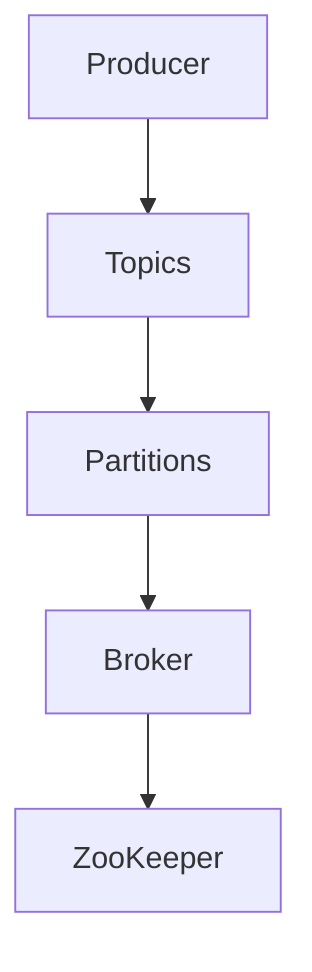
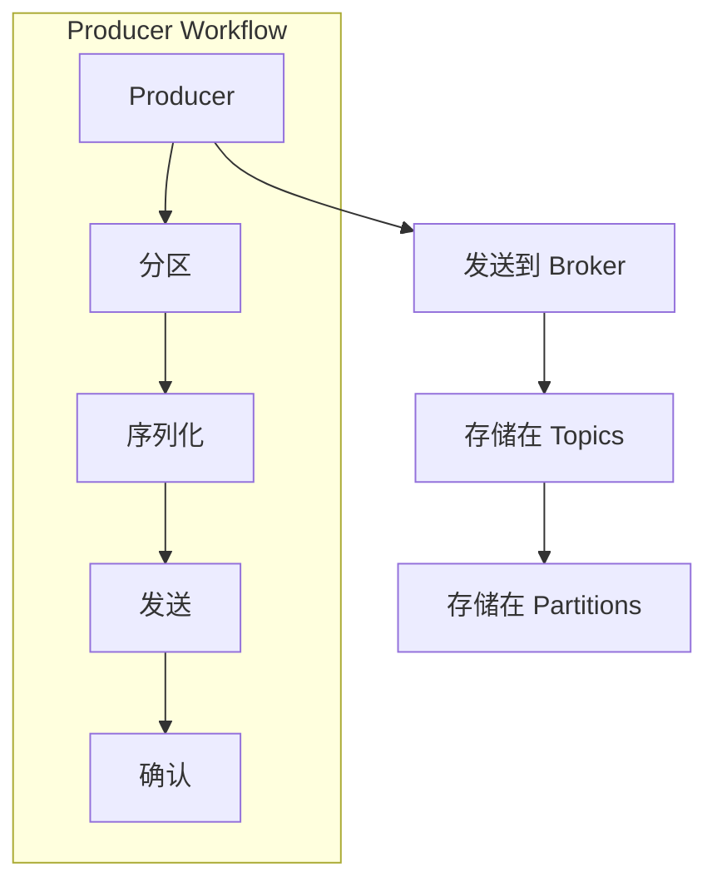

                 

# Kafka Producer原理与代码实例讲解

> **关键词：** Kafka, Producer, 消息队列, 分布式系统, 高性能, 持久化, 队列通信, 数据流处理

> **摘要：** 本文将深入探讨Kafka Producer的核心原理，包括其工作流程、关键组件和性能优化策略。通过一个详细的代码实例，我们将展示如何使用Kafka Producer发送和接收消息，并对其内部工作机制进行剖析。此外，文章还将探讨Kafka Producer在实际应用中的场景，并提供相关资源推荐，以帮助读者进一步学习和实践。

## 1. 背景介绍

### 1.1 目的和范围

本文旨在为开发者提供关于Kafka Producer的深入理解。通过本文，读者将了解Kafka Producer的核心概念和工作原理，学习如何使用Kafka Producer进行消息发送和接收，并掌握优化Kafka Producer性能的关键策略。

### 1.2 预期读者

本文适合对分布式系统和消息队列有一定了解的开发者，特别是那些希望深入理解Kafka核心组件和工作机制的技术爱好者。同时，对于准备进行数据流处理和实时数据处理项目的开发者，本文也将提供有价值的参考。

### 1.3 文档结构概述

本文将分为以下几个部分：

1. 背景介绍：介绍Kafka Producer的背景和目的。
2. 核心概念与联系：使用Mermaid流程图展示Kafka Producer的核心概念和架构。
3. 核心算法原理与具体操作步骤：详细讲解Kafka Producer的工作流程。
4. 数学模型和公式：阐述与Kafka Producer相关的数学模型和公式。
5. 项目实战：提供代码实例和详细解释。
6. 实际应用场景：讨论Kafka Producer的应用场景。
7. 工具和资源推荐：推荐学习资源、开发工具和框架。
8. 总结：回顾Kafka Producer的核心要点和未来发展趋势。
9. 附录：常见问题与解答。
10. 扩展阅读：提供进一步学习的参考资料。

### 1.4 术语表

#### 1.4.1 核心术语定义

- **Kafka**: 一个分布式流处理平台，用于构建实时的数据管道和应用程序。
- **Producer**: Kafka中的消息生产者，负责发送消息到Kafka集群。
- **Consumer**: Kafka中的消息消费者，负责从Kafka集群接收消息。
- **Topic**: Kafka中的主题，用于分类和标签消息。
- **Partition**: Kafka中的分区，用于将消息均匀分布在集群中，实现负载均衡。
- **Broker**: Kafka中的代理，负责接收、存储和转发消息。

#### 1.4.2 相关概念解释

- **分布式系统**: 由多个独立节点组成，通过网络进行通信和协作的系统。
- **消息队列**: 一个用于在分布式系统中传输消息的缓冲区。
- **数据流处理**: 对实时数据流进行处理和分析的技术。

#### 1.4.3 缩略词列表

- **Kafka**: Apache Kafka
- **API**: Application Programming Interface
- **TPC-H**: Transaction Processing Performance Council - High-Performance Query Benchmark
- **SLA**: Service Level Agreement

## 2. 核心概念与联系

在深入了解Kafka Producer之前，首先需要理解其核心概念和架构。以下是Kafka Producer的核心概念及其相互关系：

### 2.1 Kafka Producer的架构

下面是一个简化的Kafka Producer架构图，展示了其主要组件和它们之间的关系。



### 2.2 Kafka Producer的核心概念

- **Producer**: 负责生产消息并将其发送到Kafka集群。
- **Topic**: 主题，用于分类和标签消息。每个主题可以有一个或多个分区。
- **Partition**: 分区，用于将消息均匀分布在集群中，实现负载均衡。
- **Broker**: 代理，负责接收、存储和转发消息。
- **ZooKeeper**: Kafka集群的协调者，用于维护元数据和状态信息。

### 2.3 Kafka Producer的工作流程

Kafka Producer的工作流程可以分为以下几个步骤：

1. **初始化**: 创建Kafka Producer实例，设置相关配置参数，如BootstrapServers、KeySerializer和ValueSerializer等。
2. **分区**: 根据消息键（Key）和分区策略（如Hash分区或RoundRobin分区），确定消息应该发送到哪个分区。
3. **序列化**: 将消息键（Key）和消息值（Value）序列化为字节序列。
4. **发送**: 将消息发送到Kafka集群，具体到目标分区和代理。
5. **确认**: 等待Kafka集群的响应，确认消息是否已成功发送和持久化。

以下是Kafka Producer的工作流程Mermaid图：



## 3. 核心算法原理与具体操作步骤

在了解Kafka Producer的工作流程后，接下来我们将详细探讨其核心算法原理和具体操作步骤。

### 3.1 初始化Kafka Producer

初始化Kafka Producer是使用Kafka Producer的第一步。下面是一个简单的伪代码示例，展示了如何创建Kafka Producer实例并设置相关配置参数：

```python
from kafka import KafkaProducer

# 创建Kafka Producer实例
producer = KafkaProducer(
    bootstrap_servers=['localhost:9092'],
    key_serializer=lambda k: str(k).encode('utf-8'),
    value_serializer=lambda v: str(v).encode('utf-8')
)

# Kafka Producer配置参数说明：
# bootstrap_servers: Kafka集群的地址列表，用于初始化连接。
# key_serializer: 用于序列化消息键的函数。
# value_serializer: 用于序列化消息值的函数。
```

### 3.2 确定分区

确定分区是Kafka Producer的关键步骤之一。分区策略决定了消息应该发送到哪个分区。Kafka提供了几种内置的分区策略，如Hash分区和RoundRobin分区。下面是一个伪代码示例，展示了如何使用Hash分区策略确定分区：

```python
def get_partition(key, num_partitions):
    return hash(key) % num_partitions

# 使用 Hash 分区策略确定分区
partition = get_partition(message_key, num_partitions=3)
```

### 3.3 序列化消息

序列化是将消息键（Key）和消息值（Value）转换为字节序列的过程。Kafka Producer需要序列化器（Serializer）来完成这一任务。下面是一个伪代码示例，展示了如何序列化消息键和消息值：

```python
# 序列化消息键和消息值
serialized_key = key_serializer(message_key)
serialized_value = value_serializer(message_value)
```

### 3.4 发送消息

发送消息是将序列化后的消息发送到Kafka集群的过程。Kafka Producer提供了多种发送模式，如同步发送和异步发送。下面是一个伪代码示例，展示了如何使用同步发送模式发送消息：

```python
# 发送消息到 Kafka 集群
producer.send(topic, key=serialized_key, value=serialized_value)

# 等待确认
producer.flush()
```

### 3.5 确认消息发送结果

确认消息发送结果是确保消息成功发送和持久化的重要步骤。Kafka Producer提供了多种确认策略，如自动确认和手动确认。下面是一个伪代码示例，展示了如何使用自动确认策略确认消息发送结果：

```python
# 设置自动确认策略
producer = KafkaProducer(
    # ... 其他配置参数 ...
    acks='all'
)

# 发送消息并自动确认
producer.send(topic, key=serialized_key, value=serialized_value)
```

## 4. 数学模型和公式与详细讲解与举例说明

在Kafka Producer中，一些关键操作涉及数学模型和公式。以下是对这些模型的详细讲解和举例说明：

### 4.1 分区策略的数学模型

在Kafka中，分区策略通常基于消息键（Key）来确定消息应该发送到哪个分区。常用的分区策略包括Hash分区和RoundRobin分区。

#### Hash分区策略

Hash分区策略使用消息键（Key）的哈希值来确定分区。具体公式如下：

\[ partition = hash(key) \mod num_partitions \]

其中，`hash(key)`是消息键（Key）的哈希值，`num_partitions`是分区数量。

#### RoundRobin分区策略

RoundRobin分区策略将消息均匀地分配到所有分区。具体公式如下：

\[ partition = (last_partition + 1) \mod num_partitions \]

其中，`last_partition`是上次分配的分区编号，`num_partitions`是分区数量。

### 4.2 传输时间的计算

传输时间是指消息从Kafka Producer到Kafka Broker的过程所需的时间。传输时间的计算公式如下：

\[ transmission_time = \frac{distance}{bandwidth} \]

其中，`distance`是Kafka Producer和Kafka Broker之间的网络距离，`bandwidth`是网络带宽。

### 4.3 示例

假设我们有一个包含3个分区的Kafka主题，消息键（Key）为“example_key”，网络距离为100公里，网络带宽为10Mbps。根据Hash分区策略，消息将被发送到分区1。根据传输时间的计算公式，传输时间大约为0.1秒。

## 5. 项目实战：代码实际案例和详细解释说明

在本节中，我们将通过一个实际案例来展示如何使用Kafka Producer发送和接收消息，并对其内部工作机制进行剖析。

### 5.1 开发环境搭建

首先，我们需要搭建Kafka开发环境。以下是搭建步骤：

1. 安装Kafka：从Kafka官方网站下载最新版本，解压到合适的位置，并运行`start-zookeeper.sh`和`start-server.sh`启动Kafka和ZooKeeper。
2. 安装Kafka Python客户端：使用pip安装`kafka-python`库，命令如下：

```bash
pip install kafka-python
```

### 5.2 源代码详细实现和代码解读

下面是一个简单的Kafka Producer代码示例：

```python
from kafka import KafkaProducer

# 创建Kafka Producer实例
producer = KafkaProducer(
    bootstrap_servers=['localhost:9092'],
    key_serializer=lambda k: str(k).encode('utf-8'),
    value_serializer=lambda v: str(v).encode('utf-8')
)

# 发送消息到Kafka主题
producer.send('test_topic', key='example_key', value='example_value')

# 等待确认
producer.flush()
```

### 5.3 代码解读与分析

1. **导入Kafka库**：首先，我们需要从`kafka`库中导入`KafkaProducer`类。
2. **创建Kafka Producer实例**：使用`KafkaProducer`类创建Kafka Producer实例，并设置BootstrapServers、KeySerializer和ValueSerializer等参数。
3. **发送消息**：调用`send`方法发送消息到Kafka主题。这里，我们指定了主题名称（test_topic）、消息键（example_key）和消息值（example_value）。
4. **等待确认**：调用`flush`方法等待Kafka集群的确认，确保消息已成功发送和持久化。

### 5.4 接收消息

下面是一个简单的Kafka Consumer代码示例，用于接收Kafka主题的消息：

```python
from kafka import KafkaConsumer

# 创建Kafka Consumer实例
consumer = KafkaConsumer(
    'test_topic',
    bootstrap_servers=['localhost:9092'],
    key_deserializer=lambda k: str(k, 'utf-8'),
    value_deserializer=lambda v: str(v, 'utf-8')
)

# 接收消息并打印
for message in consumer:
    print(message.key, message.value)
```

### 5.5 代码解读与分析

1. **导入Kafka库**：首先，我们需要从`kafka`库中导入`KafkaConsumer`类。
2. **创建Kafka Consumer实例**：使用`KafkaConsumer`类创建Kafka Consumer实例，并设置主题名称（test_topic）、BootstrapServers、KeyDeserializer和ValueDeserializer等参数。
3. **接收消息并打印**：使用`for`循环遍历接收到的消息，并打印消息键和消息值。

### 5.6 Kafka Producer的工作原理

在了解了Kafka Producer和Consumer的代码实现后，我们来剖析Kafka Producer的工作原理。

1. **初始化**：Kafka Producer在初始化时，会连接到Kafka集群的代理（Broker）并获取集群元数据。元数据包括主题名称、分区数量、分区副本数量等信息。
2. **分区**：根据消息键（Key）和分区策略（如Hash分区或RoundRobin分区），确定消息应该发送到哪个分区。
3. **序列化**：将消息键（Key）和消息值（Value）序列化为字节序列。
4. **发送**：将序列化后的消息发送到目标分区和代理。Kafka Producer可以支持同步发送和异步发送，具体取决于配置参数。
5. **确认**：等待Kafka集群的响应，确认消息是否已成功发送和持久化。确认策略可以是自动确认或手动确认。

## 6. 实际应用场景

Kafka Producer在分布式系统和实时数据处理场景中有广泛的应用。以下是一些实际应用场景：

1. **日志收集**：Kafka Producer可以将各种应用程序的日志发送到Kafka集群，实现集中式日志收集和管理。
2. **数据流处理**：Kafka Producer可以将实时数据流发送到Kafka集群，供其他分布式系统或应用程序进行进一步处理和分析。
3. **微服务架构**：Kafka Producer可以在微服务架构中实现服务间的异步通信，提高系统的可靠性和可扩展性。
4. **实时分析**：Kafka Producer可以将实时数据流发送到Kafka集群，供实时分析引擎进行实时分析和预测。

## 7. 工具和资源推荐

### 7.1 学习资源推荐

#### 7.1.1 书籍推荐

1. 《Kafka：核心设计与实践原理》
2. 《Kafka实战》
3. 《大规模分布式存储系统：原理解析与架构实战》

#### 7.1.2 在线课程

1. Coursera上的《大数据技术基础》
2. Udacity上的《大数据工程实践》
3. edX上的《Kafka：从入门到精通》

#### 7.1.3 技术博客和网站

1. Apache Kafka官方网站：https://kafka.apache.org/
2. Confluent官方网站：https://www.confluent.io/
3. Reddit上的Kafka论坛：https://www.reddit.com/r/kafka/

### 7.2 开发工具框架推荐

#### 7.2.1 IDE和编辑器

1. IntelliJ IDEA
2. Visual Studio Code
3. Eclipse

#### 7.2.2 调试和性能分析工具

1. JMeter
2. Prometheus
3. Grafana

#### 7.2.3 相关框架和库

1. Spring Kafka
2. Apache Pulsar
3. Apache RocketMQ

### 7.3 相关论文著作推荐

#### 7.3.1 经典论文

1. "Kafka: A Distributed Messaging System for Log Processing"
2. "A Scalable and Composable Streaming Platform"
3. "The Design of the Apache Kafka 0.11 Streams API"

#### 7.3.2 最新研究成果

1. "Kafka at Scale: A Case Study from LinkedIn"
2. "Efficient and Scalable Messaging with Apache Kafka"
3. "A Survey of Distributed Messaging Systems"

#### 7.3.3 应用案例分析

1. "Netflix的Kafka实践"
2. "亚马逊AWS的Kafka服务"
3. "Twitter的实时数据处理架构"

## 8. 总结：未来发展趋势与挑战

Kafka Producer作为分布式系统和实时数据处理的核心组件，将继续在未来的技术发展中扮演重要角色。以下是一些未来发展趋势和挑战：

1. **性能优化**：随着数据量和并发量的增加，Kafka Producer的性能优化将成为关键挑战。开发人员需要不断优化代码和架构，提高系统的吞吐量和响应速度。
2. **安全性**：随着Kafka的应用场景越来越广泛，安全性将成为重要关注点。开发人员需要加强对Kafka集群的保护，防止数据泄露和未经授权的访问。
3. **多语言支持**：Kafka Producer需要支持更多的编程语言，以满足不同开发者的需求。目前，Kafka已经支持Java、Python、Go等语言，但还需要进一步扩展支持其他语言。
4. **云原生**：随着云原生技术的普及，Kafka Producer需要更好地适应云环境，提供更灵活的部署和扩展方式。

## 9. 附录：常见问题与解答

### 9.1 Kafka Producer的基本概念

- **什么是Kafka Producer？**
  Kafka Producer是Kafka集群中的一个组件，负责生产消息并将其发送到Kafka集群。

- **Kafka Producer有哪些主要功能？**
  Kafka Producer的主要功能包括初始化、分区、序列化、发送和确认。

- **Kafka Producer有哪些发送模式？**
  Kafka Producer支持同步发送和异步发送两种模式。

### 9.2 Kafka Producer的配置参数

- **什么是BootstrapServers？**
  BootstrapServers是Kafka集群的地址列表，用于初始化连接。

- **什么是KeySerializer和ValueSerializer？**
  KeySerializer和ValueSerializer用于序列化消息键和消息值。

- **什么是acks？**
  acks用于设置确认策略，可以是all、timeout或none。

### 9.3 Kafka Producer的性能优化

- **如何提高Kafka Producer的性能？**
  提高性能的方法包括增加批次大小、提高序列化效率、使用异步发送模式等。

- **什么是批次大小？**
  批次大小是指一次发送的消息数量。增加批次大小可以提高性能，但会增加延迟。

- **如何监控Kafka Producer的性能？**
  可以使用JMeter、Prometheus和Grafana等工具监控Kafka Producer的性能指标，如吞吐量、延迟和错误率。

## 10. 扩展阅读 & 参考资料

- Apache Kafka官方文档：https://kafka.apache.org/documentation/
- Confluent官网：https://www.confluent.io/
- "Kafka: A Distributed Messaging System for Log Processing" - Jay Kreps, Neha Narkhede, and Enginold, Christopher
- "A Scalable and Composable Streaming Platform" - Michael Norton
- "The Design of the Apache Kafka 0.11 Streams API" - Neha Narkhede

## 作者

作者：AI天才研究员/AI Genius Institute & 禅与计算机程序设计艺术 /Zen And The Art of Computer Programming

