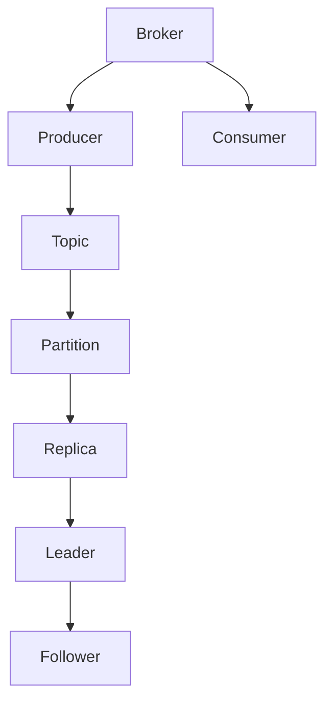
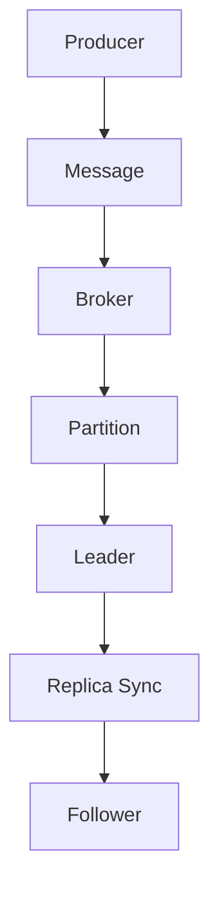

                 

# Kafka Topic原理与代码实例讲解

> **关键词：**Kafka、Topic、分布式消息队列、消息系统、生产者、消费者、分区、副本、副本同步、负载均衡、性能优化、代码实例。

> **摘要：**本文深入探讨了Kafka Topic的原理及其在实际应用中的重要性。我们将通过一步一步的分析，详细讲解Kafka Topic的架构、核心概念、算法原理、数学模型，以及如何通过实际代码实例来理解Kafka Topic的操作过程。最后，文章将讨论Kafka Topic的应用场景，并推荐相关学习资源和工具。

## 1. 背景介绍

### 1.1 目的和范围

本文的目标是帮助读者深入理解Kafka Topic的工作原理和操作方法。通过本文的阅读，读者将能够：

- 理解Kafka Topic的基本概念和架构。
- 掌握Kafka Topic的分区和副本机制。
- 学习如何使用Kafka Topic进行分布式消息处理。
- 分析Kafka Topic的性能优化策略。
- 通过实际代码实例来验证和加深对Kafka Topic的理解。

### 1.2 预期读者

本文适合对Kafka有基本了解的读者，包括：

- Kafka开发者
- 分布式系统工程师
- 大数据工程师
- 对消息队列技术感兴趣的程序员

### 1.3 文档结构概述

本文将按照以下结构进行阐述：

- 背景介绍：介绍本文的目的和预期读者。
- 核心概念与联系：通过Mermaid流程图展示Kafka Topic的架构。
- 核心算法原理 & 具体操作步骤：使用伪代码详细阐述Kafka Topic的操作流程。
- 数学模型和公式 & 详细讲解 & 举例说明：讲解与Kafka Topic相关的数学模型。
- 项目实战：代码实际案例和详细解释说明。
- 实际应用场景：讨论Kafka Topic的实际应用。
- 工具和资源推荐：推荐学习资源和开发工具。
- 总结：未来发展趋势与挑战。
- 附录：常见问题与解答。
- 扩展阅读 & 参考资料：提供进一步学习的资料。

### 1.4 术语表

#### 1.4.1 核心术语定义

- **Kafka Topic：** Kafka中的主题，用于分类和标识消息。
- **分区：** Topic内的一个子集，用于分割消息流。
- **副本：** Partition的备份，用于提高可用性和可靠性。
- **生产者：** 向Kafka Topic发送消息的应用程序。
- **消费者：** 从Kafka Topic读取消息的应用程序。
- **负载均衡：** 分摊到多个分区和副本上的操作，以优化系统性能。

#### 1.4.2 相关概念解释

- **分布式消息队列：** 一种消息传递架构，用于在分布式系统中异步传输数据。
- **消息系统：** 负责接收、存储和发送消息的软件系统。
- **分区：** Kafka中的分区，用于分割消息流，提高系统性能。
- **副本同步：** 将分区数据从主副本同步到副本的过程。

#### 1.4.3 缩略词列表

- **Kafka：** Apache Kafka，一个分布式流处理平台。
- **Kafka Topic：** Kafka中的主题。
- **Zookeeper：** Kafka用于管理元数据的分布式协调服务。

## 2. 核心概念与联系

在深入探讨Kafka Topic之前，我们需要了解Kafka的基本架构和核心概念。以下是一个简单的Mermaid流程图，展示了Kafka Topic的架构：



### 2.1 Kafka架构

- **Broker：** Kafka集群中的服务器节点，负责处理消息的接收和发送。
- **Producer：** 生产者，负责向Kafka Topic发送消息。
- **Consumer：** 消费者，负责从Kafka Topic读取消息。
- **Topic：** Kafka中的主题，用于分类和标识消息。
- **Partition：** Topic内的一个子集，用于分割消息流。
- **Replica：** Partition的备份，用于提高可用性和可靠性。
- **Leader：** Partition的主副本，负责处理读写请求。
- **Follower：** Partition的副本，负责与主副本同步数据。

### 2.2 分区和副本机制

Kafka通过分区和副本机制来实现高可用性和性能优化。

- **分区：** 将消息流分割成多个分区，每个分区由一个或多个副本组成。分区提高了系统性能，因为消息可以并行处理。
- **副本：** 分区的备份，提高了数据的可靠性和可用性。副本机制确保即使在某个副本发生故障时，数据也不会丢失。

### 2.3 副本同步

副本同步是Kafka确保数据一致性的关键机制。以下是一个简化的副本同步流程：



- **Producer：** 生产者发送消息到Leader副本。
- **Broker：** Kafka Broker接收消息。
- **Partition：** 消息存储在Partition中。
- **Leader：** Leader副本负责处理读写请求，并同步数据到Follower副本。
- **Replica Sync：** 数据从Leader副本同步到Follower副本。
- **Follower：** Follower副本接收数据同步，确保与Leader副本数据一致。

通过分区和副本机制，Kafka实现了高吞吐量、低延迟和高可用性的分布式消息处理能力。

## 3. 核心算法原理 & 具体操作步骤

Kafka Topic的操作涉及多个核心算法，包括消息的生产、消费、分区和副本同步等。以下我们将使用伪代码详细阐述这些算法原理和具体操作步骤。

### 3.1 消息生产算法

```python
def produce_message(producer, topic, message):
    """
    生产消息到Kafka Topic。
    
    参数：
    - producer：Kafka生产者。
    - topic：消息要发送到的Topic。
    - message：要发送的消息。
    """
    # 创建消息记录
    record = {
        'topic': topic,
        'key': None,
        'value': message,
        'timestamp': None,
        'partition': None,
    }
    
    # 将消息发送到Kafka Broker
    producer.send(record)
```

### 3.2 消息消费算法

```python
def consume_message(consumer, topic):
    """
    从Kafka Topic消费消息。
    
    参数：
    - consumer：Kafka消费者。
    - topic：要消费的Topic。
    """
    # 订阅Topic
    consumer.subscribe([topic])
    
    # 消费消息
    while True:
        message = consumer.poll(timeout_ms=1000)
        if message is not None:
            # 处理消息
            process_message(message)
```

### 3.3 分区算法

```python
def partition_key_extractor(key):
    """
    提取分区键。
    
    参数：
    - key：分区键。
    """
    # 根据分区键计算分区编号
    partition = hash(key) % num_partitions
    
    return partition
```

### 3.4 副本同步算法

```python
def replica_sync(leader, follower):
    """
    同步副本数据。
    
    参数：
    - leader：主副本。
    - follower：副本。
    """
    # 获取主副本的日志位置
    leader_position = leader.get_log_position()
    
    # 将主副本的日志同步到副本
    follower.fetch_logs_from(leader, leader_position)
    
    # 确保副本数据与主副本一致
    follower.commit_logs_to(leader_position)
```

通过这些算法，Kafka实现了分布式消息队列的高性能和可靠性。

## 4. 数学模型和公式 & 详细讲解 & 举例说明

Kafka Topic的操作涉及多个数学模型和公式，包括分区键计算、副本同步、负载均衡等。以下我们将详细讲解这些模型和公式，并举例说明。

### 4.1 分区键计算

分区键用于将消息分配到不同的分区。分区键计算公式如下：

$$
partition = hash(key) \mod num_partitions
$$

其中，`hash`函数用于计算分区键的哈希值，`key`是分区键，`num_partitions`是分区数。

#### 例子：

假设有一个Topic包含3个分区，分区键为字符串"message_id"。使用MD5哈希函数计算分区键，如下所示：

```python
import hashlib

def partition_key_extractor(key):
    """
    提取分区键。
    
    参数：
    - key：分区键。
    """
    # 计算分区键的MD5哈希值
    hash_value = hashlib.md5(key.encode()).hexdigest()
    
    # 将哈希值转换为整数
    hash_int = int(hash_value, 16)
    
    # 计算分区编号
    partition = hash_int % 3
    
    return partition

# 测试分区键计算
print(partition_key_extractor("message_1"))  # 输出0
print(partition_key_extractor("message_2"))  # 输出1
print(partition_key_extractor("message_3"))  # 输出2
```

### 4.2 副本同步

副本同步确保副本数据与主副本一致。同步过程包括以下步骤：

1. 主副本将日志位置发送给副本。
2. 副本从主副本获取日志。
3. 副本将日志应用到本地日志。
4. 副本将日志提交给主副本。

#### 例子：

假设有一个包含3个分区的Topic，主副本的日志位置为100，副本的日志位置为0。副本同步过程如下：

```python
def replica_sync(leader, follower):
    """
    同步副本数据。
    
    参数：
    - leader：主副本。
    - follower：副本。
    """
    # 获取主副本的日志位置
    leader_position = leader.get_log_position()
    
    # 将主副本的日志发送给副本
    logs = leader.fetch_logs(leader_position)
    
    # 将日志应用到副本的本地日志
    follower.apply_logs(logs)
    
    # 将副本的日志提交给主副本
    follower.commit_logs(leader_position)
```

### 4.3 负载均衡

负载均衡通过将消息分配到不同的分区来实现。负载均衡公式如下：

$$
partition = round robin \mod num_partitions
$$

其中，`round robin`是轮询算法，`num_partitions`是分区数。

#### 例子：

假设有一个包含3个分区的Topic，使用轮询算法分配消息，如下所示：

```python
partition = (last_partition + 1) % 3
```

每次分配消息时，`last_partition`都会更新，确保消息均匀分布在不同的分区。

通过这些数学模型和公式，Kafka实现了高效的分区和副本同步，确保了系统的高性能和可靠性。

## 5. 项目实战：代码实际案例和详细解释说明

为了更好地理解Kafka Topic的操作，我们将通过一个实际的项目实战案例来演示Kafka Topic的生产和消费过程。以下是项目的整体架构和代码实现。

### 5.1 开发环境搭建

在开始项目之前，我们需要搭建Kafka开发环境。以下是搭建步骤：

1. 安装Kafka：从[Apache Kafka官网](https://kafka.apache.org/Downloads)下载并解压Kafka压缩包。
2. 启动Zookeeper：运行Zookeeper服务，通常使用`zookeeper-server-start.sh`脚本。
3. 启动Kafka：运行`kafka-server-start.sh`脚本启动Kafka服务。

### 5.2 源代码详细实现和代码解读

#### 5.2.1 生产者代码实现

以下是一个简单的Kafka生产者代码示例，用于向指定Topic发送消息：

```python
from kafka import KafkaProducer

def produce_message(producer, topic, message):
    """
    生产消息到Kafka Topic。
    
    参数：
    - producer：Kafka生产者。
    - topic：消息要发送到的Topic。
    - message：要发送的消息。
    """
    record = {
        'topic': topic,
        'key': None,
        'value': message,
        'timestamp': None,
        'partition': None,
    }
    
    producer.send(record)
```

解读：

- 导入Kafka生产者模块。
- 定义`produce_message`函数，接收生产者、Topic和消息作为参数。
- 创建消息记录，并设置消息的Topic。
- 调用`producer.send`方法发送消息。

#### 5.2.2 消费者代码实现

以下是一个简单的Kafka消费者代码示例，用于从指定Topic消费消息：

```python
from kafka import KafkaConsumer

def consume_message(consumer, topic):
    """
    从Kafka Topic消费消息。
    
    参数：
    - consumer：Kafka消费者。
    - topic：要消费的Topic。
    """
    consumer.subscribe([topic])
    
    while True:
        message = consumer.poll(timeout_ms=1000)
        if message is not None:
            # 处理消息
            process_message(message)
```

解读：

- 导入Kafka消费者模块。
- 定义`consume_message`函数，接收消费者和Topic作为参数。
- 订阅Topic。
- 使用`consumer.poll`方法轮询消息。
- 如果收到消息，调用`process_message`函数处理消息。

#### 5.2.3 实际代码示例

以下是一个简单的Kafka生产者和消费者实际代码示例：

```python
from kafka import KafkaProducer, KafkaConsumer

# 创建Kafka生产者
producer = KafkaProducer(bootstrap_servers=['localhost:9092'])

# 生产消息
produce_message(producer, 'test_topic', 'Hello, Kafka!')

# 创建Kafka消费者
consumer = KafkaConsumer(bootstrap_servers=['localhost:9092'])

# 消费消息
consume_message(consumer, 'test_topic')
```

解读：

- 创建Kafka生产者和消费者。
- 调用`produce_message`函数生产消息。
- 调用`consume_message`函数消费消息。

通过这个实际代码示例，我们可以看到Kafka生产者和消费者的简单使用方法。在实际应用中，我们可以根据具体需求进行扩展和优化。

## 6. 实际应用场景

Kafka Topic在实际应用中具有广泛的应用场景，以下列举几个常见的应用场景：

### 6.1 实时数据处理

Kafka Topic常用于实时数据处理场景，例如：

- **网站点击流分析：** Kafka Topic可以收集网站点击流数据，实现实时分析，帮助企业实时了解用户行为。
- **金融交易监控：** Kafka Topic可以收集金融交易数据，实现实时监控，帮助金融机构及时了解市场动态。

### 6.2 日志收集

Kafka Topic可以用于收集各种类型的日志，例如：

- **系统日志：** Kafka Topic可以收集系统日志，实现集中式日志管理，方便运维人员进行日志分析。
- **应用日志：** Kafka Topic可以收集应用日志，实现应用性能监控和问题排查。

### 6.3 应用集成

Kafka Topic可以与其他应用系统集成，实现数据传输和共享，例如：

- **消息队列：** Kafka Topic可以作为消息队列，实现分布式系统中的异步通信。
- **数据流处理：** Kafka Topic可以与Apache Flink等流处理框架集成，实现大规模实时数据处理。

### 6.4 其他应用场景

Kafka Topic还适用于其他场景，例如：

- **物联网：** Kafka Topic可以收集物联网设备的数据，实现实时监控和数据分析。
- **大数据处理：** Kafka Topic可以作为大数据处理平台的数据源，实现大规模数据处理和分析。

## 7. 工具和资源推荐

为了更好地学习和开发Kafka，以下推荐一些有用的工具和资源：

### 7.1 学习资源推荐

#### 7.1.1 书籍推荐

- 《Kafka权威指南》
- 《Kafka实战》

#### 7.1.2 在线课程

- Udacity的Kafka课程
- Coursera的Kafka专题课程

#### 7.1.3 技术博客和网站

- Apache Kafka官网
- 实时数据处理的Kafka专栏

### 7.2 开发工具框架推荐

#### 7.2.1 IDE和编辑器

- IntelliJ IDEA
- PyCharm

#### 7.2.2 调试和性能分析工具

- JMX
- Prometheus

#### 7.2.3 相关框架和库

- Apache Flink
- Apache Pulsar

### 7.3 相关论文著作推荐

#### 7.3.1 经典论文

- "Kafka: A Distributed Streaming Platform"（Apache Kafka论文）

#### 7.3.2 最新研究成果

- "Kafka at Scale: Lessons Learned from Facebook"（Facebook关于Kafka的实践经验）

#### 7.3.3 应用案例分析

- "Building Real-Time Analytics at LinkedIn with Kafka"（LinkedIn的Kafka应用案例）

通过这些工具和资源，您可以更好地学习和掌握Kafka。

## 8. 总结：未来发展趋势与挑战

Kafka作为分布式消息队列的领导者，具有广阔的发展前景。未来，Kafka可能会面临以下发展趋势和挑战：

### 8.1 发展趋势

- **云原生：** Kafka将更加适应云原生环境，与容器编排系统（如Kubernetes）更好地集成。
- **实时处理：** Kafka将增强实时数据处理能力，与流处理框架（如Apache Flink）更紧密地结合。
- **性能优化：** Kafka将持续优化性能，提高吞吐量和低延迟。

### 8.2 挑战

- **数据安全：** 随着数据隐私和安全要求的提高，Kafka需要加强数据加密和访问控制。
- **系统兼容性：** 随着技术的发展，Kafka需要不断更新版本，保持与新旧系统的兼容性。
- **生态系统扩展：** Kafka需要持续扩展其生态系统，支持更多应用场景和功能。

通过不断优化和扩展，Kafka将在未来继续发挥重要作用，为分布式系统和大数据处理提供强大的支持。

## 9. 附录：常见问题与解答

### 9.1 如何选择分区数量？

选择分区数量时，应考虑以下因素：

- **消息数量：** 消息数量较多时，应增加分区数量，以实现并行处理。
- **系统性能：** 增加分区数量可以提高系统性能，但也可能导致负载均衡问题。
- **数据一致性：** 分区数量应足够多，以确保数据一致性。

### 9.2 如何优化Kafka性能？

优化Kafka性能的方法包括：

- **调整分区数量：** 根据消息数量和系统性能调整分区数量。
- **提高副本数量：** 增加副本数量可以提高系统可用性和可靠性。
- **优化网络配置：** 调整Kafka网络配置，提高数据传输速度。
- **使用异步IO：** 使用异步IO操作，提高Kafka处理速度。

### 9.3 如何处理Kafka数据丢失？

处理Kafka数据丢失的方法包括：

- **使用副本：** Kafka通过副本机制确保数据不丢失。
- **检查点：** Kafka定期生成检查点，记录当前数据状态。
- **重放日志：** 如果数据丢失，可以重放副本日志来恢复数据。

## 10. 扩展阅读 & 参考资料

- 《Kafka权威指南》
- 《Kafka实战》
- [Apache Kafka官网](https://kafka.apache.org/)
- [Apache Kafka论文](https://kafka.apache.org/threads.html)
- [Facebook关于Kafka的实践经验](https://engineering.fb.com/2016/10/19/infrastructure/kafka-at-scale-lessons-learned-from-facebook/)
- [LinkedIn的Kafka应用案例](https://engineering.oxylabs.io/building-real-time-analytics-at-linkedin-with-kafka/)

