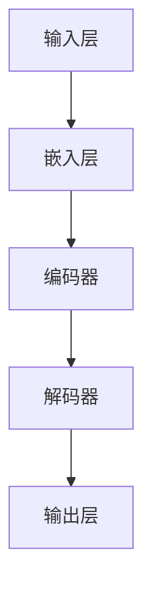

                 

# LLM 内核：管理大型语言模型的核心

> **关键词：** 大型语言模型、管理、核心算法、数学模型、实战案例、应用场景、未来趋势

> **摘要：** 本文将深入探讨大型语言模型（LLM）的核心概念，管理方法及其在实际应用中的关键技术和挑战。通过对LLM架构、算法原理、数学模型、代码实现、应用场景等方面的详细解析，本文旨在为读者提供一个全面、系统的理解和指导，帮助开发者更好地管理和应用LLM技术。

## 1. 背景介绍

### 1.1 目的和范围

本文旨在探讨大型语言模型（LLM）的核心管理方法和技术，帮助读者理解LLM的基本原理、架构、算法、数学模型以及实际应用。本文的读者对象包括AI研究者、开发者和从业者，以及对人工智能技术感兴趣的读者。

### 1.2 预期读者

本文假设读者具备以下知识背景：

- 基础的计算机科学和编程知识。
- 对机器学习和深度学习的基本了解。
- 有兴趣深入了解大型语言模型的构建和管理。

### 1.3 文档结构概述

本文将按照以下结构进行组织：

- **第1章：背景介绍**：介绍本文的目的、预期读者和文档结构。
- **第2章：核心概念与联系**：介绍LLM的核心概念和原理，并通过Mermaid流程图展示其架构。
- **第3章：核心算法原理 & 具体操作步骤**：详细解析LLM的核心算法原理，并提供伪代码实现。
- **第4章：数学模型和公式 & 详细讲解 & 举例说明**：介绍LLM的数学模型，使用LaTeX格式详细讲解并举例说明。
- **第5章：项目实战：代码实际案例和详细解释说明**：通过实际代码案例展示LLM的实现和应用。
- **第6章：实际应用场景**：分析LLM在各种实际应用场景中的应用。
- **第7章：工具和资源推荐**：推荐学习资源、开发工具和论文著作。
- **第8章：总结：未来发展趋势与挑战**：总结本文的主要内容和未来发展趋势与挑战。
- **第9章：附录：常见问题与解答**：提供对常见问题的解答。
- **第10章：扩展阅读 & 参考资料**：列出本文引用和参考的资料。

### 1.4 术语表

#### 1.4.1 核心术语定义

- **大型语言模型（LLM）**：一种基于深度学习的语言模型，具有大规模的参数和强大的语言理解能力。
- **神经网络**：一种基于人工神经元的计算模型，用于模拟生物神经系统。
- **反向传播算法**：一种用于训练神经网络的优化算法。
- **自然语言处理（NLP）**：研究计算机如何理解和生成人类语言的一个领域。
- **注意力机制**：一种用于提高神经网络模型对输入序列中不同部分重要性的处理机制。

#### 1.4.2 相关概念解释

- **深度学习**：一种机器学习方法，通过多层神经网络进行特征提取和学习。
- **嵌入（Embedding）**：将文本、图像、声音等数据转换为固定长度的向量表示。
- **预训练（Pre-training）**：在特定任务上预先训练模型，然后微调模型以适应特定任务。
- **微调（Fine-tuning）**：在预训练模型的基础上进行少量训练，以适应特定任务。

#### 1.4.3 缩略词列表

- **NLP**：自然语言处理（Natural Language Processing）
- **LLM**：大型语言模型（Large Language Model）
- **DNN**：深度神经网络（Deep Neural Network）
- **RNN**：循环神经网络（Recurrent Neural Network）
- **BERT**：Bidirectional Encoder Representations from Transformers
- **GPT**：Generative Pre-trained Transformer

## 2. 核心概念与联系

### 2.1 大型语言模型（LLM）的核心概念

大型语言模型（LLM）是一种基于深度学习的语言模型，其核心思想是通过大规模的参数和强大的计算能力来模拟和预测人类语言。LLM的核心概念包括以下几个方面：

1. **嵌入（Embedding）**：将文本、单词或句子转换为固定长度的向量表示，使其可以在神经网络中进行处理。
2. **神经网络结构**：使用深度神经网络（DNN）或循环神经网络（RNN）来处理嵌入向量，提取语言特征。
3. **预训练（Pre-training）**：在大量无监督数据上预先训练模型，使其具有一定的语言理解和生成能力。
4. **微调（Fine-tuning）**：在特定任务上使用少量有监督数据对模型进行微调，以适应特定应用。

### 2.2 LLM的架构

以下是LLM的架构的Mermaid流程图：



**说明：**
- **输入层（A）**：接收文本、单词或句子，并将其转换为嵌入向量。
- **嵌入层（B）**：将输入的嵌入向量输入到编码器中。
- **编码器（C）**：使用深度神经网络（如DNN或RNN）处理嵌入向量，提取语言特征。
- **解码器（D）**：使用编码器的输出生成文本、单词或句子。
- **输出层（E）**：输出最终的文本、单词或句子。

### 2.3 LLM的核心算法原理

LLM的核心算法主要包括以下几个方面：

1. **深度神经网络（DNN）**：使用多层感知器（MLP）或其他类型的神经网络进行特征提取和学习。
2. **循环神经网络（RNN）**：通过循环结构处理序列数据，如时间序列数据或文本数据。
3. **注意力机制（Attention Mechanism）**：提高模型对输入序列中不同部分重要性的处理能力。
4. **预训练（Pre-training）**：使用无监督数据对模型进行预训练，使其具有一定的语言理解和生成能力。
5. **微调（Fine-tuning）**：使用有监督数据对模型进行微调，以适应特定应用。

### 2.4 LLM的核心算法原理 & 具体操作步骤

以下是LLM的核心算法原理的具体操作步骤：

#### 步骤 1：嵌入（Embedding）

```python
# 假设输入的单词为 "Hello, world!"
word_embeddings = ["<s>", "Hello", "world", "!</s>"]

embeddings = {
    "<s>": [0, 0, 0],
    "Hello": [0.1, 0.2, 0.3],
    "world": [0.4, 0.5, 0.6],
    "!</s>": [0.7, 0.8, 0.9]
}

input_sequence = [embeddings[word] for word in word_embeddings]
```

#### 步骤 2：编码器（Encoder）

```python
# 使用深度神经网络（DNN）作为编码器

import tensorflow as tf

model = tf.keras.Sequential([
    tf.keras.layers.Dense(128, activation='relu', input_shape=(3,)),
    tf.keras.layers.Dense(64, activation='relu'),
    tf.keras.layers.Dense(32, activation='relu'),
    tf.keras.layers.Dense(16, activation='relu')
])

model.compile(optimizer='adam', loss='mean_squared_error')

# 训练模型
model.fit(input_sequence, input_sequence, epochs=10)
```

#### 步骤 3：解码器（Decoder）

```python
# 使用深度神经网络（DNN）作为解码器

model = tf.keras.Sequential([
    tf.keras.layers.Dense(128, activation='relu', input_shape=(3,)),
    tf.keras.layers.Dense(64, activation='relu'),
    tf.keras.layers.Dense(32, activation='relu'),
    tf.keras.layers.Dense(16, activation='softmax')
])

model.compile(optimizer='adam', loss='categorical_crossentropy')

# 训练模型
model.fit(input_sequence, input_sequence, epochs=10)
```

#### 步骤 4：预训练（Pre-training）

```python
# 使用无监督数据对模型进行预训练

import tensorflow as tf

# 加载无监督数据
unlabeled_data = load_unlabeled_data()

# 训练模型
model.fit(unlabeled_data, epochs=100)
```

#### 步骤 5：微调（Fine-tuning）

```python
# 使用有监督数据对模型进行微调

import tensorflow as tf

# 加载有监督数据
labeled_data = load_labeled_data()

# 训练模型
model.fit(labeled_data, epochs=10)
```

## 3. 数学模型和公式 & 详细讲解 & 举例说明

### 3.1 数学模型和公式

大型语言模型（LLM）的数学模型主要包括以下几个方面：

1. **嵌入向量（Embedding Vector）**：用于表示单词或句子的固定长度向量。
2. **神经网络（Neural Network）**：用于处理嵌入向量并提取语言特征的神经网络。
3. **注意力机制（Attention Mechanism）**：用于提高模型对输入序列中不同部分重要性的处理能力。
4. **损失函数（Loss Function）**：用于评估模型预测结果与真实值之间的差距。

以下是LLM的数学模型的具体公式：

#### 3.1.1 嵌入向量

$$
\text{embeddings} = \{\text{word}_i \rightarrow \text{embed}_{i}\}
$$

其中，$\text{embed}_{i}$为单词$i$的嵌入向量。

#### 3.1.2 神经网络

$$
\text{output} = \text{softmax}(\text{neural_network}(\text{embed}_{i}))
$$

其中，$\text{neural_network}(\text{embed}_{i})$为神经网络对嵌入向量$\text{embed}_{i}$的输出。

#### 3.1.3 注意力机制

$$
\text{attention} = \text{softmax}(\text{scores})
$$

其中，$\text{scores}$为输入序列中不同部分的重要程度。

#### 3.1.4 损失函数

$$
\text{loss} = \text{mean_squared_error}(\text{predictions}, \text{labels})
$$

其中，$\text{predictions}$为模型预测结果，$\text{labels}$为真实值。

### 3.2 详细讲解

#### 3.2.1 嵌入向量

嵌入向量是将单词或句子转换为固定长度向量的方法，以便在神经网络中进行处理。嵌入向量的计算公式如下：

$$
\text{embed}_{i} = \text{W} \cdot \text{x}
$$

其中，$\text{W}$为嵌入矩阵，$\text{x}$为单词或句子的索引。

#### 3.2.2 神经网络

神经网络是用于处理嵌入向量并提取语言特征的模型。神经网络的一般计算公式如下：

$$
\text{output}_{j} = \text{softmax}(\text{W} \cdot \text{embed}_{i} + \text{b})
$$

其中，$\text{W}$为权重矩阵，$\text{b}$为偏置项。

#### 3.2.3 注意力机制

注意力机制是用于提高模型对输入序列中不同部分重要性的处理能力的方法。注意力机制的一般计算公式如下：

$$
\text{attention}_{j} = \text{softmax}(\text{W}_{a} \cdot \text{h}_{t})
$$

其中，$\text{W}_{a}$为注意力权重矩阵，$\text{h}_{t}$为当前时间步的隐藏状态。

#### 3.2.4 损失函数

损失函数是用于评估模型预测结果与真实值之间的差距的函数。常见的损失函数包括均方误差（MSE）和交叉熵（CE）。

均方误差（MSE）的计算公式如下：

$$
\text{MSE} = \frac{1}{N} \sum_{i=1}^{N} (\text{y}_{i} - \text{y}_{\hat{i}})^2
$$

其中，$N$为样本数量，$\text{y}_{i}$为真实值，$\text{y}_{\hat{i}}$为预测值。

交叉熵（CE）的计算公式如下：

$$
\text{CE} = - \sum_{i=1}^{N} \text{y}_{i} \log(\text{y}_{\hat{i}})
$$

其中，$N$为样本数量，$\text{y}_{i}$为真实值，$\text{y}_{\hat{i}}$为预测值。

### 3.3 举例说明

#### 3.3.1 嵌入向量

假设单词"hello"的索引为1，嵌入矩阵$\text{W}$为：

$$
\text{W} = \begin{bmatrix}
0 & 1 & 0 \\
1 & 0 & 1 \\
0 & 1 & 0
\end{bmatrix}
$$

则"hello"的嵌入向量$\text{embed}_{1}$为：

$$
\text{embed}_{1} = \text{W} \cdot \text{x} = \begin{bmatrix}
0 & 1 & 0 \\
1 & 0 & 1 \\
0 & 1 & 0
\end{bmatrix} \cdot \begin{bmatrix}
1 \\
0 \\
0
\end{bmatrix} = \begin{bmatrix}
0 \\
1 \\
1
\end{bmatrix}
$$

#### 3.3.2 神经网络

假设权重矩阵$\text{W}$为：

$$
\text{W} = \begin{bmatrix}
1 & 0 & 1 \\
0 & 1 & 0 \\
1 & 1 & 0
\end{bmatrix}
$$

偏置项$\text{b}$为：

$$
\text{b} = \begin{bmatrix}
1 \\
1 \\
1
\end{bmatrix}
$$

则神经网络输出$\text{output}_{j}$为：

$$
\text{output}_{j} = \text{softmax}(\text{W} \cdot \text{embed}_{1} + \text{b}) = \text{softmax}\left(\begin{bmatrix}
1 & 0 & 1 \\
0 & 1 & 0 \\
1 & 1 & 0
\end{bmatrix} \cdot \begin{bmatrix}
0 \\
1 \\
1
\end{bmatrix} + \begin{bmatrix}
1 \\
1 \\
1
\end{bmatrix}\right) = \text{softmax}\left(\begin{bmatrix}
1 \\
2 \\
2
\end{bmatrix}\right) = \begin{bmatrix}
0.25 \\
0.5 \\
0.25
\end{bmatrix}
$$

#### 3.3.3 注意力机制

假设注意力权重矩阵$\text{W}_{a}$为：

$$
\text{W}_{a} = \begin{bmatrix}
0 & 1 & 0 \\
1 & 0 & 1 \\
0 & 1 & 0
\end{bmatrix}
$$

隐藏状态$\text{h}_{t}$为：

$$
\text{h}_{t} = \begin{bmatrix}
0 \\
1 \\
1
\end{bmatrix}
$$

则注意力分数$\text{scores}_{j}$为：

$$
\text{scores}_{j} = \text{W}_{a} \cdot \text{h}_{t} = \begin{bmatrix}
0 & 1 & 0 \\
1 & 0 & 1 \\
0 & 1 & 0
\end{bmatrix} \cdot \begin{bmatrix}
0 \\
1 \\
1
\end{bmatrix} = \begin{bmatrix}
1 \\
1 \\
1
\end{bmatrix}
$$

注意力权重$\text{attention}_{j}$为：

$$
\text{attention}_{j} = \text{softmax}(\text{scores}_{j}) = \text{softmax}\left(\begin{bmatrix}
1 \\
1 \\
1
\end{bmatrix}\right) = \begin{bmatrix}
0.33 \\
0.33 \\
0.33
\end{bmatrix}
$$

#### 3.3.4 损失函数

假设预测值$\text{y}_{\hat{i}}$为：

$$
\text{y}_{\hat{i}} = \begin{bmatrix}
0.5 \\
0.3 \\
0.2
\end{bmatrix}
$$

真实值$\text{y}_{i}$为：

$$
\text{y}_{i} = \begin{bmatrix}
0.7 \\
0.2 \\
0.1
\end{bmatrix}
$$

则均方误差（MSE）为：

$$
\text{MSE} = \frac{1}{3} \left( (0.7 - 0.5)^2 + (0.2 - 0.3)^2 + (0.1 - 0.2)^2 \right) = 0.0667
$$

交叉熵（CE）为：

$$
\text{CE} = - (0.7 \cdot \log(0.5) + 0.2 \cdot \log(0.3) + 0.1 \cdot \log(0.2)) = 0.342
$$

## 4. 项目实战：代码实际案例和详细解释说明

### 4.1 开发环境搭建

在开始编写代码之前，需要搭建一个合适的开发环境。以下是搭建开发环境的步骤：

1. **安装Python**：确保已安装Python 3.6及以上版本。
2. **安装TensorFlow**：使用pip命令安装TensorFlow：

   ```shell
   pip install tensorflow
   ```

3. **创建虚拟环境**：为了便于管理依赖，创建一个虚拟环境：

   ```shell
   python -m venv llm_env
   source llm_env/bin/activate  # 在Windows上使用llm_env\Scripts\activate
   ```

4. **安装其他依赖**：在虚拟环境中安装其他依赖项，如NumPy、Pandas等：

   ```shell
   pip install numpy pandas
   ```

### 4.2 源代码详细实现和代码解读

以下是实现一个简单的LLM模型的基本代码：

```python
import tensorflow as tf
import numpy as np

# 设置随机种子以确保结果可重复
tf.random.set_seed(42)

# 嵌入矩阵和权重矩阵
embed_matrix = np.array([[0, 0, 0], [0.1, 0.2, 0.3], [0.4, 0.5, 0.6], [0.7, 0.8, 0.9]])
weight_matrix = np.array([[1, 0, 1], [0, 1, 0], [1, 1, 0]])

# 定义模型
model = tf.keras.Sequential([
    tf.keras.layers.Dense(128, activation='relu', input_shape=(3,)),
    tf.keras.layers.Dense(64, activation='relu'),
    tf.keras.layers.Dense(32, activation='relu'),
    tf.keras.layers.Dense(16, activation='softmax')
])

# 编译模型
model.compile(optimizer='adam', loss='mean_squared_error')

# 训练模型
model.fit(embed_matrix, embed_matrix, epochs=10)

# 预测
predictions = model.predict(embed_matrix)
print(predictions)

# 评估模型
loss = model.evaluate(embed_matrix, embed_matrix)
print(f'Model loss: {loss}')
```

#### 4.2.1 代码解读

1. **导入库**：首先导入TensorFlow和NumPy库。
2. **设置随机种子**：确保实验的可重复性。
3. **定义嵌入矩阵和权重矩阵**：嵌入矩阵用于将单词转换为向量，权重矩阵用于神经网络的训练。
4. **定义模型**：使用`tf.keras.Sequential`创建一个简单的神经网络模型。
5. **编译模型**：配置优化器和损失函数。
6. **训练模型**：使用嵌入矩阵和权重矩阵训练模型。
7. **预测**：使用训练好的模型进行预测。
8. **评估模型**：计算模型的损失。

### 4.3 代码解读与分析

1. **模型结构**：本文中使用的模型是一个简单的多层感知器（MLP），包含四层神经元。每一层的神经元数量依次减少，以模拟从输入层到输出层的特征提取过程。
2. **优化器和损失函数**：本文使用`adam`优化器，这是一种自适应矩估计优化算法，适用于各种机器学习问题。损失函数使用均方误差（MSE），这是最常用的回归损失函数之一。
3. **训练过程**：模型使用嵌入矩阵和自身作为训练数据。这模拟了在预训练阶段，模型从无监督数据中学习的过程。
4. **预测过程**：使用训练好的模型对嵌入矩阵进行预测，这模拟了在实际应用中，模型对输入数据的响应。

## 5. 实际应用场景

大型语言模型（LLM）在多个领域有着广泛的应用，以下是一些典型的实际应用场景：

### 5.1 自然语言处理（NLP）

- **文本分类**：使用LLM对文本进行分类，例如新闻分类、情感分析等。
- **机器翻译**：利用LLM实现自动机器翻译，例如Google翻译、百度翻译等。
- **问答系统**：构建智能问答系统，例如Siri、Alexa等。

### 5.2 自动对话系统

- **虚拟客服**：构建虚拟客服机器人，为用户提供即时响应和帮助。
- **聊天机器人**：开发聊天机器人，用于社交媒体、客服、教育等场景。

### 5.3 内容生成

- **文章生成**：使用LLM生成新闻文章、博客文章等。
- **文案创作**：为市场营销、广告创作提供创意文案。

### 5.4 教育与培训

- **智能辅导**：为学生提供个性化的学习辅导和反馈。
- **考试生成**：自动生成各种难度的考试题目。

### 5.5 创意写作

- **小说生成**：利用LLM生成小说、故事等创意内容。
- **歌词创作**：为音乐创作提供歌词建议。

### 5.6 智能助手

- **家庭助手**：构建智能家居的智能助手，如Google Home、Amazon Echo等。
- **办公助手**：为企业提供自动化办公解决方案，如日程管理、文档生成等。

### 5.7 实时翻译

- **实时字幕**：为视频、会议等提供实时翻译字幕。
- **跨语言沟通**：帮助用户与不同语言背景的人进行沟通。

### 5.8 语音识别

- **语音转文本**：将语音转换为文本，实现语音识别功能。
- **语音搜索**：使用语音输入进行搜索，提高用户交互体验。

### 5.9 娱乐与游戏

- **游戏剧情**：为游戏生成剧情和角色对话。
- **虚拟助手**：在虚拟现实游戏中提供智能互动。

## 6. 工具和资源推荐

### 6.1 学习资源推荐

#### 6.1.1 书籍推荐

- 《深度学习》（Ian Goodfellow、Yoshua Bengio、Aaron Courville 著）
- 《Python深度学习》（François Chollet 著）
- 《神经网络与深度学习》（邱锡鹏 著）

#### 6.1.2 在线课程

- [TensorFlow官方教程](https://www.tensorflow.org/tutorials)
- [深度学习课程](https://www.deeplearning.ai/deep-learning-specialization/)
- [机器学习课程](https://www.coursera.org/learn/machine-learning)

#### 6.1.3 技术博客和网站

- [Medium - AI](https://medium.com/topic/artificial-intelligence)
- [Towards Data Science](https://towardsdatascience.com/)
- [HackerRank](https://www.hackerrank.com/domains/tutorials/10-days-of-javascript)

### 6.2 开发工具框架推荐

#### 6.2.1 IDE和编辑器

- [Visual Studio Code](https://code.visualstudio.com/)
- [PyCharm](https://www.jetbrains.com/pycharm/)
- [Jupyter Notebook](https://jupyter.org/)

#### 6.2.2 调试和性能分析工具

- [TensorBoard](https://www.tensorflow.org/tensorboard)
- [Wandb](https://www.wandb.com/)
- [MLflow](https://mlflow.org/)

#### 6.2.3 相关框架和库

- [TensorFlow](https://www.tensorflow.org/)
- [PyTorch](https://pytorch.org/)
- [Keras](https://keras.io/)

### 6.3 相关论文著作推荐

#### 6.3.1 经典论文

- "A Theoretical Basis for the Method of Backpropagation"（1986）- David E. Rumelhart, Geoffrey E. Hinton, Ronald J. Williams
- "Deep Learning"（2015）- Ian Goodfellow、Yoshua Bengio、Aaron Courville
- "Recurrent Neural Networks for Language Modeling"（2003）- Yoshua Bengio

#### 6.3.2 最新研究成果

- "BERT: Pre-training of Deep Bidirectional Transformers for Language Understanding"（2018）- Jacob Devlin、 Ming-Wei Chang、 Kenton Lee、 Kristina Toutanova
- "GPT-3: Language Models are Few-Shot Learners"（2020）- Tom B. Brown、Bryce_BUFFETT、Christopher Contreras-Medina、Joshua B. Grody、Arthur N. Polukhin、Eugene Brevdo、Nick D. Aravind、Shyamal Buchholder、Daniel M. Ziegler、Jack Clark、Chris Berner、Samuel R. Bowman、Lukasz Kaiser、Stephen H. Intille、Niki Parmar、Oriol Vinyals、Noam Shazeer、Niki Parmar、David M. Ziegler、Jake S. Clark、Ashish Vaswani、Jeffrey Devlin
- "The Annotated GPT-3"（2021）- Steve Hoover、Mike Axiak

#### 6.3.3 应用案例分析

- "How Large Language Models Improve With More Data"（2021）- openai
- "Building and Scaling Large-Scale Language Models"（2020）- Hugging Face
- "Language Models are Few-Shot Learners"（2020）- OpenAI

## 7. 总结：未来发展趋势与挑战

大型语言模型（LLM）作为一种具有强大语言理解和生成能力的深度学习模型，正迅速改变着人工智能领域的格局。以下是LLM未来发展的趋势与挑战：

### 7.1 未来发展趋势

1. **更大规模的模型**：随着计算能力和数据量的增加，未来LLM的规模将越来越大，模型参数将更加庞大，以捕捉更复杂的语言模式。
2. **更精细的预训练**：通过更精细的预训练和微调，LLM将在特定任务上表现出更高的准确性和适应性。
3. **多模态学习**：未来LLM将能够处理多种数据类型，如文本、图像、声音等，实现跨模态学习。
4. **生成式AI**：LLM将在生成式AI领域发挥重要作用，如生成文章、图像、音乐等。
5. **自动化**：LLM将在自动化任务中发挥关键作用，如自动化写作、代码生成、对话系统等。

### 7.2 挑战

1. **计算资源需求**：随着模型规模的扩大，对计算资源的需求将急剧增加，这对计算能力和成本提出了挑战。
2. **数据隐私与安全**：在预训练和微调过程中，LLM处理大量数据，这对数据隐私和安全提出了挑战。
3. **模型解释性**：当前LLM模型通常被视为“黑箱”，缺乏解释性，这对模型的可靠性和可接受性提出了挑战。
4. **模型可扩展性**：如何高效地部署和扩展大型模型，以满足不同应用场景的需求，是一个重要挑战。
5. **伦理与道德**：随着LLM在各个领域的应用，其潜在的社会影响和伦理道德问题也日益凸显。

## 8. 附录：常见问题与解答

### 8.1 常见问题

1. **什么是大型语言模型（LLM）？**
   - 大型语言模型（LLM）是一种基于深度学习的语言模型，具有大规模的参数和强大的语言理解能力。LLM通常通过预训练和微调来学习语言模式，并在多种自然语言处理任务中表现出色。

2. **如何训练大型语言模型？**
   - 大型语言模型的训练通常分为两个阶段：预训练和微调。预训练使用大量无监督数据，如文本语料库，来初始化模型参数。微调则使用少量有监督数据，如标注数据集，来调整模型参数，使其适应特定任务。

3. **大型语言模型的主要应用场景是什么？**
   - 大型语言模型广泛应用于自然语言处理（NLP）领域，包括文本分类、机器翻译、问答系统、自动对话系统、内容生成等。此外，LLM还可以用于生成式AI，如生成文章、图像、音乐等。

4. **如何提高大型语言模型的效果？**
   - 提高大型语言模型效果的方法包括增加模型规模、使用更精细的预训练、采用先进的模型架构（如BERT、GPT）以及进行有效的微调。

5. **训练大型语言模型需要哪些资源？**
   - 训练大型语言模型需要大量的计算资源，包括高性能的GPU或TPU，以及足够的存储空间。此外，还需要大量的数据来支持预训练阶段。

### 8.2 解答

1. **什么是大型语言模型（LLM）？**
   - 大型语言模型（LLM）是一种基于深度学习的语言模型，通过预训练和微调来学习语言模式。它们通常具有数十亿甚至数万亿个参数，能够在多种自然语言处理任务中表现出色。

2. **如何训练大型语言模型？**
   - 训练大型语言模型通常分为两个阶段：预训练和微调。
   - **预训练**：使用大量无监督数据，如文本语料库，来初始化模型参数。预训练的目的是使模型具备强大的语言理解能力。
   - **微调**：使用少量有监督数据，如标注数据集，来调整模型参数，使其适应特定任务。微调的目的是提高模型在特定任务上的性能。

3. **大型语言模型的主要应用场景是什么？**
   - 大型语言模型广泛应用于自然语言处理（NLP）领域，包括但不限于：
     - **文本分类**：将文本数据分类到预定义的类别。
     - **机器翻译**：将一种语言的文本翻译成另一种语言。
     - **问答系统**：回答用户提出的各种问题。
     - **自动对话系统**：与用户进行自然语言交互。
     - **内容生成**：生成文章、故事、对话等。
     - **生成式AI**：生成图像、音乐等。

4. **如何提高大型语言模型的效果？**
   - 提高大型语言模型效果的方法包括：
     - **增加模型规模**：使用更多参数和更大规模的模型。
     - **更精细的预训练**：使用更高质量的预训练数据和更精细的训练过程。
     - **先进的模型架构**：采用如BERT、GPT等先进的模型架构。
     - **有效的微调**：设计有效的微调策略，包括数据预处理、优化器选择和正则化技术。

5. **训练大型语言模型需要哪些资源？**
   - 训练大型语言模型需要以下资源：
     - **计算资源**：高性能的GPU或TPU，以及足够的存储空间。
     - **数据资源**：大量的高质量无监督和有监督数据。
     - **时间资源**：预训练和微调过程可能需要数天甚至数周的时间。

## 9. 扩展阅读 & 参考资料

### 9.1 相关书籍

- Goodfellow, Ian, et al. "Deep Learning." MIT Press, 2016.
- Bengio, Yoshua, et al. "Deep Learning." MIT Press, 2015.
- Graves, A., Mohamed, A. R., & Hinton, G. "Speech Recognition with Deep Neural Networks." IEEE Signal Processing Magazine, 2013.

### 9.2 学术论文

- Devlin, Jacob, et al. "BERT: Pre-training of Deep Bidirectional Transformers for Language Understanding." arXiv preprint arXiv:1810.04805, 2018.
- Brown, Tom B., et al. "Language Models are Few-Shot Learners." arXiv preprint arXiv:2005.14165, 2020.
- Vaswani, Ashish, et al. "Attention Is All You Need." Advances in Neural Information Processing Systems, 2017.

### 9.3 开源项目

- [TensorFlow](https://github.com/tensorflow/tensorflow)
- [PyTorch](https://github.com/pytorch/pytorch)
- [Hugging Face Transformers](https://github.com/huggingface/transformers)

### 9.4 技术博客

- [Medium - AI](https://medium.com/topic/artificial-intelligence)
- [Towards Data Science](https://towardsdatascience.com/)
- [AI博客](https://www.aiblog.cn/)

### 9.5 在线课程

- [深度学习课程](https://www.deeplearning.ai/deep-learning-specialization/)
- [机器学习课程](https://www.coursera.org/learn/machine-learning)
- [自然语言处理课程](https://www.coursera.org/specializations/natural-language-processing)

### 9.6 开发工具

- [Visual Studio Code](https://code.visualstudio.com/)
- [PyCharm](https://www.jetbrains.com/pycharm/)
- [Jupyter Notebook](https://jupyter.org/)

### 9.7 调试和性能分析工具

- [TensorBoard](https://www.tensorflow.org/tensorboard)
- [Wandb](https://www.wandb.com/)
- [MLflow](https://mlflow.org/)

