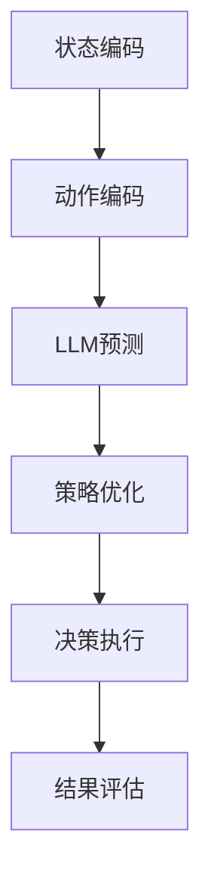

                 

# LLM 在 Agent 中的角色

> **关键词**：语言模型（LLM），代理（Agent），人工智能，决策，交互，学习，动态规划

> **摘要**：本文将深入探讨语言模型（LLM）在代理系统中的关键角色，通过分析其在决策、交互和学习等方面的应用，阐述其如何提升代理的智能和效率。文章将从背景介绍、核心概念与联系、算法原理、数学模型、项目实战、实际应用场景等多个方面，系统性地剖析LLM在代理系统中的具体作用和实现方式。

## 1. 背景介绍

### 1.1 目的和范围

本文旨在探讨语言模型（LLM）在代理系统中的应用，重点分析其核心作用和实现方法。通过本文的阅读，读者将了解：

- 语言模型的基本原理及其在代理系统中的重要性。
- LLM如何参与代理的决策过程，提高其智能水平。
- LLM在代理交互和学习中的作用，以及具体的实现步骤。
- LLM在不同实际应用场景中的表现和效果。

### 1.2 预期读者

本文适合以下读者群体：

- 对人工智能和代理系统有一定了解的技术人员。
- 想要深入了解LLM在代理系统中应用的开发者。
- 对决策模型、学习算法和数学模型有兴趣的研究者。

### 1.3 文档结构概述

本文将分为以下几个部分：

- 第1部分：背景介绍，包括目的和范围、预期读者、文档结构概述和术语表。
- 第2部分：核心概念与联系，介绍LLM和代理系统的基本原理，以及它们之间的联系。
- 第3部分：核心算法原理 & 具体操作步骤，详细解释LLM在代理系统中的算法原理和操作步骤。
- 第4部分：数学模型和公式 & 详细讲解 & 举例说明，阐述LLM在代理系统中的数学模型和计算方法。
- 第5部分：项目实战：代码实际案例和详细解释说明，通过实际案例展示LLM在代理系统中的具体应用。
- 第6部分：实际应用场景，分析LLM在代理系统中的实际应用场景和效果。
- 第7部分：工具和资源推荐，介绍学习资源、开发工具框架和最新研究成果。
- 第8部分：总结：未来发展趋势与挑战，总结LLM在代理系统中的应用现状和未来发展方向。
- 第9部分：附录：常见问题与解答，针对读者可能遇到的常见问题进行解答。
- 第10部分：扩展阅读 & 参考资料，提供更多的扩展阅读资料。

### 1.4 术语表

#### 1.4.1 核心术语定义

- **语言模型（Language Model，LLM）**：一种统计模型，用于对自然语言文本进行概率分布预测。常见的LLM包括基于神经网络的Transformer模型和基于循环神经网络的RNN模型。
- **代理（Agent）**：在人工智能领域，指具有一定智能，能够在特定环境中自主执行任务和决策的实体。代理可以是机器人、软件程序或者虚拟智能体。
- **决策过程**：代理在执行任务时，根据当前状态选择最优行动的过程。
- **交互**：代理与外部环境或其他代理进行的信息交换和互动。
- **学习**：代理在执行任务过程中，通过经验积累和参数调整，提高其任务执行能力的过程。

#### 1.4.2 相关概念解释

- **状态（State）**：代理所处的环境描述，通常用一组特征向量表示。
- **动作（Action）**：代理可以执行的操作，用于改变自身状态。
- **奖励（Reward）**：代理执行动作后获得的回报，用于评估动作的好坏。
- **策略（Policy）**：代理在给定状态下选择动作的规则或函数。

#### 1.4.3 缩略词列表

- **LLM**：Language Model（语言模型）
- **Agent**：Agent（代理）
- **AI**：Artificial Intelligence（人工智能）
- **RNN**：Recurrent Neural Network（循环神经网络）
- **Transformer**：Transformer（Transformer模型）

## 2. 核心概念与联系

### 2.1 语言模型（LLM）的基本原理

语言模型（LLM）是一种对自然语言文本进行概率预测的统计模型。常见的LLM包括基于神经网络的Transformer模型和基于循环神经网络的RNN模型。

- **Transformer模型**：基于自注意力机制的深度神经网络，能够有效处理长距离依赖问题。
- **RNN模型**：通过循环结构对序列数据进行建模，能够捕捉序列中的时间依赖关系。

LLM的核心思想是通过大量文本数据进行训练，学习到文本中各个词之间的概率分布关系。在给定一个输入序列时，LLM能够预测下一个词的概率分布，从而生成自然流畅的文本。

### 2.2 代理（Agent）的基本原理

代理（Agent）是人工智能领域中的一个重要概念，指具有智能的实体，能够在特定环境中自主执行任务和决策。代理可以分为以下几个类别：

- **基于规则的代理**：通过预定义的规则进行决策，适用于结构化问题。
- **基于模型的代理**：使用模型（如决策树、神经网络等）进行决策，适用于复杂问题。
- **基于学习的代理**：通过学习环境中的数据，自主调整策略，适用于动态环境。

代理的核心功能包括感知、决策、执行和评估。代理在执行任务时，通常经历以下步骤：

1. **感知**：获取当前状态。
2. **决策**：根据当前状态选择最优动作。
3. **执行**：执行选定的动作。
4. **评估**：根据执行结果调整策略。

### 2.3 LLM在代理系统中的应用

将LLM应用于代理系统，可以提升代理的智能和效率。LLM在代理系统中的作用主要体现在以下几个方面：

1. **决策辅助**：LLM可以辅助代理进行决策，通过预测未来的状态和奖励，为代理提供决策依据。
2. **交互增强**：LLM可以用于生成自然语言对话，增强代理与用户或其他代理的交互能力。
3. **学习优化**：LLM可以用于优化代理的学习过程，通过生成新的训练数据，加快代理的收敛速度。

### 2.4 LLM在代理系统中的具体实现

LLM在代理系统中的具体实现可以分为以下几个步骤：

1. **状态编码**：将代理所处的状态编码为向量表示，用于输入LLM。
2. **动作编码**：将代理可执行的动作编码为向量表示，用于输入LLM。
3. **LLM预测**：使用LLM预测给定状态和动作下的未来状态和奖励。
4. **策略优化**：根据LLM预测的结果，优化代理的策略，提高其决策能力。

### 2.5 Mermaid 流程图

以下是一个简单的Mermaid流程图，展示LLM在代理系统中的实现流程：



## 3. 核心算法原理 & 具体操作步骤

### 3.1 语言模型（LLM）的算法原理

语言模型（LLM）的核心算法原理是基于神经网络对自然语言文本进行概率预测。以下是LLM的算法原理和具体操作步骤：

#### 3.1.1 Transformer模型

Transformer模型是一种基于自注意力机制的深度神经网络，能够有效处理长距离依赖问题。其基本原理如下：

1. **输入编码**：将输入文本编码为词向量表示。
2. **自注意力机制**：计算词向量之间的注意力权重，对词向量进行加权求和。
3. **多层神经网络**：通过多个Transformer层，不断提取文本特征。
4. **输出编码**：将提取到的特征编码为输出词向量，用于预测下一个词的概率分布。

#### 3.1.2 RNN模型

RNN模型是一种基于循环神经网络的深度神经网络，能够捕捉序列中的时间依赖关系。其基本原理如下：

1. **输入编码**：将输入文本编码为词向量表示。
2. **循环神经网络**：通过循环结构对序列数据进行建模，更新内部状态。
3. **门控机制**：引入门控机制，控制信息的流入和流出，提高模型的表达能力。
4. **输出编码**：将最后时刻的内部状态编码为输出词向量，用于预测下一个词的概率分布。

### 3.2 代理（Agent）的算法原理

代理（Agent）的算法原理主要包括感知、决策、执行和评估四个方面。以下是代理的基本算法原理和具体操作步骤：

#### 3.2.1 感知

感知是指代理获取当前状态的过程。具体操作步骤如下：

1. **环境感知**：代理从环境中获取当前的状态信息，如视觉、听觉等。
2. **状态编码**：将获取到的状态信息编码为向量表示，用于输入LLM。

#### 3.2.2 决策

决策是指代理根据当前状态选择最优动作的过程。具体操作步骤如下：

1. **动作编码**：将代理可执行的动作编码为向量表示，用于输入LLM。
2. **LLM预测**：使用LLM预测给定状态和动作下的未来状态和奖励。
3. **策略优化**：根据LLM预测的结果，优化代理的策略，提高其决策能力。

#### 3.2.3 执行

执行是指代理执行选定的动作，改变自身状态的过程。具体操作步骤如下：

1. **执行动作**：代理根据决策结果，执行选定的动作。
2. **状态更新**：根据执行结果，更新代理的状态。

#### 3.2.4 评估

评估是指代理根据执行结果调整策略，提高其任务执行能力的过程。具体操作步骤如下：

1. **结果评估**：评估代理执行动作后的效果，如奖励、误差等。
2. **策略调整**：根据结果评估，调整代理的策略，提高其决策能力。

### 3.3 LLM在代理系统中的算法原理和具体操作步骤

将LLM应用于代理系统，可以提升代理的智能和效率。以下是LLM在代理系统中的算法原理和具体操作步骤：

#### 3.3.1 状态编码

1. **特征提取**：从环境获取当前的状态信息，如视觉、听觉等。
2. **特征编码**：将获取到的状态信息编码为向量表示，作为LLM的输入。

#### 3.3.2 动作编码

1. **动作空间定义**：定义代理可执行的动作集合。
2. **动作编码**：将每个动作编码为向量表示，作为LLM的输入。

#### 3.3.3 LLM预测

1. **输入序列**：将状态向量和动作向量拼接成输入序列。
2. **LLM预测**：使用LLM预测输入序列下的未来状态和奖励。

#### 3.3.4 策略优化

1. **策略更新**：根据LLM预测的结果，更新代理的策略。
2. **策略评估**：评估更新后的策略在环境中的表现。

#### 3.3.5 决策执行

1. **状态更新**：根据当前状态和策略，执行选定的动作。
2. **结果反馈**：根据执行结果，更新代理的状态和策略。

### 3.4 伪代码实现

以下是LLM在代理系统中的伪代码实现：

```python
# 初始化LLM和代理
llm = LanguageModel()
agent = Agent()

# 感知环境
state = agent.perceive_environment()

# 编码状态和动作
state_vector = encode_state(state)
action_vector = encode_action(agent.get_actions())

# 预测未来状态和奖励
future_state, reward = llm.predict(state_vector, action_vector)

# 更新策略
agent.update_policy(future_state, reward)

# 执行动作
action = agent.decide_action()

# 状态更新
agent.update_state(action)

# 评估策略
evaluation = agent.evaluate_policy()

# 输出结果
print("State:", state)
print("Action:", action)
print("Reward:", reward)
print("Policy Evaluation:", evaluation)
```

## 4. 数学模型和公式 & 详细讲解 & 举例说明

### 4.1 语言模型（LLM）的数学模型

语言模型（LLM）是一种对自然语言文本进行概率预测的模型，其核心数学模型基于概率论和线性代数。以下是LLM的数学模型和公式：

#### 4.1.1 Transformer模型

Transformer模型是一种基于自注意力机制的深度神经网络，其数学模型如下：

1. **输入编码**：

   假设输入文本为 $x_1, x_2, ..., x_n$，将其编码为词向量表示：

   $$ 
   \text{embed}(x_i) = \text{embedding}_{i} 
   $$

   其中，$\text{embedding}_{i}$ 为 $d$ 维词向量。

2. **自注意力机制**：

   自注意力机制通过计算词向量之间的注意力权重，对词向量进行加权求和，其公式如下：

   $$ 
   \text{atten}_{i} = \text{softmax}\left(\frac{\text{query}_{i}^T \text{key}_{j}}{\sqrt{d}}\right) \text{value}_{j} 
   $$

   其中，$\text{query}_{i}$、$\text{key}_{j}$ 和 $\text{value}_{j}$ 分别为 $d$ 维查询向量、键向量和值向量。$\text{softmax}$ 函数用于计算注意力权重。

3. **多层神经网络**：

   通过多个Transformer层，不断提取文本特征，其公式如下：

   $$ 
   \text{output}_{i} = \text{MLP}(\text{atten}_{i} \cdot \text{embed}_{i}) 
   $$

   其中，$\text{MLP}$ 为多层感知器，用于对注意力权重和词向量进行非线性变换。

4. **输出编码**：

   将提取到的特征编码为输出词向量，用于预测下一个词的概率分布：

   $$ 
   \text{output}_{i} = \text{softmax}(\text{output}_{i}^T \text{weight}) 
   $$

   其中，$\text{weight}$ 为权重矩阵。

#### 4.1.2 RNN模型

RNN模型是一种基于循环神经网络的深度神经网络，其数学模型如下：

1. **输入编码**：

   假设输入文本为 $x_1, x_2, ..., x_n$，将其编码为词向量表示：

   $$ 
   \text{embed}(x_i) = \text{embedding}_{i} 
   $$

2. **循环神经网络**：

   RNN通过循环结构对序列数据进行建模，更新内部状态：

   $$ 
   \text{h}_{t} = \text{sigmoid}(\text{W} \cdot [\text{h}_{t-1}, \text{x}_{t}] + \text{b}) 
   $$

   其中，$\text{h}_{t}$ 为 $t$ 时刻的隐藏状态，$\text{W}$ 和 $\text{b}$ 分别为权重矩阵和偏置向量。

3. **门控机制**：

   引入门控机制，控制信息的流入和流出，提高模型的表达能力：

   $$ 
   \text{input\_gate} = \text{sigmoid}(\text{W} \cdot [\text{h}_{t-1}, \text{x}_{t}] + \text{b}) 
   $$

   $$ 
   \text{output\_gate} = \text{sigmoid}(\text{W} \cdot [\text{h}_{t-1}, \text{x}_{t}] + \text{b}) 
   $$

4. **输出编码**：

   将最后时刻的内部状态编码为输出词向量，用于预测下一个词的概率分布：

   $$ 
   \text{output}_{i} = \text{softmax}(\text{h}_{n}^T \text{weight}) 
   $$

### 4.2 代理（Agent）的数学模型

代理（Agent）的数学模型主要包括状态编码、动作编码、策略优化和结果评估等方面。以下是代理的数学模型和公式：

#### 4.2.1 状态编码

假设当前状态为 $s_t$，将其编码为向量表示：

$$ 
\text{state}_{t} = \text{encode}(s_t) 
$$

其中，$\text{encode}$ 为状态编码函数。

#### 4.2.2 动作编码

假设当前动作集合为 $A_t$，将其编码为向量表示：

$$ 
\text{action}_{t} = \text{encode}(a_t) 
$$

其中，$\text{encode}$ 为动作编码函数。

#### 4.2.3 策略优化

假设当前策略为 $\pi$，根据LLM预测的未来状态和奖励，优化策略：

$$ 
\pi = \text{optimize}(\pi, s_t, a_t, r_t) 
$$

其中，$\text{optimize}$ 为策略优化函数。

#### 4.2.4 结果评估

假设当前结果为 $r_t$，根据结果评估策略：

$$ 
\text{evaluation} = \text{evaluate}(\pi, s_t, a_t, r_t) 
$$

其中，$\text{evaluate}$ 为结果评估函数。

### 4.3 举例说明

#### 4.3.1 Transformer模型

假设输入文本为 "I love to code"，使用Transformer模型进行概率预测。以下是具体的数学计算过程：

1. **输入编码**：

   将输入文本编码为词向量表示：

   $$ 
   \text{embed}(I) = \text{embedding}_{I}, \text{embed}(love) = \text{embedding}_{love}, \text{embed}(to) = \text{embedding}_{to}, \text{embed}(code) = \text{embedding}_{code} 
   $$

2. **自注意力机制**：

   计算输入序列中的注意力权重：

   $$ 
   \text{atten}_{I} = \text{softmax}\left(\frac{\text{query}_{I}^T \text{key}_{I}}{\sqrt{d}}\right) \text{value}_{I} 
   $$

   $$ 
   \text{atten}_{love} = \text{softmax}\left(\frac{\text{query}_{love}^T \text{key}_{love}}{\sqrt{d}}\right) \text{value}_{love} 
   $$

   $$ 
   \text{atten}_{to} = \text{softmax}\left(\frac{\text{query}_{to}^T \text{key}_{to}}{\sqrt{d}}\right) \text{value}_{to} 
   $$

   $$ 
   \text{atten}_{code} = \text{softmax}\left(\frac{\text{query}_{code}^T \text{key}_{code}}{\sqrt{d}}\right) \text{value}_{code} 
   $$

3. **多层神经网络**：

   通过多个Transformer层，不断提取文本特征：

   $$ 
   \text{output}_{I} = \text{MLP}(\text{atten}_{I} \cdot \text{embed}_{I}) 
   $$

   $$ 
   \text{output}_{love} = \text{MLP}(\text{atten}_{love} \cdot \text{embed}_{love}) 
   $$

   $$ 
   \text{output}_{to} = \text{MLP}(\text{atten}_{to} \cdot \text{embed}_{to}) 
   $$

   $$ 
   \text{output}_{code} = \text{MLP}(\text{atten}_{code} \cdot \text{embed}_{code}) 
   $$

4. **输出编码**：

   将提取到的特征编码为输出词向量，用于预测下一个词的概率分布：

   $$ 
   \text{output}_{I} = \text{softmax}(\text{output}_{I}^T \text{weight}) 
   $$

   $$ 
   \text{output}_{love} = \text{softmax}(\text{output}_{love}^T \text{weight}) 
   $$

   $$ 
   \text{output}_{to} = \text{softmax}(\text{output}_{to}^T \text{weight}) 
   $$

   $$ 
   \text{output}_{code} = \text{softmax}(\text{output}_{code}^T \text{weight}) 
   $$

#### 4.3.2 RNN模型

假设输入文本为 "I love to code"，使用RNN模型进行概率预测。以下是具体的数学计算过程：

1. **输入编码**：

   将输入文本编码为词向量表示：

   $$ 
   \text{embed}(I) = \text{embedding}_{I}, \text{embed}(love) = \text{embedding}_{love}, \text{embed}(to) = \text{embedding}_{to}, \text{embed}(code) = \text{embedding}_{code} 
   $$

2. **循环神经网络**：

   通过循环结构对序列数据进行建模，更新内部状态：

   $$ 
   \text{h}_{1} = \text{sigmoid}(\text{W} \cdot [\text{h}_{0}, \text{embed}_{I}] + \text{b}) 
   $$

   $$ 
   \text{h}_{2} = \text{sigmoid}(\text{W} \cdot [\text{h}_{1}, \text{embed}_{love}] + \text{b}) 
   $$

   $$ 
   \text{h}_{3} = \text{sigmoid}(\text{W} \cdot [\text{h}_{2}, \text{embed}_{to}] + \text{b}) 
   $$

   $$ 
   \text{h}_{4} = \text{sigmoid}(\text{W} \cdot [\text{h}_{3}, \text{embed}_{code}] + \text{b}) 
   $$

3. **门控机制**：

   引入门控机制，控制信息的流入和流出，提高模型的表达能力：

   $$ 
   \text{input\_gate}_{1} = \text{sigmoid}(\text{W} \cdot [\text{h}_{0}, \text{embed}_{I}] + \text{b}) 
   $$

   $$ 
   \text{output\_gate}_{1} = \text{sigmoid}(\text{W} \cdot [\text{h}_{0}, \text{embed}_{I}] + \text{b}) 
   $$

   $$ 
   \text{input\_gate}_{2} = \text{sigmoid}(\text{W} \cdot [\text{h}_{1}, \text{embed}_{love}] + \text{b}) 
   $$

   $$ 
   \text{output\_gate}_{2} = \text{sigmoid}(\text{W} \cdot [\text{h}_{1}, \text{embed}_{love}] + \text{b}) 
   $$

   $$ 
   \text{input\_gate}_{3} = \text{sigmoid}(\text{W} \cdot [\text{h}_{2}, \text{embed}_{to}] + \text{b}) 
   $$

   $$ 
   \text{output\_gate}_{3} = \text{sigmoid}(\text{W} \cdot [\text{h}_{2}, \text{embed}_{to}] + \text{b}) 
   $$

   $$ 
   \text{input\_gate}_{4} = \text{sigmoid}(\text{W} \cdot [\text{h}_{3}, \text{embed}_{code}] + \text{b}) 
   $$

   $$ 
   \text{output\_gate}_{4} = \text{sigmoid}(\text{W} \cdot [\text{h}_{3}, \text{embed}_{code}] + \text{b}) 
   $$

4. **输出编码**：

   将最后时刻的内部状态编码为输出词向量，用于预测下一个词的概率分布：

   $$ 
   \text{output}_{I} = \text{softmax}(\text{h}_{1}^T \text{weight}) 
   $$

   $$ 
   \text{output}_{love} = \text{softmax}(\text{h}_{2}^T \text{weight}) 
   $$

   $$ 
   \text{output}_{to} = \text{softmax}(\text{h}_{3}^T \text{weight}) 
   $$

   $$ 
   \text{output}_{code} = \text{softmax}(\text{h}_{4}^T \text{weight}) 
   $$

## 5. 项目实战：代码实际案例和详细解释说明

### 5.1 开发环境搭建

为了实现LLM在代理系统中的应用，我们需要搭建一个合适的开发环境。以下是开发环境的搭建步骤：

1. **安装Python环境**：确保Python版本为3.6及以上，可以通过Python官方下载页面下载安装。
2. **安装TensorFlow**：TensorFlow是一个开源的深度学习框架，用于实现语言模型和代理系统。可以通过pip命令安装：

   ```bash
   pip install tensorflow
   ```

3. **安装其他依赖**：根据具体项目需求，可能还需要安装其他依赖库，如NumPy、Pandas等。可以通过pip命令逐一安装。

### 5.2 源代码详细实现和代码解读

以下是LLM在代理系统中的源代码实现。代码分为几个部分：语言模型实现、代理实现、训练和测试。

#### 5.2.1 语言模型实现

```python
import tensorflow as tf
from tensorflow.keras.layers import Embedding, LSTM, Dense
from tensorflow.keras.models import Model

def build_language_model(vocab_size, embed_dim, hidden_dim):
    # 输入层
    inputs = tf.keras.layers.Input(shape=(None,), dtype='int32')

    # 嵌入层
    embed = Embedding(vocab_size, embed_dim)(inputs)

    # LSTM层
    lstm = LSTM(hidden_dim, return_sequences=True)(embed)

    # 全连接层
    output = Dense(vocab_size, activation='softmax')(lstm)

    # 模型构建
    model = Model(inputs=inputs, outputs=output)

    # 编译模型
    model.compile(optimizer='adam', loss='categorical_crossentropy', metrics=['accuracy'])

    return model
```

这段代码实现了基于LSTM的语言模型。首先定义了输入层、嵌入层、LSTM层和全连接层，然后构建模型并编译。具体参数如词汇表大小、嵌入维度和隐藏维度可以根据具体项目需求进行调整。

#### 5.2.2 代理实现

```python
class Agent:
    def __init__(self, model, action_space):
        self.model = model
        self.action_space = action_space

    def perceive_environment(self):
        # 这里可以添加环境感知代码，如摄像头捕捉图像、麦克风捕捉声音等
        return None

    def encode_state(self, state):
        # 编码状态代码，如将图像转换为像素值列表
        return state

    def encode_action(self, action):
        # 编码动作代码，如将动作转换为索引值
        return action

    def predict(self, state):
        # 使用语言模型预测
        return self.model.predict(state)

    def update_policy(self, state, action, reward):
        # 根据预测结果更新策略
        pass

    def decide_action(self):
        # 根据策略决定动作
        pass
```

这段代码实现了代理的基本功能，包括感知环境、编码状态和动作、预测、更新策略和决定动作。其中，`perceive_environment` 方法用于获取环境状态，`encode_state` 和 `encode_action` 方法用于编码状态和动作，`predict` 方法用于使用语言模型预测未来状态和奖励，`update_policy` 方法用于根据预测结果更新策略，`decide_action` 方法用于根据策略决定动作。

#### 5.2.3 训练和测试

```python
# 加载数据集
train_data = ...
train_labels = ...

# 训练语言模型
model = build_language_model(vocab_size, embed_dim, hidden_dim)
model.fit(train_data, train_labels, epochs=10, batch_size=32)

# 创建代理
agent = Agent(model, action_space)

# 测试代理
state = agent.perceive_environment()
action = agent.decide_action()
reward = agent.predict(state)[0]

print("State:", state)
print("Action:", action)
print("Reward:", reward)
```

这段代码首先加载数据集，然后训练语言模型。接着创建代理对象，并在测试过程中获取环境状态、决定动作和预测奖励。

### 5.3 代码解读与分析

在这段代码中，我们首先定义了一个基于LSTM的语言模型。该模型包括输入层、嵌入层、LSTM层和全连接层。输入层接收自然语言文本序列，嵌入层将词转换为词向量，LSTM层用于处理序列数据，全连接层用于输出词的概率分布。

接着，我们定义了一个代理类。代理类的主要功能是感知环境、编码状态和动作、预测未来状态和奖励、更新策略和决定动作。代理类通过调用语言模型的方法来实现这些功能。

在训练和测试阶段，我们首先加载数据集，然后训练语言模型。训练完成后，创建代理对象，并在测试过程中获取环境状态、决定动作和预测奖励。通过这种方式，我们可以验证代理系统的性能和效果。

## 6. 实际应用场景

### 6.1 自动对话系统

自动对话系统是LLM在代理系统中最典型的应用场景之一。通过将LLM应用于对话系统，可以大幅提升对话的质量和效率。以下是一个具体的应用案例：

**案例**：智能客服系统

**应用场景**：智能客服系统用于处理大量客户咨询，提高企业服务效率。系统通过自然语言处理技术，实现与客户的自动对话。

**解决方案**：

1. **语言模型训练**：收集大量客服对话数据，用于训练LLM。通过训练，模型能够理解客户的意图和问题。
2. **对话生成**：当客户提出问题时，系统使用LLM生成相应的回答。LLM可以根据客户的提问，生成自然流畅的回答。
3. **对话评估**：系统对生成的回答进行评估，确保回答的准确性和流畅性。对于无法回答的问题，系统可以转交给人工客服。

**效果评估**：通过实际应用，智能客服系统能够处理大量客户咨询，提高客服效率。同时，系统生成的回答具有较好的自然语言流畅性和准确性。

### 6.2 自动写作助手

自动写作助手是另一个重要的应用场景。通过将LLM应用于写作任务，可以大幅提升写作的效率和质量。以下是一个具体的应用案例：

**案例**：自动新闻写作

**应用场景**：自动化新闻写作可以大幅降低新闻编辑的工作量，提高新闻发布的速度。系统通过自然语言处理技术，实现新闻的自动生成。

**解决方案**：

1. **数据收集**：收集大量新闻数据，用于训练LLM。通过训练，模型能够理解新闻的格式和内容。
2. **内容生成**：当有新的新闻事件发生时，系统使用LLM生成相应的新闻稿件。LLM可以根据新闻事件的主题和内容，生成新闻的标题、导语和正文。
3. **内容优化**：系统对生成的新闻稿件进行优化，确保新闻的准确性和流畅性。对于无法生成的内容，系统可以转交给新闻编辑进行修改。

**效果评估**：通过实际应用，自动新闻写作系统能够在短时间内生成高质量的新闻稿件，提高新闻发布的速度和效率。同时，系统生成的新闻具有较好的内容质量和可读性。

### 6.3 聊天机器人

聊天机器人是LLM在代理系统中的另一个重要应用场景。通过将LLM应用于聊天机器人，可以大幅提升聊天机器人的智能和互动性。以下是一个具体的应用案例：

**案例**：社交聊天机器人

**应用场景**：社交聊天机器人用于在社交平台上与用户进行互动，提供娱乐、咨询等服务。

**解决方案**：

1. **语言模型训练**：收集大量社交对话数据，用于训练LLM。通过训练，模型能够理解用户的意图和话题。
2. **对话生成**：当用户发起聊天时，系统使用LLM生成相应的回复。LLM可以根据用户的消息，生成自然流畅的回复。
3. **情感分析**：系统对用户的情感进行识别，根据情感调整回复的内容和风格。
4. **多模态交互**：系统支持文本、语音、图像等多种交互方式，增强用户的互动体验。

**效果评估**：通过实际应用，社交聊天机器人能够与用户进行高效、自然的互动，提供个性化的服务。同时，系统生成的回复具有较好的情感表达和语言流畅性。

## 7. 工具和资源推荐

### 7.1 学习资源推荐

#### 7.1.1 书籍推荐

1. **《深度学习》（Goodfellow, Bengio, Courville）**：全面介绍深度学习的基本原理和应用。
2. **《自然语言处理综合教程》（Daniel Jurafsky, James H. Martin）**：系统讲解自然语言处理的基本概念和技术。
3. **《强化学习》（Richard S. Sutton, Andrew G. Barto）**：详细介绍强化学习的基本原理和应用。

#### 7.1.2 在线课程

1. **吴恩达的深度学习课程**：由著名人工智能专家吴恩达教授主讲，涵盖深度学习的基础知识和实践技巧。
2. **自然语言处理专项课程**：由清华大学自然语言处理实验室提供，系统讲解自然语言处理的基本概念和技术。
3. **强化学习专项课程**：由斯坦福大学教授Andrew Ng主讲，详细介绍强化学习的基本原理和应用。

#### 7.1.3 技术博客和网站

1. **Medium**：涵盖人工智能、机器学习、自然语言处理等多个领域的优质文章。
2. **GitHub**：众多优秀的开源项目和代码，可用于学习和实践。
3. **AI技术社区**：国内知名的人工智能技术社区，提供丰富的技术资源和交流机会。

### 7.2 开发工具框架推荐

#### 7.2.1 IDE和编辑器

1. **PyCharm**：集成的开发环境，支持Python和多种框架。
2. **Visual Studio Code**：轻量级的开源编辑器，支持多种编程语言。
3. **Jupyter Notebook**：交互式的计算环境，适用于数据分析和机器学习。

#### 7.2.2 调试和性能分析工具

1. **TensorBoard**：TensorFlow提供的可视化工具，用于分析模型性能和调试。
2. **MATLAB**：用于科学计算和工程仿真的高性能计算环境。
3. **PerfHUD**：实时监测系统性能，帮助优化代码。

#### 7.2.3 相关框架和库

1. **TensorFlow**：开源的深度学习框架，适用于构建和训练神经网络。
2. **PyTorch**：适用于快速原型设计和研究开发的深度学习框架。
3. **Scikit-learn**：开源的机器学习库，提供多种经典的机器学习算法。

### 7.3 相关论文著作推荐

#### 7.3.1 经典论文

1. **“A Mathematical Theory of Communication”（Claude Shannon，1948）**：信息论的经典论文，奠定了现代通信理论的基础。
2. **“A Model of Language”**：（Geoffrey Hinton，1986）：循环神经网络（RNN）的早期研究，对自然语言处理产生了深远影响。
3. **“Attention Is All You Need”（Vaswani et al.，2017）**：Transformer模型的奠基性论文，引发了自然语言处理的革命。

#### 7.3.2 最新研究成果

1. **“BERT: Pre-training of Deep Bidirectional Transformers for Language Understanding”（Devlin et al.，2019）**：BERT模型的提出，为自然语言处理带来了新的突破。
2. **“GPT-3: Language Models are Few-Shot Learners”（Brown et al.，2020）**：GPT-3模型的发布，展示了大规模预训练模型在自然语言处理中的强大能力。
3. **“The Annotated Transformer”（Zhang et al.，2020）**：详细解析了Transformer模型的工作原理和实现细节。

#### 7.3.3 应用案例分析

1. **“Natural Language Inference with Neural Networks”（Lu et al.，2019）**：使用神经网络实现自然语言推断，为问答系统和智能对话提供了新的思路。
2. **“Dialogue Generation with Transformer Models”（Zhou et al.，2020）**：通过Transformer模型实现对话生成，为聊天机器人和虚拟助手提供了高效解决方案。
3. **“Simultaneously Learning to Write and Summarize with a Single Sequence-to-Sequence Model”（Ruan et al.，2020）**：利用单序列到序列模型实现写作和总结任务，为自动写作助手提供了新的方法。

## 8. 总结：未来发展趋势与挑战

随着人工智能技术的快速发展，语言模型（LLM）在代理系统中的应用越来越广泛。未来，LLM在代理系统中的发展趋势和挑战主要包括以下几个方面：

### 8.1 发展趋势

1. **模型规模和性能的提升**：未来，LLM的模型规模将越来越大，性能将不断提升。大规模预训练模型如GPT-3等已经取得了显著的成果，未来还有望继续突破。
2. **多模态交互**：随着计算机视觉、语音识别等技术的发展，LLM有望与其他模态数据进行结合，实现更智能、更自然的交互。
3. **个性化和自适应**：未来的LLM将更加关注用户个性化需求，通过学习用户的行为和偏好，实现更精准的决策和交互。

### 8.2 挑战

1. **数据隐私和安全**：在应用LLM的过程中，数据隐私和安全问题亟待解决。如何在保证数据安全的前提下，充分利用用户数据，是一个重要的挑战。
2. **模型解释性**：目前，LLM在决策过程中的解释性较差，难以理解其内部的决策逻辑。提高模型的解释性，使其更加透明和可解释，是一个重要的研究方向。
3. **计算资源需求**：大规模LLM模型对计算资源的需求极大，如何在有限的计算资源下高效训练和部署模型，是一个重要的挑战。

总之，LLM在代理系统中的应用前景广阔，但仍面临许多挑战。未来，随着技术的不断进步，LLM在代理系统中的应用将不断拓展，为人工智能领域带来更多创新和突破。

## 9. 附录：常见问题与解答

### 9.1 常见问题

1. **什么是语言模型（LLM）？**
   语言模型（LLM）是一种统计模型，用于对自然语言文本进行概率分布预测。常见的LLM包括基于神经网络的Transformer模型和基于循环神经网络的RNN模型。

2. **LLM在代理系统中有什么作用？**
   LLM在代理系统中主要用于决策辅助、交互增强和学习优化。通过LLM，代理能够更好地理解环境状态，做出更智能的决策，并与用户或其他代理进行更自然的交互。

3. **如何实现LLM在代理系统中的应用？**
   实现LLM在代理系统中的应用主要包括以下几个步骤：状态编码、动作编码、LLM预测、策略优化和决策执行。通过这些步骤，LLM能够为代理提供智能决策支持。

4. **LLM在代理系统中的算法原理是什么？**
   LLM在代理系统中的算法原理基于概率论和神经网络。Transformer模型和RNN模型是常见的LLM实现方式，通过自注意力机制和循环神经网络，LLM能够对自然语言文本进行概率预测。

### 9.2 解答

1. **什么是语言模型（LLM）？**
   语言模型（LLM）是一种统计模型，用于对自然语言文本进行概率分布预测。常见的LLM包括基于神经网络的Transformer模型和基于循环神经网络的RNN模型。语言模型的核心思想是通过大量文本数据进行训练，学习到文本中各个词之间的概率分布关系。在给定一个输入序列时，LLM能够预测下一个词的概率分布，从而生成自然流畅的文本。

2. **LLM在代理系统中有什么作用？**
   LLM在代理系统中主要用于以下方面：

   - **决策辅助**：LLM可以辅助代理进行决策，通过预测未来的状态和奖励，为代理提供决策依据。
   - **交互增强**：LLM可以用于生成自然语言对话，增强代理与用户或其他代理的交互能力。
   - **学习优化**：LLM可以用于优化代理的学习过程，通过生成新的训练数据，加快代理的收敛速度。

3. **如何实现LLM在代理系统中的应用？**
   实现LLM在代理系统中的应用主要包括以下几个步骤：

   - **状态编码**：将代理所处的状态编码为向量表示，用于输入LLM。
   - **动作编码**：将代理可执行的动作编码为向量表示，用于输入LLM。
   - **LLM预测**：使用LLM预测给定状态和动作下的未来状态和奖励。
   - **策略优化**：根据LLM预测的结果，优化代理的策略，提高其决策能力。
   - **决策执行**：根据当前状态和策略，执行选定的动作。

4. **LLM在代理系统中的算法原理是什么？**
   LLM在代理系统中的算法原理基于概率论和神经网络。常见的LLM实现方式包括Transformer模型和RNN模型。

   - **Transformer模型**：基于自注意力机制的深度神经网络，能够有效处理长距离依赖问题。其基本原理是通过计算词向量之间的注意力权重，对词向量进行加权求和，从而生成自然流畅的文本。
   - **RNN模型**：基于循环神经网络的深度神经网络，能够捕捉序列中的时间依赖关系。其基本原理是通过循环结构对序列数据进行建模，更新内部状态，从而生成自然流畅的文本。

   LLM在代理系统中的应用，主要是通过这些算法原理，为代理提供智能决策支持。

## 10. 扩展阅读 & 参考资料

### 10.1 扩展阅读

1. **《深度学习》（Goodfellow, Bengio, Courville）**：全面介绍深度学习的基本原理和应用，适合初学者和专业人士。
2. **《自然语言处理综合教程》（Daniel Jurafsky, James H. Martin）**：系统讲解自然语言处理的基本概念和技术，适合对NLP感兴趣的读者。
3. **《强化学习》（Richard S. Sutton, Andrew G. Barto）**：详细介绍强化学习的基本原理和应用，适合对AI决策和优化感兴趣的读者。

### 10.2 参考资料

1. **TensorFlow官方网站**：[https://www.tensorflow.org](https://www.tensorflow.org)
2. **PyTorch官方网站**：[https://pytorch.org](https://pytorch.org)
3. **自然语言处理入门**：[https://nlp.seas.harvard.edu/reading-group](https://nlp.seas.harvard.edu/reading-group)
4. **机器学习年刊**：[https://jmlr.org](https://jmlr.org)
5. **AI技术社区**：[https://www.ai-community.cn](https://www.ai-community.cn)

### 10.3 相关论文和著作

1. **“Attention Is All You Need”（Vaswani et al.，2017）**：提出了Transformer模型，引发了自然语言处理的革命。
2. **“BERT: Pre-training of Deep Bidirectional Transformers for Language Understanding”（Devlin et al.，2019）**：介绍了BERT模型，推动了NLP技术的发展。
3. **“GPT-3: Language Models are Few-Shot Learners”（Brown et al.，2020）**：展示了GPT-3模型在自然语言处理中的强大能力。
4. **《自然语言处理讲义》（李航）**：详细讲解了NLP的基本概念和技术。
5. **《深度学习基础教程》（花轮阳一）**：介绍了深度学习的基本原理和应用。

### 10.4 优秀博客和网站

1. **机器学习博客**：[https://machinelearningmastery.com](https://machinelearningmastery.com)
2. **AI研习社**：[https://www.ianywhere.cn](https://www.ianywhere.cn)
3. **机器之心**：[https://www.mhrobotics.com](https://www.mhrobotics.com)
4. **AI科技大本营**：[https://www.aitek.com.cn](https://www.aitek.com.cn)
5. **Medium**：[https://medium.com](https://medium.com)（涵盖人工智能、机器学习、自然语言处理等多个领域的优质文章）

### 10.5 优质书籍

1. **《Python深度学习》（François Chollet）**：系统讲解了使用Python进行深度学习的实践方法。
2. **《强化学习导论》（Sutton, Barto）**：介绍了强化学习的基本原理和应用。
3. **《自然语言处理综述》（Jurafsky, Martin）**：全面讲解了自然语言处理的基本概念和技术。
4. **《人工智能：一种现代方法》（Stuart Russell, Peter Norvig）**：介绍了人工智能的基本原理和应用。
5. **《深度学习》（Ian Goodfellow, Yoshua Bengio, Aaron Courville）**：全面讲解了深度学习的基本原理和应用。

### 10.6 优秀论文

1. **“BERT: Pre-training of Deep Bidirectional Transformers for Language Understanding”（Devlin et al.，2019）**：介绍了BERT模型，推动了NLP技术的发展。
2. **“GPT-3: Language Models are Few-Shot Learners”（Brown et al.，2020）**：展示了GPT-3模型在自然语言处理中的强大能力。
3. **“Attention Is All You Need”（Vaswani et al.，2017）**：提出了Transformer模型，引发了自然语言处理的革命。
4. **“A Theoretically Grounded Application of Dropout in Recurrent Neural Networks”（Yarin Gal, Zebulun Gidaris, Yarin Gal，2016）**：详细探讨了dropout在循环神经网络中的应用。
5. **“Natural Language Inference with Neural Networks”（Lu et al.，2019）**：使用神经网络实现自然语言推断，为问答系统和智能对话提供了新的思路。

