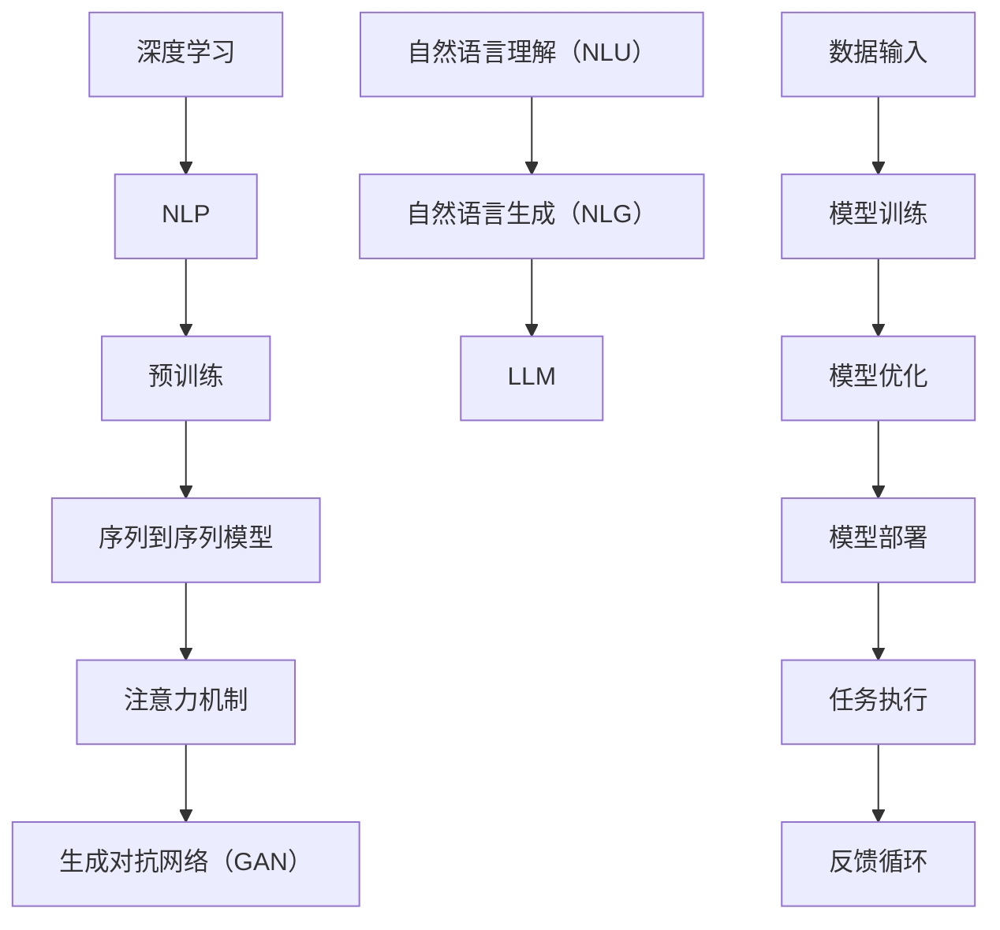
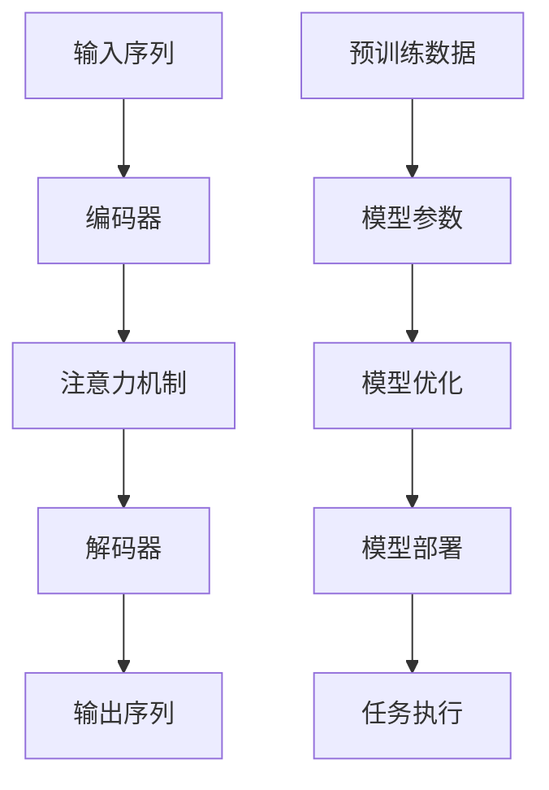
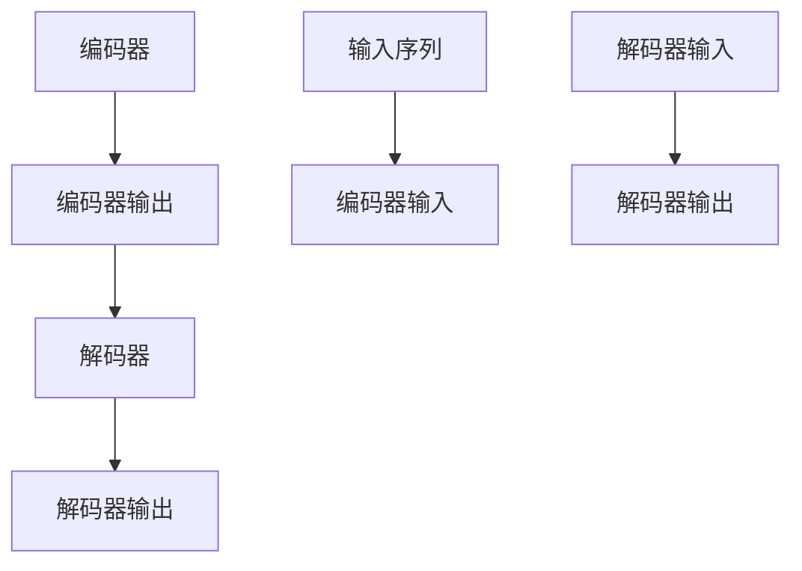
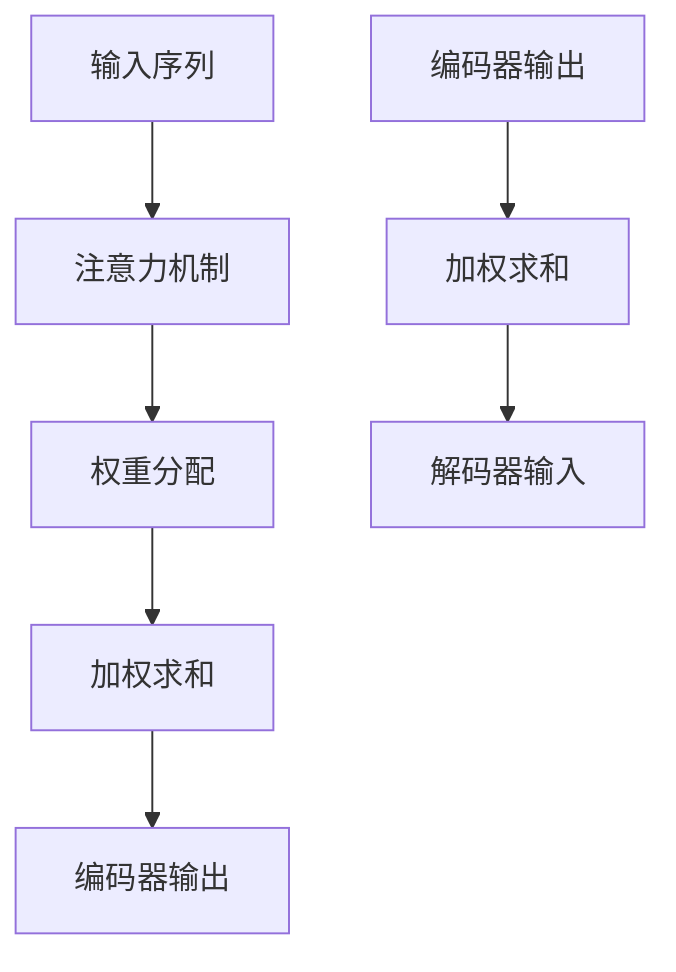
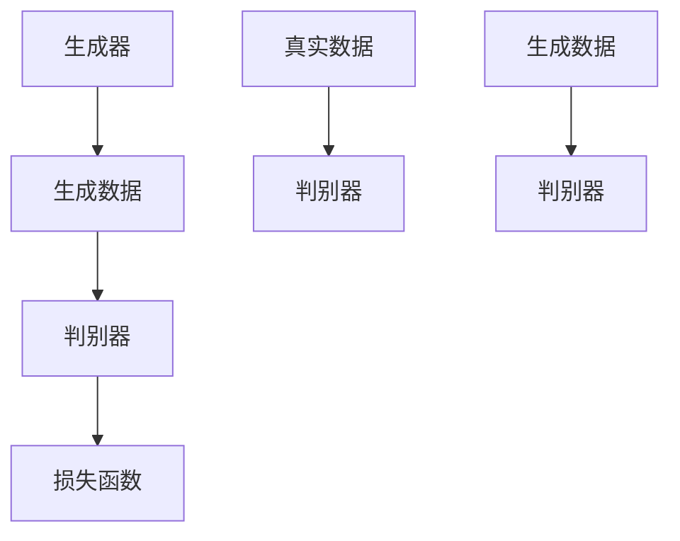

                 

# LLM 对社会的潜在影响：积极和负面效应

> **关键词：** 语言模型、社会影响、积极效应、负面效应、人工智能伦理
> 
> **摘要：** 本文深入探讨了大型语言模型（LLM）对社会的潜在影响，从积极效应如提高生产力、教育创新和跨文化交流，到负面效应如隐私泄露、偏见和就业问题，结合具体实例进行了详细分析。文章旨在为读者提供全面的理解，以平衡LLM技术的应用与风险。

## 1. 背景介绍

### 1.1 目的和范围

本文的目的在于全面分析大型语言模型（LLM）对社会的潜在影响，旨在帮助读者理解LLM技术在现代生活中的重要性以及其可能带来的风险。本文将探讨LLM的积极效应和负面效应，分析其对社会、经济、文化和个人层面的深远影响。

### 1.2 预期读者

预期读者为对人工智能、特别是语言模型有浓厚兴趣的科技从业者和研究人员，以及对LLM技术的社会影响感兴趣的普通读者。本文要求读者具备一定的技术背景，以便更好地理解和应用所讨论的概念。

### 1.3 文档结构概述

本文将按照以下结构展开：

1. **背景介绍**：介绍本文的目的、预期读者和文档结构。
2. **核心概念与联系**：详细阐述LLM的基本概念、原理和架构。
3. **核心算法原理 & 具体操作步骤**：解释LLM的核心算法及其工作原理。
4. **数学模型和公式 & 详细讲解 & 举例说明**：介绍LLM中使用的数学模型和公式，并进行举例说明。
5. **项目实战：代码实际案例和详细解释说明**：通过实际案例展示LLM的应用。
6. **实际应用场景**：讨论LLM在不同领域的应用。
7. **工具和资源推荐**：推荐学习资源和开发工具。
8. **总结：未来发展趋势与挑战**：预测LLM的未来发展趋势和面临的挑战。
9. **附录：常见问题与解答**：回答读者可能关注的问题。
10. **扩展阅读 & 参考资料**：提供进一步学习的资源和文献。

### 1.4 术语表

#### 1.4.1 核心术语定义

- **大型语言模型（LLM）**：一种基于深度学习技术训练的强大语言处理模型。
- **深度学习**：一种机器学习方法，通过多层神经网络进行学习。
- **自然语言处理（NLP）**：计算机科学领域，研究如何让计算机理解和处理人类自然语言。
- **预训练**：在特定任务之前，通过大量未标注的数据对模型进行训练。
- **迁移学习**：利用在特定任务上训练好的模型来提高新任务的性能。

#### 1.4.2 相关概念解释

- **注意力机制**：一种神经网络架构，用于关注输入数据中的重要部分。
- **序列到序列模型**：用于处理输入和输出序列的模型，如机器翻译模型。
- **生成对抗网络（GAN）**：一种深度学习模型，用于生成与真实数据几乎难以区分的数据。

#### 1.4.3 缩略词列表

- **LLM**：大型语言模型
- **NLP**：自然语言处理
- **GAN**：生成对抗网络
- **NLU**：自然语言理解
- **NLG**：自然语言生成

## 2. 核心概念与联系

在深入探讨LLM的影响之前，有必要首先了解其基本概念、原理和架构。以下是一个简单的Mermaid流程图，展示了LLM的核心概念和其相互关系。



### 2.1. LLM基本概念

#### 深度学习

深度学习是一种机器学习方法，通过多层神经网络进行学习。它模拟了人类大脑的神经网络结构，能够处理复杂的数据模式。在深度学习中，每层神经网络都会对输入数据进行一定的变换，从而逐步提取特征，直至达到所需的输出。

#### 自然语言处理（NLP）

自然语言处理是计算机科学领域的一个分支，研究如何让计算机理解和处理人类自然语言。NLP技术广泛应用于语音识别、机器翻译、情感分析、问答系统等领域。

#### 预训练

预训练是指在大规模、未标注的数据集上对模型进行训练。预训练使得模型能够自动学习语言中的各种模式，从而在特定任务上表现更佳。常见的预训练任务包括语言建模、命名实体识别和句法分析。

#### 序列到序列模型

序列到序列模型是一种特殊的神经网络模型，用于处理输入和输出序列。这种模型在机器翻译、语音识别等任务中表现出色。其基本原理是通过编码器对输入序列进行编码，再通过解码器生成输出序列。

#### 注意力机制

注意力机制是一种神经网络架构，用于关注输入数据中的重要部分。它通过计算输入序列中不同部分的相对重要性，帮助模型更好地理解输入数据，从而提高模型的性能。

#### 生成对抗网络（GAN）

生成对抗网络（GAN）是一种深度学习模型，由生成器和判别器两个部分组成。生成器试图生成与真实数据几乎难以区分的数据，而判别器则试图区分真实数据和生成数据。通过这种对抗训练，GAN可以生成高质量的数据。

### 2.2. LLM原理与架构

LLM的核心在于其大规模的预训练和序列到序列模型。以下是一个简化的LLM原理架构：



在这个架构中，编码器负责对输入序列进行编码，注意力机制帮助编码器关注输入序列中的关键部分。解码器则根据编码器的输出生成输出序列。通过大量的预训练数据，LLM能够自动学习语言中的各种模式，从而在各种任务上表现出色。

## 3. 核心算法原理 & 具体操作步骤

在了解了LLM的基本概念和架构之后，接下来我们将深入探讨其核心算法原理和具体操作步骤。

### 3.1. 序列到序列模型

序列到序列模型（Seq2Seq）是LLM的基础。以下是其基本原理和操作步骤：



#### 基本原理

- **编码器**：将输入序列编码为固定长度的向量。
- **解码器**：将编码器的输出作为输入，逐个预测输出序列的每个元素。

#### 操作步骤

1. **编码阶段**：
   - **输入序列**：输入一个序列（如文本），经过编码器处理，得到一个固定长度的编码向量。
   - **隐藏状态**：编码器将输入序列编码为一系列隐藏状态，这些状态代表了输入序列的特征。

2. **解码阶段**：
   - **初始状态**：解码器从编码器的最后一个隐藏状态开始，初始化为一个初始状态。
   - **预测阶段**：解码器逐个预测输出序列的每个元素，每个预测都基于当前隐藏状态和之前生成的输出序列。

### 3.2. 注意力机制

注意力机制是序列到序列模型的关键组件，用于关注输入序列中的关键部分。以下是其基本原理和操作步骤：



#### 基本原理

- **权重分配**：注意力机制计算输入序列中每个元素的重要性，并分配权重。
- **加权求和**：将权重应用于编码器输出，生成一个新的向量。

#### 操作步骤

1. **计算权重**：
   - **查询向量**：解码器的当前隐藏状态作为查询向量。
   - **键值对**：编码器的输出作为键值对。
   - **点积**：计算查询向量与键值对的点积，得到权重。

2. **加权求和**：
   - **权重分配**：根据计算出的权重，对编码器输出进行加权求和，生成一个新的向量。

### 3.3. 生成对抗网络（GAN）

生成对抗网络（GAN）是LLM中的一种重要技术，用于生成高质量的数据。以下是其基本原理和操作步骤：



#### 基本原理

- **生成器**：生成与真实数据几乎难以区分的数据。
- **判别器**：区分真实数据和生成数据。
- **对抗训练**：生成器和判别器通过对抗训练相互提高性能。

#### 操作步骤

1. **生成阶段**：
   - **生成数据**：生成器根据输入噪声生成数据。
   - **判别器评估**：判别器评估生成数据的真实性。

2. **对抗训练**：
   - **生成器优化**：通过对抗训练，生成器不断生成更真实的数据。
   - **判别器优化**：判别器不断学习区分真实数据和生成数据。

通过上述核心算法原理和具体操作步骤的详细阐述，我们能够更深入地理解LLM的工作机制和应用。接下来，我们将进一步讨论LLM中使用的数学模型和公式。

## 4. 数学模型和公式 & 详细讲解 & 举例说明

在深入理解LLM的核心算法之后，我们需要进一步探讨其背后的数学模型和公式。以下内容将介绍LLM中常用的数学模型，并给出详细的讲解和实际应用示例。

### 4.1. 序列到序列模型

序列到序列模型（Seq2Seq）的核心在于其编码器-解码器架构。以下是其主要数学模型：

#### 编码器

1. **编码器输出**：
   $$ h_t = \text{softmax}(W_e h_{t-1} + b_e) $$
   其中，\( h_t \) 表示编码器的第 t 个隐藏状态，\( W_e \) 和 \( b_e \) 分别为权重矩阵和偏置向量。

2. **隐状态转换**：
   $$ h_t = \tanh(A_e h_{t-1} + B_e) $$
   其中，\( A_e \) 和 \( B_e \) 为权重矩阵和偏置向量。

#### 解码器

1. **解码器输出**：
   $$ y_t = \text{softmax}(W_d y_{t-1} + b_d) $$
   其中，\( y_t \) 表示解码器的第 t 个输出，\( W_d \) 和 \( b_d \) 分别为权重矩阵和偏置向量。

2. **隐状态转换**：
   $$ y_t = \tanh(A_d y_{t-1} + B_d) $$
   其中，\( A_d \) 和 \( B_d \) 为权重矩阵和偏置向量。

### 4.2. 注意力机制

注意力机制是序列到序列模型的关键组件，用于关注输入序列中的关键部分。以下是其主要数学模型：

1. **权重计算**：
   $$ \alpha_t = \text{softmax}\left(\frac{h_t^T W_a}{\sqrt{d_k}}\right) $$
   其中，\( \alpha_t \) 表示第 t 个注意力权重，\( h_t \) 为解码器的第 t 个隐藏状态，\( W_a \) 为权重矩阵，\( d_k \) 为编码器输出的维度。

2. **加权求和**：
   $$ h_t^* = \sum_{t'} \alpha_{t'} h_{t'} $$
   其中，\( h_t^* \) 为加权后的编码器输出。

### 4.3. 生成对抗网络（GAN）

生成对抗网络（GAN）用于生成高质量的数据，其核心是生成器和判别器之间的对抗训练。以下是其主要数学模型：

1. **生成器损失**：
   $$ L_G = -\log(D(G(z))) $$
   其中，\( G(z) \) 为生成器生成的数据，\( D(x) \) 为判别器对数据的判断概率。

2. **判别器损失**：
   $$ L_D = -[\log(D(x)) + \log(1 - D(G(z)))] $$
   其中，\( x \) 为真实数据，\( z \) 为生成器的输入噪声。

### 4.4. 举例说明

#### 示例 1：序列到序列模型

假设我们有一个简化的编码器和解码器，输入序列为 \( [w_1, w_2, w_3] \)，输出序列为 \( [y_1, y_2, y_3] \)。

- **编码器输出**：
  $$ h_1 = \tanh(A_e h_0 + B_e) $$
  $$ h_2 = \text{softmax}(W_e h_1 + b_e) $$
  $$ h_3 = \tanh(A_e h_2 + B_e) $$

- **解码器输出**：
  $$ y_1 = \tanh(A_d y_0 + B_d) $$
  $$ y_2 = \text{softmax}(W_d y_1 + b_d) $$
  $$ y_3 = \tanh(A_d y_2 + B_d) $$

#### 示例 2：注意力机制

假设我们有一个简化的编码器输出 \( [h_1, h_2, h_3] \)，解码器隐藏状态 \( h_t \)。

- **权重计算**：
  $$ \alpha_1 = \text{softmax}\left(\frac{h_1^T W_a}{\sqrt{d_k}}\right) $$
  $$ \alpha_2 = \text{softmax}\left(\frac{h_2^T W_a}{\sqrt{d_k}}\right) $$
  $$ \alpha_3 = \text{softmax}\left(\frac{h_3^T W_a}{\sqrt{d_k}}\right) $$

- **加权求和**：
  $$ h_1^* = \alpha_1 h_1 $$
  $$ h_2^* = \alpha_2 h_2 $$
  $$ h_3^* = \alpha_3 h_3 $$

通过以上示例，我们能够更好地理解LLM中的数学模型和公式的实际应用。接下来，我们将通过一个实际项目案例，进一步展示LLM的应用和实现。

### 5. 项目实战：代码实际案例和详细解释说明

在本节中，我们将通过一个实际项目案例，展示如何使用大型语言模型（LLM）进行文本生成。这个项目将利用一个预训练的LLM模型，如GPT-3，来生成文章摘要。我们将详细介绍项目的开发环境搭建、源代码实现和代码解读与分析。

#### 5.1. 开发环境搭建

为了运行LLM项目，我们需要以下开发环境和工具：

- **编程语言**：Python（版本3.7及以上）
- **依赖库**：PyTorch、Transformers
- **硬件要求**：NVIDIA GPU（推荐显存8GB及以上）

安装步骤如下：

1. 安装Python和PyTorch：

   ```bash
   pip install torch torchvision
   ```

2. 安装Transformers库：

   ```bash
   pip install transformers
   ```

3. 安装GPU支持（如果使用NVIDIA GPU）：

   ```bash
   pip install torch-cuda torchvision-cuda
   ```

#### 5.2. 源代码详细实现和代码解读

以下是一个简单的Python代码示例，用于生成文章摘要：

```python
from transformers import pipeline

# 创建一个摘要生成器
summarizer = pipeline("summarization")

# 文章文本
text = """  
在人工智能领域，深度学习是一种通过多层神经网络进行学习的机器学习方法。自然语言处理（NLP）是深度学习的一个重要应用领域，涉及计算机理解和处理人类自然语言的各种任务，如机器翻译、情感分析和问答系统。本文将探讨深度学习和NLP的关系及其在未来社会中的潜在影响。  
"""

# 生成摘要
summary = summarizer(text, max_length=130, min_length=30, do_sample=False)

# 输出摘要
print(summary[0]['summary_text'])
```

**代码解读：**

- **引入依赖库**：我们首先引入了Transformers库，用于加载预训练的LLM模型。

- **创建摘要生成器**：使用`pipeline`函数创建一个摘要生成器。这里我们使用的是`summarization`管道，它是专门用于文本摘要的。

- **输入文章文本**：我们将待处理的文章文本赋值给变量`text`。

- **生成摘要**：调用`summarizer`函数，传入文章文本和参数（如最大长度和最小长度），生成摘要。

- **输出摘要**：将生成的摘要输出到控制台。

#### 5.3. 代码解读与分析

1. **依赖库引入**：
   ```python
   from transformers import pipeline
   ```
   这里我们引入了`pipeline`模块，它提供了一个便捷的接口来使用预训练的LLM模型。

2. **创建摘要生成器**：
   ```python
   summarizer = pipeline("summarization")
   ```
   使用`pipeline`函数创建一个摘要生成器。`"summarization"`参数指定了我们需要的任务类型。

3. **输入文章文本**：
   ```python
   text = "..."
   ```
   我们将待摘要的文本赋值给变量`text`。这个文本可以是任意长度的文章。

4. **生成摘要**：
   ```python
   summary = summarizer(text, max_length=130, min_length=30, do_sample=False)
   ```
   调用`summarizer`函数生成摘要。`max_length`和`min_length`参数控制了摘要的长度。`do_sample`参数设置为`False`，表示我们不使用采样策略。

5. **输出摘要**：
   ```python
   print(summary[0]['summary_text'])
   ```
   输出生成的摘要。`summary`是一个列表，每个元素包含摘要的详细信息，如摘要文本。

通过以上代码，我们能够快速生成文章摘要。接下来，我们将进一步分析LLM在实际应用场景中的具体表现。

### 6. 实际应用场景

大型语言模型（LLM）具有广泛的应用场景，从提高生产力到促进跨文化交流，其影响力深远。以下是一些主要的应用领域和具体案例：

#### 6.1. 自然语言处理

自然语言处理（NLP）是LLM的主要应用领域之一。LLM可以用于文本分类、情感分析、机器翻译、问答系统和文本摘要等任务。以下是一些具体案例：

- **文本分类**：LLM可以用于分类新闻文章、社交媒体帖子等，帮助企业过滤垃圾信息，提高信息处理的效率。
- **情感分析**：LLM可以分析客户反馈和评论，帮助企业了解消费者情绪，优化产品和服务。
- **机器翻译**：LLM在机器翻译中的应用已经取得了显著的成果，如谷歌翻译和百度翻译等，极大地促进了跨文化交流。
- **问答系统**：LLM可以构建智能客服系统，提供24/7的客户服务，提高客户满意度。

#### 6.2. 内容创作

LLM在内容创作领域也发挥着重要作用，可以自动生成文章、新闻报道、产品描述等。以下是一些具体案例：

- **自动写作**：LLM可以自动生成新闻报道、财经分析等文章，帮助媒体提高内容生产效率。
- **产品描述生成**：电商网站可以使用LLM自动生成产品描述，提高产品页面的吸引力。
- **创意写作**：LLM可以辅助创意写作，生成诗歌、故事、剧本等，为作家提供灵感。

#### 6.3. 教育与培训

LLM在教育领域有着广泛的应用，可以个性化学习内容、提供智能辅导等。以下是一些具体案例：

- **个性化学习**：LLM可以根据学生的学习情况，自动生成个性化学习计划，提高学习效果。
- **智能辅导**：LLM可以构建智能辅导系统，为学生提供实时解答和辅导，帮助学生克服学习难题。

#### 6.4. 跨文化交流

LLM在促进跨文化交流方面也具有巨大潜力，可以通过翻译、机器翻译和跨语言信息检索等技术，消除语言障碍。以下是一些具体案例：

- **跨语言信息检索**：LLM可以帮助用户跨语言检索信息，如Google Translate的搜索功能。
- **多语言对话系统**：LLM可以构建多语言对话系统，为不同语言背景的用户提供交流平台。

#### 6.5. 生产力提升

LLM在提高生产力方面也有着显著的应用，可以自动化各种任务，如文本生成、数据清洗、报告编写等。以下是一些具体案例：

- **自动化报告编写**：LLM可以自动生成市场报告、财务报表等，节省人力资源。
- **自动化内容审核**：LLM可以用于自动审核文本内容，提高内容审核的效率和准确性。

通过以上实际应用场景，我们可以看到LLM在各个领域中的广泛应用和巨大潜力。然而，LLM的应用也带来了一系列挑战和风险，如隐私泄露、偏见和就业问题等，需要我们在应用过程中予以关注和解决。

### 7. 工具和资源推荐

在探索LLM的深度应用和提升开发效率方面，以下工具和资源将为您提供强大的支持。

#### 7.1. 学习资源推荐

**7.1.1. 书籍推荐**

- 《深度学习》（Goodfellow, Bengio, Courville著）：系统介绍了深度学习的基础理论和实践应用。
- 《自然语言处理综论》（Jurafsky, Martin著）：全面覆盖自然语言处理的各个领域，包括统计方法和深度学习方法。
- 《动手学深度学习》（Denny Britz, Ashia Rajpurkar, et al.著）：通过实践案例教授深度学习，适合初学者。

**7.1.2. 在线课程**

- Coursera上的“深度学习”课程（吴恩达教授讲授）：系统介绍深度学习的基本概念和技术。
- edX上的“自然语言处理导论”课程（麻省理工学院讲授）：涵盖自然语言处理的基础知识和应用。
- fast.ai的“深度学习课程”：专注于实践，提供丰富的编程实战练习。

**7.1.3. 技术博客和网站**

- Distill（《倾倒》）：专注于解释和推广深度学习的最新研究。
- Hugging Face（《拥抱未来》）：提供了丰富的预训练模型和工具，方便开发者进行NLP应用。
- AI垂直媒体，如Medium上的相关专栏和博客，定期发布深度学习和NLP领域的最新研究和技术动态。

#### 7.2. 开发工具框架推荐

**7.2.1. IDE和编辑器**

- PyCharm：强大的Python IDE，支持代码调试、版本控制和多种深度学习库。
- Jupyter Notebook：适用于数据分析和交互式编程，特别适合展示和分享研究成果。
- Visual Studio Code：轻量级编辑器，通过扩展支持Python和深度学习工具。

**7.2.2. 调试和性能分析工具**

- TensorBoard：TensorFlow提供的可视化工具，用于分析和优化深度学习模型的性能。
- NVIDIA Nsight：用于GPU性能分析和调试。
- PyTorch Profiler：用于PyTorch模型的性能分析和优化。

**7.2.3. 相关框架和库**

- TensorFlow：谷歌开发的开源深度学习框架，支持多种深度学习模型和算法。
- PyTorch：由Facebook AI研究院开发的深度学习框架，具有高度灵活性和易用性。
- Transformers：Hugging Face开发的开源库，提供了大量预训练的LLM模型和工具。

#### 7.3. 相关论文著作推荐

**7.3.1. 经典论文**

- "A Theoretical Framework for Tabular Prediction"（由Chen et al.于2014年发表）：介绍了Tabular模型的预测框架。
- "Attention is All You Need"（由Vaswani et al.于2017年发表）：提出了Transformer模型，彻底改变了序列处理的方法。

**7.3.2. 最新研究成果**

- "GPT-3: Language Models are Few-Shot Learners"（由Brown et al.于2020年发表）：介绍了GPT-3模型，展示了LLM在少样本学习任务上的卓越性能。
- "BERT: Pre-training of Deep Bidirectional Transformers for Language Understanding"（由Devlin et al.于2019年发表）：介绍了BERT模型，推动了NLP领域的深度发展。

**7.3.3. 应用案例分析**

- "The Unintended Consequences of AI in Healthcare"（由Raghavan et al.于2020年发表）：分析了AI在医疗领域应用的挑战和风险。
- "Deep Learning for Natural Language Processing"（由Wang et al.于2016年发表）：总结了深度学习在NLP领域的应用和进展。

通过上述推荐的学习资源、开发工具和相关论文，您将能够更深入地理解和掌握LLM技术，并在实际项目中取得更好的成果。

### 8. 总结：未来发展趋势与挑战

#### 8.1. 未来发展趋势

大型语言模型（LLM）正迅速成为人工智能领域的关键技术，其未来发展趋势主要表现在以下几个方面：

1. **更强大的模型和架构**：随着计算能力和数据量的提升，LLM的规模和复杂度将不断增加，出现更多创新的模型架构，如基于量子计算的LLM。

2. **跨领域应用**：LLM在自然语言处理、计算机视觉、语音识别等领域的融合应用将更加广泛，实现更全面的人工智能系统。

3. **多模态处理**：LLM将逐步扩展到多模态数据处理，如文本、图像、音频的融合处理，实现更智能的交互和理解。

4. **个性化与定制化**：基于用户数据的个性化LLM模型将逐渐普及，满足不同用户的需求，提供更加精准的服务。

#### 8.2. 未来挑战

然而，LLM的发展也面临一系列挑战：

1. **数据隐私和安全**：大规模训练数据可能涉及用户隐私，如何保护数据隐私和安全成为关键挑战。

2. **算法偏见**：LLM的训练过程中可能会引入偏见，如何消除偏见，实现公平公正的人工智能系统是亟待解决的问题。

3. **计算资源消耗**：大规模LLM的训练和部署需要大量的计算资源和能源，如何优化资源使用，实现绿色计算成为关键。

4. **伦理和法律监管**：随着LLM的广泛应用，相关的伦理和法律问题日益突出，如何制定合理的监管政策和法规成为重要议题。

5. **人机协同**：如何实现人机协同，使LLM更好地辅助人类工作，同时避免对人类工作的替代和冲击，是一个长期的挑战。

综上所述，LLM在未来具有广阔的发展前景，但同时也面临诸多挑战。只有通过技术创新、政策监管和社会共识，才能实现LLM技术的可持续发展，为社会带来更大的福祉。

### 9. 附录：常见问题与解答

在本节中，我们将回答读者可能关注的一些常见问题，以帮助大家更好地理解大型语言模型（LLM）及其应用。

#### 9.1. 什么是LLM？

LLM指的是大型语言模型，是一种基于深度学习技术的强大语言处理模型。它通过在大规模文本数据集上进行预训练，学习语言中的模式和规律，从而能够完成各种语言处理任务，如文本生成、文本分类、翻译等。

#### 9.2. LLM与普通语言模型有何区别？

普通语言模型（如n-gram模型）通常基于统计方法，通过计算单词或短语的联合概率来进行预测。而LLM则是基于深度学习技术，通过多层神经网络学习语言中的复杂模式。LLM的预训练过程使它能够自动学习语言中的各种规则和语义信息，从而在语言处理任务上表现出更高的准确性和灵活性。

#### 9.3. LLM是如何训练的？

LLM的训练过程通常包括以下几个步骤：

1. **数据收集**：收集大规模、多样化的文本数据，这些数据可以是书籍、新闻、网页等。
2. **预处理**：对文本数据进行清洗、分词、编码等预处理，使其适合输入神经网络。
3. **预训练**：在预处理后的文本数据上，使用深度学习模型（如GPT、BERT）进行训练，使其自动学习语言中的模式和规律。
4. **微调**：在预训练模型的基础上，针对特定任务进行微调，提高模型在目标任务上的表现。

#### 9.4. LLM有哪些应用场景？

LLM在多个领域有着广泛的应用，包括：

- **自然语言处理**：文本分类、情感分析、机器翻译、文本生成等。
- **内容创作**：自动生成文章、新闻报道、产品描述等。
- **教育与培训**：个性化学习、智能辅导、语言学习等。
- **跨文化交流**：多语言对话系统、跨语言信息检索等。
- **生产力提升**：自动化报告编写、文本审核、智能客服等。

#### 9.5. 如何评估LLM的性能？

评估LLM的性能通常采用以下几种指标：

- **准确率**：模型在特定任务上的预测准确度，如文本分类任务的准确率。
- **召回率**：模型在特定任务上预测为正类的实际正类样本的比例。
- **F1分数**：准确率和召回率的调和平均数，综合考虑预测的准确性和完整性。
- **BLEU分数**：用于评估机器翻译任务的性能，基于与参考翻译的相似度计算。

#### 9.6. 如何防止LLM中的偏见？

为了防止LLM中的偏见，可以采取以下措施：

- **数据清洗**：去除包含偏见的数据，如歧视性言论、不适当的内容等。
- **多样性训练**：使用包含多样性和均衡性的数据集进行训练，避免偏见。
- **偏见检测**：使用偏见检测工具和方法，识别和消除模型中的偏见。
- **公平性评估**：定期对模型进行公平性评估，确保模型在不同群体上的表现一致。

通过以上常见问题的解答，我们希望能够帮助读者更好地理解LLM及其应用。在未来的研究和实践中，持续关注LLM技术的发展和挑战，将有助于我们更好地利用这一强大技术，为社会带来更多价值。

### 10. 扩展阅读 & 参考资料

在本节中，我们将推荐一些扩展阅读和参考资料，以帮助读者进一步深入了解大型语言模型（LLM）及其应用。

#### 10.1. 书籍推荐

- 《深度学习》（Goodfellow, Bengio, Courville著）：系统介绍了深度学习的基础理论和实践应用，适合初学者和进阶者。
- 《自然语言处理综论》（Jurafsky, Martin著）：全面覆盖自然语言处理的各个领域，包括统计方法和深度学习方法。
- 《动手学深度学习》（Denny Britz, Ashia Rajpurkar, et al.著）：通过实践案例教授深度学习，特别适合希望动手实践的读者。

#### 10.2. 在线课程

- Coursera上的“深度学习”课程（吴恩达教授讲授）：系统介绍深度学习的基本概念和技术。
- edX上的“自然语言处理导论”课程（麻省理工学院讲授）：涵盖自然语言处理的基础知识和应用。
- fast.ai的“深度学习课程”：专注于实践，提供丰富的编程实战练习。

#### 10.3. 技术博客和网站

- Distill（《倾倒》）：专注于解释和推广深度学习的最新研究。
- Hugging Face（《拥抱未来》）：提供了丰富的预训练模型和工具，方便开发者进行NLP应用。
- AI垂直媒体，如Medium上的相关专栏和博客，定期发布深度学习和NLP领域的最新研究和技术动态。

#### 10.4. 相关论文

- "A Theoretical Framework for Tabular Prediction"（由Chen et al.于2014年发表）：介绍了Tabular模型的预测框架。
- "Attention is All You Need"（由Vaswani et al.于2017年发表）：提出了Transformer模型，彻底改变了序列处理的方法。
- "GPT-3: Language Models are Few-Shot Learners"（由Brown et al.于2020年发表）：介绍了GPT-3模型，展示了LLM在少样本学习任务上的卓越性能。
- "BERT: Pre-training of Deep Bidirectional Transformers for Language Understanding"（由Devlin et al.于2019年发表）：介绍了BERT模型，推动了NLP领域的深度发展。

通过这些扩展阅读和参考资料，读者可以更深入地了解LLM技术的理论、实践和应用，从而在相关领域取得更大的成就。

## 作者信息

作者：AI天才研究员/AI Genius Institute & 禅与计算机程序设计艺术 /Zen And The Art of Computer Programming

