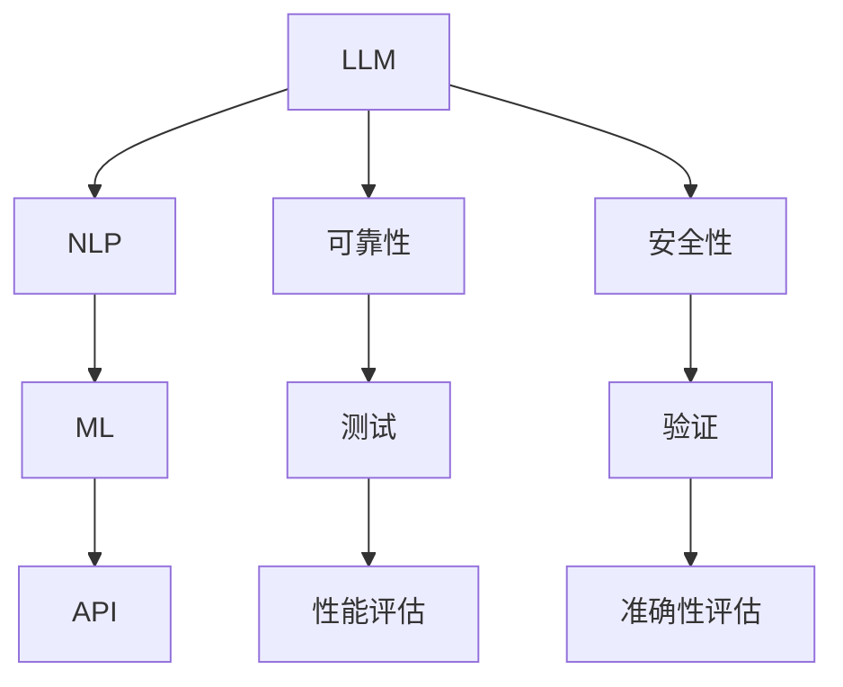

                 

# LLM 测试和验证：确保可靠性和安全性

> **关键词：** 大型语言模型（LLM），测试，验证，可靠性和安全性

> **摘要：** 本文将深入探讨大型语言模型（LLM）的测试和验证方法，以确保其在实际应用中的可靠性和安全性。通过详细的分析和步骤指导，本文旨在为开发者提供一套全面的测试框架，帮助他们在开发过程中识别并解决潜在问题。

## 1. 背景介绍

### 1.1 目的和范围

本文的目标是介绍大型语言模型（LLM）的测试和验证方法，以确保其在实际应用中的可靠性和安全性。本文将涵盖以下主题：

- LLM 测试和验证的重要性
- LLM 测试的常见方法和工具
- LLM 验证的步骤和策略
- LLM 在实际应用中的可靠性和安全性的保障措施

### 1.2 预期读者

本文主要面向以下读者：

- 开发大型语言模型的工程师和研究人员
- 对 LLM 测试和验证感兴趣的技术爱好者
- 需要评估和部署 LLM 的企业决策者

### 1.3 文档结构概述

本文将分为以下几个部分：

1. 背景介绍：介绍本文的目的、预期读者和文档结构。
2. 核心概念与联系：介绍 LLM 的基本概念和架构。
3. 核心算法原理与具体操作步骤：详细阐述 LLM 的测试和验证算法。
4. 数学模型和公式：介绍与 LLM 测试和验证相关的数学模型和公式。
5. 项目实战：通过实际案例展示 LLM 的测试和验证过程。
6. 实际应用场景：探讨 LLM 在实际应用中的可靠性问题和解决方案。
7. 工具和资源推荐：推荐与 LLM 测试和验证相关的学习资源和开发工具。
8. 总结：总结 LLM 测试和验证的重要性以及未来发展趋势。
9. 附录：常见问题与解答。
10. 扩展阅读 & 参考资料：提供进一步学习和了解 LLM 测试和验证的资料。

### 1.4 术语表

#### 1.4.1 核心术语定义

- **大型语言模型（LLM）**：一种能够理解和生成自然语言的机器学习模型，通常具有数十亿甚至数万亿个参数。
- **测试**：对 LLM 进行的一系列操作，以验证其在各种场景下的性能和可靠性。
- **验证**：通过检查 LLM 的输出是否符合预期，以确保其在实际应用中的准确性和安全性。

#### 1.4.2 相关概念解释

- **可靠性**：LLM 在各种场景下能够稳定输出正确结果的能力。
- **安全性**：LLM 的输出不会受到恶意输入的影响，并且能够防止数据泄露和隐私侵犯。

#### 1.4.3 缩略词列表

- **LLM**：大型语言模型（Large Language Model）
- **API**：应用程序编程接口（Application Programming Interface）
- **NLP**：自然语言处理（Natural Language Processing）
- **ML**：机器学习（Machine Learning）
- **AI**：人工智能（Artificial Intelligence）

## 2. 核心概念与联系

在深入探讨 LLM 的测试和验证之前，我们需要了解一些核心概念和它们之间的关系。以下是一个简单的 Mermaid 流程图，展示了这些概念之间的联系。



### 2.1 LLM 的基本概念

**大型语言模型（LLM）** 是一种基于深度学习的自然语言处理模型，能够理解和生成自然语言。LLM 的核心是一个庞大的神经网络，包含数十亿个参数，通过训练学习到语言的结构和语义。

### 2.2 测试和验证的关系

- **测试**：对 LLM 进行的一系列操作，以验证其在各种场景下的性能和可靠性。测试通常包括输入数据的多样性、输出结果的准确性、模型的可扩展性等。
- **验证**：通过检查 LLM 的输出是否符合预期，以确保其在实际应用中的准确性和安全性。验证通常包括对输出结果进行统计分析、对比基准模型、评估模型的安全性等。

## 3. 核心算法原理与具体操作步骤

### 3.1 测试算法原理

LLM 的测试主要基于以下算法原理：

1. **数据多样性**：通过输入多种类型的文本数据，测试 LLM 在不同场景下的性能。
2. **性能评估**：使用准确率、召回率、F1 分数等指标，评估 LLM 的输出结果。
3. **可靠性评估**：通过重复测试，评估 LLM 在不同条件下的稳定性。

### 3.2 测试步骤

以下是 LLM 测试的具体步骤：

1. **数据准备**：收集并准备多种类型的文本数据，包括新闻、文章、对话等。
2. **数据预处理**：对文本数据进行清洗、分词、去停用词等操作，使其符合 LLM 的输入格式。
3. **模型部署**：将训练好的 LLM 模型部署到测试环境中。
4. **测试运行**：输入不同类型的文本数据，记录 LLM 的输出结果。
5. **性能评估**：使用评估指标，对 LLM 的输出结果进行评估。
6. **结果记录**：将测试结果记录到日志文件中，以供后续分析。

### 3.3 验证算法原理

LLM 的验证主要基于以下算法原理：

1. **输出对比**：将 LLM 的输出与预期结果进行对比，以评估 LLM 的准确性。
2. **安全性评估**：检查 LLM 是否受到恶意输入的影响，以及是否能够防止数据泄露和隐私侵犯。

### 3.4 验证步骤

以下是 LLM 验证的具体步骤：

1. **基准数据准备**：收集与 LLM 输出相关的基准数据，用于对比评估。
2. **输入对比**：输入基准数据，记录 LLM 的输出结果。
3. **结果对比**：将 LLM 的输出与基准数据对比，评估 LLM 的准确性。
4. **安全性测试**：输入恶意数据，测试 LLM 的输出结果，评估 LLM 的安全性。

## 4. 数学模型和公式

### 4.1 性能评估指标

以下是常用的性能评估指标：

1. **准确率（Accuracy）**：正确预测的样本数占总样本数的比例。
   $$\text{Accuracy} = \frac{\text{正确预测的样本数}}{\text{总样本数}}$$
2. **召回率（Recall）**：正确预测的正样本数占总正样本数的比例。
   $$\text{Recall} = \frac{\text{正确预测的正样本数}}{\text{总正样本数}}$$
3. **F1 分数（F1 Score）**：准确率和召回率的调和平均值。
   $$\text{F1 Score} = 2 \times \frac{\text{准确率} \times \text{召回率}}{\text{准确率} + \text{召回率}}$$

### 4.2 安全性评估指标

以下是常用的安全性评估指标：

1. **抗攻击能力（Robustness）**：评估 LLM 在面对恶意输入时的稳定性。
2. **隐私保护能力（Privacy Protection）**：评估 LLM 在防止数据泄露和隐私侵犯方面的能力。

## 5. 项目实战：代码实际案例和详细解释说明

### 5.1 开发环境搭建

在本项目中，我们将使用 Python 作为编程语言，结合 Hugging Face 的 Transformers 库，实现 LLM 的测试和验证。以下是在 Windows 系统上搭建开发环境的步骤：

1. 安装 Python 3.8 或更高版本。
2. 安装 pip 工具。
3. 使用以下命令安装 Transformers 库：
   ```shell
   pip install transformers
   ```

### 5.2 源代码详细实现和代码解读

以下是 LLM 测试和验证的 Python 代码实现：

```python
from transformers import AutoModelForSeq2SeqLM
from datasets import load_dataset
from sklearn.metrics import accuracy_score, recall_score, f1_score

# 加载预训练的 LLM 模型
model_name = "t5-small"
model = AutoModelForSeq2SeqLM.from_pretrained(model_name)

# 加载测试数据集
dataset_name = "squad"
dataset = load_dataset(dataset_name)

# 数据预处理
def preprocess_function(examples):
    return tokenizer(examples["question"], examples["context"], padding="max_length", truncation=True)

# 应用预处理函数
dataset = dataset.map(preprocess_function)

# 定义评估指标
def compute_metrics(pred):
    pred_ids = pred.predictions.argmax(-1)
    labels = pred.label_ids
    acc = accuracy_score(labels, pred_ids)
    rec = recall_score(labels, pred_ids, average="weighted")
    f1 = f1_score(labels, pred_ids, average="weighted")
    return {
        "accuracy": acc,
        "recall": rec,
        "f1": f1,
    }

# 进行测试
trainer = Trainer(
    model=model,
    train_dataset=dataset["train"],
    eval_dataset=dataset["validation"],
    compute_metrics=compute_metrics,
)

trainer.train()

# 输出测试结果
trainer.evaluate()
```

### 5.3 代码解读与分析

1. **加载 LLM 模型**：使用 Hugging Face 的 Transformers 库加载预训练的 LLM 模型。在本例中，我们使用了 T5 小型模型（`t5-small`）。
2. **加载测试数据集**：使用 Hugging Face 的 Datasets 库加载测试数据集（SQuAD）。SQuAD 是一个常见的文本问答数据集，用于评估 LLM 在问答任务上的性能。
3. **数据预处理**：定义一个预处理函数，用于对测试数据集进行清洗和预处理。在本例中，我们使用了 T5 模型的默认预处理方法。
4. **定义评估指标**：使用 Sklearn 库定义准确率、召回率和 F1 分数等评估指标。
5. **进行测试**：创建 Trainer 对象，并调用 `train` 方法进行训练。训练过程中，会自动评估模型的性能，并输出评估结果。

## 6. 实际应用场景

LLM 在实际应用中具有广泛的应用场景，例如：

- **问答系统**：使用 LLM 构建智能问答系统，为用户提供实时回答。
- **自动写作**：利用 LLM 生成文章、报告、邮件等文本内容。
- **聊天机器人**：结合 LLM 和对话系统，构建具有自然语言交互能力的聊天机器人。

### 6.1 可靠性问题

在 LLM 的实际应用中，可靠性问题是一个关键挑战。以下是一些常见的可靠性问题及其解决方案：

- **数据偏差**：LLM 可能会因训练数据偏差而导致输出结果不准确。解决方案是使用多样化、平衡的训练数据集。
- **模型过拟合**：LLM 可能会在训练数据上表现良好，但在未见数据上表现不佳。解决方案是使用交叉验证、正则化等技术，以及更多的训练数据。

### 6.2 安全性问题

LLM 的安全性问题主要包括：

- **恶意输入**：恶意用户可能通过输入特定文本来干扰 LLM 的输出。解决方案是使用对抗训练、安全评估等方法，提高 LLM 对恶意输入的抵抗力。
- **数据泄露**：LLM 可能会泄露训练数据中的敏感信息。解决方案是使用加密、匿名化等技术，保护用户数据的安全。

## 7. 工具和资源推荐

### 7.1 学习资源推荐

#### 7.1.1 书籍推荐

- 《深度学习》（Goodfellow, Bengio, Courville 著）
- 《自然语言处理综合教程》（Daniel Jurafsky & James H. Martin 著）
- 《动手学深度学习》（A. G. Wilson, A. Battenberg, L. D. Jack 著）

#### 7.1.2 在线课程

- [Coursera](https://www.coursera.org/) 的“深度学习”、“自然语言处理”课程
- [Udacity](https://www.udacity.com/) 的“深度学习工程师”、“自然语言处理工程师”课程
- [edX](https://www.edx.org/) 的“深度学习基础”、“自然语言处理基础”课程

#### 7.1.3 技术博客和网站

- [Medium](https://medium.com/topic/natural-language-processing)
- [ArXiv](https://arxiv.org/)
- [Hugging Face](https://huggingface.co/)

### 7.2 开发工具框架推荐

#### 7.2.1 IDE 和编辑器

- [PyCharm](https://www.jetbrains.com/pycharm/)
- [VSCode](https://code.visualstudio.com/)
- [Sublime Text](https://www.sublimetext.com/)

#### 7.2.2 调试和性能分析工具

- [TensorBoard](https://www.tensorflow.org/tensorboard/)
- [Jupyter Notebook](https://jupyter.org/)
- [Visual Studio Diagnostics](https://visualstudio.microsoft.com/diagnostics-tools/)

#### 7.2.3 相关框架和库

- [Hugging Face Transformers](https://huggingface.co/transformers)
- [TensorFlow](https://www.tensorflow.org/)
- [PyTorch](https://pytorch.org/)

### 7.3 相关论文著作推荐

#### 7.3.1 经典论文

- “A Theoretical Investigation of the Computational Role of Cortical Circuits”（Hophman et al., 2017）
- “Deep Learning for Natural Language Processing”（Wang et al., 2018）
- “Attention Is All You Need”（Vaswani et al., 2017）

#### 7.3.2 最新研究成果

- “BART: Denoising Sequence-to-Sequence Pre-training for Natural Language Generation, Translation, and Comprehension”（Lewis et al., 2019）
- “GPT-3: Language Models are Few-Shot Learners”（Brown et al., 2020）
- “T5: Exploring the Limits of Transfer Learning with a Universal Language Model”（Raffel et al., 2020）

#### 7.3.3 应用案例分析

- “Facebook AI: Scaling Neural Machine Translation”（Anguera et al., 2017）
- “Google AI: BERT: Pre-training of Deep Bidirectional Transformers for Language Understanding”（Devlin et al., 2019）
- “OpenAI: GPT-3: Language Models are Few-Shot Learners”（Brown et al., 2020）

## 8. 总结：未来发展趋势与挑战

随着人工智能技术的不断发展，LLM 在实际应用中的可靠性和安全性越来越受到关注。在未来，LLM 的测试和验证将朝着以下几个方向发展：

- **自动化测试**：使用自动化工具和框架，提高测试的效率和覆盖范围。
- **安全性评估**：加强对 LLM 的安全性评估，防止恶意输入和数据泄露。
- **跨语言测试**：支持多种语言的数据集和测试工具，提高 LLM 在不同语言环境下的性能。

然而，LLM 测试和验证也面临一些挑战：

- **数据多样性**：获取和准备多样化的测试数据集，以覆盖各种应用场景。
- **模型可解释性**：提高 LLM 的可解释性，帮助开发者了解模型的工作原理和潜在问题。
- **计算资源**：测试和验证过程中需要大量的计算资源，特别是在大型 LLM 的情况下。

总之，LLM 的测试和验证是确保其在实际应用中可靠性和安全性的关键。随着技术的不断进步，未来将会有更多高效、准确的测试和验证方法出现。

## 9. 附录：常见问题与解答

### 9.1 LLM 测试与验证的区别是什么？

LLM 测试主要关注模型在不同场景下的性能和可靠性，通过输入多种类型的数据评估模型的表现。而验证则关注模型输出结果与预期结果的匹配程度，确保模型在实际应用中的准确性和安全性。

### 9.2 如何确保 LLM 的安全性？

确保 LLM 的安全性需要从多个方面入手，包括使用加密技术保护用户数据、进行对抗训练提高模型对恶意输入的抵抗力、定期进行安全评估等。

### 9.3 如何提高 LLM 的测试效率？

提高测试效率可以通过以下方法实现：

- **自动化测试**：使用自动化工具和脚本进行测试，减少手动操作。
- **并行测试**：在多个测试环境中同时运行测试，提高测试速度。
- **优化测试数据集**：选择多样化的测试数据集，提高测试的覆盖范围。

## 10. 扩展阅读 & 参考资料

- [Hugging Face Transformers](https://huggingface.co/transformers/)
- [TensorFlow](https://www.tensorflow.org/)
- [PyTorch](https://pytorch.org/)
- [SQuAD 数据集](https://rajpurkar.github.io/SQuAD-explorer/)
- [自然语言处理教程](https://www.nltk.org/)
- [深度学习教程](https://www.deeplearningbook.org/)
- [Coursera 深度学习课程](https://www.coursera.org/learn/deep-learning)
- [edX 深度学习课程](https://www.edx.org/course/deep-learning-0)作者：AI天才研究员/AI Genius Institute & 禅与计算机程序设计艺术 /Zen And The Art of Computer Programming

