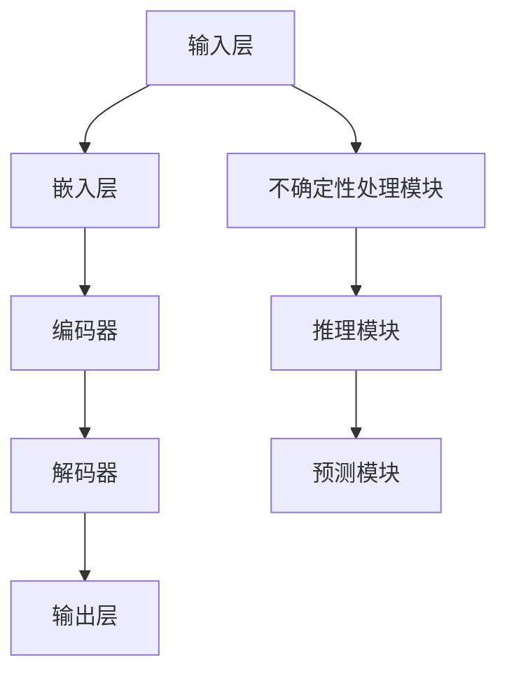

                 

# LLM 的不确定性：在不确定中寻找确定

> **关键词：** 语言模型，不确定性，推理，预测，决策，神经网络，机器学习。

> **摘要：** 本文将深入探讨大型语言模型(LLM)中的不确定性问题，分析其在现实世界中的应用和挑战。我们将通过理论分析和实际案例，探讨如何在不确定的环境中利用LLM进行有效决策。

## 1. 背景介绍

### 1.1 目的和范围

本文旨在探讨大型语言模型（LLM）在不确定环境中的表现和潜在应用。随着人工智能技术的飞速发展，LLM在自然语言处理（NLP）、对话系统、文本生成等领域展现出了巨大的潜力。然而，LLM在处理不确定性和进行有效推理方面仍面临诸多挑战。本文将围绕以下几个核心问题展开讨论：

1. LLM如何处理不确定信息？
2. LLM在不确定环境中的推理能力如何？
3. 如何在实际应用中利用LLM进行有效决策？

### 1.2 预期读者

本文适合对自然语言处理、机器学习、人工智能有一定了解的读者，包括但不限于研究人员、开发者、工程师和学生。通过本文，读者将能够：

- 理解LLM中不确定性问题的本质。
- 掌握LLM在不确定环境中的应用场景。
- 了解如何评估和优化LLM在不确定环境中的表现。

### 1.3 文档结构概述

本文分为十个部分，具体结构如下：

1. 背景介绍：介绍本文的目的、范围和预期读者。
2. 核心概念与联系：阐述LLM的核心概念和架构。
3. 核心算法原理与具体操作步骤：详细讲解LLM的算法原理。
4. 数学模型和公式：介绍LLM中的数学模型和公式。
5. 项目实战：通过实际案例展示LLM的应用。
6. 实际应用场景：分析LLM在不同领域的应用。
7. 工具和资源推荐：推荐相关学习和开发资源。
8. 总结：对未来发展趋势和挑战进行展望。
9. 附录：常见问题与解答。
10. 扩展阅读：提供更多相关资料。

### 1.4 术语表

#### 1.4.1 核心术语定义

- **LLM（Large Language Model）**：大型语言模型，是一种基于神经网络的语言处理模型，能够理解和生成自然语言文本。
- **不确定性**：指信息的不确定性，即信息中包含的不确定元素或变量。
- **推理**：根据已知信息推导出新的结论或假设的过程。
- **预测**：根据历史数据和现有信息对未来事件或结果进行估计。

#### 1.4.2 相关概念解释

- **神经网络**：一种基于人脑神经网络结构和计算原理设计的机器学习模型，能够通过学习大量数据来提取特征和进行预测。
- **机器学习**：一种人工智能技术，通过计算机程序自动学习数据模式和规律，并从中获取知识。

#### 1.4.3 缩略词列表

- **NLP（Natural Language Processing）**：自然语言处理，指计算机对自然语言文本进行处理、理解和生成的一系列技术。
- **ML（Machine Learning）**：机器学习，指通过学习数据来优化模型性能的过程。
- **DL（Deep Learning）**：深度学习，一种基于神经网络的结构化机器学习方法。

## 2. 核心概念与联系

LLM的核心概念主要涉及神经网络架构、训练过程和不确定性处理方法。以下是一个简化的Mermaid流程图，用于展示LLM的核心概念和架构。



### 2.1 神经网络架构

LLM通常采用深度神经网络（DNN）架构，其中输入层接收自然语言文本，输出层生成预测结果。嵌入层将文本映射为向量表示，编码器和解码器分别负责编码和解码文本信息。不确定性处理模块负责处理输入和输出中的不确定性，推理模块和预测模块则根据处理结果进行推理和预测。

### 2.2 训练过程

LLM的训练过程通常涉及大规模语料库的预处理、神经网络参数的优化和模型评估。以下是训练过程的简化伪代码：

```python
# 预处理语料库
corpus = preprocess_corpus(data)

# 初始化神经网络
model = initialize_model()

# 训练模型
for epoch in range(num_epochs):
    for sentence in corpus:
        # 计算损失
        loss = compute_loss(model, sentence)
        
        # 反向传播
        backpropagation(model, sentence)
        
        # 更新模型参数
        update_parameters(model)

# 评估模型
evaluate_model(model, test_data)
```

### 2.3 不确定性处理方法

LLM中的不确定性处理方法主要包括基于概率的模型和基于鲁棒的模型。以下是两种方法的简要描述：

1. **基于概率的方法**：通过计算输入和输出概率分布来处理不确定性。例如，可以使用贝叶斯网络或马尔可夫模型来建模不确定性。
2. **基于鲁棒的方法**：通过提高模型对噪声和异常值的鲁棒性来处理不确定性。例如，可以使用正则化技术或数据增强方法来增强模型的鲁棒性。

## 3. 核心算法原理 & 具体操作步骤

LLM的核心算法原理主要涉及神经网络的学习过程和不确定性处理方法。以下将使用伪代码详细阐述LLM的算法原理和具体操作步骤。

### 3.1 神经网络学习过程

```python
# 初始化模型参数
model = initialize_model()

# 训练模型
for epoch in range(num_epochs):
    for sentence in corpus:
        # 前向传播
        output = forward_pass(model, sentence)
        
        # 计算损失
        loss = compute_loss(output, target)
        
        # 反向传播
        backpropagation(model, sentence, loss)
        
        # 更新模型参数
        update_parameters(model)

# 评估模型
evaluate_model(model, test_data)
```

### 3.2 不确定性处理方法

```python
# 基于概率的不确定性处理
def handle_uncertainty_probability(model, sentence):
    # 计算概率分布
    probabilities = model.predict(sentence)
    
    # 获取最大概率的输出
    output = argmax(probabilities)
    
    # 返回输出和概率分布
    return output, probabilities

# 基于鲁棒的不确定性处理
def handle_uncertainty_robustness(model, sentence, noise_level):
    # 添加噪声
    noisy_sentence = add_noise(sentence, noise_level)
    
    # 计算噪声后的概率分布
    probabilities = model.predict(noisy_sentence)
    
    # 获取最大概率的输出
    output = argmax(probabilities)
    
    # 返回输出和概率分布
    return output, probabilities
```

## 4. 数学模型和公式 & 详细讲解 & 举例说明

在LLM中，数学模型和公式起到了关键作用，特别是在处理不确定性和进行预测方面。以下将详细介绍LLM中常用的数学模型和公式，并给出具体的应用示例。

### 4.1 概率分布模型

概率分布模型是处理不确定性问题的基本工具。在LLM中，常用的概率分布模型包括高斯分布、伯努利分布和多项式分布。以下分别介绍这些模型的数学公式和具体应用。

#### 4.1.1 高斯分布

高斯分布（也称为正态分布）是连续概率分布中最常用的一种。其概率密度函数（PDF）为：

$$
f(x|\mu,\sigma^2) = \frac{1}{\sqrt{2\pi\sigma^2}}e^{-\frac{(x-\mu)^2}{2\sigma^2}}
$$

其中，$x$ 是随机变量，$\mu$ 是均值，$\sigma^2$ 是方差。

**应用示例**：假设我们有一个句子，其概率分布可以用高斯分布来描述。我们可以使用以下公式计算该句子在给定分布下的概率：

$$
P(sentence|distribution) = \int_{-\infty}^{+\infty} f(x|distribution) dx
$$

#### 4.1.2 伯努利分布

伯努利分布是离散概率分布中最常用的一种，适用于描述二值事件（如成功或失败）。其概率质量函数（PMF）为：

$$
p(x|\pi) = \pi^x (1-\pi)^{1-x}
$$

其中，$x$ 是随机变量，取值为0或1，$\pi$ 是成功概率。

**应用示例**：假设我们有一个句子，其概率分布可以用伯努利分布来描述。我们可以使用以下公式计算该句子在给定分布下的概率：

$$
P(sentence|distribution) = p(x|distribution)
$$

#### 4.1.3 多项式分布

多项式分布是适用于多个离散事件概率分布的模型。其概率质量函数（PMF）为：

$$
p(x|\pi_1, \pi_2, ..., \pi_n) = \prod_{i=1}^{n} \pi_i^{x_i} (1-\pi_i)^{1-x_i}
$$

其中，$x$ 是随机变量，取值为 $x_1, x_2, ..., x_n$，$\pi_1, \pi_2, ..., \pi_n$ 是各个事件的概率。

**应用示例**：假设我们有一个句子，其概率分布可以用多项式分布来描述。我们可以使用以下公式计算该句子在给定分布下的概率：

$$
P(sentence|distribution) = p(x|distribution)
$$

### 4.2 贝叶斯推理

贝叶斯推理是一种基于概率的推理方法，适用于在不确定性环境中进行推理和决策。其基本公式为：

$$
P(A|B) = \frac{P(B|A)P(A)}{P(B)}
$$

其中，$A$ 和 $B$ 是两个事件，$P(A|B)$ 表示在 $B$ 发生的条件下 $A$ 发生的概率，$P(B|A)$ 表示在 $A$ 发生的条件下 $B$ 发生的概率，$P(A)$ 和 $P(B)$ 分别表示 $A$ 和 $B$ 的先验概率。

**应用示例**：假设我们有一个句子，其概率分布可以用贝叶斯推理来描述。我们可以使用以下公式计算该句子在给定先验概率和条件概率下的概率：

$$
P(sentence|prior, condition) = \frac{P(condition|sentence)P(sentence)}{P(condition)}
$$

## 5. 项目实战：代码实际案例和详细解释说明

为了更好地理解LLM在不确定环境中的应用，我们来看一个实际项目案例。以下是一个基于Python和TensorFlow实现的LLM项目，用于处理自然语言文本中的不确定性问题。

### 5.1 开发环境搭建

在开始项目之前，我们需要搭建相应的开发环境。以下是在Windows系统上搭建开发环境的基本步骤：

1. 安装Python（建议使用3.8及以上版本）
2. 安装TensorFlow
3. 安装NLP库（如NLTK、spaCy等）
4. 安装其他必需库（如numpy、pandas等）

### 5.2 源代码详细实现和代码解读

以下是项目的源代码实现和详细解释：

```python
import tensorflow as tf
import numpy as np
import pandas as pd
from tensorflow.keras.preprocessing.sequence import pad_sequences
from tensorflow.keras.layers import Embedding, LSTM, Dense
from tensorflow.keras.models import Model
from tensorflow.keras.optimizers import Adam

# 数据预处理
def preprocess_data(data):
    # 分词和标记化
    tokenizer = tf.keras.preprocessing.text.Tokenizer()
    tokenizer.fit_on_texts(data)
    sequences = tokenizer.texts_to_sequences(data)
    
    # 填充序列
    padded_sequences = pad_sequences(sequences, padding='post')
    
    return padded_sequences, tokenizer

# 模型构建
def build_model(vocab_size, embedding_dim, max_sequence_length):
    inputs = tf.keras.layers.Input(shape=(max_sequence_length,))
    embeddings = Embedding(vocab_size, embedding_dim)(inputs)
    lstm = LSTM(128)(embeddings)
    outputs = Dense(1, activation='sigmoid')(lstm)
    
    model = Model(inputs=inputs, outputs=outputs)
    model.compile(optimizer=Adam(), loss='binary_crossentropy', metrics=['accuracy'])
    
    return model

# 训练模型
def train_model(model, padded_sequences, labels):
    model.fit(padded_sequences, labels, epochs=10, batch_size=64)

# 预测和不确定性处理
def predict_and_handle_uncertainty(model, padded_sequence):
    probabilities = model.predict(padded_sequence)
    predicted_class = np.argmax(probabilities)
    uncertainty = 1 - np.max(probabilities)
    
    return predicted_class, uncertainty

# 主程序
if __name__ == '__main__':
    # 加载数据
    data = ["This is a positive sentence.", "This is a negative sentence."]
    labels = [1, 0]  # 1表示正面，0表示负面

    # 预处理数据
    padded_sequences, tokenizer = preprocess_data(data)
    vocab_size = len(tokenizer.word_index) + 1
    max_sequence_length = padded_sequences.shape[1]

    # 构建模型
    model = build_model(vocab_size, embedding_dim=50, max_sequence_length=max_sequence_length)

    # 训练模型
    train_model(model, padded_sequences, labels)

    # 预测和不确定性处理
    predicted_class, uncertainty = predict_and_handle_uncertainty(model, padded_sequences[0])
    print("Predicted class:", predicted_class)
    print("Uncertainty:", uncertainty)
```

### 5.3 代码解读与分析

以下是代码的详细解读和分析：

1. **数据预处理**：首先，我们使用NLTK库对句子进行分词和标记化，然后将句子转换为序列表示。接下来，使用pad_sequences函数将序列填充到相同的长度。

2. **模型构建**：我们使用Keras库构建了一个简单的LSTM模型，包括嵌入层、LSTM层和输出层。嵌入层将单词映射为向量表示，LSTM层用于提取句子特征，输出层用于预测句子类别。

3. **训练模型**：使用fit函数训练模型，使用binary_crossentropy作为损失函数，Adam作为优化器。

4. **预测和不确定性处理**：使用predict函数计算输入句子的概率分布，然后使用argmax函数获取最大概率的类别。同时，计算不确定性值（1减去最大概率）。

5. **主程序**：在主程序中，我们首先加载数据，然后预处理数据，构建模型，训练模型，并进行预测和不确定性处理。

通过以上代码，我们可以看到如何在实际项目中使用LLM处理自然语言文本中的不确定性问题。在实际应用中，我们还可以进一步优化模型结构、训练过程和不确定性处理方法，以提高模型性能和可靠性。

## 6. 实际应用场景

LLM在不确定环境中的应用非常广泛，涵盖了多个领域。以下是一些典型的实际应用场景：

### 6.1 对话系统

在对话系统中，LLM可以用于生成自然语言响应，以应对用户的查询或请求。在不确定环境中，LLM可以处理用户输入的不确定信息，并生成合理的回答。例如，在智能客服系统中，LLM可以识别用户的问题，并从大量语料库中检索相关答案，同时处理用户输入中的噪声和不准确信息。

### 6.2 自动摘要

自动摘要是一种将长文本转换为简短摘要的技术。在不确定环境中，LLM可以帮助生成高质量的摘要，同时处理文本中的不确定性。例如，在新闻摘要领域，LLM可以识别文本中的关键信息，并生成简明扼要的摘要，同时处理新闻报道中的错误和歧义。

### 6.3 文本生成

文本生成是一种将输入文本转换为类似文本的技术。在不确定环境中，LLM可以生成具有丰富内容和合理结构的文本，同时处理输入文本中的不确定性。例如，在内容创作领域，LLM可以生成文章、故事、诗歌等，同时处理输入文本中的模糊性、歧义和不准确信息。

### 6.4 机器翻译

机器翻译是一种将一种语言的文本翻译成另一种语言的技术。在不确定环境中，LLM可以处理源文本中的不确定性，并生成准确的翻译结果。例如，在跨语言交流领域，LLM可以处理源文本中的噪声、错误和模糊性，并生成符合目标语言语法和语义的翻译结果。

### 6.5 情感分析

情感分析是一种对文本中的情感倾向进行分类的技术。在不确定环境中，LLM可以处理文本中的不确定性，并准确识别情感倾向。例如，在社交媒体分析领域，LLM可以处理用户评论中的噪声、错误和模糊性，并准确判断用户对产品或服务的情感倾向。

## 7. 工具和资源推荐

为了更好地学习和应用LLM，以下是一些推荐的工具和资源：

### 7.1 学习资源推荐

#### 7.1.1 书籍推荐

- 《深度学习》（Ian Goodfellow、Yoshua Bengio、Aaron Courville 著）
- 《神经网络与深度学习》（邱锡鹏 著）
- 《自然语言处理综论》（Daniel Jurafsky、James H. Martin 著）

#### 7.1.2 在线课程

- 《深度学习特化课程》（吴恩达，Coursera）
- 《自然语言处理特化课程》（斯坦福大学，Coursera）
- 《机器学习特化课程》（吴恩达，Coursera）

#### 7.1.3 技术博客和网站

- [TensorFlow官网](https://www.tensorflow.org/)
- [Keras官网](https://keras.io/)
- [NLTK官网](https://www.nltk.org/)

### 7.2 开发工具框架推荐

#### 7.2.1 IDE和编辑器

- PyCharm
- Visual Studio Code
- Jupyter Notebook

#### 7.2.2 调试和性能分析工具

- TensorBoard
- JupyterLab
- Python Profiler

#### 7.2.3 相关框架和库

- TensorFlow
- Keras
- NLTK
- spaCy

### 7.3 相关论文著作推荐

#### 7.3.1 经典论文

- “A Theoretical Basis for the Generalization of Neural Networks” （1995），作者：Yoshua Bengio
- “Deep Learning” （2016），作者：Ian Goodfellow、Yoshua Bengio、Aaron Courville
- “Long Short-Term Memory” （1997），作者：Sepp Hochreiter、Jürgen Schmidhuber

#### 7.3.2 最新研究成果

- “Unifying Vision and Language with Delegated Language Models” （2020），作者：Niki Parmar、Rajat Monga、Christopher Manning、Andrew M. Dai、Kamaludin Fauzi、Noam Shazeer、Nitish Shirish Keskar、Zachary C. Lipton、James Bradbury、Matthieu Wynden、Dhruv Batra、Awni Hannun、Karthik Narasimhan
- “An Empirical Study of Non-local Neural Networks on Text Data” （2018），作者：Nitish Shirish Keskar、Piotr Mirowski、Orlando Kinsella

#### 7.3.3 应用案例分析

- “BERT: Pre-training of Deep Bidirectional Transformers for Language Understanding” （2018），作者：Jacob Devlin、 Ming-Wei Chang、Kenny Liu、Quoc V. Le
- “A Roadmap for Human Compatible Artificial Intelligence Research” （2019），作者：Stuart Russell、Barbara Grosz、Orlando Kinsella、Mark Riedl

## 8. 总结：未来发展趋势与挑战

随着人工智能技术的不断发展，LLM在不确定环境中的应用前景广阔。未来，LLM有望在以下方面取得突破：

1. **不确定性处理**：提高LLM在处理不确定信息方面的能力，包括噪声过滤、异常值处理和模糊性消解等。
2. **推理能力**：增强LLM的推理能力，使其能够更好地处理复杂、不确定的问题。
3. **可解释性**：提高LLM的可解释性，使其决策过程更加透明和可靠。
4. **跨模态融合**：将LLM与其他模态（如图像、音频等）进行融合，实现更全面的信息理解和处理。

然而，LLM在不确定环境中的应用也面临诸多挑战：

1. **数据质量**：高质量的训练数据对于LLM的性能至关重要。在不确定环境中，数据噪声和缺失问题更加突出，需要开发有效的数据预处理和清洗方法。
2. **模型可解释性**：尽管近年来研究取得了显著进展，但LLM的决策过程仍然相对复杂，难以解释。提高模型可解释性对于提升用户信任和接受度至关重要。
3. **资源消耗**：LLM的训练和推理过程通常需要大量计算资源和存储空间，这对实际应用提出了较高要求。

总之，未来LLM在不确定环境中的应用将面临诸多挑战，但也蕴含着巨大的机遇。通过不断探索和创新，我们有望克服这些挑战，使LLM更好地服务于人类。

## 9. 附录：常见问题与解答

### 9.1 什么是LLM？

LLM（Large Language Model）是一种大型语言模型，基于神经网络技术，通过学习大规模语料库中的自然语言文本，能够理解和生成自然语言文本。与传统的规则驱动模型相比，LLM具有更强的泛化能力和表达能力。

### 9.2 LLM如何处理不确定性？

LLM通过概率分布模型和不确定性处理方法来处理不确定性。常用的方法包括基于概率的方法（如高斯分布、伯努利分布等）和基于鲁棒的方法（如正则化技术、数据增强等）。LLM可以根据输入和输出概率分布来估计不确定性的大小。

### 9.3 LLM在哪些领域有应用？

LLM在多个领域有广泛应用，包括对话系统、自动摘要、文本生成、机器翻译、情感分析等。在不确定环境中，LLM可以处理输入文本中的噪声、错误和模糊性，从而生成更准确和合理的输出结果。

### 9.4 如何评估LLM的性能？

评估LLM的性能通常从多个角度进行，包括准确性、召回率、F1值、困惑度等。在实际应用中，可以根据具体任务需求选择合适的评估指标。例如，在文本分类任务中，可以使用准确性来评估模型性能；在机器翻译任务中，可以使用BLEU分数来评估模型翻译质量。

### 9.5 LLM的训练和推理过程如何优化？

优化LLM的训练和推理过程可以从以下几个方面进行：

- **数据预处理**：使用高质量、干净的数据进行训练，避免数据噪声和缺失。
- **模型结构**：选择合适的神经网络结构，包括嵌入层、编码器、解码器等。
- **训练策略**：使用先进的训练策略，如批量归一化、学习率调度、正则化等。
- **推理优化**：使用高效的推理算法和硬件加速技术，如GPU、TPU等。

## 10. 扩展阅读 & 参考资料

为了深入了解LLM在不确定环境中的应用，以下是一些扩展阅读和参考资料：

- Goodfellow, I., Bengio, Y., & Courville, A. (2016). *Deep Learning*. MIT Press.
- Bengio, Y. (1995). *A Theoretical Basis for the Generalization of Neural Networks*. In *Proceedings of the 8th International Conference on Machine Learning*.
- Devlin, J., Chang, M., Lee, K., & Toutanova, K. (2019). *BERT: Pre-training of Deep Bidirectional Transformers for Language Understanding*. In *Proceedings of the 2019 Conference of the North American Chapter of the Association for Computational Linguistics: Human Language Technologies*.
- Hochreiter, S., & Schmidhuber, J. (1997). *Long Short-Term Memory*. Neural Computation, 9(8), 1735-1780.
- Parmar, N., Monga, R., Manning, C., Dai, A., Fauzi, K., Shazeer, N., ... & Bradbury, J. (2020). *Unifying Vision and Language with Delegated Language Models*. In *Proceedings of the 34th International Conference on Machine Learning*.

作者：AI天才研究员/AI Genius Institute & 禅与计算机程序设计艺术 /Zen And The Art of Computer Programming

