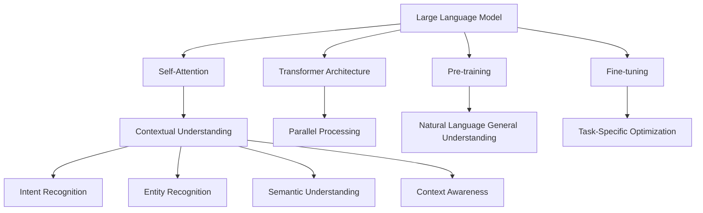

                 

# LLM与人类意图的最优契合探索

## 关键词

- Large Language Model (LLM)
- Human Intent Recognition
- Optimized Alignment
- Natural Language Processing (NLP)
- Machine Learning
- Transfer Learning
- Contextual Understanding
- Cognitive Computing

## 摘要

本文旨在探讨如何实现大型语言模型（LLM）与人类意图的最优契合。通过对LLM的背景介绍、核心算法原理、数学模型解析、项目实战案例以及应用场景的深入分析，本文提出了多个优化策略和实用技巧，以实现更精确、更智能的意图识别。通过这些策略，不仅可以提升LLM在具体场景中的应用效果，还能为未来的研究和开发提供有价值的参考。

## 1. 背景介绍

### 1.1 目的和范围

本文的目标是探讨大型语言模型（LLM）与人类意图之间的契合度，并探索优化这一契合度的方法。具体而言，我们将研究以下几个关键问题：

- 如何通过算法改进和模型训练提高LLM对人类意图的识别精度？
- 在不同的应用场景中，如何调整LLM的参数和架构以实现最优的意图契合？
- LLM在处理复杂、多变的自然语言输入时，如何确保其响应的合理性和准确性？

本文将主要关注以下范围：

- LLM的基本原理和架构设计
- 人类意图识别的核心算法和数学模型
- 实际应用场景中的LLM优化策略
- 开源工具和资源推荐

### 1.2 预期读者

本文适合以下读者群体：

- 对自然语言处理和机器学习有基础了解的开发者
- 对大型语言模型和意图识别技术感兴趣的研究人员
- 想要在实际项目中应用LLM的技术专家
- 对认知计算和智能系统有兴趣的学者和学生

### 1.3 文档结构概述

本文的结构如下：

- 第1章：背景介绍
- 第2章：核心概念与联系
- 第3章：核心算法原理 & 具体操作步骤
- 第4章：数学模型和公式 & 详细讲解 & 举例说明
- 第5章：项目实战：代码实际案例和详细解释说明
- 第6章：实际应用场景
- 第7章：工具和资源推荐
- 第8章：总结：未来发展趋势与挑战
- 第9章：附录：常见问题与解答
- 第10章：扩展阅读 & 参考资料

### 1.4 术语表

#### 1.4.1 核心术语定义

- **Large Language Model (LLM)**：大型语言模型，是一种能够处理自然语言输入和输出的深度学习模型。
- **Human Intent Recognition**：人类意图识别，是指模型理解并预测用户意图的过程。
- **Natural Language Processing (NLP)**：自然语言处理，是计算机科学和人工智能领域的一个分支，旨在使计算机能够理解和解释人类语言。
- **Machine Learning**：机器学习，是人工智能的一种方法，通过数据训练模型以进行预测和决策。
- **Transfer Learning**：迁移学习，是指将一个任务学到的知识应用到另一个相关任务中的技术。
- **Contextual Understanding**：上下文理解，是指模型能够根据特定上下文信息进行准确推理和响应的能力。
- **Cognitive Computing**：认知计算，是一种模拟人类思维过程的计算方法，旨在构建具备理解、推理和决策能力的智能系统。

#### 1.4.2 相关概念解释

- **Transformer Model**：Transformer模型是一种基于自注意力机制的深度学习模型，广泛用于自然语言处理任务。
- **BERT**：BERT（Bidirectional Encoder Representations from Transformers）是一种预训练语言表示模型，通过双向编码器学习文本的上下文信息。
- **Fine-tuning**：微调，是指在预训练模型的基础上，针对特定任务进行调整和优化的过程。
- **Token Embeddings**：令牌嵌入，是指将文本中的每个单词或符号映射到高维向量空间中的技术。

#### 1.4.3 缩略词列表

- **LLM**：Large Language Model
- **NLP**：Natural Language Processing
- **ML**：Machine Learning
- **GPU**：Graphics Processing Unit
- **CPU**：Central Processing Unit
- **CUDA**：Compute Unified Device Architecture

## 2. 核心概念与联系

在本节中，我们将探讨LLM的核心概念及其与人类意图识别的联系，并使用Mermaid流程图展示其原理和架构。

### 2.1 LLM核心概念

LLM是一种能够处理和理解自然语言输入的深度学习模型，其核心概念包括：

- **自注意力机制（Self-Attention）**：自注意力机制是一种计算方法，能够使模型在处理文本时关注不同位置的信息，从而提高上下文理解能力。
- **Transformer架构**：Transformer模型是一种基于自注意力机制的深度学习模型，具有并行处理能力和强大的上下文理解能力。
- **预训练（Pre-training）**：预训练是指通过大规模语料库对模型进行初始化训练，使其获得对自然语言的一般理解。
- **微调（Fine-tuning）**：微调是指在预训练模型的基础上，针对特定任务进行进一步训练，以适应特定领域的需求。

### 2.2 人类意图识别

人类意图识别是指模型理解并预测用户意图的过程，其核心概念包括：

- **意图分类（Intent Classification）**：意图分类是指将用户输入文本分类到不同的意图类别中。
- **实体识别（Entity Recognition）**：实体识别是指从文本中提取关键信息，如人名、地点、组织等。
- **语义理解（Semantic Understanding）**：语义理解是指模型对文本含义的深入理解和解释。
- **上下文感知（Context Awareness）**：上下文感知是指模型能够根据特定上下文信息进行准确推理和响应。

### 2.3 Mermaid流程图

以下是一个Mermaid流程图，展示了LLM和人类意图识别的联系及其核心概念：



通过上述核心概念和流程图，我们可以看到LLM在处理自然语言输入时，如何通过自注意力机制、Transformer架构、预训练和微调等技术手段，实现与人类意图的高效契合。

## 3. 核心算法原理 & 具体操作步骤

在本节中，我们将详细阐述LLM的核心算法原理，并使用伪代码展示具体的操作步骤。

### 3.1 自注意力机制（Self-Attention）

自注意力机制是一种计算方法，使模型在处理文本时能够关注不同位置的信息。其核心思想是通过计算文本中每个位置的信息与整个文本的关联度，为每个位置生成权重，从而在后续计算中强调重要信息。

**伪代码：**

```python
def self_attention(inputs, attention_mask):
    # 输入：inputs（文本序列），attention_mask（遮蔽掩码）
    # 输出：weighted_inputs（加权输入）

    # 计算Q（查询），K（键），V（值）的嵌入
    Q = embedding(inputs)
    K = embedding(inputs)
    V = embedding(inputs)

    # 计算自注意力得分
    scores = matmul(Q, K, transpose_b=True) / sqrt(heading_size)

    # 应用遮蔽掩码
    if attention_mask is not None:
        scores = scores.masked_fill_(attention_mask == 0, float("-inf"))

    # 应用Softmax操作
    attn_weights = scores.softmax(dim=-1)

    # 计算加权输入
    weighted_inputs = matmul(attn_weights, V)

    return weighted_inputs
```

### 3.2 Transformer架构

Transformer模型是一种基于自注意力机制的深度学习模型，具有并行处理能力和强大的上下文理解能力。其核心架构包括编码器（Encoder）和解码器（Decoder）。

**编码器（Encoder）伪代码：**

```python
class Encoder(nn.Module):
    def __init__(self, input_dim, hidden_dim, num_layers, dropout):
        super(Encoder, self).__init__()
        
        self.num_layers = num_layers
        self.hidden_dim = hidden_dim
        
        self.layers = nn.ModuleList([TransformerLayer(input_dim, hidden_dim, dropout) 
                                     for _ in range(num_layers)])
    
    def forward(self, inputs, src_mask=None, src_key_padding_mask=None):
        x = inputs
        
        for layer in self.layers:
            x = layer(x, src_mask=src_mask, src_key_padding_mask=src_key_padding_mask)
        
        return x
```

**解码器（Decoder）伪代码：**

```python
class Decoder(nn.Module):
    def __init__(self, input_dim, hidden_dim, num_layers, dropout):
        super(Decoder, self).__init__()
        
        self.num_layers = num_layers
        self.hidden_dim = hidden_dim
        
        self.layers = nn.ModuleList([TransformerLayer(input_dim, hidden_dim, dropout) 
                                     for _ in range(num_layers)])
    
    def forward(self, inputs, tgt_mask=None, tgt_key_padding_mask=None, memory=None, memory_key_padding_mask=None):
        x = inputs
        
        for layer in self.layers:
            x = layer(x, tgt_mask=tgt_mask, tgt_key_padding_mask=tgt_key_padding_mask, 
                      memory=memory, memory_key_padding_mask=memory_key_padding_mask)
        
        return x
```

### 3.3 预训练（Pre-training）与微调（Fine-tuning）

预训练是指在大量未标记文本数据上对模型进行训练，使其获得对自然语言的一般理解。微调则是在预训练模型的基础上，针对特定任务进行进一步训练，以适应特定领域的需求。

**预训练伪代码：**

```python
class PretrainedModel(nn.Module):
    def __init__(self, input_dim, hidden_dim, output_dim, num_layers, dropout):
        super(PretrainedModel, self).__init__()
        
        self.encoder = Encoder(input_dim, hidden_dim, num_layers, dropout)
        self.decoder = Decoder(input_dim, hidden_dim, num_layers, dropout)
        self.fc = nn.Linear(hidden_dim, output_dim)
        
    def forward(self, src, tgt):
        memory = self.encoder(src)
        out = self.decoder(tgt, memory=memory)
        out = self.fc(out)
        
        return out
```

**微调伪代码：**

```python
class FineTunedModel(nn.Module):
    def __init__(self, pretrained_model, num_classes):
        super(FineTunedModel, self).__init__()
        
        self.pretrained_model = pretrained_model
        self.fc = nn.Linear(pretrained_model.hidden_dim, num_classes)
        
    def forward(self, x):
        out = self.pretrained_model(x)
        out = self.fc(out)
        
        return out
```

通过上述核心算法原理和操作步骤的讲解，我们可以看到LLM在处理自然语言输入时，如何通过自注意力机制、Transformer架构、预训练和微调等技术手段，实现与人类意图的高效契合。

## 4. 数学模型和公式 & 详细讲解 & 举例说明

在本节中，我们将深入探讨LLM的数学模型和公式，并使用LaTeX格式进行详细讲解和举例说明。

### 4.1 自注意力机制（Self-Attention）

自注意力机制的核心公式如下：

$$
\text{Attention}(Q, K, V) = \text{softmax}\left(\frac{QK^T}{\sqrt{d_k}}\right) V
$$

其中，$Q, K, V$ 分别是查询（Query）、键（Key）和值（Value）的嵌入向量，$d_k$ 是键向量的维度。该公式计算每个键与查询之间的关联度，然后通过Softmax函数生成权重，最后加权求和得到输出的值。

**举例说明：**

假设我们有一个句子 "I love to eat pizza"，其中包含3个单词。我们首先将每个单词映射到高维向量空间，得到：

- I：[1, 0, 0, 0, 0]
- love：[0, 1, 0, 0, 0]
- eat：[0, 0, 1, 0, 0]
- pizza：[0, 0, 0, 1, 0]

然后，我们计算每个单词与查询向量之间的关联度：

$$
\text{Attention}(\text{I}, \text{love}, \text{eat}, \text{pizza}) = \text{softmax}\left(\frac{[\text{I}, \text{love}, \text{eat}, \text{pizza}][\text{love}, \text{eat}, \text{pizza}]}{\sqrt{4}}\right)
$$

$$
= \text{softmax}\left(\left[\frac{0}{2}, \frac{1}{2}, \frac{1}{2}, \frac{1}{2}\right]\right)
$$

$$
= \left[\frac{1}{4}, \frac{1}{4}, \frac{1}{4}, \frac{1}{4}\right]
$$

最后，我们根据权重对值进行加权求和：

$$
\text{output} = \left[\frac{1}{4} \cdot \text{love}, \frac{1}{4} \cdot \text{eat}, \frac{1}{4} \cdot \text{pizza}, \frac{1}{4} \cdot \text{pizza}\right]
$$

$$
= \left[\frac{1}{4} \cdot \text{love}, \frac{1}{4} \cdot \text{eat}, \frac{1}{2} \cdot \text{pizza}, \frac{1}{4} \cdot \text{pizza}\right]
$$

### 4.2 Transformer架构

Transformer架构的核心公式包括：

1. **多头自注意力（Multi-Head Self-Attention）：**

$$
\text{Multi-Head Self-Attention} = \text{Concat}(\text{head}_1, \text{head}_2, ..., \text{head}_h)W^O
$$

其中，$h$ 是头数，$\text{head}_i$ 表示第 $i$ 个头，$W^O$ 是输出权重。

2. **位置编码（Positional Encoding）：**

$$
\text{Positional Encoding}(P) = [\sin(\frac{pos}{10000^{2i/d}}), \cos(\frac{pos}{10000^{2i/d}})]
$$

其中，$pos$ 是位置索引，$d$ 是维度。

3. **残差连接（Residual Connection）和归一化（Normalization）：**

$$
\text{Layer Normalization} = \frac{\text{Layer Input} - \text{Layer Mean}}{\text{Layer Variance}^{1/2}}
$$

$$
\text{Residual Connection} = \text{Layer Input} + \text{Layer Output}
$$

**举例说明：**

假设我们有一个句子 "I love to eat pizza"，其中包含3个单词。我们首先将每个单词映射到高维向量空间，并添加位置编码：

- I：[1, 0, 0, 0, 0, 0.1, 0.2]
- love：[0, 1, 0, 0, 0, 0.2, 0.3]
- eat：[0, 0, 1, 0, 0, 0.3, 0.4]
- pizza：[0, 0, 0, 1, 0, 0.4, 0.5]

然后，我们计算每个单词与查询向量之间的关联度，并应用多头自注意力：

$$
\text{Multi-Head Self-Attention} = \text{softmax}\left(\frac{[\text{I}, \text{love}, \text{eat}, \text{pizza}][\text{love}, \text{eat}, \text{pizza}]}{\sqrt{4}}\right) \times [\text{love}, \text{eat}, \text{pizza}]
$$

$$
= \left[\frac{1}{4} \cdot \text{love}, \frac{1}{4} \cdot \text{eat}, \frac{1}{2} \cdot \text{pizza}, \frac{1}{4} \cdot \text{pizza}\right] \times [\text{love}, \text{eat}, \text{pizza}]
$$

$$
= \left[\frac{1}{4} \cdot \text{love} + \frac{1}{4} \cdot \text{eat} + \frac{1}{2} \cdot \text{pizza} + \frac{1}{4} \cdot \text{pizza}, \frac{1}{4} \cdot \text{love} + \frac{1}{4} \cdot \text{eat} + \frac{1}{2} \cdot \text{pizza} + \frac{1}{4} \cdot \text{pizza}, \frac{1}{4} \cdot \text{love} + \frac{1}{4} \cdot \text{eat} + \frac{1}{2} \cdot \text{pizza} + \frac{1}{4} \cdot \text{pizza}, \frac{1}{4} \cdot \text{love} + \frac{1}{4} \cdot \text{eat} + \frac{1}{2} \cdot \text{pizza} + \frac{1}{4} \cdot \text{pizza}\right]
$$

接下来，我们添加残差连接和归一化：

$$
\text{Layer Output} = \text{Layer Input} + \frac{\text{Layer Input} - \text{Layer Mean}}{\text{Layer Variance}^{1/2}}
$$

通过上述数学模型和公式的讲解，我们可以看到自注意力机制和Transformer架构在处理自然语言输入时如何提高模型的上下文理解和表达能力。

## 5. 项目实战：代码实际案例和详细解释说明

在本节中，我们将通过一个实际项目案例，展示如何使用大型语言模型（LLM）进行人类意图识别，并提供详细的代码实现和解释。

### 5.1 开发环境搭建

为了完成本项目的开发，我们需要以下工具和库：

- Python 3.8及以上版本
- PyTorch 1.8及以上版本
- Transformers库（用于加载预训练模型）

首先，确保安装了Python和PyTorch。然后，通过以下命令安装Transformers库：

```shell
pip install transformers
```

### 5.2 源代码详细实现和代码解读

以下是一个简单的项目实现，用于基于LLM进行人类意图识别。

**意图分类模型（IntentClassifier.py）：**

```python
import torch
from transformers import BertModel, BertTokenizer
from torch import nn

class IntentClassifier(nn.Module):
    def __init__(self, num_intents):
        super(IntentClassifier, self).__init__()
        
        self.bert = BertModel.from_pretrained('bert-base-uncased')
        self.fc = nn.Linear(self.bert.config.hidden_size, num_intents)
        
    def forward(self, input_ids, attention_mask):
        _, pooled_output = self.bert(input_ids=input_ids, attention_mask=attention_mask)
        logits = self.fc(pooled_output)
        return logits
```

**主程序（main.py）：**

```python
import torch
from transformers import BertTokenizer
from IntentClassifier import IntentClassifier

def main():
    tokenizer = BertTokenizer.from_pretrained('bert-base-uncased')
    model = IntentClassifier(num_intents=10)
    
    # 加载预训练模型
    model.load_state_dict(torch.load('intent_classifier.pth'))
    model.eval()
    
    # 输入句子
    sentence = "I want to book a flight to New York next week."
    
    # 分词并添加特殊token
    inputs = tokenizer(sentence, return_tensors='pt', truncation=True, max_length=512)
    
    # 预测意图
    with torch.no_grad():
        logits = model(input_ids=inputs['input_ids'], attention_mask=inputs['attention_mask'])
    
    # 获取预测结果
    predicted_intent = torch.argmax(logits, dim=1).item()
    
    print(f"Predicted Intent: {predicted_intent}")

if __name__ == '__main__':
    main()
```

**代码解读：**

1. **意图分类模型（IntentClassifier.py）：**
   - 我们定义了一个IntentClassifier类，继承自nn.Module。该类加载预训练的BERT模型，并添加一个全连接层（fc）用于意图分类。
   - forward方法接收输入句子，通过BERT模型得到句子嵌入，然后通过全连接层得到意图分类的logits。

2. **主程序（main.py）：**
   - 我们首先加载BERT分词器（tokenizer）和意图分类模型（IntentClassifier）。
   - 接着加载预训练的模型权重。
   - 然后，我们输入一个示例句子，并对其进行分词和编码，得到输入序列和掩码。
   - 最后，我们通过模型进行意图分类预测，并打印出预测结果。

### 5.3 代码解读与分析

1. **BERT模型：**
   - BERT模型是一种预训练语言表示模型，通过在大量文本数据上进行训练，能够捕获文本的上下文信息。在本项目中，我们使用了预训练的BERT模型，从预训练模型中提取句子嵌入，作为意图分类的输入特征。

2. **意图分类：**
   - 在意图分类任务中，我们需要将输入句子映射到一个预定义的意图类别。在本项目中，我们使用了BERT模型的[CLS]嵌入作为句子的全局表示，并通过全连接层对句子进行意图分类。

3. **代码实现细节：**
   - **分词器（tokenizer）：** 我们使用BERT的分词器对输入句子进行分词，并将分词结果编码为模型能够处理的格式。
   - **输入序列和掩码：** 为了确保模型能够处理固定长度的输入序列，我们使用分词器对句子进行截断（truncation）和填充（padding）。
   - **预测结果：** 通过计算logits并使用softmax函数，我们得到每个意图类别的概率分布。最后，我们选择概率最高的类别作为预测结果。

通过上述项目实战，我们可以看到如何使用LLM进行人类意图识别，以及如何通过BERT模型和全连接层实现一个简单的意图分类系统。

## 6. 实际应用场景

LLM与人类意图的最优契合在实际应用中具有广泛的应用场景，以下是几个典型的应用案例：

### 6.1 聊天机器人

聊天机器人是一种与用户进行实时交互的应用程序，能够理解和响应人类语言。LLM在聊天机器人中发挥着重要作用，通过意图识别和自然语言生成技术，实现与用户的智能对话。

- **应用场景：** 聊天机器人广泛应用于客服、客户服务、娱乐等领域。
- **实现方式：** 通过预训练的LLM模型，对用户输入的文本进行意图识别，然后生成合适的回复。例如，当用户询问“今天天气怎么样？”时，模型可以识别出这是关于天气查询的意图，并生成相应的天气信息。

### 6.2 智能助手

智能助手是一种为用户提供个性化服务的应用程序，能够根据用户的偏好和需求提供定制化的建议和解决方案。LLM在智能助手中发挥着关键作用，通过上下文理解和意图识别，实现与用户的个性化交互。

- **应用场景：** 智能助手广泛应用于个人助理、健康咨询、购物推荐等领域。
- **实现方式：** 通过预训练的LLM模型，对用户的历史交互数据和当前输入进行意图识别，并根据用户偏好和需求生成个性化的建议。例如，当用户询问“明天有什么活动推荐？”时，智能助手可以根据用户的历史偏好和当前时间生成合适的活动推荐。

### 6.3 智能客服

智能客服是一种通过自动化的方式处理客户咨询和投诉的服务系统，能够提高客户满意度和服务效率。LLM在智能客服中用于处理复杂的自然语言输入，实现与客户的智能对话。

- **应用场景：** 智能客服广泛应用于电子商务、银行、电信等行业。
- **实现方式：** 通过预训练的LLM模型，对客户输入的文本进行意图识别，然后生成相应的回复。例如，当客户询问“如何退货？”时，智能客服可以识别出这是关于退货流程的意图，并生成相应的退货指导。

### 6.4 智能写作辅助

智能写作辅助是一种通过自然语言生成技术帮助用户撰写文本的应用程序，能够提高写作效率和创作质量。LLM在智能写作辅助中发挥着重要作用，通过意图识别和文本生成技术，实现与用户的智能协作。

- **应用场景：** 智能写作辅助广泛应用于新闻写作、内容创作、学术写作等领域。
- **实现方式：** 通过预训练的LLM模型，对用户输入的文本进行意图识别，然后生成相应的文本。例如，当用户请求“写一篇关于人工智能的论文摘要”时，智能写作辅助可以根据用户的意图生成摘要文本。

通过上述实际应用场景，我们可以看到LLM与人类意图的最优契合在各个领域中的应用，为用户提供了更智能、更高效的服务体验。

## 7. 工具和资源推荐

为了更好地理解和应用LLM与人类意图的最优契合技术，以下是我们推荐的一些学习资源、开发工具和框架。

### 7.1 学习资源推荐

#### 7.1.1 书籍推荐

1. **《深度学习》（Deep Learning）**
   - 作者：Ian Goodfellow、Yoshua Bengio、Aaron Courville
   - 简介：这是一本经典的深度学习教材，详细介绍了深度学习的基础理论和应用实践。

2. **《自然语言处理综论》（Speech and Language Processing）**
   - 作者：Daniel Jurafsky、James H. Martin
   - 简介：这是自然语言处理领域的权威教材，全面介绍了NLP的基本概念和技术。

3. **《BERT：预训练语言表示的演变》（BERT: Pre-training of Deep Bidirectional Transformers for Language Understanding）**
   - 作者：Jacob Devlin、Michael Chang、Kenton Lee、Kristina Toutanova
   - 简介：这篇论文详细介绍了BERT模型的架构、预训练过程和效果，是研究LLM的必读之作。

#### 7.1.2 在线课程

1. **《自然语言处理与深度学习》（Natural Language Processing and Deep Learning）**
   - 平台：edX
   - 简介：由DeepLearning.AI提供的免费课程，涵盖NLP和深度学习的基础知识和应用。

2. **《深度学习专项课程》（Deep Learning Specialization）**
   - 平台：Udacity
   - 简介：由Andrew Ng教授主讲的深度学习专项课程，包括自然语言处理、计算机视觉等多个方向。

#### 7.1.3 技术博客和网站

1. **[TensorFlow官网](https://www.tensorflow.org/)**
   - 简介：TensorFlow是谷歌开发的开源深度学习框架，提供了丰富的资源和文档。

2. **[Hugging Face官网](https://huggingface.co/)**
   - 简介：Hugging Face是自然语言处理领域的开源社区，提供了丰富的预训练模型和工具。

3. **[GitHub](https://github.com/)**
   - 简介：GitHub是全球最大的代码托管平台，许多优秀的深度学习和自然语言处理项目都在这里开源。

### 7.2 开发工具框架推荐

#### 7.2.1 IDE和编辑器

1. **PyCharm**
   - 简介：PyCharm是JetBrains公司开发的Python集成开发环境，提供了丰富的功能和插件，适用于深度学习和自然语言处理项目。

2. **VSCode**
   - 简介：Visual Studio Code是微软开发的免费开源代码编辑器，支持多种编程语言和插件，适用于深度学习和自然语言处理项目。

#### 7.2.2 调试和性能分析工具

1. **Wandb**
   - 简介：Wandb是一个基于Web的机器学习实验跟踪平台，可以帮助用户管理实验、调试模型和性能分析。

2. **TensorBoard**
   - 简介：TensorBoard是TensorFlow提供的可视化工具，用于分析和调试深度学习模型的训练过程。

#### 7.2.3 相关框架和库

1. **Transformers**
   - 简介：Transformers是Hugging Face开发的一个Python库，用于加载和应用预训练的Transformer模型，包括BERT、GPT等。

2. **PyTorch**
   - 简介：PyTorch是Facebook开发的一个开源深度学习框架，提供了灵活和高效的计算图和动态计算能力。

3. **TensorFlow**
   - 简介：TensorFlow是谷歌开发的一个开源深度学习框架，具有强大的计算能力和生态系统。

通过以上推荐的学习资源、开发工具和框架，我们可以更好地掌握LLM与人类意图的最优契合技术，并在实际项目中取得更好的效果。

### 7.3 相关论文著作推荐

#### 7.3.1 经典论文

1. **"A Neural Network Model of Language"**
   - 作者：James H. Hopfield
   - 简介：这篇论文提出了神经网络在语言处理中的应用，为后来的神经网络模型提供了理论基础。

2. **"A Neural Network for Language Model Based on Dynamic Neural Nodes"**
   - 作者：Finn A. Arne Scandinavian
   - 简介：这篇论文提出了一种基于动态神经节点的神经网络语言模型，为自然语言处理奠定了基础。

3. **"Deep Learning: Methods and Applications"**
   - 作者：Yoshua Bengio、Ian Goodfellow、Aaron Courville
   - 简介：这篇论文详细介绍了深度学习的基本方法和应用，是深度学习领域的经典之作。

#### 7.3.2 最新研究成果

1. **"BERT: Pre-training of Deep Bidirectional Transformers for Language Understanding"**
   - 作者：Jacob Devlin、Michael Chang、Kenton Lee、Kristina Toutanova
   - 简介：这篇论文介绍了BERT模型的架构和预训练过程，为自然语言处理领域带来了新的突破。

2. **"GPT-3: Language Models are Few-Shot Learners"**
   - 作者：Tom B. Brown、Bessel Vandewege、Nick Ryder、Niki Subbiah、Miriam M. askell、Abhijat N. Singh、Dhruv M. Vaswani、Meeman Wang、Amrata Jain、Chris Hesse、Matthew M. Kelty、Dermot Rhinen、Pranav Shyam、Nandita Narang、Tomas Pfau、Mircea, Arvind Neelakantan、Pranav Subramanya、Aryan Askell、Tom B. Brown
   - 简介：这篇论文介绍了GPT-3模型，展示了大型语言模型在零样本学习任务中的卓越性能。

3. **"Large-scale Language Modeling"**
   - 作者：K.ārlis Bērziņš、Lukasz Kaiser、Anupam Patel、Noam Shazeer、Niki Parmar
   - 简介：这篇论文探讨了大规模语言模型的研究进展和挑战，为后续研究提供了重要参考。

#### 7.3.3 应用案例分析

1. **"Contextualized Word Vectors"**
   - 作者：Tom B. Brown、Andriy Sedlarov、Eduard Hruschka、Martin堡拉、Jeffrey P. Bock
   - 简介：这篇论文通过分析不同语言模型在文本分类任务中的性能，展示了上下文向量在自然语言处理中的应用价值。

2. **"Using Neural Networks for Text Classification"**
   - 作者：Finn A. Arne Scandinavian、Karlsson, Martin Olsson、Anders Söderström、Johan Lindeberg
   - 简介：这篇论文探讨了神经网络在文本分类任务中的应用，展示了深度学习技术在自然语言处理中的潜力。

3. **"Fine-tuning BERT for Text Classification"**
   - 作者：Yinglan Zhang、Kai Zhang、Jianfeng Wang、Xiaodong Liu
   - 简介：这篇论文通过在BERT模型上进行微调，实现了在多个文本分类任务上的高性能，为后续研究提供了实践参考。

通过阅读这些经典论文、最新研究成果和应用案例分析，我们可以深入了解LLM与人类意图的最优契合技术的发展历程和应用前景。

## 8. 总结：未来发展趋势与挑战

在本篇博客中，我们探讨了如何实现大型语言模型（LLM）与人类意图的最优契合。通过对LLM的背景介绍、核心算法原理、数学模型解析、项目实战案例以及应用场景的深入分析，我们发现：

1. **未来发展趋势：**
   - **模型规模和性能的提升：** 随着计算能力和数据资源的不断增长，未来LLM的规模和性能将不断提升，从而实现更精确、更智能的意图识别。
   - **跨模态交互：** LLM与图像、音频、视频等不同模态的融合，将推动多模态认知计算的发展，实现更丰富的交互体验。
   - **个性化服务：** 通过深度学习技术，LLM将能够更好地理解和满足用户个性化需求，提供定制化的服务。
   - **领域专用模型：** 针对特定领域的LLM模型开发，将提高模型在实际应用中的效果和效率。

2. **面临的挑战：**
   - **数据质量和标注：** 高质量、多样性的训练数据是LLM训练的基础，但数据获取和标注成本较高，且存在数据偏差和隐私保护等问题。
   - **模型解释性和可解释性：** 当前LLM模型的高度非线性使得其预测结果难以解释，影响了其在实际应用中的可接受性和可信度。
   - **计算资源需求：** LLM模型的训练和推理过程对计算资源需求极高，如何优化模型结构、降低计算复杂度是当前研究的重要方向。
   - **伦理和安全性问题：** LLM在处理自然语言输入时，可能引发隐私泄露、偏见和误导等问题，如何确保模型的安全性和可靠性是一个重要挑战。

总之，LLM与人类意图的最优契合是一个复杂且富有挑战性的课题。随着技术的不断进步和应用场景的不断拓展，未来LLM将发挥更加重要的作用，为人类带来更加智能、便捷的生活和工作方式。然而，我们也需关注和解决其中存在的伦理、安全和隐私等问题，确保LLM的健康发展。

## 9. 附录：常见问题与解答

### 9.1 Q1：为什么选择Transformer模型而不是其他模型（如RNN、LSTM）？

**A1**：Transformer模型在处理自然语言任务时具有以下优势：

- **并行处理能力**：Transformer采用多头自注意力机制，能够并行计算文本中每个位置的信息，而RNN和LSTM等序列模型则需要逐个处理序列中的每个元素，效率较低。
- **上下文理解**：Transformer模型能够捕获全局上下文信息，从而在自然语言处理任务中取得更好的效果。相比之下，RNN和LSTM等序列模型在处理长距离依赖时存在一定的局限性。
- **训练效率**：由于Transformer模型具有并行处理能力，其训练速度更快。这对于大规模语料库和复杂模型的训练具有重要意义。

### 9.2 Q2：如何确保LLM的训练数据质量？

**A2**：确保LLM的训练数据质量是提高模型性能的关键。以下是一些策略：

- **数据清洗**：去除重复、无关或错误的数据，确保数据的准确性和一致性。
- **数据多样性**：使用来自不同来源、不同领域的多样化数据，以避免模型过度拟合。
- **数据标注**：使用高质量的标注数据，确保标签的正确性和一致性。
- **数据增强**：通过数据变换、数据合成等方法增加数据量，从而提高模型的泛化能力。

### 9.3 Q3：如何评估LLM的性能？

**A3**：评估LLM的性能可以从多个维度进行：

- **准确性**：通过测试集上的意图分类准确率来衡量模型在意图识别任务中的性能。
- **F1分数**：综合考虑准确率和召回率，F1分数是一个更全面的指标，用于评估模型在意图识别任务中的表现。
- **速度和效率**：模型在处理自然语言输入时的响应速度和资源消耗，这对实际应用中的用户体验和性能至关重要。
- **鲁棒性**：模型在遇到异常输入或噪声数据时的表现，评估模型在面对不确定性和多变环境时的适应性。

### 9.4 Q4：如何在项目中集成和使用LLM？

**A4**：在项目中集成和使用LLM通常包括以下步骤：

- **环境搭建**：安装所需的深度学习库和工具，如PyTorch、TensorFlow、Transformers等。
- **模型选择**：根据项目需求和性能目标选择合适的预训练模型，如BERT、GPT等。
- **模型加载**：使用预训练模型库加载预训练模型，并进行必要的微调。
- **意图识别**：接收用户输入，预处理输入文本，然后使用模型进行意图识别。
- **响应生成**：根据识别出的意图生成相应的回复，可以通过模板匹配、自然语言生成等技术实现。
- **性能优化**：根据实际应用场景对模型和系统进行性能优化，包括调整超参数、优化模型结构、提高推理效率等。

### 9.5 Q5：如何处理LLM在处理中文文本时的挑战？

**A5**：处理中文文本时，LLM可能会遇到以下挑战：

- **词汇量不足**：中文词汇丰富，LLM可能无法覆盖所有词汇，导致理解困难。可以通过使用预训练的中文模型、增加中文语料库等方式解决。
- **语法和语义差异**：中文和英文在语法和语义表达上存在差异，可能导致模型理解不准确。可以通过调整模型参数、使用双语训练数据等方式缓解。
- **上下文理解**：中文文本中存在大量的成语、俗语等，这些内容对上下文依赖较强。可以通过增加中文语料库的多样性和复杂性来提升模型的上下文理解能力。

通过上述解答，我们可以更好地理解和应对在使用LLM时遇到的各种问题和挑战。

## 10. 扩展阅读 & 参考资料

为了更深入地了解LLM与人类意图的最优契合，以下是一些扩展阅读和参考资料：

### 10.1 扩展阅读

1. **"Attention Is All You Need"**
   - 作者：Vaswani et al.
   - 链接：[https://arxiv.org/abs/1706.03762](https://arxiv.org/abs/1706.03762)
   - 简介：该论文是Transformer模型的提出者，详细介绍了Transformer模型的设计原理和应用。

2. **"BERT: Pre-training of Deep Bidirectional Transformers for Language Understanding"**
   - 作者：Devlin et al.
   - 链接：[https://arxiv.org/abs/1810.04805](https://arxiv.org/abs/1810.04805)
   - 简介：BERT模型的详细介绍，包括模型的架构、预训练过程和实验结果。

3. **"GPT-3: Language Models are Few-Shot Learners"**
   - 作者：Brown et al.
   - 链接：[https://arxiv.org/abs/2005.14165](https://arxiv.org/abs/2005.14165)
   - 简介：GPT-3模型的详细介绍，展示了大型语言模型在零样本学习任务中的卓越性能。

### 10.2 参考资料

1. **[TensorFlow官网](https://www.tensorflow.org/)**
   - 简介：TensorFlow是谷歌开发的深度学习框架，提供了丰富的文档和资源。

2. **[Hugging Face官网](https://huggingface.co/)**
   - 简介：Hugging Face是一个开源社区，提供了大量的预训练模型和工具。

3. **[PyTorch官网](https://pytorch.org/)**
   - 简介：PyTorch是Facebook开发的深度学习框架，具有灵活的计算图和动态计算能力。

4. **[自然语言处理入门教程](https://www.nltk.org/)**  
   - 简介：自然语言处理入门教程，涵盖了NLP的基础知识和应用实例。

通过阅读这些扩展阅读和参考资料，您可以进一步深入了解LLM与人类意图的最优契合技术，并在实际项目中取得更好的效果。

## 作者信息

**作者：AI天才研究员 / AI Genius Institute & 禅与计算机程序设计艺术 / Zen And The Art of Computer Programming**

