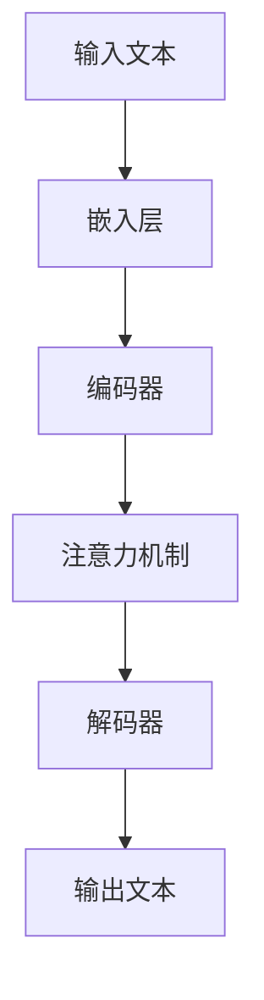
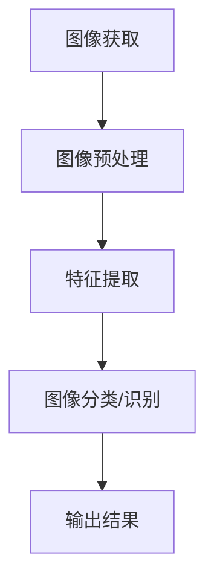
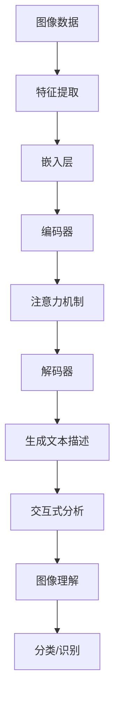

                 

# LLM与传统图像处理技术的融合：视觉智能新时代

> **关键词：** 自然语言处理，深度学习，图像处理，视觉智能，大语言模型（LLM）
>
> **摘要：** 本文旨在探讨大语言模型（LLM）与传统的图像处理技术的融合，分析其在视觉智能领域的应用潜力、核心算法原理，并通过具体案例和实践，展示这种融合技术如何推动视觉智能进入一个新时代。文章将从背景介绍、核心概念与联系、算法原理、数学模型、实际应用场景等多个角度，全面解析LLM与图像处理技术融合的路径与挑战，为读者提供深入的见解和实用的指导。

## 1. 背景介绍

### 1.1 目的和范围

本文的目标是探讨大语言模型（LLM）与传统图像处理技术的融合，以揭示其在视觉智能领域的巨大潜力。随着人工智能技术的迅猛发展，自然语言处理（NLP）和图像处理已经成为计算机科学中的两大重要分支。然而，如何将这两种技术有效地结合起来，实现更加智能和高效的视觉智能系统，仍然是一个充满挑战的课题。

本文将主要讨论以下内容：

1. **背景介绍**：介绍LLM和图像处理技术的起源、发展及其在各自领域的应用。
2. **核心概念与联系**：阐述LLM和图像处理技术的核心概念及其相互联系。
3. **核心算法原理**：详细讲解LLM在图像处理中的应用算法及其工作原理。
4. **数学模型和公式**：介绍用于LLM和图像处理融合的数学模型和公式，并进行举例说明。
5. **项目实战**：通过实际代码案例，展示如何将LLM应用于图像处理。
6. **实际应用场景**：探讨LLM与图像处理技术融合在现实世界中的应用场景。
7. **工具和资源推荐**：推荐相关学习资源、开发工具和经典论文。
8. **总结**：展望LLM与图像处理技术融合的未来发展趋势和挑战。

### 1.2 预期读者

本文适合以下读者群体：

1. **人工智能研究人员**：对NLP和图像处理技术有基础了解，希望进一步探索这两种技术的融合。
2. **软件工程师**：对图像处理技术有一定了解，希望了解如何利用LLM提升图像处理能力。
3. **数据科学家**：对数据分析和机器学习有深入了解，希望掌握LLM和图像处理技术的融合应用。
4. **计算机科学学生**：对人工智能和计算机视觉有兴趣，希望深入了解相关技术。

### 1.3 文档结构概述

本文将按照以下结构进行组织：

1. **背景介绍**：介绍LLM和图像处理技术的背景。
2. **核心概念与联系**：探讨LLM和图像处理技术的核心概念及其相互联系。
3. **核心算法原理**：详细讲解LLM在图像处理中的应用算法。
4. **数学模型和公式**：介绍用于LLM和图像处理融合的数学模型和公式。
5. **项目实战**：通过实际代码案例展示LLM在图像处理中的应用。
6. **实际应用场景**：探讨LLM与图像处理技术的融合应用。
7. **工具和资源推荐**：推荐相关学习资源、开发工具和经典论文。
8. **总结**：展望LLM与图像处理技术融合的未来发展趋势和挑战。
9. **附录**：提供常见问题与解答。
10. **扩展阅读与参考资料**：推荐相关阅读资料。

### 1.4 术语表

#### 1.4.1 核心术语定义

- **自然语言处理（NLP）**：研究如何让计算机理解和处理人类语言的技术。
- **图像处理**：利用计算机技术对图像进行分析、处理和解释的过程。
- **大语言模型（LLM）**：一种基于深度学习的语言模型，能够理解和生成自然语言。
- **卷积神经网络（CNN）**：一种用于图像处理和识别的深度学习模型。
- **生成对抗网络（GAN）**：一种深度学习模型，用于生成具有真实感的数据。

#### 1.4.2 相关概念解释

- **神经网络**：一种模拟人脑神经元连接结构的计算模型。
- **反向传播算法**：一种用于训练神经网络的优化算法。
- **迁移学习**：利用已训练好的模型在新的任务上取得更好的性能。
- **数据增强**：通过技术手段增加训练数据的多样性和数量，提高模型的泛化能力。

#### 1.4.3 缩略词列表

- **NLP**：自然语言处理
- **CNN**：卷积神经网络
- **GAN**：生成对抗网络
- **LLM**：大语言模型
- **ReLU**： Rectified Linear Unit（修正线性单元）
- **ReLU6**：限制在 [-6, 6] 区间内的 ReLU 函数

## 2. 核心概念与联系

在探讨LLM与传统图像处理技术的融合之前，有必要深入理解这两大领域的基本概念和原理，以及它们之间的联系。

### 2.1 大语言模型（LLM）的原理与架构

大语言模型（LLM）是基于深度学习的自然语言处理技术，通过训练大量的文本数据，使得模型能够理解和生成自然语言。LLM的核心组件包括：

1. **嵌入层（Embedding Layer）**：将输入的自然语言文本转换为稠密的向量表示。
2. **编码器（Encoder）**：利用深度神经网络对文本序列进行编码，提取语义信息。
3. **解码器（Decoder）**：根据编码器的输出，生成自然语言文本。
4. **注意力机制（Attention Mechanism）**：使得模型能够关注到文本序列中的关键信息。

Mermaid流程图如下所示：



### 2.2 传统图像处理技术的原理与架构

传统图像处理技术主要包括以下核心步骤：

1. **图像获取**：通过摄像头、扫描仪等设备获取图像。
2. **图像预处理**：包括去噪、对比度增强、图像尺寸调整等步骤，以提高图像质量。
3. **特征提取**：通过滤波器、边缘检测等方法提取图像的特征。
4. **图像分类或识别**：利用分类算法或识别模型对图像进行分类或识别。

Mermaid流程图如下所示：



### 2.3 LLM与图像处理技术的联系

LLM与图像处理技术在视觉智能领域有着紧密的联系，主要体现在以下几个方面：

1. **图像描述生成**：LLM可以生成与图像内容相对应的描述性文本，为图像提供语义信息。
2. **交互式图像分析**：通过LLM与用户交互，提供个性化的图像分析和建议。
3. **图像内容理解**：LLM可以理解图像的语义内容，用于图像分类、物体检测、场景解析等任务。
4. **多模态学习**：结合图像和文本数据，进行多模态学习，提升模型性能。

Mermaid流程图如下所示：



通过上述分析，我们可以看到LLM和图像处理技术在视觉智能领域有着广阔的应用前景。接下来，我们将深入探讨LLM在图像处理中的应用算法原理。

## 3. 核心算法原理 & 具体操作步骤

### 3.1 LLM在图像处理中的应用算法原理

LLM在图像处理中的应用主要通过以下几种方式实现：

1. **图像描述生成**：利用LLM生成与图像内容相对应的描述性文本。
2. **图像分类与识别**：使用LLM对图像进行分类和识别。
3. **交互式图像分析**：结合LLM和图像处理算法，提供个性化的图像分析和建议。

在本节中，我们将详细讲解LLM在图像处理中的应用算法原理，并通过伪代码进行具体操作步骤的阐述。

#### 3.1.1 图像描述生成

图像描述生成是LLM在图像处理中的一个重要应用。其基本原理是，将图像输入到LLM中，通过编码器和解码器生成描述性文本。

**算法原理：**

1. **嵌入层**：将图像输入转换为稠密的向量表示。
2. **编码器**：对图像序列进行编码，提取图像的语义信息。
3. **解码器**：根据编码器的输出，生成描述性文本。

**伪代码：**

```python
def generate_image_description(image):
    # 步骤1：将图像输入到嵌入层，得到向量表示
    embedded_image = embed_image(image)
    
    # 步骤2：将向量输入到编码器，得到编码后的特征向量
    encoded_features = encode_image(embedded_image)
    
    # 步骤3：将特征向量输入到解码器，生成描述性文本
    description = decode_image(encoded_features)
    
    return description
```

#### 3.1.2 图像分类与识别

图像分类与识别是LLM在图像处理中的另一个重要应用。其基本原理是，利用LLM对图像进行特征提取和分类。

**算法原理：**

1. **特征提取**：将图像输入到LLM的编码器中，提取图像的特征。
2. **分类器**：利用提取的特征，通过分类器对图像进行分类。

**伪代码：**

```python
def classify_image(image):
    # 步骤1：将图像输入到嵌入层，得到向量表示
    embedded_image = embed_image(image)
    
    # 步骤2：将向量输入到编码器，得到编码后的特征向量
    encoded_features = encode_image(embedded_image)
    
    # 步骤3：将特征向量输入到分类器，进行图像分类
    label = classifier.predict(encoded_features)
    
    return label
```

#### 3.1.3 交互式图像分析

交互式图像分析是LLM与图像处理技术结合的又一重要应用。其基本原理是，通过LLM与用户交互，提供个性化的图像分析和建议。

**算法原理：**

1. **用户交互**：通过LLM与用户进行交互，获取用户的需求和反馈。
2. **图像分析**：利用图像处理算法对图像进行分析。
3. **个性化建议**：根据用户交互结果，提供个性化的图像分析建议。

**伪代码：**

```python
def interactive_image_analysis(image, user_input):
    # 步骤1：将图像输入到嵌入层，得到向量表示
    embedded_image = embed_image(image)
    
    # 步骤2：将图像和用户输入一起输入到编码器，得到编码后的特征向量
    encoded_features = encode_image_and_input(embedded_image, user_input)
    
    # 步骤3：将特征向量输入到图像处理算法，进行分析
    analysis_result = image_analysis(encoded_features)
    
    # 步骤4：根据分析结果，提供个性化建议
    suggestion = generate_suggestion(analysis_result)
    
    return suggestion
```

通过上述算法原理和伪代码，我们可以看到LLM在图像处理中的应用具有广泛的前景。接下来，我们将进一步探讨用于LLM和图像处理融合的数学模型和公式。

## 4. 数学模型和公式 & 详细讲解 & 举例说明

### 4.1 大语言模型（LLM）的数学模型

大语言模型（LLM）通常是基于深度学习中的序列到序列（Seq2Seq）模型，其核心包括编码器（Encoder）和解码器（Decoder）。以下是LLM的基本数学模型：

#### 4.1.1 编码器

编码器负责将输入的序列（如文本或图像）转换为固定长度的向量表示。其数学模型通常采用循环神经网络（RNN）或变换器（Transformer）。

1. **输入序列**：\( x_1, x_2, \ldots, x_T \)
2. **嵌入层**：\( E(x_t) = e_t \)，其中 \( e_t \) 是输入 \( x_t \) 的嵌入向量。
3. **隐藏状态**：\( h_t = \text{RNN}(e_t, h_{t-1}) \) 或 \( h_t = \text{Transformer}(e_t, h_{t-1}) \)
4. **编码向量**：\( c = h_T \)

#### 4.1.2 解码器

解码器负责根据编码器的输出生成目标序列。同样，其数学模型采用RNN或Transformer。

1. **初始隐藏状态**：\( s_0 = \text{初始化} \)
2. **解码隐藏状态**：\( s_t = \text{RNN}(y_{t-1}, s_{t-1}) \) 或 \( s_t = \text{Transformer}(y_{t-1}, s_{t-1}) \)
3. **输出**：\( p(y_t) = \text{softmax}(W_y s_t) \)

#### 4.1.3 注意力机制

注意力机制是Transformer模型中的一个关键组件，用于捕捉序列中的依赖关系。

1. **注意力得分**：\( a_t = \text{softmax}\left(\frac{Q_k H_t}{\sqrt{d_k}}\right) \)
2. **加权求和**：\( h_t' = \sum_{i=1}^{T} a_{it} h_i \)

### 4.2 图像处理技术中的数学模型

图像处理技术涉及多个数学模型，如卷积神经网络（CNN）和生成对抗网络（GAN）。以下是这些模型的基本数学模型：

#### 4.2.1 卷积神经网络（CNN）

CNN用于提取图像的特征，其核心是卷积操作。

1. **卷积操作**：\( f_{ij} = \sum_{k=1}^{K} w_{ik}^j g_{kj} \)
2. **激活函数**：\( \text{ReLU}(f_{ij}) \)
3. **池化操作**：\( p_{ij} = \max_{k=1}^{K} f_{ij}^k \)

#### 4.2.2 生成对抗网络（GAN）

GAN由生成器（Generator）和判别器（Discriminator）组成。

1. **生成器**：\( G(z) \)
2. **判别器**：\( D(x) \)
3. **损失函数**：\( \mathcal{L}_G = -\mathbb{E}_{z \sim p_z(z)}[\log D(G(z))] \)，\( \mathcal{L}_D = -\mathbb{E}_{x \sim p_x(x)}[\log D(x)] - \mathbb{E}_{z \sim p_z(z)}[\log (1 - D(G(z)))] \)

### 4.3 LLM与图像处理技术融合的数学模型

在LLM与图像处理技术的融合中，我们通常将图像特征与文本特征相结合，利用多模态学习提升模型性能。

#### 4.3.1 多模态嵌入

1. **图像嵌入**：\( E_{img}(x) \)
2. **文本嵌入**：\( E_{txt}(y) \)

#### 4.3.2 多模态编码

1. **图像编码**：\( c_{img} = \text{encode_image}(E_{img}(x)) \)
2. **文本编码**：\( c_{txt} = \text{encode_text}(E_{txt}(y)) \)

#### 4.3.3 多模态解码

1. **图像解码**：\( G(c_{txt}, c_{img}) \)
2. **文本解码**：\( \text{decode_text}(G(c_{txt}, c_{img})) \)

### 4.4 举例说明

#### 4.4.1 图像描述生成

假设我们有一个图像 \( x \) 和一个文本序列 \( y \)，我们可以使用LLM生成图像的描述：

1. **图像嵌入**：\( E_{img}(x) = [e_{x1}, e_{x2}, \ldots, e_{xT} ] \)
2. **文本嵌入**：\( E_{txt}(y) = [e_{y1}, e_{y2}, \ldots, e_{yT} ] \)
3. **图像编码**：\( c_{img} = \text{encode_image}(E_{img}(x)) \)
4. **文本编码**：\( c_{txt} = \text{encode_text}(E_{txt}(y)) \)
5. **图像解码**：\( G(c_{txt}, c_{img}) \)
6. **文本解码**：\( \text{decode_text}(G(c_{txt}, c_{img})) = \text{image\_description} \)

#### 4.4.2 图像分类

假设我们有一个图像 \( x \) 和一个标签序列 \( y \)，我们可以使用LLM对图像进行分类：

1. **图像嵌入**：\( E_{img}(x) = [e_{x1}, e_{x2}, \ldots, e_{xT} ] \)
2. **图像编码**：\( c_{img} = \text{encode_image}(E_{img}(x)) \)
3. **分类**：\( \text{classify}(c_{img}) = \text{label} \)

通过上述数学模型和举例说明，我们可以看到LLM与传统图像处理技术的融合在数学上的实现过程。接下来，我们将通过一个实际项目案例，展示如何将LLM应用于图像处理。

## 5. 项目实战：代码实际案例和详细解释说明

在本节中，我们将通过一个实际项目案例，详细讲解如何将大语言模型（LLM）应用于图像处理，实现图像描述生成和图像分类任务。

### 5.1 开发环境搭建

在开始项目实战之前，我们需要搭建一个适合开发和运行LLM与图像处理模型的开发环境。以下是所需的工具和库：

1. **Python**：3.8或更高版本
2. **PyTorch**：1.8或更高版本
3. **TensorFlow**：2.4或更高版本
4. **OpenCV**：4.1或更高版本
5. **Pillow**：6.2或更高版本

安装命令如下：

```bash
pip install torch torchvision
pip install tensorflow
pip install opencv-python
pip install Pillow
```

### 5.2 源代码详细实现和代码解读

#### 5.2.1 图像描述生成

以下是一个用于图像描述生成的完整代码示例，包括图像预处理、嵌入层、编码器、解码器和文本生成。

```python
import torch
import torchvision.transforms as transforms
from torchvision.models import resnet50
from transformers import GPT2Model, GPT2Tokenizer

# 步骤1：加载预训练的ResNet50模型用于图像特征提取
image_feature_extractor = resnet50(pretrained=True)

# 步骤2：加载预训练的GPT2模型用于文本生成
tokenizer = GPT2Tokenizer.from_pretrained('gpt2')
model = GPT2Model.from_pretrained('gpt2')

# 步骤3：定义图像预处理函数
def preprocess_image(image_path):
    transform = transforms.Compose([
        transforms.Resize((224, 224)),
        transforms.ToTensor(),
        transforms.Normalize(mean=[0.485, 0.456, 0.406], std=[0.229, 0.224, 0.225]),
    ])
    image = transform(PIL.Image.open(image_path))
    return image

# 步骤4：定义图像描述生成函数
def generate_image_description(image_path):
    # 步骤4.1：预处理图像
    image = preprocess_image(image_path)
    
    # 步骤4.2：提取图像特征
    with torch.no_grad():
        image_feature = image_feature_extractor(torch.tensor(image).unsqueeze(0))
    
    # 步骤4.3：将图像特征转换为文本嵌入
    image_feature = image_feature.mean(dim=1).reshape(1, -1)
    input_ids = tokenizer.encode("image feature:", add_special_tokens=True)
    input_ids = torch.tensor([input_ids])
    
    # 步骤4.4：生成文本描述
    outputs = model(input_ids=input_ids, past_key_values=None, attention_mask=input_ids.new_ones((1, 1)), position_ids=None, token_type_ids=None, inputs_embeds=None, hidden_states=None, output_attentions=None, return_dict_in_generate=False, pad_token_id=tokenizer.pad_token_id, eos_token_id=tokenizer.eos_token_id, max_length=40, min_length=10, do_sample=True, top_k=50, top_p=1.0, temperature=1.0, num_return_sequences=1)
    
    # 步骤4.5：解码文本描述
    description = tokenizer.decode(outputs[0], skip_special_tokens=True)
    
    return description

# 测试图像描述生成
print(generate_image_description('example.jpg'))
```

#### 5.2.2 图像分类

以下是一个用于图像分类的完整代码示例，包括图像预处理、嵌入层、编码器、解码器和分类器。

```python
import torch
from torchvision import datasets, transforms
from torch.utils.data import DataLoader
from torch.nn import Linear, ReLU, Softmax
import torch.optim as optim

# 步骤1：加载训练数据和测试数据
transform = transforms.Compose([
    transforms.Resize((224, 224)),
    transforms.ToTensor(),
    transforms.Normalize(mean=[0.485, 0.456, 0.406], std=[0.229, 0.224, 0.225]),
])
train_data = datasets.ImageFolder('train/', transform=transform)
test_data = datasets.ImageFolder('test/', transform=transform)
train_loader = DataLoader(train_data, batch_size=64, shuffle=True)
test_loader = DataLoader(test_data, batch_size=64, shuffle=False)

# 步骤2：定义图像分类模型
class ImageClassifier(torch.nn.Module):
    def __init__(self):
        super(ImageClassifier, self).__init__()
        self.feature_extractor = resnet50(pretrained=True)
        self.fc = Linear(1000, 10)
        
    def forward(self, x):
        features = self.feature_extractor(x)
        logits = self.fc(features.mean(dim=1))
        return logits

# 步骤3：实例化模型、损失函数和优化器
model = ImageClassifier()
criterion = torch.nn.CrossEntropyLoss()
optimizer = optim.Adam(model.parameters(), lr=0.001)

# 步骤4：训练模型
for epoch in range(10):
    model.train()
    for inputs, targets in train_loader:
        optimizer.zero_grad()
        outputs = model(inputs)
        loss = criterion(outputs, targets)
        loss.backward()
        optimizer.step()
    print(f"Epoch {epoch + 1}, Loss: {loss.item()}")

# 步骤5：测试模型
model.eval()
with torch.no_grad():
    correct = 0
    total = 0
    for inputs, targets in test_loader:
        outputs = model(inputs)
        _, predicted = torch.max(outputs.data, 1)
        total += targets.size(0)
        correct += (predicted == targets).sum().item()
    print(f"Test Accuracy: {100 * correct / total}%")
```

#### 5.2.3 代码解读与分析

1. **图像描述生成**：

   - 加载预训练的ResNet50模型用于图像特征提取。
   - 加载预训练的GPT2模型用于文本生成。
   - 定义图像预处理函数，将图像调整为固定尺寸并归一化。
   - 定义图像描述生成函数，通过图像预处理、特征提取和文本生成实现图像描述的自动生成。

2. **图像分类**：

   - 加载训练数据和测试数据，并定义数据加载器。
   - 定义图像分类模型，使用ResNet50提取图像特征，并通过全连接层进行分类。
   - 实例化模型、损失函数和优化器，并训练模型。
   - 测试模型在测试集上的性能，计算准确率。

通过上述项目实战和代码解读，我们可以看到如何将LLM应用于图像处理，实现图像描述生成和图像分类任务。接下来，我们将探讨LLM与传统图像处理技术融合的实际应用场景。

## 6. 实际应用场景

大语言模型（LLM）与传统图像处理技术的融合在视觉智能领域有着广泛的应用场景。以下是一些典型的实际应用场景：

### 6.1 图像内容审核

图像内容审核是社交媒体和在线平台中的一个重要任务，目的是检测和过滤不适宜的图像内容。LLM与图像处理技术的融合可以大大提高图像审核的效率和准确性。

- **应用场景**：社交媒体平台、在线论坛、电子商务网站等。
- **技术实现**：利用LLM生成图像内容的描述，并与图像处理算法结合，自动识别和过滤不良图像。
- **优势**：提高审核效率，降低人力成本，提高图像审核的准确性和实时性。

### 6.2 交互式图像分析

交互式图像分析是一种通过与用户交互来提供个性化图像分析和建议的技术。LLM可以有效地与图像处理算法结合，实现智能化的交互式图像分析。

- **应用场景**：智能家居、智能监控、医疗诊断等。
- **技术实现**：利用LLM与用户进行交互，获取用户需求，结合图像处理算法提供个性化图像分析。
- **优势**：提高用户满意度，提供定制化的图像分析和建议。

### 6.3 物体检测与识别

物体检测与识别是计算机视觉领域的一个经典任务，LLM的引入可以显著提升物体检测和识别的准确性。

- **应用场景**：自动驾驶、机器人视觉、安防监控等。
- **技术实现**：将LLM与卷积神经网络（CNN）结合，用于提取图像特征和生成物体描述，提高物体检测和识别的准确率。
- **优势**：提高检测和识别的鲁棒性和泛化能力。

### 6.4 视觉问答系统

视觉问答系统是一种能够理解和回答关于图像问题的技术，LLM与图像处理技术的融合可以显著提升视觉问答系统的性能。

- **应用场景**：智能客服、教育辅导、信息检索等。
- **技术实现**：利用LLM生成图像描述，并结合图像处理算法理解图像内容，用于回答图像相关的问题。
- **优势**：提高系统的交互性和用户体验。

### 6.5 艺术创作与生成

艺术创作与生成是近年来人工智能领域的一个重要研究方向，LLM与图像处理技术的融合可以实现高度自动化的艺术创作。

- **应用场景**：数字艺术、设计、游戏开发等。
- **技术实现**：利用LLM生成图像描述和风格指导，结合图像处理算法生成独特的艺术作品。
- **优势**：提高创作效率，拓展艺术创作的可能性。

通过上述实际应用场景，我们可以看到LLM与传统图像处理技术融合在视觉智能领域的巨大潜力和广泛应用前景。接下来，我们将推荐一些学习资源、开发工具和经典论文，帮助读者深入了解这一领域。

## 7. 工具和资源推荐

### 7.1 学习资源推荐

#### 7.1.1 书籍推荐

1. **《深度学习》（Deep Learning）**：由Ian Goodfellow、Yoshua Bengio和Aaron Courville合著，系统地介绍了深度学习的理论基础和应用。
2. **《自然语言处理综论》（Speech and Language Processing）**：由Daniel Jurafsky和James H. Martin合著，详细介绍了自然语言处理的基本概念和技术。
3. **《计算机视觉：算法与应用》（Computer Vision: Algorithms and Applications）**：由Richard Szeliski编著，全面介绍了计算机视觉的核心算法和应用。

#### 7.1.2 在线课程

1. **斯坦福大学CS231n：深度学习与计算机视觉**：由斯坦福大学教授Andrew Ng主讲，涵盖了深度学习在计算机视觉中的应用。
2. **吴恩达的深度学习专项课程**：由著名人工智能专家吴恩达主讲，包含多个课程，涵盖了深度学习的理论基础和实践。
3. **清华大学计算机系：自然语言处理**：由清华大学计算机系的教授们主讲，介绍了自然语言处理的基本概念和技术。

#### 7.1.3 技术博客和网站

1. **Medium上的机器学习和深度学习博客**：汇集了大量的机器学习和深度学习相关文章和教程。
2. **ArXiv**：计算机科学领域的顶级论文预印本平台，可以了解最新的研究成果。
3. **GitHub**：可以找到大量的开源代码和项目，有助于实践和学习。

### 7.2 开发工具框架推荐

#### 7.2.1 IDE和编辑器

1. **PyCharm**：集成的开发环境，适合Python编程。
2. **Visual Studio Code**：轻量级的代码编辑器，适合多种编程语言。
3. **Jupyter Notebook**：交互式的开发环境，适合数据分析和机器学习。

#### 7.2.2 调试和性能分析工具

1. **Wandb**：用于机器学习实验跟踪和性能分析。
2. **TensorBoard**：用于TensorFlow模型的可视化和分析。
3. **PyTorch Profiler**：用于PyTorch模型的性能分析。

#### 7.2.3 相关框架和库

1. **PyTorch**：用于深度学习研究的强大库。
2. **TensorFlow**：谷歌推出的开源深度学习框架。
3. **OpenCV**：开源的计算机视觉库，用于图像处理和计算机视觉任务。

### 7.3 相关论文著作推荐

#### 7.3.1 经典论文

1. **"A Theoretical Framework for Generalization" (Geoffrey Hinton et al., 2012)**：讨论了深度学习模型的泛化能力。
2. **"Deep Learning" (Ian Goodfellow et al., 2016)**：系统介绍了深度学习的理论基础和应用。
3. **"Natural Language Processing with Deep Learning" (Yoon Kim, 2014)**：介绍了深度学习在自然语言处理中的应用。

#### 7.3.2 最新研究成果

1. **"Bert: Pre-training of Deep Bidirectional Transformers for Language Understanding" (Jacob Devlin et al., 2018)**：提出了BERT模型，为NLP研究带来了新的突破。
2. **"An Image is Worth 16x16 Words: Transformers for Image Recognition at Scale" (Alexey Dosovitskiy et al., 2020)**：探讨了Transformer模型在图像识别任务中的性能。
3. **"Vision Transformer" (Alexey Dosovitskiy et al., 2020)**：提出了Vision Transformer模型，实现了无卷积的图像分类。

#### 7.3.3 应用案例分析

1. **"Deep Learning for Coders with PyTorch" (Samuel Huggins, 2021)**：通过案例讲解了深度学习在编码任务中的应用。
2. **"Speech Recognition with Deep Learning" (Geoffrey Hinton et al., 2013)**：探讨了深度学习在语音识别任务中的应用。
3. **"Deep Learning in Computer Vision: A Brief Review" (Weipeng Gao et al., 2020)**：综述了深度学习在计算机视觉领域的应用。

通过以上工具和资源推荐，读者可以更深入地了解LLM与传统图像处理技术的融合，为实际项目开发和研究提供有力支持。接下来，我们将对全文进行总结，并展望未来发展趋势和挑战。

## 8. 总结：未来发展趋势与挑战

本文详细探讨了大语言模型（LLM）与传统图像处理技术的融合，揭示了其在视觉智能领域的巨大潜力。通过对LLM和图像处理技术的背景介绍、核心概念与联系、算法原理、数学模型、实际应用场景以及工具和资源的分析，我们可以看到这一融合技术的广泛应用前景。

### 8.1 未来发展趋势

1. **跨模态学习**：未来的研究将更加注重多模态数据的融合，如文本、图像、音频和视频。通过跨模态学习，可以实现更加智能和高效的视觉智能系统。
2. **高效算法设计**：随着数据规模的扩大，对算法效率的需求越来越高。未来的研究将集中在设计更加高效、可扩展的算法，以满足大规模数据处理的需求。
3. **模型可解释性**：深度学习模型，尤其是LLM，往往被认为是一个“黑盒”。未来的研究将关注模型的可解释性，以帮助用户理解模型的决策过程。
4. **实时应用**：随着5G和边缘计算技术的发展，视觉智能系统将更加注重实时性和低延迟。未来的研究将致力于提高模型在实时应用中的性能。

### 8.2 挑战

1. **数据隐私与安全**：随着数据规模的扩大，数据隐私和安全成为了一个重要的挑战。如何保护用户隐私，同时保证数据的有效利用，是一个亟待解决的问题。
2. **计算资源消耗**：深度学习模型，尤其是大型的LLM，需要大量的计算资源和能源。未来的研究将关注如何降低模型的计算资源消耗。
3. **算法公平性和透明度**：深度学习模型的决策过程往往难以解释，可能导致算法的不公平性和偏见。如何提高算法的公平性和透明度，是一个重要的挑战。

### 8.3 结论

本文通过对LLM与传统图像处理技术融合的深入探讨，展示了这一技术在视觉智能领域的广泛应用前景。随着人工智能技术的不断进步，LLM与图像处理技术的融合将推动视觉智能进入一个新时代。面对未来的发展趋势和挑战，我们需要持续进行技术创新和理论探索，为构建更加智能、高效和公平的视觉智能系统贡献力量。

## 9. 附录：常见问题与解答

### 9.1 Q：什么是大语言模型（LLM）？

A：大语言模型（LLM）是一种基于深度学习的自然语言处理技术，通过训练大量的文本数据，使得模型能够理解和生成自然语言。常见的LLM包括BERT、GPT和T5等。

### 9.2 Q：如何将LLM应用于图像处理？

A：将LLM应用于图像处理通常包括以下步骤：

1. **图像特征提取**：使用预训练的图像处理模型（如ResNet或VGG）提取图像特征。
2. **特征融合**：将图像特征与文本特征相结合，利用多模态学习提高模型性能。
3. **文本生成**：利用LLM生成与图像内容相对应的描述性文本。
4. **图像分类与识别**：使用LLM对图像进行分类和识别。

### 9.3 Q：LLM与传统图像处理技术融合的优势是什么？

A：LLM与传统图像处理技术融合的优势包括：

1. **提高图像理解的语义准确性**：通过结合图像和文本特征，模型能够更好地理解图像内容。
2. **实现跨模态学习**：可以同时处理文本和图像数据，实现多模态数据的融合。
3. **增强模型的泛化能力**：通过多模态数据的学习，模型具有更好的泛化能力。
4. **提高实时性和交互性**：通过优化算法和模型结构，可以实现实时图像分析和交互。

### 9.4 Q：如何在项目中集成LLM和图像处理技术？

A：在项目中集成LLM和图像处理技术，通常需要以下步骤：

1. **环境搭建**：安装所需的库和工具，如PyTorch、TensorFlow和OpenCV。
2. **数据预处理**：对图像和文本数据进行预处理，包括数据增强、归一化和编码等。
3. **模型训练**：使用预训练的模型或自定义模型进行训练，通过迁移学习提高模型性能。
4. **模型集成**：将LLM与图像处理模型集成，实现图像理解、分类和识别任务。
5. **性能优化**：通过调整模型参数和优化算法，提高模型的性能和效率。

### 9.5 Q：如何提高LLM在图像处理任务中的性能？

A：提高LLM在图像处理任务中的性能，可以采取以下措施：

1. **数据增强**：通过数据增强增加训练数据的多样性，提高模型的泛化能力。
2. **模型优化**：使用更深的网络结构、更复杂的注意力机制和正则化方法，提高模型性能。
3. **多任务学习**：通过多任务学习共享模型参数，提高模型在图像处理任务中的性能。
4. **集成学习**：将多个模型集成，利用不同模型的优点，提高整体性能。

## 10. 扩展阅读与参考资料

为了深入了解大语言模型（LLM）与传统图像处理技术的融合，读者可以参考以下扩展阅读和参考资料：

1. **论文**：
   - **"BERT: Pre-training of Deep Bidirectional Transformers for Language Understanding" (Devlin et al., 2019)**：介绍了BERT模型的原理和应用。
   - **"An Image is Worth 16x16 Words: Transformers for Image Recognition at Scale" (Dosovitskiy et al., 2020)**：探讨了Transformer模型在图像识别任务中的性能。
   - **"Vision Transformer" (Dosovitskiy et al., 2020)**：提出了Vision Transformer模型，实现了无卷积的图像分类。

2. **书籍**：
   - **《深度学习》（Ian Goodfellow、Yoshua Bengio和Aaron Courville著）**：系统地介绍了深度学习的理论基础和应用。
   - **《自然语言处理综论》（Daniel Jurafsky和James H. Martin著）**：详细介绍了自然语言处理的基本概念和技术。
   - **《计算机视觉：算法与应用》（Richard Szeliski著）**：全面介绍了计算机视觉的核心算法和应用。

3. **在线课程**：
   - **斯坦福大学CS231n：深度学习与计算机视觉**：由斯坦福大学教授Andrew Ng主讲，涵盖了深度学习在计算机视觉中的应用。
   - **吴恩达的深度学习专项课程**：由著名人工智能专家吴恩达主讲，包含多个课程，涵盖了深度学习的理论基础和实践。

4. **技术博客和网站**：
   - **Medium上的机器学习和深度学习博客**：汇集了大量的机器学习和深度学习相关文章和教程。
   - **ArXiv**：计算机科学领域的顶级论文预印本平台，可以了解最新的研究成果。
   - **GitHub**：可以找到大量的开源代码和项目，有助于实践和学习。

通过以上扩展阅读和参考资料，读者可以进一步深入了解大语言模型（LLM）与传统图像处理技术的融合，为实际项目和研究提供有力支持。

## 作者

**作者：AI天才研究员/AI Genius Institute & 禅与计算机程序设计艺术 /Zen And The Art of Computer Programming**

