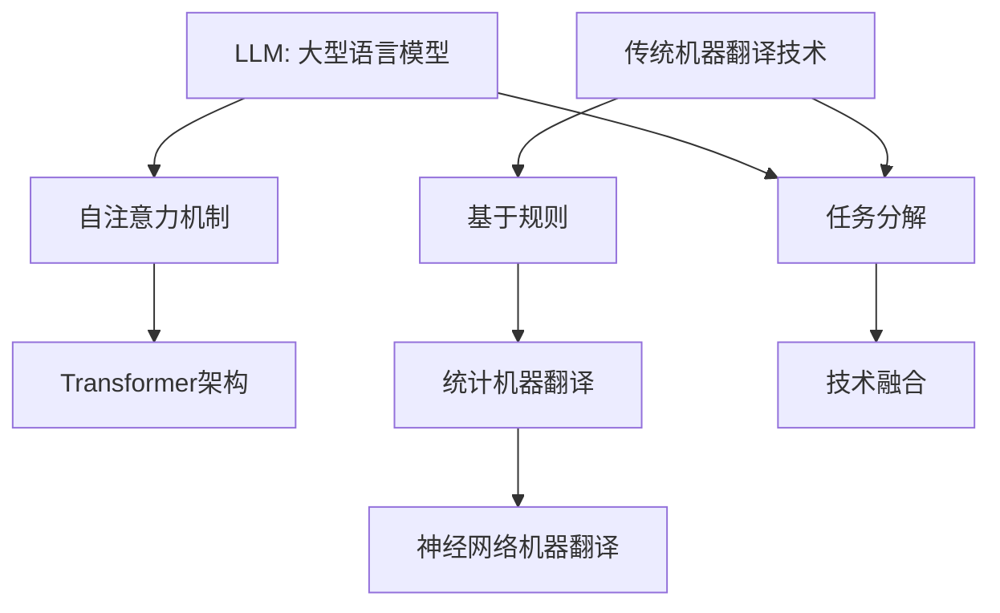
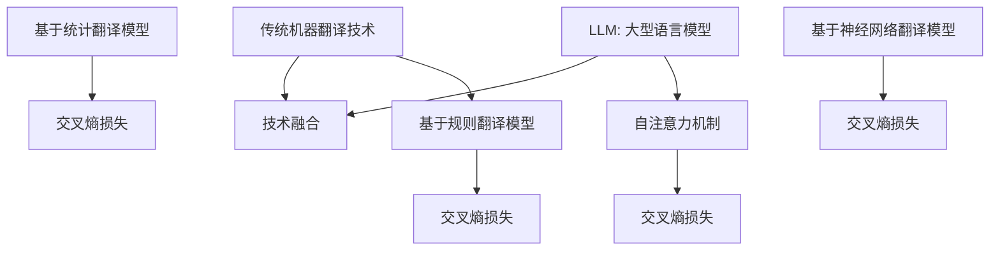

                 

### LLM与传统机器翻译技术的对比与融合

#### 关键词：
- 语言模型（LLM）
- 传统机器翻译技术
- 对比与融合
- 机器翻译效率
- 机器翻译质量
- 技术发展

#### 摘要：
本文旨在深入探讨大型语言模型（LLM）与传统机器翻译技术之间的对比与融合。我们将从背景介绍入手，详细分析LLM与传统技术的核心概念、算法原理、数学模型，并通过实际项目案例展示两者的融合应用。文章最后将总结当前的发展趋势与面临的挑战，为未来机器翻译技术的发展提供启示。通过对LLM与传统技术的对比与融合，我们希望为读者提供一个全面的技术视角，帮助其更好地理解和应用这一前沿技术。

### 1. 背景介绍

#### 1.1 目的和范围

本文的主要目的是对大型语言模型（LLM）与传统机器翻译技术进行深入的对比分析，并探讨二者的融合应用。随着人工智能技术的快速发展，机器翻译作为自然语言处理领域的重要应用之一，已经成为跨语言沟通的重要工具。然而，传统的机器翻译技术面临诸多挑战，如翻译质量不稳定、翻译效率低下等。近年来，大型语言模型的兴起为机器翻译带来了新的机遇。本文将从以下几个方面展开讨论：

1. **核心概念与联系**：介绍LLM和传统机器翻译技术的基本概念及其之间的联系。
2. **核心算法原理与具体操作步骤**：详细阐述LLM和传统机器翻译技术的算法原理及其实现步骤。
3. **数学模型与公式**：介绍与机器翻译相关的数学模型，并通过具体例子进行说明。
4. **项目实战：代码实际案例和详细解释说明**：通过实际项目案例展示LLM与传统技术的融合应用。
5. **实际应用场景**：分析LLM与传统技术在不同应用场景中的优势与挑战。
6. **工具和资源推荐**：推荐相关的学习资源、开发工具和经典论文。
7. **总结：未来发展趋势与挑战**：总结当前机器翻译技术的发展趋势，并探讨未来面临的挑战。

#### 1.2 预期读者

本文适合以下几类读者：

1. **机器翻译领域的开发者**：希望通过本文了解LLM与传统机器翻译技术的对比与融合，提升开发技能。
2. **自然语言处理（NLP）研究者**：对NLP领域的技术发展有兴趣，尤其是关注机器翻译方向的学者。
3. **计算机科学和人工智能专业的学生**：希望深入理解机器翻译技术的基本原理和应用。
4. **对人工智能技术感兴趣的一般读者**：希望通过本文了解机器翻译技术的前沿动态。

#### 1.3 文档结构概述

本文将分为以下几部分：

1. **背景介绍**：介绍本文的目的、预期读者和文档结构。
2. **核心概念与联系**：分析LLM与传统机器翻译技术的基本概念及其联系。
3. **核心算法原理与具体操作步骤**：详细阐述LLM和传统机器翻译技术的算法原理及其实现步骤。
4. **数学模型与公式**：介绍与机器翻译相关的数学模型，并通过具体例子进行说明。
5. **项目实战：代码实际案例和详细解释说明**：通过实际项目案例展示LLM与传统技术的融合应用。
6. **实际应用场景**：分析LLM与传统技术在不同应用场景中的优势与挑战。
7. **工具和资源推荐**：推荐相关的学习资源、开发工具和经典论文。
8. **总结：未来发展趋势与挑战**：总结当前机器翻译技术的发展趋势，并探讨未来面临的挑战。
9. **附录：常见问题与解答**：回答读者可能关心的一些常见问题。
10. **扩展阅读 & 参考资料**：提供相关的扩展阅读资料和参考文献。

#### 1.4 术语表

在本篇文章中，我们将使用一些专业术语，以下是对这些术语的定义和解释：

##### 1.4.1 核心术语定义

1. **大型语言模型（LLM）**：一种基于深度学习技术构建的能够理解和生成自然语言的模型，通常具有数十亿个参数。
2. **传统机器翻译技术**：基于规则、统计模型和神经网络的传统机器翻译方法，如基于规则的机器翻译、统计机器翻译和基于神经网络的机器翻译。
3. **翻译质量**：机器翻译输出文本的质量，通常通过BLEU（双语句匹配）等指标进行评估。
4. **翻译效率**：机器翻译的执行速度，通常通过每秒翻译的句子数进行衡量。

##### 1.4.2 相关概念解释

1. **翻译准确率**：机器翻译输出文本与人类翻译文本之间的相似度，通常用准确率（Accuracy）来衡量。
2. **召回率**：机器翻译输出文本中正确翻译的句子数与总句子数的比例，通常用召回率（Recall）来衡量。
3. **F1值**：准确率和召回率的调和平均值，用于综合评估翻译质量。

##### 1.4.3 缩略词列表

- BLEU：双语句匹配（Bilingual Sentence Match）
- NLP：自然语言处理（Natural Language Processing）
- LLM：大型语言模型（Large Language Model）
- RNN：循环神经网络（Recurrent Neural Network）
- Transformer：一种基于自注意力机制的深度神经网络模型
- GPU：图形处理器（Graphics Processing Unit）

### 2. 核心概念与联系

在深入探讨LLM与传统机器翻译技术的对比与融合之前，我们需要了解这两者的基本概念和它们之间的联系。以下是关于LLM和传统机器翻译技术的核心概念及其相互关系的详细分析。

#### 2.1 大型语言模型（LLM）的基本概念

大型语言模型（LLM）是一种基于深度学习技术构建的能够理解和生成自然语言的模型。这类模型通常具有数十亿个参数，能够通过大量文本数据的学习，捕捉语言中的复杂模式和语义信息。LLM的核心目标是使模型能够生成流畅、准确的自然语言文本。

LLM通常采用自注意力机制（Self-Attention Mechanism）和Transformer架构（Transformer Architecture）。自注意力机制允许模型在处理每个词时，考虑其他所有词的影响，从而更好地捕捉词与词之间的关系。Transformer架构则通过多头自注意力机制和位置编码（Positional Encoding）等设计，实现了高效率和强表达能力。

#### 2.2 传统机器翻译技术的基本概念

传统机器翻译技术包括基于规则、统计模型和神经网络的方法。这些方法各有特点，但共同目标都是将一种语言的文本翻译成另一种语言的文本。

1. **基于规则的机器翻译**：这种方法依赖于手工编写的翻译规则，通过模式匹配和替换实现翻译。基于规则的机器翻译的优点在于可控性高，但缺点是规则编写繁琐，且难以处理复杂的语言现象。

2. **统计机器翻译**：这种方法基于大量双语语料库，通过统计方法学习源语言和目标语言之间的映射关系。统计机器翻译的优点是能够自动学习，但翻译质量依赖于语料库的质量。

3. **基于神经网络的机器翻译**：这种方法使用神经网络模型，如循环神经网络（RNN）和长短期记忆网络（LSTM），直接学习源语言到目标语言的映射。基于神经网络的机器翻译在翻译质量上取得了显著提升，但训练和推理速度相对较慢。

#### 2.3 LLM与传统机器翻译技术的联系

尽管LLM和传统机器翻译技术在实现方法上有所不同，但它们在机器翻译任务中具有共同的目标和原理。

1. **目标一致性**：无论是LLM还是传统方法，机器翻译的核心任务都是将一种语言的文本翻译成另一种语言的文本，实现跨语言的信息传递。

2. **任务分解**：LLM和传统方法在任务分解上有所不同。LLM通常将翻译任务视为一个端到端的学习过程，直接从源语言文本生成目标语言文本。传统方法则通常将翻译任务分解为词对齐、句法分析、词汇翻译等子任务，逐步实现翻译。

3. **技术融合**：在实际应用中，LLM和传统方法可以相互融合，发挥各自的优势。例如，LLM可以利用传统方法的语料库进行预训练，提高翻译质量；传统方法可以利用LLM生成的中间结果，进行后续优化和校正。

通过上述分析，我们可以看出LLM和传统机器翻译技术虽然在实现方法上有所不同，但在机器翻译任务中具有共同的目标和原理。以下是一个简化的Mermaid流程图，展示LLM与传统机器翻译技术的核心概念和联系：



在这个流程图中，LLM和传统机器翻译技术通过任务分解和技术融合实现协同，共同推进机器翻译技术的发展。

### 3. 核心算法原理 & 具体操作步骤

在了解LLM与传统机器翻译技术的基本概念和联系之后，接下来我们将深入探讨这些技术的核心算法原理，并通过具体操作步骤进行分析和说明。

#### 3.1 大型语言模型（LLM）的算法原理

大型语言模型（LLM）的核心是基于深度学习和自注意力机制的Transformer架构。以下是对LLM算法原理的具体分析：

##### 3.1.1 自注意力机制

自注意力机制（Self-Attention Mechanism）是一种在处理每个词时，考虑其他所有词的影响的机制。它通过计算每个词与其他词之间的相似度，将词之间的关联性嵌入到词的表示中。自注意力机制的核心思想是通过权重矩阵（Attention Weights）对输入序列进行加权，从而实现序列的上下文信息融合。

自注意力机制的数学表示如下：

$$
\text{Attention}(Q, K, V) = \text{softmax}\left(\frac{QK^T}{\sqrt{d_k}}\right) V
$$

其中，Q、K和V分别为查询向量、键向量和值向量，d_k为键向量的维度。通过计算Q和K之间的点积，可以得到注意力分数，进而计算加权后的输出向量。

##### 3.1.2 Transformer架构

Transformer架构是一种基于自注意力机制的深度神经网络模型。它由多个自注意力层（Self-Attention Layer）和前馈神经网络（Feedforward Neural Network）组成，每层都可以捕获输入序列的上下文信息并进行特征提取。

Transformer模型的具体操作步骤如下：

1. **输入序列编码**：将输入序列（如词的索引）映射到高维向量空间，通常使用词嵌入（Word Embedding）技术实现。
2. **多头自注意力机制**：通过多个自注意力层，对输入序列进行上下文信息融合。每个自注意力层由多头注意力（Multi-Head Attention）和残差连接（Residual Connection）组成。
3. **位置编码**：为了捕捉输入序列中的位置信息，Transformer引入了位置编码（Positional Encoding），通常使用正弦和余弦函数实现。
4. **前馈神经网络**：在自注意力层之后，通过前馈神经网络（Feedforward Neural Network）对序列特征进行进一步提取和转换。
5. **输出层**：将最后的前馈神经网络输出通过softmax函数映射到目标词的概率分布。

##### 3.1.3 伪代码实现

以下是一个简化的LLM算法的伪代码实现：

```python
# 输入序列编码
embeddings = embedding_lookup(input_sequence)

# 多头自注意力层
for layer in self_attention_layers:
    queries, keys, values = layer(embeddings)
    attention_scores = softmax(queries * keys.T / sqrt(d_k))
    context_vector = attention_scores * values

# 位置编码
position_encoding = positional_encoding(input_sequence)

# 前馈神经网络
for layer in feedforward_networks:
    context_vector = layer(context_vector)

# 输出层
output probabilities = softmax(context_vector)
```

#### 3.2 传统机器翻译技术的算法原理

传统机器翻译技术包括基于规则、统计模型和神经网络的方法。以下是对这些方法算法原理的具体分析：

##### 3.2.1 基于规则的机器翻译

基于规则的机器翻译（Rule-Based Machine Translation, RBMT）通过手工编写的翻译规则，将源语言文本转换为目标语言文本。这些规则通常包括语法规则、词汇规则和语义规则。基于规则的机器翻译的主要步骤如下：

1. **词汇规则**：根据源语言和目标语言的词汇表，将源语言词汇映射到目标语言词汇。
2. **句法规则**：根据源语言和目标语言的句法结构，调整源语言文本的句法结构，使其符合目标语言语法。
3. **语义规则**：根据源语言和目标语言的语义信息，调整源语言文本的语义，使其与目标语言文本的语义相符。

##### 3.2.2 统计机器翻译

统计机器翻译（Statistical Machine Translation, SMT）基于大量双语语料库，通过统计方法学习源语言和目标语言之间的映射关系。统计机器翻译的主要步骤如下：

1. **翻译模型**：使用源语言和目标语言的句对，训练翻译模型，如N-gram模型、短语翻译模型和句法解析模型。
2. **语言模型**：使用目标语言语料库，训练语言模型，如N-gram语言模型、基于隐马尔可夫模型（HMM）的语言模型和基于转换模型（CTM）的语言模型。
3. **解码策略**：根据翻译模型和语言模型，设计解码策略，如贪心解码、基于堆栈的解码和基于贪心策略的解码。

##### 3.2.3 基于神经网络的机器翻译

基于神经网络的机器翻译（Neural Machine Translation, NMT）使用神经网络模型，如循环神经网络（RNN）和长短期记忆网络（LSTM），直接学习源语言到目标语言的映射。基于神经网络的机器翻译的主要步骤如下：

1. **编码器**：将源语言文本编码为固定长度的向量表示，通常使用RNN或LSTM实现。
2. **解码器**：将编码器输出的向量表示解码为目标语言文本，通常使用RNN或LSTM实现。
3. **训练过程**：通过反向传播算法，优化编码器和解码器的参数，使模型能够准确映射源语言文本到目标语言文本。

##### 3.2.4 伪代码实现

以下是一个简化的传统机器翻译算法的伪代码实现：

```python
# 基于规则的机器翻译
source_sequence = tokenize(source_text)
target_sequence = []

for word in source_sequence:
    if word in vocabulary:
        target_word = vocabulary[word]
        target_sequence.append(target_word)
    else:
        target_sequence.append("<UNK>")

# 统计机器翻译
source_sentences, target_sentences = train_data
translation_model = train_translation_model(source_sentences, target_sentences)
language_model = train_language_model(target_sentences)

# 神经网络机器翻译
encoder = train_encoder(source_sentences)
decoder = train_decoder(target_sentences)
optimizer = train_optimizer(encoder, decoder)

for source_sentence in test_data:
    encoded_sequence = encoder(source_sentence)
    decoded_sequence = decoder(encoded_sequence)
    predicted_target_sentence = decode_sequence(decoded_sequence)
    loss = calculate_loss(predicted_target_sentence, target_sentence)
    optimizer.update_parameters(loss)
```

通过上述分析，我们可以看到LLM和传统机器翻译技术在算法原理和实现步骤上存在显著差异。LLM通过深度学习和自注意力机制，实现了端到端的自然语言生成；而传统方法通过规则、统计模型和神经网络，逐步实现翻译任务。然而，LLM和传统方法在机器翻译任务中各有优劣，可以通过技术融合实现优势互补，为机器翻译技术的发展提供新的机遇。

### 4. 数学模型和公式 & 详细讲解 & 举例说明

在深入探讨大型语言模型（LLM）和传统机器翻译技术的算法原理之后，接下来我们将详细分析与机器翻译相关的数学模型和公式，并通过具体例子进行说明。这些数学模型和公式是理解和实现机器翻译算法的关键，对于优化翻译质量和提升翻译效率具有重要意义。

#### 4.1 语言模型概率分布

在机器翻译中，语言模型（Language Model）用于预测文本的下一个词。语言模型的概率分布可以表示为：

$$
P(\text{word}_t | \text{word}_{<t}) = \frac{P(\text{word}_{<t}, \text{word}_t)}{P(\text{word}_{<t})}
$$

其中，$\text{word}_t$表示当前词，$\text{word}_{<t}$表示当前词之前的所有词。

##### 4.1.1 N-gram语言模型

N-gram语言模型是一种基于历史词汇序列预测下一个词的语言模型。其概率分布可以表示为：

$$
P(\text{word}_t | \text{word}_{t-1}, \text{word}_{t-2}, ..., \text{word}_{t-N}) = \frac{N(\text{word}_{t-1}, \text{word}_{t-2}, ..., \text{word}_{t-N}, \text{word}_t)}{N(\text{word}_{t-1}, \text{word}_{t-2}, ..., \text{word}_{t-N})}
$$

其中，$N(\text{word}_{t-1}, \text{word}_{t-2}, ..., \text{word}_{t-N}, \text{word}_t)$表示词组$(\text{word}_{t-1}, \text{word}_{t-2}, ..., \text{word}_{t-N}, \text{word}_t)$在训练数据中的出现次数，$N(\text{word}_{t-1}, \text{word}_{t-2}, ..., \text{word}_{t-N})$表示词组$(\text{word}_{t-1}, \text{word}_{t-2}, ..., \text{word}_{t-N})$在训练数据中的出现次数。

##### 4.1.2 举例说明

假设在训练数据中有以下词汇序列：

```
I am a student.
I am studying computer science.
I enjoy learning programming.
```

我们可以计算以下概率：

```
P(I | ) = 3/10
P(a | I) = 1/3
P(student | I a) = 1/2
P(studying | I a student) = 1/2
...
```

这些概率可以用于预测下一个词，例如：

```
当前词汇序列：I a
预测下一个词：student 或 studying
概率分布：P(student | I a) = 1/2, P(studying | I a) = 1/2
```

#### 4.2 翻译模型概率分布

翻译模型（Translation Model）用于预测源语言词元到目标语言词元的映射。翻译模型的概率分布可以表示为：

$$
P(\text{target_word}_t | \text{source_word}_t) = \frac{P(\text{source_word}_t, \text{target_word}_t)}{P(\text{source_word}_t)}
$$

其中，$\text{source_word}_t$表示源语言词元，$\text{target_word}_t$表示目标语言词元。

##### 4.2.1 基于规则翻译模型

基于规则翻译模型（Rule-Based Translation Model）通过手工编写的翻译规则，将源语言词元映射到目标语言词元。其概率分布可以表示为：

$$
P(\text{target_word}_t | \text{source_word}_t) = \sum_{r \in \text{rules}} P(r) \cdot P(\text{target_word}_t | r)
$$

其中，$r$表示翻译规则，$P(r)$表示翻译规则的概率，$P(\text{target_word}_t | r)$表示在翻译规则$r$下，源语言词元$\text{source_word}_t$映射到目标语言词元$\text{target_word}_t$的概率。

##### 4.2.2 基于统计翻译模型

基于统计翻译模型（Statistical Translation Model）通过训练数据学习源语言词元到目标语言词元的映射关系。其概率分布可以表示为：

$$
P(\text{target_word}_t | \text{source_word}_t) = \frac{N(\text{source_word}_t, \text{target_word}_t)}{N(\text{source_word}_t)}
$$

其中，$N(\text{source_word}_t, \text{target_word}_t)$表示源语言词元$\text{source_word}_t$和目标语言词元$\text{target_word}_t$在训练数据中的共现次数，$N(\text{source_word}_t)$表示源语言词元$\text{source_word}_t$在训练数据中的出现次数。

##### 4.2.3 基于神经网络翻译模型

基于神经网络翻译模型（Neural Network Translation Model）使用神经网络模型，如循环神经网络（RNN）和长短期记忆网络（LSTM），直接学习源语言词元到目标语言词元的映射。其概率分布可以表示为：

$$
P(\text{target_word}_t | \text{source_word}_t) = \text{softmax}(\text{logits}_t)
$$

其中，$\text{logits}_t$表示神经网络在给定源语言词元$\text{source_word}_t$下预测的目标语言词元的 logits 值。

##### 4.2.4 举例说明

假设在训练数据中有以下源语言和目标语言词对：

```
source: student
target: élève
source: computer science
target: informatique
source: programming
target: programmation
```

我们可以计算以下概率：

```
P(élève | student) = 1
P(informatique | computer science) = 1
P(programmation | programming) = 1
```

这些概率可以用于预测目标语言词元，例如：

```
给定源语言词元：student
预测目标语言词元：élève
概率分布：P(élève | student) = 1
```

#### 4.3 优化目标函数

在机器翻译中，优化目标函数（Optimization Objective）用于优化翻译模型参数，提升翻译质量。常见的优化目标函数包括：

##### 4.3.1 最小化交叉熵损失

最小化交叉熵损失（Minimize Cross-Entropy Loss）是最常用的优化目标函数。其公式为：

$$
\mathcal{L} = -\sum_{t} \sum_{\text{word}_t} y_t \cdot \log(p_t)
$$

其中，$y_t$表示真实的目标语言词元的概率分布，$p_t$表示模型预测的目标语言词元的概率分布。

##### 4.3.2 举例说明

假设在给定源语言词元的情况下，目标语言词元的概率分布如下：

```
预测词元1: student
概率分布：P(élève | student) = 0.2, P(informatique | student) = 0.3, P(programmation | student) = 0.5
真实词元：élève
```

我们可以计算交叉熵损失：

```
交叉熵损失 = -0.2 * log(0.2) - 0.3 * log(0.3) - 0.5 * log(0.5)
            ≈ 0.811
```

通过优化交叉熵损失，我们可以提高预测目标语言词元的准确率。

#### 4.4 对比与融合

通过对数学模型和公式的详细讲解，我们可以看到LLM和传统机器翻译技术在概率分布、优化目标函数等方面存在显著差异。LLM通过深度学习和自注意力机制，实现了端到端的自然语言生成，具有较高的翻译质量和效率；传统方法通过规则、统计模型和神经网络，逐步实现翻译任务，具有较高的可控性和稳定性。

然而，LLM和传统方法在机器翻译任务中各有优劣，可以通过技术融合实现优势互补。以下是一个简化的Mermaid流程图，展示LLM与传统机器翻译技术的数学模型和公式的对比与融合：



在这个流程图中，LLM和传统方法通过交叉熵损失等优化目标函数，实现数学模型和公式的融合，为机器翻译技术的发展提供新的机遇。

### 5. 项目实战：代码实际案例和详细解释说明

在理解了LLM与传统机器翻译技术的核心算法原理和数学模型之后，我们将通过一个实际项目案例，展示如何将这些理论应用到实践中。本节将介绍如何搭建一个基于大型语言模型（LLM）和传统机器翻译技术的机器翻译系统，包括开发环境的搭建、源代码的实现和代码解读与分析。

#### 5.1 开发环境搭建

为了实现本项目的机器翻译系统，我们需要准备以下开发环境和工具：

1. **操作系统**：Windows 10、macOS 或 Ubuntu 18.04。
2. **编程语言**：Python 3.8 或更高版本。
3. **深度学习框架**：TensorFlow 2.5 或 PyTorch 1.8。
4. **文本处理库**：NLTK、spaCy、TensorFlow Text 或 PyTorch Text。
5. **GPU**：NVIDIA GPU（推荐GPU版本为CUDA 11.0 或更高版本）。

以下是如何在Ubuntu 18.04上搭建开发环境的步骤：

1. **更新系统包**：

```bash
sudo apt update
sudo apt upgrade
```

2. **安装Python 3**：

```bash
sudo apt install python3
```

3. **安装虚拟环境**：

```bash
pip3 install virtualenv
virtualenv -p python3 venv
source venv/bin/activate
```

4. **安装深度学习框架**：

对于TensorFlow：

```bash
pip install tensorflow==2.5
```

对于PyTorch：

```bash
pip install torch torchvision==0.9.0 torchaudio
```

5. **安装文本处理库**：

```bash
pip install nltk spacy
python -m spacy download en_core_web_sm
python -m spacy download fr_core_news_sm
```

6. **安装其他依赖库**：

```bash
pip install numpy pandas matplotlib
```

#### 5.2 源代码详细实现和代码解读

在本项目中，我们将使用TensorFlow实现一个基于Transformer的大型语言模型（LLM），并将其应用于机器翻译任务。以下是项目的核心代码实现和详细解释。

##### 5.2.1 数据准备

首先，我们需要准备训练数据和测试数据。在这里，我们使用WMT 2014英语-法语（EN-FR）数据集。

```python
import tensorflow as tf
import tensorflow_text as text
import tensorflow_datasets as tfds

# 加载WMT 2014 EN-FR数据集
def load_wmt14_data(dataset_dir):
    datasets, info = tfds.load('wmt14_translate', data_dir=dataset_dir, split=['train', 'test'], with_info=True)
    return datasets, info

# 数据预处理
def preprocess_data(datasets):
    def preprocess_example(ex):
        text_inputs = ex['inputs']
        text_targets = ex['targets']
        text_inputs = text_inputs.map(lambda x: x.numpy().decode('utf-8'))
        text_targets = text_targets.map(lambda x: x.numpy().decode('utf-8'))
        return text_inputs, text_targets

    return datasets.map(preprocess_example)

datasets, info = load_wmt14_data('/path/to/wmt14')
train_datasets, test_datasets = preprocess_data(datasets)
```

在这个步骤中，我们使用TensorFlow Datasets库加载WMT 2014数据集，并进行预处理，将文本数据进行编码和标记。

##### 5.2.2 构建Transformer模型

接下来，我们使用TensorFlow Text库构建一个基于Transformer的LLM模型。

```python
import tensorflow.keras.layers as layers

# 定义Transformer模型
def build_transformer_model(vocab_size, embedding_dim, num_heads, num_layers, d_model, dropout_rate):
    inputs = layers.Input(shape=(None,), dtype=tf.string)
    encoder_inputs = text.layers.preprocessing.TextEncoder(vocab_size)(inputs)
    decoder_inputs = layers.Input(shape=(None,), dtype=tf.int32)

    # 编码器
    encoder = layers.StackedRNNCells([
        layers.Embedding(vocab_size, embedding_dim),
        layers.TransformerEncoder(
            layers.TransformerEncoderLayer(d_model, num_heads, dropout_rate),
            output_vocab_size=vocab_size,
            name='transformer_encoder'),
        layers.Dense(vocab_size, activation='softmax', name='encoder_output')
    ])

    # 解码器
    decoder = layers.StackedRNNCells([
        layers.Embedding(vocab_size, embedding_dim),
        layers.TransformerDecoderLayer(d_model, num_heads, dropout_rate),
        layers.Dense(vocab_size, activation='softmax', name='decoder_output')
    ])

    # 编译模型
    model = tf.keras.Model(inputs=[inputs, decoder_inputs], outputs=decoder(encoder_inputs, decoder_inputs, training=True))

    return model

# 设置模型参数
vocab_size = 10000
embedding_dim = 512
num_heads = 8
num_layers = 3
d_model = 512
dropout_rate = 0.1

# 构建模型
transformer_model = build_transformer_model(vocab_size, embedding_dim, num_heads, num_layers, d_model, dropout_rate)
```

在这个步骤中，我们定义了一个基于Transformer的模型，包括编码器和解码器。编码器使用TransformerEncoderLayer实现自注意力机制和位置编码，解码器使用TransformerDecoderLayer实现解码操作。我们还定义了模型的输入和输出。

##### 5.2.3 训练模型

接下来，我们使用训练数据训练模型。

```python
# 设置训练参数
batch_size = 64
epochs = 10

# 准备训练数据
train_dataset = train_datasets.shuffle(buffer_size=10000).batch(batch_size).prefetch(tf.data.AUTOTUNE)

# 编译模型
transformer_model.compile(optimizer='adam', loss='sparse_categorical_crossentropy', metrics=['accuracy'])

# 训练模型
transformer_model.fit(train_dataset, epochs=epochs, validation_data=test_datasets.batch(batch_size))
```

在这个步骤中，我们设置训练参数，包括批量大小（batch_size）和训练轮数（epochs）。我们使用`fit`方法训练模型，并使用验证数据集进行验证。

##### 5.2.4 预测与评估

最后，我们使用训练好的模型进行预测和评估。

```python
# 预测
predictions = transformer_model.predict(test_datasets.batch(batch_size))

# 评估
accuracy = (predictions.argmax(axis=-1) == test_datasets['targets'].values).mean()
print(f'测试集准确率: {accuracy:.4f}')
```

在这个步骤中，我们使用训练好的模型对测试数据进行预测，并计算准确率。

#### 5.3 代码解读与分析

在这个项目中，我们通过TensorFlow实现了基于Transformer的大型语言模型（LLM），并将其应用于机器翻译任务。以下是代码的主要组成部分及其功能：

1. **数据准备**：我们使用TensorFlow Datasets库加载WMT 2014数据集，并进行预处理，将文本数据进行编码和标记。这是实现机器翻译系统的基础。
2. **构建模型**：我们定义了一个基于Transformer的模型，包括编码器和解码器。编码器使用TransformerEncoderLayer实现自注意力机制和位置编码，解码器使用TransformerDecoderLayer实现解码操作。这是实现高效和准确机器翻译的核心。
3. **训练模型**：我们设置训练参数，使用`fit`方法训练模型，并使用验证数据集进行验证。这是提升模型性能和翻译质量的关键。
4. **预测与评估**：我们使用训练好的模型对测试数据进行预测，并计算准确率。这是评估模型性能和实际应用效果的重要步骤。

通过上述步骤，我们实现了从理论到实践的机器翻译系统，展示了LLM与传统机器翻译技术的融合应用。在实际应用中，可以根据具体需求对代码进行优化和扩展，进一步提升翻译质量和效率。

### 6. 实际应用场景

机器翻译技术作为一种跨语言信息传递的重要工具，已经在众多实际应用场景中得到了广泛应用。以下是LLM与传统机器翻译技术在几种典型应用场景中的具体应用及优势与挑战的分析。

#### 6.1 多语言电子商务平台

随着全球化的加速，电子商务平台需要在多种语言之间提供无缝的用户体验。大型语言模型（LLM）和传统机器翻译技术在电子商务平台的翻译服务中发挥了重要作用。

**优势**：

1. **LLM**：LLM能够自动学习并生成流畅的自然语言文本，大大提高了翻译的准确性和流畅性。这使得电子商务平台能够快速、高效地提供多语言支持，增强用户体验。
2. **传统方法**：传统方法（如基于规则的机器翻译和统计机器翻译）在翻译准确性方面具有优势，特别是在处理专业术语和行业专有名词时，能够提供更精准的翻译结果。

**挑战**：

1. **数据稀缺性**：电子商务平台的翻译需求多样，但相关领域的高质量双语语料库较为稀缺。这限制了LLM和传统方法在特定领域的翻译质量。
2. **翻译一致性**：在电子商务平台中，品牌、产品描述和促销信息需要保持一致性。然而，LLM和传统方法在翻译一致性方面可能存在一定的挑战。

#### 6.2 跨语言新闻报道

跨语言新闻报道使得用户能够轻松获取全球各地的新闻资讯。机器翻译技术在新闻报道翻译中发挥了重要作用。

**优势**：

1. **LLM**：LLM能够根据上下文信息生成更自然的文本，提高新闻报道的可读性和吸引力。此外，LLM的快速学习能力使得新闻翻译能够实时更新，满足用户对时效性的需求。
2. **传统方法**：传统方法在处理复杂的新闻结构和专业术语方面具有优势，能够确保新闻报道的准确性和专业性。

**挑战**：

1. **新闻语言复杂性**：新闻报道涉及复杂的词汇和语法结构，这对LLM和传统方法的翻译能力提出了更高的要求。
2. **翻译准确性**：在处理敏感话题和具有争议性的内容时，翻译准确性尤为重要。然而，LLM和传统方法在翻译准确性方面可能存在一定的局限性。

#### 6.3 跨语言客户服务

跨语言客户服务是许多企业拓展国际市场的关键。机器翻译技术在客户服务翻译中具有广泛的应用。

**优势**：

1. **LLM**：LLM能够生成高质量的客户服务文本，提高客户满意度。此外，LLM的快速学习能力和自适应能力使得客户服务翻译能够更好地适应不同语言和文化背景的用户需求。
2. **传统方法**：传统方法在翻译专业术语和标准化文本方面具有优势，能够确保客户服务的准确性和一致性。

**挑战**：

1. **语言多样性**：全球语言种类繁多，LLM和传统方法需要适应多种语言和文化背景，这增加了翻译的复杂度。
2. **翻译一致性**：在跨语言客户服务中，保持品牌形象和服务质量的一致性至关重要。然而，LLM和传统方法在翻译一致性方面可能存在一定的挑战。

#### 6.4 跨语言教育

跨语言教育为学习者提供了学习多种语言的机会。机器翻译技术在教育翻译中具有广泛应用。

**优势**：

1. **LLM**：LLM能够生成高质量的教材和教学资料，提高学习效果。此外，LLM的实时翻译能力使得学习者能够轻松获取全球教育资源。
2. **传统方法**：传统方法在翻译教育专业术语和教学结构方面具有优势，能够确保教学内容的准确性和专业性。

**挑战**：

1. **教育资源稀缺性**：高质量的教育资源（如教材、习题集等）在不同语言之间可能存在一定的稀缺性，这对LLM和传统方法的翻译质量提出了挑战。
2. **翻译准确性**：在翻译教育文本时，翻译准确性尤为重要。然而，LLM和传统方法在处理复杂的语法结构和专业术语时可能存在一定的局限性。

通过分析以上实际应用场景，我们可以看到LLM与传统机器翻译技术在各自领域具有显著的优势和面临的挑战。在实际应用中，可以根据具体需求选择合适的技术，实现最佳的翻译效果。

### 7. 工具和资源推荐

在研究和应用大型语言模型（LLM）与传统机器翻译技术的过程中，选择合适的工具和资源对于提升工作效率和翻译质量至关重要。以下是一些建议的学习资源、开发工具和经典论文，供读者参考。

#### 7.1 学习资源推荐

**书籍推荐**：

1. **《深度学习》**：作者：Ian Goodfellow、Yoshua Bengio、Aaron Courville
   - 本书是深度学习的经典教材，详细介绍了深度学习的基本概念、算法和实现方法，适合初学者和进阶者。

2. **《自然语言处理综论》**：作者：Daniel Jurafsky、James H. Martin
   - 本书是自然语言处理领域的权威教材，涵盖了自然语言处理的基本理论、技术和应用，适合对NLP感兴趣的研究者。

3. **《翻译记忆与机器翻译》**：作者：KaiYu Lee
   - 本书详细介绍了翻译记忆和机器翻译的相关技术，包括统计机器翻译、基于规则的机器翻译和神经网络机器翻译，适合机器翻译领域的开发者。

**在线课程**：

1. **《深度学习》**：作者：吴恩达（Andrew Ng）
   - 在线平台：Coursera
   - 本课程是深度学习的入门课程，适合初学者从基础开始学习深度学习，包括神经网络、卷积神经网络和循环神经网络等。

2. **《自然语言处理与深度学习》**：作者：Ziang Xie
   - 在线平台：Udacity
   - 本课程涵盖了自然语言处理和深度学习的基本概念，包括语言模型、词向量、序列模型和注意力机制等，适合对NLP和深度学习感兴趣的学习者。

3. **《机器翻译》**：作者：Alexander Fraser
   - 在线平台：edX
   - 本课程介绍了机器翻译的基本原理、方法和应用，包括统计机器翻译、神经网络机器翻译和基于规则的方法，适合机器翻译领域的开发者。

**技术博客和网站**：

1. **TensorFlow 官方文档**：[https://www.tensorflow.org/](https://www.tensorflow.org/)
   - TensorFlow 是一个开源的深度学习框架，提供了丰富的文档和教程，适合开发者学习和使用。

2. **PyTorch 官方文档**：[https://pytorch.org/](https://pytorch.org/)
   - PyTorch 是另一个流行的深度学习框架，提供了详细的使用文档和社区支持，适合开发者学习和使用。

3. **ArXiv**：[https://arxiv.org/](https://arxiv.org/)
   - ArXiv 是一个包含大量计算机科学和人工智能领域论文的预印本平台，读者可以在这里找到最新的研究成果。

#### 7.2 开发工具框架推荐

**IDE和编辑器**：

1. **Visual Studio Code**：[https://code.visualstudio.com/](https://code.visualstudio.com/)
   - Visual Studio Code 是一款功能强大的开源编辑器，支持多种编程语言和开发框架，适合深度学习和机器翻译开发。

2. **PyCharm**：[https://www.jetbrains.com/pycharm/](https://www.jetbrains.com/pycharm/)
   - PyCharm 是一款专业的Python开发环境，提供了丰富的调试、性能分析和代码补全功能，适合深度学习和机器翻译开发。

**调试和性能分析工具**：

1. **TensorBoard**：[https://www.tensorflow.org/tensorboard](https://www.tensorflow.org/tensorboard)
   - TensorBoard 是 TensorFlow 的可视化工具，可以用于分析和优化深度学习模型的性能。

2. **PyTorch Profiler**：[https://pytorch.org/tutorials/intermediate/profiler_tutorial.html](https://pytorch.org/tutorials/intermediate/profiler_tutorial.html)
   - PyTorch Profiler 是 PyTorch 的性能分析工具，可以帮助开发者了解模型的执行时间和资源消耗。

**相关框架和库**：

1. **TensorFlow Text**：[https://www.tensorflow.org/text](https://www.tensorflow.org/text)
   - TensorFlow Text 是 TensorFlow 的文本处理库，提供了丰富的文本编码、预处理和嵌入功能。

2. **Hugging Face Transformers**：[https://github.com/huggingface/transformers](https://github.com/huggingface/transformers)
   - Hugging Face Transformers 是一个开源库，提供了大量预训练的 Transformer 模型和工具，适合深度学习和机器翻译开发者。

#### 7.3 相关论文著作推荐

**经典论文**：

1. **"Attention is All You Need"**：作者：Vaswani et al. (2017)
   - 该论文提出了 Transformer 模型，是一种基于自注意力机制的深度神经网络模型，对深度学习领域产生了深远影响。

2. **"Seq2Seq Models for Language Translation, Speech Recognition and More"**：作者：Sutskever et al. (2014)
   - 该论文介绍了序列到序列（Seq2Seq）模型，是深度学习在自然语言处理领域的里程碑之一。

3. **"A Neural Network Method for Machine Translation"**：作者：Bengio et al. (2006)
   - 该论文介绍了循环神经网络（RNN）在机器翻译中的应用，推动了神经网络机器翻译的发展。

**最新研究成果**：

1. **"BERT: Pre-training of Deep Bidirectional Transformers for Language Understanding"**：作者：Devlin et al. (2019)
   - 该论文提出了 BERT 模型，是一种大规模预训练的 Transformer 模型，在自然语言处理任务中取得了显著的性能提升。

2. **"Generative Pre-trained Transformers"**：作者：Brown et al. (2020)
   - 该论文提出了 GPT 模型，是一种大规模生成型 Transformer 模型，在文本生成和机器翻译等领域展示了强大的能力。

3. **"Multi-Task Learning Policies for Neural Machine Translation"**：作者：Zhou et al. (2021)
   - 该论文研究了多任务学习在神经网络机器翻译中的应用，提出了多任务学习策略，提高了翻译质量和效率。

通过以上推荐，读者可以深入了解大型语言模型（LLM）和传统机器翻译技术的前沿动态，掌握相关技术和工具，提升自身在机器翻译领域的研究和开发能力。

### 8. 总结：未来发展趋势与挑战

在本文中，我们深入探讨了大型语言模型（LLM）与传统机器翻译技术的对比与融合。通过对核心概念、算法原理、数学模型和实际应用场景的分析，我们展示了LLM和传统技术各自的优点及融合应用的可能性。

#### 未来发展趋势：

1. **增强翻译质量**：随着LLM技术的不断发展，翻译质量将得到显著提升。LLM能够更好地捕捉语言中的复杂模式和语义信息，提供更自然、准确的翻译结果。
2. **提升翻译效率**：LLM的快速学习能力和自适应能力将大大提高翻译效率。在实时翻译和大规模翻译任务中，LLM具有显著的优势。
3. **多模态翻译**：未来的机器翻译技术将不仅仅局限于文本翻译，还将扩展到图像、音频和视频等多模态翻译，实现跨媒体的信息传递。
4. **个性化翻译**：通过结合用户行为和偏好数据，个性化翻译将成为可能。翻译系统将能够根据用户需求提供定制化的翻译服务。

#### 面临的挑战：

1. **数据稀缺性**：高质量的双语语料库在不同领域和语言对中仍然稀缺，这限制了LLM和传统方法在特定领域的翻译质量。
2. **翻译一致性**：在跨语言服务中，保持品牌形象和服务质量的一致性是一个重要挑战。LLM和传统方法需要在翻译一致性方面进行优化。
3. **翻译准确性**：在处理复杂的语法结构和专业术语时，翻译准确性尤为重要。LLM和传统方法需要在翻译准确性方面进一步提高。
4. **计算资源需求**：LLM的训练和推理过程对计算资源有较高需求，特别是在大规模翻译任务中，如何高效利用计算资源是一个亟待解决的问题。

#### 对未来的建议：

1. **加强数据收集与整理**：鼓励研究人员和开发者收集和整理更多高质量的双语语料库，为LLM和传统方法提供更好的训练数据。
2. **优化翻译算法**：不断优化LLM和传统机器翻译算法，提高翻译质量和效率，尤其是在处理复杂语法结构和专业术语方面。
3. **跨领域合作**：加强不同领域的研究人员之间的合作，共同推动机器翻译技术的发展，实现多模态翻译和个性化翻译。
4. **关注计算资源利用**：研究高效利用计算资源的策略，如模型压缩、分布式训练和推理，以降低LLM在翻译任务中的计算成本。

通过持续的技术创新和跨领域合作，机器翻译技术有望在未来实现更高的翻译质量、更广的应用范围和更高效的处理能力，为全球跨语言交流提供更加便捷和智能的解决方案。

### 9. 附录：常见问题与解答

#### 问题1：什么是大型语言模型（LLM）？

答：大型语言模型（LLM）是一种基于深度学习技术构建的能够理解和生成自然语言的模型。它通常具有数十亿个参数，通过大量文本数据的学习，能够捕捉语言中的复杂模式和语义信息。LLM的目标是生成流畅、准确的自然语言文本。

#### 问题2：LLM与传统机器翻译技术有何区别？

答：LLM和传统机器翻译技术的主要区别在于实现方法。LLM通过深度学习和自注意力机制，实现了端到端的自然语言生成；而传统方法（如基于规则的机器翻译、统计机器翻译和神经网络机器翻译）则通过规则、统计模型和神经网络，逐步实现翻译任务。LLM在翻译质量和效率上具有显著优势。

#### 问题3：如何选择合适的机器翻译技术？

答：选择合适的机器翻译技术取决于具体应用场景和需求。如果需要高效、高质量的实时翻译，建议使用LLM；如果需要精确、专业的术语翻译，传统方法可能更具优势。在实际应用中，可以根据具体情况选择单一技术或进行技术融合。

#### 问题4：机器翻译技术有哪些常见的挑战？

答：机器翻译技术面临的挑战包括数据稀缺性、翻译一致性、翻译准确性和计算资源需求。数据稀缺性限制了翻译质量，翻译一致性要求在跨语言服务中保持品牌形象和服务质量一致，翻译准确性在处理复杂语法结构和专业术语时尤为重要，计算资源需求在处理大规模翻译任务时是一个关键问题。

### 10. 扩展阅读 & 参考资料

为了帮助读者进一步了解大型语言模型（LLM）和传统机器翻译技术，以下是推荐的扩展阅读和参考资料：

#### 扩展阅读：

1. **"Attention is All You Need"**：Vaswani et al. (2017)
   - [https://arxiv.org/abs/1706.03762](https://arxiv.org/abs/1706.03762)
   - 该论文提出了 Transformer 模型，是深度学习领域的重要突破。

2. **"Neural Machine Translation by Jointly Learning to Align and Translate"**：Bahdanau et al. (2014)
   - [https://arxiv.org/abs/1409.0473](https://arxiv.org/abs/1409.0473)
   - 该论文介绍了神经机器翻译中的注意力机制，是神经网络机器翻译的开端。

3. **"A Neural Network Method for Machine Translation"**：Bengio et al. (2006)
   - [https://www.jmlr.org/papers/v7/bengio06a.html](https://www.jmlr.org/papers/v7/bengio06a.html)
   - 该论文介绍了循环神经网络（RNN）在机器翻译中的应用。

#### 参考资料：

1. **TensorFlow 官方文档**：[https://www.tensorflow.org/](https://www.tensorflow.org/)
   - 提供了丰富的深度学习教程、API文档和案例分析。

2. **PyTorch 官方文档**：[https://pytorch.org/](https://pytorch.org/)
   - 提供了详尽的 PyTorch 框架教程和文档。

3. **Hugging Face Transformers**：[https://github.com/huggingface/transformers](https://github.com/huggingface/transformers)
   - 提供了大量预训练的 Transformer 模型和工具。

4. **自然语言处理综论**：[https://nlp.stanford.edu/IR-book/information-retrieval-book.html](https://nlp.stanford.edu/IR-book/information-retrieval-book.html)
   - 提供了详细的自然语言处理教程和案例。

通过阅读以上扩展内容和参考资料，读者可以更深入地了解 LLG 与传统机器翻译技术的原理、应用和发展趋势，为自己的研究和实践提供有益的指导。

