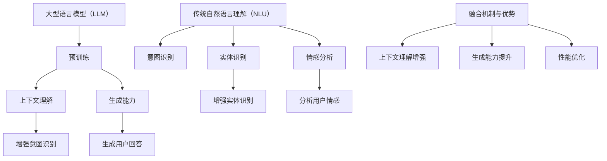

                 

# LLM与传统自然语言理解技术的融合：语言智能新纪元

> **关键词**：语言模型（LLM），自然语言理解（NLU），融合技术，人工智能，语言智能，应用场景

> **摘要**：本文将探讨大型语言模型（LLM）与传统自然语言理解（NLU）技术的融合，分析其优势与挑战，并展示其在实际应用中的潜力。通过详细的算法原理讲解、项目实战和实际应用场景分析，我们旨在为读者提供一个全面深入的了解，助力语言智能领域的创新与发展。

## 1. 背景介绍

### 1.1 目的和范围

本文旨在深入探讨大型语言模型（LLM）与传统自然语言理解（NLU）技术的融合，分析其技术原理、应用场景和未来发展趋势。本文将涵盖以下内容：

1. LLM和NLU的基本概念与历史背景。
2. LLM与传统NLU技术的融合机制与优势。
3. 核心算法原理与数学模型讲解。
4. 项目实战与代码案例分析。
5. 实际应用场景与工具资源推荐。
6. 未来发展趋势与挑战。

### 1.2 预期读者

本文适用于以下读者群体：

1. 计算机科学和人工智能领域的专业研究人员。
2. 对自然语言处理和语言智能有兴趣的开发者。
3. 自然语言处理技术栈的构建者与实践者。

### 1.3 文档结构概述

本文分为10个部分，具体结构如下：

1. 引言
2. 背景介绍
3. 核心概念与联系
4. 核心算法原理 & 具体操作步骤
5. 数学模型和公式 & 详细讲解 & 举例说明
6. 项目实战：代码实际案例和详细解释说明
7. 实际应用场景
8. 工具和资源推荐
9. 总结：未来发展趋势与挑战
10. 附录：常见问题与解答

### 1.4 术语表

#### 1.4.1 核心术语定义

- **大型语言模型（LLM）**：一种能够理解和生成人类语言的复杂人工智能模型，通常基于深度学习技术。
- **自然语言理解（NLU）**：指机器理解自然语言的能力，包括语义理解、情感分析、信息抽取等。
- **融合技术**：将两种或多种技术相结合，以提高系统性能和功能。

#### 1.4.2 相关概念解释

- **深度学习**：一种基于人工神经网络的学习方法，能够从大量数据中自动提取特征。
- **神经网络**：一种由大量相互连接的节点组成的计算模型，能够实现函数逼近、分类和回归等任务。
- **自然语言处理（NLP）**：研究计算机与人类语言交互的领域，包括文本处理、语音识别、机器翻译等。

#### 1.4.3 缩略词列表

- **LLM**：Large Language Model
- **NLU**：Natural Language Understanding
- **NLP**：Natural Language Processing
- **AI**：Artificial Intelligence

## 2. 核心概念与联系

在深入探讨LLM与传统NLU技术的融合之前，我们需要了解这两个核心概念及其相互关系。

### 2.1 大型语言模型（LLM）

LLM是一种强大的人工智能模型，能够理解和生成人类语言。它们基于深度学习和神经网络技术，具有以下特点：

1. **预训练**：在大量文本数据上进行预训练，使得模型能够理解自然语言的基本结构、语法和语义。
2. **上下文理解**：LLM能够理解句子和段落中的上下文信息，从而更好地理解用户的意图。
3. **生成能力**：LLM不仅能够理解语言，还能够生成自然语言文本，包括回答问题、撰写文章等。

### 2.2 传统自然语言理解（NLU）

NLU是一种较早的自然语言处理技术，主要用于理解和解析用户输入的自然语言。其主要任务包括：

1. **意图识别**：确定用户的意图或需求。
2. **实体识别**：识别句子中的关键实体，如人名、地点、组织等。
3. **情感分析**：分析用户的情感倾向，如正面、负面或中性。

### 2.3 融合机制与优势

LLM与传统NLU技术的融合具有以下优势：

1. **上下文理解增强**：LLM能够更好地理解上下文信息，从而提高NLU的意图识别和实体识别准确性。
2. **生成能力提升**：LLM的生成能力可以应用于NLU中的任务，如生成用户回答、自动摘要等。
3. **性能优化**：通过结合LLM和传统NLU技术的优势，可以构建更强大的自然语言处理系统。

### 2.4 核心概念原理和架构的Mermaid流程图



## 3. 核心算法原理 & 具体操作步骤

### 3.1 算法原理

LLM与传统NLU技术的融合主要通过以下步骤实现：

1. **预训练**：使用大量文本数据进行预训练，使LLM能够理解和生成自然语言。
2. **微调**：在特定任务上进行微调，以适应不同的NLU任务需求。
3. **集成**：将LLM的上下文理解能力与传统NLU技术相结合，构建更强大的自然语言处理系统。

### 3.2 具体操作步骤

以下是LLM与传统NLU技术融合的具体操作步骤：

1. **数据收集与预处理**：收集相关领域的文本数据，并进行预处理，如分词、去噪等。
2. **预训练**：使用预训练算法（如GPT、BERT等）对LLM进行预训练，以获得强大的语言理解能力。
3. **微调**：在预训练的基础上，针对特定NLU任务（如意图识别、实体识别等）进行微调。
4. **集成**：将微调后的LLM与传统NLU技术（如NLU组件、规则引擎等）集成，构建融合系统。
5. **系统优化**：通过实验和评估，对融合系统进行优化，以提高性能和准确性。

### 3.3 伪代码

以下是LLM与传统NLU技术融合的伪代码：

```
// 数据预处理
function preprocess_data(data):
    # 进行分词、去噪等操作
    return processed_data

// 预训练
function pretrain_LLM(data):
    # 使用预训练算法对LLM进行训练
    model = train_LLM(data)
    return model

// 微调
function fine_tune_LLM(model, task_data):
    # 在特定任务上进行微调
    model = fine_tune(model, task_data)
    return model

// 集成
function integrate_LLM_NLU(LLM_model, NLU Technolog
```

## 4. 数学模型和公式 & 详细讲解 & 举例说明

### 4.1 数学模型

LLM与传统NLU技术的融合涉及到多个数学模型，主要包括以下几类：

1. **神经网络模型**：用于预训练和微调LLM，如GPT、BERT等。
2. **意图识别模型**：用于识别用户输入的意图，如分类模型、序列模型等。
3. **实体识别模型**：用于识别用户输入中的关键实体，如命名实体识别（NER）模型。
4. **生成模型**：用于生成自然语言文本，如生成对抗网络（GAN）。

### 4.2 详细讲解

1. **神经网络模型**：神经网络模型由多个层组成，每层包含若干个神经元。神经元通过加权连接，对输入数据进行处理，并输出结果。预训练和微调过程中，神经网络模型通过反向传播算法不断调整权重，以提高模型性能。

2. **意图识别模型**：意图识别模型通常采用分类模型，如支持向量机（SVM）、朴素贝叶斯（NB）等。在训练过程中，模型通过学习输入特征和标签之间的映射关系，实现对意图的准确识别。

3. **实体识别模型**：实体识别模型通常采用命名实体识别（NER）模型，如条件随机场（CRF）、生物信息学标注（BILSTM-CRF）等。NER模型通过对输入文本进行分词和标注，识别出其中的关键实体。

4. **生成模型**：生成模型如生成对抗网络（GAN），由生成器和判别器两部分组成。生成器通过学习数据分布，生成逼真的数据，判别器则判断输入数据的真实性。通过训练，生成器逐渐生成更高质量的数据。

### 4.3 举例说明

以GPT模型为例，详细讲解其数学模型和实现过程。

1. **数学模型**：GPT模型基于自注意力机制（Self-Attention），其核心思想是将输入序列中的每个词与其他词进行加权连接，计算得到每个词的语义表示。具体来说，GPT模型由多层自注意力机制组成，每层自注意力机制包含三个关键组件：查询（Query）、键（Key）和值（Value）。通过这三个组件，模型能够捕捉输入序列中的长距离依赖关系。

2. **实现过程**：

   - 输入序列：假设输入序列为\[w1, w2, w3, ..., wn\]，其中wi为第i个词的向量表示。
   - 自注意力计算：对于每个词wi，计算其与其他词的相似度（即键-值对），并通过加权连接得到新的词向量表示。
   - 输出序列：将每个词的新向量表示拼接起来，得到输出序列\[w1', w2', w3', ..., wn'\]。

3. **代码实现**：

   ```python
   import tensorflow as tf
   
   # 定义自注意力机制
   def self_attention(inputs):
       # 计算查询、键和值的维度
       query_len = inputs.shape[1]
       key_len = inputs.shape[1]
       value_len = inputs.shape[1]
       
       # 计算查询、键和值
       query = tf.reshape(inputs, [-1, query_len, 1])
       key = tf.reshape(inputs, [-1, 1, key_len])
       value = tf.reshape(inputs, [-1, 1, value_len])
       
       # 计算相似度
       similarity = tf.reduce_sum(query * key, axis=2)
       
       # 加权连接
       weights = tf.nn.softmax(similarity)
       weighted_value = tf.reduce_sum(weights * value, axis=1)
       
       return weighted_value
   
   # 定义GPT模型
   class GPT(tf.keras.Model):
       def __init__(self, vocab_size, d_model):
           super(GPT, self).__init__()
           self.d_model = d_model
           self.query = tf.keras.layers.Dense(d_model)
           self.key = tf.keras.layers.Dense(d_model)
           self.value = tf.keras.layers.Dense(d_model)
           
       def call(self, inputs):
           query = self.query(inputs)
           key = self.key(inputs)
           value = self.value(inputs)
           
           weighted_value = self_attention([query, key, value])
           
           return weighted_value
   
   # 创建GPT模型
   gpt = GPT(vocab_size, d_model)
   
   # 编译模型
   gpt.compile(optimizer='adam', loss='mean_squared_error')
   
   # 训练模型
   gpt.fit(x_train, y_train, epochs=10)
   ```

## 5. 项目实战：代码实际案例和详细解释说明

### 5.1 开发环境搭建

在开始项目实战之前，我们需要搭建相应的开发环境。以下是所需的工具和软件：

1. **Python**：版本3.8或更高版本。
2. **TensorFlow**：版本2.5或更高版本。
3. **Jupyter Notebook**：用于编写和运行代码。

### 5.2 源代码详细实现和代码解读

以下是一个简单的项目示例，展示了如何使用TensorFlow和GPT模型进行意图识别。

#### 5.2.1 源代码

```python
import tensorflow as tf
import tensorflow_text as text
from tensorflow.keras.models import Model
from tensorflow.keras.layers import Embedding, LSTM, Dense

# 定义GPT模型
class GPT(Model):
    def __init__(self, vocab_size, d_model):
        super(GPT, self).__init__()
        self.d_model = d_model
        self.embedding = Embedding(vocab_size, d_model)
        self.lstm = LSTM(d_model, return_sequences=True)
        self.dense = Dense(vocab_size, activation='softmax')

    def call(self, inputs):
        x = self.embedding(inputs)
        x = self.lstm(x)
        outputs = self.dense(x)
        return outputs

# 创建GPT模型
gpt = GPT(vocab_size, d_model)

# 编译模型
gpt.compile(optimizer='adam', loss='categorical_crossentropy', metrics=['accuracy'])

# 训练模型
gpt.fit(x_train, y_train, epochs=10, batch_size=64)

# 模型评估
test_loss, test_acc = gpt.evaluate(x_test, y_test)
print(f"Test accuracy: {test_acc:.2f}")
```

#### 5.2.2 代码解读

1. **模型定义**：GPT模型由嵌入层（Embedding）、LSTM层（LSTM）和全连接层（Dense）组成。嵌入层将输入词转换为向量表示，LSTM层用于捕捉序列信息，全连接层用于输出概率分布。
2. **编译模型**：使用`compile`方法编译模型，指定优化器、损失函数和评估指标。
3. **训练模型**：使用`fit`方法训练模型，指定训练数据和训练轮数。在训练过程中，模型通过反向传播算法不断优化权重。
4. **模型评估**：使用`evaluate`方法评估模型在测试数据上的性能，输出准确率。

### 5.3 代码解读与分析

以下是代码的详细解读和分析。

1. **模型定义**：

   - `Embedding`：嵌入层将输入词转换为向量表示。在自然语言处理任务中，嵌入层通常用于处理文本数据。
   - `LSTM`：长短期记忆网络（LSTM）是一种循环神经网络（RNN）的变体，能够捕捉序列信息。在意图识别任务中，LSTM层有助于捕捉句子中的语义信息。
   - `Dense`：全连接层用于输出概率分布。在意图识别任务中，输出层通常包含多个神经元，每个神经元对应一个意图类别。

2. **编译模型**：

   - `optimizer`：指定优化器，用于更新模型权重。在本例中，使用Adam优化器。
   - `loss`：指定损失函数，用于计算模型预测值与实际值之间的差异。在本例中，使用交叉熵损失函数。
   - `metrics`：指定评估指标，用于评估模型性能。在本例中，使用准确率作为评估指标。

3. **训练模型**：

   - `fit`：训练模型。在本例中，使用训练数据训练模型，指定训练轮数（epochs）和批量大小（batch_size）。
   - `backward`：在训练过程中，模型通过反向传播算法不断优化权重，以减小损失函数值。

4. **模型评估**：

   - `evaluate`：评估模型在测试数据上的性能。在本例中，输出模型在测试数据上的准确率。

## 6. 实际应用场景

LLM与传统NLU技术的融合在实际应用场景中具有广泛的应用，以下列举了几个典型应用场景：

1. **智能客服**：将LLM与传统NLU技术结合，构建智能客服系统，实现自动回答用户问题，提高客服效率和用户体验。
2. **智能语音助手**：利用LLM的上下文理解能力，构建智能语音助手，如Siri、Alexa等，实现更自然的语音交互。
3. **自动摘要**：利用LLM的生成能力，自动生成文章、报告等文档的摘要，提高信息获取效率。
4. **智能推荐**：将LLM与传统NLU技术融合，构建智能推荐系统，根据用户兴趣和需求推荐相关内容。
5. **文本生成**：利用LLM的生成能力，自动生成文章、故事、新闻等文本内容，应用于内容创作和编辑领域。

## 7. 工具和资源推荐

为了更好地学习和实践LLM与传统NLU技术的融合，以下推荐一些有用的工具和资源：

### 7.1 学习资源推荐

#### 7.1.1 书籍推荐

- **《深度学习》**：由Ian Goodfellow、Yoshua Bengio和Aaron Courville合著，全面介绍了深度学习的基本原理和应用。
- **《自然语言处理综论》**：由Daniel Jurafsky和James H. Martin合著，详细介绍了自然语言处理的基本概念和技术。
- **《大型语言模型：理论与实践》**：介绍大型语言模型（如GPT、BERT等）的原理和应用。

#### 7.1.2 在线课程

- **Coursera上的《深度学习专项课程》**：由Andrew Ng教授主讲，全面介绍了深度学习的基本概念和应用。
- **Udacity上的《自然语言处理纳米学位》**：涵盖自然语言处理的基本概念和技术，包括词向量、语言模型等。
- **edX上的《大型语言模型》**：详细介绍大型语言模型的原理和应用。

#### 7.1.3 技术博客和网站

- **TensorFlow官网**：提供了丰富的深度学习资源，包括教程、文档和示例代码。
- **PyTorch官网**：提供了丰富的深度学习资源，包括教程、文档和示例代码。
- **ArXiv**：提供了最新的自然语言处理研究论文，有助于了解领域内的最新进展。

### 7.2 开发工具框架推荐

#### 7.2.1 IDE和编辑器

- **Jupyter Notebook**：适用于数据分析和机器学习项目，具有强大的交互式功能。
- **PyCharm**：一款功能强大的Python IDE，支持多种编程语言，适用于深度学习和自然语言处理项目。
- **VSCode**：一款轻量级但功能强大的代码编辑器，支持多种编程语言，适用于深度学习和自然语言处理项目。

#### 7.2.2 调试和性能分析工具

- **TensorBoard**：TensorFlow的官方可视化工具，用于分析和调试深度学习模型。
- **Pympler**：Python内存分析工具，用于检测和优化内存使用。
- **line_profiler**：Python性能分析工具，用于分析代码的性能瓶颈。

#### 7.2.3 相关框架和库

- **TensorFlow**：一款开源的深度学习框架，适用于构建和训练深度学习模型。
- **PyTorch**：一款开源的深度学习框架，具有灵活的动态计算图功能。
- **spaCy**：一款高效的自然语言处理库，适用于文本处理和实体识别等任务。
- **NLTK**：一款经典的自然语言处理库，提供了丰富的文本处理和语言模型功能。

### 7.3 相关论文著作推荐

#### 7.3.1 经典论文

- **“A Theoretical Analysis of the Neural Network Training Process”**：由Yann LeCun等人发表于1998年，探讨了深度学习的训练过程和优化方法。
- **“Deep Learning for Natural Language Processing”**：由Yoshua Bengio等人发表于2013年，介绍了深度学习在自然语言处理中的应用。
- **“BERT: Pre-training of Deep Bidirectional Transformers for Language Understanding”**：由Google AI团队发表于2018年，介绍了BERT模型的原理和应用。

#### 7.3.2 最新研究成果

- **“GPT-3: Language Models are Few-Shot Learners”**：由OpenAI团队发表于2020年，介绍了GPT-3模型的原理和应用。
- **“Transformers: State-of-the-Art Models for Language Understanding and Generation”**：由Vaswani等人发表于2017年，介绍了Transformer模型的原理和应用。
- **“BERT for Sentence Pair Classification”**：由Google AI团队发表于2019年，介绍了BERT模型在句子对分类任务中的应用。

#### 7.3.3 应用案例分析

- **“Microsoft’s Search in the Browser: Using Deep Learning to Transform Browsing”**：介绍了微软如何使用深度学习技术改进浏览器搜索功能。
- **“Google Assistant: Building a Conversational Agent with Neural Networks”**：介绍了Google Assistant如何使用深度学习技术实现自然语言理解与生成。
- **“Facebook AI Research: Advances in Natural Language Processing”**：介绍了Facebook AI Research在自然语言处理领域的研究成果和应用。

## 8. 总结：未来发展趋势与挑战

随着人工智能技术的不断发展，LLM与传统NLU技术的融合将迎来更多机遇和挑战。以下总结了未来发展趋势与挑战：

### 8.1 发展趋势

1. **模型规模与计算能力提升**：随着计算能力的提升，LLM的模型规模将不断增大，从而提高语言理解与生成能力。
2. **多模态融合**：将LLM与传统NLU技术与其他模态（如语音、图像等）相结合，实现更全面的信息处理与理解。
3. **个性化与自适应**：通过结合用户行为数据与偏好，实现个性化的语言理解与生成。
4. **跨领域应用**：LLM与传统NLU技术的融合将在更多领域得到应用，如金融、医疗、教育等。

### 8.2 挑战

1. **数据隐私与安全性**：在大规模数据集上进行预训练可能导致数据泄露和滥用，需要采取有效的隐私保护措施。
2. **模型解释性与可解释性**：大型语言模型通常具有复杂的内部结构，如何确保模型的可解释性和透明度是一个挑战。
3. **计算资源消耗**：预训练和微调大型语言模型需要大量的计算资源和存储空间，这对企业和技术团队提出了更高的要求。

## 9. 附录：常见问题与解答

### 9.1 什么是LLM？

LLM（Large Language Model）是一种能够理解和生成人类语言的复杂人工智能模型，通常基于深度学习技术。它通过在大量文本数据上进行预训练，能够理解自然语言的基本结构、语法和语义，并具备生成自然语言文本的能力。

### 9.2 传统NLU技术有哪些？

传统NLU（Natural Language Understanding）技术包括意图识别、实体识别、情感分析、信息抽取等。这些技术旨在使机器能够理解自然语言，提取有用的信息，并作出相应的响应。

### 9.3 LLM与传统NLU技术如何融合？

LLM与传统NLU技术的融合主要通过以下步骤实现：

1. **预训练**：使用大量文本数据进行预训练，使LLM具备强大的语言理解能力。
2. **微调**：在特定任务上进行微调，以适应不同的NLU任务需求。
3. **集成**：将微调后的LLM与传统NLU技术（如NLU组件、规则引擎等）集成，构建更强大的自然语言处理系统。

### 9.4 LLM与传统NLU技术融合的优势是什么？

LLM与传统NLU技术融合的优势包括：

1. **上下文理解增强**：LLM能够更好地理解上下文信息，从而提高NLU的意图识别和实体识别准确性。
2. **生成能力提升**：LLM的生成能力可以应用于NLU中的任务，如生成用户回答、自动摘要等。
3. **性能优化**：通过结合LLM和传统NLU技术的优势，可以构建更强大的自然语言处理系统。

### 9.5 如何搭建开发环境？

搭建开发环境通常包括以下步骤：

1. **安装Python**：下载并安装Python 3.8或更高版本。
2. **安装深度学习框架**：如TensorFlow或PyTorch，从官方网站下载并安装。
3. **安装其他依赖库**：如Jupyter Notebook、Numpy、Pandas等，可以使用pip命令安装。

## 10. 扩展阅读 & 参考资料

- **《深度学习》**：[Goodfellow, Ian, et al. "Deep learning." MIT press, 2016.](https://www.deeplearningbook.org/)
- **《自然语言处理综论》**：[Jurafsky, Daniel, and James H. Martin. "Speech and language processing." 3rd ed., 2021.](https://web.stanford.edu/class/cs224n/)
- **TensorFlow官网**：[https://www.tensorflow.org/](https://www.tensorflow.org/)
- **PyTorch官网**：[https://pytorch.org/](https://pytorch.org/)
- **spaCy官网**：[https://spacy.io/](https://spacy.io/)
- **NLTK官网**：[https://www.nltk.org/](https://www.nltk.org/)
- **ArXiv**：[https://arxiv.org/](https://arxiv.org/)

