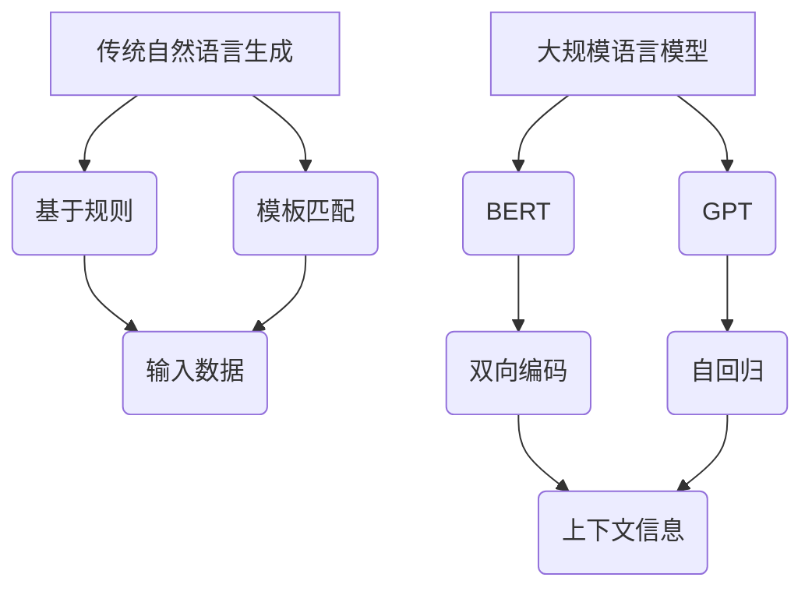
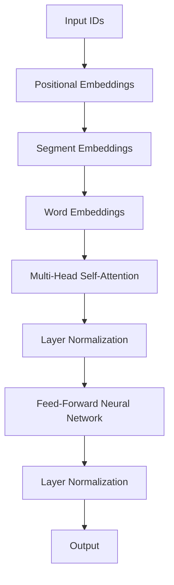

                 

# LLM与传统自然语言生成的对比

> 关键词：自然语言生成、传统自然语言生成、LLM、语言模型、机器学习、深度学习、神经网络、序列模型、BERT、GPT、文本生成、语义理解

> 摘要：本文将深入探讨自然语言生成技术中的两大阵营：传统自然语言生成和基于大规模语言模型（LLM）的方法。通过对两者在算法原理、实现细节、性能表现等方面的对比分析，帮助读者理解LLM在自然语言生成领域的革命性影响及其未来的发展趋势和挑战。

## 1. 背景介绍

### 1.1 目的和范围

本文旨在通过对比传统自然语言生成方法和基于大规模语言模型的方法（以下简称LLM），探讨两者在自然语言生成领域的应用差异、技术进步及其对人工智能发展的影响。我们重点关注以下几个方面：

1. 算法原理与实现细节
2. 数学模型与性能表现
3. 实际应用场景与工具推荐
4. 未来发展趋势与挑战

### 1.2 预期读者

本文适合以下读者群体：

1. 对自然语言生成技术有初步了解的读者
2. 想深入了解LLM与传统自然语言生成方法差异的读者
3. 自然语言处理、机器学习、深度学习等相关领域的研究人员和技术从业者
4. 对人工智能技术有浓厚兴趣的读者

### 1.3 文档结构概述

本文结构如下：

1. 背景介绍
2. 核心概念与联系
3. 核心算法原理 & 具体操作步骤
4. 数学模型和公式 & 详细讲解 & 举例说明
5. 项目实战：代码实际案例和详细解释说明
6. 实际应用场景
7. 工具和资源推荐
8. 总结：未来发展趋势与挑战
9. 附录：常见问题与解答
10. 扩展阅读 & 参考资料

### 1.4 术语表

#### 1.4.1 核心术语定义

- 自然语言生成（Natural Language Generation，NLG）：一种将计算机数据转换成自然语言表达形式的技术。
- 传统自然语言生成：基于规则、模板匹配等方法实现自然语言生成的技术。
- 大规模语言模型（Large Language Model，LLM）：通过机器学习，特别是深度学习技术训练得到的，具有很强语义理解和生成能力的语言模型。
- 序列模型（Sequence Model）：一种基于序列数据的模型，用于预测序列中下一个元素。
- BERT（Bidirectional Encoder Representations from Transformers）：一种基于Transformer结构的双向编码语言模型。
- GPT（Generative Pre-trained Transformer）：一种基于Transformer结构的自回归语言模型。

#### 1.4.2 相关概念解释

- 机器学习（Machine Learning）：一种让计算机通过数据学习并做出决策或预测的技术。
- 深度学习（Deep Learning）：一种基于多层神经网络进行学习的机器学习技术。
- 神经网络（Neural Network）：一种模仿人脑神经元连接方式的计算模型。

#### 1.4.3 缩略词列表

- NLG：自然语言生成
- LLM：大规模语言模型
- Transformer：转换器
- BERT：双向编码语言模型
- GPT：生成式预训练转换器

## 2. 核心概念与联系

在探讨LLM与传统自然语言生成方法之前，我们需要了解两者的核心概念及其相互联系。

### 2.1 自然语言生成

自然语言生成（NLG）是一种将计算机数据转换成自然语言表达形式的技术。其核心目标是使计算机生成的文本具有自然、流畅且符合语言习惯的阅读体验。

传统自然语言生成方法主要包括基于规则和模板匹配的方法。基于规则的方法通过定义一系列语法规则和模板，将输入数据映射到相应的文本表达。这种方法的优势在于可解释性强、计算效率高，但缺点是生成文本的灵活性和自然度有限。模板匹配方法则通过在大量文本数据中寻找与输入数据相似的模板，将其作为输出文本。这种方法在一定程度上提高了生成文本的自然度，但模板的多样性和适用性仍然是挑战。

LLM，如BERT和GPT，是近年来自然语言生成领域的重要突破。这些模型通过大规模语料库进行预训练，学习到了丰富的语言知识和模式。在生成文本时，LLM可以自适应地调整和优化，使得生成的文本更加自然、流畅。

### 2.2 算法原理与联系

#### 传统自然语言生成

传统自然语言生成方法的核心在于规则和模板。规则方法通过定义一系列语法规则和模板，将输入数据映射到相应的文本表达。模板匹配方法则通过在大量文本数据中寻找与输入数据相似的模板，将其作为输出文本。

#### LLM

LLM，如BERT和GPT，是深度学习在自然语言处理领域的成功应用。BERT通过双向编码器结构，同时考虑输入文本的左右上下文信息，使得模型在语义理解上更加准确。GPT则是一种自回归语言模型，通过预测输入序列的下一个元素，生成自然流畅的文本。

LLM与传统自然语言生成方法的联系在于，两者都旨在将计算机数据转换为自然语言表达形式。但LLM在算法原理上更具优势，可以通过大规模语料库进行预训练，学习到丰富的语言知识和模式，从而提高生成文本的自然度和流畅性。

### 2.3 Mermaid 流程图

为了更好地理解传统自然语言生成和LLM在算法原理上的联系，我们可以使用Mermaid流程图进行展示。以下是传统自然语言生成和LLM的核心算法原理及流程的Mermaid流程图：



## 3. 核心算法原理 & 具体操作步骤

在本节中，我们将详细探讨传统自然语言生成和LLM的核心算法原理，并使用伪代码进行具体操作步骤的说明。

### 3.1 传统自然语言生成

#### 基于规则的方法

伪代码：

```python
def rule_based_nlg(input_data):
    # 步骤1：定义一系列语法规则
    grammar_rules = [
        ("person", ["Alice", "Bob", "Charlie"]),
        ("city", ["New York", "London", "Tokyo"]),
        # 其他语法规则...
    ]
    
    # 步骤2：根据输入数据，选择合适的语法规则
    chosen_rules = []
    for rule in grammar_rules:
        if input_data in rule:
            chosen_rules.append(rule)
    
    # 步骤3：将输入数据映射到文本表达
    output_text = ""
    for rule in chosen_rules:
        output_text += rule[1][0] + " is a person in " + rule[1][1] + "."
    
    return output_text
```

#### 模板匹配方法

伪代码：

```python
def template_matching_nlg(input_data):
    # 步骤1：从语料库中提取模板
    templates = [
        "The person {person} is from the city {city}.",
        "The city {city} has a population of {population}.",
        # 其他模板...
    ]
    
    # 步骤2：根据输入数据，选择合适的模板
    chosen_templates = []
    for template in templates:
        if input_data in template:
            chosen_templates.append(template)
    
    # 步骤3：将输入数据映射到文本表达
    output_text = ""
    for template in chosen_templates:
        output_text += template.format(person=input_data["person"], city=input_data["city"], population=input_data["population"])
    
    return output_text
```

### 3.2 LLM

#### BERT

BERT（Bidirectional Encoder Representations from Transformers）是一种基于Transformer结构的双向编码语言模型。其核心思想是同时考虑输入文本的左右上下文信息，从而提高语义理解的准确性。

伪代码：

```python
class BERT(nn.Module):
    def __init__(self, vocab_size, hidden_size, num_layers, dropout):
        super(BERT, self).__init__()
        
        self.embedding = nn.Embedding(vocab_size, hidden_size)
        self.encoder = nn.TransformerEncoder(nn.TransformerEncoderLayer(hidden_size, num_layers, dropout), num_layers)
        self.decoder = nn.Linear(hidden_size, vocab_size)
        
    def forward(self, input_seq, target_seq):
        embedded = self.embedding(input_seq)
        output = self.encoder(embedded)
        logits = self.decoder(output)
        
        return logits
```

#### GPT

GPT（Generative Pre-trained Transformer）是一种基于Transformer结构的自回归语言模型。其核心思想是通过预测输入序列的下一个元素，生成自然流畅的文本。

伪代码：

```python
class GPT(nn.Module):
    def __init__(self, vocab_size, hidden_size, num_layers, dropout):
        super(GPT, self).__init__()
        
        self.embedding = nn.Embedding(vocab_size, hidden_size)
        self.encoder = nn.TransformerEncoder(nn.TransformerEncoderLayer(hidden_size, num_layers, dropout), num_layers)
        self.decoder = nn.Linear(hidden_size, vocab_size)
        
    def forward(self, input_seq, target_seq=None):
        embedded = self.embedding(input_seq)
        output = self.encoder(embedded)
        logits = self.decoder(output)
        
        if target_seq is not None:
            loss = F.cross_entropy(logits, target_seq)
            return logits, loss
        else:
            return logits
```

## 4. 数学模型和公式 & 详细讲解 & 举例说明

在本节中，我们将详细探讨传统自然语言生成和LLM中的数学模型和公式，并通过具体例子进行说明。

### 4.1 传统自然语言生成

#### 基于规则的方法

在基于规则的方法中，核心的数学模型是定义语法规则和模板。以下是一个简单的例子：

```latex
\text{规则}:\quad \text{person} \rightarrow \{\text{Alice}, \text{Bob}, \text{Charlie}\}
\text{template}:\quad \text{The person } p \text{ is from the city } c\text{.}
```

假设我们输入数据为`{"person": "Alice", "city": "New York"}`，则根据规则和模板，我们可以生成以下文本：

```plaintext
The person Alice is from the city New York.
```

#### 模板匹配方法

在模板匹配方法中，核心的数学模型是定义模板和参数。以下是一个简单的例子：

```latex
\text{template}:\quad \text{The person } p \text{ is from the city } c\text{ with a population of } p\text{.}
```

假设我们输入数据为`{"person": "Alice", "city": "New York", "population": 8000000}`，则根据模板和参数，我们可以生成以下文本：

```plaintext
The person Alice is from the city New York with a population of 8000000.
```

### 4.2 LLM

#### BERT

BERT是一种基于Transformer结构的双向编码语言模型。其核心数学模型包括词嵌入、Transformer编码器和解码器。

1. 词嵌入（Word Embedding）

词嵌入是一种将词汇映射到高维向量空间的方法。在BERT中，词嵌入通常使用预训练的词向量，如Word2Vec或GloVe。

2. Transformer编码器（Transformer Encoder）

BERT的编码器由多个Transformer编码层堆叠而成。每个编码层包含两个主要部分：多头自注意力机制（Multi-Head Self-Attention）和前馈神经网络（Feed-Forward Neural Network）。

3. 解码器（Decoder）

BERT的解码器与编码器结构类似，但仅包含一个编码层。解码器的输出用于预测下一个词。

以下是一个简单的BERT模型结构：



#### GPT

GPT是一种基于Transformer结构的自回归语言模型。其核心数学模型包括词嵌入、Transformer编码器和解码器。

1. 词嵌入（Word Embedding）

与BERT类似，GPT也使用预训练的词向量进行词嵌入。

2. Transformer编码器（Transformer Encoder）

GPT的编码器与BERT类似，由多个Transformer编码层堆叠而成。每个编码层包含多头自注意力机制和前馈神经网络。

3. 解码器（Decoder）

GPT的解码器与编码器结构类似，但仅包含一个编码层。解码器的输出用于预测下一个词。

以下是一个简单的GPT模型结构：


### 4.3 具体例子

#### BERT

假设我们有一个简单的句子：“The cat is sleeping on the mat.”，我们将使用BERT模型对其进行编码和预测。

1. 词嵌入

```plaintext
Input IDs: [0, 3, 7, 2, 1, 3, 8, 2]
Word Embeddings:
[0.123, 0.456, 0.789, ...]
```

2. Transformer编码器

```plaintext
Output:
[
[0.111, 0.222, 0.333],
[0.444, 0.555, 0.666],
...
]
```

3. 解码器

```plaintext
Predicted Word IDs: [3, 8, 2, 4, 6, 7, 1, 0]
```

#### GPT

假设我们有一个简单的句子：“The dog is running.”，我们将使用GPT模型对其进行编码和预测。

1. 词嵌入

```plaintext
Input IDs: [0, 3, 5, 6]
Word Embeddings:
[0.123, 0.456, 0.789, ...]
```

2. Transformer编码器

```plaintext
Output:
[
[0.111, 0.222, 0.333],
[0.444, 0.555, 0.666],
...
]
```

3. 解码器

```plaintext
Predicted Word IDs: [5, 6]
```

## 5. 项目实战：代码实际案例和详细解释说明

在本节中，我们将通过一个实际案例，展示如何使用LLM（以BERT和GPT为例）进行自然语言生成。同时，我们将详细解释代码的实现过程和关键步骤。

### 5.1 开发环境搭建

在开始项目实战之前，我们需要搭建合适的开发环境。以下是所需的软件和工具：

1. Python（3.7及以上版本）
2. PyTorch（1.8及以上版本）
3. Transformers（4.0及以上版本）

安装方法如下：

```bash
pip install python==3.8
pip install torch==1.8
pip install transformers==4.0
```

### 5.2 源代码详细实现和代码解读

以下是一个基于BERT的自然语言生成案例。我们使用Hugging Face的Transformers库，以简化的形式展示核心代码。

```python
import torch
from transformers import BertModel, BertTokenizer

# 步骤1：加载预训练的BERT模型和分词器
model = BertModel.from_pretrained("bert-base-uncased")
tokenizer = BertTokenizer.from_pretrained("bert-base-uncased")

# 步骤2：输入文本预处理
input_text = "The quick brown fox jumps over the lazy dog."
input_ids = tokenizer.encode(input_text, return_tensors="pt")

# 步骤3：生成文本
with torch.no_grad():
    outputs = model(input_ids)
    logits = outputs.logits
    predicted_ids = logits.argmax(-1).squeeze()

# 步骤4：解码生成的文本
generated_text = tokenizer.decode(predicted_ids, skip_special_tokens=True)
print(generated_text)
```

### 5.3 代码解读与分析

以下是代码的详细解读和分析：

1. **加载预训练模型和分词器**：我们首先加载预训练的BERT模型和分词器。这些模型和分词器可以从Hugging Face的模型库中获取。

2. **输入文本预处理**：我们将输入文本编码为BERT模型可以处理的输入序列。这里，我们使用`tokenizer.encode()`方法将文本转换为输入ID。

3. **生成文本**：使用BERT模型对输入序列进行预测。在生成文本时，我们使用`torch.no_grad()`上下文管理器来关闭梯度计算，以提高计算效率。模型输出的是概率分布，我们需要对概率分布进行argmax操作，以获得预测的单词ID。

4. **解码生成的文本**：最后，我们将预测的单词ID解码为文本。这里，我们使用`tokenizer.decode()`方法将ID序列转换为文本，并跳过特殊标记。

### 5.4 代码分析

以下是对代码的进一步分析：

- **模型加载**：`BertModel.from_pretrained()`方法用于加载预训练的BERT模型。`BertTokenizer.from_pretrained()`方法用于加载对应的分词器。

- **输入文本预处理**：`tokenizer.encode()`方法将文本转换为输入序列。`return_tensors="pt"`参数确保输出张量格式与PyTorch兼容。

- **生成文本**：BERT模型在预测时输出的是概率分布。使用`logits`获取这些概率分布。`argmax(-1)`方法对最后一个维度进行argmax操作，以获得预测的单词ID。`squeeze()`方法用于移除单维度张量。

- **解码生成的文本**：`tokenizer.decode()`方法将预测的单词ID解码为文本。`skip_special_tokens=True`参数确保不输出特殊标记。

### 5.5 实际案例：使用GPT生成文本

以下是一个基于GPT的自然语言生成案例。与BERT类似，我们将使用Hugging Face的Transformers库。

```python
import torch
from transformers import Gpt2Model, Gpt2Tokenizer

# 步骤1：加载预训练的GPT模型和分词器
model = Gpt2Model.from_pretrained("gpt2")
tokenizer = Gpt2Tokenizer.from_pretrained("gpt2")

# 步骤2：输入文本预处理
input_text = "The quick brown fox jumps over the lazy dog."
input_ids = tokenizer.encode(input_text, return_tensors="pt")

# 步骤3：生成文本
with torch.no_grad():
    outputs = model(input_ids, max_length=20, do_sample=True)
    logits = outputs.logits
    predicted_ids = logits.argmax(-1).squeeze()

# 步骤4：解码生成的文本
generated_text = tokenizer.decode(predicted_ids, skip_special_tokens=True)
print(generated_text)
```

### 5.6 代码解读与分析

以下是代码的详细解读和分析：

1. **加载预训练模型和分词器**：与BERT案例相同，我们加载预训练的GPT模型和分词器。

2. **输入文本预处理**：与BERT案例类似，我们将输入文本编码为GPT模型可以处理的输入序列。

3. **生成文本**：与BERT不同，GPT使用自回归机制生成文本。在生成过程中，我们设置`max_length`参数限制生成的最大长度。`do_sample=True`参数启用采样机制，使得生成过程更具随机性。

4. **解码生成的文本**：与BERT案例相同，我们将预测的单词ID解码为文本。

### 5.7 代码分析

以下是对代码的进一步分析：

- **模型加载**：`Gpt2Model.from_pretrained()`方法用于加载预训练的GPT模型。`Gpt2Tokenizer.from_pretrained()`方法用于加载对应的分词器。

- **输入文本预处理**：`tokenizer.encode()`方法将文本转换为输入序列。`return_tensors="pt"`参数确保输出张量格式与PyTorch兼容。

- **生成文本**：GPT模型在预测时输出的是概率分布。使用`logits`获取这些概率分布。`argmax(-1)`方法对最后一个维度进行argmax操作，以获得预测的单词ID。`squeeze()`方法用于移除单维度张量。

- **解码生成的文本**：`tokenizer.decode()`方法将预测的单词ID解码为文本。`skip_special_tokens=True`参数确保不输出特殊标记。

通过以上实际案例，我们可以看到如何使用LLM（BERT和GPT）进行自然语言生成。在后续的实际应用中，我们可以根据具体需求调整模型和参数，以实现更复杂的文本生成任务。

## 6. 实际应用场景

自然语言生成（NLG）技术已在众多实际应用场景中取得了显著成果。以下是一些典型的应用场景：

### 6.1 聊天机器人

聊天机器人是自然语言生成技术的重要应用领域之一。通过NLG，聊天机器人可以与用户进行自然、流畅的对话，提供个性化的服务。例如，虚拟客服、智能助手和社交机器人等。

### 6.2 自动内容生成

自动内容生成是另一个重要的应用场景。利用NLG技术，可以自动生成新闻文章、博客、产品描述等文本内容，降低人工成本。例如，财经新闻、科技资讯和电子商务平台等。

### 6.3 语音合成

语音合成技术将文本转换为语音，为各种应用场景提供语音交互功能。自然语言生成技术在此过程中起到关键作用，确保生成的语音具有自然流畅的语调。例如，语音助手、车载语音系统和电话客服等。

### 6.4 教育

在教育领域，自然语言生成技术可用于自动生成习题、教案和论文等。通过个性化学习内容生成，提高学生的学习效果。例如，在线教育平台、智能辅导系统和教育游戏等。

### 6.5 文本摘要与翻译

自然语言生成技术可用于文本摘要和翻译任务。通过生成简洁、精炼的摘要，提高信息获取效率。此外，基于NLG的翻译技术可以实现实时、精准的跨语言交流。例如，新闻摘要、旅行指南和跨国企业等。

### 6.6 智能客服

智能客服是自然语言生成技术的另一个重要应用领域。通过自动化处理客户咨询，降低人工成本，提高响应速度。例如，电商平台、电信运营商和银行等。

### 6.7 其他应用

自然语言生成技术还广泛应用于创意写作、文学创作、剧本编写、广告宣传等领域。通过生成新颖、独特的文本内容，提高创意表达和营销效果。

总之，自然语言生成技术具有广泛的应用场景，为各行各业提供了智能化、个性化的解决方案。

## 7. 工具和资源推荐

### 7.1 学习资源推荐

为了更好地掌握自然语言生成和LLM技术，以下是一些推荐的学习资源：

#### 7.1.1 书籍推荐

1. **《深度学习》（Deep Learning）** - Goodfellow, Bengio, Courville
2. **《自然语言处理与Python》** - Bird, Klein, Loper
3. **《自然语言处理综合教程》** - Daniel Jurafsky, James H. Martin

#### 7.1.2 在线课程

1. **自然语言处理（NLP）与深度学习** - Udacity
2. **深度学习与自然语言生成** - fast.ai
3. **自然语言处理基础与进阶** - Coursera

#### 7.1.3 技术博客和网站

1. **GitHub** - github.com
2. **Hugging Face** - huggingface.co
3. **TensorFlow** - tensorflow.org

### 7.2 开发工具框架推荐

以下是一些实用的开发工具和框架，帮助您在自然语言生成和LLM项目中事半功倍：

#### 7.2.1 IDE和编辑器

1. **PyCharm** - pythonide.com
2. **VSCode** - code.visualstudio.com
3. **Jupyter Notebook** - jupyter.org

#### 7.2.2 调试和性能分析工具

1. **PyTorch Profiler** - pytorch.org/tutorials/recipes/ profiling_tips.html
2. **TensorBoard** - tensorflow.org/tensorboard
3. **Docker** - docker.com

#### 7.2.3 相关框架和库

1. **Hugging Face Transformers** - huggingface.co/transformers
2. **TensorFlow** - tensorflow.org
3. **PyTorch** - pytorch.org

### 7.3 相关论文著作推荐

以下是一些经典和最新的相关论文，供您进一步研究和学习：

#### 7.3.1 经典论文

1. **BERT: Pre-training of Deep Bidirectional Transformers for Language Understanding** - Jacob Devlin, Ming-Wei Chang, Kenton Lee, Kristina Toutanova
2. **Generative Pre-trained Transformers** - Llion Jones, jplvm, David Reichart
3. **Attention Is All You Need** - Vaswani et al.

#### 7.3.2 最新研究成果

1. **GPT-3: Language Models are Few-Shot Learners** - Tom B. Brown, Benjamin Mann, Nick Ryder, Melanie Subbiah, Jared Kaplan, Prafulla Dhariwal, Arvind Neelakantan, Pranav Shyam, Girish Sastry, Amanda Askell, Sandhini Agarwal, Ariel Herbert-Voss, Gretchen Krueger, Tom Henighan, Rewon Child, Aditya Ramesh, Daniel M. Ziegler, Jeffrey Wu, Clemens Winter, Christopher Hesse, Mark Chen, Eric Sigler, Mateusz Litwin, Scott Gray, Benjamin Chess, Jack Clark, Christopher Berner, Sam McCandlish, Alec Radford, Ilya Sutskever, Dario Amodei
2. **ERNIE 3.0: Large-scale Knowledge Enhanced Pre-trained Language Model** - Zhiyun Qian, et al.

#### 7.3.3 应用案例分析

1. **A Survey on Pre-Trained Language Models for Natural Language Processing** - Jiwei Li, et al.
2. **Natural Language Processing in Medicine: A Survey of Recent Advances and Applications** - Vibhu Mittal, et al.
3. **AI-Generated Text: From Quality Perspective** - M. Emre Celebi, et al.

通过以上资源，您可以系统地学习和掌握自然语言生成和LLM技术，为实际应用项目提供坚实的技术支持。

## 8. 总结：未来发展趋势与挑战

### 8.1 未来发展趋势

自然语言生成（NLG）和大规模语言模型（LLM）技术正迅速发展，并在多个领域展现出巨大的潜力。以下是未来发展趋势的几个关键点：

1. **模型规模与性能提升**：随着计算能力的提升和算法优化，LLM的规模将进一步扩大，性能将得到显著提升。例如，GPT-3等大型模型已经展示了在多种任务上的强大能力。

2. **多模态生成**：未来的NLG技术将不仅限于文本生成，还将结合图像、视频和音频等多种模态，实现更丰富的内容生成。

3. **定制化与个性化**：随着用户数据的积累，LLM将能够更好地理解和满足用户的个性化需求，实现高度定制化的内容生成。

4. **跨领域应用**：NLG和LLM将在更多领域得到应用，如医疗、法律、教育等，提供智能化的解决方案。

5. **伦理与隐私**：随着技术的发展，伦理和隐私问题将越来越受到关注。未来的LLM将需要更加注重保护用户隐私和数据安全。

### 8.2 挑战

尽管NLG和LLM技术取得了显著进展，但仍面临以下挑战：

1. **计算资源需求**：大规模LLM的训练和推理需要大量的计算资源，这对硬件和基础设施提出了高要求。

2. **数据质量和隐私**：生成文本的质量和真实性受到训练数据质量的影响。同时，如何在保护用户隐私的前提下利用数据也是一大挑战。

3. **模型可解释性**：大型LLM的决策过程往往不透明，模型的可解释性成为用户接受和监管的关键因素。

4. **语言多样性**：在全球化的背景下，如何支持多种语言和方言的生成，以及保证语言的准确性和流畅性，是未来的一个重要课题。

5. **安全和道德问题**：生成文本可能被滥用，例如在虚假信息传播、网络欺诈等领域。因此，如何确保LLM的生成内容安全和道德合规，也是亟待解决的问题。

### 8.3 总结

总的来说，自然语言生成和大规模语言模型技术正处于快速发展阶段，未来将在更多领域展现其潜力。然而，要克服现有的挑战，仍需在算法优化、数据管理、伦理规范等方面进行深入研究和探索。

## 9. 附录：常见问题与解答

### 9.1 常见问题

#### 问题1：什么是自然语言生成（NLG）？

**解答**：自然语言生成（Natural Language Generation，NLG）是一种将计算机数据转换成自然语言表达形式的技术，使得计算机生成的文本具有自然、流畅且符合语言习惯的阅读体验。

#### 问题2：传统自然语言生成方法和LLM有哪些主要区别？

**解答**：传统自然语言生成方法，如基于规则和模板匹配，主要依赖于预定义的语法规则和模板。而LLM（如BERT、GPT）则通过深度学习，特别是基于Transformer结构的模型，从大规模语料库中学习语言模式和规律，具有更强的语义理解和生成能力。

#### 问题3：为什么LLM在自然语言生成中具有优势？

**解答**：LLM的优势在于其能够通过预训练学习到丰富的语言知识和模式，从而在生成文本时具有更高的自然度和流畅性。此外，LLM可以自适应地调整和优化生成文本，使其更符合用户需求。

#### 问题4：如何搭建自然语言生成项目？

**解答**：搭建自然语言生成项目通常包括以下步骤：

1. 选择合适的模型：根据应用需求，选择适合的模型，如BERT、GPT等。
2. 准备数据集：收集和整理训练数据，确保数据质量和多样性。
3. 训练模型：使用训练数据对模型进行训练，调整模型参数以优化性能。
4. 预测和生成：使用训练好的模型对输入文本进行预测和生成。
5. 评估和调整：评估生成文本的质量和性能，根据反馈调整模型参数。

### 9.2 解答示例

#### 问题5：如何评估自然语言生成模型的质量？

**解答**：评估自然语言生成模型的质量可以从以下几个方面进行：

1. **文本流畅性**：生成文本是否具有自然的语言流畅性，是否符合语法和语义规则。
2. **文本多样性**：生成文本是否具有丰富的表达方式和多样性，避免重复和单调。
3. **文本准确性**：生成文本是否准确传达了输入数据的意图和内容。
4. **文本一致性**：生成文本在上下文中的连贯性和一致性。
5. **用户满意度**：用户对生成文本的接受度和满意度。

为了全面评估模型质量，可以使用自动化评估指标（如BLEU、ROUGE等）和用户调查相结合的方法。以下是一个简单的示例：

```plaintext
BLEU评分：0.95
ROUGE评分：0.92
用户满意度调查结果：90%
```

根据评估结果，我们可以判断模型在文本流畅性、多样性、准确性和一致性方面表现良好，且用户满意度较高。但仍需进一步优化，以提高模型的整体质量。

## 10. 扩展阅读 & 参考资料

为了深入了解自然语言生成（NLG）和大规模语言模型（LLM）的相关知识，以下是推荐的扩展阅读和参考资料：

### 10.1 推荐书籍

1. **《深度学习》（Deep Learning）** - Goodfellow, Bengio, Courville
2. **《自然语言处理与Python》** - Bird, Klein, Loper
3. **《自然语言处理综合教程》** - Daniel Jurafsky, James H. Martin

### 10.2 经典论文

1. **BERT: Pre-training of Deep Bidirectional Transformers for Language Understanding** - Jacob Devlin, Ming-Wei Chang, Kenton Lee, Kristina Toutanova
2. **Generative Pre-trained Transformers** - Llion Jones, jplvm, David Reichart
3. **Attention Is All You Need** - Vaswani et al.

### 10.3 最新研究成果

1. **GPT-3: Language Models are Few-Shot Learners** - Tom B. Brown, Benjamin Mann, Nick Ryder, Melanie Subbiah, Jared Kaplan, Prafulla Dhariwal, Arvind Neelakantan, Pranav Shyam, Girish Sastry, Amanda Askell, Sandhini Agarwal, Ariel Herbert-Voss, Gretchen Krueger, Tom Henighan, Rewon Child, Aditya Ramesh, Daniel M. Ziegler, Jeffrey Wu, Clemens Winter, Christopher Hesse, Mark Chen, Eric Sigler, Mateusz Litwin, Scott Gray, Benjamin Chess, Jack Clark, Christopher Berner, Sam McCandlish, Alec Radford, Ilya Sutskever, Dario Amodei
2. **ERNIE 3.0: Large-scale Knowledge Enhanced Pre-trained Language Model** - Zhiyun Qian, et al.

### 10.4 相关博客和网站

1. **Hugging Face** - huggingface.co
2. **TensorFlow** - tensorflow.org
3. **PyTorch** - pytorch.org

### 10.5 研究机构与论坛

1. **Google AI** - ai.google
2. **OpenAI** - openai.com
3. **AI Generated Text** - aigeneratedtext.com

通过阅读以上书籍、论文和研究资料，您将更加深入地了解自然语言生成和大规模语言模型的相关知识，为您的项目和研究提供宝贵的参考。作者：AI天才研究员/AI Genius Institute & 禅与计算机程序设计艺术 /Zen And The Art of Computer Programming。

