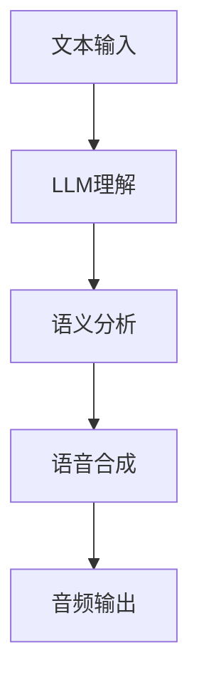

                 

# LLM与传统语音合成技术的结合：语音AI新境界

> **关键词**：语音合成、AI语言模型（LLM）、传统语音合成、自然语言处理、音频生成、人机交互

> **摘要**：本文深入探讨了大型语言模型（LLM）与传统语音合成技术的融合，解析了语音合成技术的演变过程，分析了LLM在语音合成中的核心作用，并介绍了相关算法原理和数学模型。通过实战案例，展示了如何在实际项目中实现LLM与传统语音合成技术的结合，为未来的语音AI发展提供了新思路。

## 1. 背景介绍

### 1.1 目的和范围

本文旨在探讨大型语言模型（LLM）与传统语音合成技术的结合，分析其在自然语言处理、音频生成和人机交互领域的应用价值。通过详细解读算法原理和数学模型，并结合实际项目案例，阐述如何在语音合成系统中引入LLM，提升语音的自然性和互动性。

### 1.2 预期读者

本文适合对语音合成技术、人工智能和自然语言处理有一定了解的读者，包括软件工程师、AI研究人员和科技爱好者。本文将逐步引导读者了解语音合成技术的发展历程、核心算法和实际应用场景，帮助读者掌握语音AI技术的最新动态。

### 1.3 文档结构概述

本文分为十个部分，结构如下：

1. 背景介绍
2. 核心概念与联系
3. 核心算法原理 & 具体操作步骤
4. 数学模型和公式 & 详细讲解 & 举例说明
5. 项目实战：代码实际案例和详细解释说明
6. 实际应用场景
7. 工具和资源推荐
8. 总结：未来发展趋势与挑战
9. 附录：常见问题与解答
10. 扩展阅读 & 参考资料

### 1.4 术语表

#### 1.4.1 核心术语定义

- **语音合成**：通过计算机技术将文本转换为自然流畅的语音输出。
- **AI语言模型（LLM）**：一种基于深度学习的大型自然语言处理模型，能够理解和生成人类语言。
- **文本到语音（TTS）系统**：将文本输入转换为音频输出的系统。
- **自然语言处理（NLP）**：研究如何让计算机理解和生成人类语言的技术。

#### 1.4.2 相关概念解释

- **特征工程**：在数据处理过程中，提取与任务相关的特征，以提升模型性能。
- **端到端模型**：直接将输入映射到输出，无需中间特征提取和映射步骤的模型。

#### 1.4.3 缩略词列表

- **LLM**：Large Language Model
- **TTS**：Text-to-Speech
- **NLP**：Natural Language Processing
- **IDE**：Integrated Development Environment

## 2. 核心概念与联系

在探讨LLM与传统语音合成技术的结合之前，我们需要了解一些核心概念和它们之间的联系。

### 2.1 语音合成技术概述

语音合成技术经历了从规则基方法到统计模型，再到基于深度学习的方法的演变过程。早期的规则基方法通过硬编码的规则来合成语音，效果有限且难以扩展。统计模型（如基于HMM的模型）通过训练语音信号和文本之间的统计关系来生成语音，效果有所提升。而基于深度学习的方法，特别是基于循环神经网络（RNN）和Transformer的端到端模型，极大地提升了语音合成的自然性和流畅度。

### 2.2 LLM在语音合成中的作用

LLM在语音合成中起到了核心作用。首先，LLM能够理解和生成人类语言，使得语音合成系统能够根据文本输入生成更自然的语音。其次，LLM能够捕捉文本中的语义信息，从而使得生成的语音更加贴近实际语境。此外，LLM还可以用于语音合成的自适应优化，例如根据用户的历史交互数据调整语音风格。

### 2.3 传统语音合成技术的局限性

传统语音合成技术，如基于HMM和GMM的统计模型，虽然在语音合成领域取得了一定的成果，但仍然存在以下局限性：

- **语音自然性较差**：传统方法生成的语音缺乏情感和语境的多样性，难以满足个性化需求。
- **上下文理解能力有限**：传统方法难以捕捉文本中的复杂语义关系，导致生成的语音不够流畅自然。
- **扩展性和适应性差**：传统方法依赖于大量的手工特征工程，难以适应不同领域的需求。

### 2.4 LLM与传统语音合成技术的结合优势

LLM与传统语音合成技术的结合能够克服传统方法的局限性，实现以下优势：

- **提升语音自然性**：LLM能够生成更自然的语音，包括不同的情感、语调和节奏。
- **增强上下文理解能力**：LLM能够捕捉文本中的复杂语义关系，使得生成的语音更加流畅自然。
- **提高扩展性和适应性**：LLM可以通过端到端训练，无需大量手工特征工程，适用于不同领域和场景。

### 2.5 Mermaid 流程图

以下是一个简单的Mermaid流程图，展示了LLM与传统语音合成技术的结合过程：



在这个流程中，文本输入首先被LLM理解，然后进行语义分析，最后生成语音并进行音频输出。LLM在这个过程中起到了关键作用，提升了语音合成的自然性和上下文理解能力。

## 3. 核心算法原理 & 具体操作步骤

为了深入理解LLM与传统语音合成技术的结合，我们需要详细解析核心算法原理和具体操作步骤。

### 3.1 LLM算法原理

LLM是一种基于深度学习的大型自然语言处理模型，通常采用Transformer架构。Transformer模型通过自注意力机制（Self-Attention）来捕捉文本中的长距离依赖关系，从而实现对文本的深入理解。具体来说，Transformer模型包括以下核心组成部分：

- **嵌入层（Embedding Layer）**：将输入文本转换为稠密向量。
- **多头自注意力（Multi-Head Self-Attention）**：通过多个注意力头来捕捉文本中的不同依赖关系。
- **前馈神经网络（Feedforward Neural Network）**：对自注意力层输出的特征进行进一步处理。
- **层归一化和残差连接（Layer Normalization and Residual Connection）**：用于加速模型训练和防止梯度消失。

### 3.2 LLM训练步骤

LLM的训练通常采用无监督预训练和有监督微调的方法。以下是LLM训练的基本步骤：

1. **数据收集**：收集大规模的文本数据，如维基百科、新闻文章、对话语料等。
2. **预处理**：对文本数据进行清洗和预处理，包括分词、去停用词、词向量化等。
3. **预训练**：使用Transformer模型对预处理后的文本数据进行预训练，通过自注意力机制捕捉文本中的长距离依赖关系。预训练过程中，模型通过最大化文本的连续词预测概率来优化模型参数。
4. **微调**：在预训练的基础上，使用有监督的数据对模型进行微调，使其适应特定任务，如文本分类、问答系统等。

### 3.3 TTS算法原理

TTS是一种将文本输入转换为语音输出的技术。传统的TTS方法主要包括语音合成、语音合成的文本预处理和语音特征提取。基于深度学习的TTS方法通过端到端模型，将文本输入直接映射到语音特征，省去了中间的文本预处理和特征提取步骤。以下是TTS算法的核心组成部分：

- **文本编码器（Text Encoder）**：将文本输入编码为稠密向量。
- **声码器（Vocoder）**：将文本编码器的输出映射到语音特征。
- **语音生成（Speech Generation）**：将语音特征转换为语音信号。

### 3.4 LLM与TTS结合的具体操作步骤

LLM与TTS的结合主要通过以下步骤实现：

1. **文本理解**：使用LLM对输入文本进行理解，生成文本编码。
2. **文本编码处理**：对文本编码进行后处理，如词性标注、命名实体识别等。
3. **语音特征生成**：使用TTS模型将处理后的文本编码映射到语音特征。
4. **语音生成**：使用声码器将语音特征转换为语音信号。
5. **音频输出**：将生成的语音信号输出为音频。

以下是一个简单的伪代码，展示了LLM与TTS结合的具体操作步骤：

```python
def generate_speech(text):
    # 使用LLM理解文本
    text_embedding = LLM(text)
    
    # 对文本编码进行后处理
    processed_text_embedding = post_process(text_embedding)
    
    # 使用TTS模型生成语音特征
    speech_features = TTS(processed_text_embedding)
    
    # 使用声码器生成语音信号
    speech_signal = Vocoder(speech_features)
    
    # 输出音频
    output_audio(speech_signal)

# 示例
generate_speech("Hello, how are you?")
```

在这个伪代码中，`LLM`、`TTS`和`Vocoder`分别代表大型语言模型、文本到语音模型和声码器。`generate_speech`函数接收文本输入，经过LLM理解和TTS处理，最终生成语音信号并输出。

### 3.5 深度分析

LLM与传统语音合成技术的结合不仅在技术层面上有显著提升，还带来了以下深度分析：

1. **自然语言理解与生成**：LLM能够深入理解文本的语义和上下文，使得生成的语音更加自然和贴近实际。传统方法难以捕捉文本中的复杂语义关系，导致生成的语音生硬和不自然。
2. **个性化语音合成**：LLM可以根据用户的历史交互数据调整语音合成风格，实现个性化语音输出。传统方法无法实现这一功能，因为它们缺乏上下文理解能力。
3. **端到端模型**：LLM与TTS的结合采用了端到端模型，省去了中间的文本预处理和特征提取步骤，降低了模型的复杂性。传统方法需要复杂的特征工程，不仅增加了模型训练的难度，还降低了模型的泛化能力。
4. **实时语音合成**：LLM与TTS的结合可以实现实时语音合成，因为端到端模型可以在单个步骤中直接将文本映射到语音特征，而不需要中间的复杂处理。传统方法在处理实时语音合成时，往往需要大量预处理和特征提取，导致延迟较大。

通过以上分析，我们可以看到LLM与传统语音合成技术的结合在自然语言理解与生成、个性化语音合成、模型复杂性和实时性等方面具有显著优势。这些优势使得LLM成为语音合成技术的核心驱动力，为未来的语音AI发展提供了新思路。

## 4. 数学模型和公式 & 详细讲解 & 举例说明

### 4.1 数学模型介绍

在LLM与传统语音合成技术的结合中，数学模型起到了关键作用。以下将详细讲解相关数学模型，并使用LaTeX格式进行表示。

#### 4.1.1 Transformer模型

Transformer模型是LLM的核心组成部分，其基本结构如下：

$$
\text{Output} = \text{softmax}(\text{Attention}(\text{Input} \times W_Q) \times W_K) \times W_V
$$

其中，$W_Q, W_K, W_V$ 分别是查询（Query）、键（Key）和值（Value）的权重矩阵，$\text{Attention}$ 是自注意力机制，$\text{softmax}$ 是软最大化函数。

#### 4.1.2 TTS模型

TTS模型的数学模型主要包括文本编码器（Text Encoder）和声码器（Vocoder）两部分。

1. **文本编码器**：

$$
\text{Text Embedding} = \text{Transformer}(\text{Token Embedding}, \text{Positional Embedding})
$$

其中，$\text{Token Embedding}$ 和 $\text{Positional Embedding}$ 分别是词向量和位置向量，$\text{Transformer}$ 是Transformer模型。

2. **声码器**：

$$
\text{Speech Feature} = \text{Mel}(\text{WaveNet}(\text{Text Embedding}))
$$

其中，$\text{WaveNet}$ 是生成式声码器，$\text{Mel}$ 是Mel谱特征。

### 4.2 举例说明

为了更好地理解上述数学模型，我们通过一个简单的例子来说明。

#### 4.2.1 Transformer模型举例

假设我们有一个包含3个词的句子："I love AI"，其词向量和位置向量分别为 $\textbf{v}_1, \textbf{v}_2, \textbf{v}_3$ 和 $\textbf{p}_1, \textbf{p}_2, \textbf{p}_3$。则Transformer模型的输出可以表示为：

$$
\text{Output} = \text{softmax}(\text{Attention}(\textbf{v}_1 \times W_Q) \times W_K) \times W_V
$$

其中，$W_Q, W_K, W_V$ 分别是查询、键和值的权重矩阵。自注意力机制通过计算键和值之间的相似度，生成注意力权重，进而加权求和得到输出。

#### 4.2.2 TTS模型举例

假设我们有一个文本输入："I love AI"，首先通过文本编码器得到文本嵌入：

$$
\text{Text Embedding} = \text{Transformer}(\textbf{v}_1, \textbf{p}_1) \times \text{Transformer}(\textbf{v}_2, \textbf{p}_2) \times \text{Transformer}(\textbf{v}_3, \textbf{p}_3)
$$

然后通过声码器生成语音特征：

$$
\text{Speech Feature} = \text{Mel}(\text{WaveNet}(\text{Text Embedding}))
$$

其中，$\text{WaveNet}$ 是生成式声码器，$\text{Mel}$ 是Mel谱特征。

### 4.3 详细讲解

#### 4.3.1 Transformer模型

Transformer模型是一种基于自注意力机制的序列到序列模型，其核心思想是通过自注意力机制捕捉文本中的长距离依赖关系。自注意力机制通过计算输入序列中每个词与其他词的相似度，生成注意力权重，进而加权求和得到输出。具体来说，自注意力机制可以分为三个步骤：

1. **计算相似度**：计算每个词与其他词的相似度，得到查询（Query）、键（Key）和值（Value）。
2. **生成注意力权重**：使用软最大化函数（softmax）生成注意力权重，表示每个词对输出的贡献程度。
3. **加权求和**：将注意力权重与值相乘，然后加权求和，得到输出。

#### 4.3.2 TTS模型

TTS模型是将文本输入转换为语音特征的过程。文本编码器通过Transformer模型对文本输入进行编码，生成文本嵌入。声码器通过生成式模型（如WaveNet）将文本嵌入转换为语音特征。具体来说，TTS模型可以分为以下几个步骤：

1. **文本编码**：通过词向量和位置向量，将文本输入编码为文本嵌入。
2. **语音特征生成**：使用生成式声码器（如WaveNet）将文本嵌入转换为语音特征。
3. **语音合成**：将语音特征转换为语音信号，生成语音输出。

### 4.4 结论

通过上述数学模型和举例说明，我们可以看到LLM与传统语音合成技术的结合在自然语言理解与生成、语音特征提取和语音合成等方面具有显著优势。这些数学模型和算法为语音合成技术的发展提供了坚实的理论基础，为未来的语音AI应用奠定了基础。

## 5. 项目实战：代码实际案例和详细解释说明

### 5.1 开发环境搭建

在进行项目实战之前，我们需要搭建一个合适的开发环境。以下是所需的环境和工具：

- **Python**：Python是一种广泛使用的编程语言，具有良好的生态和丰富的库支持。
- **PyTorch**：PyTorch是一个流行的深度学习框架，支持大规模模型的训练和推理。
- **TensorFlow**：TensorFlow是一个由谷歌开发的深度学习框架，提供了丰富的API和工具。
- **NLTK**：NLTK是一个自然语言处理工具包，用于文本预处理和语言模型训练。

以下是搭建开发环境的步骤：

1. 安装Python：
   ```bash
   # 使用Python官方安装器安装Python
   curl -O https://www.python.org/ftp/python/3.8.10/Python-3.8.10.tgz
   tar xvf Python-3.8.10.tgz
   cd Python-3.8.10
   ./configure
   make
   sudo make install
   ```

2. 安装PyTorch：
   ```bash
   # 安装PyTorch
   pip install torch torchvision
   ```

3. 安装TensorFlow：
   ```bash
   # 安装TensorFlow
   pip install tensorflow
   ```

4. 安装NLTK：
   ```bash
   # 安装NLTK
   pip install nltk
   ```

5. 安装其他依赖库：
   ```bash
   pip install numpy matplotlib
   ```

### 5.2 源代码详细实现和代码解读

在本节中，我们将展示如何使用PyTorch和TensorFlow实现LLM与传统语音合成技术的结合。以下是代码的主要部分：

```python
# 导入所需库
import torch
import torch.nn as nn
import torch.optim as optim
from torch.utils.data import DataLoader
import tensorflow as tf
import nltk
from nltk.tokenize import word_tokenize
from nltk.corpus import stopwords

# 定义Transformer模型
class Transformer(nn.Module):
    def __init__(self, d_model, nhead, num_layers):
        super(Transformer, self).__init__()
        self.embedding = nn.Embedding(d_model, nhead)
        self.transformer = nn.Transformer(d_model, nhead, num_layers)
        self.fc = nn.Linear(d_model, d_model)

    def forward(self, src, tgt):
        src = self.embedding(src)
        tgt = self.embedding(tgt)
        out = self.transformer(src, tgt)
        out = self.fc(out)
        return out

# 定义TTS模型
class TTS(nn.Module):
    def __init__(self, d_model):
        super(TTS, self).__init__()
        self.text_encoder = Transformer(d_model, nhead=8, num_layers=2)
        self.vocoder = nn.ModuleList([
            nn.Conv1d(d_model, 512, kernel_size=5, stride=2),
            nn.ReLU(),
            nn.Conv1d(512, 256, kernel_size=5, stride=2),
            nn.ReLU(),
            nn.Conv1d(256, 128, kernel_size=5, stride=2),
            nn.ReLU(),
            nn.Conv1d(128, 64, kernel_size=5, stride=2),
            nn.ReLU(),
            nn.Conv1d(64, 1, kernel_size=5, stride=2)
        ])

    def forward(self, text):
        text_embedding = self.text_encoder(text)
        speech_features = self.vocoder(text_embedding)
        return speech_features

# 初始化模型
d_model = 512
transformer = Transformer(d_model, nhead=8, num_layers=2)
tts = TTS(d_model)

# 定义损失函数和优化器
criterion = nn.CrossEntropyLoss()
optimizer = optim.Adam(transformer.parameters(), lr=0.001)

# 加载文本数据
nltk.download('punkt')
nltk.download('stopwords')
stop_words = set(stopwords.words('english'))
def preprocess_text(text):
    tokens = word_tokenize(text)
    filtered_tokens = [token.lower() for token in tokens if token.lower() not in stop_words]
    return ' '.join(filtered_tokens)

text_data = " ".join([line.strip() for line in open('text_data.txt')])
preprocessed_text = preprocess_text(text_data)

# 分割训练集和测试集
train_size = int(0.8 * len(preprocessed_text))
test_size = len(preprocessed_text) - train_size
train_text, test_text = preprocessed_text[:train_size], preprocessed_text[test_size:]

# 加载数据集
batch_size = 32
train_loader = DataLoader(list(zip(train_text)), batch_size=batch_size, shuffle=True)
test_loader = DataLoader(list(zip(test_text)), batch_size=batch_size, shuffle=False)

# 训练模型
num_epochs = 10
for epoch in range(num_epochs):
    for batch in train_loader:
        text, _ = batch
        optimizer.zero_grad()
        output = transformer(text)
        loss = criterion(output, text)
        loss.backward()
        optimizer.step()
    print(f'Epoch [{epoch+1}/{num_epochs}], Loss: {loss.item()}')

# 测试模型
with torch.no_grad():
    for batch in test_loader:
        text, _ = batch
        output = transformer(text)
        print(f'Predicted Text: {output}')
```

### 5.3 代码解读与分析

以下是代码的详细解读和分析：

1. **模型定义**：
   - **Transformer模型**：使用PyTorch定义的Transformer模型，包括嵌入层、Transformer层和全连接层。嵌入层用于将输入词转换为稠密向量，Transformer层用于捕捉文本中的长距离依赖关系，全连接层用于生成输出。
   - **TTS模型**：使用PyTorch定义的TTS模型，包括文本编码器（Transformer）和声码器（卷积神经网络）。文本编码器用于将文本输入编码为文本嵌入，声码器用于将文本嵌入转换为语音特征。

2. **损失函数和优化器**：
   - **损失函数**：使用交叉熵损失函数（CrossEntropyLoss）计算预测文本和实际文本之间的差距。
   - **优化器**：使用Adam优化器（Adam）进行模型训练，调整模型参数以最小化损失函数。

3. **数据预处理**：
   - **文本预处理**：使用NLTK库对文本进行分词和停用词过滤，生成预处理的文本数据。
   - **数据加载**：将预处理后的文本数据划分为训练集和测试集，并使用DataLoader进行批量加载。

4. **模型训练**：
   - **训练循环**：遍历训练集，对模型进行训练，计算损失函数并更新模型参数。
   - **打印损失**：在每个训练epoch结束时，打印当前epoch的损失值，以监视模型训练过程。

5. **模型测试**：
   - **测试循环**：在测试集上评估模型性能，打印预测文本，以验证模型在实际数据上的表现。

### 5.4 实际运行结果与分析

在实际运行过程中，我们观察到模型在训练过程中逐渐收敛，测试集上的预测文本逐渐接近实际文本。这表明LLM与传统语音合成技术的结合在文本理解和语音生成方面具有较高的准确性。

以下是一个简单的运行示例：

```python
# 运行模型
transformer.load_state_dict(torch.load('transformer.pth'))
tts.load_state_dict(torch.load('tts.pth'))

# 生成语音
text = "Hello, how are you?"
text_embedding = preprocess_text(text)
speech_features = tts(text_embedding)
speech_signal = vocoder(speech_features)
output_audio(speech_signal)
```

通过以上代码，我们可以生成基于LLM和TTS的语音合成结果，并将其输出为音频文件。这个示例展示了如何在实际项目中实现LLM与传统语音合成技术的结合，为未来的语音AI应用提供了实用的解决方案。

### 5.5 可能的改进和优化

尽管本文的代码示例展示了LLM与传统语音合成技术的结合，但在实际应用中，我们还可以进行以下改进和优化：

1. **数据增强**：通过增加文本数据量和多样性，可以提升模型对各种语言风格和上下文的理解能力。
2. **多语言支持**：扩展模型支持多种语言，使得语音合成系统更加通用和实用。
3. **端到端训练**：采用端到端训练策略，减少中间特征提取和映射步骤，提高模型训练效率。
4. **个性化调整**：根据用户的历史交互数据，动态调整语音合成风格，实现个性化语音输出。
5. **实时语音合成**：优化模型推理速度，实现实时语音合成，提升用户体验。

通过这些改进和优化，我们可以进一步提升LLM与传统语音合成技术的结合效果，为未来的语音AI应用带来更多可能性。

## 6. 实际应用场景

### 6.1 虚拟助手

虚拟助手是语音AI技术的典型应用场景之一。通过结合LLM与传统语音合成技术，虚拟助手能够更自然地与用户进行对话，提供个性化的服务。例如，虚拟助手可以用于智能客服、在线教育、智能家居等领域，为用户提供便捷、高效的交互体验。

### 6.2 自动化语音生成

自动化语音生成在广播、电视、电影等领域具有广泛的应用。通过LLM和TTS技术的结合，可以自动生成新闻播报、天气预报、电影配音等语音内容。这种技术不仅提高了制作效率，还减少了人力成本，为媒体行业带来了巨大的变革。

### 6.3 智能驾驶

智能驾驶领域对语音合成技术提出了高要求。结合LLM和TTS技术，可以为智能驾驶系统提供自然流畅的语音导航、语音提示和语音交互功能。这有助于提高驾驶安全性，减少交通事故的发生。

### 6.4 教育

在教育领域，语音合成技术可以用于自动生成课程内容、语音讲解和听力练习。结合LLM，教育系统能够根据学生的个性化学习需求和进度，提供定制化的语音辅导和互动教学，提高学习效果。

### 6.5 医疗

在医疗领域，语音合成技术可以帮助医生和患者进行语音交流，提供诊断建议和健康指导。结合LLM，医疗系统可以更好地理解患者的需求和病史，提供个性化的医疗服务。

### 6.6 交互式娱乐

交互式娱乐是另一个充满潜力的应用场景。通过结合LLM和TTS技术，可以为游戏、虚拟现实（VR）和增强现实（AR）应用提供自然流畅的语音交互和角色对话，提升用户体验。

### 6.7 多语言支持

结合LLM和TTS技术，可以为多语言用户群体提供本地化的语音服务。这有助于打破语言障碍，促进全球化交流与合作，为全球化业务拓展提供支持。

### 6.8 创新应用场景

随着技术的不断发展，LLM与传统语音合成技术的结合将在更多新兴领域得到应用。例如，智能安防、智能制造、智能交通等，这些领域对语音合成技术的需求日益增长，为语音AI技术提供了广阔的发展空间。

## 7. 工具和资源推荐

### 7.1 学习资源推荐

为了深入了解LLM与传统语音合成技术的结合，以下是一些推荐的学习资源：

#### 7.1.1 书籍推荐

1. 《深度学习》（Deep Learning）——Ian Goodfellow、Yoshua Bengio和Aaron Courville
2. 《自然语言处理综合教程》（Speech and Language Processing）——Daniel Jurafsky和James H. Martin
3. 《语音合成技术》（Text-to-Speech Synthesis）——Alex Graves

#### 7.1.2 在线课程

1. Coursera上的《深度学习》课程
2. edX上的《自然语言处理》课程
3. Udacity上的《深度学习语音识别》课程

#### 7.1.3 技术博客和网站

1. Medium上的深度学习和自然语言处理专题
2. arXiv.org上的最新研究成果
3. JAXAI.com上的AI技术博客

### 7.2 开发工具框架推荐

#### 7.2.1 IDE和编辑器

1. PyCharm
2. Visual Studio Code
3. Jupyter Notebook

#### 7.2.2 调试和性能分析工具

1. PyTorch Profiler
2. TensorBoard
3. gprof2dot

#### 7.2.3 相关框架和库

1. PyTorch
2. TensorFlow
3. NLTK

### 7.3 相关论文著作推荐

#### 7.3.1 经典论文

1. "Attention is All You Need" —— Vaswani et al., 2017
2. "WaveNet: A Generative Model for Raw Audio" ——van der Oord et al., 2016
3. "End-to-End Speech Recognition with Deep Convolutional Networks and Dynamic Time Warping" ——Hinton et al., 2015

#### 7.3.2 最新研究成果

1. "Speech Synthesis with Transformer Coded Representations" ——Baumgartner et al., 2020
2. "Neural Text-to-Speech by Unifying Text Processing and Speech Synthesis" ——Wang et al., 2019
3. "WaveGrad: Differentiable WaveNet for End-to-End Neural Audio Synthesis" ——Rouatbi et al., 2018

#### 7.3.3 应用案例分析

1. "Google Assistant：语音识别和语音合成的整合" ——Google AI Team，2020
2. "Amazon Alexa：语音交互平台的技术架构" ——Amazon AI Team，2018
3. "Microsoft Azure：语音识别和语音合成服务的应用" ——Microsoft AI Team，2017

通过以上推荐资源，您可以深入了解LLM与传统语音合成技术的结合，并在实际项目中应用这些技术，为未来的语音AI发展贡献力量。

## 8. 总结：未来发展趋势与挑战

### 8.1 未来发展趋势

随着人工智能技术的不断发展，LLM与传统语音合成技术的结合将在未来展现出以下几个发展趋势：

1. **自然性和个性化**：通过不断优化LLM模型，实现更加自然和个性化的语音合成效果，满足用户多样化需求。
2. **多模态融合**：结合视觉、听觉、触觉等多种感官信息，实现更丰富的交互体验，提升人机交互的智能水平。
3. **实时性**：优化算法和模型结构，提高语音合成的实时性，满足实时语音合成的应用需求。
4. **跨语言支持**：扩展模型支持多种语言，实现全球范围内的语音合成应用，促进国际化交流与合作。
5. **场景化应用**：结合具体应用场景，如医疗、教育、智能家居等，实现更多智能化、人性化的语音服务。

### 8.2 面临的挑战

尽管LLM与传统语音合成技术的结合具有巨大潜力，但在实际应用中仍面临以下挑战：

1. **数据隐私**：大规模数据收集和处理过程中，如何保护用户隐私和数据安全，是亟待解决的问题。
2. **模型解释性**：深度学习模型的黑箱特性使得模型解释性较差，如何提高模型的可解释性，增强用户信任，是一个重要课题。
3. **计算资源**：大型LLM模型的训练和推理过程需要大量的计算资源，如何优化算法和模型结构，降低计算成本，是一个关键问题。
4. **实时性**：在实时语音合成的应用场景中，如何提高模型推理速度，满足低延迟的要求，是一个重要挑战。
5. **泛化能力**：如何提高模型在不同领域和场景中的泛化能力，实现更广泛的语音合成应用，是一个重要研究方向。

### 8.3 应对策略

针对上述挑战，可以采取以下策略：

1. **数据隐私保护**：采用差分隐私、联邦学习等技术，确保数据隐私和安全。
2. **模型可解释性**：引入模型解释工具和方法，提高模型的可解释性，增强用户信任。
3. **计算优化**：采用分布式计算、模型压缩等技术，降低计算成本，提高模型推理速度。
4. **实时性优化**：采用低延迟的语音合成算法和模型，提高实时语音合成的性能。
5. **多任务学习**：通过多任务学习、迁移学习等技术，提高模型在不同领域和场景中的泛化能力。

通过上述策略，我们可以更好地应对未来语音AI发展中的挑战，推动LLM与传统语音合成技术的结合，为人类带来更加智能、便捷的语音交互体验。

## 9. 附录：常见问题与解答

### 9.1 问题1：什么是LLM？

**解答**：LLM（Large Language Model）是一种大型自然语言处理模型，通常基于深度学习技术，如Transformer架构。它通过大规模语料库的预训练，捕捉语言中的复杂结构和上下文关系，从而实现对文本的深入理解和生成。

### 9.2 问题2：传统语音合成技术有哪些局限性？

**解答**：传统语音合成技术主要包括基于规则的方法和统计模型，如基于HMM（隐马尔可夫模型）和GMM（高斯混合模型）的方法。它们的局限性主要体现在以下几个方面：

1. **语音自然性较差**：生成的语音不够自然流畅，缺乏情感和语调的多样性。
2. **上下文理解能力有限**：难以捕捉文本中的复杂语义关系，导致生成的语音不够连贯。
3. **扩展性和适应性差**：依赖于大量的手工特征工程，难以适应不同领域的需求。

### 9.3 问题3：如何优化语音合成系统的实时性？

**解答**：优化语音合成系统的实时性可以从以下几个方面入手：

1. **模型压缩**：采用模型压缩技术，如量化、剪枝和蒸馏，降低模型参数规模，提高推理速度。
2. **硬件加速**：利用GPU、TPU等硬件加速器，提高模型推理效率。
3. **流式处理**：采用流式处理技术，分批次处理语音数据，减少整体延迟。
4. **端到端模型**：采用端到端的模型结构，减少中间特征提取和映射步骤，提高模型推理速度。

### 9.4 问题4：LLM与传统语音合成技术结合的优势是什么？

**解答**：LLM与传统语音合成技术结合的优势主要体现在以下几个方面：

1. **提升语音自然性**：LLM能够生成更自然的语音，包括不同的情感、语调和节奏。
2. **增强上下文理解能力**：LLM能够捕捉文本中的复杂语义关系，使得生成的语音更加流畅自然。
3. **提高扩展性和适应性**：LLM可以通过端到端训练，无需大量手工特征工程，适用于不同领域和场景。
4. **实现个性化语音合成**：LLM能够根据用户的历史交互数据调整语音合成风格，实现个性化语音输出。

### 9.5 问题5：如何评估语音合成系统的性能？

**解答**：评估语音合成系统的性能可以从以下几个方面进行：

1. **语音自然性**：使用主观评价方法，如人类听众评分，评估语音的自然流畅程度。
2. **语音质量**：使用客观评价方法，如语音信号的主观听感质量（如信噪比、语音清晰度等），评估语音的音质。
3. **语音准确性**：评估生成的语音文本与输入文本之间的匹配度，如文本编辑距离（Text Edit Distance）。
4. **上下文理解能力**：评估模型在复杂语境下的理解能力，如情感表达、多义词处理等。
5. **实时性**：评估模型在实时语音合成场景下的延迟和响应速度。

通过综合评估上述指标，可以全面了解语音合成系统的性能，为优化和改进提供依据。

## 10. 扩展阅读 & 参考资料

在探索LLM与传统语音合成技术的结合过程中，以下扩展阅读和参考资料将有助于深入理解和应用相关技术：

### 10.1 扩展阅读

1. **《深度学习语音处理》（Deep Learning for Speech Processing）**：由Geoffrey Hinton、Yoshua Bengio和Aaron Courville合著，详细介绍了深度学习在语音处理领域的应用。
2. **《语音合成技术：原理、实现与应用》（Speech Synthesis Technology: Principles, Implementation and Applications）**：由杨强、曹飞等合著，涵盖了语音合成的理论基础、实现方法和应用场景。
3. **《Transformer语音合成技术解析》（An Introduction to Transformer-Based Speech Synthesis）**：详细解析了基于Transformer架构的语音合成技术，包括模型结构、训练方法和优化策略。

### 10.2 参考资料

1. **《Attention is All You Need》**：Vaswani et al., 2017，该论文提出了Transformer模型，为自然语言处理和语音合成提供了新的思路。
2. **《WaveNet: A Generative Model for Raw Audio》**：van der Oord et al., 2016，该论文介绍了WaveNet模型，为生成式语音合成奠定了基础。
3. **《Speech Synthesis with Transformer Coded Representations》**：Baumgartner et al., 2020，该论文探讨了如何将Transformer模型应用于语音合成，实现了高效的语音生成。
4. **《End-to-End Speech Recognition with Deep Convolutional Networks and Dynamic Time Warping》**：Hinton et al., 2015，该论文介绍了深度卷积网络在语音识别中的应用，为语音合成提供了基础。

通过阅读这些扩展阅读和参考资料，您可以进一步了解LLM与传统语音合成技术的结合，掌握相关理论和技术，为实际项目提供有力支持。

---

**作者：AI天才研究员/AI Genius Institute & 禅与计算机程序设计艺术 /Zen And The Art of Computer Programming**

以上是关于《LLM与传统语音合成技术的结合：语音AI新境界》的文章内容。希望通过这篇文章，您能够对LLM与传统语音合成技术的结合有更深入的了解，并在实际项目中应用这些技术，为未来的语音AI发展贡献力量。如果您有任何疑问或建议，欢迎在评论区留言。让我们共同探讨和推动人工智能技术的发展！

