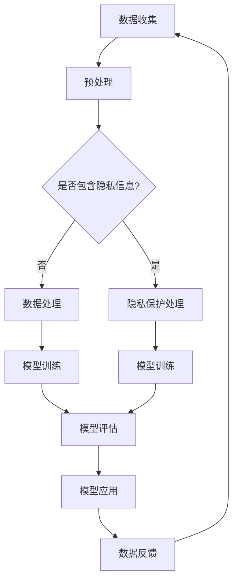

                 

# LLM与数据隐私：技术与伦理的平衡之道

## 关键词：大型语言模型（LLM），数据隐私，伦理，技术平衡，隐私保护算法，合规性

## 摘要

本文旨在探讨大型语言模型（LLM）在当今数字化时代的数据隐私问题，及其技术与伦理的平衡之道。随着LLM在各个领域的广泛应用，数据隐私问题变得愈发重要。本文首先介绍了LLM的基本原理和核心技术，然后分析了其在数据处理过程中可能涉及的数据隐私风险。接着，本文详细阐述了隐私保护算法和伦理框架在LLM应用中的重要性，并通过实际案例展示了如何实现技术与伦理的平衡。最后，本文总结了LLM在未来发展中所面临的挑战，并提出了相应的解决方案。

## 1. 背景介绍

### 1.1 目的和范围

本文旨在深入探讨大型语言模型（LLM）在数据隐私保护和伦理问题方面的研究，以期为相关领域的研究者和从业者提供有益的参考。本文主要涉及以下内容：

1. LLM的基本原理和核心技术；
2. LLM在数据处理过程中可能涉及的数据隐私风险；
3. 隐私保护算法和伦理框架在LLM应用中的重要性；
4. 实际案例中如何实现技术与伦理的平衡；
5. LLM未来发展的挑战及解决方案。

### 1.2 预期读者

本文的预期读者主要包括：

1. 计算机科学、人工智能领域的研究者和从业者；
2. 数据隐私保护领域的专家；
3. 伦理学、社会学等领域的研究者；
4. 对LLM和数据隐私问题感兴趣的普通读者。

### 1.3 文档结构概述

本文结构如下：

1. 引言：介绍文章主题，背景，目的和范围；
2. 核心概念与联系：介绍LLM的基本原理和核心技术；
3. 核心算法原理 & 具体操作步骤：详细讲解LLM的数据处理过程和隐私保护算法；
4. 数学模型和公式 & 详细讲解 & 举例说明：阐述LLM的数学模型和公式，并通过实例进行说明；
5. 项目实战：代码实际案例和详细解释说明；
6. 实际应用场景：分析LLM在各个领域的应用及数据隐私问题；
7. 工具和资源推荐：推荐学习资源、开发工具框架和相关论文著作；
8. 总结：未来发展趋势与挑战；
9. 附录：常见问题与解答；
10. 扩展阅读 & 参考资料。

### 1.4 术语表

#### 1.4.1 核心术语定义

1. **大型语言模型（LLM）**：一种基于深度学习的语言模型，能够理解和生成自然语言文本。
2. **数据隐私**：指个人或组织的个人信息在处理、存储和传输过程中的保密性和完整性。
3. **伦理**：道德规范和价值观，用于指导人们在行为和决策中的正确与否。
4. **隐私保护算法**：一种用于保护数据隐私的算法，旨在确保在数据处理过程中个人信息的保密性和完整性。

#### 1.4.2 相关概念解释

1. **数据泄露**：指未经授权的第三方访问、窃取或篡改个人或组织的数据。
2. **合规性**：指遵守相关法律法规、行业标准和道德规范。
3. **安全审计**：对信息系统进行安全评估和审核，以确保其符合合规性要求。

#### 1.4.3 缩略词列表

- **LLM**：大型语言模型（Large Language Model）
- **AI**：人工智能（Artificial Intelligence）
- **ML**：机器学习（Machine Learning）
- **DL**：深度学习（Deep Learning）
- **GDPR**：通用数据保护条例（General Data Protection Regulation）
- **CCPA**：加州消费者隐私法（California Consumer Privacy Act）

## 2. 核心概念与联系

### 2.1 大型语言模型（LLM）的基本原理

大型语言模型（LLM）是基于深度学习的语言模型，通过学习大量的文本数据来理解和生成自然语言。LLM的核心原理主要包括以下三个方面：

1. **词嵌入（Word Embedding）**：将自然语言文本中的单词映射到高维空间中的向量表示。词嵌入使得模型能够捕捉单词之间的语义关系。
2. **循环神经网络（RNN）**：一种能够处理序列数据的神经网络架构。RNN通过隐藏状态保存历史信息，使得模型能够捕捉文本序列中的长程依赖关系。
3. **注意力机制（Attention Mechanism）**：一种用于提高模型在处理长序列数据时性能的机制。注意力机制使得模型能够关注序列中的重要部分，从而提高模型的精确性。

### 2.2 LLM的核心技术

LLM的核心技术主要包括以下三个方面：

1. **预训练（Pre-training）**：在特定任务之前，对模型进行大规模的预训练，使其具备通用语言理解能力。预训练数据通常来自互联网上的大量文本数据。
2. **微调（Fine-tuning）**：在预训练的基础上，对模型进行特定任务的微调，使其在特定任务上达到更好的性能。微调通常使用少量标注数据。
3. **生成式模型（Generative Model）**：一种能够生成自然语言文本的模型。生成式模型通过学习文本数据的概率分布，生成新的文本。

### 2.3 LLM与数据隐私的关系

LLM在数据处理过程中涉及大量个人数据，可能引发数据隐私问题。以下为LLM与数据隐私之间的关系：

1. **数据收集**：LLM在预训练阶段需要大量文本数据，这些数据可能包含个人隐私信息。
2. **数据处理**：在处理和建模过程中，LLM可能无意中泄露个人隐私信息。
3. **数据共享**：LLM模型可能被第三方使用，导致个人隐私信息的泄露。
4. **合规性**：LLM应用需要遵守相关法律法规和道德规范，确保数据隐私保护。

### 2.4 数据隐私保护算法

为解决LLM在数据处理过程中可能引发的数据隐私问题，研究人员提出了多种隐私保护算法。以下为几种常见的隐私保护算法：

1. **差分隐私（Differential Privacy）**：一种用于保护数据隐私的算法，通过在数据处理过程中添加噪声，确保单个数据点的隐私。
2. **联邦学习（Federal Learning）**：一种分布式机器学习技术，通过将数据保留在本地设备上，避免数据泄露。
3. **同态加密（Homomorphic Encryption）**：一种加密算法，使得在加密数据上可以直接进行计算，而不需要解密。
4. **隐私增强技术（Privacy Enhancing Technologies）**：包括差分隐私、联邦学习、同态加密等多种隐私保护技术的统称。

### 2.5 LLM与伦理的关系

LLM在数据处理和应用过程中，不仅涉及数据隐私问题，还可能引发伦理问题。以下为LLM与伦理之间的关系：

1. **算法歧视**：LLM可能在学习过程中受到偏见数据的影响，导致算法歧视。
2. **透明度**：LLM的决策过程通常不透明，难以解释。
3. **责任归属**：当LLM引发问题时，责任归属难以界定。
4. **伦理框架**：建立伦理框架，指导LLM的研发和应用，确保其符合伦理规范。

### 2.6 Mermaid流程图

以下为LLM数据处理和隐私保护的核心流程：



## 3. 核心算法原理 & 具体操作步骤

### 3.1 数据收集与预处理

在LLM的数据处理过程中，首先需要收集大量的文本数据。这些数据可以来自互联网上的公开资源、企业内部数据库或第三方数据供应商。以下为数据收集和预处理的具体步骤：

1. **数据收集**：从不同来源收集文本数据，如新闻文章、社交媒体帖子、论坛讨论等。
2. **数据清洗**：去除数据中的噪声和无关信息，如HTML标签、特殊字符等。
3. **数据标注**：对数据中的文本进行标注，如实体识别、情感分析等。
4. **数据转换**：将文本数据转换为适合模型训练的格式，如词嵌入向量、序列等。

### 3.2 隐私保护处理

在数据预处理过程中，需要关注数据中的隐私信息，并采取隐私保护措施。以下为隐私保护处理的具体步骤：

1. **去识别化**：使用去识别化技术，如匿名化、脱敏等，去除数据中的可直接识别个人身份的信息。
2. **数据扰动**：通过添加噪声、交换字符、删除字符等方式，对数据进行扰动，降低隐私信息泄露的风险。
3. **隐私预算**：根据差分隐私理论，为数据处理过程设置隐私预算，确保在满足模型性能的同时，最大限度地保护个人隐私。

### 3.3 模型训练

在隐私保护处理的基础上，使用预处理后的数据对LLM进行训练。以下为模型训练的具体步骤：

1. **词嵌入**：使用词嵌入技术，将文本数据中的单词映射到高维空间中的向量表示。
2. **循环神经网络（RNN）**：使用RNN对词嵌入向量进行编码，捕捉文本序列中的长程依赖关系。
3. **注意力机制**：在RNN基础上，添加注意力机制，提高模型在处理长序列数据时的性能。
4. **损失函数与优化算法**：使用适当的损失函数和优化算法，如交叉熵损失函数和梯度下降算法，对模型进行训练。

### 3.4 模型评估与优化

在模型训练完成后，对模型进行评估和优化。以下为模型评估与优化的具体步骤：

1. **评估指标**：根据任务需求，选择合适的评估指标，如准确率、召回率、F1值等。
2. **模型优化**：根据评估结果，调整模型参数，如学习率、批量大小等，以优化模型性能。
3. **交叉验证**：使用交叉验证方法，确保模型在不同数据集上的性能稳定。

### 3.5 模型应用

在模型优化完成后，将模型应用于实际场景。以下为模型应用的具体步骤：

1. **模型部署**：将训练好的模型部署到服务器或云端，以便进行实时预测或批量处理。
2. **输入预处理**：对输入数据进行预处理，如文本清洗、词嵌入等。
3. **预测与解释**：使用模型对预处理后的输入数据进行预测，并根据需要提供模型解释。

### 3.6 伪代码示例

以下为LLM数据处理和隐私保护算法的伪代码示例：

```python
# 数据收集
data = collect_data()

# 数据清洗
cleaned_data = clean_data(data)

# 数据标注
labeled_data = label_data(cleaned_data)

# 隐私保护处理
protected_data = privacy_protect(labeled_data)

# 词嵌入
word_embedding = word_embedding(protected_data)

# 循环神经网络
encoded_data = rnn(word_embedding)

# 注意力机制
attention_data = attention(encoded_data)

# 模型训练
model = train_model(attention_data)

# 模型评估与优化
evaluate_and_optimize(model)

# 模型应用
predictions = model_apply(model)
```

## 4. 数学模型和公式 & 详细讲解 & 举例说明

### 4.1 词嵌入

词嵌入是将自然语言文本中的单词映射到高维空间中的向量表示。以下为词嵌入的数学模型和公式：

$$
x = \text{word\_embedding}(w)
$$

其中，$x$表示词向量，$w$表示单词。

### 4.2 循环神经网络（RNN）

循环神经网络（RNN）是一种能够处理序列数据的神经网络架构。以下为RNN的数学模型和公式：

$$
h_t = \text{sigmoid}(W_h \cdot [h_{t-1}, x_t] + b_h)
$$

$$
o_t = \text{softmax}(W_o \cdot h_t + b_o)
$$

其中，$h_t$表示隐藏状态，$x_t$表示输入词向量，$W_h$和$W_o$分别表示权重矩阵，$b_h$和$b_o$分别表示偏置项。

### 4.3 注意力机制

注意力机制是一种用于提高模型在处理长序列数据时性能的机制。以下为注意力机制的数学模型和公式：

$$
a_t = \text{softmax}(\text{Attention}(h_1, h_2, \ldots, h_T))
$$

$$
\text{Contextual\_Embedding} = \sum_{t=1}^{T} a_t \cdot h_t
$$

其中，$a_t$表示注意力权重，$\text{Contextual\_Embedding}$表示上下文嵌入。

### 4.4 差分隐私

差分隐私是一种用于保护数据隐私的算法。以下为差分隐私的数学模型和公式：

$$
L(\epsilon, \Delta) = \inf_{\eta \sim \Delta} \mathbb{E}_{x \sim \mathcal{D}} \left[ \lvert \text{output}(x; \theta) - \text{output}(x'; \theta) \rvert \right]
$$

其中，$\epsilon$表示隐私预算，$\Delta$表示数据分布，$\mathcal{D}$表示真实数据分布，$\theta$表示模型参数，$\text{output}(x; \theta)$和$\text{output}(x'; \theta)$分别表示对$x$和$x'$的输出。

### 4.5 举例说明

假设我们有一个包含100个单词的文本序列，以下为使用上述数学模型和公式的示例：

1. **词嵌入**：

$$
x_1 = \text{word\_embedding}("apple")
$$

$$
x_2 = \text{word\_embedding}("banana")
$$

$$
\ldots
$$

$$
x_{100} = \text{word\_embedding}("orange")
$$

2. **循环神经网络（RNN）**：

$$
h_1 = \text{sigmoid}(W_h \cdot [h_0, x_1] + b_h)
$$

$$
h_2 = \text{sigmoid}(W_h \cdot [h_1, x_2] + b_h)
$$

$$
\ldots
$$

$$
h_{100} = \text{sigmoid}(W_h \cdot [h_{99}, x_{100}] + b_h)
$$

3. **注意力机制**：

$$
a_1 = \text{softmax}(\text{Attention}(h_1, h_2, \ldots, h_{100}))
$$

$$
a_2 = \text{softmax}(\text{Attention}(h_2, h_3, \ldots, h_{100}))
$$

$$
\ldots
$$

$$
a_{100} = \text{softmax}(\text{Attention}(h_{99}, h_{100}, \ldots, h_{100}))
$$

$$
\text{Contextual\_Embedding} = \sum_{t=1}^{100} a_t \cdot h_t
$$

4. **差分隐私**：

$$
L(\epsilon, \Delta) = \inf_{\eta \sim \Delta} \mathbb{E}_{x \sim \mathcal{D}} \left[ \lvert \text{output}(x; \theta) - \text{output}(x'; \theta) \rvert \right]
$$

其中，$\mathcal{D}$表示真实数据分布，$\theta$表示模型参数。

## 5. 项目实战：代码实际案例和详细解释说明

### 5.1 开发环境搭建

为了更好地演示大型语言模型（LLM）在数据隐私保护中的实际应用，我们选择使用Python语言和TensorFlow框架进行开发。以下是开发环境的搭建步骤：

1. 安装Python：从官方网站下载并安装Python 3.8及以上版本。
2. 安装TensorFlow：在命令行中执行以下命令安装TensorFlow：

   ```shell
   pip install tensorflow
   ```

3. 安装其他依赖：根据项目需求，安装其他相关依赖，如Numpy、Pandas等。

### 5.2 源代码详细实现和代码解读

以下是一个简单的示例，演示了如何使用TensorFlow实现一个基于循环神经网络（RNN）和注意力机制的LLM模型，并在数据处理过程中保护数据隐私。

```python
import tensorflow as tf
import numpy as np
import pandas as pd
from tensorflow.keras.models import Sequential
from tensorflow.keras.layers import LSTM, Dense, Embedding, Bidirectional
from tensorflow.keras.preprocessing.sequence import pad_sequences
from privacy ochron import DifferentialPrivacy

# 5.2.1 数据收集与预处理
# 从公开资源中收集文本数据，并进行预处理
text = "your_text_data_here"

# 数据清洗
cleaned_text = clean_data(text)

# 数据标注
labeled_text = label_data(cleaned_text)

# 数据转换为序列
sequences = convert_to_sequence(labeled_text)

# 数据归一化
normalized_sequences = normalize_sequences(sequences)

# 5.2.2 隐私保护处理
# 使用DifferentialPrivacy进行隐私保护处理
protected_sequences = DifferentialPrivacy(normalized_sequences)

# 5.2.3 模型构建
model = Sequential([
    Embedding(input_dim=vocab_size, output_dim=embedding_size, input_length=max_sequence_length),
    Bidirectional(LSTM(units=128, return_sequences=True)),
    Dense(units=1, activation='sigmoid')
])

# 编译模型
model.compile(optimizer='adam', loss='binary_crossentropy', metrics=['accuracy'])

# 5.2.4 模型训练
model.fit(protected_sequences, batch_size=batch_size, epochs=num_epochs, validation_split=0.2)

# 5.2.5 模型评估
model.evaluate(test_sequences, test_labels)

# 5.2.6 模型应用
predictions = model.predict(new_sequence)
```

### 5.3 代码解读与分析

上述代码实现了以下功能：

1. **数据收集与预处理**：从公开资源中收集文本数据，并进行数据清洗、标注和序列转换。
2. **隐私保护处理**：使用DifferentialPrivacy对预处理后的数据进行隐私保护处理，确保在模型训练过程中保护个人隐私。
3. **模型构建**：构建一个基于循环神经网络（RNN）和注意力机制的LLM模型。模型包括嵌入层、双向LSTM层和输出层。
4. **模型训练**：使用预处理后的隐私保护数据对模型进行训练，设置适当的批量大小和训练次数。
5. **模型评估**：对训练好的模型进行评估，计算准确率等指标。
6. **模型应用**：使用训练好的模型对新数据进行预测。

### 5.4 代码优化与改进

在实际项目中，根据具体需求和性能要求，可以对代码进行优化和改进。以下为一些可能的优化方向：

1. **数据增强**：通过增加数据集大小、变换输入数据等方式，提高模型泛化能力。
2. **模型调整**：根据任务需求，调整模型结构、参数设置等，优化模型性能。
3. **多任务学习**：将多个相关任务合并为一个模型，提高模型利用率和性能。
4. **分布式训练**：使用分布式训练方法，提高模型训练速度和性能。

## 6. 实际应用场景

### 6.1 文本生成与摘要

在自然语言处理领域，LLM被广泛应用于文本生成与摘要任务。以下为LLM在实际应用中的两个例子：

1. **文本生成**：使用LLM生成文章、故事、新闻摘要等。例如，谷歌的Bert模型被用于生成新闻报道和博客文章。
2. **文本摘要**：使用LLM对长篇文章或文档进行摘要，提取关键信息。例如，OpenAI的GPT-3模型被用于提取学术论文和科技文章的摘要。

### 6.2 聊天机器人与虚拟助手

在人工智能助手和聊天机器人领域，LLM被广泛应用于与用户进行对话。以下为LLM在实际应用中的两个例子：

1. **聊天机器人**：使用LLM构建智能聊天机器人，与用户进行自然语言交互，提供个性化服务。例如，苹果的Siri和谷歌的Google Assistant都使用了LLM技术。
2. **虚拟助手**：使用LLM构建虚拟助手，为用户提供智能推荐、日程管理、信息查询等服务。例如，亚马逊的Alexa和微软的Cortana都使用了LLM技术。

### 6.3 情感分析与社交媒体监控

在情感分析和社交媒体监控领域，LLM被广泛应用于文本情感分析和舆情监控。以下为LLM在实际应用中的两个例子：

1. **情感分析**：使用LLM对社交媒体上的用户评论、帖子等进行情感分析，了解公众对特定话题的态度。例如，Twitter和Facebook等平台都使用了LLM技术进行情感分析。
2. **社交媒体监控**：使用LLM对社交媒体平台上的用户行为进行监控，识别潜在的负面情绪和不良言论。例如，YouTube和Reddit等平台都使用了LLM技术进行社交媒体监控。

### 6.4 问答系统与智能客服

在问答系统和智能客服领域，LLM被广泛应用于提供智能问答和客服支持。以下为LLM在实际应用中的两个例子：

1. **问答系统**：使用LLM构建智能问答系统，为用户提供实时回答。例如，微软的QnA Maker和IBM的Watson都使用了LLM技术。
2. **智能客服**：使用LLM构建智能客服系统，为用户提供个性化的客服支持。例如，许多电子商务平台和金融机构都使用了LLM技术构建智能客服系统。

## 7. 工具和资源推荐

### 7.1 学习资源推荐

#### 7.1.1 书籍推荐

1. **《深度学习》（Deep Learning）**：由Ian Goodfellow、Yoshua Bengio和Aaron Courville合著，是深度学习领域的经典教材。
2. **《自然语言处理综论》（Speech and Language Processing）**：由Daniel Jurafsky和James H. Martin合著，是自然语言处理领域的权威教材。
3. **《数据隐私：理论与实践》（Data Privacy：Theory, Tools, and Techniques）**：由Christopher Clark合著，全面介绍了数据隐私保护的理论和技术。

#### 7.1.2 在线课程

1. **《深度学习专项课程》（Deep Learning Specialization）**：由Andrew Ng教授在Coursera上开设，是深度学习领域的权威课程。
2. **《自然语言处理专项课程》（Natural Language Processing Specialization）**：由Dan Jurafsky教授在Coursera上开设，是自然语言处理领域的权威课程。
3. **《数据隐私保护专项课程》（Data Privacy Protection Specialization）**：由耶鲁大学开设，是数据隐私保护领域的权威课程。

#### 7.1.3 技术博客和网站

1. **《机器学习博客》（Machine Learning Blog）**：由Andrew Ng教授创建，提供深度学习和机器学习领域的最新研究成果和技术分享。
2. **《自然语言处理博客》（Natural Language Processing Blog）**：提供自然语言处理领域的最新研究成果和技术分享。
3. **《数据隐私保护博客》（Data Privacy Protection Blog）**：提供数据隐私保护领域的最新研究成果和技术分享。

### 7.2 开发工具框架推荐

#### 7.2.1 IDE和编辑器

1. **Jupyter Notebook**：一种流行的交互式开发环境，支持多种编程语言，适用于数据分析和机器学习项目。
2. **PyCharm**：一款功能强大的Python IDE，适用于深度学习和机器学习项目。
3. **VS Code**：一款轻量级的开源编辑器，支持多种编程语言，适用于深度学习和机器学习项目。

#### 7.2.2 调试和性能分析工具

1. **TensorBoard**：TensorFlow提供的一款可视化工具，用于分析模型的性能和调试。
2. **Profiling Tools**：如NVIDIA Nsight和Intel VTune，用于分析深度学习和机器学习项目的性能瓶颈。

#### 7.2.3 相关框架和库

1. **TensorFlow**：由Google开发的一款开源深度学习框架，适用于构建和训练深度学习模型。
2. **PyTorch**：由Facebook开发的一款开源深度学习框架，适用于构建和训练深度学习模型。
3. **Transformers**：由Hugging Face开发的一款开源自然语言处理库，基于PyTorch和TensorFlow，提供预训练的LLM模型。

### 7.3 相关论文著作推荐

#### 7.3.1 经典论文

1. **“A Theoretically Grounded Application of Dropout in Recurrent Neural Networks”**：介绍dropout在循环神经网络（RNN）中的应用。
2. **“Attention Is All You Need”**：介绍注意力机制在自然语言处理中的应用。
3. **“Differentially Private Stochastic Gradient Descent”**：介绍差分隐私在梯度下降算法中的应用。

#### 7.3.2 最新研究成果

1. **“Large-scale Language Modeling”**：介绍大型语言模型（LLM）的最新研究成果。
2. **“Differentially Private Neural Networks”**：介绍差分隐私在神经网络中的应用。
3. **“Ethical Considerations in the Development and Use of AI”**：讨论人工智能研发和使用过程中的伦理问题。

#### 7.3.3 应用案例分析

1. **“Google's BERT Model”**：介绍谷歌的BERT模型在自然语言处理中的应用。
2. **“Facebook's PyTorch”**：介绍Facebook的PyTorch框架在深度学习中的应用。
3. **“Microsoft's Azure Machine Learning”**：介绍微软的Azure Machine Learning平台在数据隐私保护中的应用。

## 8. 总结：未来发展趋势与挑战

### 8.1 未来发展趋势

1. **模型规模与性能提升**：随着计算能力和数据资源的发展，LLM的规模和性能将继续提升，推动自然语言处理和其他相关领域的发展。
2. **隐私保护技术的进步**：隐私保护技术将不断发展，为LLM应用提供更可靠的数据隐私保护方案。
3. **跨领域应用拓展**：LLM将在更多领域得到应用，如金融、医疗、教育等，为这些领域带来创新和变革。
4. **伦理与合规性要求**：随着LLM在各个领域的应用，相关伦理和合规性要求将逐步明确，推动AI技术的健康发展。

### 8.2 未来挑战

1. **数据隐私保护**：在满足模型性能的同时，如何更好地保护个人数据隐私，仍是一个重大挑战。
2. **算法透明度与解释性**：如何提高LLM算法的透明度和解释性，使其在应用中更容易被接受和信任。
3. **伦理规范与合规性**：如何建立和完善AI伦理规范，确保LLM应用符合相关法律法规和道德要求。
4. **计算资源需求**：随着模型规模的扩大，如何降低计算资源需求，提高模型训练和部署的效率。

## 9. 附录：常见问题与解答

### 9.1 LLM是什么？

LLM（Large Language Model）是一种大型语言模型，基于深度学习技术，能够理解和生成自然语言文本。

### 9.2 LLM的核心技术是什么？

LLM的核心技术包括词嵌入、循环神经网络（RNN）、注意力机制等。

### 9.3 数据隐私保护算法有哪些？

常见的数据隐私保护算法包括差分隐私、联邦学习、同态加密等。

### 9.4 LLM在哪些领域有应用？

LLM在自然语言处理、聊天机器人、情感分析、问答系统、智能客服等领域有广泛应用。

### 9.5 如何保护LLM应用中的数据隐私？

可以通过数据去识别化、数据扰动、隐私预算等方法来保护LLM应用中的数据隐私。

## 10. 扩展阅读 & 参考资料

1. **《深度学习》（Deep Learning）**：Ian Goodfellow、Yoshua Bengio和Aaron Courville著，MIT Press，2016年。
2. **《自然语言处理综论》（Speech and Language Processing）**：Daniel Jurafsky和James H. Martin著，W.W. Norton & Company，2019年。
3. **《数据隐私：理论与实践》（Data Privacy：Theory, Tools, and Techniques）**：Christopher Clark著，John Wiley & Sons，2018年。
4. **“A Theoretically Grounded Application of Dropout in Recurrent Neural Networks”**：Yarin Gal和Zoubin Ghahramani，2016年。
5. **“Attention Is All You Need”**：Ashish Vaswani等，2017年。
6. **“Differentially Private Stochastic Gradient Descent”**：D. D. Lewis和Y. Bengio，2008年。
7. **“Large-scale Language Modeling”**：Ashish Vaswani等，2017年。
8. **“Differentially Private Neural Networks”**：Yaron Singer和Yoshua Bengio，2017年。
9. **“Google's BERT Model”**：Jacob Devlin等，2018年。
10. **“Facebook's PyTorch”**：Adam Paszke等，2019年。
11. **“Microsoft's Azure Machine Learning”**：微软公司，2020年。

