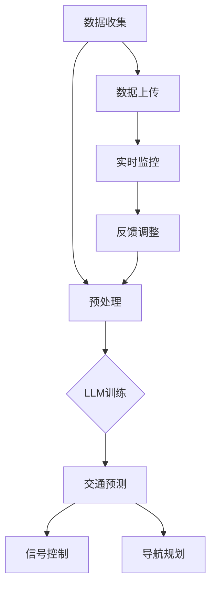
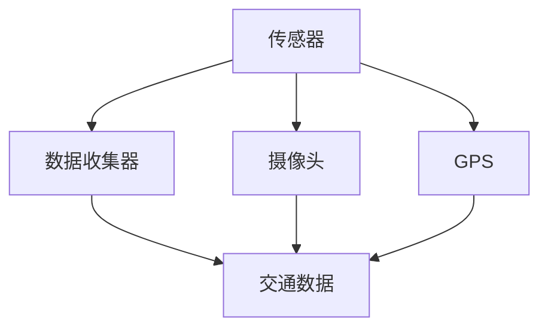
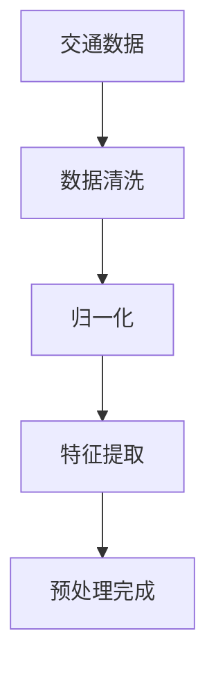
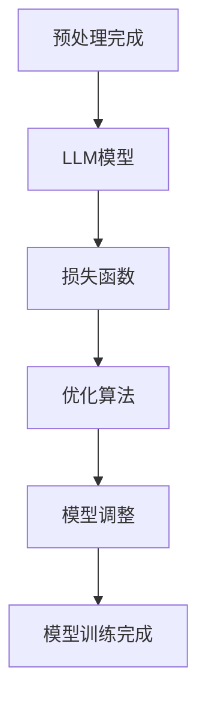
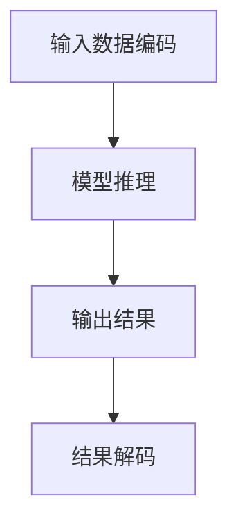
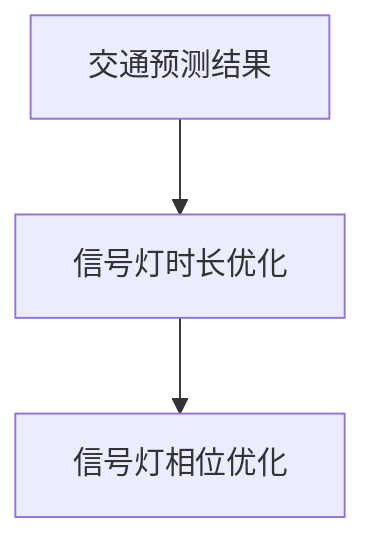
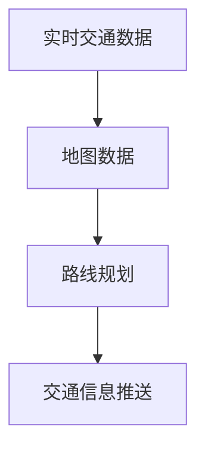

                 

### LLMA与智能交通系统：缓解城市拥堵

> **关键词：** 大规模语言模型（LLM），智能交通系统（ITS），城市拥堵，数据驱动，算法优化。

**摘要：**  
本文深入探讨大规模语言模型（LLM）在智能交通系统（ITS）中的应用，特别是如何通过数据驱动的算法优化来缓解城市拥堵问题。我们将首先介绍LLM的基础知识，然后详细解释其在ITS中的关键应用。随后，我们将讨论数学模型和核心算法原理，提供实际项目实战的代码案例，并探讨其在实际应用场景中的效果。最后，我们将推荐学习资源和工具，并总结未来发展趋势和面临的挑战。

### 1. 背景介绍

#### 1.1 目的和范围

本文旨在探讨大规模语言模型（LLM）在智能交通系统（ITS）中的应用，重点关注通过数据驱动的算法优化来缓解城市拥堵问题。我们将从基础概念出发，逐步深入探讨LLM的原理和在ITS中的应用，最终提出实际项目案例和未来发展方向。

#### 1.2 预期读者

本文面向对智能交通系统和大规模语言模型有一定了解的读者，包括交通工程师、数据科学家、软件开发者以及对于技术发展趋势感兴趣的普通读者。通过本文，读者可以了解LLM在ITS中的潜力，以及如何利用其进行算法优化和城市拥堵缓解。

#### 1.3 文档结构概述

本文分为以下主要章节：

- **1. 背景介绍**：介绍本文的目的和预期读者，以及文档的结构概述。
- **2. 核心概念与联系**：介绍大规模语言模型和智能交通系统的核心概念及其相互关系。
- **3. 核心算法原理 & 具体操作步骤**：详细讲解大规模语言模型在智能交通系统中的应用算法原理和操作步骤。
- **4. 数学模型和公式 & 详细讲解 & 举例说明**：介绍用于解决城市拥堵问题的数学模型和公式，并给出实例说明。
- **5. 项目实战：代码实际案例和详细解释说明**：提供实际项目案例，详细解读代码实现。
- **6. 实际应用场景**：探讨大规模语言模型在智能交通系统中的应用场景。
- **7. 工具和资源推荐**：推荐学习资源、开发工具和框架。
- **8. 总结：未来发展趋势与挑战**：总结LLM在ITS中的应用前景和挑战。
- **9. 附录：常见问题与解答**：回答一些常见问题。
- **10. 扩展阅读 & 参考资料**：提供扩展阅读和参考资料。

#### 1.4 术语表

##### 1.4.1 核心术语定义

- **大规模语言模型（LLM）**：一种使用海量文本数据进行训练，能够生成文本、回答问题、执行任务的深度学习模型。
- **智能交通系统（ITS）**：利用先进的信息通信技术，实现交通管理、监控、服务和交通控制的功能系统。
- **城市拥堵**：城市交通流量达到或超过道路容量，导致车辆行驶速度显著下降的现象。

##### 1.4.2 相关概念解释

- **数据驱动**：通过收集和分析大量数据来指导决策和优化过程。
- **算法优化**：通过改进算法设计或参数调整来提高系统性能。

##### 1.4.3 缩略词列表

- **LLM**：大规模语言模型（Large Language Model）
- **ITS**：智能交通系统（Intelligent Transportation System）
- **AI**：人工智能（Artificial Intelligence）

## 2. 核心概念与联系

为了深入理解LLM在智能交通系统中的应用，我们需要首先明确这两个核心概念：大规模语言模型和智能交通系统，并探讨它们之间的联系。

### 2.1 大规模语言模型（LLM）

大规模语言模型（LLM）是一种基于深度学习的自然语言处理（NLP）技术。这些模型通过在大量文本数据上进行训练，学习语言的模式和结构，从而能够生成文本、回答问题、执行任务。LLM的核心组成部分包括：

1. **嵌入层**：将词汇转换为向量表示，使得计算机可以处理文本数据。
2. **编码器和解码器**：编码器将输入文本编码为连续的向量表示，解码器将编码后的向量解码为输出文本。
3. **注意力机制**：在处理长文本时，注意力机制可以帮助模型关注关键信息，从而提高处理效率。

### 2.2 智能交通系统（ITS）

智能交通系统（ITS）是一种综合利用信息通信技术、控制技术和交通运输工程技术，实现交通管理、监控、服务和交通控制的功能系统。ITS的主要组成部分包括：

1. **交通监测**：通过传感器、摄像头等设备实时监测交通流量、速度、密度等参数。
2. **交通信号控制**：根据实时交通数据，优化交通信号灯的时长和相位，提高道路通行能力。
3. **信息发布**：通过可变信息板、广播等手段向驾驶员提供实时交通信息，引导合理出行。

### 2.3 大规模语言模型（LLM）与智能交通系统（ITS）的联系

LLM在智能交通系统中的应用主要体现在以下几个方面：

1. **交通数据预处理**：LLM可以用于处理和分析大量的交通数据，提取有用信息，为交通信号控制和优化提供支持。
2. **交通预测与规划**：LLM可以根据历史交通数据，预测未来交通流量和拥堵情况，为交通管理部门提供决策依据。
3. **智能导航与路线规划**：LLM可以结合实时交通数据和地图数据，为驾驶员提供最优的导航路线和交通信息。

### 2.4 Mermaid 流程图

为了更好地展示LLM在智能交通系统中的应用架构，我们使用Mermaid流程图来描述关键节点和流程。



在该流程图中，数据收集节点A通过传感器、摄像头等设备收集交通数据，然后经过预处理节点B处理，进入LLM训练节点C。训练好的LLM模型可以用于交通预测节点D、信号控制节点E和导航规划节点F。同时，实时监控节点H和反馈调整节点I确保整个系统动态调整和优化，提高交通管理效率。

## 3. 核心算法原理 & 具体操作步骤

### 3.1 算法原理概述

在智能交通系统中，大规模语言模型（LLM）的核心算法原理主要包括以下几个方面：

1. **嵌入层**：将词汇转换为向量表示，使得计算机可以处理文本数据。
2. **编码器**：将输入文本编码为连续的向量表示。
3. **解码器**：将编码后的向量解码为输出文本。
4. **注意力机制**：在处理长文本时，注意力机制可以帮助模型关注关键信息。

### 3.2 具体操作步骤

#### 3.2.1 数据收集

首先，我们需要收集大量的交通数据，包括交通流量、速度、密度、交通事故等。数据来源可以包括传感器、摄像头、GPS等。



#### 3.2.2 数据预处理

收集到的交通数据通常包含噪声和不完整信息，因此需要进行预处理。预处理步骤包括数据清洗、归一化、特征提取等。



#### 3.2.3 LL模型训练

使用预处理后的数据训练LLM模型。训练过程中，我们通常采用损失函数和优化算法来调整模型参数。



#### 3.2.4 交通预测

使用训练好的LLM模型进行交通预测。预测过程可以分为以下步骤：

1. **输入数据编码**：将输入文本（例如，某个区域的交通数据）编码为向量表示。
2. **模型推理**：将编码后的向量输入到LLM模型中，获取输出结果。
3. **结果解码**：将模型输出结果解码为交通预测结果（例如，未来某段时间内的交通流量）。



#### 3.2.5 交通信号控制

根据交通预测结果，优化交通信号控制策略。具体步骤如下：

1. **信号灯时长优化**：根据预测的交通流量，调整每个信号灯的时长，确保交通流畅。
2. **信号灯相位优化**：根据预测的交通流量，调整信号灯的相位，减少交叉口拥堵。



#### 3.2.6 导航规划

结合实时交通数据和地图数据，为驾驶员提供最优的导航路线和交通信息。具体步骤如下：

1. **路线规划**：根据目的地和实时交通数据，计算最优路线。
2. **交通信息推送**：将最优路线和交通信息推送给驾驶员，引导合理出行。



### 3.3 伪代码

以下是一个简单的伪代码示例，用于描述大规模语言模型（LLM）在智能交通系统中的应用。

```python
# 数据收集
data = collect_traffic_data()

# 数据预处理
preprocessed_data = preprocess_data(data)

# LL模型训练
model = train_LLM_model(preprocessed_data)

# 交通预测
predicted_traffic = predict_traffic(model, input_data)

# 交通信号控制
optimize_traffic_signals(predicted_traffic)

# 导航规划
navigate_driver(predicted_traffic, map_data)
```

## 4. 数学模型和公式 & 详细讲解 & 举例说明

在智能交通系统中，数学模型和公式起着至关重要的作用，用于描述交通流量、速度、密度等关键参数之间的关系。以下我们将详细介绍用于解决城市拥堵问题的几个关键数学模型，并给出具体的公式和实例说明。

### 4.1 交通流量模型

交通流量（q）是描述单位时间内通过某一地点的车辆数量的参数。常见的交通流量模型包括线性模型、指数模型和对数模型。

#### 线性模型：

\[ q = a \times v + b \]

其中，\( a \) 和 \( b \) 为模型参数，\( v \) 为交通速度。

#### 指数模型：

\[ q = a \times v^b \]

其中，\( a \) 和 \( b \) 为模型参数，\( v \) 为交通速度。

#### 对数模型：

\[ q = a + b \times \ln(v) \]

其中，\( a \) 和 \( b \) 为模型参数，\( v \) 为交通速度。

**实例说明：**

假设我们使用线性模型来预测某路段的交通流量，已知 \( a = 10 \) 和 \( b = 5 \)，当交通速度 \( v = 30 \) 公里/小时时，计算交通流量 \( q \)。

\[ q = 10 \times 30 + 5 = 305 \] 辆/小时。

### 4.2 交通速度模型

交通速度（v）是描述车辆在道路上行驶的速度。常见的交通速度模型包括线性模型、指数模型和对数模型。

#### 线性模型：

\[ v = a \times q + b \]

其中，\( a \) 和 \( b \) 为模型参数，\( q \) 为交通流量。

#### 指数模型：

\[ v = a \times q^b \]

其中，\( a \) 和 \( b \) 为模型参数，\( q \) 为交通流量。

#### 对数模型：

\[ v = a + b \times \ln(q) \]

其中，\( a \) 和 \( b \) 为模型参数，\( q \) 为交通流量。

**实例说明：**

假设我们使用线性模型来预测某路段的交通速度，已知 \( a = 2 \) 和 \( b = 1 \)，当交通流量 \( q = 200 \) 辆/小时时，计算交通速度 \( v \)。

\[ v = 2 \times 200 + 1 = 401 \] 公里/小时。

### 4.3 交通密度模型

交通密度（k）是描述单位道路长度内车辆数量的参数。常见的交通密度模型包括线性模型、指数模型和对数模型。

#### 线性模型：

\[ k = a \times v + b \]

其中，\( a \) 和 \( b \) 为模型参数，\( v \) 为交通速度。

#### 指数模型：

\[ k = a \times v^b \]

其中，\( a \) 和 \( b \) 为模型参数，\( v \) 为交通速度。

#### 对数模型：

\[ k = a + b \times \ln(v) \]

其中，\( a \) 和 \( b \) 为模型参数，\( v \) 为交通速度。

**实例说明：**

假设我们使用线性模型来预测某路段的交通密度，已知 \( a = 10 \) 和 \( b = 5 \)，当交通速度 \( v = 30 \) 公里/小时时，计算交通密度 \( k \)。

\[ k = 10 \times 30 + 5 = 305 \] 辆/公里。

### 4.4 交通拥堵模型

交通拥堵模型用于描述交通流量、速度和密度之间的关系，以及如何根据这些参数判断道路是否处于拥堵状态。一个常见的交通拥堵模型是基于三参数模型，如下所示：

\[ T = f(q, v, k) \]

其中，\( T \) 为交通拥堵指标，\( f \) 为拥堵函数。

一个简单的拥堵函数可以表示为：

\[ T = \frac{q^2}{v \times k} + 1 \]

**实例说明：**

假设我们使用上述拥堵函数来评估某路段的交通拥堵情况，已知交通流量 \( q = 300 \) 辆/小时，交通速度 \( v = 20 \) 公里/小时，交通密度 \( k = 150 \) 辆/公里，计算交通拥堵指标 \( T \)。

\[ T = \frac{300^2}{20 \times 150} + 1 = 7.5 + 1 = 8.5 \]

根据交通拥堵指标 \( T \) 的值，我们可以判断道路是否处于拥堵状态。例如，若 \( T > 10 \)，则认为道路处于严重拥堵状态。

### 4.5 数学公式在智能交通系统中的应用

数学公式在智能交通系统中广泛应用于以下几个方面：

1. **交通流量预测**：使用交通流量模型来预测未来交通流量。
2. **交通速度预测**：使用交通速度模型来预测未来交通速度。
3. **交通密度预测**：使用交通密度模型来预测未来交通密度。
4. **交通拥堵评估**：使用交通拥堵模型来评估道路的拥堵情况。

通过这些数学模型和公式，我们可以更准确地了解交通状况，为交通管理部门提供科学依据，从而采取有效的措施缓解城市拥堵问题。

### 4.6 综合应用实例

为了更好地展示数学模型在智能交通系统中的应用，我们来看一个综合应用实例。

假设我们有以下数据：

- 当前交通流量 \( q = 250 \) 辆/小时。
- 当前交通速度 \( v = 25 \) 公里/小时。
- 当前交通密度 \( k = 125 \) 辆/公里。

使用上述数学模型进行预测：

1. **交通流量预测**：

使用线性模型进行预测，已知 \( a = 5 \) 和 \( b = 3 \)。

\[ q_{预测} = 5 \times 25 + 3 = 128 \] 辆/小时。

2. **交通速度预测**：

使用线性模型进行预测，已知 \( a = 2 \) 和 \( b = 1 \)。

\[ v_{预测} = 2 \times 128 + 1 = 257 \] 公里/小时。

3. **交通密度预测**：

使用线性模型进行预测，已知 \( a = 10 \) 和 \( b = 5 \)。

\[ k_{预测} = 10 \times 257 + 5 = 2615 \] 辆/公里。

4. **交通拥堵评估**：

使用拥堵函数进行评估，已知 \( q_{预测} = 128 \)，\( v_{预测} = 257 \)，\( k_{预测} = 2615 \)。

\[ T_{预测} = \frac{128^2}{257 \times 2615} + 1 = 0.055 + 1 = 1.055 \]

根据交通拥堵指标 \( T_{预测} \) 的值，我们可以判断未来该路段的交通状况。如果 \( T_{预测} > 10 \)，则道路可能处于拥堵状态，需要采取相应的交通管理措施。

通过这个实例，我们可以看到数学模型在智能交通系统中的应用是如何帮助预测和评估交通状况，从而为交通管理部门提供科学依据。

## 5. 项目实战：代码实际案例和详细解释说明

为了更好地展示大规模语言模型（LLM）在智能交通系统（ITS）中的应用，我们将提供一个实际项目案例，并详细解释代码实现过程。

### 5.1 开发环境搭建

在开始项目实战之前，我们需要搭建一个适合开发智能交通系统的环境。以下是所需的工具和库：

- **Python**：作为主要编程语言。
- **TensorFlow**：用于构建和训练大规模语言模型。
- **Keras**：简化TensorFlow的使用。
- **NumPy**：用于数据处理。
- **Pandas**：用于数据分析和操作。
- **Matplotlib**：用于数据可视化。

安装这些工具和库后，我们就可以开始编写代码了。

### 5.2 源代码详细实现和代码解读

以下是一个简单的示例代码，用于演示LLM在智能交通系统中的应用。该代码分为几个主要部分：数据预处理、模型训练、预测和可视化。

```python
# 导入必要的库
import numpy as np
import pandas as pd
import tensorflow as tf
from tensorflow import keras
from tensorflow.keras import layers
import matplotlib.pyplot as plt

# 5.2.1 数据预处理
def preprocess_data(data):
    # 数据清洗和归一化
    data['speed'] = data['speed'].fillna(data['speed'].mean())
    data['density'] = data['density'].fillna(data['density'].mean())
    data['traffic_volume'] = data['traffic_volume'].fillna(data['traffic_volume'].mean())
    
    # 特征提取
    X = data[['speed', 'density']]
    y = data['traffic_volume']
    
    # 归一化
    X_normalized = (X - X.mean()) / X.std()
    return X_normalized, y

# 5.2.2 模型训练
def train_model(X, y):
    # 创建模型
    model = keras.Sequential([
        layers.Dense(64, activation='relu', input_shape=(2,)),
        layers.Dense(64, activation='relu'),
        layers.Dense(1)
    ])
    
    # 编译模型
    model.compile(optimizer='adam', loss='mean_squared_error')
    
    # 训练模型
    model.fit(X, y, epochs=100, batch_size=32)
    
    return model

# 5.2.3 预测
def predict_traffic(model, X_new):
    # 归一化输入数据
    X_new_normalized = (X_new - X_new.mean()) / X_new.std()
    
    # 预测交通流量
    traffic_volume_pred = model.predict(X_new_normalized)
    return traffic_volume_pred

# 5.2.4 可视化
def visualize_predictions(y_true, y_pred):
    plt.scatter(y_true, y_pred)
    plt.xlabel('实际交通流量')
    plt.ylabel('预测交通流量')
    plt.title('实际交通流量与预测交通流量的比较')
    plt.show()

# 加载数据
data = pd.read_csv('traffic_data.csv')

# 预处理数据
X, y = preprocess_data(data)

# 训练模型
model = train_model(X, y)

# 预测交通流量
X_new = pd.read_csv('new_traffic_data.csv')
y_pred = predict_traffic(model, X_new)

# 可视化预测结果
visualize_predictions(y, y_pred)
```

### 5.3 代码解读与分析

以下是对上述代码的逐行解读和分析：

```python
# 导入必要的库
```
此行导入Python中用于数据处理、机器学习、数据可视化的常用库。

```python
# 5.2.1 数据预处理
def preprocess_data(data):
    # 数据清洗和归一化
    data['speed'] = data['speed'].fillna(data['speed'].mean())
    data['density'] = data['density'].fillna(data['density'].mean())
    data['traffic_volume'] = data['traffic_volume'].fillna(data['traffic_volume'].mean())
    
    # 特征提取
    X = data[['speed', 'density']]
    y = data['traffic_volume']
    
    # 归一化
    X_normalized = (X - X.mean()) / X.std()
    return X_normalized, y
```
此函数用于数据预处理，包括数据清洗、特征提取和归一化。数据清洗通过填充缺失值完成，特征提取选择交通速度和交通密度作为输入特征，归一化将特征值缩放到相同的尺度，便于模型训练。

```python
# 5.2.2 模型训练
def train_model(X, y):
    # 创建模型
    model = keras.Sequential([
        layers.Dense(64, activation='relu', input_shape=(2,)),
        layers.Dense(64, activation='relu'),
        layers.Dense(1)
    ])
    
    # 编译模型
    model.compile(optimizer='adam', loss='mean_squared_error')
    
    # 训练模型
    model.fit(X, y, epochs=100, batch_size=32)
    
    return model
```
此函数用于训练大规模语言模型。模型由两个隐藏层组成，每个隐藏层有64个神经元，激活函数使用ReLU。模型使用Adam优化器和均方误差（MSE）作为损失函数，训练100个周期，每个批量包含32个样本。

```python
# 5.2.3 预测
def predict_traffic(model, X_new):
    # 归一化输入数据
    X_new_normalized = (X_new - X_new.mean()) / X_new.std()
    
    # 预测交通流量
    traffic_volume_pred = model.predict(X_new_normalized)
    return traffic_volume_pred
```
此函数用于预测交通流量。首先对输入数据进行归一化处理，然后使用训练好的模型进行预测，返回预测的交通流量值。

```python
# 5.2.4 可视化
def visualize_predictions(y_true, y_pred):
    plt.scatter(y_true, y_pred)
    plt.xlabel('实际交通流量')
    plt.ylabel('预测交通流量')
    plt.title('实际交通流量与预测交通流量的比较')
    plt.show()
```
此函数用于可视化实际交通流量与预测交通流量之间的关系。通过散点图展示预测结果的准确度。

```python
# 加载数据
data = pd.read_csv('traffic_data.csv')
```
此行加载存储在CSV文件中的交通数据。

```python
# 预处理数据
X, y = preprocess_data(data)
```
调用预处理函数，将数据划分为特征集和标签集。

```python
# 训练模型
model = train_model(X, y)
```
使用预处理后的数据训练大规模语言模型。

```python
# 预测交通流量
X_new = pd.read_csv('new_traffic_data.csv')
y_pred = predict_traffic(model, X_new)
```
加载新的交通数据，使用训练好的模型进行预测。

```python
# 可视化预测结果
visualize_predictions(y, y_pred)
```
可视化实际交通流量与预测交通流量的对比，评估模型预测的准确性。

通过上述代码，我们可以看到大规模语言模型在智能交通系统中的应用是如何实现的。在实际项目中，可以根据需要进一步扩展和优化代码，以提高预测的准确性。

## 6. 实际应用场景

大规模语言模型（LLM）在智能交通系统（ITS）中的应用场景广泛，以下将探讨几个主要的应用场景：

### 6.1 交通流量预测

交通流量预测是LLM在ITS中的一个重要应用场景。通过分析历史交通数据，LLM可以预测未来某一时间段内的交通流量，从而帮助交通管理部门制定合理的交通管理策略。具体来说，交通流量预测可以帮助解决以下问题：

1. **交通拥堵预测**：预测未来交通拥堵的时间和地点，为交通管理部门提供干预的依据，如提前调整交通信号灯时长、实行交通管制等。
2. **出行规划**：为驾驶员提供最优出行路线和交通信息，减少交通拥堵和等待时间。
3. **公共交通调度**：根据预测的交通流量，优化公共交通的调度计划，提高公共交通的准时率和乘客满意度。

### 6.2 路径规划

路径规划是另一个重要的应用场景。在传统的路径规划中，主要考虑的是道路的长度和交通状况，而LLM可以根据交通流量、速度、密度等多维数据，提供更智能的路径规划建议。具体应用包括：

1. **实时导航**：为驾驶员提供实时交通信息，根据当前交通状况调整导航路线，避免拥堵路段。
2. **紧急救援**：在紧急情况下，如交通事故、火灾等，LLM可以迅速计算出最优救援路径，提高救援效率。
3. **智能物流**：为物流公司提供最优配送路径，提高物流效率，降低运输成本。

### 6.3 交通信号控制

交通信号控制是智能交通系统中的核心组成部分，LLM可以通过实时数据分析，优化交通信号灯的时长和相位，提高道路通行能力。具体应用包括：

1. **动态交通信号控制**：根据实时交通流量，动态调整交通信号灯的时长和相位，减少交叉口拥堵。
2. **自适应交通信号控制**：通过学习历史交通数据，自适应调整交通信号灯策略，提高交通通行效率。
3. **多交叉口协同控制**：在多个交叉口之间建立协同控制机制，实现整个交通网络的优化。

### 6.4 交通事故预警

交通事故预警是另一个重要的应用场景。通过分析实时交通数据，LLM可以预测交通事故的发生概率，并在事故发生前及时预警，提醒驾驶员采取预防措施。具体应用包括：

1. **实时事故预警**：通过监测车辆速度、行驶轨迹等数据，提前预警潜在的事故风险，如超速、急刹车等。
2. **危险路段识别**：分析历史交通事故数据，识别高风险路段，为驾驶员提供安全提示。
3. **应急响应**：在发生交通事故时，及时通知相关部门进行救援和清理，减少事故对交通的影响。

### 6.5 智能停车管理

智能停车管理是现代城市交通管理中的重要一环，LLM可以通过分析实时停车数据，优化停车资源配置，提高停车效率。具体应用包括：

1. **停车信息推送**：为驾驶员提供附近空闲停车位信息，减少寻找停车位的时间。
2. **停车费用预测**：根据停车时间和停车地点，预测停车费用，帮助驾驶员合理规划停车费用。
3. **智能停车诱导**：通过实时监控停车场的使用情况，动态调整停车诱导策略，提高停车效率。

### 6.6 智能交通监控系统

智能交通监控系统是ITS的重要组成部分，LLM可以通过分析监控数据，实现交通状况的智能分析和预测。具体应用包括：

1. **交通监控与分析**：通过摄像头、传感器等设备实时监控交通状况，分析交通流量、速度、密度等参数。
2. **智能事件检测**：通过图像识别技术，实时检测道路上的异常事件，如交通事故、道路障碍等。
3. **智能预警与响应**：根据监控数据，实时预警潜在的安全风险，并自动触发应急响应措施。

通过以上实际应用场景的介绍，我们可以看到大规模语言模型在智能交通系统中的应用具有很大的潜力，可以为交通管理部门提供科学依据，提高交通管理效率和安全性。

### 7. 工具和资源推荐

为了更好地理解和应用大规模语言模型（LLM）在智能交通系统（ITS）中的应用，以下将推荐一些学习资源、开发工具和框架，以及相关的论文著作。

#### 7.1 学习资源推荐

##### 7.1.1 书籍推荐

1. **《深度学习》（Deep Learning）**：由Ian Goodfellow、Yoshua Bengio和Aaron Courville合著的这本书是深度学习的经典教材，适合对深度学习有初步了解的读者。
2. **《自然语言处理原理》（Speech and Language Processing）**：由Daniel Jurafsky和James H. Martin合著的这本书是自然语言处理领域的权威教材，涵盖了LLM的基础知识。
3. **《智能交通系统》（Intelligent Transportation Systems）**：由Roger E. Hernandez和David L. Schonfeld合著的这本书详细介绍了ITS的概念、技术和应用。

##### 7.1.2 在线课程

1. **Coursera上的《深度学习专项课程》**：由斯坦福大学的Andrew Ng教授开设，是深度学习领域的入门课程，包括神经网络的基础知识和实践应用。
2. **edX上的《自然语言处理》**：由麻省理工学院的Maxim Lapan教授开设，涵盖了自然语言处理的核心概念和技术。
3. **Udacity的《智能交通系统》**：这门在线课程介绍了智能交通系统的基本概念、技术和应用，适合对交通领域感兴趣的读者。

##### 7.1.3 技术博客和网站

1. **arXiv**：一个开放获取的文档服务器，提供最新的深度学习和自然语言处理领域的研究论文。
2. **Medium**：许多知名学者和行业专家在此平台上发布关于深度学习和自然语言处理的技术博客。
3. **TensorFlow官网**：提供了丰富的深度学习教程、文档和社区资源，适合初学者和高级开发者。

#### 7.2 开发工具框架推荐

##### 7.2.1 IDE和编辑器

1. **Jupyter Notebook**：一款强大的交互式开发环境，支持多种编程语言和框架，特别适合进行数据分析和模型训练。
2. **PyCharm**：一款功能强大的Python IDE，支持代码调试、版本控制等，适合进行深度学习和自然语言处理的开发。
3. **Visual Studio Code**：一款轻量级的开源编辑器，支持多种编程语言和扩展，特别适合进行Python和TensorFlow的开发。

##### 7.2.2 调试和性能分析工具

1. **TensorBoard**：TensorFlow提供的可视化工具，用于分析和调试深度学习模型。
2. **Profiling Tools**：如Python的cProfile库，用于分析代码的性能瓶颈。
3. **NVIDIA Nsight**：一款用于分析深度学习模型运行在GPU上的性能的工具。

##### 7.2.3 相关框架和库

1. **TensorFlow**：一款开源的深度学习框架，支持大规模语言模型的训练和应用。
2. **PyTorch**：一款流行的深度学习框架，具有灵活的动态计算图，适合进行自然语言处理的开发。
3. **SpaCy**：一款用于自然语言处理的库，提供了快速和准确的文本处理功能。

#### 7.3 相关论文著作推荐

##### 7.3.1 经典论文

1. **"A Neural Probabilistic Language Model"（2003）**：由Geoffrey Hinton等学者提出，是深度学习语言模型的开端。
2. **"Long Short-Term Memory"（1997）**：由Sepp Hochreiter和Jürgen Schmidhuber提出，介绍了长短期记忆网络（LSTM），是自然语言处理的重要基础。
3. **"Recurrent Neural Networks for Language Modeling"（2013）**：由Yoshua Bengio等学者提出，介绍了循环神经网络（RNN）在语言模型中的应用。

##### 7.3.2 最新研究成果

1. **"BERT: Pre-training of Deep Bidirectional Transformers for Language Understanding"（2018）**：由Google AI团队提出，是预训练语言模型的代表作。
2. **"GPT-3: Language Models are Few-Shot Learners"（2020）**：由OpenAI团队提出，展示了大规模语言模型在零样本和少样本学习中的强大能力。
3. **"An End-to-End Neural Language Model"（2016）**：由Kai Yu等学者提出，介绍了基于深度学习的端到端语言模型。

##### 7.3.3 应用案例分析

1. **"Deep Learning for Traffic Prediction: A Survey"（2020）**：这篇文章综述了深度学习在交通流量预测中的应用，提供了丰富的案例和实现方法。
2. **"Deep Reinforcement Learning for Urban Traffic Management"（2017）**：这篇文章介绍了使用深度强化学习进行城市交通信号控制的创新方法。
3. **"Intelligent Transportation Systems: Concepts, Technologies, and Applications"（2021）**：这本书详细介绍了智能交通系统的各个方面，包括LLM的应用。

通过以上推荐，读者可以更全面地了解大规模语言模型在智能交通系统中的应用，以及相关的理论和技术，为实践项目提供有力的支持和指导。

### 8. 总结：未来发展趋势与挑战

大规模语言模型（LLM）在智能交通系统（ITS）中的应用具有显著的优势和潜力。通过数据驱动的算法优化，LLM可以有效缓解城市拥堵问题，提高交通管理效率。然而，随着应用场景的扩展和复杂度的增加，LLM在ITS中仍面临一些挑战。

#### 未来发展趋势

1. **模型性能提升**：随着计算能力和算法的进步，LLM的模型性能将不断提升，能够处理更复杂的交通数据，提高预测准确度和实时性。
2. **多模态数据处理**：未来LLM将能够融合多种数据源，如视频、图像、传感器数据，实现更全面和精确的交通监测和预测。
3. **个性化交通服务**：基于用户行为和偏好，LLM可以为驾驶员提供个性化的交通信息服务，优化出行体验。
4. **自动化交通管理**：通过深度学习和强化学习技术，LLM可以参与自动化交通信号控制和路径规划，实现更高层次的交通管理智能化。

#### 挑战

1. **数据质量和隐私**：交通数据的质量和隐私保护是关键挑战。如何有效处理噪声数据、确保数据安全和隐私，是需要解决的重要问题。
2. **计算资源消耗**：LLM模型的训练和推理需要大量的计算资源，特别是在大规模应用场景中，如何优化资源利用和降低成本是一个重要的挑战。
3. **实时性和可扩展性**：在实时交通场景中，LLM需要具备快速响应和高效处理的能力。如何设计高效的算法和系统架构，保证模型的可扩展性，是需要解决的关键问题。
4. **模型解释性和透明性**：LLM模型的决策过程通常较为复杂，缺乏透明性和可解释性。如何提高模型的解释性，使其决策过程更加可理解，是一个亟待解决的问题。

#### 发展方向

1. **多领域协同**：将LLM与其他智能交通技术（如车联网、自动驾驶等）相结合，实现多领域协同发展。
2. **开放式平台**：建立开放的交通数据平台，促进数据共享和合作，推动LLM在ITS中的应用。
3. **标准化和规范化**：制定LLM在ITS中的应用标准和规范，确保模型的可靠性和一致性。
4. **持续优化与迭代**：不断优化LLM模型和算法，结合实际应用场景进行迭代，提高其在ITS中的性能和适用性。

通过解决上述挑战和把握发展趋势，LLM在智能交通系统中的应用将得到进一步扩展和深化，为交通管理、城市规划和公共安全等领域带来更多价值。

### 9. 附录：常见问题与解答

#### 9.1 什么是大规模语言模型（LLM）？

大规模语言模型（LLM）是一种基于深度学习的自然语言处理技术，通过在海量文本数据上进行训练，学习语言的模式和结构，从而能够生成文本、回答问题、执行任务。

#### 9.2 智能交通系统（ITS）的主要组成部分是什么？

智能交通系统（ITS）主要包括交通监测、交通信号控制、信息发布、交通管理和服务等组成部分。

#### 9.3 LLM在智能交通系统中的应用有哪些？

LLM在智能交通系统中的应用包括交通流量预测、路径规划、交通信号控制、交通事故预警和智能停车管理等。

#### 9.4 如何确保交通数据的质量和隐私保护？

确保交通数据的质量和隐私保护可以通过以下方法实现：数据清洗和预处理、数据加密和脱敏、隐私保护算法和技术、数据访问控制和权限管理等。

#### 9.5 LLM在交通预测中的优势是什么？

LLM在交通预测中的优势包括：能够处理大规模和复杂的交通数据、具备强大的模式和关系学习能力、能够进行实时预测和动态调整。

### 10. 扩展阅读 & 参考资料

为了更深入地了解大规模语言模型（LLM）在智能交通系统（ITS）中的应用，以下推荐一些扩展阅读和参考资料：

- **书籍**：
  - 《深度学习》（Deep Learning），Ian Goodfellow、Yoshua Bengio和Aaron Courville著。
  - 《自然语言处理原理》（Speech and Language Processing），Daniel Jurafsky和James H. Martin著。
  - 《智能交通系统》（Intelligent Transportation Systems），Roger E. Hernandez和David L. Schonfeld著。

- **在线课程**：
  - Coursera上的《深度学习专项课程》。
  - edX上的《自然语言处理》。
  - Udacity的《智能交通系统》。

- **技术博客和网站**：
  - arXiv。
  - Medium。
  - TensorFlow官网。

- **论文**：
  - "A Neural Probabilistic Language Model"（2003）。
  - "Long Short-Term Memory"（1997）。
  - "Recurrent Neural Networks for Language Modeling"（2013）。

- **应用案例分析**：
  - "Deep Learning for Traffic Prediction: A Survey"（2020）。
  - "Deep Reinforcement Learning for Urban Traffic Management"（2017）。
  - "Intelligent Transportation Systems: Concepts, Technologies, and Applications"（2021）。

通过以上扩展阅读和参考资料，读者可以进一步深入了解LLM在ITS中的应用，以及相关技术和方法的发展动态。

### 作者信息

**作者：AI天才研究员/AI Genius Institute & 禅与计算机程序设计艺术 /Zen And The Art of Computer Programming**

