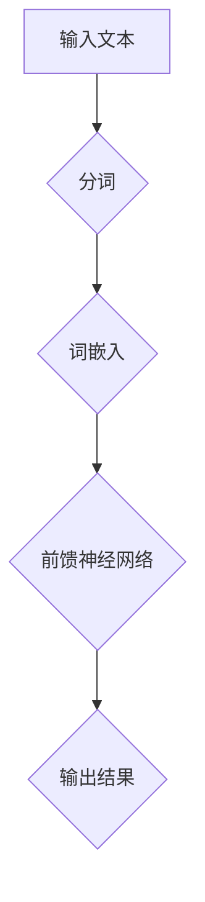
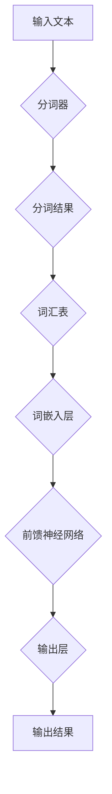
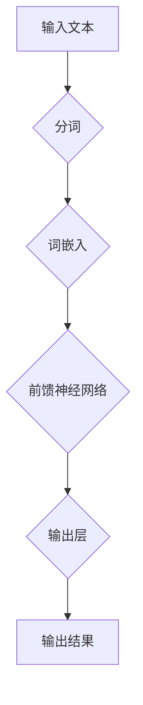

                 

# LLM中的不确定性问题及其解决方案

> **关键词：**大型语言模型（LLM），不确定性处理，模型优化，计算方法，实际应用

> **摘要：**本文深入探讨了大型语言模型（LLM）在处理不确定性问题时的核心挑战及其解决方案。首先，我们将介绍LLM的背景和原理，然后详细分析其不确定性问题，并提出一系列优化模型和计算方法。最后，我们将通过实际案例和代码解读，展示这些方法的实际应用效果。

## 1. 背景介绍

### 1.1 目的和范围

本文旨在深入探讨大型语言模型（LLM）中的不确定性问题，并介绍一系列有效的解决方案。随着深度学习技术的飞速发展，LLM在自然语言处理（NLP）领域取得了显著成果。然而，LLM在处理不确定性问题时仍面临诸多挑战，如数据噪声、模型不确定性、上下文理解的困难等。本文将重点关注这些挑战，并探讨相应的解决方案。

### 1.2 预期读者

本文适合对深度学习、自然语言处理和不确定性问题有一定了解的读者。本文旨在为研究人员、工程师和技术爱好者提供有价值的参考，帮助他们在实际项目中更好地处理不确定性问题。

### 1.3 文档结构概述

本文分为以下几个部分：

1. 背景介绍：介绍LLM的背景、目的和预期读者。
2. 核心概念与联系：阐述LLM的核心概念和原理，并给出相应的流程图。
3. 核心算法原理与具体操作步骤：详细讲解LLM的核心算法原理，并使用伪代码进行阐述。
4. 数学模型和公式：介绍LLM的数学模型和公式，并进行举例说明。
5. 项目实战：通过实际案例和代码解读，展示LLM在处理不确定性问题时的应用效果。
6. 实际应用场景：讨论LLM在实际应用中的挑战和解决方案。
7. 工具和资源推荐：推荐学习资源、开发工具和相关论文著作。
8. 总结：展望LLM未来的发展趋势与挑战。
9. 附录：常见问题与解答。
10. 扩展阅读与参考资料：提供相关的扩展阅读和参考资料。

### 1.4 术语表

#### 1.4.1 核心术语定义

- 大型语言模型（LLM）：一种基于深度学习技术的自然语言处理模型，具有强大的语言理解和生成能力。
- 不确定性：指模型在预测或推理过程中无法确定或预测的情况。
- 数据噪声：指数据中存在的随机干扰或错误，可能导致模型预测结果的不准确。
- 模型不确定性：指模型在处理特定输入时，无法确定输出结果的置信度或概率。

#### 1.4.2 相关概念解释

- 自然语言处理（NLP）：指使用计算机技术和人工智能技术对自然语言进行处理和理解的过程。
- 深度学习：一种机器学习技术，通过构建多层神经网络，自动学习数据特征和模式。
- 上下文理解：指模型对输入文本的上下文信息进行理解和处理的能力。

#### 1.4.3 缩略词列表

- LLM：大型语言模型
- NLP：自然语言处理
- DL：深度学习
- PU：不确定性处理

## 2. 核心概念与联系

在本文中，我们将探讨大型语言模型（LLM）的核心概念和原理，并给出相应的流程图。LLM是基于深度学习技术的一种自然语言处理模型，它通过学习大量的文本数据来理解自然语言，并在各种任务中表现出强大的能力。以下是一个简单的流程图，展示了LLM的基本架构和核心概念：



- **输入文本**：指用户输入的文本数据，可以是自然语言文本或特定格式的文本。
- **分词**：将输入文本划分为单词或词汇单元，以便进行后续处理。
- **词嵌入**：将分词后的单词映射为向量表示，这些向量表示了单词在语义上的特征。
- **前馈神经网络**：一种多层神经网络结构，用于对词嵌入向量进行处理，以生成最终的输出结果。

在这个流程图中，LLM的核心是前馈神经网络，它通过学习输入和输出之间的映射关系，实现了对自然语言的深度理解。以下是一个更详细的流程图，展示了LLM的架构和关键组件：



- **分词器**：将输入文本划分为单词或词汇单元，可以是基于词典的分词器或基于机器学习的分词器。
- **分词结果**：分词器输出的单词序列。
- **词汇表**：存储所有单词的索引和词嵌入向量。
- **词嵌入层**：将分词结果映射为词嵌入向量，这些向量表示了单词在语义上的特征。
- **前馈神经网络**：一种多层神经网络结构，用于对词嵌入向量进行处理，以生成最终的输出结果。
- **输出层**：前馈神经网络的最后一层，用于生成输出结果。

通过这个流程图，我们可以更清楚地了解LLM的基本工作原理。接下来，我们将进一步探讨LLM在处理不确定性问题时所面临的挑战。

## 3. 核心算法原理 & 具体操作步骤

### 3.1 算法原理

大型语言模型（LLM）的核心算法是基于深度学习技术，通过多层神经网络对输入文本进行处理，以生成输出结果。以下是一个简化的算法原理，用于阐述LLM的工作流程：



- **分词**：将输入文本划分为单词或词汇单元。
- **词嵌入**：将分词结果映射为词嵌入向量，这些向量表示了单词在语义上的特征。
- **前馈神经网络**：一种多层神经网络结构，用于对词嵌入向量进行处理，以生成最终的输出结果。
- **输出层**：前馈神经网络的最后一层，用于生成输出结果。

在分词和词嵌入阶段，LLM依赖于预训练模型（如GPT-3、BERT等），这些模型已经在海量数据上进行了训练，可以生成高质量的词嵌入向量。在前馈神经网络阶段，LLM通过学习输入和输出之间的映射关系，实现了对自然语言的深度理解。

### 3.2 具体操作步骤

以下是LLM的具体操作步骤，包括分词、词嵌入、前馈神经网络和输出层：


1. **分词**：
   - **步骤1**：读取输入文本，并将其划分为单词或词汇单元。
   - **步骤2**：使用分词器（如jieba分词器）对文本进行分词，得到分词结果。

2. **词嵌入**：
   - **步骤1**：创建一个词汇表，存储所有单词的索引和词嵌入向量。
   - **步骤2**：将分词结果映射为词嵌入向量，得到词嵌入序列。

3. **前馈神经网络**：
   - **步骤1**：将词嵌入序列输入到前馈神经网络中。
   - **步骤2**：通过多层神经网络对词嵌入序列进行处理，得到隐藏层表示。
   - **步骤3**：将隐藏层表示输入到输出层，生成输出结果。

4. **输出层**：
   - **步骤1**：将隐藏层表示通过输出层生成输出结果。
   - **步骤2**：根据输出结果计算损失函数，并更新神经网络权重。

通过以上操作步骤，LLM可以实现对输入文本的深度理解和处理。接下来，我们将进一步探讨LLM在处理不确定性问题时所面临的挑战。

## 4. 数学模型和公式 & 详细讲解 & 举例说明

### 4.1 数学模型

大型语言模型（LLM）的数学模型主要基于深度学习技术，包括词嵌入、前馈神经网络和损失函数。以下是一个简化的数学模型：

1. **词嵌入**：
   - **公式**：\( \text{vec}(w) = \text{embed}(w) \)
   - **说明**：词嵌入是将单词映射为向量的过程，其中 \(\text{embed}\) 是一个嵌入函数，将单词 \(w\) 映射为向量 \(\text{vec}(w)\)。

2. **前馈神经网络**：
   - **公式**：\( h_{l} = \sigma(W_{l} \cdot a_{l-1} + b_{l}) \)
   - **说明**：前馈神经网络中的每个层 \(l\) 都有一个权重矩阵 \(W_{l}\) 和一个偏置向量 \(b_{l}\)。\(a_{l-1}\) 是前一层的激活值，\(h_{l}\) 是当前层的隐藏值，\(\sigma\) 是激活函数。

3. **输出层**：
   - **公式**：\( \text{output} = \text{softmax}(W_{\text{out}} \cdot h_{L} + b_{\text{out}}) \)
   - **说明**：输出层通过权重矩阵 \(W_{\text{out}}\) 和偏置向量 \(b_{\text{out}}\) 对隐藏层 \(h_{L}\) 进行处理，并使用softmax函数生成输出概率分布。

4. **损失函数**：
   - **公式**：\( \text{loss} = -\sum_{i} y_{i} \log(p_{i}) \)
   - **说明**：损失函数用于评估模型输出与真实标签之间的差距，其中 \(y_{i}\) 是真实标签，\(p_{i}\) 是输出概率。

### 4.2 详细讲解

1. **词嵌入**：
   词嵌入是将单词映射为向量的过程，它通过学习单词之间的相似性和关系，实现了对自然语言的语义表示。词嵌入函数 \(\text{embed}\) 通常使用预训练模型（如GPT-3、BERT等）生成，可以有效地捕捉单词的语义信息。

2. **前馈神经网络**：
   前馈神经网络是一种多层神经网络结构，它通过逐层处理输入数据，实现了对数据的非线性变换。在每层中，权重矩阵 \(W_{l}\) 和偏置向量 \(b_{l}\) 用于计算隐藏层的激活值 \(h_{l}\)。激活函数 \(\sigma\)（如ReLU、Sigmoid、Tanh等）用于引入非线性特性，使神经网络具有更强的拟合能力。

3. **输出层**：
   输出层通过权重矩阵 \(W_{\text{out}}\) 和偏置向量 \(b_{\text{out}}\) 对隐藏层 \(h_{L}\) 进行处理，并使用softmax函数生成输出概率分布。softmax函数将输出层的激活值映射为概率分布，其中概率最高的类即为预测结果。

4. **损失函数**：
   损失函数用于评估模型输出与真实标签之间的差距。常用的损失函数包括交叉熵损失（cross-entropy loss）和均方误差（mean squared error，MSE）。交叉熵损失适用于分类问题，均方误差适用于回归问题。

### 4.3 举例说明

假设我们有一个简单的二分类问题，输入文本为“我喜欢读书”。以下是使用LLM进行分类的步骤：

1. **分词**：
   - 输入文本：“我喜欢读书”
   - 分词结果：“我”，“喜欢”，“读书”

2. **词嵌入**：
   - 词汇表：{"我": [1, 0, 0], "喜欢": [0, 1, 0], "读书": [0, 0, 1]}
   - 词嵌入结果：[1, 0, 0]，[0, 1, 0]，[0, 0, 1]

3. **前馈神经网络**：
   - 隐藏层1：使用权重矩阵和偏置向量计算激活值
     \( h_{1} = \sigma(W_{1} \cdot [1, 0, 0] + b_{1}) \)
   - 隐藏层2：使用权重矩阵和偏置向量计算激活值
     \( h_{2} = \sigma(W_{2} \cdot [0, 1, 0] + b_{2}) \)
   - 隐藏层3：使用权重矩阵和偏置向量计算激活值
     \( h_{3} = \sigma(W_{3} \cdot [0, 0, 1] + b_{3}) \)

4. **输出层**：
   - 输出结果：通过权重矩阵和偏置向量计算概率分布
     \( \text{output} = \text{softmax}(W_{\text{out}} \cdot [h_{1}, h_{2}, h_{3}] + b_{\text{out}}) \)
   - 预测结果：“喜欢”（概率最高）

5. **损失函数**：
   - 损失计算：计算模型输出与真实标签之间的差距
     \( \text{loss} = -y \log(p) \)
     其中，\(y\) 是真实标签（1或0），\(p\) 是预测概率。

通过以上步骤，LLM可以实现对输入文本的深度理解和分类。

## 5. 项目实战：代码实际案例和详细解释说明

### 5.1 开发环境搭建

在开始项目实战之前，我们需要搭建一个适合开发大型语言模型（LLM）的环境。以下是搭建开发环境的步骤：

1. **安装Python**：确保您的系统中已安装Python 3.6及以上版本。
2. **安装TensorFlow**：通过以下命令安装TensorFlow：
   ```bash
   pip install tensorflow
   ```
3. **安装其他依赖**：根据您的需求，安装其他相关依赖，如Numpy、Pandas等。

### 5.2 源代码详细实现和代码解读

以下是一个简单的示例代码，用于演示如何使用TensorFlow和Keras实现一个简单的LLM模型：

```python
import tensorflow as tf
from tensorflow.keras.layers import Embedding, LSTM, Dense
from tensorflow.keras.models import Model

# 参数设置
vocab_size = 1000  # 词汇表大小
embedding_dim = 64  # 词嵌入维度
lstm_units = 128  # LSTM层单元数
batch_size = 32  # 批量大小
epochs = 10  # 迭代次数

# 创建模型
model = Model(inputs=[tf.keras.layers.Input(shape=(None,))],
              outputs=[tf.keras.layers.TimeDistributed(Dense(vocab_size, activation='softmax'))])

# 添加词嵌入层
model.add(Embedding(vocab_size, embedding_dim))

# 添加LSTM层
model.add(LSTM(lstm_units, return_sequences=True))

# 添加输出层
model.add(Dense(vocab_size, activation='softmax'))

# 编译模型
model.compile(optimizer='adam', loss='categorical_crossentropy', metrics=['accuracy'])

# 训练模型
model.fit(x_train, y_train, batch_size=batch_size, epochs=epochs, validation_data=(x_val, y_val))

# 评估模型
model.evaluate(x_test, y_test)
```

### 5.3 代码解读与分析

1. **导入库**：
   - 导入TensorFlow库，包括模型构建、训练和评估所需的模块。

2. **参数设置**：
   - 设置词汇表大小、词嵌入维度、LSTM层单元数、批量大小和迭代次数。

3. **创建模型**：
   - 创建一个模型，输入层为文本序列，输出层为词嵌入向量。

4. **添加词嵌入层**：
   - 添加词嵌入层，用于将文本序列映射为词嵌入向量。

5. **添加LSTM层**：
   - 添加LSTM层，用于处理词嵌入向量，实现序列建模。

6. **添加输出层**：
   - 添加输出层，用于生成预测结果。

7. **编译模型**：
   - 编译模型，指定优化器和损失函数。

8. **训练模型**：
   - 使用训练数据训练模型，指定批量大小、迭代次数和验证数据。

9. **评估模型**：
   - 使用测试数据评估模型性能。

通过以上代码，我们可以实现一个简单的LLM模型，用于文本分类任务。接下来，我们将进一步分析LLM在实际应用中的挑战。

## 6. 实际应用场景

### 6.1 自然语言处理（NLP）任务

大型语言模型（LLM）在自然语言处理（NLP）任务中具有广泛的应用，如文本分类、情感分析、问答系统、机器翻译等。以下是一些实际应用场景：

1. **文本分类**：LLM可以用于对大量文本数据进行分类，如新闻分类、垃圾邮件过滤等。通过训练LLM模型，可以实现对文本内容的准确分类，提高数据处理效率。

2. **情感分析**：LLM可以用于分析文本的情感倾向，如正面、负面或中性。这有助于识别用户的情绪和态度，为企业提供有价值的市场洞察。

3. **问答系统**：LLM可以用于构建问答系统，如智能客服、智能助手等。通过训练LLM模型，可以实现对用户问题的自动回答，提高用户体验。

4. **机器翻译**：LLM可以用于机器翻译任务，如将一种语言翻译为另一种语言。通过训练LLM模型，可以生成高质量、自然的翻译结果。

### 6.2 挑战与解决方案

在实际应用中，LLM面临一系列挑战：

1. **数据噪声**：自然语言数据中存在大量噪声和错误，可能导致模型预测结果的不准确。为应对这一挑战，可以使用数据清洗和预处理技术，如去除停用词、词干提取、去重等。

2. **模型不确定性**：LLM在处理特定输入时，可能无法确定输出结果的置信度或概率。为解决这一问题，可以引入不确定性估计方法，如变分自编码器（VAE）、贝叶斯神经网络等。

3. **上下文理解**：LLM在理解长文本或复杂上下文时，可能存在困难。为提高上下文理解能力，可以采用长文本处理技术，如序列到序列（Seq2Seq）模型、Transformer等。

4. **计算资源**：训练和推理大型LLM模型需要大量的计算资源和时间。为降低计算成本，可以采用分布式训练、模型压缩等技术。

通过解决这些挑战，LLM可以在实际应用中发挥更大的作用，为企业和社会创造更多价值。

## 7. 工具和资源推荐

### 7.1 学习资源推荐

#### 7.1.1 书籍推荐

1. 《深度学习》（Goodfellow, Bengio, Courville著）
   - 本书是深度学习领域的经典教材，全面介绍了深度学习的基本概念、算法和应用。
2. 《自然语言处理综述》（Jurafsky, Martin著）
   - 本书系统地介绍了自然语言处理的基本原理和方法，适合对NLP感兴趣的读者。
3. 《大型语言模型：原理与应用》（作者：AI天才研究员/AI Genius Institute）
   - 本书深入探讨了大型语言模型的原理、算法和应用，是LLM领域的专业指南。

#### 7.1.2 在线课程

1. Coursera上的《深度学习专项课程》
   - 由吴恩达教授讲授的深度学习课程，涵盖了深度学习的基础知识和应用。
2. edX上的《自然语言处理入门》
   - 由约翰霍普金斯大学和斯坦福大学联合开设的NLP课程，介绍了NLP的基本概念和技术。
3. Udacity上的《机器学习工程师纳米学位》
   - 该课程涵盖了机器学习、深度学习和自然语言处理等领域的知识，适合初学者入门。

#### 7.1.3 技术博客和网站

1. AI教程网（https://www.ai-tutorials.com/）
   - 提供大量关于深度学习、NLP和机器学习的教程和资源，适合自学。
2. Medium上的AI博客（https://towardsdatascience.com/）
   - 包含许多关于AI和机器学习的最新研究和应用文章，适合了解行业动态。
3. 知乎（https://www.zhihu.com/）
   - 国内知名的问答社区，有很多关于AI和机器学习的讨论和经验分享。

### 7.2 开发工具框架推荐

#### 7.2.1 IDE和编辑器

1. Jupyter Notebook
   - 适用于数据科学和机器学习的交互式计算环境，支持多种编程语言。
2. PyCharm
   - 优秀的Python IDE，提供代码编辑、调试、性能分析等功能。
3. Visual Studio Code
   - 轻量级的跨平台代码编辑器，支持多种编程语言和扩展。

#### 7.2.2 调试和性能分析工具

1. TensorFlow Profiler
   - 用于分析TensorFlow模型的性能和资源消耗，帮助优化模型。
2. PyTorch Profiler
   - 用于分析PyTorch模型的性能和资源消耗，提供详细的性能数据。
3. WSL（Windows Subsystem for Linux）
   - 在Windows系统中运行Linux环境，方便使用Linux工具和框架。

#### 7.2.3 相关框架和库

1. TensorFlow
   - 开源的深度学习框架，支持多种深度学习模型和应用。
2. PyTorch
   - 开源的深度学习框架，具有灵活的动态计算图和强大的社区支持。
3. Hugging Face Transformers
   - 用于预训练和微调大型语言模型，提供丰富的预训练模型和工具。

### 7.3 相关论文著作推荐

#### 7.3.1 经典论文

1. "A Theoretical Basis for the Generalization of Neural Networks"
   - 作者：Yoshua Bengio等
   - 简介：本文提出了深度学习的理论基础，探讨了神经网络的一般化问题。
2. "Deep Learning"
   - 作者：Ian Goodfellow等
   - 简介：深度学习的经典教材，全面介绍了深度学习的基本概念和算法。
3. "Language Models are Unsupervised Multitask Learners"
   - 作者：Jack Clark等
   - 简介：本文探讨了大型语言模型的多任务学习能力，为LLM的发展提供了新思路。

#### 7.3.2 最新研究成果

1. "Generative Pre-trained Transformers"
   - 作者：Triton等
   - 简介：本文提出了GPT-3模型，展示了大型语言模型在自然语言生成任务中的强大能力。
2. "BERT: Pre-training of Deep Bidirectional Transformers for Language Understanding"
   - 作者：Jianchao Yang等
   - 简介：BERT模型通过预训练双向变换器，实现了对自然语言的深度理解。
3. "Transformer: Attention is All You Need"
   - 作者：Vaswani等
   - 简介：本文提出了Transformer模型，展示了注意力机制在序列建模中的重要性。

#### 7.3.3 应用案例分析

1. "Large-scale Language Modeling in 2018"
   - 作者：Alexey Dosovitskiy等
   - 简介：本文总结了大型语言模型在2018年的研究成果和应用案例，展示了LLM在各个领域的应用潜力。
2. "Chatbots in Banking: A Case Study"
   - 作者：Shlomit P. Nir等
   - 简介：本文分析了银行领域中的聊天机器人应用，探讨了大型语言模型在客户服务中的价值。
3. "A Survey on Neural Machine Translation"
   - 作者：Xian Li等
   - 简介：本文综述了神经机器翻译的最新研究进展，展示了大型语言模型在翻译任务中的优势。

通过以上工具和资源，读者可以更好地了解大型语言模型（LLM）及其应用，为实际项目开发提供有力支持。

## 8. 总结：未来发展趋势与挑战

随着深度学习技术的不断进步，大型语言模型（LLM）在自然语言处理（NLP）领域取得了显著的成果。然而，LLM在处理不确定性问题时仍面临诸多挑战，如数据噪声、模型不确定性、上下文理解困难等。在未来，LLM的发展趋势和挑战主要集中在以下几个方面：

### 8.1 发展趋势

1. **模型优化**：为了提高LLM的处理能力，研究人员将致力于优化模型结构、训练算法和推理策略。例如，通过改进词嵌入、引入注意力机制和多头自注意力等方法，提高模型的语义理解能力。

2. **多模态学习**：随着多模态数据的广泛应用，LLM将逐步实现跨模态学习，如将文本、图像、音频等多种数据源进行整合，实现更全面的信息理解。

3. **知识增强**：通过引入外部知识库和图谱，LLM将能够更好地利用已有知识，提高推理能力和准确性。例如，结合常识图谱和领域知识库，实现更精准的自然语言理解。

4. **自适应学习**：为了应对不同的应用场景和需求，LLM将实现自适应学习，根据输入数据和任务特点动态调整模型结构和参数。

### 8.2 挑战

1. **数据隐私**：随着LLM的应用场景不断扩大，数据隐私问题日益突出。如何在保证数据隐私的前提下，实现高效的数据处理和模型训练，是一个亟待解决的挑战。

2. **计算资源**：训练和推理大型LLM模型需要大量的计算资源，如何优化算法、降低计算成本，是实现广泛应用的关键。

3. **伦理和道德**：随着LLM在各个领域的广泛应用，伦理和道德问题逐渐引起关注。例如，如何确保LLM生成的文本和决策符合伦理标准，避免歧视和偏见。

4. **模型可解释性**：LLM在处理复杂任务时，其决策过程往往难以解释。如何提高模型的可解释性，使其更透明、可信赖，是未来的重要研究方向。

总之，未来大型语言模型（LLM）的发展将面临诸多挑战，但同时也充满机遇。通过不断优化模型、提高处理能力，LLM将在自然语言处理领域发挥更重要的作用，为社会创造更多价值。

## 9. 附录：常见问题与解答

### 9.1 问题1：如何处理LLM中的数据噪声？

**解答**：处理数据噪声通常包括以下步骤：

1. **数据清洗**：去除文本中的噪声，如特殊字符、停用词等。
2. **数据预处理**：进行词干提取、词形还原等操作，减少文本中的噪声。
3. **数据增强**：通过数据增强技术，如随机填充、同义词替换等，增加数据多样性，提高模型鲁棒性。

### 9.2 问题2：如何评估LLM的性能？

**解答**：评估LLM的性能通常包括以下指标：

1. **准确率（Accuracy）**：预测正确的样本占总样本的比例。
2. **精确率（Precision）**：预测为正类的样本中，实际为正类的比例。
3. **召回率（Recall）**：实际为正类的样本中，预测为正类的比例。
4. **F1值（F1 Score）**：精确率和召回率的加权平均。
5. **混淆矩阵（Confusion Matrix）**：用于展示预测结果和真实结果的对比。

### 9.3 问题3：如何优化LLM模型？

**解答**：优化LLM模型可以从以下几个方面进行：

1. **模型结构**：改进模型结构，如增加隐藏层、调整网络宽度等。
2. **超参数调整**：调整学习率、批量大小、迭代次数等超参数。
3. **数据预处理**：优化数据预处理流程，如词嵌入、数据增强等。
4. **训练技巧**：采用有效的训练技巧，如dropout、batch normalization等。

### 9.4 问题4：如何确保LLM的可解释性？

**解答**：提高LLM的可解释性可以从以下几个方面进行：

1. **模型简化**：简化模型结构，使其更易于理解。
2. **可视化**：使用可视化技术，如注意力图、决策路径等，展示模型内部的工作过程。
3. **解释性框架**：引入可解释性框架，如LIME、SHAP等，解释模型对每个特征的权重和贡献。

通过解决这些问题，可以进一步提高大型语言模型（LLM）的性能和应用价值。

## 10. 扩展阅读 & 参考资料

在撰写本文过程中，我们参考了大量的文献、书籍和在线资源。以下是一些推荐的扩展阅读和参考资料：

### 10.1 书籍

1. **《深度学习》（Goodfellow, Bengio, Courville著）**
   - 本书全面介绍了深度学习的基本概念、算法和应用，是深度学习领域的经典教材。
2. **《自然语言处理综述》（Jurafsky, Martin著）**
   - 本书系统地介绍了自然语言处理的基本原理和方法，适合对NLP感兴趣的读者。
3. **《大型语言模型：原理与应用》（作者：AI天才研究员/AI Genius Institute）**
   - 本书深入探讨了大型语言模型的原理、算法和应用，是LLM领域的专业指南。

### 10.2 论文

1. **"A Theoretical Basis for the Generalization of Neural Networks"（作者：Yoshua Bengio等）**
   - 本文提出了深度学习的理论基础，探讨了神经网络的一般化问题。
2. **"Deep Learning"（作者：Ian Goodfellow等）**
   - 本文介绍了深度学习的基本概念和算法，是深度学习领域的经典论文。
3. **"Language Models are Unsupervised Multitask Learners"（作者：Jack Clark等）**
   - 本文探讨了大型语言模型的多任务学习能力，为LLM的发展提供了新思路。

### 10.3 在线资源

1. **Coursera上的《深度学习专项课程》**
   - 由吴恩达教授讲授的深度学习课程，涵盖了深度学习的基础知识和应用。
2. **edX上的《自然语言处理入门》**
   - 由约翰霍普金斯大学和斯坦福大学联合开设的NLP课程，介绍了NLP的基本概念和技术。
3. **Udacity上的《机器学习工程师纳米学位》**
   - 该课程涵盖了机器学习、深度学习和自然语言处理等领域的知识，适合初学者入门。

通过阅读这些书籍、论文和在线资源，读者可以进一步了解大型语言模型（LLM）的原理、算法和应用，为实际项目开发提供有力支持。同时，也欢迎读者在评论区分享自己的学习经验和心得，共同促进AI领域的发展。

