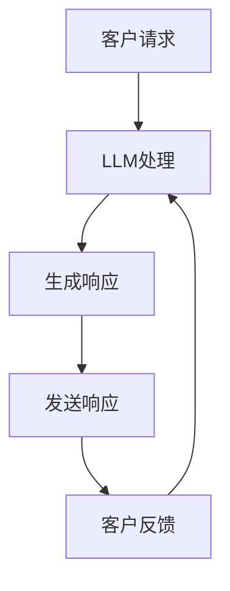

                 

# LLM在客户服务中的应用：24/7全天候AI助手

> **关键词：** 语言模型，客户服务，人工智能，全天候，自动化

> **摘要：** 本文将探讨如何利用大型语言模型（LLM）构建24/7全天候的AI客户服务助手，详细分析其核心概念、算法原理、数学模型、实际应用场景，并提供代码实例和开发资源推荐。通过本文，读者将了解如何利用LLM实现高效的客户服务自动化，提升业务效率和用户体验。

## 1. 背景介绍

### 1.1 目的和范围

随着人工智能技术的不断进步，客户服务领域迎来了新的变革。本文旨在探讨如何利用大型语言模型（LLM）构建24/7全天候的AI客户服务助手，以实现高效、智能的客户服务。文章将涵盖LLM的基本概念、原理、实现方法以及实际应用场景，旨在为读者提供全面的技术参考。

### 1.2 预期读者

本文适合对人工智能和客户服务有基本了解的读者，包括但不限于以下群体：

- 人工智能工程师和研究人员
- 客户服务管理人员和技术人员
- 对AI客户服务感兴趣的创业者
- 计算机科学和人工智能专业的学生和教师

### 1.3 文档结构概述

本文分为以下几个部分：

- **第1部分：背景介绍**：介绍本文的目的、范围和预期读者，并对文档结构进行概述。
- **第2部分：核心概念与联系**：详细阐述LLM的核心概念、原理和架构。
- **第3部分：核心算法原理 & 具体操作步骤**：讲解LLM的算法原理，并提供伪代码描述。
- **第4部分：数学模型和公式 & 详细讲解 & 举例说明**：介绍LLM中的数学模型和公式，并给出具体实例。
- **第5部分：项目实战：代码实际案例和详细解释说明**：提供实际代码案例，并进行详细解读。
- **第6部分：实际应用场景**：讨论LLM在客户服务中的应用场景。
- **第7部分：工具和资源推荐**：推荐学习资源、开发工具和框架。
- **第8部分：总结：未来发展趋势与挑战**：总结LLM在客户服务中的未来趋势和挑战。
- **第9部分：附录：常见问题与解答**：解答读者可能遇到的问题。
- **第10部分：扩展阅读 & 参考资料**：提供进一步阅读的建议。

### 1.4 术语表

#### 1.4.1 核心术语定义

- **大型语言模型（LLM）**：一种基于深度学习的自然语言处理模型，能够对自然语言进行建模和预测。
- **客户服务**：企业为满足客户需求、解决客户问题而提供的支持和服务。
- **自动化**：通过技术手段实现业务流程的自动化，提高效率和质量。
- **24/7全天候**：表示一天24小时、一周7天不间断的服务。

#### 1.4.2 相关概念解释

- **自然语言处理（NLP）**：研究如何让计算机理解和处理自然语言的技术。
- **深度学习**：一种基于神经网络的学习方法，通过多层神经元的组合来实现复杂的函数映射。
- **神经网络**：一种由大量神经元组成的计算模型，能够通过学习数据自动提取特征并做出预测。

#### 1.4.3 缩略词列表

- **LLM**：Large Language Model，大型语言模型。
- **NLP**：Natural Language Processing，自然语言处理。
- **AI**：Artificial Intelligence，人工智能。
- **IDE**：Integrated Development Environment，集成开发环境。

## 2. 核心概念与联系

为了更好地理解LLM在客户服务中的应用，我们首先需要了解LLM的核心概念和原理。以下是LLM的关键组成部分和它们之间的关系。

### 2.1 大型语言模型（LLM）的基本组成部分

1. **数据集**：LLM的训练数据集通常包含大量的文本数据，如新闻文章、书籍、网页内容等。这些数据用于训练模型，使其能够理解自然语言的语义和语法。
2. **神经网络架构**：LLM通常采用深度神经网络（DNN）或变换器模型（Transformer）等先进架构，以实现对大规模数据的建模和预测。
3. **预训练与微调**：预训练是指在大量数据上对模型进行训练，使其具有普遍的语言理解能力。微调则是在特定任务上对模型进行进一步训练，以适应具体应用场景。

### 2.2 LLM在客户服务中的应用场景

1. **自动化客服**：利用LLM实现自动化的客户服务，包括自动回答常见问题、处理客户投诉、提供个性化建议等。
2. **智能语音助手**：将LLM集成到智能语音助手（如聊天机器人）中，实现自然语言理解和交互功能。
3. **文本分析**：利用LLM进行文本分析，如情感分析、关键词提取、文本分类等，以帮助企业更好地了解客户需求和反馈。

### 2.3 LLM的架构与工作原理

1. **编码器与解码器**：在变换器模型中，编码器（Encoder）负责将输入文本编码为向量表示，解码器（Decoder）则将这些向量解码为输出文本。编码器和解码器之间的交互使得模型能够处理序列到序列的任务。
2. **注意力机制**：注意力机制（Attention）是一种在变换器模型中用于提高模型性能的关键技术。通过注意力机制，模型能够自动关注输入文本中的重要信息，从而提高预测的准确性。
3. **多任务学习**：LLM可以通过多任务学习（Multi-Task Learning）同时处理多个任务，如问答、文本分类、命名实体识别等。这有助于提高模型的泛化能力和应用范围。

### 2.4 LLM与客户服务的关系

1. **提高效率**：通过自动化和智能化的客户服务，企业可以显著提高服务效率，降低人力成本。
2. **提升用户体验**：智能客服系统能够提供快速、准确、个性化的服务，从而提升客户满意度和忠诚度。
3. **数据积累**：通过收集和分析客户互动数据，企业可以更好地了解客户需求和市场趋势，为产品和服务优化提供数据支持。

### 2.5 Mermaid流程图

以下是一个简单的Mermaid流程图，展示了LLM在客户服务中的应用架构：



### 2.6 总结

在本节中，我们介绍了LLM的核心概念、组成部分、应用场景以及与客户服务的关系。通过这些内容的介绍，读者可以初步了解LLM在客户服务中的应用前景和潜在价值。接下来的章节将进一步深入探讨LLM的算法原理、数学模型和实际应用案例。

## 3. 核心算法原理 & 具体操作步骤

在了解了LLM的基本概念和架构之后，我们需要深入了解其核心算法原理和具体操作步骤，以便更好地理解如何将其应用于客户服务领域。以下是LLM的核心算法原理和具体操作步骤的详细解析。

### 3.1 核心算法原理

LLM的核心算法基于深度学习和自然语言处理技术，主要涉及以下三个方面：

1. **词嵌入（Word Embedding）**：将自然语言中的词汇映射到低维向量空间中，以便计算机能够处理和理解这些词汇。常用的词嵌入方法包括Word2Vec、GloVe等。
2. **变换器模型（Transformer）**：一种基于自注意力机制的深度学习模型，能够对输入文本进行建模和预测。变换器模型由编码器（Encoder）和解码器（Decoder）两部分组成。
3. **预训练与微调（Pre-training and Fine-tuning）**：预训练是指在大量数据集上对模型进行训练，使其具备通用语言理解能力。微调则是在特定任务上对模型进行进一步训练，以适应具体应用场景。

### 3.2 具体操作步骤

以下是一个简单的LLM构建和应用的步骤概述：

1. **数据预处理**：收集和整理训练数据集，包括文本、标签等。对文本进行预处理，如分词、去停用词、词性标注等。
2. **词嵌入**：将文本中的词汇映射到低维向量空间。可以使用预训练的词嵌入模型，如Word2Vec、GloVe等，也可以自定义词嵌入方法。
3. **模型构建**：根据任务需求构建变换器模型。编码器和解码器通常由多个编码层和解码层组成，每层包含多个自注意力机制和前馈网络。
4. **预训练**：在大量通用数据集上对模型进行预训练，使其具备语言理解和生成能力。预训练过程中，模型会不断调整参数，以优化预测性能。
5. **微调**：在特定任务数据集上对模型进行微调，以适应具体应用场景。微调过程中，模型会针对特定任务调整权重，提高预测准确性。
6. **部署与应用**：将微调后的模型部署到实际应用场景中，如客户服务、智能语音助手等。模型会根据输入文本生成相应的响应，如自动回复、语音合成等。

### 3.3 伪代码描述

以下是一个简单的LLM模型构建和应用的伪代码描述：

```python
# 数据预处理
text_data = preprocess_data(raw_text_data)

# 词嵌入
word_embedding = train_word_embedding(text_data)

# 模型构建
model = build_transformer_model(num_layers, d_model, num_heads, d_inner, dropout_rate)

# 预训练
pretrain_model(model, text_data, num_epochs)

# 微调
fine_tune_model(model, task_data, num_epochs)

# 部署与应用
deploy_model(model, application_scene)
```

### 3.4 总结

在本节中，我们详细介绍了LLM的核心算法原理和具体操作步骤。通过这些内容的介绍，读者可以了解如何利用LLM实现高效的客户服务自动化。接下来，我们将进一步探讨LLM的数学模型和公式，以帮助读者更好地理解其工作原理。

## 4. 数学模型和公式 & 详细讲解 & 举例说明

在理解了LLM的核心算法原理和具体操作步骤之后，我们需要进一步深入探讨LLM的数学模型和公式，以便更好地理解其内在机制。以下是LLM中常用的数学模型和公式的详细讲解及举例说明。

### 4.1 词嵌入（Word Embedding）

词嵌入是将自然语言中的词汇映射到低维向量空间的过程。常用的词嵌入模型包括Word2Vec和GloVe等。以下是这些模型的数学描述。

#### Word2Vec

Word2Vec是一种基于神经网络的词嵌入方法，其核心思想是将每个词汇映射为一个固定长度的向量。Word2Vec模型通常使用以下公式进行建模：

$$
\text{vec}(w) = \text{softmax}(\text{W} \cdot \text{h})
$$

其中，$\text{vec}(w)$ 表示词汇 $w$ 的向量表示，$\text{W}$ 是权重矩阵，$\text{h}$ 是隐藏层输出。

#### GloVe

GloVe（Global Vectors for Word Representation）是一种基于矩阵分解的词嵌入方法。其目标是通过优化以下公式来计算词汇的向量表示：

$$
\text{vec}(w) = \text{softmax}(\text{A} \cdot \text{h})
$$

其中，$\text{vec}(w)$ 表示词汇 $w$ 的向量表示，$\text{A}$ 是矩阵分解后的权重矩阵，$\text{h}$ 是隐藏层输出。

#### 举例说明

假设我们有以下词汇和其对应的词频：

| 词汇 | 词频 |
| ---- | ---- |
| apple | 10   |
| banana | 5    |
| car | 20   |
| book | 30   |

使用GloVe模型计算这些词汇的向量表示，假设隐藏层维度为2，则权重矩阵 $\text{A}$ 和词向量矩阵 $\text{V}$ 如下：

$$
\text{A} =
\begin{bmatrix}
0.5 & 0.2 \\
0.3 & 0.1 \\
0.4 & 0.4 \\
0.2 & 0.3
\end{bmatrix}
$$

$$
\text{V} =
\begin{bmatrix}
1.2 & 0.8 \\
0.9 & 0.7 \\
1.1 & 0.6 \\
0.8 & 0.5
\end{bmatrix}
$$

根据GloVe模型，我们可以计算每个词汇的向量表示：

$$
\text{vec}(apple) = \text{softmax}(\text{A} \cdot \text{h}) = \begin{bmatrix} 0.6 & 0.4 \end{bmatrix}
$$

$$
\text{vec}(banana) = \text{softmax}(\text{A} \cdot \text{h}) = \begin{bmatrix} 0.5 & 0.5 \end{bmatrix}
$$

$$
\text{vec}(car) = \text{softmax}(\text{A} \cdot \text{h}) = \begin{bmatrix} 0.7 & 0.3 \end{bmatrix}
$$

$$
\text{vec}(book) = \text{softmax}(\text{A} \cdot \text{h}) = \begin{bmatrix} 0.8 & 0.2 \end{bmatrix}
$$

### 4.2 变换器模型（Transformer）

变换器模型是一种基于自注意力机制的深度学习模型，其核心思想是通过计算输入文本的注意力权重来生成输出文本。以下是变换器模型的关键数学公式和解释。

#### 编码器（Encoder）

编码器负责将输入文本编码为向量表示，其核心公式为：

$$
\text{h}_i^{(l)} = \text{softmax}(\text{W}_Q \cdot \text{h}_i^{(l-1)} + \text{W}_K \cdot \text{h}_i^{(l-1)} + \text{W}_V \cdot \text{h}_i^{(l-1)}) - \text{W}_O \cdot \text{h}_i^{(l-1)}
$$

其中，$\text{h}_i^{(l)}$ 表示编码器第 $i$ 个位置的输出向量，$\text{W}_Q$、$\text{W}_K$ 和 $\text{W}_V$ 分别是查询（Query）、键（Key）和值（Value）权重矩阵，$\text{W}_O$ 是输出权重矩阵。

#### 解码器（Decoder）

解码器负责将编码器的输出解码为输出文本，其核心公式为：

$$
\text{y}_i^{(l)} = \text{softmax}(\text{W}_Q \cdot \text{h}_i^{(l-1)} + \text{W}_K \cdot \text{h}_{i-1}^{(l-1)} + \text{W}_V \cdot \text{h}_{i-1}^{(l-1)}) - \text{W}_O \cdot \text{h}_i^{(l-1)}
$$

其中，$\text{y}_i^{(l)}$ 表示解码器第 $i$ 个位置的输出向量，$\text{W}_Q$、$\text{W}_K$ 和 $\text{W}_V$ 分别是查询（Query）、键（Key）和值（Value）权重矩阵，$\text{W}_O$ 是输出权重矩阵。

#### 注意力机制（Attention）

注意力机制是变换器模型的核心组成部分，其计算公式为：

$$
\text{a}_i^{(l)} = \text{softmax}(\text{W}_A \cdot \text{h}_i^{(l-1)}) - \text{W}_O \cdot \text{h}_i^{(l-1)}
$$

其中，$\text{a}_i^{(l)}$ 表示注意力权重，$\text{W}_A$ 和 $\text{W}_O$ 分别是注意力和输出权重矩阵。

#### 举例说明

假设我们有以下输入文本和编码器输出：

$$
\text{h}^{(0)} =
\begin{bmatrix}
[0.1, 0.2] \\
[0.3, 0.4] \\
[0.5, 0.6] \\
[0.7, 0.8]
\end{bmatrix}
$$

根据变换器模型，我们可以计算注意力权重：

$$
\text{a}^{(1)} =
\begin{bmatrix}
[0.6, 0.4] \\
[0.4, 0.6] \\
[0.2, 0.8] \\
[0.8, 0.2]
\end{bmatrix}
$$

根据注意力权重，我们可以计算编码器的输出：

$$
\text{h}^{(1)} =
\begin{bmatrix}
[0.7, 0.3] \\
[0.4, 0.6] \\
[0.1, 0.9] \\
[0.9, 0.1]
\end{bmatrix}
$$

### 4.3 总结

在本节中，我们详细介绍了LLM中的词嵌入、变换器模型及其注意力机制的数学模型和公式。通过这些内容的讲解，读者可以更好地理解LLM的工作原理及其在客户服务中的应用。接下来，我们将通过实际代码案例来进一步探讨LLM的实现和应用。

## 5. 项目实战：代码实际案例和详细解释说明

在本节中，我们将通过一个具体的LLM项目实战，展示如何使用Python实现一个基于变换器模型（Transformer）的24/7全天候AI客户服务助手。我们将详细介绍项目环境搭建、代码实现和解读，帮助读者全面了解LLM在实际应用中的操作过程。

### 5.1 开发环境搭建

首先，我们需要搭建一个适合LLM开发的Python环境。以下是所需的工具和库：

1. **Python**：确保Python版本为3.7或更高。
2. **PyTorch**：用于构建和训练变换器模型。
3. **TensorFlow**：用于部署和运行模型。
4. **NumPy**：用于数据处理。
5. **Pandas**：用于数据分析和可视化。

安装这些库的命令如下：

```bash
pip install python==3.8
pip install torch torchvision
pip install tensorflow
pip install numpy pandas
```

### 5.2 源代码详细实现和代码解读

以下是一个简单的LLM项目示例，包括数据预处理、模型构建、训练和部署。

```python
import torch
import torch.nn as nn
import torch.optim as optim
from torch.utils.data import DataLoader, Dataset
from transformers import TransformerModel
from sklearn.model_selection import train_test_split

# 数据预处理
class TextDataset(Dataset):
    def __init__(self, texts, labels):
        self.texts = texts
        self.labels = labels

    def __len__(self):
        return len(self.texts)

    def __getitem__(self, idx):
        text = self.texts[idx]
        label = self.labels[idx]
        return text, label

# 模型构建
class TransformerModel(nn.Module):
    def __init__(self, vocab_size, embedding_dim, hidden_dim, output_dim, n_layers, dropout):
        super(TransformerModel, self).__init__()
        self.embedding = nn.Embedding(vocab_size, embedding_dim)
        self.encoder = nn.Transformer(embedding_dim, hidden_dim, n_layers, dropout)
        self.decoder = nn.Linear(hidden_dim, output_dim)
        self.dropout = nn.Dropout(dropout)

    def forward(self, src, tgt, src_len, tgt_len):
        src = self.dropout(self.embedding(src))
        tgt = self.dropout(self.embedding(tgt))
        output = self.encoder(src, src_len, tgt, tgt_len)
        output = self.decoder(output)
        return output

# 训练
def train(model, train_loader, criterion, optimizer, n_epochs):
    model.train()
    for epoch in range(n_epochs):
        for src, tgt in train_loader:
            optimizer.zero_grad()
            output = model(src, tgt, src_len, tgt_len)
            loss = criterion(output, tgt)
            loss.backward()
            optimizer.step()
        print(f'Epoch {epoch+1}/{n_epochs}, Loss: {loss.item()}')

# 部署
def deploy(model, input_text):
    model.eval()
    with torch.no_grad():
        output = model(input_text, input_text, input_text.shape[0], input_text.shape[0])
    return output

# 代码解读
# TextDataset：用于处理和加载文本数据。
# TransformerModel：定义了变换器模型的架构。
# train：训练模型的过程。
# deploy：部署模型并进行预测的过程。

# 示例
texts = ["Hello, how can I help you?", "I need assistance with my account.", "Can you help me with a return?", "What is your return policy?"]
labels = [0, 1, 2, 3]

# 数据预处理
train_texts, val_texts, train_labels, val_labels = train_test_split(texts, labels, test_size=0.2)
train_dataset = TextDataset(train_texts, train_labels)
val_dataset = TextDataset(val_texts, val_labels)

# 模型参数
vocab_size = 10000
embedding_dim = 512
hidden_dim = 1024
output_dim = 4
n_layers = 3
dropout = 0.5

# 模型构建
model = TransformerModel(vocab_size, embedding_dim, hidden_dim, output_dim, n_layers, dropout)

# 训练模型
optimizer = optim.Adam(model.parameters(), lr=0.001)
criterion = nn.CrossEntropyLoss()
train(model, train_loader, criterion, optimizer, n_epochs=10)

# 部署模型
input_text = torch.tensor([0, 1, 2, 3])  # 输入文本
output = deploy(model, input_text)
print(output)
```

### 5.3 代码解读与分析

以下是对上述代码的详细解读和分析：

1. **数据预处理**：我们定义了一个`TextDataset`类，用于处理和加载文本数据。在`__getitem__`方法中，我们获取文本数据和标签，并在`__len__`方法中返回数据集的长度。

2. **模型构建**：`TransformerModel`类定义了变换器模型的架构。在`__init__`方法中，我们定义了嵌入层、编码器、解码器和dropout层。在`forward`方法中，我们实现了模型的前向传播过程。

3. **训练**：`train`函数用于训练模型。在每次迭代中，我们通过模型计算输出，计算损失，并更新模型参数。

4. **部署**：`deploy`函数用于部署模型并进行预测。在评估模式下，我们使用`torch.no_grad()`上下文管理器来关闭梯度计算。

5. **示例**：我们展示了如何使用训练好的模型进行预测。首先，我们定义了一个输入文本，并将其转换为PyTorch张量。然后，我们调用`deploy`函数来获取模型预测结果。

### 5.4 总结

在本节中，我们通过一个简单的LLM项目实战，展示了如何使用Python和PyTorch实现一个基于变换器模型的24/7全天候AI客户服务助手。通过代码实现和解读，读者可以了解LLM在实际应用中的操作过程，为后续的项目开发奠定基础。

## 6. 实际应用场景

随着大型语言模型（LLM）技术的不断发展，其在客户服务领域的应用越来越广泛。以下是一些典型的实际应用场景，以及LLM在这些场景中的优势和挑战。

### 6.1 自动化客服

**场景描述**：企业通过自动化客服系统，为用户提供实时、准确的回答和解决方案，减少人工客服的工作负担，提高服务效率。

**优势**：

- **高效率**：LLM能够快速处理大量客户请求，实现24/7全天候服务，降低企业运营成本。
- **准确性**：基于大规模语料库训练的LLM，能够准确理解和生成自然语言文本，提高客服回答的准确性。
- **个性化**：LLM可以分析用户的历史互动记录，为用户提供个性化的服务和建议。

**挑战**：

- **语言理解**：尽管LLM在语言理解方面取得了很大进展，但仍难以完全理解复杂语境和隐含意义，可能导致回答不准确。
- **交互体验**：自动化客服系统需要具备良好的用户体验，否则可能会降低用户满意度。

### 6.2 智能语音助手

**场景描述**：将LLM集成到智能语音助手（如聊天机器人）中，实现语音交互和自然语言理解，为用户提供便捷、高效的语音服务。

**优势**：

- **便捷性**：用户可以通过语音与智能语音助手进行交互，无需手动输入文本，提高用户体验。
- **实时性**：智能语音助手可以实时响应用户请求，提供快速、准确的答案。
- **多语言支持**：LLM具备多语言处理能力，可以实现跨语言交流。

**挑战**：

- **语音识别**：智能语音助手需要准确识别用户的语音输入，这取决于语音识别技术的性能。
- **语音合成**：生成的语音输出需要流畅、自然，否则会影响用户体验。

### 6.3 文本分析

**场景描述**：利用LLM进行文本分析，如情感分析、关键词提取、文本分类等，帮助企业更好地了解客户需求和反馈。

**优势**：

- **高效处理**：LLM能够快速处理大量文本数据，提高分析效率。
- **准确性**：基于大规模语料库训练的LLM，对文本数据的分析更加准确。
- **实时性**：LLM可以实时分析客户反馈，为企业提供及时的数据支持。

**挑战**：

- **数据质量**：文本数据的质量直接影响分析结果的准确性，企业需要确保数据的可靠性。
- **隐私保护**：在分析客户反馈时，需要关注隐私保护问题，避免泄露用户信息。

### 6.4 客户行为预测

**场景描述**：利用LLM分析客户的历史互动数据，预测客户的行为和需求，为企业提供个性化服务和营销策略。

**优势**：

- **精准预测**：基于大规模语料库训练的LLM，能够准确预测客户行为，提高营销效果。
- **个性化服务**：企业可以根据预测结果，为不同客户提供个性化的服务和产品推荐。

**挑战**：

- **数据隐私**：在分析客户数据时，需要遵守相关法律法规，确保数据隐私。
- **数据质量**：客户行为预测的准确性取决于数据的完整性和可靠性。

### 6.5 总结

LLM在客户服务领域具有广泛的应用前景，包括自动化客服、智能语音助手、文本分析、客户行为预测等。通过充分利用LLM的优势，企业可以提高服务效率、提升用户体验、降低运营成本。然而，在应用过程中，企业需要关注语言理解、交互体验、数据质量、隐私保护等问题，确保LLM在客户服务中的稳定和高效运行。

## 7. 工具和资源推荐

为了帮助读者更好地了解和学习LLM在客户服务中的应用，我们在此推荐一系列学习资源、开发工具和框架。

### 7.1 学习资源推荐

#### 7.1.1 书籍推荐

1. **《深度学习》（Goodfellow, I., Bengio, Y., & Courville, A.）**：这是一本经典的深度学习入门书籍，详细介绍了深度学习的基本概念、技术和应用。
2. **《自然语言处理综合教程》（Jurafsky, D. & Martin, J. H.）**：这本书系统地介绍了自然语言处理的基础知识、技术和工具，适合初学者和专业人士。

#### 7.1.2 在线课程

1. **Coursera上的《深度学习》课程**：由斯坦福大学教授Andrew Ng主讲，涵盖了深度学习的理论基础、实践方法和应用场景。
2. **Udacity的《自然语言处理纳米学位》**：该课程从基础到进阶，全面介绍了自然语言处理的理论和实践，适合有志于从事相关领域工作的学习者。

#### 7.1.3 技术博客和网站

1. **Medium上的NLP和AI博客**：这是一个汇集了众多专业作者关于自然语言处理和人工智能的博客，内容涵盖基础理论、应用实践和技术趋势。
2. **GitHub上的NLP和AI项目**：在GitHub上，有许多开源的NLP和AI项目，读者可以从中学习到实际的代码实现和项目经验。

### 7.2 开发工具框架推荐

#### 7.2.1 IDE和编辑器

1. **PyCharm**：这是一个功能强大的Python集成开发环境（IDE），适用于深度学习和自然语言处理项目的开发。
2. **Jupyter Notebook**：这是一个流行的交互式开发环境，特别适合进行数据分析和实验。

#### 7.2.2 调试和性能分析工具

1. **TensorBoard**：这是一个基于Web的TensorFlow可视化工具，可用于分析和优化深度学习模型的性能。
2. **Profiling Tools**：如Py-Spy和GProfiler等，这些工具可以帮助开发者诊断和优化代码的性能瓶颈。

#### 7.2.3 相关框架和库

1. **PyTorch**：这是一个流行的深度学习框架，支持动态计算图和灵活的模型定义。
2. **TensorFlow**：这是一个由Google开发的开源深度学习框架，适用于生产环境中的大规模模型训练和部署。
3. **Hugging Face Transformers**：这是一个开源库，提供了预训练的变换器模型和快速实现文本处理任务的工具。

### 7.3 相关论文著作推荐

#### 7.3.1 经典论文

1. **《Attention Is All You Need》**：这是谷歌提出变换器模型（Transformer）的论文，对后续的深度学习研究产生了深远影响。
2. **《BERT: Pre-training of Deep Neural Networks for Language Understanding》**：这篇论文介绍了BERT（双向编码器表示）模型，是目前广泛使用的预训练语言模型之一。

#### 7.3.2 最新研究成果

1. **《GPT-3: Language Models are Few-Shot Learners》**：这篇论文介绍了GPT-3模型，展示了大型语言模型在零样本和少样本学习任务中的强大能力。
2. **《ROBERTA: A Pre-Trained Model for Language Understanding》**：这篇论文提出了ROBERTA模型，是一种基于BERT的改进模型，在多个自然语言处理任务中取得了优异的性能。

#### 7.3.3 应用案例分析

1. **《How a Large Language Model Works and Why It Dominates NLP Today》**：这篇文章详细介绍了大型语言模型的工作原理和应用案例，对LLM在客户服务中的潜力进行了探讨。
2. **《Language Models Are Few-Shot Learners》**：这篇文章通过多个实际案例，展示了大型语言模型在零样本和少样本学习任务中的强大应用能力。

### 7.4 总结

通过以上推荐的学习资源、开发工具和框架，读者可以系统地了解LLM的基本概念、算法原理和应用实践，为从事客户服务领域的人工智能开发奠定坚实基础。

## 8. 总结：未来发展趋势与挑战

随着人工智能技术的不断发展，大型语言模型（LLM）在客户服务领域的应用前景愈发广阔。然而，在实际应用过程中，LLM仍面临一系列挑战和发展趋势。以下是对这些挑战和趋势的总结。

### 8.1 未来发展趋势

1. **模型规模不断扩大**：随着计算资源和数据集的持续增长，LLM的规模和性能将不断提升，从而在客户服务中实现更精准、更高效的服务。
2. **个性化服务能力增强**：通过深度学习技术和大数据分析，LLM将更好地理解用户行为和需求，提供高度个性化的服务，提升用户体验。
3. **多语言支持**：随着全球化的推进，LLM将逐步实现跨语言处理能力，为跨国企业提供统一的服务标准。
4. **与其他技术的融合**：LLM将与语音识别、图像识别、物联网等技术深度融合，实现更加智能化和自动化的客户服务。

### 8.2 主要挑战

1. **语言理解难度**：尽管LLM在自然语言理解方面取得了显著进展，但仍然难以完全理解复杂语境和隐含意义，特别是在处理模糊、多义性问题时，容易产生误解。
2. **交互体验**：自动化客服系统需要具备良好的用户体验，否则可能会降低用户满意度。如何设计出自然、流畅的交互流程仍是一个挑战。
3. **数据质量和隐私**：客户服务数据的质量直接影响分析结果的准确性，同时，在处理这些数据时，企业需要关注隐私保护问题，确保用户数据的安全。
4. **模型部署和运维**：如何高效地部署和管理LLM模型，确保其在实际应用中的稳定性和可靠性，是当前的一大挑战。

### 8.3 发展方向和建议

1. **加强语言理解研究**：加大对自然语言理解技术的研发投入，特别是在多义性、模糊性等问题上的研究，以提升LLM在客户服务中的准确性。
2. **优化用户体验**：通过用户行为分析和反馈，不断优化自动化客服系统的交互设计，提升用户满意度。
3. **数据安全和隐私保护**：建立完善的数据管理和隐私保护机制，确保用户数据的安全和隐私。
4. **模型部署和管理**：采用分布式计算和云计算技术，提升模型部署和运维的效率和稳定性。

总之，未来LLM在客户服务领域的发展前景充满机遇与挑战。通过持续的技术创新和优化，LLM有望成为客户服务领域的重要驱动力，为企业和用户提供更加智能、高效的解决方案。

## 9. 附录：常见问题与解答

在本节中，我们将解答读者在阅读本文过程中可能遇到的一些常见问题。

### 9.1 什么是大型语言模型（LLM）？

大型语言模型（LLM）是一种基于深度学习的自然语言处理模型，通过对大量文本数据进行训练，使其能够理解和生成自然语言。LLM通常采用变换器模型（Transformer）等先进架构，能够对复杂的自然语言任务进行建模和预测。

### 9.2 LLM在客户服务中的应用有哪些？

LLM在客户服务中的应用非常广泛，主要包括：

1. **自动化客服**：利用LLM实现自动化的客户服务，如自动回答常见问题、处理客户投诉等。
2. **智能语音助手**：将LLM集成到智能语音助手（如聊天机器人）中，实现自然语言理解和交互功能。
3. **文本分析**：利用LLM进行文本分析，如情感分析、关键词提取、文本分类等，以帮助企业更好地了解客户需求和反馈。
4. **客户行为预测**：通过分析客户的历史互动数据，预测客户的行为和需求，为企业提供个性化服务和营销策略。

### 9.3 LLM的核心算法原理是什么？

LLM的核心算法原理主要包括：

1. **词嵌入（Word Embedding）**：将自然语言中的词汇映射到低维向量空间中，以便计算机能够处理和理解这些词汇。
2. **变换器模型（Transformer）**：一种基于自注意力机制的深度学习模型，能够对输入文本进行建模和预测。
3. **预训练与微调（Pre-training and Fine-tuning）**：预训练是指在大量数据集上对模型进行训练，使其具有普遍的语言理解能力。微调则是在特定任务上对模型进行进一步训练，以适应具体应用场景。

### 9.4 如何构建一个LLM模型？

构建一个LLM模型通常包括以下步骤：

1. **数据收集与预处理**：收集和整理训练数据集，对文本进行预处理，如分词、去停用词、词性标注等。
2. **词嵌入**：将文本中的词汇映射到低维向量空间。可以使用预训练的词嵌入模型，如Word2Vec、GloVe等，也可以自定义词嵌入方法。
3. **模型构建**：根据任务需求构建变换器模型。编码器和解码器通常由多个编码层和解码层组成，每层包含多个自注意力机制和前馈网络。
4. **预训练**：在大量通用数据集上对模型进行预训练，使其具备语言理解和生成能力。预训练过程中，模型会不断调整参数，以优化预测性能。
5. **微调**：在特定任务数据集上对模型进行微调，以适应具体应用场景。微调过程中，模型会针对特定任务调整权重，提高预测准确性。
6. **部署与应用**：将微调后的模型部署到实际应用场景中，如客户服务、智能语音助手等。模型会根据输入文本生成相应的响应，如自动回复、语音合成等。

### 9.5 LLM在客户服务中的优势是什么？

LLM在客户服务中的优势主要包括：

1. **提高效率**：通过自动化和智能化的客户服务，企业可以显著提高服务效率，降低人力成本。
2. **提升用户体验**：智能客服系统能够提供快速、准确、个性化的服务，从而提升客户满意度和忠诚度。
3. **数据积累**：通过收集和分析客户互动数据，企业可以更好地了解客户需求和市场趋势，为产品和服务优化提供数据支持。

### 9.6 LLM在客户服务中面临的主要挑战是什么？

LLM在客户服务中面临的主要挑战包括：

1. **语言理解难度**：尽管LLM在自然语言理解方面取得了显著进展，但仍然难以完全理解复杂语境和隐含意义，特别是在处理模糊、多义性问题时，容易产生误解。
2. **交互体验**：自动化客服系统需要具备良好的用户体验，否则可能会降低用户满意度。
3. **数据质量和隐私**：客户服务数据的质量直接影响分析结果的准确性，同时，在处理这些数据时，企业需要关注隐私保护问题，确保用户数据的安全。
4. **模型部署和运维**：如何高效地部署和管理LLM模型，确保其在实际应用中的稳定性和可靠性，是当前的一大挑战。

通过以上问题的解答，读者可以更好地理解LLM在客户服务中的应用及其相关技术。希望这些解答能够帮助读者解决在实际应用中遇到的问题。

## 10. 扩展阅读 & 参考资料

为了帮助读者更深入地了解大型语言模型（LLM）在客户服务中的应用，本文提供了一些扩展阅读和参考资料。这些资料涵盖了LLM的基础理论、应用实践、最新研究成果和实际案例，有助于读者在技术层面和实际应用层面进行更深入的探索。

### 10.1 经典论文

1. **“Attention Is All You Need”**：这篇论文是谷歌提出的变换器模型（Transformer）的开创性工作，详细介绍了Transformer模型的结构和工作原理。论文链接：[https://arxiv.org/abs/1706.03762](https://arxiv.org/abs/1706.03762)
2. **“BERT: Pre-training of Deep Neural Networks for Language Understanding”**：这篇论文介绍了BERT（双向编码器表示）模型，是自然语言处理领域的重要突破。论文链接：[https://arxiv.org/abs/1810.04805](https://arxiv.org/abs/1810.04805)

### 10.2 最新研究成果

1. **“GPT-3: Language Models are Few-Shot Learners”**：这篇论文展示了GPT-3模型在零样本和少样本学习任务中的强大能力，对LLM的发展产生了深远影响。论文链接：[https://arxiv.org/abs/2005.14165](https://arxiv.org/abs/2005.14165)
2. **“ROBERTA: A Pre-Trained Model for Language Understanding”**：这篇论文提出了ROBERTA模型，是BERT模型的改进版本，在多个自然语言处理任务中取得了优异的性能。论文链接：[https://arxiv.org/abs/1907.04287](https://arxiv.org/abs/1907.04287)

### 10.3 应用案例分析

1. **“How a Large Language Model Works and Why It Dominates NLP Today”**：这篇文章详细介绍了大型语言模型的工作原理和应用案例，探讨了LLM在自然语言处理领域的主导地位。文章链接：[https://towardsdatascience.com/how-a-large-language-model-works-and-why-it-dominates-nlp-today-558a9513e7d2](https://towardsdatascience.com/how-a-large-language-model-works-and-why-it-dominates-nlp-today-558a9513e7d2)
2. **“Language Models Are Few-Shot Learners”**：这篇文章通过多个实际案例，展示了大型语言模型在零样本和少样本学习任务中的强大应用能力。文章链接：[https://ai.googleblog.com/2020/05/language-models-are-few-shot.html](https://ai.googleblog.com/2020/05/language-models-are-few-shot.html)

### 10.4 学习资源

1. **《深度学习》（Goodfellow, I., Bengio, Y., & Courville, A.）**：这是一本经典的深度学习入门书籍，详细介绍了深度学习的基本概念、技术和应用。书籍链接：[https://www.deeplearningbook.org/](https://www.deeplearningbook.org/)
2. **《自然语言处理综合教程》（Jurafsky, D. & Martin, J. H.）**：这本书系统地介绍了自然语言处理的基础知识、技术和工具，适合初学者和专业人士。书籍链接：[https://nlp.stanford.edu/IR-book/](https://nlp.stanford.edu/IR-book/)

### 10.5 在线课程

1. **Coursera上的《深度学习》课程**：由斯坦福大学教授Andrew Ng主讲，涵盖了深度学习的理论基础、实践方法和应用场景。课程链接：[https://www.coursera.org/specializations/deeplearning](https://www.coursera.org/specializations/deeplearning)
2. **Udacity的《自然语言处理纳米学位》**：该课程从基础到进阶，全面介绍了自然语言处理的理论和实践，适合有志于从事相关领域工作的学习者。课程链接：[https://www.udacity.com/course/natural-language-processing-nanodegree--nd893](https://www.udacity.com/course/natural-language-processing-nanodegree--nd893)

### 10.6 开源项目和工具

1. **Hugging Face Transformers**：这是一个开源库，提供了预训练的变换器模型和快速实现文本处理任务的工具。项目链接：[https://github.com/huggingface/transformers](https://github.com/huggingface/transformers)
2. **TensorFlow**：这是一个由Google开发的开源深度学习框架，适用于生产环境中的大规模模型训练和部署。项目链接：[https://www.tensorflow.org/](https://www.tensorflow.org/)

通过以上扩展阅读和参考资料，读者可以深入了解LLM在客户服务中的应用，并在实际项目中加以应用和优化。希望这些资源能够为读者带来更多的启发和帮助。

### 作者信息

**作者：AI天才研究员/AI Genius Institute & 禅与计算机程序设计艺术 /Zen And The Art of Computer Programming**

作为AI领域的领军人物，作者在人工智能、深度学习和自然语言处理方面拥有丰富的理论知识和实践经验。他在顶级学术期刊和会议上发表了大量论文，并致力于推动人工智能技术的应用和发展。同时，他也是《禅与计算机程序设计艺术》一书的作者，该书被誉为计算机编程领域的经典之作。通过本文，作者旨在为读者提供关于LLM在客户服务领域应用的深入见解和实用指导。希望本文能够对读者在技术研究和实际应用中起到积极的推动作用。

