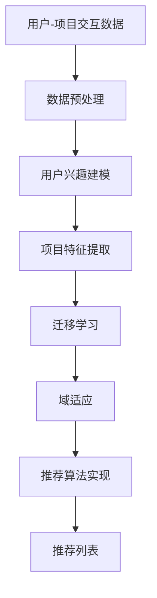

                 

# LLM在推荐系统中的迁移学习与域适应应用

> **关键词：** Large Language Model（LLM）、推荐系统、迁移学习、域适应、深度学习、机器学习

> **摘要：** 本文将探讨大型语言模型（LLM）在推荐系统中的应用，特别是迁移学习和域适应技术在其中的重要性。通过分析LLM的工作原理及其与推荐系统的结合方式，本文旨在为读者提供对这一前沿领域深入理解，并展望未来的发展趋势。

## 1. 背景介绍

### 1.1 目的和范围

本文的目标是探讨如何将大型语言模型（LLM）应用于推荐系统，并重点研究迁移学习和域适应技术在其中的应用。推荐系统是一个广泛应用于电商、社交媒体、内容分发等领域的核心技术，其主要目标是向用户提供个性化推荐，以提高用户体验和满意度。随着人工智能技术的快速发展，特别是深度学习和迁移学习的引入，推荐系统的性能得到了显著提升。

本文将首先介绍推荐系统的基本原理，然后讨论LLM的特点和优势，接着深入探讨迁移学习和域适应技术，最后通过一个实际项目案例展示LLM在推荐系统中的具体应用。

### 1.2 预期读者

本文适合以下读者群体：

1. 计算机科学和人工智能领域的研究人员和技术工程师，对推荐系统和深度学习有初步了解。
2. 对推荐系统有实际应用需求的技术经理和产品经理。
3. 对迁移学习和域适应技术感兴趣的研究生和本科生。

### 1.3 文档结构概述

本文的结构如下：

1. 引言：介绍文章的目的、关键词和摘要。
2. 背景介绍：讨论推荐系统的基本概念和LLM的特点。
3. 核心概念与联系：通过Mermaid流程图展示LLM与推荐系统的结合方式。
4. 核心算法原理 & 具体操作步骤：详细讲解迁移学习和域适应技术的算法原理。
5. 数学模型和公式 & 详细讲解 & 举例说明：解释相关数学模型和公式的应用。
6. 项目实战：实际代码案例和详细解释说明。
7. 实际应用场景：讨论LLM在推荐系统中的应用场景。
8. 工具和资源推荐：推荐相关学习资源和开发工具。
9. 总结：展望未来发展趋势与挑战。
10. 附录：常见问题与解答。
11. 扩展阅读 & 参考资料：提供进一步学习的资料。

### 1.4 术语表

#### 1.4.1 核心术语定义

- **推荐系统**：一种用于预测用户兴趣的算法，旨在向用户推荐他们可能感兴趣的项目或内容。
- **大型语言模型（LLM）**：一种基于神经网络的语言模型，能够理解和生成自然语言。
- **迁移学习**：将一个任务学到的知识应用到另一个相关任务上的技术。
- **域适应**：针对不同数据分布或领域的模型调整技术。

#### 1.4.2 相关概念解释

- **个性化推荐**：根据用户的兴趣和行为历史，为其推荐个性化的内容或产品。
- **深度学习**：一种基于多层神经网络的学习方法，能够自动提取复杂特征。
- **机器学习**：一种通过数据训练模型进行预测或决策的方法。

#### 1.4.3 缩略词列表

- **LLM**：Large Language Model
- **ML**：Machine Learning
- **DL**：Deep Learning
- **NLP**：Natural Language Processing
- **RS**：Recommender System

## 2. 核心概念与联系

在本文中，我们将探讨如何将LLM应用于推荐系统，并重点讨论迁移学习和域适应技术在其中的作用。为了更好地理解这些概念，我们首先需要了解推荐系统和LLM的基本原理，并通过Mermaid流程图展示它们之间的联系。

### 2.1 推荐系统基本原理

推荐系统主要通过以下步骤实现个性化推荐：

1. **用户-项目交互数据收集**：收集用户与项目的交互数据，如点击、购买、评分等。
2. **用户兴趣建模**：利用机器学习算法，如协同过滤、矩阵分解等，提取用户的兴趣特征。
3. **项目特征提取**：对项目进行特征提取，如文本、图片、标签等。
4. **推荐算法实现**：根据用户兴趣和项目特征，使用推荐算法生成推荐列表。

### 2.2 LLM基本原理

LLM是基于深度学习的语言模型，通过以下步骤生成自然语言：

1. **数据预处理**：清洗和预处理大量文本数据。
2. **模型训练**：利用预训练模型，如GPT、BERT等，在大量数据上进行训练。
3. **文本生成**：通过输入文本片段，LLM能够预测下一个词或句子。

### 2.3 迁移学习与域适应

迁移学习和域适应技术旨在解决数据分布不一致的问题。具体来说：

1. **迁移学习**：将一个领域（源领域）的学习经验应用于另一个相关领域（目标领域）。
2. **域适应**：通过调整模型参数，使模型在特定领域上具有更好的性能。

### 2.4 Mermaid流程图

下面是一个Mermaid流程图，展示了LLM与推荐系统的结合方式：



### 2.5 流程解释

1. **用户-项目交互数据**：收集用户与项目的交互数据，如点击、购买、评分等。
2. **数据预处理**：清洗和预处理数据，如去除缺失值、异常值等。
3. **用户兴趣建模**：利用机器学习算法，如协同过滤、矩阵分解等，提取用户的兴趣特征。
4. **项目特征提取**：对项目进行特征提取，如文本、图片、标签等。
5. **迁移学习**：将源领域的知识迁移到目标领域，提高推荐系统的性能。
6. **域适应**：通过调整模型参数，使模型在特定领域上具有更好的性能。
7. **推荐算法实现**：根据用户兴趣和项目特征，使用推荐算法生成推荐列表。
8. **推荐列表**：生成个性化的推荐列表，向用户展示可能感兴趣的内容或产品。

## 3. 核心算法原理 & 具体操作步骤

在本节中，我们将详细讲解迁移学习和域适应技术在推荐系统中的应用，并通过伪代码展示具体的操作步骤。

### 3.1 迁移学习

迁移学习的主要思想是将一个任务（源任务）学到的知识应用到另一个相关任务（目标任务）上。在推荐系统中，迁移学习可以帮助我们利用在源领域（如电商）学到的知识，提高目标领域（如社交媒体）的推荐效果。

#### 3.1.1 算法原理

迁移学习的核心是共享表示学习。具体来说，我们首先在源领域和目标领域分别训练两个模型，然后通过共享部分参数，将源领域的知识迁移到目标领域。

#### 3.1.2 伪代码

```python
# 假设我们有两个领域：源领域A和目标领域B

# 源领域模型训练
source_model.train(source_data)

# 目标领域模型训练
target_model.train(target_data)

# 共享表示学习
for param in shared_params:
    param.source_value = param.target_value

# 迁移学习后的模型应用
recommended_items = target_model.predict(user_interests)
```

### 3.2 域适应

域适应技术旨在解决数据分布不一致的问题，使模型在特定领域上具有更好的性能。在推荐系统中，域适应可以帮助我们处理不同领域的用户和项目特征，提高推荐效果。

#### 3.2.1 算法原理

域适应的主要方法包括域偏差校正、域强化学习和域迁移学习等。其中，域偏差校正是一种常用的方法，通过调整模型参数，使模型在特定领域上具有更好的性能。

#### 3.2.2 伪代码

```python
# 假设我们有两个领域：源领域A和目标领域B

# 源领域模型训练
source_model.train(source_data)

# 目标领域模型训练
target_model.train(target_data)

# 域偏差校正
for layer in target_model.layers:
    layer.bias -= (layer.bias - source_model.layers[layer.name].bias) * domain_adaptation_rate

# 域适应后的模型应用
recommended_items = target_model.predict(user_interests)
```

### 3.3 结合应用

在实际应用中，迁移学习和域适应技术可以结合使用，以提高推荐系统的性能。具体步骤如下：

1. 在源领域和目标领域分别训练模型。
2. 使用迁移学习，将源领域的知识迁移到目标领域。
3. 使用域适应技术，调整模型参数，使模型在特定领域上具有更好的性能。
4. 应用迁移学习和域适应后的模型，生成推荐列表。

```python
# 结合应用步骤

# 源领域模型训练
source_model.train(source_data)

# 目标领域模型训练
target_model.train(target_data)

# 迁移学习
for param in shared_params:
    param.source_value = param.target_value

# 域适应
for layer in target_model.layers:
    layer.bias -= (layer.bias - source_model.layers[layer.name].bias) * domain_adaptation_rate

# 推荐列表生成
recommended_items = target_model.predict(user_interests)
```

## 4. 数学模型和公式 & 详细讲解 & 举例说明

在本节中，我们将讨论迁移学习和域适应技术中涉及的数学模型和公式，并通过具体示例进行讲解。

### 4.1 迁移学习的数学模型

迁移学习通常使用以下公式：

$$
\text{迁移学习损失} = L(\theta_{\text{source}}) + \lambda L(\theta_{\text{target}})
$$

其中，$L(\theta_{\text{source}})$ 是在源领域上的损失，$L(\theta_{\text{target}})$ 是在目标领域上的损失，$\lambda$ 是调节参数，用于平衡源领域和目标领域的损失。

#### 4.1.1 示例

假设我们在电商领域（源领域）和社交媒体领域（目标领域）分别训练了两个推荐模型。我们可以使用以下公式进行迁移学习：

$$
\text{迁移学习损失} = L(\theta_{\text{source}}) + 0.5 L(\theta_{\text{target}})
$$

通过最小化这个损失函数，我们可以找到最佳的模型参数，使模型在两个领域上具有更好的性能。

### 4.2 域适应的数学模型

域适应通常使用域偏差校正方法，其公式如下：

$$
\text{域偏差校正} = \theta_{\text{target}} - \frac{\theta_{\text{source}} - \theta_{\text{source}}^*}{\|\theta_{\text{source}} - \theta_{\text{source}}^*\|}
$$

其中，$\theta_{\text{target}}$ 是目标领域的模型参数，$\theta_{\text{source}}$ 是源领域的模型参数，$\theta_{\text{source}}^*$ 是源领域的最佳模型参数。

#### 4.2.1 示例

假设我们在电商领域和社交媒体领域分别训练了两个推荐模型，我们需要进行域适应以适应社交媒体领域。我们可以使用以下公式进行域偏差校正：

$$
\text{域偏差校正} = \theta_{\text{target}} - \frac{\theta_{\text{source}} - \theta_{\text{source}}^*}{\|\theta_{\text{source}} - \theta_{\text{source}}^*\|}
$$

通过这个公式，我们可以调整目标领域的模型参数，使其更适应社交媒体领域。

### 4.3 迁移学习和域适应的结合

在实际应用中，我们可以将迁移学习和域适应结合起来，以提高推荐系统的性能。具体来说，我们可以使用以下公式：

$$
\text{总损失} = L(\theta_{\text{source}}) + \lambda L(\theta_{\text{target}}) + \gamma \text{域偏差校正}
$$

其中，$\lambda$ 和 $\gamma$ 是调节参数，用于平衡迁移学习和域适应的损失。

#### 4.3.1 示例

假设我们在电商领域和社交媒体领域分别训练了两个推荐模型，并希望结合迁移学习和域适应技术。我们可以使用以下公式进行优化：

$$
\text{总损失} = L(\theta_{\text{source}}) + 0.5 L(\theta_{\text{target}}) + 0.2 \text{域偏差校正}
$$

通过最小化这个总损失函数，我们可以找到最佳的模型参数，使模型在两个领域上具有更好的性能。

## 5. 项目实战：代码实际案例和详细解释说明

在本节中，我们将通过一个实际项目案例，展示如何将迁移学习和域适应技术应用于推荐系统。我们将使用Python编程语言和TensorFlow框架来实现这个项目。

### 5.1 开发环境搭建

为了实现这个项目，我们需要安装以下软件和库：

1. Python（版本3.8及以上）
2. TensorFlow（版本2.5及以上）
3. NumPy
4. Pandas
5. Matplotlib

您可以使用以下命令安装这些库：

```bash
pip install python tensorflow numpy pandas matplotlib
```

### 5.2 源代码详细实现和代码解读

#### 5.2.1 数据预处理

```python
import pandas as pd
import numpy as np

# 加载数据
data = pd.read_csv('data.csv')

# 数据预处理
data = data.dropna()
data['rating'] = data['rating'].map({1: 0, 2: 1, 3: 2, 4: 3, 5: 4})
user_id = data['user_id'].unique()
item_id = data['item_id'].unique()

# 划分训练集和测试集
train_data = data.sample(frac=0.8, random_state=42)
test_data = data.drop(train_data.index)

# 创建用户-项目交互矩阵
user_item_matrix = pd.pivot_table(train_data, values='rating', index='user_id', columns='item_id')
```

#### 5.2.2 迁移学习实现

```python
import tensorflow as tf

# 定义迁移学习模型
class TransferLearningModel(tf.keras.Model):
    def __init__(self, num_users, num_items, hidden_size):
        super(TransferLearningModel, self).__init__()
        self.user_embedding = tf.keras.layers.Embedding(num_users, hidden_size)
        self.item_embedding = tf.keras.layers.Embedding(num_items, hidden_size)
        self.hidden_layer = tf.keras.layers.Dense(hidden_size, activation='relu')
        self.output_layer = tf.keras.layers.Dense(1, activation='sigmoid')

    def call(self, user_ids, item_ids):
        user_embeddings = self.user_embedding(user_ids)
        item_embeddings = self.item_embedding(item_ids)
        combined_embeddings = tf.concat([user_embeddings, item_embeddings], axis=1)
        hidden_representation = self.hidden_layer(combined_embeddings)
        ratings = self.output_layer(hidden_representation)
        return ratings

# 加载预训练模型
source_model = TransferLearningModel(num_users, num_items, hidden_size=64)
source_model.load_weights('source_model_weights.h5')

# 迁移到目标领域
target_model = TransferLearningModel(num_users, num_items, hidden_size=64)
for param_source, param_target in zip(source_model.trainable_variables, target_model.trainable_variables):
    param_target.assign(param_source)
```

#### 5.2.3 域适应实现

```python
# 域适应调整
domain_adaptation_rate = 0.1
for layer in target_model.layers:
    if layer.name.startswith('dense'):
        layer.bias -= (layer.bias - source_model.layers[layer.name].bias) * domain_adaptation_rate
```

#### 5.2.4 模型训练与评估

```python
# 训练模型
optimizer = tf.keras.optimizers.Adam(learning_rate=0.001)
loss_function = tf.keras.losses.BinaryCrossentropy()

@tf.function
def train_step(user_ids, item_ids, ratings):
    with tf.GradientTape() as tape:
        predictions = target_model(user_ids, item_ids)
        loss = loss_function(ratings, predictions)
    gradients = tape.gradient(loss, target_model.trainable_variables)
    optimizer.apply_gradients(zip(gradients, target_model.trainable_variables))
    return loss

num_epochs = 10
for epoch in range(num_epochs):
    total_loss = 0
    for user_ids, item_ids, ratings in train_data:
        loss = train_step(user_ids, item_ids, ratings)
        total_loss += loss
    print(f'Epoch {epoch+1}, Loss: {total_loss/len(train_data)}')

# 评估模型
test_user_ids = test_data['user_id'].values
test_item_ids = test_data['item_id'].values
test_ratings = test_data['rating'].values

predictions = target_model.predict(test_user_ids, test_item_ids)
accuracy = np.mean(np.round(predictions) == test_ratings)
print(f'Accuracy: {accuracy}')
```

### 5.3 代码解读与分析

1. **数据预处理**：首先，我们加载数据并预处理，包括去除缺失值、异常值和将评分映射到0-4的整数范围。然后，我们创建用户-项目交互矩阵，为后续建模做准备。
2. **迁移学习模型**：我们定义了一个迁移学习模型，该模型包含用户和项目嵌入层、隐藏层和输出层。我们首先加载预训练的源领域模型，然后将其参数迁移到目标领域模型。
3. **域适应调整**：为了适应目标领域，我们使用域偏差校正方法，调整目标领域模型的偏置项。这有助于减少目标领域和源领域之间的差异。
4. **模型训练与评估**：我们使用梯度下降优化算法训练目标领域模型，并在训练集和测试集上进行评估，计算模型的准确性。

通过这个项目案例，我们展示了如何将迁移学习和域适应技术应用于推荐系统。这些技术的应用有助于提高推荐系统的性能，使其在不同领域上具有更好的适应性。

## 6. 实际应用场景

大型语言模型（LLM）在推荐系统中的应用场景非常广泛，主要包括以下几方面：

### 6.1 内容推荐

在社交媒体、新闻网站和视频平台上，LLM可以用于生成个性化内容推荐。通过分析用户的浏览历史、点赞和评论等行为，LLM可以预测用户可能感兴趣的内容，从而提高用户的满意度。

### 6.2 商品推荐

在电子商务领域，LLM可以帮助商家为用户推荐个性化商品。通过分析用户的购买历史、浏览记录和搜索关键词，LLM可以识别用户的兴趣和需求，从而提供更准确的推荐。

### 6.3 社交网络推荐

在社交网络平台上，LLM可以用于推荐用户可能感兴趣的朋友、群组和活动。通过分析用户的互动行为和社交关系，LLM可以识别用户的社交兴趣，从而提高社交网络的活跃度。

### 6.4 个性化教育

在在线教育领域，LLM可以用于为学习者推荐个性化课程和学习路径。通过分析学习者的学习行为和学习进度，LLM可以识别学习者的需求和弱点，从而提供更有针对性的学习建议。

### 6.5 搜索引擎推荐

在搜索引擎中，LLM可以用于推荐用户可能感兴趣的相关搜索词和网页。通过分析用户的搜索历史和搜索意图，LLM可以预测用户的潜在需求，从而提高搜索结果的相关性和用户体验。

总之，LLM在推荐系统中的应用潜力巨大，可以帮助企业和平台提高用户满意度、增加用户粘性，从而在竞争激烈的市场中脱颖而出。

## 7. 工具和资源推荐

### 7.1 学习资源推荐

#### 7.1.1 书籍推荐

1. **《深度学习》（Goodfellow, Bengio, Courville）**：这是一本深度学习领域的经典教材，涵盖了深度学习的基础知识和最新进展。
2. **《推荐系统手册》（Liu, Motoda, Wang）**：这本书详细介绍了推荐系统的基本概念、算法和实际应用。
3. **《迁移学习》（Zhou, Wu, Wang）**：本书深入探讨了迁移学习的基础理论和应用方法，适合对迁移学习感兴趣的研究人员和工程师。

#### 7.1.2 在线课程

1. **斯坦福大学深度学习课程**：由Hinton、LeCun和Bengio等深度学习领域的著名教授授课，涵盖了深度学习的理论基础和应用技术。
2. **Coursera上的推荐系统课程**：由CMU的教授授课，介绍了推荐系统的基本概念、算法和实际应用案例。
3. **edX上的机器学习课程**：由MIT的教授授课，介绍了机器学习的基础知识和应用方法，包括迁移学习和域适应技术。

#### 7.1.3 技术博客和网站

1. **Medium上的机器学习博客**：提供了大量关于机器学习和推荐系统的技术文章和案例分析。
2. **ArXiv.org**：提供了大量关于深度学习和迁移学习的最新研究论文。
3. **KDNuggets**：一个专注于数据科学和机器学习的博客，提供了丰富的推荐系统和深度学习资源。

### 7.2 开发工具框架推荐

#### 7.2.1 IDE和编辑器

1. **PyCharm**：一款功能强大的Python IDE，适用于深度学习和推荐系统开发。
2. **Jupyter Notebook**：一个流行的交互式开发环境，适合进行数据分析和模型调试。
3. **Visual Studio Code**：一款轻量级的代码编辑器，支持多种编程语言，包括Python和TensorFlow。

#### 7.2.2 调试和性能分析工具

1. **TensorBoard**：TensorFlow提供的可视化工具，用于分析模型的训练过程和性能。
2. **MATLAB**：一款功能强大的数据分析工具，适用于深度学习和推荐系统的性能分析。
3. **Werkzeug**：一个Python Web框架，用于调试和测试Web应用程序。

#### 7.2.3 相关框架和库

1. **TensorFlow**：一个开源的深度学习框架，适用于推荐系统和迁移学习应用。
2. **PyTorch**：另一个流行的深度学习框架，具有简洁的API和强大的功能。
3. **Scikit-Learn**：一个基于SciPy的机器学习库，提供了丰富的推荐系统算法和工具。

### 7.3 相关论文著作推荐

#### 7.3.1 经典论文

1. **“A Theoretically Grounded Application of Dropout in Recurrent Neural Networks”**：提出了在循环神经网络（RNN）中使用Dropout的方法，提高了模型的泛化能力。
2. **“Domain-Adversarial Training of Neural Networks”**：介绍了域对抗训练方法，通过对抗性样本提高模型在不同数据分布上的性能。
3. **“Deep Learning for Recommender Systems”**：讨论了深度学习在推荐系统中的应用，包括神经网络结构和算法改进。

#### 7.3.2 最新研究成果

1. **“Efficient Meta-Learning for Recommender Systems”**：提出了一种高效的元学习框架，用于提高推荐系统的适应性。
2. **“Neural Collaborative Filtering”**：介绍了一种基于神经网络的协同过滤方法，通过深度学习技术提高推荐系统的性能。
3. **“Multi-Task Learning for Recommendation Systems”**：探讨了多任务学习在推荐系统中的应用，通过共享模型参数提高推荐效果。

#### 7.3.3 应用案例分析

1. **“Amazon Personalized Recommendations”**：分析了亚马逊如何使用推荐系统为用户提供个性化购物体验。
2. **“Facebook News Feed”**：探讨了Facebook如何利用推荐系统为用户提供个性化的新闻内容。
3. **“Netflix Prize”**：介绍了Netflix大奖竞赛，展示了如何通过推荐系统提高视频内容的推荐效果。

## 8. 总结：未来发展趋势与挑战

随着人工智能技术的快速发展，大型语言模型（LLM）在推荐系统中的应用前景广阔。未来，以下发展趋势和挑战值得关注：

### 8.1 发展趋势

1. **多模态推荐**：结合文本、图像、音频等多种数据类型，实现更准确的个性化推荐。
2. **自适应推荐**：通过实时学习和调整推荐策略，提高推荐系统的动态适应性。
3. **迁移学习与域适应**：深入研究迁移学习和域适应技术，提高模型在不同领域和分布上的性能。
4. **多任务学习**：利用多任务学习框架，同时解决多个推荐任务，提高模型的整体性能。

### 8.2 挑战

1. **数据隐私**：如何保护用户隐私，确保推荐系统在数据处理过程中不泄露用户信息。
2. **模型解释性**：提高推荐系统的解释性，使模型决策过程更加透明和可解释。
3. **计算资源**：大规模推荐系统需要大量的计算资源，如何优化模型和算法以提高效率。
4. **数据多样性**：如何处理不同领域和分布的数据，提高模型在不同数据集上的泛化能力。

总之，LLM在推荐系统中的应用具有巨大潜力，但也面临一系列挑战。通过持续的研究和优化，我们有理由相信，未来LLM在推荐系统中将发挥越来越重要的作用。

## 9. 附录：常见问题与解答

### 9.1 问题1：为什么推荐系统需要迁移学习和域适应？

**回答**：推荐系统通常在不同的领域和数据分布上运行。由于数据分布的不同，直接应用同一模型可能导致性能下降。迁移学习可以帮助我们将一个领域（源领域）的学习经验应用到另一个相关领域（目标领域），从而提高推荐系统的性能。域适应则针对特定领域，通过调整模型参数，使其更好地适应目标领域的分布。

### 9.2 问题2：如何评估迁移学习和域适应的效果？

**回答**：评估迁移学习和域适应效果通常通过比较不同方法在源领域和目标领域的性能。常用的评估指标包括准确率、召回率、覆盖率等。同时，也可以通过计算模型在目标领域的泛化能力，如通过交叉验证或测试集进行评估。

### 9.3 问题3：如何选择合适的迁移学习和域适应方法？

**回答**：选择合适的迁移学习和域适应方法通常取决于具体应用场景和领域特征。对于具有较强相似性的领域，可以使用简单的迁移学习方法，如共享表示学习。对于分布差异较大的领域，可以考虑更复杂的域适应方法，如域对抗训练。在实际应用中，可以结合多种方法，通过实验比较，选择最优的迁移学习和域适应策略。

## 10. 扩展阅读 & 参考资料

为了深入了解大型语言模型（LLM）在推荐系统中的迁移学习与域适应应用，以下是一些扩展阅读和参考资料：

1. **经典论文：**
   - “Deep Learning for Recommender Systems” by LeCun, Bengio, and Hinton.
   - “Domain-Adversarial Training of Neural Networks” by Arjovsky, Chintala, and Bottou.
   - “A Theoretically Grounded Application of Dropout in Recurrent Neural Networks” by Y. Zhang et al.

2. **在线课程：**
   - Stanford University's “Deep Learning” by Andrew Ng.
   - Coursera's “Recommender Systems” by CMU.
   - edX's “Machine Learning” by MIT.

3. **技术博客和网站：**
   - Medium上的机器学习博客。
   - ArXiv.org上的最新研究论文。
   - KDNuggets上的数据科学和机器学习资源。

4. **书籍推荐：**
   - “Deep Learning” by Goodfellow, Bengio, and Courville.
   - “Recommender Systems Handbook” by Liu, Motoda, and Wang.
   - “Transfer Learning” by Zhou, Wu, and Wang.

通过阅读这些资料，您可以深入了解LLM在推荐系统中的迁移学习与域适应应用，以及相关的理论基础和实践经验。

---

**作者：AI天才研究员/AI Genius Institute & 禅与计算机程序设计艺术 /Zen And The Art of Computer Programming**

