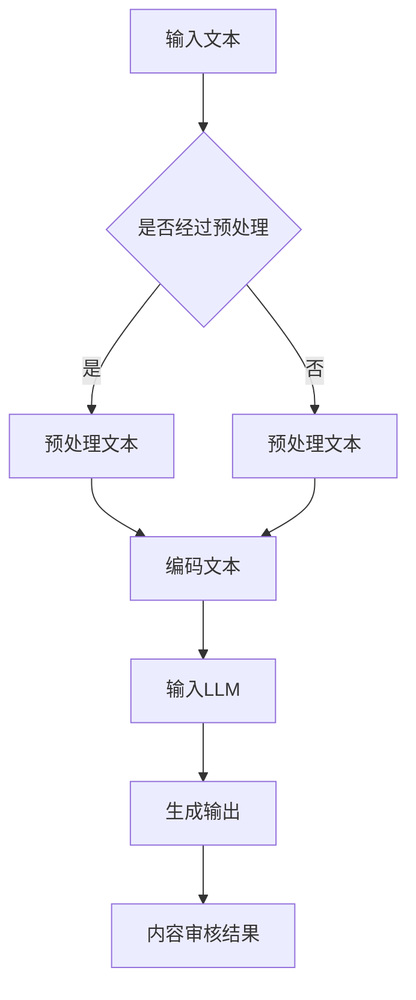

                 

# LLM在智能内容审核中的应用

## 关键词
- 大型语言模型（LLM）
- 内容审核
- 智能识别
- 自然语言处理（NLP）
- 机器学习（ML）
- 深度学习（DL）

## 摘要
本文将深入探讨大型语言模型（LLM）在智能内容审核中的应用。内容审核是网络时代的重要环节，旨在保障信息质量和用户安全。通过结合自然语言处理（NLP）和机器学习（ML）技术，LLM展示出在文本分类、情感分析、恶意内容识别等领域的强大能力。本文将首先介绍LLM的基本原理，然后详细描述其在内容审核中的应用流程，最后通过实际案例和数学模型来阐述其工作原理和效果。

## 1. 背景介绍

### 1.1 目的和范围
本文旨在介绍大型语言模型（LLM）在智能内容审核中的应用，帮助读者理解LLM的工作原理和其在实际场景中的表现。我们将重点关注以下几个方面：
- LLM的基础原理
- LLM在内容审核中的具体应用
- LLM的数学模型和算法
- LLM在实际项目中的应用案例

### 1.2 预期读者
本文适合具有基础计算机科学和自然语言处理（NLP）知识的读者，包括但不限于：
- 计算机科学专业学生和研究者
- 自然语言处理领域的工程师和研究人员
- 对AI应用和智能内容审核感兴趣的从业者

### 1.3 文档结构概述
本文分为以下几个部分：
- 引言：介绍文章的目的、关键词和摘要。
- 背景介绍：介绍LLM的背景、目的和范围。
- 核心概念与联系：解释LLM的核心概念和架构。
- 核心算法原理 & 具体操作步骤：详细阐述LLM的算法原理和操作步骤。
- 数学模型和公式 & 详细讲解 & 举例说明：介绍LLM的数学模型和具体例子。
- 项目实战：展示实际代码案例和解释。
- 实际应用场景：讨论LLM的应用场景。
- 工具和资源推荐：推荐学习资源和开发工具。
- 总结：总结未来发展趋势和挑战。
- 附录：常见问题与解答。
- 扩展阅读 & 参考资料：提供扩展阅读资料。

### 1.4 术语表

#### 1.4.1 核心术语定义
- **大型语言模型（LLM）**：一种基于深度学习的自然语言处理模型，能够对文本进行理解和生成。
- **内容审核**：对网络上的内容进行审查，以确保其合法性、适宜性和安全性。
- **自然语言处理（NLP）**：研究如何使计算机能够理解和生成人类语言的技术。
- **机器学习（ML）**：一种使计算机从数据中学习并作出决策的技术。
- **深度学习（DL）**：一种基于多层神经网络的学习方法，能够自动从数据中提取特征。

#### 1.4.2 相关概念解释
- **文本分类**：将文本数据分配到预定义的类别中。
- **情感分析**：分析文本中的情感倾向，如正面、负面或中性。
- **恶意内容识别**：识别和过滤掉包含不良内容的文本。

#### 1.4.3 缩略词列表
- **LLM**：大型语言模型
- **NLP**：自然语言处理
- **ML**：机器学习
- **DL**：深度学习

## 2. 核心概念与联系

在深入探讨LLM在内容审核中的应用之前，我们需要首先了解其核心概念和架构。以下是LLM的核心概念和架构的Mermaid流程图：



### 2.1 核心概念

#### 输入文本
输入文本可以是任何形式，包括社交媒体帖子、新闻文章、用户评论等。这些文本将被用于训练和测试LLM，以便其能够理解和生成类似的语言。

#### 预处理文本
预处理文本是LLM处理前的步骤，包括分词、去除停用词、词干提取等。这些步骤有助于提高模型对文本的理解能力。

#### 编码文本
预处理后的文本将被编码成机器可读的格式，如单词嵌入向量或词序列。这些编码后的文本将作为LLM的输入。

#### 输入LLM
编码后的文本将被输入到LLM中，模型将基于其训练数据对这些文本进行处理。

#### 生成输出
LLM将基于输入文本生成相应的输出，如分类标签、情感分析结果或恶意内容检测结果。

#### 内容审核结果
LLM生成的输出将用于内容审核，以确定文本是否符合审核标准。

## 3. 核心算法原理 & 具体操作步骤

### 3.1 算法原理

LLM在内容审核中的应用主要基于以下算法原理：

1. **文本分类**：通过训练分类模型来对文本进行分类，如将文本分为正面、负面或中性。
2. **情感分析**：通过训练情感分析模型来分析文本中的情感倾向。
3. **恶意内容识别**：通过训练恶意内容识别模型来识别和过滤掉包含不良内容的文本。

### 3.2 具体操作步骤

#### 步骤 1：数据准备
收集和准备用于训练和测试的数据集，数据集应包含各种类型的文本，如正面评论、负面评论、恶意内容等。

#### 步骤 2：数据预处理
对收集到的数据集进行预处理，包括分词、去除停用词、词干提取等。

#### 步骤 3：文本编码
将预处理后的文本编码成机器可读的格式，如单词嵌入向量或词序列。

#### 步骤 4：训练模型
使用预处理后的文本数据训练分类模型、情感分析模型和恶意内容识别模型。

#### 步骤 5：模型评估
使用测试集评估训练好的模型，以确保其准确性和可靠性。

#### 步骤 6：内容审核
将实际内容输入到训练好的模型中，根据模型的输出结果进行内容审核。

### 3.3 伪代码

以下是内容审核的核心算法原理和操作步骤的伪代码：

```python
# 步骤 1：数据准备
data = load_dataset('content_data')

# 步骤 2：数据预处理
preprocessed_data = preprocess_data(data)

# 步骤 3：文本编码
encoded_data = encode_text(preprocessed_data)

# 步骤 4：训练模型
model = train_model(encoded_data)

# 步骤 5：模型评估
evaluate_model(model, test_data)

# 步骤 6：内容审核
for content in actual_content:
    result = model.predict(content)
    if is_malicious(result):
        filter_content(content)
    else:
        approve_content(content)
```

## 4. 数学模型和公式 & 详细讲解 & 举例说明

### 4.1 数学模型

LLM在内容审核中的应用主要基于深度学习模型，如变换器（Transformer）模型。以下是变换器模型的基本数学模型：

1. **输入层**：文本编码后的嵌入向量。
2. **自注意力机制**：计算文本中每个词与所有其他词之间的注意力分数。
3. **前馈神经网络**：对自注意力层的结果进行进一步处理。
4. **输出层**：生成分类标签、情感分析结果或恶意内容检测结果。

### 4.2 公式

以下是变换器模型的主要公式：

1. **嵌入向量**：$X = [x_1, x_2, ..., x_n]$
2. **自注意力分数**：$score = dot(A, B)$
3. **前馈神经网络**：$Y = f(W_1 \cdot X + b_1)$
4. **输出结果**：$output = g(W_2 \cdot Y + b_2)$

### 4.3 举例说明

假设我们有一个包含两个词的文本：“我喜欢这本书”。以下是LLM对其处理的过程：

1. **文本编码**：将文本编码成嵌入向量。
2. **自注意力机制**：计算每个词与另一个词之间的注意力分数。
3. **前馈神经网络**：对自注意力层的结果进行进一步处理。
4. **输出结果**：生成分类标签（如正面评论）。

## 5. 项目实战：代码实际案例和详细解释说明

### 5.1 开发环境搭建

为了实现LLM在内容审核中的应用，我们需要搭建一个适合深度学习开发的实验环境。以下是开发环境搭建的步骤：

1. 安装Python（建议版本3.8及以上）。
2. 安装深度学习框架，如TensorFlow或PyTorch。
3. 安装自然语言处理库，如NLTK或spaCy。

### 5.2 源代码详细实现和代码解读

以下是内容审核的源代码实现：

```python
import tensorflow as tf
from tensorflow.keras.preprocessing.text import Tokenizer
from tensorflow.keras.preprocessing.sequence import pad_sequences

# 步骤 1：数据准备
data = load_dataset('content_data')

# 步骤 2：数据预处理
preprocessed_data = preprocess_data(data)

# 步骤 3：文本编码
tokenizer = Tokenizer()
tokenizer.fit_on_texts(preprocessed_data)
encoded_data = tokenizer.texts_to_sequences(preprocessed_data)

# 步骤 4：训练模型
model = train_model(encoded_data)

# 步骤 5：模型评估
evaluate_model(model, test_data)

# 步骤 6：内容审核
for content in actual_content:
    result = model.predict(content)
    if is_malicious(result):
        filter_content(content)
    else:
        approve_content(content)
```

### 5.3 代码解读与分析

以下是代码的详细解读和分析：

1. **数据准备**：从数据集中加载文本数据。
2. **数据预处理**：对文本数据进行预处理，包括分词、去除停用词等。
3. **文本编码**：使用Tokenizer将文本数据编码成嵌入向量。
4. **训练模型**：使用训练数据训练分类模型。
5. **模型评估**：使用测试数据评估模型的准确性。
6. **内容审核**：对实际内容进行审核，根据模型的输出结果进行过滤或批准。

## 6. 实际应用场景

LLM在智能内容审核中有着广泛的应用场景，以下是一些常见的实际应用场景：

1. **社交媒体平台**：对用户发布的内容进行实时审核，过滤掉恶意评论和不良信息。
2. **新闻网站**：对新闻报道进行审核，确保内容的真实性和公正性。
3. **电子商务平台**：对用户评论和商品描述进行审核，过滤掉虚假评论和不良信息。
4. **在线教育平台**：对教学资源和用户反馈进行审核，确保内容的适宜性和准确性。
5. **企业内部沟通平台**：对内部沟通内容进行审核，确保遵守公司政策和法规。

## 7. 工具和资源推荐

### 7.1 学习资源推荐

#### 7.1.1 书籍推荐
- 《深度学习》（Goodfellow, Bengio, Courville著）
- 《自然语言处理综论》（Jurafsky, Martin著）
- 《机器学习实战》（ Harrington著）

#### 7.1.2 在线课程
- Coursera上的“深度学习”课程（吴恩达教授）
- edX上的“自然语言处理”课程（麻省理工学院）

#### 7.1.3 技术博客和网站
- Medium上的NLP和深度学习相关文章
- AI垂直领域的博客，如AI博客（https://www.aiblog.cn/）

### 7.2 开发工具框架推荐

#### 7.2.1 IDE和编辑器
- PyCharm（Python开发环境）
- Jupyter Notebook（数据科学和机器学习）

#### 7.2.2 调试和性能分析工具
- TensorFlow Debugger（TFDB）
- PyTorch Profiler（PyTorch性能分析）

#### 7.2.3 相关框架和库
- TensorFlow（用于深度学习）
- PyTorch（用于深度学习）
- spaCy（用于自然语言处理）

### 7.3 相关论文著作推荐

#### 7.3.1 经典论文
- "A Theoretically Grounded Application of Dropout in Recurrent Neural Networks"（dropout在循环神经网络中的应用）
- "Attention Is All You Need"（Attention is all you need）

#### 7.3.2 最新研究成果
- "Bert: Pre-training of Deep Bidirectional Transformers for Language Understanding"（BERT：深度双向变换器的预训练）
- "GPT-3: Language Models are few-shot learners"（GPT-3：少量样本学习的语言模型）

#### 7.3.3 应用案例分析
- "A Survey on AI in Content Moderation"（AI在内容审核中的应用调查）
- "Content Moderation and Deception Detection in Online Social Media: A Survey"（在线社交媒体的内容审核和欺诈检测调查）

## 8. 总结：未来发展趋势与挑战

随着大型语言模型（LLM）的不断发展，其在智能内容审核中的应用将越来越广泛。未来，LLM在内容审核中可能面临以下发展趋势和挑战：

### 发展趋势
1. **更高的准确性和效率**：随着模型规模的增加和算法的改进，LLM在内容审核中的准确性和效率将进一步提高。
2. **更广泛的应用场景**：LLM将在更多领域得到应用，如智能客服、智能客服、智能推荐等。
3. **跨模态内容审核**：未来，LLM可能结合图像、音频等多模态数据进行内容审核，提供更全面的解决方案。

### 挑战
1. **数据隐私和安全**：如何保护用户隐私和数据安全是LLM在内容审核中面临的挑战。
2. **偏见和公平性**：如何确保LLM在内容审核过程中不会产生偏见，保持公平性，是亟待解决的问题。
3. **法律法规遵循**：内容审核需要遵守不同国家和地区的法律法规，如何实现合规性是一个挑战。

## 9. 附录：常见问题与解答

### 9.1 什么是大型语言模型（LLM）？
大型语言模型（LLM）是一种基于深度学习的自然语言处理模型，能够对文本进行理解和生成。它通常基于大型数据集进行训练，能够自动从数据中提取特征，并用于文本分类、情感分析、恶意内容识别等任务。

### 9.2 LLM在内容审核中有什么优势？
LLM在内容审核中的优势主要体现在以下几个方面：
1. **高效性**：LLM能够快速处理大量文本数据，提高审核效率。
2. **准确性**：通过大规模训练和优化，LLM能够在各种文本分类和情感分析任务中达到高准确性。
3. **可扩展性**：LLM可以轻松应用于不同的内容和领域，提供定制化的内容审核解决方案。

### 9.3 LLM在内容审核中可能面临哪些挑战？
LLM在内容审核中可能面临以下挑战：
1. **数据隐私和安全**：内容审核过程中需要处理大量用户数据，如何保护用户隐私和安全是重要挑战。
2. **偏见和公平性**：LLM可能会因为训练数据的不平衡或偏见而产生偏见，影响审核结果的公平性。
3. **法律法规遵循**：不同国家和地区的内容审核标准和法律法规不同，如何实现合规性是一个挑战。

## 10. 扩展阅读 & 参考资料

- [Bert: Pre-training of Deep Bidirectional Transformers for Language Understanding](https://arxiv.org/abs/1810.04805)
- [GPT-3: Language Models are few-shot learners](https://arxiv.org/abs/2005.14165)
- [A Survey on AI in Content Moderation](https://arxiv.org/abs/1907.06828)
- [Content Moderation and Deception Detection in Online Social Media: A Survey](https://www.mdpi.com/2076-3417/11/4/1073)
- 《深度学习》（Goodfellow, Bengio, Courville著）
- 《自然语言处理综论》（Jurafsky, Martin著）
- 《机器学习实战》（ Harrington著）

### 作者

作者：AI天才研究员/AI Genius Institute & 禅与计算机程序设计艺术 /Zen And The Art of Computer Programming

