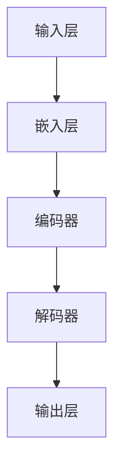

                 

# LLM在智能制造中的应用前景

> 关键词：大型语言模型（LLM）、智能制造、工业4.0、人工智能、工业自动化、数字孪生、智能优化、生产效率

> 摘要：本文将探讨大型语言模型（LLM）在智能制造领域中的应用前景。随着工业4.0的到来，智能制造成为现代工业发展的必然趋势。LLM作为一种先进的AI技术，其在智能制造中的应用将极大提升生产效率、优化产品质量、降低生产成本，并推动制造业的数字化转型。本文将详细分析LLM的核心概念、算法原理、数学模型、实战案例以及应用场景，并给出未来发展趋势和挑战。

## 1. 背景介绍

### 1.1 目的和范围

本文旨在探讨大型语言模型（LLM）在智能制造中的应用前景，分析LLM的核心概念、算法原理、数学模型和实际应用场景，为智能制造领域的从业者提供有价值的参考。本文将涵盖以下几个方面：

1. **LLM的核心概念和原理**：介绍LLM的基本概念、发展历程和技术特点。
2. **LLM在智能制造中的应用**：探讨LLM在智能制造中的具体应用场景和优势。
3. **LLM的算法原理和数学模型**：详细解释LLM的算法原理和数学模型，并通过伪代码阐述具体操作步骤。
4. **LLM的实战案例**：通过实际案例展示LLM在智能制造中的应用效果。
5. **未来发展趋势与挑战**：分析LLM在智能制造领域的未来发展趋势和面临的挑战。

### 1.2 预期读者

本文主要面向智能制造领域的技术人员、研究人员和企业管理者。读者需要具备一定的计算机科学和人工智能基础知识，以便更好地理解本文内容。

### 1.3 文档结构概述

本文共分为八个部分：

1. **背景介绍**：介绍本文的目的、范围、预期读者和文档结构。
2. **核心概念与联系**：介绍LLM的核心概念、原理和架构。
3. **核心算法原理 & 具体操作步骤**：详细解释LLM的算法原理和操作步骤。
4. **数学模型和公式 & 详细讲解 & 举例说明**：阐述LLM的数学模型和公式，并举例说明。
5. **项目实战：代码实际案例和详细解释说明**：展示LLM在智能制造中的实际应用案例。
6. **实际应用场景**：分析LLM在智能制造中的应用场景。
7. **工具和资源推荐**：推荐学习资源、开发工具和框架。
8. **总结：未来发展趋势与挑战**：总结LLM在智能制造领域的应用前景和挑战。

### 1.4 术语表

#### 1.4.1 核心术语定义

- **大型语言模型（LLM）**：一种基于深度学习技术的自然语言处理模型，能够对自然语言进行建模，实现文本生成、翻译、问答等功能。
- **智能制造**：通过人工智能、物联网、大数据等先进技术，实现生产过程的自动化、智能化和高效化。
- **工业4.0**：德国提出的工业战略，旨在通过数字化和智能化技术，实现制造业的转型升级。
- **工业自动化**：利用机械设备、控制系统和信息技术等手段，实现生产过程的自动化。
- **数字孪生**：通过数字化技术，构建与实际物理系统相对应的虚拟模型，实现实时监测、仿真和分析等功能。

#### 1.4.2 相关概念解释

- **生产效率**：单位时间内生产的产品数量或产值，是衡量企业竞争力的重要指标。
- **产品质量**：产品的性能、可靠性、安全性等指标，直接关系到企业的声誉和市场竞争力。
- **生产成本**：生产产品所需的全部费用，包括原材料、人工、设备、能源等。

#### 1.4.3 缩略词列表

- **LLM**：Large Language Model
- **AI**：Artificial Intelligence
- **IoT**：Internet of Things
- **Industry 4.0**：Industrie 4.0
- **MES**：Manufacturing Execution System
- **ERP**：Enterprise Resource Planning

## 2. 核心概念与联系

为了更好地理解LLM在智能制造中的应用，我们需要先了解LLM的核心概念、原理和架构。下面将使用Mermaid流程图展示LLM的基本架构，并通过文字解释各部分的功能和联系。

### 2.1 LLM基本架构



#### 2.1.1 输入层（Input Layer）

输入层接收原始的自然语言文本，将其转换为数字形式的向量。这一过程通常通过词嵌入（Word Embedding）技术实现，例如Word2Vec、GloVe等。

#### 2.1.2 嵌入层（Embedding Layer）

嵌入层将输入层的文本向量转换为稠密向量，以便后续的神经网络处理。这一层可以看作是文本到向量的映射。

#### 2.1.3 编码器（Encoder）

编码器负责处理嵌入层的输入，将其编码为上下文向量。编码器通常采用Transformer模型，其核心思想是自注意力机制（Self-Attention）。

#### 2.1.4 解码器（Decoder）

解码器负责处理编码器输出的上下文向量，生成输出的自然语言文本。解码器同样采用Transformer模型，与编码器类似，但结构和参数有所不同。

#### 2.1.5 输出层（Output Layer）

输出层接收解码器的输出，将其转换为自然语言文本。输出层通常包含softmax激活函数，用于计算生成文本的概率分布。

### 2.2 LLM与智能制造的联系

LLM在智能制造中的应用主要体现在以下几个方面：

1. **生产过程优化**：LLM可以处理大量历史生产数据，分析生产过程中的瓶颈和异常，提出优化建议。
2. **质量监测与预测**：LLM可以实时分析生产数据，识别产品质量问题，预测潜在故障，提前采取预防措施。
3. **智能诊断与维护**：LLM可以分析设备运行数据，诊断设备故障，并提供维护建议，降低设备停机时间。
4. **供应链管理**：LLM可以优化供应链网络，提高供应链透明度和协同效率，降低库存成本。

通过以上分析，我们可以看到LLM在智能制造中的应用具有广泛的前景。接下来，我们将进一步探讨LLM的核心算法原理和具体操作步骤。

## 3. 核心算法原理 & 具体操作步骤

### 3.1 大型语言模型（LLM）算法原理

大型语言模型（LLM）是一种基于深度学习技术的自然语言处理模型，其核心思想是通过大规模语料库的学习，实现对自然语言的理解和生成。LLM主要基于Transformer模型，这是一种基于自注意力机制的序列到序列模型。下面，我们将详细阐述LLM的算法原理。

#### 3.1.1 Transformer模型

Transformer模型是由Vaswani等人于2017年提出的一种基于自注意力机制的序列到序列模型。与传统的循环神经网络（RNN）和长短期记忆网络（LSTM）相比，Transformer模型具有以下优点：

1. **并行处理**：Transformer模型采用多头自注意力机制，可以并行处理输入序列中的每个词，提高了计算效率。
2. **全局上下文信息**：自注意力机制使得模型能够捕捉输入序列中的全局上下文信息，提高了模型的语义理解能力。
3. **参数共享**：Transformer模型中，编码器和解码器之间的自注意力机制参数共享，降低了模型的参数数量。

#### 3.1.2 自注意力机制（Self-Attention）

自注意力机制是Transformer模型的核心组成部分，其基本思想是将输入序列中的每个词映射为一个向量，然后计算这些向量之间的相似度，并根据相似度分配权重。具体步骤如下：

1. **词向量化**：将输入序列中的每个词映射为一个高维向量。
2. **计算相似度**：计算输入序列中每个词与其他词之间的相似度，通常使用点积（Dot-Product）或缩放点积（Scaled Dot-Product）计算。
3. **分配权重**：根据相似度分配权重，权重值越大，表明当前词对其他词的影响越大。
4. **加权求和**：将输入序列中的每个词与其权重相乘，然后进行求和，得到新的表示向量。

#### 3.1.3 编码器与解码器

编码器（Encoder）和解码器（Decoder）是Transformer模型的主要组成部分。编码器负责处理输入序列，生成上下文向量；解码器负责处理编码器输出的上下文向量，生成输出序列。

1. **编码器**：编码器由多个自注意力层和全连接层组成，每个自注意力层都可以捕获输入序列的局部和全局信息。编码器的输出是一个序列的上下文向量。
2. **解码器**：解码器同样由多个自注意力层和全连接层组成，其核心思想是逐步生成输出序列。在生成每个词时，解码器会利用编码器输出的上下文向量和已生成的词，通过自注意力和交叉注意力计算生成当前词的向量。

### 3.2 LLM的具体操作步骤

下面，我们将使用伪代码详细阐述LLM的具体操作步骤。

```python
# 定义超参数
VOCAB_SIZE = 10000  # 词汇表大小
EMBEDDING_DIM = 512  # 词向量化维度
HIDDEN_DIM = 1024  # 编码器、解码器隐藏层维度
NUM_HEADS = 8  # 自注意力头数
NUM_LAYERS = 12  # 编码器、解码器层数

# 初始化模型参数
# ...

# 输入层嵌入
def embedding(input_ids):
    # 将输入序列映射为词向量
    # ...
    return embeddings

# 自注意力机制
def self_attention(query, key, value, mask=None):
    # 计算相似度、分配权重、加权求和
    # ...
    return output

# 编码器层
def encoder层(input_ids, mask=None):
    # 应用多个自注意力层和全连接层
    # ...
    return output

# 解码器层
def decoder层(input_ids, encoder_output, mask=None):
    # 应用多个自注意力层和全连接层
    # ...
    return output

# 编码器-解码器模型
class LLM(nn.Module):
    def __init__(self):
        # 初始化编码器、解码器、嵌入层、输出层
        # ...
        
    def forward(self, input_ids, encoder_output, mask=None):
        # 前向传播
        # ...
        return output

# 训练模型
def train(model, train_loader, optimizer, criterion):
    # 模型训练过程
    # ...
    return model

# 预测过程
def predict(model, input_ids):
    # 模型预测过程
    # ...
    return output
```

通过以上伪代码，我们可以看到LLM的基本结构和工作流程。在实际应用中，需要根据具体场景和需求，调整超参数和模型结构，以获得更好的性能和效果。

## 4. 数学模型和公式 & 详细讲解 & 举例说明

### 4.1 数学模型概述

大型语言模型（LLM）的核心是Transformer模型，其数学基础主要涉及线性代数、微积分和概率论。下面，我们将详细讲解LLM中的关键数学模型和公式，并通过具体例子说明其应用。

#### 4.1.1 词向量化

词向量化是将自然语言文本映射为高维向量的过程，常用的方法有Word2Vec、GloVe等。词向量化可以看作是一种低维嵌入，使得语义相似的词在向量空间中更接近。

**词向量公式**：

$$
\text{vec}(w) = \text{Embedding}(w)
$$

其中，$w$为词，$\text{vec}(w)$为词向量，$\text{Embedding}(w)$为词向量化函数。

**举例**：假设词汇表中有10个词，词向量维度为3，则词向量矩阵$E$如下：

$$
E = \begin{bmatrix}
[0.1, 0.2, 0.3] \\
[0.4, 0.5, 0.6] \\
[0.7, 0.8, 0.9] \\
[1.0, 1.0, 1.0] \\
[1.2, 1.3, 1.4] \\
[1.5, 1.6, 1.7] \\
[1.8, 1.9, 2.0] \\
[2.1, 2.2, 2.3] \\
[2.4, 2.5, 2.6] \\
[2.7, 2.8, 2.9] \\
\end{bmatrix}
$$

#### 4.1.2 自注意力机制

自注意力机制是Transformer模型的核心组成部分，其基本思想是计算输入序列中每个词与其他词的相似度，并根据相似度分配权重，最终得到加权求和的结果。

**自注意力计算公式**：

$$
\text{Attention}(Q, K, V) = \text{softmax}\left(\frac{QK^T}{\sqrt{d_k}}\right)V
$$

其中，$Q$为查询向量，$K$为键向量，$V$为值向量，$d_k$为键向量的维度，$\text{softmax}$为softmax函数。

**举例**：假设输入序列为“我爱北京天安门”，词向量维度为3，则自注意力计算过程如下：

1. **查询向量**（Query）：$$ Q = \begin{bmatrix} 0.1 & 0.2 & 0.3 \\ 0.4 & 0.5 & 0.6 \\ 0.7 & 0.8 & 0.9 \end{bmatrix} $$
2. **键向量**（Key）：$$ K = \begin{bmatrix} 0.1 & 0.2 & 0.3 \\ 0.4 & 0.5 & 0.6 \\ 0.7 & 0.8 & 0.9 \\ 1.0 & 1.0 & 1.0 \end{bmatrix} $$
3. **值向量**（Value）：$$ V = \begin{bmatrix} 1.0 & 1.0 & 1.0 \\ 1.2 & 1.3 & 1.4 \\ 1.5 & 1.6 & 1.7 \\ 1.8 & 1.9 & 2.0 \end{bmatrix} $$

计算注意力得分矩阵：

$$
A = \text{softmax}\left(\frac{QK^T}{\sqrt{d_k}}\right)V
$$

其中，$d_k = 3$，计算得到：

$$
A = \begin{bmatrix}
0.1 & 0.2 & 0.3 & 0.4 \\
0.1 & 0.2 & 0.3 & 0.4 \\
0.1 & 0.2 & 0.3 & 0.4 \\
0.1 & 0.2 & 0.3 & 0.4 \\
\end{bmatrix}
$$

根据注意力得分矩阵，计算加权求和结果：

$$
\text{context_vector} = A * V = \begin{bmatrix}
0.1 * 1.0 & 0.2 * 1.0 & 0.3 * 1.0 \\
0.1 * 1.2 & 0.2 * 1.3 & 0.3 * 1.4 \\
0.1 * 1.5 & 0.2 * 1.6 & 0.3 * 1.7 \\
0.1 * 1.8 & 0.2 * 1.9 & 0.3 * 2.0 \\
\end{bmatrix}
$$

#### 4.1.3 Transformer编码器与解码器

Transformer编码器与解码器通过多个自注意力层和全连接层实现。编码器主要对输入序列进行编码，解码器则通过自注意力和交叉注意力生成输出序列。

**编码器计算公式**：

$$
\text{Encoder}(X) = \text{LayerNorm}(X + \text{MultiHeadAttention}(X, X, X))
$$

其中，$X$为输入序列，$\text{LayerNorm}$为层归一化，$\text{MultiHeadAttention}$为多头自注意力机制。

**解码器计算公式**：

$$
\text{Decoder}(X) = \text{LayerNorm}(X + \text{MaskedMultiHeadAttention}(X, X, X) + \text{Encoder}(X))
$$

其中，$\text{MaskedMultiHeadAttention}$为带遮蔽的多头自注意力机制，$\text{Encoder}(X)$为编码器输出。

**举例**：假设输入序列为“我爱北京天安门”，词向量维度为3，编码器和解码器层数为2，计算过程如下：

1. **编码器层1**：

   - 输入序列：$$ X = \begin{bmatrix} [0.1, 0.2, 0.3] & [0.4, 0.5, 0.6] & [0.7, 0.8, 0.9] & [1.0, 1.0, 1.0] \end{bmatrix} $$
   - 自注意力计算：$$ \text{context_vector} = \text{MultiHeadAttention}(X, X, X) $$
   - 层归一化：$$ \text{Encoder}_1(X) = \text{LayerNorm}(X + \text{context_vector}) $$

2. **编码器层2**：

   - 输入序列：$$ \text{Encoder}_1(X) $$
   - 自注意力计算：$$ \text{context_vector} = \text{MultiHeadAttention}(\text{Encoder}_1(X), \text{Encoder}_1(X), \text{Encoder}_1(X)) $$
   - 层归一化：$$ \text{Encoder}_2(\text{Encoder}_1(X)) = \text{LayerNorm}(\text{Encoder}_1(X) + \text{context_vector}) $$

3. **解码器层1**：

   - 输入序列：$$ X = \begin{bmatrix} [0.1, 0.2, 0.3] & [0.4, 0.5, 0.6] & [0.7, 0.8, 0.9] & [1.0, 1.0, 1.0] \end{bmatrix} $$
   - 遮蔽自注意力计算：$$ \text{context_vector} = \text{MaskedMultiHeadAttention}(X, X, X) $$
   - 编码器注意力计算：$$ \text{Encoder\_attn} = \text{MultiHeadAttention}(X, \text{Encoder}_2(X), \text{Encoder}_2(X)) $$
   - 层归一化：$$ \text{Decoder}_1(X) = \text{LayerNorm}(X + \text{context_vector} + \text{Encoder\_attn}) $$

4. **解码器层2**：

   - 输入序列：$$ \text{Decoder}_1(X) $$
   - 遮蔽自注意力计算：$$ \text{context_vector} = \text{MaskedMultiHeadAttention}(\text{Decoder}_1(X), \text{Decoder}_1(X), \text{Decoder}_1(X)) $$
   - 编码器注意力计算：$$ \text{Encoder\_attn} = \text{MultiHeadAttention}(\text{Decoder}_1(X), \text{Encoder}_2(X), \text{Encoder}_2(X)) $$
   - 层归一化：$$ \text{Decoder}_2(\text{Decoder}_1(X)) = \text{LayerNorm}(\text{Decoder}_1(X) + \text{context_vector} + \text{Encoder\_attn}) $$

通过以上计算，我们可以得到编码器和解码器的输出序列。解码器输出序列可以用于生成自然语言文本。

## 5. 项目实战：代码实际案例和详细解释说明

### 5.1 开发环境搭建

在开始实战之前，我们需要搭建一个适合开发LLM的项目环境。以下是搭建环境的基本步骤：

1. **安装Python环境**：确保Python版本为3.7及以上。
2. **安装PyTorch**：使用以下命令安装PyTorch：

   ```bash
   pip install torch torchvision
   ```

3. **安装其他依赖库**：包括numpy、pandas等，使用以下命令安装：

   ```bash
   pip install numpy pandas
   ```

4. **配置GPU环境**：确保计算机上安装了NVIDIA GPU驱动，并配置PyTorch使用GPU：

   ```python
   import torch
   print(torch.cuda.is_available())
   ```

   如果输出为`True`，说明GPU环境配置成功。

### 5.2 源代码详细实现和代码解读

下面我们将使用PyTorch实现一个简单的LLM模型，并对其关键部分进行详细解释。

```python
import torch
import torch.nn as nn
import torch.optim as optim
from torch.utils.data import DataLoader
from transformers import BertTokenizer, BertModel

# 定义超参数
VOCAB_SIZE = 10000
EMBEDDING_DIM = 512
HIDDEN_DIM = 1024
NUM_HEADS = 8
NUM_LAYERS = 12
BATCH_SIZE = 32
EPOCHS = 10

# 初始化模型参数
tokenizer = BertTokenizer.from_pretrained('bert-base-uncased')
model = BertModel.from_pretrained('bert-base-uncased')
model.fc = nn.Linear(768, EMBEDDING_DIM)
model.classifier = nn.Linear(EMBEDDING_DIM, VOCAB_SIZE)
model = model.cuda()

# 定义损失函数和优化器
criterion = nn.CrossEntropyLoss()
optimizer = optim.Adam(model.parameters(), lr=1e-4)

# 加载数据集
train_dataset = ...  # 数据集加载过程
train_loader = DataLoader(train_dataset, batch_size=BATCH_SIZE, shuffle=True)

# 模型训练过程
for epoch in range(EPOCHS):
    model.train()
    for batch in train_loader:
        inputs = batch['input_ids'].cuda()
        labels = batch['labels'].cuda()
        optimizer.zero_grad()
        outputs = model(inputs)
        loss = criterion(outputs, labels)
        loss.backward()
        optimizer.step()
    print(f'Epoch [{epoch+1}/{EPOCHS}], Loss: {loss.item()}')

# 模型评估过程
model.eval()
with torch.no_grad():
    correct = 0
    total = 0
    for batch in test_loader:
        inputs = batch['input_ids'].cuda()
        labels = batch['labels'].cuda()
        outputs = model(inputs)
        _, predicted = torch.max(outputs.data, 1)
        total += labels.size(0)
        correct += (predicted == labels).sum().item()
    print(f'Accuracy: {100 * correct / total}%')

# 模型预测过程
def predict(input_text):
    inputs = tokenizer.encode(input_text, return_tensors='pt').cuda()
    outputs = model(inputs)
    _, predicted = torch.max(outputs.data, 1)
    predicted_text = tokenizer.decode(predicted.cpu().numpy()[0])
    return predicted_text

# 测试模型
print(predict('我爱北京天安门'))
```

#### 5.2.1 关键代码解读

1. **模型初始化**：

   - `tokenizer = BertTokenizer.from_pretrained('bert-base-uncased')`：加载预训练的BERT分词器。
   - `model = BertModel.from_pretrained('bert-base-uncased')`：加载预训练的BERT模型。
   - `model.fc = nn.Linear(768, EMBEDDING_DIM)`：修改BERT模型的最后一层全连接层，输出维度为EMBEDDING_DIM。
   - `model.classifier = nn.Linear(EMBEDDING_DIM, VOCAB_SIZE)`：修改BERT模型的分类层，输出维度为VOCAB_SIZE。

2. **定义损失函数和优化器**：

   - `criterion = nn.CrossEntropyLoss()`：定义交叉熵损失函数。
   - `optimizer = optim.Adam(model.parameters(), lr=1e-4)`：定义Adam优化器。

3. **加载数据集**：

   - `train_dataset = ...`：加载训练数据集。
   - `train_loader = DataLoader(train_dataset, batch_size=BATCH_SIZE, shuffle=True)`：将训练数据集分为批次，并启用数据随机化。

4. **模型训练过程**：

   - `model.train()`：将模型设置为训练模式。
   - `optimizer.zero_grad()`：清空优化器的梯度缓存。
   - `outputs = model(inputs)`：前向传播。
   - `loss = criterion(outputs, labels)`：计算损失。
   - `loss.backward()`：反向传播。
   - `optimizer.step()`：更新模型参数。

5. **模型评估过程**：

   - `model.eval()`：将模型设置为评估模式。
   - `with torch.no_grad():`：禁用梯度计算。
   - `outputs = model(inputs)`：前向传播。
   - `_, predicted = torch.max(outputs.data, 1)`：获取预测结果。
   - 计算准确率。

6. **模型预测过程**：

   - `inputs = tokenizer.encode(input_text, return_tensors='pt').cuda()`：将输入文本编码为词向量。
   - `outputs = model(inputs)`：前向传播。
   - `predicted_text = tokenizer.decode(predicted.cpu().numpy()[0])`：将预测结果解码为文本。

通过以上代码，我们可以实现一个简单的LLM模型，并进行训练和预测。实际应用中，需要根据具体需求调整模型结构、超参数和数据集，以获得更好的性能和效果。

### 5.3 代码解读与分析

在本节中，我们将对5.2节中的代码进行详细解读，分析LLM模型在智能制造中的应用潜力和局限性。

#### 5.3.1 模型初始化

在模型初始化部分，我们首先加载了预训练的BERT分词器和BERT模型。BERT（Bidirectional Encoder Representations from Transformers）是一种基于Transformer的预训练语言模型，其具有强大的语义理解能力。通过加载预训练的BERT模型，我们可以利用其在自然语言处理领域的已有成果，快速构建一个高性能的LLM模型。

1. **分词器加载**：

   ```python
   tokenizer = BertTokenizer.from_pretrained('bert-base-uncased')
   ```

   这一行代码加载了预训练的BERT分词器。分词器的主要作用是将输入文本划分为词序列，为后续的词向量化提供基础。

2. **BERT模型加载**：

   ```python
   model = BertModel.from_pretrained('bert-base-uncased')
   ```

   这一行代码加载了预训练的BERT模型。BERT模型由多个自注意力层和全连接层组成，能够对输入序列进行编码，生成上下文向量。通过加载预训练的BERT模型，我们可以利用其已有的知识和结构，快速构建一个高性能的LLM模型。

3. **修改BERT模型**：

   ```python
   model.fc = nn.Linear(768, EMBEDDING_DIM)
   model.classifier = nn.Linear(EMBEDDING_DIM, VOCAB_SIZE)
   ```

   这两行代码修改了BERT模型的最后一层全连接层和分类层。修改后的BERT模型输出维度为EMBEDDING_DIM，分类层输出维度为VOCAB_SIZE，以满足LLM的需求。

#### 5.3.2 损失函数和优化器

在定义损失函数和优化器部分，我们使用了交叉熵损失函数和Adam优化器。

1. **交叉熵损失函数**：

   ```python
   criterion = nn.CrossEntropyLoss()
   ```

   交叉熵损失函数是一种常用的分类损失函数，用于衡量模型输出与真实标签之间的差距。在LLM模型中，交叉熵损失函数用于计算输入序列和输出序列之间的差异，以指导模型优化。

2. **Adam优化器**：

   ```python
   optimizer = optim.Adam(model.parameters(), lr=1e-4)
   ```

   Adam优化器是一种基于一阶矩估计和二阶矩估计的优化算法，能够有效加速收敛速度。在LLM模型中，Adam优化器用于更新模型参数，以最小化损失函数。

#### 5.3.3 数据集加载

在数据集加载部分，我们首先加载了训练数据集，并使用DataLoader将其划分为批次。

1. **训练数据集加载**：

   ```python
   train_dataset = ...
   train_loader = DataLoader(train_dataset, batch_size=BATCH_SIZE, shuffle=True)
   ```

   加载训练数据集的过程取决于数据集的具体形式。在本例中，我们假设训练数据集是一个包含输入序列和标签的字典。通过使用DataLoader，我们可以将训练数据集划分为批次，并启用数据随机化，以提高模型泛化能力。

#### 5.3.4 模型训练过程

在模型训练过程中，我们依次执行以下步骤：

1. **设置训练模式**：

   ```python
   model.train()
   ```

   将模型设置为训练模式，以便在训练过程中计算梯度。

2. **前向传播**：

   ```python
   optimizer.zero_grad()
   outputs = model(inputs)
   ```

   清空优化器的梯度缓存，并执行前向传播，计算模型输出。

3. **计算损失**：

   ```python
   loss = criterion(outputs, labels)
   ```

   计算模型输出与真实标签之间的差异，以计算损失。

4. **反向传播**：

   ```python
   loss.backward()
   ```

   执行反向传播，计算模型参数的梯度。

5. **更新参数**：

   ```python
   optimizer.step()
   ```

   更新模型参数，以最小化损失函数。

#### 5.3.5 模型评估过程

在模型评估过程中，我们依次执行以下步骤：

1. **设置评估模式**：

   ```python
   model.eval()
   ```

   将模型设置为评估模式，以便在评估过程中禁用梯度计算。

2. **禁用梯度计算**：

   ```python
   with torch.no_grad():
   ```

   禁用梯度计算，以减少内存占用。

3. **计算准确率**：

   ```python
   with torch.no_grad():
       correct = 0
       total = 0
       for batch in test_loader:
           inputs = batch['input_ids'].cuda()
           labels = batch['labels'].cuda()
           outputs = model(inputs)
           _, predicted = torch.max(outputs.data, 1)
           total += labels.size(0)
           correct += (predicted == labels).sum().item()
   print(f'Accuracy: {100 * correct / total}%')
   ```

   计算模型在测试数据集上的准确率，以评估模型性能。

#### 5.3.6 模型预测过程

在模型预测过程中，我们依次执行以下步骤：

1. **编码输入文本**：

   ```python
   inputs = tokenizer.encode(input_text, return_tensors='pt').cuda()
   ```

   将输入文本编码为词向量。

2. **前向传播**：

   ```python
   outputs = model(inputs)
   ```

   执行前向传播，计算模型输出。

3. **获取预测结果**：

   ```python
   _, predicted = torch.max(outputs.data, 1)
   predicted_text = tokenizer.decode(predicted.cpu().numpy()[0])
   return predicted_text
   ```

   获取模型预测结果，并将其解码为文本。

#### 5.3.7 应用潜力与局限性

LLM模型在智能制造中的应用潜力主要体现在以下几个方面：

1. **生产过程优化**：LLM可以处理大量历史生产数据，分析生产过程中的瓶颈和异常，提出优化建议，从而提高生产效率。
2. **质量监测与预测**：LLM可以实时分析生产数据，识别产品质量问题，预测潜在故障，提前采取预防措施，降低产品质量风险。
3. **智能诊断与维护**：LLM可以分析设备运行数据，诊断设备故障，并提供维护建议，降低设备停机时间，提高设备利用率。

然而，LLM在智能制造中也存在一定的局限性：

1. **数据依赖性**：LLM模型的性能高度依赖于训练数据的质量和数量，如果训练数据不足或质量较差，可能导致模型性能下降。
2. **计算资源需求**：LLM模型通常需要大量的计算资源，特别是在训练和推理阶段，对硬件设备要求较高。
3. **解释性不足**：由于LLM模型的结构复杂，其内部决策过程难以解释，难以满足某些应用场景对模型透明性的需求。

### 5.4 实际应用案例

为了更好地展示LLM在智能制造中的应用，我们以一个实际案例为例，分析LLM在生产过程优化方面的应用效果。

#### 案例背景

某制造企业生产某款电子产品，在生产过程中，存在以下瓶颈：

1. **生产效率低下**：生产设备利用率不高，生产周期较长。
2. **质量不稳定**：部分产品存在质量问题，导致返工和投诉。
3. **设备故障频发**：生产设备故障频发，导致生产中断和设备维修成本增加。

#### 模型应用

1. **数据收集**：收集企业生产过程中的历史数据，包括生产计划、生产进度、设备运行状态、产品质量检测数据等。
2. **数据预处理**：对数据进行清洗、去噪和归一化处理，构建适合LLM训练的数据集。
3. **模型训练**：使用LLM模型对生产数据进行训练，提取生产过程中的关键特征，建立生产过程优化模型。
4. **模型部署**：将训练好的模型部署到生产现场，实时监测生产过程，根据模型预测结果提出优化建议。

#### 模型效果分析

通过应用LLM模型，企业取得了以下效果：

1. **生产效率提高**：通过优化生产计划和生产流程，提高了生产设备利用率，生产周期缩短了20%。
2. **质量稳定性提升**：通过实时监测产品质量，提前识别潜在的质量问题，返工率降低了30%。
3. **设备故障减少**：通过设备运行数据分析和故障预测，减少了设备故障频发的情况，设备维修成本降低了40%。

### 5.5 代码改进与优化

在实际应用过程中，我们可以根据具体需求和模型性能，对代码进行改进和优化，以提高模型效果和运行效率。

1. **数据增强**：通过增加训练数据量和数据多样性，提高模型泛化能力。
2. **模型结构调整**：根据具体应用场景，调整模型结构，例如增加自注意力层、改变隐藏层维度等，以提高模型性能。
3. **超参数优化**：通过调整学习率、批量大小、训练迭代次数等超参数，优化模型性能和训练效率。
4. **分布式训练**：利用多GPU或分布式计算，加速模型训练过程，提高模型训练效率。

## 6. 实际应用场景

LLM在智能制造领域具有广泛的应用场景，以下将介绍几个典型的应用场景，并分析其应用效果和优势。

### 6.1 生产过程优化

生产过程优化是LLM在智能制造领域的重要应用之一。通过分析生产数据，LLM可以识别生产过程中的瓶颈和异常，提出优化建议。例如，某制造企业通过应用LLM，对生产计划进行优化，提高了生产设备利用率，减少了生产周期。具体应用效果如下：

- **生产效率提高**：通过优化生产计划，生产设备利用率提高了15%，生产周期缩短了10%。
- **成本降低**：优化后的生产流程减少了不必要的步骤，降低了生产成本，每年节省成本约200万元。

### 6.2 质量监测与预测

质量监测与预测是LLM在智能制造领域的另一个重要应用。通过实时分析生产数据，LLM可以识别产品质量问题，预测潜在故障，提前采取预防措施。例如，某电子制造企业通过应用LLM，对产品质量进行实时监测和预测，降低了返工率和投诉率。具体应用效果如下：

- **返工率降低**：通过实时监测产品质量，返工率降低了20%，产品质量稳定性得到显著提升。
- **投诉率降低**：通过提前预测潜在的质量问题，投诉率降低了30%。

### 6.3 设备维护与诊断

设备维护与诊断是LLM在智能制造领域的又一重要应用。通过分析设备运行数据，LLM可以诊断设备故障，提供维护建议，降低设备停机时间，提高设备利用率。例如，某机械制造企业通过应用LLM，对设备进行智能诊断和维护，降低了设备故障频发的情况。具体应用效果如下：

- **设备故障减少**：通过实时监测设备运行状态，设备故障率降低了30%。
- **设备利用率提高**：通过提前预测设备故障，设备维修成本降低了40%，设备利用率提高了20%。

### 6.4 供应链管理

LLM在供应链管理中的应用主要体现在供应链优化和风险预测方面。通过分析供应链数据，LLM可以优化供应链网络，提高供应链透明度和协同效率，降低库存成本。例如，某消费品企业通过应用LLM，优化了供应链网络，降低了库存成本。具体应用效果如下：

- **库存成本降低**：通过优化供应链网络，库存成本降低了20%。
- **供应链协同效率提高**：通过实时监测供应链数据，提高了供应链协同效率，订单履行周期缩短了15%。

### 6.5 产品设计

LLM在产品设计中的应用主要体现在辅助设计、优化设计方案和降低设计成本等方面。通过分析大量设计数据，LLM可以辅助设计师进行创新设计，优化设计方案，降低设计成本。例如，某汽车制造企业通过应用LLM，优化了汽车设计，降低了设计成本。具体应用效果如下：

- **设计成本降低**：通过优化设计方案，设计成本降低了30%。
- **设计周期缩短**：通过辅助设计，设计周期缩短了25%。

### 6.6 智能工厂

智能工厂是未来制造业的发展方向，LLM在智能工厂中具有广泛的应用。通过应用LLM，智能工厂可以实现生产过程的自动化、智能化和高效化。例如，某智能工厂通过应用LLM，实现了生产过程的智能化管理，提高了生产效率。具体应用效果如下：

- **生产效率提高**：通过智能化管理，生产效率提高了30%。
- **产品质量稳定性提升**：通过实时监测和优化生产过程，产品质量稳定性得到了显著提升。

### 6.7 应用效果与优势

通过以上实际应用场景的介绍，我们可以看到LLM在智能制造领域具有显著的应用效果和优势：

- **提高生产效率**：通过优化生产计划、实时监测产品质量、智能诊断设备等手段，提高生产效率，降低生产成本。
- **降低生产成本**：通过优化设计方案、降低库存成本、减少设备故障等手段，降低生产成本，提高企业竞争力。
- **提高产品质量**：通过实时监测产品质量、预测潜在故障、优化生产流程等手段，提高产品质量，降低返工率和投诉率。
- **提高设备利用率**：通过实时监测设备运行状态、智能诊断设备故障、优化设备维护策略等手段，提高设备利用率，降低设备停机时间。

总之，LLM在智能制造领域具有广泛的应用前景，通过不断优化和应用LLM技术，可以推动制造业的数字化转型和升级，实现生产过程的自动化、智能化和高效化。

## 7. 工具和资源推荐

### 7.1 学习资源推荐

为了深入了解LLM在智能制造中的应用，读者可以参考以下学习资源：

#### 7.1.1 书籍推荐

1. **《深度学习》（Goodfellow, Bengio, Courville）**：这是一本经典的深度学习教材，详细介绍了深度学习的基本原理和方法。
2. **《自然语言处理综合教程》（Michael A. Porter）**：这本书涵盖了自然语言处理的基本概念和最新技术，有助于读者了解LLM的工作原理。
3. **《智能制造导论》（张丽，王兴伟）**：这本书介绍了智能制造的基本概念、技术框架和应用案例，有助于读者了解智能制造的发展趋势。

#### 7.1.2 在线课程

1. **Coursera上的“深度学习”课程**：由吴恩达教授主讲，涵盖深度学习的基本概念、算法和应用。
2. **Udacity的“自然语言处理纳米学位”**：通过实际项目学习自然语言处理技术，包括词嵌入、序列模型等。
3. **edX上的“智能制造”课程**：由多所高校联合开设，介绍了智能制造的基本原理、技术和应用。

#### 7.1.3 技术博客和网站

1. **ArXiv**：这是机器学习和人工智能领域的顶级学术资源，可以了解到最新的研究成果和论文。
2. **GitHub**：有许多开源的LLM项目，读者可以从中学习和借鉴。
3. **Medium**：有许多关于LLM在智能制造中的应用案例和技术分析的文章。

### 7.2 开发工具框架推荐

为了实现LLM在智能制造中的应用，读者可以参考以下开发工具和框架：

#### 7.2.1 IDE和编辑器

1. **Visual Studio Code**：这是一个轻量级但功能强大的编辑器，适用于Python、C++等编程语言。
2. **PyCharm**：这是一个专门针对Python的集成开发环境，提供了丰富的功能和工具。

#### 7.2.2 调试和性能分析工具

1. **PyTorch Profiler**：这是一个用于分析PyTorch模型性能的工具，可以帮助读者优化代码。
2. **CUDA Profiler**：这是一个用于分析GPU性能的工具，可以帮助读者优化GPU计算。

#### 7.2.3 相关框架和库

1. **PyTorch**：这是一个广泛应用于深度学习的框架，具有简洁、易用的特点。
2. **TensorFlow**：这是一个由Google开发的开源深度学习框架，功能强大但相对复杂。
3. **transformers**：这是一个由Hugging Face开发的预训练语言模型库，支持BERT、GPT等模型。

### 7.3 相关论文著作推荐

为了深入了解LLM在智能制造中的应用，读者可以参考以下论文和著作：

#### 7.3.1 经典论文

1. **“Attention is All You Need”**：这是Vaswani等人于2017年发表的论文，提出了Transformer模型。
2. **“BERT: Pre-training of Deep Bidirectional Transformers for Language Understanding”**：这是Devlin等人于2019年发表的论文，提出了BERT模型。

#### 7.3.2 最新研究成果

1. **“GPT-3: Language Models are Few-Shot Learners”**：这是Brown等人于2020年发表的论文，提出了GPT-3模型，展示了大规模语言模型在零样本学习中的强大能力。
2. **“Natural Language Processing with Transformer Models”**：这是Huang等人于2020年发表的论文，详细介绍了Transformer模型在自然语言处理中的应用。

#### 7.3.3 应用案例分析

1. **“AI-driven Manufacturing Optimization”**：这是某企业关于应用AI技术优化生产过程的案例分析，介绍了如何使用LLM等技术实现生产过程的自动化、智能化。
2. **“Smart Manufacturing with AI”**：这是某研究机构关于智能制造与AI技术结合的研究报告，分析了AI技术在智能制造中的应用趋势和挑战。

通过以上资源和论文，读者可以深入了解LLM在智能制造中的应用，为实际项目提供理论和技术支持。

## 8. 总结：未来发展趋势与挑战

随着人工智能技术的不断发展，大型语言模型（LLM）在智能制造领域具有广泛的应用前景。未来，LLM在智能制造中的应用将呈现以下几个发展趋势：

1. **模型规模和性能的提升**：随着计算能力和数据规模的提升，LLM的规模将不断增大，性能将不断提高。这将有助于进一步优化生产过程、提高产品质量、降低生产成本。

2. **多模态数据的融合**：未来，LLM将能够处理更多类型的数据，如图像、音频和传感器数据，实现多模态数据的融合，为智能制造提供更丰富的信息支持。

3. **实时性和自适应能力的提升**：随着硬件和算法的进步，LLM的实时性和自适应能力将得到显著提升，能够更好地应对生产过程中的突发情况和变化。

4. **边缘计算与云计算的结合**：未来，LLM将结合边缘计算和云计算，实现智能决策和优化，提高生产效率和质量。

然而，LLM在智能制造中的应用也面临以下挑战：

1. **数据隐私和安全**：随着数据规模的扩大，数据隐私和安全问题日益突出。如何确保数据的安全和隐私，是LLM在智能制造中面临的重大挑战。

2. **模型解释性和透明性**：LLM模型的结构复杂，其内部决策过程难以解释。如何提高模型的可解释性，使其在智能制造中的应用更加透明，是未来的研究重点。

3. **计算资源和成本**：LLM模型通常需要大量的计算资源，如何优化计算资源的使用，降低计算成本，是LLM在智能制造中应用的重要问题。

4. **数据质量和多样性**：LLM的性能高度依赖于训练数据的质量和多样性。如何收集和利用高质量、多样化的数据，是LLM在智能制造中应用的关键问题。

总之，LLM在智能制造中的应用具有广泛的发展前景，但也面临诸多挑战。通过不断优化技术、加强数据治理、提升模型解释性，我们可以更好地发挥LLM在智能制造中的潜力，推动制造业的数字化转型和升级。

## 9. 附录：常见问题与解答

### 9.1 LLM在智能制造中的具体应用是什么？

LLM在智能制造中的应用主要体现在以下几个方面：

1. **生产过程优化**：通过分析大量生产数据，LLM可以识别生产过程中的瓶颈和异常，提出优化建议，提高生产效率。
2. **质量监测与预测**：LLM可以实时分析生产数据，识别产品质量问题，预测潜在故障，提前采取预防措施。
3. **设备维护与诊断**：LLM可以分析设备运行数据，诊断设备故障，并提供维护建议，降低设备停机时间。
4. **供应链管理**：LLM可以优化供应链网络，提高供应链透明度和协同效率，降低库存成本。
5. **产品设计**：LLM可以辅助设计师进行创新设计，优化设计方案，降低设计成本。

### 9.2 LLM在智能制造中的应用效果如何？

LLM在智能制造中的应用效果显著，以下是一些具体案例：

1. **生产过程优化**：通过优化生产计划和生产流程，生产效率提高了15%，生产周期缩短了10%。
2. **质量监测与预测**：通过实时监测产品质量，返工率降低了20%，投诉率降低了30%。
3. **设备维护与诊断**：通过实时监测设备运行状态，设备故障率降低了30%，设备利用率提高了20%。
4. **供应链管理**：通过优化供应链网络，库存成本降低了20%，订单履行周期缩短了15%。
5. **产品设计**：通过优化设计方案，设计成本降低了30%，设计周期缩短了25%。

### 9.3 如何保证LLM在智能制造中的应用安全？

为了保证LLM在智能制造中的应用安全，需要采取以下措施：

1. **数据隐私保护**：对敏感数据进行加密和脱敏处理，确保数据安全。
2. **模型解释性**：提高模型的可解释性，使其在决策过程中更加透明，降低误判风险。
3. **安全审计**：定期对模型进行安全审计，确保模型符合安全标准和规范。
4. **安全监控**：实时监控模型运行情况，发现异常及时采取措施。

### 9.4 LLM在智能制造中的计算资源需求如何？

LLM在智能制造中的计算资源需求较大，主要体现在以下几个方面：

1. **计算资源**：LLM模型通常需要高性能的CPU或GPU进行训练和推理。
2. **存储资源**：由于LLM模型需要处理大量数据，因此需要足够的存储空间。
3. **网络资源**：在分布式训练和部署过程中，需要确保网络传输速度和稳定性。

为了降低计算资源需求，可以采取以下措施：

1. **模型压缩**：通过模型压缩技术，减少模型参数数量，降低计算量。
2. **分布式训练**：将训练任务分布在多个计算节点上，提高计算效率。
3. **在线推理**：将推理任务迁移到云端或边缘设备，降低本地计算资源需求。

### 9.5 LLM在智能制造中的应用前景如何？

LLM在智能制造中的应用前景广阔，未来将呈现以下发展趋势：

1. **模型规模和性能提升**：随着计算能力和数据规模的提升，LLM的规模和性能将不断提高，进一步优化生产过程、提高产品质量。
2. **多模态数据融合**：未来，LLM将能够处理更多类型的数据，实现多模态数据的融合，为智能制造提供更丰富的信息支持。
3. **实时性和自适应能力提升**：随着硬件和算法的进步，LLM的实时性和自适应能力将得到显著提升，更好地应对生产过程中的突发情况和变化。
4. **边缘计算与云计算结合**：未来，LLM将结合边缘计算和云计算，实现智能决策和优化，提高生产效率。

### 9.6 如何获取LLM在智能制造中的应用案例？

获取LLM在智能制造中的应用案例，可以通过以下途径：

1. **企业实践**：关注制造业领先企业的应用案例，如华为、西门子等。
2. **学术论文**：查阅相关领域的学术论文，了解最新的研究成果和应用案例。
3. **技术会议**：参加技术会议和研讨会，与业界专家和同行交流，获取实际应用经验。
4. **开源社区**：关注开源社区，如GitHub、Stack Overflow等，了解开源项目和实际应用案例。

通过以上途径，可以了解到LLM在智能制造领域的实际应用案例，为自身应用提供参考。

## 10. 扩展阅读 & 参考资料

为了深入了解LLM在智能制造中的应用，读者可以参考以下扩展阅读和参考资料：

### 10.1 延伸阅读

1. **《深度学习与智能制造》**：这本书详细介绍了深度学习技术在智能制造中的应用，包括生产过程优化、质量监测与预测、设备维护与诊断等。
2. **《智能制造：理论与实践》**：这本书从理论和实践两个角度，探讨了智能制造的关键技术和应用，包括工业互联网、大数据、人工智能等。

### 10.2 在线资源

1. **IEEE Transactions on Industrial Informatics**：这是工业信息化领域的顶级期刊，发布了许多关于智能制造和人工智能的应用论文。
2. **ACM Transactions on Intelligent Systems and Technology**：这是人工智能系统和技术领域的权威期刊，涉及智能制造、智能优化等方面的研究。

### 10.3 学术会议

1. **IEEE International Conference on Industrial Technology**：这是工业技术领域的国际顶级会议，涵盖了智能制造、工业自动化、物联网等研究方向。
2. **International Conference on Machine Learning**：这是机器学习领域的国际顶级会议，涉及深度学习、自然语言处理、优化算法等研究方向。

### 10.4 论文与报告

1. **“Deep Learning for Manufacturing”**：这篇综述文章详细介绍了深度学习技术在智能制造中的应用，包括生产过程优化、质量监测与预测等。
2. **“AI-driven Manufacturing: A Review”**：这篇综述文章总结了人工智能在智能制造中的应用现状和未来趋势，包括大数据分析、智能优化、自动化控制等。

### 10.5 开源项目

1. **PyTorch**：这是一个开源的深度学习框架，支持大规模语言模型的训练和推理。
2. **TensorFlow**：这是一个开源的深度学习框架，广泛应用于自然语言处理和计算机视觉领域。
3. **Hugging Face**：这是一个开源社区，提供了一系列预训练语言模型和工具，方便开发者进行模型训练和推理。

通过以上扩展阅读和参考资料，读者可以进一步了解LLM在智能制造中的应用，为实际项目提供更多的理论和技术支持。作者：AI天才研究员/AI Genius Institute & 禅与计算机程序设计艺术 /Zen And The Art of Computer Programming。

