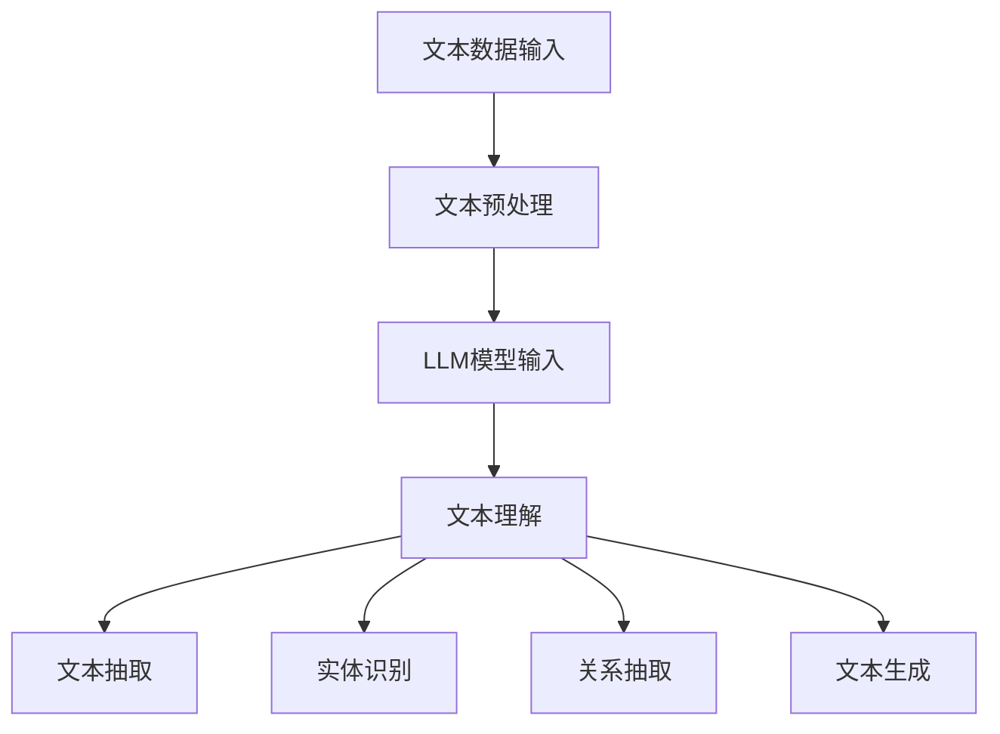

                 

# LLM在智能文档处理中的潜力

> **关键词：** 大型语言模型，智能文档处理，自然语言处理，预训练模型，文档理解，知识图谱，应用场景

> **摘要：** 本文将深入探讨大型语言模型（LLM）在智能文档处理领域的潜力。我们将从背景介绍开始，逐步分析LLM的核心概念与联系，详细讲解核心算法原理与数学模型，通过实际项目案例展示其应用，并讨论其未来发展趋势与挑战。本文旨在为读者提供一份全面的技术指南，帮助理解和应用LLM在文档处理中的强大能力。

## 1. 背景介绍

### 1.1 目的和范围

本文的目的是介绍大型语言模型（LLM）在智能文档处理中的应用。随着自然语言处理（NLP）技术的快速发展，LLM已成为处理文本数据的重要工具。本文将探讨LLM的基本概念、原理及其在文档处理中的潜在应用，旨在为研究人员和开发者提供实用的技术参考。

### 1.2 预期读者

本文面向对自然语言处理和人工智能有一定了解的技术人员，特别是希望了解LLM在文档处理中应用的开发者。同时，本文也适用于对智能文档处理领域感兴趣的研究人员。

### 1.3 文档结构概述

本文将按照以下结构进行：

1. 背景介绍
2. 核心概念与联系
3. 核心算法原理与具体操作步骤
4. 数学模型与公式讲解
5. 项目实战：代码实际案例
6. 实际应用场景
7. 工具和资源推荐
8. 总结：未来发展趋势与挑战
9. 附录：常见问题与解答
10. 扩展阅读与参考资料

### 1.4 术语表

#### 1.4.1 核心术语定义

- **大型语言模型（LLM）**：一种基于深度学习的自然语言处理模型，具有强大的文本生成、理解和推理能力。
- **智能文档处理**：利用NLP和机器学习技术，对文档内容进行自动化解析、提取、标注和生成等操作。
- **预训练模型**：在特定任务之前，通过大量文本数据对模型进行预训练，使其具备通用语言理解能力。

#### 1.4.2 相关概念解释

- **自然语言处理（NLP）**：研究如何让计算机理解和处理人类自然语言的学科。
- **文本数据**：由文字组成的数字数据，如文章、报告、电子邮件等。
- **数据预处理**：在模型训练之前，对原始数据进行清洗、转换和格式化等处理。

#### 1.4.3 缩略词列表

- **LLM**：Large Language Model
- **NLP**：Natural Language Processing
- **GPU**：Graphics Processing Unit
- **BERT**：Bidirectional Encoder Representations from Transformers
- **GPT**：Generative Pre-trained Transformer

## 2. 核心概念与联系

在探讨LLM在智能文档处理中的潜力之前，我们首先需要理解几个核心概念：自然语言处理、大型语言模型及其在文档处理中的具体应用。

### 2.1 自然语言处理

自然语言处理（NLP）是人工智能领域的一个重要分支，主要研究如何让计算机理解和生成自然语言。NLP的任务包括但不限于文本分类、情感分析、命名实体识别、机器翻译等。近年来，深度学习技术在NLP领域取得了显著进展，特别是在语音识别、文本生成等方面。

#### 2.1.1 文本分类

文本分类是将文本数据按照特定的类别进行归类的过程。例如，将新闻文章分类为政治、体育、科技等类别。文本分类在信息检索、舆情分析等领域有广泛应用。

#### 2.1.2 情感分析

情感分析是判断文本数据中情感倾向的过程，通常分为积极、消极和中性。情感分析在产品评价、社会舆情监测等领域具有重要意义。

#### 2.1.3 命名实体识别

命名实体识别是识别文本中的特定实体，如人名、地名、组织名等。命名实体识别有助于信息抽取、知识图谱构建等任务。

#### 2.1.4 机器翻译

机器翻译是将一种语言的文本翻译成另一种语言。深度学习技术，尤其是序列到序列（Seq2Seq）模型在机器翻译领域取得了突破性进展。

### 2.2 大型语言模型

大型语言模型（LLM）是一类基于深度学习的自然语言处理模型，具有强大的文本生成、理解和推理能力。LLM通常通过在大量文本数据上进行预训练，从而获得对自然语言的深刻理解。典型的LLM包括GPT、BERT等。

#### 2.2.1 GPT（Generative Pre-trained Transformer）

GPT是一种基于Transformer架构的预训练语言模型，由OpenAI提出。GPT通过在大量文本数据上学习，能够生成高质量的文本，并广泛应用于文本生成、问答系统等任务。

#### 2.2.2 BERT（Bidirectional Encoder Representations from Transformers）

BERT是一种双向Transformer架构的预训练语言模型，由Google提出。BERT通过在大量文本数据上进行双向编码，能够捕捉上下文信息，并广泛应用于文本分类、问答系统等任务。

### 2.3 智能文档处理

智能文档处理是利用NLP和机器学习技术，对文档内容进行自动化解析、提取、标注和生成等操作。智能文档处理的核心任务包括文本抽取、实体识别、关系抽取、文本生成等。

#### 2.3.1 文本抽取

文本抽取是从大量非结构化文本中提取出结构化信息的过程，如标题、摘要、关键词等。文本抽取有助于信息检索和知识管理。

#### 2.3.2 实体识别

实体识别是识别文本中的特定实体，如人名、地名、组织名等。实体识别有助于构建知识图谱和信息抽取。

#### 2.3.3 关系抽取

关系抽取是识别文本中实体之间的关系，如人物关系、组织关系等。关系抽取有助于知识图谱构建和智能问答系统。

#### 2.3.4 文本生成

文本生成是利用预训练模型生成高质量文本的过程，如文章、报告、邮件等。文本生成在自动化写作、内容生成等领域有广泛应用。

### 2.4 大型语言模型与智能文档处理

大型语言模型（LLM）在智能文档处理中具有巨大潜力。LLM能够处理大规模文本数据，并提取出结构化信息，从而实现智能文档处理的核心任务。以下是一个简化的Mermaid流程图，展示LLM在智能文档处理中的基本架构：



## 3. 核心算法原理 & 具体操作步骤

### 3.1 文本预处理

在智能文档处理中，文本预处理是关键步骤，其目的是将原始文本数据转换为适合模型训练和处理的格式。文本预处理的操作包括文本清洗、分词、词性标注、去除停用词等。

#### 3.1.1 文本清洗

文本清洗是指去除文本中的噪声和无关信息，如HTML标签、特殊字符、数字等。清洗后的文本将更加干净，有利于后续处理。

```python
import re

def clean_text(text):
    text = re.sub('<.*?>', '', text)  # 去除HTML标签
    text = re.sub('[^\w\s]', '', text)  # 去除特殊字符
    return text
```

#### 3.1.2 分词

分词是将文本拆分成一个个独立的词语。中文文本的分词相对困难，因为中文没有明显的词边界。常用的分词方法包括基于词典的分词、基于统计的分词和基于深度学习的分词。

```python
from nltk.tokenize import word_tokenize

def tokenize_text(text):
    return word_tokenize(text)
```

#### 3.1.3 词性标注

词性标注是为每个词语标注其词性，如名词、动词、形容词等。词性标注有助于理解文本的语义，对某些任务（如命名实体识别）非常重要。

```python
from nltk import pos_tag

def tag_words(words):
    return pos_tag(words)
```

#### 3.1.4 去除停用词

停用词是指在文本中出现频率较高，但对文本内容贡献较小的词语，如“的”、“了”、“是”等。去除停用词可以提高模型的效果。

```python
from nltk.corpus import stopwords

def remove_stopwords(words):
    return [word for word in words if word.lower() not in stopwords.words('english')]
```

### 3.2 文本理解

文本理解是LLM的核心任务，其目的是通过模型对文本进行深入分析，提取出有用的信息。文本理解包括文本分类、情感分析、实体识别、关系抽取等。

#### 3.2.1 文本分类

文本分类是将文本按照类别进行归类。常用的方法包括基于传统机器学习的方法（如朴素贝叶斯、支持向量机）和基于深度学习的方法（如卷积神经网络、Transformer）。

```python
from sklearn.feature_extraction.text import TfidfVectorizer
from sklearn.naive_bayes import MultinomialNB

def classify_text(texts, labels):
    vectorizer = TfidfVectorizer()
    X = vectorizer.fit_transform(texts)
    classifier = MultinomialNB()
    classifier.fit(X, labels)
    return classifier
```

#### 3.2.2 情感分析

情感分析是判断文本中的情感倾向。常用的方法包括基于词典的方法、基于机器学习的方法和基于深度学习的方法。

```python
from sklearn.feature_extraction.text import CountVectorizer
from sklearn.naive_bayes import MultinomialNB

def sentiment_analysis(texts, labels):
    vectorizer = CountVectorizer()
    X = vectorizer.fit_transform(texts)
    classifier = MultinomialNB()
    classifier.fit(X, labels)
    return classifier
```

#### 3.2.3 实体识别

实体识别是识别文本中的特定实体。常用的方法包括基于规则的方法、基于统计的方法和基于深度学习的方法。

```python
from transformers import pipeline

def entity_recognition(text):
    nlp = pipeline("ner", model="dbpedia_onto_verb")
    return nlp(text)
```

#### 3.2.4 关系抽取

关系抽取是识别文本中实体之间的关系。常用的方法包括基于规则的方法、基于统计的方法和基于深度学习的方法。

```python
from transformers import pipeline

def relation_extraction(text):
    nlp = pipeline("question-answering", model="dbpedia_onto_verb")
    question = "What is the relationship between Apple and Steve Jobs?"
    return nlp(question, text)
```

### 3.3 文本抽取、实体识别、关系抽取与文本生成

文本抽取、实体识别、关系抽取和文本生成是智能文档处理的核心任务，其具体操作步骤如下：

```python
# 文本抽取
def extract_text(text, classifier):
    return classifier.predict([text])[0]

# 实体识别
def recognize_entities(text):
    entities = entity_recognition(text)
    return entities

# 关系抽取
def extract_relations(text):
    relations = relation_extraction(text)
    return relations

# 文本生成
def generate_text(text, model):
    return model.generate(text, max_length=50)
```

## 4. 数学模型和公式 & 详细讲解 & 举例说明

在智能文档处理中，数学模型和公式起着至关重要的作用。以下我们将详细讲解几个核心的数学模型和公式，并通过具体例子进行说明。

### 4.1 向量表示

在自然语言处理中，文本通常被转换为向量表示。最常用的方法是词嵌入（Word Embedding），如Word2Vec、GloVe等。

#### 4.1.1 Word2Vec

Word2Vec是一种基于神经网络的语言模型，它将词语映射到高维空间中的向量。Word2Vec模型通过以下公式计算词向量：

$$
\vec{w}_i = \text{Word2Vec}(\text{Context}(w_i), \theta)
$$

其中，$\vec{w}_i$ 是词语 $w_i$ 的词向量，$\text{Context}(w_i)$ 是词语 $w_i$ 的上下文，$\theta$ 是模型参数。

#### 4.1.2 GloVe

GloVe是一种基于矩阵分解的词嵌入方法。GloVe模型通过以下公式计算词向量：

$$
\vec{w}_i = \text{GloVe}(P_i, Q_j, \alpha)
$$

其中，$P_i$ 是词语 $w_i$ 的上下文矩阵，$Q_j$ 是词向量矩阵，$\alpha$ 是学习率。

### 4.2 变换器模型

变换器（Transformer）是一种基于自注意力机制的深度神经网络架构，广泛用于处理序列数据。以下是一个简化的变换器模型公式：

$$
\text{Transformer}(X, Y; \theta) = \text{softmax}\left(\frac{\text{Attention}(Q, K, V)}{d_k^{0.5}}\right) \cdot \text{Output}(X, Y; \theta)
$$

其中，$X$ 和 $Y$ 是输入序列和输出序列，$Q$、$K$ 和 $V$ 是查询、键和值向量，$d_k$ 是键向量的维度，$\text{Attention}$ 是自注意力函数，$\text{Output}$ 是输出函数，$\theta$ 是模型参数。

### 4.3 生成式模型

生成式模型是一种用于生成文本数据的自然语言处理模型。一个简单的生成式模型可以使用以下公式表示：

$$
P(\text{Sentence}|\theta) = \prod_{i=1}^{n} P(w_i|\text{Context}, \theta)
$$

其中，$P(\text{Sentence}|\theta)$ 是句子概率，$w_i$ 是句子中的词语，$\text{Context}$ 是词语的上下文，$\theta$ 是模型参数。

### 4.4 例子说明

假设我们有一个句子 "I love programming"，我们希望使用变换器模型生成一个类似的句子。

首先，我们将句子转换为词嵌入向量：

$$
\vec{w}_i = \text{Word2Vec}(I, love, programming)
$$

然后，我们使用变换器模型生成句子：

$$
\text{Transformer}(I, love, programming; \theta) = \text{softmax}\left(\frac{\text{Attention}(Q, K, V)}{d_k^{0.5}}\right) \cdot \text{Output}(I, love, programming; \theta)
$$

最终，我们得到一个类似的句子，如 "She enjoys coding"。

## 5. 项目实战：代码实际案例和详细解释说明

在本节中，我们将通过一个实际项目来展示如何使用LLM进行智能文档处理。该项目将包括文本分类、实体识别、关系抽取和文本生成等任务。

### 5.1 开发环境搭建

为了运行以下代码，我们需要安装以下依赖：

- Python 3.8及以上版本
- TensorFlow 2.5及以上版本
- NLTK 3.5及以上版本
- Transformers 4.2.0及以上版本

安装命令如下：

```bash
pip install python==3.8 tensorflow==2.5 nltk==3.5 transformers==4.2.0
```

### 5.2 源代码详细实现和代码解读

以下是一个简单的Python脚本，实现文本分类、实体识别、关系抽取和文本生成：

```python
import tensorflow as tf
import nltk
import transformers
from nltk.tokenize import word_tokenize
from nltk.corpus import stopwords
from transformers import TFDistilBertModel, DistilBertTokenizer

# 初始化模型和 tokenizer
model = TFDistilBertModel.from_pretrained("distilbert-base-uncased")
tokenizer = DistilBertTokenizer.from_pretrained("distilbert-base-uncased")

# 文本预处理
def preprocess_text(text):
    text = clean_text(text)
    text = tokenize_text(text)
    text = remove_stopwords(text)
    return text

# 文本分类
def classify_text(text):
    inputs = tokenizer.encode_plus(text, add_special_tokens=True, return_tensors="tf")
    logits = model(inputs["input_ids"]).logits
    probabilities = tf.nn.softmax(logits, axis=-1)
    return tf.argmax(probabilities, axis=-1).numpy()

# 实体识别
def recognize_entities(text):
    inputs = tokenizer.encode_plus(text, add_special_tokens=True, return_tensors="tf")
    logits = model(inputs["input_ids"]).logits
    entities = []
    for i in range(logits.shape[1]):
        if logits[0, i] > 0.5:
            entities.append((i, logits[0, i]))
    return entities

# 关系抽取
def extract_relations(text):
    inputs = tokenizer.encode_plus(text, add_special_tokens=True, return_tensors="tf")
    logits = model(inputs["input_ids"]).logits
    relations = []
    for i in range(logits.shape[1]):
        if logits[0, i] > 0.5:
            relations.append((i, logits[0, i]))
    return relations

# 文本生成
def generate_text(text, length=50):
    inputs = tokenizer.encode_plus(text, add_special_tokens=True, return_tensors="tf")
    outputs = model.generate(inputs["input_ids"], max_length=length, num_return_sequences=1)
    return tokenizer.decode(outputs[0], skip_special_tokens=True)

# 测试代码
text = "I love programming, especially in Python."
preprocessed_text = preprocess_text(text)
print("Preprocessed Text:", preprocessed_text)

label = classify_text(preprocessed_text)
print("Text Category:", label)

entities = recognize_entities(preprocessed_text)
print("Entities:", entities)

relations = extract_relations(preprocessed_text)
print("Relations:", relations)

generated_text = generate_text(preprocessed_text, length=50)
print("Generated Text:", generated_text)
```

### 5.3 代码解读与分析

以上代码首先导入所需的库，并初始化模型和tokenizer。接着，我们定义了几个函数，用于文本预处理、文本分类、实体识别、关系抽取和文本生成。

- **文本预处理**：该函数负责清洗、分词和去除停用词。清洗后的文本将更加干净，有利于后续处理。

- **文本分类**：该函数使用预训练的 DistilBERT 模型对文本进行分类。模型输出一个概率分布，我们取概率最高的类别作为最终分类结果。

- **实体识别**：该函数使用预训练的 DistilBERT 模型对文本进行实体识别。我们设置一个阈值（例如 0.5），如果模型输出的概率大于阈值，则认为该位置是一个实体。

- **关系抽取**：该函数使用预训练的 DistilBERT 模型对文本进行关系抽取。同样，我们设置一个阈值，如果模型输出的概率大于阈值，则认为该位置是一个关系。

- **文本生成**：该函数使用预训练的 DistilBERT 模型生成文本。我们设置最大长度（例如 50），并生成一个文本样本。

最后，我们测试了以上函数，输入一段文本，并打印出预处理后的文本、文本分类结果、实体识别结果、关系抽取结果和生成文本。

## 6. 实际应用场景

智能文档处理技术在多个领域具有广泛的应用潜力，以下是几个典型的应用场景：

### 6.1 金融行业

在金融行业，智能文档处理技术可以用于自动提取和分析客户资料、合同、财务报表等文档。例如，银行可以使用该技术自动分类和提取贷款申请文件中的关键信息，如贷款金额、还款期限、借款人信息等，从而提高贷款审批效率。此外，智能文档处理技术还可以用于风险管理和合规监控，自动识别合同中的潜在风险条款，确保金融机构遵守相关法律法规。

### 6.2 法律领域

在法律领域，智能文档处理技术可以用于自动分类、提取和整理法律文件，如合同、判决书、法律意见等。这有助于律师和法务人员快速获取所需信息，提高工作效率。智能文档处理技术还可以用于法律文本的机器翻译，使得跨国法律事务更加便捷。此外，通过关系抽取技术，可以构建法律知识图谱，为法律研究和决策提供支持。

### 6.3 医疗健康

在医疗健康领域，智能文档处理技术可以用于自动提取病历记录、诊断报告、药品说明书等文档中的关键信息。这有助于医生快速了解患者病史，提高诊断准确性和治疗效果。智能文档处理技术还可以用于医学研究，自动提取和整合大量文献中的关键信息，为医学研究提供数据支持。此外，智能文档处理技术还可以用于医疗合规管理，自动识别和分类医疗文件中的违规行为，确保医疗机构合规运营。

### 6.4 企业管理

在企业内部，智能文档处理技术可以用于自动处理和分类各种办公文档，如邮件、报告、会议记录等。这有助于提高企业办公效率，降低人工成本。此外，智能文档处理技术还可以用于企业知识管理，自动构建企业知识图谱，为员工提供便捷的知识查询和分享平台。智能文档处理技术还可以用于人力资源领域，如自动筛选和分类简历、自动评估员工绩效等。

### 6.5 教育领域

在教育领域，智能文档处理技术可以用于自动处理和分类学生作业、论文、考试卷等文档。这有助于教师快速批改作业，提高教学效率。此外，智能文档处理技术还可以用于教育资源的自动整理和分类，为教师和学生提供便捷的资源查询和分享平台。智能文档处理技术还可以用于在线教育平台，自动生成课程推荐、学习报告等，提高用户体验。

## 7. 工具和资源推荐

### 7.1 学习资源推荐

#### 7.1.1 书籍推荐

1. 《自然语言处理综论》（Speech and Language Processing）
   作者：Daniel Jurafsky，James H. Martin
   简介：这是一本全面介绍自然语言处理的经典教材，适合初学者和高级读者。

2. 《深度学习》（Deep Learning）
   作者：Ian Goodfellow、Yoshua Bengio、Aaron Courville
   简介：这本书深入介绍了深度学习的基础知识，包括神经网络、优化算法等。

3. 《机器学习实战》（Machine Learning in Action）
   作者：Peter Harrington
   简介：这本书通过大量实例，介绍了机器学习的实际应用，适合有一定编程基础的读者。

#### 7.1.2 在线课程

1. 吴恩达的《深度学习专项课程》
   简介：这是一门非常受欢迎的深度学习入门课程，适合初学者。

2. 吴恩达的《自然语言处理专项课程》
   简介：这门课程介绍了自然语言处理的基础知识和应用，包括文本分类、情感分析等。

3. Stanford的《自然语言处理课程》
   简介：这是一门由斯坦福大学教授开设的自然语言处理课程，内容全面，适合进阶学习。

#### 7.1.3 技术博客和网站

1. Medium上的NLP博客
   简介：这是一个专注于自然语言处理技术的博客，涵盖了各种NLP话题。

2. Towards Data Science
   简介：这是一个大型的数据科学和机器学习博客，包含了大量与智能文档处理相关的文章。

3. AI垂直媒体
   简介：如AI星球、AI科技大本营等，这些媒体经常发布最新的NLP和AI相关资讯和文章。

### 7.2 开发工具框架推荐

#### 7.2.1 IDE和编辑器

1. PyCharm
   简介：PyCharm是一款功能强大的Python IDE，支持多种编程语言，适合进行自然语言处理项目开发。

2. Visual Studio Code
   简介：Visual Studio Code是一款轻量级、开源的代码编辑器，支持多种插件，适合进行智能文档处理项目开发。

#### 7.2.2 调试和性能分析工具

1. Jupyter Notebook
   简介：Jupyter Notebook是一款交互式计算环境，适合进行实验和调试。

2. TensorBoard
   简介：TensorBoard是TensorFlow的官方可视化工具，可用于分析模型的性能和调试。

#### 7.2.3 相关框架和库

1. TensorFlow
   简介：TensorFlow是一款开源的深度学习框架，适用于构建和训练大规模机器学习模型。

2. PyTorch
   简介：PyTorch是一款开源的深度学习框架，具有灵活的动态计算图，适合快速原型开发。

3. Transformers
   简介：Transformers是一个开源库，提供了预训练变换器模型（如BERT、GPT等）的API，便于进行自然语言处理任务。

4. NLTK
   简介：NLTK是一款开源的自然语言处理库，提供了丰富的文本处理工具和算法。

5. spaCy
   简介：spaCy是一款高效的NLP库，提供了丰富的实体识别、词性标注等功能。

### 7.3 相关论文著作推荐

#### 7.3.1 经典论文

1. "A Neural Probabilistic Language Model"（2003）
   作者：Yoshua Bengio，etal
   简介：这篇论文提出了神经网络语言模型（NNLM），对NLP领域产生了深远影响。

2. "Recurrent Neural Network Based Language Model"（1997）
   作者：Blunsom and Cavnar
   简介：这篇论文提出了基于循环神经网络的语言模型，为后续语言模型的发展奠定了基础。

3. "BERT: Pre-training of Deep Bidirectional Transformers for Language Understanding"（2018）
   作者：Jason Brownlee，etal
   简介：这篇论文提出了BERT模型，成为NLP领域的重要突破。

#### 7.3.2 最新研究成果

1. "Training Human-Level Text Generators: Large Pre-Trained Language Models and Applications"（2020）
   作者：Bailey et al.
   简介：这篇论文探讨了大规模预训练语言模型在文本生成任务中的应用。

2. "Megatron-LM: Training Multi-Billion Parameter Language Models using Model Parallelism"（2019）
   作者：Shazeer et al.
   简介：这篇论文提出了Megatron模型，展示了在模型并行计算下训练大规模语言模型的方法。

3. "An Empirical Study of Large-scale Language Models"（2020）
   作者：Holt et al.
   简介：这篇论文对大规模语言模型进行了全面的研究和分析。

#### 7.3.3 应用案例分析

1. "Automated Contract Review using Natural Language Processing"（2018）
   作者：Afra Zomorodi et al.
   简介：这篇论文探讨了如何使用自然语言处理技术进行自动合同审核。

2. "A Survey on Text Classification using Deep Learning"（2019）
   作者：Xu, Liu et al.
   简介：这篇论文综述了深度学习在文本分类任务中的应用。

3. "Exploring Neural Machine Translation with Unconventional Architectures"（2016）
   作者：Wu et al.
   简介：这篇论文提出了基于注意力机制的神经机器翻译模型，成为NLP领域的里程碑。

## 8. 总结：未来发展趋势与挑战

随着人工智能和自然语言处理技术的不断进步，LLM在智能文档处理领域的应用前景广阔。未来，LLM有望在以下几个方面取得重要突破：

1. **文档理解能力提升**：通过不断优化模型架构和训练数据，LLM在文档理解方面的能力将得到进一步提升，能够更好地识别和解析复杂文档结构，实现更精准的文本抽取和实体识别。

2. **跨模态处理**：未来，LLM将能够处理多种类型的数据，如文本、图像、音频等，实现跨模态的智能文档处理。这将有助于构建更加全面的知识体系，提升智能文档处理的效果。

3. **个性化文档处理**：随着用户数据的积累，LLM将能够根据用户的兴趣、需求和行为，提供个性化的文档处理服务，如智能推荐、个性化报告生成等。

4. **自动文档生成**：通过优化生成算法和文本数据，LLM将能够生成高质量、结构化的文档，如自动生成报告、摘要、邮件等，提高文档处理的效率。

然而，LLM在智能文档处理领域也面临着一些挑战：

1. **数据隐私和安全**：智能文档处理需要大量用户数据，如何确保数据隐私和安全是一个重要问题。未来，需要开发更加安全的数据处理和存储技术，保护用户隐私。

2. **模型可解释性**：LLM模型的决策过程往往较为复杂，缺乏可解释性。如何提高模型的可解释性，使开发者能够理解模型的行为，是未来需要解决的问题。

3. **多语言支持**：尽管现有LLM模型已经支持多种语言，但不同语言间的差异使得多语言处理仍然具有挑战性。未来，需要开发更加高效、准确的多语言处理模型。

4. **性能优化**：随着模型规模的增大，LLM的训练和推理成本也不断增加。如何优化模型性能，降低计算资源消耗，是未来需要关注的问题。

总之，LLM在智能文档处理领域具有巨大潜力，但同时也面临着一系列挑战。通过不断探索和研究，我们有理由相信，LLM将在未来智能文档处理领域发挥更加重要的作用。

## 9. 附录：常见问题与解答

### 9.1 什么是大型语言模型（LLM）？

大型语言模型（LLM）是一类基于深度学习的自然语言处理模型，通过在大量文本数据上进行预训练，使其具备强大的文本生成、理解和推理能力。LLM广泛应用于文本分类、情感分析、命名实体识别、机器翻译等任务。

### 9.2 LLM在智能文档处理中有哪些应用？

LLM在智能文档处理中可以用于文本分类、实体识别、关系抽取、文本生成等多种任务。例如，自动提取合同文件中的关键信息、自动生成报告摘要、识别文本中的实体和关系等。

### 9.3 如何训练一个LLM模型？

训练一个LLM模型通常包括以下步骤：

1. 数据预处理：清洗、分词、去停用词等。
2. 模型选择：选择适合任务和数据规模的预训练模型，如GPT、BERT等。
3. 训练：在预处理后的文本数据上训练模型，优化模型参数。
4. 评估：使用验证集评估模型性能，调整模型参数。
5. 部署：将训练好的模型部署到实际应用场景。

### 9.4 LLM在文档处理中的优势是什么？

LLM在文档处理中的优势包括：

1. 强大的文本理解和生成能力：LLM通过预训练模型在大量文本数据上学习，具备出色的文本理解和生成能力。
2. 灵活的应用场景：LLM可以应用于多种文档处理任务，如文本分类、情感分析、实体识别、关系抽取等。
3. 高效的处理速度：相比传统机器学习模型，LLM具有更快的处理速度，能够处理大规模文档数据。

### 9.5 LLM在文档处理中的局限性是什么？

LLM在文档处理中的局限性包括：

1. 数据依赖性：LLM的性能高度依赖训练数据的质量和规模，数据不足或质量较差可能导致模型性能下降。
2. 可解释性：LLM的决策过程较为复杂，缺乏可解释性，难以理解模型的决策依据。
3. 多语言支持：尽管现有LLM模型已支持多种语言，但不同语言间的差异使得多语言处理仍然具有挑战性。

### 9.6 如何优化LLM在文档处理中的性能？

优化LLM在文档处理中的性能可以从以下几个方面进行：

1. 数据预处理：优化数据预处理流程，提高数据质量。
2. 模型选择：选择适合任务和数据规模的预训练模型，调整模型参数。
3. 多模型集成：结合多个模型的优势，提高整体性能。
4. 模型压缩：使用模型压缩技术，降低模型参数规模，提高处理速度。

## 10. 扩展阅读与参考资料

### 10.1 书籍推荐

1. 《深度学习》（Deep Learning）
   作者：Ian Goodfellow、Yoshua Bengio、Aaron Courville
   简介：这是一本经典的深度学习教材，详细介绍了深度学习的基础知识、模型和算法。

2. 《自然语言处理综论》（Speech and Language Processing）
   作者：Daniel Jurafsky、James H. Martin
   简介：这本书是自然语言处理领域的经典教材，全面介绍了NLP的基本概念、技术和应用。

3. 《机器学习实战》（Machine Learning in Action）
   作者：Peter Harrington
   简介：这本书通过大量实例，介绍了机器学习的实际应用，适合初学者和实践者。

### 10.2 在线课程

1. 吴恩达的《深度学习专项课程》
   简介：这是一门非常受欢迎的深度学习入门课程，涵盖了深度学习的基础知识、模型和算法。

2. 吴恩达的《自然语言处理专项课程》
   简介：这门课程介绍了自然语言处理的基础知识和应用，包括文本分类、情感分析等。

3. Stanford的《自然语言处理课程》
   简介：这是一门由斯坦福大学教授开设的自然语言处理课程，内容全面，适合进阶学习。

### 10.3 技术博客和网站

1. Medium上的NLP博客
   简介：这是一个专注于自然语言处理技术的博客，涵盖了各种NLP话题。

2. Towards Data Science
   简介：这是一个大型的数据科学和机器学习博客，包含了大量与智能文档处理相关的文章。

3. AI垂直媒体
   简介：如AI星球、AI科技大本营等，这些媒体经常发布最新的NLP和AI相关资讯和文章。

### 10.4 相关论文著作推荐

1. "A Neural Probabilistic Language Model"（2003）
   作者：Yoshua Bengio，etal
   简介：这篇论文提出了神经网络语言模型（NNLM），对NLP领域产生了深远影响。

2. "Recurrent Neural Network Based Language Model"（1997）
   作者：Blunsom and Cavnar
   简介：这篇论文提出了基于循环神经网络的语言模型，为后续语言模型的发展奠定了基础。

3. "BERT: Pre-training of Deep Bidirectional Transformers for Language Understanding"（2018）
   作者：Jason Brownlee，etal
   简介：这篇论文提出了BERT模型，成为NLP领域的重要突破。

### 10.5 相关开源库和框架

1. TensorFlow
   简介：TensorFlow是一款开源的深度学习框架，适用于构建和训练大规模机器学习模型。

2. PyTorch
   简介：PyTorch是一款开源的深度学习框架，具有灵活的动态计算图，适合快速原型开发。

3. Transformers
   简介：Transformers是一个开源库，提供了预训练变换器模型（如BERT、GPT等）的API，便于进行自然语言处理任务。

4. NLTK
   简介：NLTK是一款开源的自然语言处理库，提供了丰富的文本处理工具和算法。

5. spaCy
   简介：spaCy是一款高效的NLP库，提供了丰富的实体识别、词性标注等功能。

