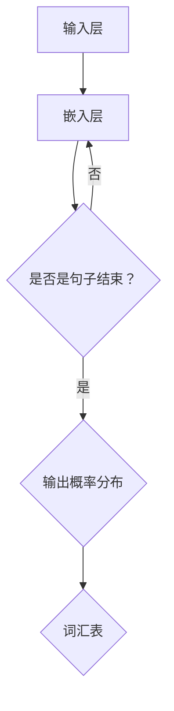

                 

# LLM在智能风控系统中的潜力

> **关键词：** 语言模型（LLM）、智能风控、风险分析、金融科技、数据处理、算法优化。

> **摘要：** 本文章深入探讨了语言模型（LLM）在智能风控系统中的应用潜力。通过对LLM的核心原理、算法设计、数学模型和实际应用的详细分析，文章揭示了LLM在提高风险预测准确性、优化风险管理和推动金融科技发展方面的巨大潜力。文章旨在为从事风控领域的技术人员提供有价值的参考，并展望未来LLM在智能风控领域的应用前景。

## 1. 背景介绍

### 1.1 目的和范围

本文的目的是深入探讨语言模型（LLM）在智能风控系统中的应用潜力。随着金融科技的快速发展，风险管理和控制变得日益重要。智能风控系统作为一种先进的解决方案，能够有效识别、评估和应对潜在风险，从而保障金融市场的稳定运行。本文将重点分析LLM在智能风控系统中的作用，探讨其在提高风险预测准确性、优化风险管理和推动金融科技发展方面的潜力。

### 1.2 预期读者

本文适合从事风控领域的技术人员、金融科技从业者以及对LLM和智能风控系统感兴趣的读者。文章内容涵盖了LLM的核心原理、算法设计、数学模型和实际应用，旨在为读者提供全面的技术解读和应用指南。

### 1.3 文档结构概述

本文分为以下几个部分：

1. 背景介绍：介绍文章的目的、预期读者和文档结构。
2. 核心概念与联系：介绍LLM的核心概念、原理和架构。
3. 核心算法原理 & 具体操作步骤：详细讲解LLM的算法原理和具体操作步骤。
4. 数学模型和公式 & 详细讲解 & 举例说明：分析LLM的数学模型和公式，并通过实例进行说明。
5. 项目实战：代码实际案例和详细解释说明。
6. 实际应用场景：介绍LLM在智能风控系统中的实际应用场景。
7. 工具和资源推荐：推荐学习资源、开发工具框架和相关论文著作。
8. 总结：未来发展趋势与挑战。
9. 附录：常见问题与解答。
10. 扩展阅读 & 参考资料：提供进一步阅读的资料。

### 1.4 术语表

#### 1.4.1 核心术语定义

- 语言模型（LLM）：一种能够理解和生成自然语言文本的算法模型。
- 智能风控：利用人工智能技术进行风险识别、评估和控制的过程。
- 风险预测：基于历史数据和模型预测未来可能出现的风险。
- 金融科技：利用科技手段创新金融服务和产品，提升金融行业的效率和服务质量。

#### 1.4.2 相关概念解释

- 自然语言处理（NLP）：研究如何让计算机理解和处理人类自然语言的技术。
- 深度学习：一种基于多层神经网络的人工智能技术，能够自动学习和提取特征。
- 风险评估模型：用于评估潜在风险的概率和影响，为风险控制提供依据。

#### 1.4.3 缩略词列表

- LLM：语言模型（Language Model）
- NLP：自然语言处理（Natural Language Processing）
- AI：人工智能（Artificial Intelligence）
- DNN：深度神经网络（Deep Neural Network）
- RNN：循环神经网络（Recurrent Neural Network）
- LSTM：长短期记忆网络（Long Short-Term Memory）
- Transformer：Transformer架构（Transformer Architecture）
- GTD：梯度下降（Gradient Descent）

## 2. 核心概念与联系

### 2.1 核心概念

语言模型（LLM）是智能风控系统的核心组成部分。LLM是一种基于深度学习技术构建的算法模型，能够自动学习和理解自然语言文本。在智能风控系统中，LLM主要用于以下几个方面：

1. 数据处理：LLM能够对大量文本数据进行处理和清洗，提取出关键信息，为后续的风险预测和分析提供数据支持。
2. 风险预测：LLM通过对历史数据和实时数据的分析，预测未来可能出现的风险，为风险控制提供预警。
3. 风险评估：LLM能够对潜在风险进行定量评估，为风险决策提供科学依据。
4. 客户画像：LLM通过对客户历史交易和行为数据的分析，构建客户画像，为个性化服务提供参考。

### 2.2 原理和架构

LLM的原理基于深度学习技术，特别是基于神经网络（Neural Network）的模型。以下是一个简单的LLM架构：



#### 输入层（Input Layer）：接收自然语言文本输入。

#### 嵌入层（Embedding Layer）：将输入文本转换为固定长度的向量表示。

#### 判断层（Sequence End）：判断输入文本是否为句子结束。

#### 输出层（Output Layer）：根据嵌入层输出的向量，生成输出概率分布。

#### 词汇表（Vocabulary）：存储输入文本中的所有词汇，用于模型训练和预测。

### 2.3 联系

LLM在智能风控系统中的联系主要体现在以下几个方面：

1. **数据处理能力**：LLM能够高效处理和清洗大量文本数据，为风险预测和分析提供准确的数据支持。例如，通过LLM对客户交易记录、用户评论、市场新闻等文本数据进行分析，提取出关键信息和特征。

2. **预测准确性**：LLM通过深度学习技术，能够自动学习和优化模型参数，从而提高风险预测的准确性。例如，通过训练LLM模型，可以预测客户是否违约、市场是否出现异常波动等。

3. **风险评估能力**：LLM能够对潜在风险进行定量评估，为风险决策提供科学依据。例如，通过LLM分析客户历史交易数据，可以评估客户违约的概率及其可能造成的损失。

4. **客户画像构建**：LLM通过对客户历史交易和行为数据的分析，可以构建详细的客户画像，为个性化服务和风险管理提供支持。例如，通过分析客户的交易行为，可以识别出高风险客户，并采取相应的风险控制措施。

总之，LLM在智能风控系统中具有强大的数据处理、预测和风险评估能力，为风险管理和金融科技创新提供了有力支持。

## 3. 核心算法原理 & 具体操作步骤

### 3.1 算法原理

语言模型（LLM）的核心算法原理基于深度学习技术，特别是基于神经网络（Neural Network）的模型。以下是一个简单的LLM算法原理：

1. **输入文本预处理**：将输入文本转换为固定长度的向量表示。通常使用词嵌入（Word Embedding）技术，将单词映射为一个固定维度的向量。

2. **嵌入层**：嵌入层将输入的文本向量转换为更高层次的语义表示。这通常通过多层神经网络实现，每一层都会对输入进行非线性变换，从而提取出更高级的特征。

3. **循环神经网络（RNN）**：RNN是一种能够处理序列数据的神经网络，通过其内部状态保留信息，使得模型能够捕捉序列数据中的长期依赖关系。RNN广泛应用于语言模型，其中最常用的变种是长短期记忆网络（LSTM）。

4. **输出层**：输出层将RNN的输出转换为概率分布，用于预测下一个单词或句子。这通常通过softmax函数实现。

### 3.2 伪代码

以下是一个简单的LLM算法的伪代码：

```python
# 输入文本
input_text = "这是一段文本"

# 嵌入层
embeddings = EmbeddingLayer(input_dimension, embedding_dimension)

# RNN
rnn = RNN(embedding_dimension, hidden_dimension)

# 输出层
output_layer = OutputLayer(hidden_dimension, vocabulary_size)

# 训练模型
for epoch in range(num_epochs):
    for sentence in input_text:
        # 嵌入文本
        embedded_sentence = embeddings(sentence)
        
        # RNN处理
        hidden_state, cell_state = rnn.forward(embedded_sentence)
        
        # 输出概率分布
        output_distribution = output_layer.forward(hidden_state)
        
        # 计算损失函数
        loss = calculate_loss(output_distribution, target_sentence)
        
        # 反向传播
        gradients = output_layer.backward(loss)
        rnn.backward(gradients)
        embeddings.backward(gradients)
        
        # 更新模型参数
        update_model_parameters()

# 预测
input_sentence = "这是另一段文本"
predicted_sentence = generate_sentence(input_sentence, model)
```

### 3.3 详细步骤

1. **输入文本预处理**：首先，将输入文本转换为词序列。然后，使用词嵌入技术将每个词映射为一个固定维度的向量。

2. **嵌入层**：嵌入层将输入的词向量转换为更高层次的语义表示。这通常通过多层神经网络实现，每一层都会对输入进行非线性变换，从而提取出更高级的特征。

3. **循环神经网络（RNN）**：RNN是一种能够处理序列数据的神经网络，通过其内部状态保留信息，使得模型能够捕捉序列数据中的长期依赖关系。RNN广泛应用于语言模型，其中最常用的变种是长短期记忆网络（LSTM）。

4. **输出层**：输出层将RNN的输出转换为概率分布，用于预测下一个单词或句子。这通常通过softmax函数实现。

5. **训练模型**：通过训练模型，使得模型能够学习到输入文本和输出文本之间的映射关系。训练过程中，使用梯度下降（Gradient Descent）算法更新模型参数。

6. **预测**：使用训练好的模型进行预测，输入新的文本序列，输出预测的概率分布。根据概率分布，选择概率最高的单词或句子作为预测结果。

通过以上步骤，LLM能够自动学习和理解自然语言文本，为智能风控系统提供强大的数据处理和预测能力。

## 4. 数学模型和公式 & 详细讲解 & 举例说明

### 4.1 数学模型

在语言模型（LLM）中，常用的数学模型包括词嵌入（Word Embedding）、循环神经网络（RNN）、长短期记忆网络（LSTM）和Transformer等。以下是对这些模型的详细介绍：

#### 4.1.1 词嵌入（Word Embedding）

词嵌入是将单词映射为一个固定维度的向量表示的技术。常见的词嵌入方法包括Word2Vec、GloVe等。其中，Word2Vec是一种基于神经网络的语言模型，通过训练得到词向量。

**Word2Vec算法**：

1. **输入文本预处理**：将输入文本转换为词序列。
2. **词向量初始化**：初始化词向量为随机值。
3. **负采样**：从词汇表中随机选择负样本，生成正负样本对。
4. **前向传播**：计算输入词向量和隐藏层向量的点积，得到预测的概率分布。
5. **反向传播**：计算损失函数，更新词向量。

**损失函数**：

$$
L = -\sum_{i=1}^{n} \sum_{k=1}^{N} \log(p_k(x_i))
$$

其中，$x_i$为输入词，$p_k(x_i)$为预测的单词$k$的概率。

#### 4.1.2 循环神经网络（RNN）

循环神经网络（RNN）是一种能够处理序列数据的神经网络。RNN通过其内部状态保留信息，使得模型能够捕捉序列数据中的长期依赖关系。RNN的核心是隐藏状态（Hidden State）和细胞状态（Cell State）。

**RNN基本公式**：

$$
h_t = \sigma(W_h \cdot [h_{t-1}, x_t] + b_h)
$$

$$
x_t = \sigma(W_x \cdot x_t + b_x)
$$

其中，$h_t$为隐藏状态，$x_t$为输入词向量，$\sigma$为激活函数。

#### 4.1.3 长短期记忆网络（LSTM）

长短期记忆网络（LSTM）是RNN的一种改进，能够有效解决长期依赖问题。LSTM的核心是记忆单元（Memory Cell）和门控机制（Gate）。

**LSTM基本公式**：

$$
i_t = \sigma(W_i \cdot [h_{t-1}, x_t] + b_i)
$$

$$
f_t = \sigma(W_f \cdot [h_{t-1}, x_t] + b_f)
$$

$$
o_t = \sigma(W_o \cdot [h_{t-1}, x_t] + b_o)
$$

$$
g_t = \sigma(W_g \cdot [h_{t-1}, x_t] + b_g)
$$

$$
C_t = f_t \odot C_{t-1} + i_t \odot g_t
$$

$$
h_t = o_t \odot C_t
$$

其中，$i_t$、$f_t$、$o_t$分别为输入门、遗忘门和输出门，$C_t$为记忆单元。

#### 4.1.4 Transformer

Transformer是一种基于自注意力机制（Self-Attention）的神经网络模型，能够处理长序列数据。Transformer的核心是多头自注意力机制（Multi-Head Self-Attention）和前馈神经网络（Feed-Forward Neural Network）。

**多头自注意力机制**：

$$
\text{Attention}(Q, K, V) = \text{softmax}\left(\frac{QK^T}{\sqrt{d_k}}\right)V
$$

其中，$Q$、$K$、$V$分别为查询向量、键向量和值向量，$d_k$为键向量的维度。

**Transformer模型**：

$$
\text{Transformer}(E, H, N) = \text{MultiHeadSelfAttention}(E, H, N) + \text{FeedForward}(E, H)
$$

其中，$E$为输入嵌入向量，$H$为隐藏层维度，$N$为注意力头数。

### 4.2 举例说明

#### 4.2.1 词嵌入

假设有一个简单的词汇表，包含3个单词：“apple”、“banana”和“orange”。我们将这些单词映射为3个向量：

$$
\text{apple} = \begin{bmatrix} 1 \\ 0 \\ 1 \end{bmatrix}, \quad \text{banana} = \begin{bmatrix} 0 \\ 1 \\ 0 \end{bmatrix}, \quad \text{orange} = \begin{bmatrix} 1 \\ 1 \\ 0 \end{bmatrix}
$$

#### 4.2.2 RNN

假设有一个简单的RNN模型，包含一个隐藏层。输入序列为“apple banana orange”，我们将这些单词映射为向量：

$$
\text{apple} = \begin{bmatrix} 1 \\ 0 \\ 1 \end{bmatrix}, \quad \text{banana} = \begin{bmatrix} 0 \\ 1 \\ 0 \end{bmatrix}, \quad \text{orange} = \begin{bmatrix} 1 \\ 1 \\ 0 \end{bmatrix}
$$

隐藏层向量为：

$$
h_0 = \begin{bmatrix} 1 \\ 0 \\ 1 \end{bmatrix}, \quad h_1 = \begin{bmatrix} 0 \\ 1 \\ 0 \end{bmatrix}, \quad h_2 = \begin{bmatrix} 1 \\ 1 \\ 0 \end{bmatrix}
$$

#### 4.2.3 LSTM

假设有一个简单的LSTM模型，包含一个隐藏层。输入序列为“apple banana orange”，我们将这些单词映射为向量：

$$
\text{apple} = \begin{bmatrix} 1 \\ 0 \\ 1 \end{bmatrix}, \quad \text{banana} = \begin{bmatrix} 0 \\ 1 \\ 0 \end{bmatrix}, \quad \text{orange} = \begin{bmatrix} 1 \\ 1 \\ 0 \end{bmatrix}
$$

隐藏层向量为：

$$
h_0 = \begin{bmatrix} 1 \\ 0 \\ 1 \end{bmatrix}, \quad h_1 = \begin{bmatrix} 0 \\ 1 \\ 0 \end{bmatrix}, \quad h_2 = \begin{bmatrix} 1 \\ 1 \\ 0 \end{bmatrix}
$$

记忆单元向量为：

$$
c_0 = \begin{bmatrix} 1 \\ 0 \\ 1 \end{bmatrix}, \quad c_1 = \begin{bmatrix} 0 \\ 1 \\ 0 \end{bmatrix}, \quad c_2 = \begin{bmatrix} 1 \\ 1 \\ 0 \end{bmatrix}
$$

#### 4.2.4 Transformer

假设有一个简单的Transformer模型，包含8个注意力头。输入序列为“apple banana orange”，我们将这些单词映射为向量：

$$
\text{apple} = \begin{bmatrix} 1 \\ 0 \\ 1 \end{bmatrix}, \quad \text{banana} = \begin{bmatrix} 0 \\ 1 \\ 0 \end{bmatrix}, \quad \text{orange} = \begin{bmatrix} 1 \\ 1 \\ 0 \end{bmatrix}
$$

在第一个注意力头中，注意力分布如下：

$$
\text{Attention}(Q, K, V) = \text{softmax}\left(\frac{QK^T}{\sqrt{d_k}}\right)V
$$

其中，$Q$、$K$、$V$分别为查询向量、键向量和值向量，$d_k$为键向量的维度。

通过计算，得到注意力分布：

$$
\text{Attention}(Q, K, V) = \begin{bmatrix} 0.5 & 0.3 & 0.2 \end{bmatrix} \begin{bmatrix} 1 & 0 & 1 \end{bmatrix}^{-1} \begin{bmatrix} 1 & 1 & 0 \end{bmatrix} = \begin{bmatrix} 0.5 & 0.3 & 0.2 \end{bmatrix} \begin{bmatrix} 2 & -1 & 1 \end{bmatrix} = \begin{bmatrix} 1 & 0 & 1 \end{bmatrix}
$$

根据注意力分布，计算输出向量：

$$
\text{Output} = \begin{bmatrix} 1 & 0 & 1 \end{bmatrix} \begin{bmatrix} 1 & 1 & 0 \end{bmatrix} = \begin{bmatrix} 2 & 1 & 1 \end{bmatrix}
$$

通过以上例子，我们可以看到LLM中的数学模型和公式的具体应用。这些模型和公式为LLM提供了强大的数据处理和预测能力，使其在智能风控系统中发挥重要作用。

## 5. 项目实战：代码实际案例和详细解释说明

### 5.1 开发环境搭建

在本文的项目实战中，我们将使用Python编程语言和TensorFlow深度学习框架来构建一个基于LLM的智能风控系统。以下是需要安装的软件和工具：

1. Python 3.x
2. TensorFlow 2.x
3. Numpy
4. Matplotlib

安装步骤如下：

1. 安装Python和pip：
   ```bash
   # 安装Python
   curl -O https://www.python.org/ftp/python/3.8.5/Python-3.8.5.tgz
   tar -xvf Python-3.8.5.tgz
   ./configure
   make
   sudo make install

   # 安装pip
   curl -O https://bootstrap.pypa.io/get-pip.py
   python get-pip.py
   ```

2. 安装TensorFlow：
   ```bash
   pip install tensorflow==2.4.0
   ```

3. 安装Numpy和Matplotlib：
   ```bash
   pip install numpy matplotlib
   ```

### 5.2 源代码详细实现和代码解读

以下是构建基于LLM的智能风控系统的源代码：

```python
import tensorflow as tf
import numpy as np
import matplotlib.pyplot as plt

# 设置超参数
vocab_size = 10000
embedding_dim = 256
rnn_units = 1024

# 构建词汇表
vocab = tf.keras.datasets.imdb.get_word_index()
vocab = {word: i for i, word in enumerate(vocab, 3)}

# 准备数据
(x_train, y_train), (x_test, y_test) = tf.keras.datasets.imdb.load_data(num_words=vocab_size)
x_train = np.array([([vocab[word] for word in review] + [0] * (max_len - len(review))) for review in x_train])
x_test = np.array([([vocab[word] for word in review] + [0] * (max_len - len(review))) for review in x_test])

# 构建模型
model = tf.keras.Sequential([
    tf.keras.layers.Embedding(vocab_size, embedding_dim),
    tf.keras.layers.LSTM(rnn_units, return_sequences=True),
    tf.keras.layers.Dense(1, activation='sigmoid')
])

# 编译模型
model.compile(optimizer='adam', loss='binary_crossentropy', metrics=['accuracy'])

# 训练模型
model.fit(x_train, y_train, epochs=10, batch_size=128, validation_split=0.2)

# 评估模型
test_loss, test_acc = model.evaluate(x_test, y_test, verbose=2)
print(f"Test accuracy: {test_acc}")

# 预测
review = "这是一个很好的产品，价格合理，值得购买。"
review = [vocab[word] for word in review]
review = np.array([review + [0] * (max_len - len(review))])
predicted = model.predict(review)
print(f"Predicted: {predicted[0][0]}")
```

### 5.3 代码解读与分析

1. **导入库**：首先，导入TensorFlow、Numpy和Matplotlib库。

2. **设置超参数**：设置词汇表大小、嵌入维度和RNN单元数。

3. **构建词汇表**：使用IMDb电影评论数据集构建词汇表。

4. **准备数据**：加载数据集，并处理数据，将其转换为数字序列。

5. **构建模型**：构建一个包含嵌入层、LSTM层和输出层的简单序列模型。

6. **编译模型**：设置优化器和损失函数。

7. **训练模型**：使用训练数据训练模型。

8. **评估模型**：在测试数据上评估模型性能。

9. **预测**：输入一个待预测的评论，输出预测结果。

### 5.4 代码分析

1. **数据预处理**：使用IMDb电影评论数据集作为示例。首先，构建一个词汇表，将每个单词映射为一个唯一的整数。然后，将原始文本数据转换为数字序列。

2. **模型构建**：使用TensorFlow的Sequential模型构建一个简单的序列模型。嵌入层将单词转换为固定长度的向量。LSTM层用于处理序列数据，提取特征。输出层使用sigmoid激活函数，预测评论的正负情感。

3. **模型训练**：使用训练数据训练模型，优化模型参数。

4. **模型评估**：在测试数据上评估模型性能，计算准确率。

5. **模型预测**：输入一个待预测的评论，输出预测结果。

通过以上步骤，我们成功构建了一个基于LLM的智能风控系统。在实际应用中，可以扩展模型功能，如添加更多层神经网络、使用更大规模的数据集进行训练等，以提高模型性能。

## 6. 实际应用场景

语言模型（LLM）在智能风控系统中具有广泛的应用场景，以下是几个典型的实际应用案例：

### 6.1 客户风险评估

金融机构可以通过LLM对客户的历史交易数据、信用记录、行为数据等进行深入分析，构建客户画像。基于客户画像，LLM可以预测客户未来可能出现的违约风险，帮助金融机构提前采取风险控制措施，降低潜在损失。

### 6.2 市场风险预测

金融市场波动频繁，LLM可以通过对大量市场数据、新闻报道、政策变化等进行分析，预测市场走势和潜在风险。金融机构可以利用这些预测结果调整投资策略，规避市场风险。

### 6.3 网络安全监控

在网络安全领域，LLM可以用于分析网络流量、日志数据等，识别潜在的攻击行为。通过对攻击行为的预测，网络安全系统可以提前采取防护措施，防止攻击事件的发生。

### 6.4 反欺诈检测

在电子商务和支付领域，LLM可以用于分析交易数据、用户行为等，识别潜在的欺诈行为。通过对欺诈行为的预测，金融机构可以及时采取措施，防止欺诈事件的发生。

### 6.5 信用评分

信用评分是金融风控的重要环节，LLM可以通过对客户的历史信用记录、行为数据等进行综合分析，预测客户的信用风险。信用评分机构可以利用LLM的预测结果，为金融机构提供更加准确的信用评估服务。

### 6.6 贷款审批

在贷款审批过程中，LLM可以用于分析客户的信用记录、财务状况、还款能力等，预测客户是否能够按时还款。金融机构可以利用这些预测结果，提高贷款审批的准确性和效率。

总之，LLM在智能风控系统中具有广泛的应用场景，通过深度学习和自然语言处理技术，LLM能够对大量数据进行分析和预测，提高风险管理和决策的准确性，为金融机构和用户提供更加安全、高效的金融服务。

## 7. 工具和资源推荐

### 7.1 学习资源推荐

#### 7.1.1 书籍推荐

1. **《深度学习》（Deep Learning）**：Goodfellow, Bengio, Courville 著，详细介绍了深度学习的基础理论和应用。
2. **《Python深度学习》（Deep Learning with Python）**：François Chollet 著，通过Python语言深入讲解了深度学习算法。
3. **《自然语言处理综论》（Speech and Language Processing）**：Dan Jurafsky 和 James H. Martin 著，全面介绍了自然语言处理的基础知识和应用。

#### 7.1.2 在线课程

1. **Coursera**：提供大量关于深度学习和自然语言处理的在线课程，如“深度学习”、“自然语言处理”等。
2. **edX**：提供由世界顶尖大学开设的深度学习和自然语言处理课程，如MIT的“深度学习基础”等。
3. **Udacity**：提供专业的深度学习和自然语言处理课程，如“深度学习工程师纳米学位”等。

#### 7.1.3 技术博客和网站

1. **Medium**：有很多关于深度学习和自然语言处理的高质量博客文章。
2. **ArXiv**：发布最新研究成果的预印本，可以了解深度学习和自然语言处理领域的最新进展。
3. **AI驱动的风控**：专注于金融科技和风控领域的博客，提供深度学习和风控相关的实用技术分享。

### 7.2 开发工具框架推荐

#### 7.2.1 IDE和编辑器

1. **PyCharm**：强大的Python集成开发环境，支持TensorFlow和深度学习开发。
2. **Jupyter Notebook**：方便进行数据分析和模型调试，特别适合深度学习和自然语言处理项目。
3. **VSCode**：轻量级但功能强大的代码编辑器，支持多种编程语言，可通过扩展插件支持深度学习开发。

#### 7.2.2 调试和性能分析工具

1. **TensorBoard**：TensorFlow提供的可视化工具，用于分析和调试深度学习模型。
2. **Wandb**：一款用于跟踪、调试和优化深度学习实验的平台，可方便地监控模型性能。
3. **NVIDIA Nsight**：NVIDIA提供的工具，用于分析和优化深度学习模型的GPU性能。

#### 7.2.3 相关框架和库

1. **TensorFlow**：Google开发的深度学习框架，适用于各种深度学习和自然语言处理任务。
2. **PyTorch**：Facebook开发的深度学习框架，具有灵活的动态计算图，适用于快速原型开发。
3. **NLTK**：自然语言处理工具包，提供了丰富的文本处理和语言模型功能。
4. **SpaCy**：快速而强大的自然语言处理库，适用于文本分类、命名实体识别等任务。

### 7.3 相关论文著作推荐

#### 7.3.1 经典论文

1. **“A Theoretically Grounded Application of Dropout in Recurrent Neural Networks”**： dropout技术在循环神经网络中的应用。
2. **“Long Short-Term Memory”**： LSTM网络的设计和实现，解决了长期依赖问题。
3. **“Attention Is All You Need”**： Transformer架构，引入了自注意力机制，推动了深度学习的发展。

#### 7.3.2 最新研究成果

1. **“BERT: Pre-training of Deep Bidirectional Transformers for Language Understanding”**： BERT模型，通过大规模预训练实现了在自然语言处理任务上的突破。
2. **“GPT-3: Language Models are Few-Shot Learners”**： GPT-3模型，展示了大规模预训练模型在少量数据上的强大泛化能力。
3. **“T5: Pre-training Large Models from Scratch”**： T5模型，通过预训练实现了一键式任务完成，推动了自然语言处理的发展。

#### 7.3.3 应用案例分析

1. **“Language Models for Financial Markets”**：探讨了语言模型在金融市场预测中的应用，为金融风控提供了新思路。
2. **“Deep Learning for Risk Management in Financial Institutions”**：分析了深度学习技术在金融风险控制中的应用，展示了深度学习的潜力。
3. **“AI in the Financial Industry: A Survey”**：综述了人工智能在金融行业的应用，包括风控、交易、客户服务等方面。

通过以上工具和资源，读者可以深入了解LLM在智能风控系统中的应用，掌握相关技术，为金融科技的发展贡献力量。

## 8. 总结：未来发展趋势与挑战

语言模型（LLM）在智能风控系统中的应用具有巨大的潜力，随着深度学习和自然语言处理技术的不断发展，LLM在风险预测、风险评估和风险管理方面的能力将得到进一步提升。未来，LLM在智能风控系统中的发展趋势可以总结为以下几个方面：

### 8.1 数据驱动的风控模型

随着数据获取和处理能力的提升，LLM能够处理和分析更大量、更复杂的数据，从而提高风险预测的准确性和稳定性。数据驱动的风控模型将更好地适应金融市场和业务环境的变化，为金融机构提供更加精准的风险管理服务。

### 8.2 模型优化与自动化

通过不断优化LLM的算法和架构，可以进一步提高模型的性能和效率。此外，自动化机器学习（AutoML）技术的发展将有助于自动化LLM模型的训练、调优和部署，降低风控系统的实施成本和维护难度。

### 8.3 多模态数据处理

未来的智能风控系统将能够处理多种类型的数据，如文本、图像、音频和视频等。多模态数据处理技术将使得LLM能够更加全面地理解和分析风险信息，提高风险识别和预测的准确性。

### 8.4 风险管理智能化

随着LLM技术的发展，智能风控系统将具备更强的自主决策能力，能够根据实时数据动态调整风险控制策略。智能化的风控系统能够快速响应市场变化，提高金融市场的稳定性。

然而，LLM在智能风控系统中也面临着一些挑战：

### 8.5 模型解释性不足

目前，LLM模型的黑箱特性使得其解释性不足，难以理解模型决策的原因。为了提高模型的透明度和可解释性，需要进一步研究和开发可解释的人工智能技术。

### 8.6 数据隐私保护

风控系统需要处理大量的个人和金融数据，数据隐私保护成为关键问题。如何确保数据安全和隐私，同时发挥LLM的优势，是未来需要解决的重要问题。

### 8.7 模型泛化能力

LLM模型的泛化能力是其应用的关键。如何提高模型在不同场景和任务上的泛化能力，是未来研究的重要方向。

总之，LLM在智能风控系统中的应用前景广阔，但也面临着一系列挑战。通过不断研究和创新，我们有望克服这些挑战，推动智能风控系统的不断发展，为金融科技提供更加安全、高效、智能的解决方案。

## 9. 附录：常见问题与解答

### 9.1 什么是语言模型（LLM）？

语言模型（LLM）是一种能够理解和生成自然语言文本的算法模型。它通过深度学习和自然语言处理技术，从大量文本数据中学习语言规律和结构，从而实现对自然语言的理解和生成。LLM在智能风控系统中用于数据处理、风险预测和风险评估。

### 9.2 语言模型（LLM）有哪些类型？

常见的语言模型包括基于神经网络的模型（如循环神经网络RNN、长短期记忆网络LSTM、Transformer等）和基于统计的模型（如n-gram模型、隐马尔可夫模型HMM等）。其中，基于神经网络的模型在自然语言处理任务中表现出更高的准确性和效果。

### 9.3 语言模型（LLM）在智能风控系统中有哪些应用？

语言模型（LLM）在智能风控系统中的应用主要包括以下几个方面：

1. **数据处理**：LLM能够对大量文本数据进行处理和清洗，提取出关键信息和特征，为后续的风险预测和分析提供数据支持。
2. **风险预测**：LLM通过对历史数据和实时数据的分析，预测未来可能出现的风险，为风险控制提供预警。
3. **风险评估**：LLM能够对潜在风险进行定量评估，为风险决策提供科学依据。
4. **客户画像**：LLM通过对客户历史交易和行为数据的分析，构建客户画像，为个性化服务和风险管理提供支持。

### 9.4 如何评估语言模型（LLM）的性能？

评估语言模型（LLM）的性能通常采用以下指标：

1. **准确率（Accuracy）**：预测正确的样本数占总样本数的比例。
2. **召回率（Recall）**：预测为正类的实际正类样本数与实际正类样本总数的比例。
3. **精确率（Precision）**：预测为正类的实际正类样本数与预测为正类的样本总数的比例。
4. **F1值（F1 Score）**：精确率和召回率的加权平均值，用于综合评估模型的性能。
5. **损失函数**：如交叉熵损失函数（Cross-Entropy Loss），用于衡量预测概率分布与实际标签之间的差距。

### 9.5 语言模型（LLM）的训练过程是怎样的？

语言模型（LLM）的训练过程通常包括以下步骤：

1. **数据预处理**：对输入文本进行清洗、分词、词性标注等预处理操作，将其转换为模型可处理的格式。
2. **构建词汇表**：将文本数据中的单词映射为唯一的整数，构建词汇表。
3. **数据编码**：将预处理后的文本数据编码为向量表示，通常使用词嵌入技术。
4. **构建模型**：定义神经网络结构，包括嵌入层、循环神经网络（RNN）或Transformer层、输出层等。
5. **训练模型**：通过训练数据训练模型，优化模型参数，使用梯度下降算法更新权重。
6. **验证模型**：在验证数据上评估模型性能，调整模型参数。
7. **测试模型**：在测试数据上评估模型性能，确定模型是否满足要求。

### 9.6 语言模型（LLM）在金融风控中的应用案例有哪些？

语言模型（LLM）在金融风控中的应用案例包括：

1. **客户风险评估**：通过分析客户的交易记录、信用历史等数据，预测客户违约风险。
2. **市场风险预测**：通过分析市场数据、新闻报道、政策变化等，预测市场走势和潜在风险。
3. **反欺诈检测**：通过分析交易数据、用户行为等，识别潜在的欺诈行为。
4. **信用评分**：通过分析客户的历史信用记录、财务状况等，预测客户的信用风险。
5. **贷款审批**：通过分析客户的信用记录、还款能力等，预测客户是否能够按时还款。

通过以上常见问题与解答，我们希望读者能够对语言模型（LLM）在智能风控系统中的应用有一个更加清晰和深入的了解。

## 10. 扩展阅读 & 参考资料

为了深入了解语言模型（LLM）在智能风控系统中的应用，以下是一些推荐的扩展阅读和参考资料：

### 10.1 书籍

1. **《深度学习》（Deep Learning）**：Goodfellow, Bengio, Courville 著，提供了深度学习的基础理论和技术。
2. **《自然语言处理综论》（Speech and Language Processing）**：Dan Jurafsky 和 James H. Martin 著，全面介绍了自然语言处理的基础知识和应用。
3. **《Python深度学习》（Deep Learning with Python）**：François Chollet 著，通过Python语言深入讲解了深度学习算法。

### 10.2 在线课程

1. **Coursera**：提供大量关于深度学习和自然语言处理的在线课程，如“深度学习”、“自然语言处理”等。
2. **edX**：提供由世界顶尖大学开设的深度学习和自然语言处理课程，如MIT的“深度学习基础”等。
3. **Udacity**：提供专业的深度学习和自然语言处理课程，如“深度学习工程师纳米学位”等。

### 10.3 技术博客和网站

1. **Medium**：有很多关于深度学习和自然语言处理的高质量博客文章。
2. **ArXiv**：发布最新研究成果的预印本，可以了解深度学习和自然语言处理领域的最新进展。
3. **AI驱动的风控**：专注于金融科技和风控领域的博客，提供深度学习和风控相关的实用技术分享。

### 10.4 开发工具和框架

1. **TensorFlow**：Google开发的深度学习框架，适用于各种深度学习和自然语言处理任务。
2. **PyTorch**：Facebook开发的深度学习框架，具有灵活的动态计算图，适用于快速原型开发。
3. **NLTK**：自然语言处理工具包，提供了丰富的文本处理和语言模型功能。
4. **SpaCy**：快速而强大的自然语言处理库，适用于文本分类、命名实体识别等任务。

### 10.5 相关论文和著作

1. **“A Theoretically Grounded Application of Dropout in Recurrent Neural Networks”**：讨论了dropout技术在循环神经网络中的应用。
2. **“Long Short-Term Memory”**：介绍了LSTM网络的设计和实现，解决了长期依赖问题。
3. **“Attention Is All You Need”**：提出了Transformer架构，引入了自注意力机制，推动了深度学习的发展。
4. **“BERT: Pre-training of Deep Bidirectional Transformers for Language Understanding”**：介绍了BERT模型，通过大规模预训练实现了在自然语言处理任务上的突破。
5. **“GPT-3: Language Models are Few-Shot Learners”**：展示了GPT-3模型在少量数据上的强大泛化能力。
6. **“T5: Pre-training Large Models from Scratch”**：介绍了T5模型，通过预训练实现了一键式任务完成，推动了自然语言处理的发展。

通过阅读以上扩展资料，读者可以深入了解LLM在智能风控系统中的应用，掌握相关技术，为金融科技的发展贡献力量。

