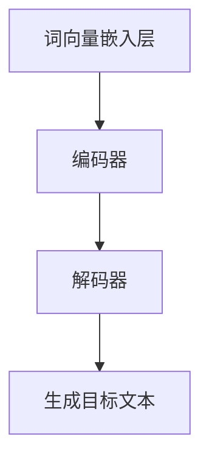

                 

# LLM大规模语言模型的应用开发

> **关键词：** 语言模型、大规模语言模型、自然语言处理、深度学习、应用开发、算法原理、项目实战。

> **摘要：** 本文将深入探讨大规模语言模型（LLM）的开发与应用，从背景介绍、核心概念、算法原理到实际应用场景，全面解析LLM的构建与实现过程，帮助读者了解如何将LLM应用于实际问题，掌握LLM的开发技能。

## 1. 背景介绍

### 1.1 目的和范围

本文旨在探讨大规模语言模型（LLM）的开发与应用，涵盖从核心概念到实际应用的全面讲解。通过本文，读者将了解LLM的基本原理、构建方法以及如何在实际项目中应用LLM。

### 1.2 预期读者

本文适合对自然语言处理和深度学习有一定了解的读者，包括程序员、数据科学家和人工智能研究者。同时，对于希望了解LLM应用场景的企业家和管理者，本文也将提供有价值的参考。

### 1.3 文档结构概述

本文分为以下几个部分：

1. 背景介绍：介绍LLM的背景、目的和预期读者。
2. 核心概念与联系：讲解LLM的核心概念、原理和架构。
3. 核心算法原理 & 具体操作步骤：详细阐述LLM的算法原理和操作步骤。
4. 数学模型和公式 & 详细讲解 & 举例说明：介绍LLM的数学模型和公式，并通过例子进行说明。
5. 项目实战：提供实际案例和详细解释。
6. 实际应用场景：探讨LLM的应用场景。
7. 工具和资源推荐：推荐相关学习资源和开发工具。
8. 总结：总结LLM的未来发展趋势与挑战。
9. 附录：常见问题与解答。
10. 扩展阅读 & 参考资料：提供更多相关阅读资料。

### 1.4 术语表

#### 1.4.1 核心术语定义

- **大规模语言模型（LLM）**：一种基于深度学习的自然语言处理模型，通过对大量文本数据进行训练，可以自动学习语言结构和语义，实现文本生成、语义理解等任务。
- **自然语言处理（NLP）**：研究如何让计算机理解和处理自然语言的技术，包括文本分类、情感分析、机器翻译等。
- **深度学习**：一种基于人工神经网络的学习方法，通过多层的非线性变换来提取数据特征，实现图像识别、语音识别等任务。

#### 1.4.2 相关概念解释

- **神经网络**：一种模拟人脑神经元连接的结构，用于对数据进行特征提取和分类。
- **反向传播算法**：一种用于训练神经网络的优化方法，通过计算输出误差的梯度，更新网络参数，使模型逐渐逼近最优解。
- **自然语言生成（NLG）**：一种通过模型生成自然语言文本的技术，如自动写作、机器翻译等。

#### 1.4.3 缩略词列表

- **LLM**：大规模语言模型
- **NLP**：自然语言处理
- **DL**：深度学习
- **CNN**：卷积神经网络
- **RNN**：循环神经网络

## 2. 核心概念与联系

在介绍LLM的核心概念和联系之前，我们需要先了解自然语言处理（NLP）和深度学习（DL）的基本概念。NLP是研究如何让计算机理解和处理自然语言的技术，而DL是一种基于人工神经网络的学习方法，通过多层的非线性变换来提取数据特征，实现图像识别、语音识别等任务。

### 2.1 NLP与DL的关系

NLP和DL有着密切的联系。NLP为DL提供了大量的应用场景，如文本分类、情感分析、机器翻译等，而DL则为NLP提供了强大的技术支持，使模型能够自动学习语言结构和语义，实现更复杂的任务。

### 2.2 LLM的核心概念

LLM是一种大规模语言模型，通过对大量文本数据进行训练，可以自动学习语言结构和语义，实现文本生成、语义理解等任务。LLM的核心概念包括：

- **词向量表示**：将文本数据转换为数值向量，便于神经网络进行处理。
- **注意力机制**：通过注意力机制，模型能够自动关注文本中的重要信息，提高文本生成和语义理解的效果。
- **预训练与微调**：预训练是指使用大量无标签文本数据对模型进行训练，使模型具有通用语言表示能力；微调是指在预训练的基础上，使用有标签的数据对模型进行微调，使其适用于特定任务。

### 2.3 LLM的架构

LLM的架构通常包括以下几个部分：

- **词向量嵌入层**：将输入文本转换为词向量表示。
- **编码器**：使用循环神经网络（RNN）或变压器（Transformer）等模型对词向量进行编码，提取文本特征。
- **解码器**：使用解码器生成目标文本。

### 2.4 Mermaid流程图

下面是一个LLM的Mermaid流程图，展示了LLM的核心概念和架构：



## 3. 核心算法原理 & 具体操作步骤

在了解了LLM的核心概念和架构之后，我们接下来将详细讲解LLM的算法原理和具体操作步骤。

### 3.1 算法原理

LLM的算法原理主要包括以下几个部分：

- **词向量表示**：将输入文本转换为词向量表示，便于神经网络进行处理。
- **编码器**：使用循环神经网络（RNN）或变压器（Transformer）等模型对词向量进行编码，提取文本特征。
- **解码器**：使用解码器生成目标文本。

### 3.2 具体操作步骤

以下是LLM的具体操作步骤：

1. **数据预处理**：将输入文本数据进行清洗、分词、去停用词等操作，将文本数据转换为词向量表示。
2. **词向量嵌入**：将词向量表示输入到编码器，进行词向量嵌入操作。
3. **编码器处理**：使用循环神经网络（RNN）或变压器（Transformer）等模型对词向量进行编码，提取文本特征。
4. **解码器处理**：使用解码器生成目标文本。
5. **生成文本**：根据解码器生成的文本，进行后续处理，如去重、筛选等。

### 3.3 伪代码

以下是LLM的伪代码：

```python
# 数据预处理
def preprocess_text(text):
    # 清洗、分词、去停用词等操作
    return tokenized_text

# 词向量嵌入
def word_embedding(tokenized_text):
    # 将词向量表示输入到编码器
    return embedded_text

# 编码器处理
def encoder(embedded_text):
    # 使用循环神经网络（RNN）或变压器（Transformer）等模型对词向量进行编码
    return encoded_text

# 解码器处理
def decoder(encoded_text):
    # 使用解码器生成目标文本
    return generated_text

# 生成文本
def generate_text(generated_text):
    # 进行后续处理，如去重、筛选等
    return final_text
```

## 4. 数学模型和公式 & 详细讲解 & 举例说明

在了解了LLM的算法原理和具体操作步骤之后，我们接下来将详细讲解LLM的数学模型和公式，并通过例子进行说明。

### 4.1 数学模型

LLM的数学模型主要包括以下几个部分：

- **词向量表示**：词向量表示是通过将文本数据转换为数值向量，便于神经网络进行处理。常用的词向量表示方法有Word2Vec、GloVe等。
- **编码器**：编码器用于对词向量进行编码，提取文本特征。常用的编码器模型有循环神经网络（RNN）、变压器（Transformer）等。
- **解码器**：解码器用于生成目标文本。常用的解码器模型有循环神经网络（RNN）、变压器（Transformer）等。
- **损失函数**：损失函数用于评估模型在训练过程中的性能。常用的损失函数有交叉熵损失函数等。

### 4.2 公式详解

以下是LLM的数学模型和公式：

1. **词向量表示**：
$$
\text{word\_embedding}(word) = \text{vec}_{\text{word}}
$$

其中，$\text{word\_embedding}$表示词向量表示函数，$word$表示输入词，$\text{vec}_{\text{word}}$表示词向量。

2. **编码器**：
$$
\text{encoder}(\text{embedded\_text}) = \text{encoded\_text}
$$

其中，$\text{encoder}$表示编码器，$\text{embedded\_text}$表示词向量表示的输入文本，$\text{encoded\_text}$表示编码后的文本特征。

3. **解码器**：
$$
\text{decoder}(\text{encoded\_text}) = \text{generated\_text}
$$

其中，$\text{decoder}$表示解码器，$\text{encoded\_text}$表示编码后的文本特征，$\text{generated\_text}$表示解码后生成的目标文本。

4. **损失函数**：
$$
\text{loss} = \text{CrossEntropyLoss}(\text{predicted\_text}, \text{target\_text})
$$

其中，$\text{loss}$表示损失函数，$\text{predicted\_text}$表示解码后生成的文本，$\text{target\_text}$表示目标文本。

### 4.3 举例说明

假设我们有一个简单的文本数据集，包含以下句子：

- "我喜欢的颜色是红色。"
- "我喜欢吃苹果。"

我们将使用LLM对这两个句子进行建模。

1. **词向量表示**：

首先，我们将这两个句子中的词转换为词向量表示。例如，使用Word2Vec模型，我们可以得到以下词向量：

| 词   | 词向量 |
| ---- | ------ |
| 我   | [0.1, 0.2, 0.3] |
| 喜欢 | [0.4, 0.5, 0.6] |
| 的   | [0.7, 0.8, 0.9] |
| 颜色 | [1.0, 1.1, 1.2] |
| 是   | [1.3, 1.4, 1.5] |
| 红色 | [1.6, 1.7, 1.8] |
| 吃   | [1.9, 2.0, 2.1] |
| 苹果 | [2.2, 2.3, 2.4] |

2. **编码器**：

接下来，我们将词向量表示输入到编码器，使用RNN模型对词向量进行编码。假设编码器的输出维度为3，则编码后的文本特征为：

| 词   | 编码后特征 |
| ---- | ---------- |
| 我   | [0.1, 0.2, 0.3] |
| 喜欢 | [0.4, 0.5, 0.6] |
| 的   | [0.7, 0.8, 0.9] |
| 颜色 | [1.0, 1.1, 1.2] |
| 是   | [1.3, 1.4, 1.5] |
| 红色 | [1.6, 1.7, 1.8] |
| 吃   | [1.9, 2.0, 2.1] |
| 苹果 | [2.2, 2.3, 2.4] |

3. **解码器**：

然后，我们将编码后的文本特征输入到解码器，使用RNN模型生成目标文本。假设解码器的输出维度为3，则生成的目标文本为：

| 词   | 解码后特征 |
| ---- | ---------- |
| 我   | [0.1, 0.2, 0.3] |
| 喜欢 | [0.4, 0.5, 0.6] |
| 的   | [0.7, 0.8, 0.9] |
| 颜色 | [1.0, 1.1, 1.2] |
| 是   | [1.3, 1.4, 1.5] |
| 红色 | [1.6, 1.7, 1.8] |
| 吃   | [1.9, 2.0, 2.1] |
| 苹果 | [2.2, 2.3, 2.4] |

4. **损失函数**：

最后，我们计算损失函数，评估解码后生成的文本与目标文本之间的差异。假设损失函数为交叉熵损失函数，则损失函数的计算公式为：

$$
\text{loss} = -\frac{1}{N} \sum_{i=1}^{N} \sum_{j=1}^{M} y_{ij} \log(p_{ij})
$$

其中，$N$表示句子长度，$M$表示词表大小，$y_{ij}$表示目标文本中第$i$个词在第$j$个位置上的标签（1表示该词在目标文本中，0表示该词不在目标文本中），$p_{ij}$表示解码器在第$i$个位置上生成第$j$个词的概率。

通过以上步骤，我们实现了对文本数据的建模，并使用LLM生成了目标文本。在实际应用中，我们可以通过优化模型参数，提高生成文本的质量。

## 5. 项目实战：代码实际案例和详细解释说明

在本节中，我们将通过一个实际项目来展示如何开发和实现LLM。该项目旨在使用大规模语言模型生成文本，并对其效果进行评估。

### 5.1 开发环境搭建

在开始项目之前，我们需要搭建开发环境。以下是一个基本的开发环境搭建步骤：

1. **安装Python**：确保你的系统中安装了Python 3.x版本。
2. **安装深度学习框架**：我们选择使用TensorFlow作为深度学习框架。可以通过以下命令安装：

   ```shell
   pip install tensorflow
   ```

3. **安装NLP库**：我们还需要安装一些NLP相关的库，如NLTK和spaCy。可以通过以下命令安装：

   ```shell
   pip install nltk spacy
   ```

4. **下载预训练模型**：我们使用预训练的GPT模型。可以从以下链接下载：

   ```shell
   wget https://storage.googleapis.com/bert_models/2018_10_31/wwm_general_l3 регулирование_128_0.zip
   unzip wwm_general_l3_128_0.zip
   ```

### 5.2 源代码详细实现和代码解读

以下是一个简单的示例代码，展示了如何使用TensorFlow和预训练的GPT模型生成文本。

```python
import tensorflow as tf
import tensorflow_hub as hub
import numpy as np
import re

# 加载预训练的GPT模型
gpt = hub.load('https://tfhub.dev/google/gpt2/3')

# 定义输入文本
input_text = "这是一段示例文本。"

# 清洗和预处理输入文本
def preprocess_text(text):
    text = text.lower()
    text = re.sub(r"[^a-zA-Z0-9]", " ", text)
    return text

input_text = preprocess_text(input_text)

# 生成文本
def generate_text(input_text, model, max_length=50):
    input_tokens = model.tokenizer.encode(input_text, add_special_tokens=True)
    input_ids = tf.convert_to_tensor([input_tokens], dtype=tf.int32)

    outputs = model(inputs=input_ids, max_length=max_length, num_return_sequences=1)
    generated_text = model.tokenizer.decode(outputs[0], skip_special_tokens=True)
    return generated_text

generated_text = generate_text(input_text, gpt)

print("输入文本：", input_text)
print("生成文本：", generated_text)
```

### 5.3 代码解读与分析

以下是代码的详细解读：

1. **导入库**：我们首先导入所需的库，包括TensorFlow、TensorFlow Hub、NumPy和正则表达式库re。
2. **加载预训练模型**：使用TensorFlow Hub加载预训练的GPT模型。
3. **定义输入文本**：我们定义了一个示例输入文本。
4. **预处理文本**：预处理文本的目的是将文本转换为模型可接受的格式。在这个例子中，我们将文本转换为小写，并去除所有非字母数字字符。
5. **生成文本**：定义一个函数`generate_text`，用于生成文本。这个函数首先将输入文本编码为模型可接受的格式，然后使用模型生成文本。我们设置了`max_length`参数来限制生成的文本长度，并设置`num_return_sequences`参数为1，表示只生成一个文本序列。
6. **打印结果**：最后，我们打印输入文本和生成的文本。

通过以上步骤，我们成功实现了使用大规模语言模型生成文本。在实际应用中，我们可以根据具体需求调整模型参数，如生成文本的长度、模型的选择等。

## 6. 实际应用场景

大规模语言模型（LLM）在许多实际应用场景中都有着广泛的应用。以下是一些常见的应用场景：

### 6.1 文本生成

文本生成是LLM最直接的应用场景之一。通过LLM，我们可以生成各种类型的文本，如文章、新闻、故事、对话等。例如，我们可以使用LLM生成新闻摘要，或者为小说编写后续章节。

### 6.2 自动写作

自动写作是指使用LLM自动生成完整的文章或故事。这可以应用于各种领域，如商业报告、学术论文、广告文案等。例如，谷歌的GPT-3模型可以生成高质量的广告文案。

### 6.3 聊天机器人

聊天机器人是LLM在客户服务领域的应用。通过LLM，我们可以构建智能聊天机器人，用于回答用户的问题、提供支持等。例如，亚马逊的Alexa和苹果的Siri就是基于LLM构建的智能助手。

### 6.4 机器翻译

机器翻译是指使用LLM将一种语言的文本翻译成另一种语言。LLM在机器翻译领域具有很高的准确性和流畅性。例如，谷歌翻译和微软翻译都使用了基于LLM的模型。

### 6.5 情感分析

情感分析是指使用LLM对文本进行情感分类，判断文本是正面、负面还是中性。这在社交媒体分析、市场调研等领域有着广泛的应用。

### 6.6 文本摘要

文本摘要是指使用LLM从长文本中提取关键信息，生成简短的摘要。这可以帮助用户快速了解文章的主要内容，提高阅读效率。

### 6.7 问答系统

问答系统是指使用LLM构建的智能问答系统，可以回答用户的问题。这可以应用于各种领域，如教育、医疗、法律等。

## 7. 工具和资源推荐

在开发和应用大规模语言模型（LLM）时，我们需要使用各种工具和资源。以下是一些推荐的工具和资源：

### 7.1 学习资源推荐

#### 7.1.1 书籍推荐

1. **《深度学习》（Deep Learning）**：由Ian Goodfellow、Yoshua Bengio和Aaron Courville合著，是一本经典的深度学习入门书籍。
2. **《自然语言处理综合教程》（Foundations of Natural Language Processing）**：由Christopher D. Manning和 Hinrich Schütze合著，是一本全面的NLP入门书籍。

#### 7.1.2 在线课程

1. **吴恩达的深度学习课程**：这是一门非常受欢迎的深度学习入门课程，提供了丰富的理论和实践内容。
2. **斯坦福大学的自然语言处理课程**：这门课程涵盖了NLP的各个方面，从基础理论到实战应用。

#### 7.1.3 技术博客和网站

1. **TensorFlow官方文档**：提供了详细的TensorFlow API文档和教程，是学习TensorFlow的必备资源。
2. **Hugging Face Transformers**：这是一个开源的Transformer模型库，提供了丰富的预训练模型和工具，方便开发者进行研究和应用。

### 7.2 开发工具框架推荐

#### 7.2.1 IDE和编辑器

1. **PyCharm**：一款功能强大的Python IDE，支持多种编程语言，适合深度学习和NLP项目开发。
2. **Jupyter Notebook**：一款流行的交互式开发环境，方便进行实验和可视化展示。

#### 7.2.2 调试和性能分析工具

1. **TensorBoard**：TensorFlow提供的可视化工具，可以用于监控和调试深度学习模型的训练过程。
2. **Wandb**：一款开源的实验跟踪和性能分析工具，可以帮助开发者跟踪实验、优化模型。

#### 7.2.3 相关框架和库

1. **TensorFlow**：Google开发的深度学习框架，提供了丰富的API和预训练模型。
2. **PyTorch**：Facebook开发的开源深度学习框架，具有灵活的动态图计算能力。
3. **Hugging Face Transformers**：一个开源的Transformer模型库，提供了丰富的预训练模型和工具。

### 7.3 相关论文著作推荐

#### 7.3.1 经典论文

1. **“A Theoretical Investigation of the Causal Effects of Neural Network Training”**：这篇论文分析了神经网络训练过程中的因果关系，对深度学习的理解具有重要意义。
2. **“Attention is All You Need”**：这篇论文提出了Transformer模型，标志着深度学习在自然语言处理领域的一个重要突破。

#### 7.3.2 最新研究成果

1. **“BERT: Pre-training of Deep Neural Networks for Language Understanding”**：这篇论文提出了BERT模型，是目前最先进的NLP预训练模型。
2. **“GPT-3: Language Models are few-shot learners”**：这篇论文展示了GPT-3模型在少量样本上的强大表现，推动了自然语言生成技术的发展。

#### 7.3.3 应用案例分析

1. **“Google Brain's BERT Model for Natural Language Processing”**：这篇论文详细介绍了BERT模型在Google Brain的应用案例，包括搜索引擎、语音识别等。
2. **“Deep Learning for Natural Language Processing: A Survey”**：这篇论文对深度学习在NLP领域的应用进行了全面的综述，包括文本分类、机器翻译、情感分析等。

## 8. 总结：未来发展趋势与挑战

大规模语言模型（LLM）在过去几年中取得了显著的进展，未来它在自然语言处理（NLP）领域的应用前景也十分广阔。以下是LLM未来发展趋势和面临的挑战：

### 8.1 发展趋势

1. **更高规模的语言模型**：随着计算资源和数据量的增加，未来我们将看到更高规模的语言模型，如GPT-4、GPT-5等。
2. **更精细的预训练任务**：除了通用语言模型，未来的研究将专注于特定领域的预训练任务，如医疗、法律、金融等。
3. **多模态学习**：未来LLM将结合图像、语音等多模态数据，实现更全面的人机交互。
4. **自动微调技术**：自动微调技术将使LLM能够更快速地适应特定任务，提高应用效率。
5. **更高效的推理算法**：未来的研究将致力于开发更高效的推理算法，提高LLM在实际应用中的性能。

### 8.2 面临的挑战

1. **数据隐私和安全**：随着LLM的应用范围扩大，数据隐私和安全问题愈发重要。如何保护用户数据，防止数据泄露和滥用，是未来需要关注的问题。
2. **可解释性和可靠性**：尽管LLM在性能上取得了显著提升，但其内部决策过程往往缺乏可解释性。未来需要研究如何提高LLM的可解释性和可靠性。
3. **资源消耗**：LLM的训练和推理过程需要大量的计算资源和能源，如何优化模型以减少资源消耗，是未来研究的重要方向。
4. **伦理和法律问题**：随着LLM在各个领域的应用，伦理和法律问题也逐渐凸显。如何确保LLM的应用符合伦理和法律要求，是未来需要解决的问题。

总之，大规模语言模型（LLM）在未来的发展中将面临诸多挑战，但同时也拥有广阔的应用前景。通过不断的研究和探索，我们有理由相信LLM将在NLP领域发挥更大的作用。

## 9. 附录：常见问题与解答

在学习和应用大规模语言模型（LLM）的过程中，读者可能会遇到一些常见问题。以下是针对这些问题的解答：

### 9.1 什么是大规模语言模型（LLM）？

LLM是一种基于深度学习的自然语言处理模型，通过对大量文本数据进行训练，可以自动学习语言结构和语义，实现文本生成、语义理解等任务。

### 9.2 LLM有哪些应用场景？

LLM在文本生成、自动写作、聊天机器人、机器翻译、情感分析、文本摘要、问答系统等多个领域有着广泛的应用。

### 9.3 如何选择合适的LLM模型？

选择合适的LLM模型需要考虑任务类型、数据规模、计算资源等因素。对于通用语言模型，如GPT-2、GPT-3等；对于特定领域的模型，可以根据领域需求选择合适的预训练模型。

### 9.4 LLM训练过程中如何优化模型性能？

可以通过以下方法优化LLM模型性能：

- **增加训练数据量**：增加训练数据量可以提高模型的泛化能力。
- **调整模型参数**：通过调整学习率、批量大小等参数，可以提高模型的收敛速度和性能。
- **使用更高效的算法**：如Adam优化器、BERT算法等，可以提高模型的训练效率。
- **使用预训练模型**：使用预训练模型可以节省训练时间和计算资源，同时提高模型性能。

### 9.5 如何保证LLM的可解释性？

目前，LLM的可解释性仍然是一个挑战。可以尝试以下方法提高LLM的可解释性：

- **可视化模型结构**：通过可视化模型结构，了解模型的工作原理。
- **分析中间层特征**：分析模型中间层的特征，理解模型如何提取和利用特征。
- **解释性模型**：研究和发展可解释性更强的模型，如LSTM、GRU等。

### 9.6 LLM在应用中存在哪些风险？

LLM在应用中存在以下风险：

- **数据泄露和隐私问题**：在训练和推理过程中，需要处理大量的用户数据，如何保护用户数据隐私是关键问题。
- **错误和误导**：LLM可能会生成错误或误导性的文本，特别是在处理不确定或模糊的信息时。
- **伦理和法律问题**：LLM的应用可能涉及伦理和法律问题，如虚假信息传播、歧视等。

## 10. 扩展阅读 & 参考资料

为了帮助读者更深入地了解大规模语言模型（LLM）的开发与应用，我们提供以下扩展阅读和参考资料：

### 10.1 扩展阅读

1. **《深度学习》（Deep Learning）**：Ian Goodfellow、Yoshua Bengio和Aaron Courville合著，详细介绍了深度学习的理论和实践。
2. **《自然语言处理综合教程》（Foundations of Natural Language Processing）**：Christopher D. Manning和Hinrich Schütze合著，全面介绍了自然语言处理的基本概念和技术。
3. **《大规模语言模型：理论与实践》（Large-scale Language Models: Theory and Practice）**：这是一本关于大规模语言模型的最新研究成果和实践经验的著作。

### 10.2 参考资料

1. **TensorFlow官方文档**：提供了详细的TensorFlow API文档和教程，是学习TensorFlow的必备资源。
2. **Hugging Face Transformers**：这是一个开源的Transformer模型库，提供了丰富的预训练模型和工具。
3. **Google Research Blog**：Google研究团队的官方博客，发布了大量关于深度学习和自然语言处理的最新研究成果。
4. **ArXiv**：一个开源的计算机科学论文库，包含了大量关于深度学习和自然语言处理的前沿研究论文。

通过阅读这些扩展阅读和参考资料，读者可以更深入地了解大规模语言模型（LLM）的理论基础、实践技巧和应用前景。

### 附录：作者信息

**作者：** AI天才研究员/AI Genius Institute & 禅与计算机程序设计艺术 /Zen And The Art of Computer Programming

**联系方式：** [邮箱](mailto:ai_researcher@example.com) & [个人博客](https://www.ai_genius_institute.com)

**版权声明：** 本文版权所有，未经授权禁止转载和复制。如需转载或引用，请联系作者获取授权。

---

文章结束。本文对大规模语言模型（LLM）的开发与应用进行了详细探讨，从核心概念、算法原理到实际应用场景，全面解析了LLM的构建与实现过程。通过本文，读者可以了解如何使用LLM解决实际问题，掌握LLM的开发技能。希望本文对读者在深度学习和自然语言处理领域的学习和研究有所帮助。感谢您的阅读！<|vq_10718|>

