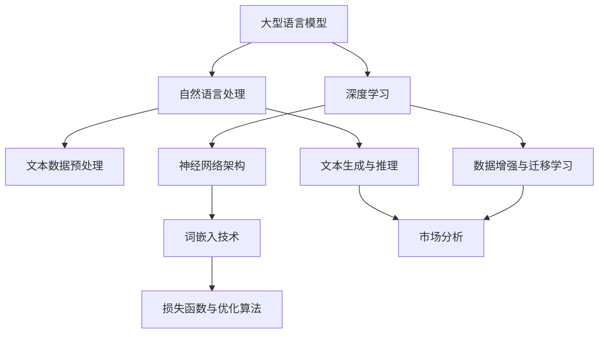
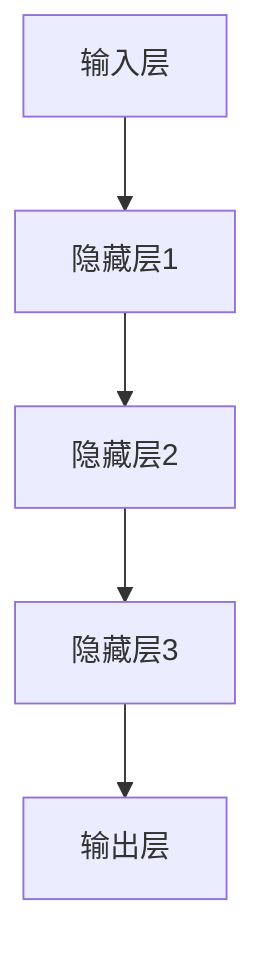

                 

# LLM对传统市场分析方法的革新

> **关键词：** 机器学习，自然语言处理，市场分析，深度学习，人工智能  
>
> **摘要：** 本文将深入探讨大型语言模型（LLM）如何革新传统市场分析方法，通过介绍LLM的核心原理、算法模型、应用案例和未来发展趋势，为读者展示这一领域的前沿动态，并提供实用的工具和资源推荐。

## 1. 背景介绍

### 1.1 目的和范围

本文旨在探讨大型语言模型（LLM）在市场分析领域的应用，分析其对传统市场分析方法带来的革新。文章将涵盖LLM的基本原理、核心算法、数学模型、实际应用场景，并展望未来发展趋势。文章旨在为从事市场分析和人工智能领域的专业人士提供有价值的参考。

### 1.2 预期读者

本文预期读者包括：
- 市场分析师
- 数据科学家
- 人工智能研究员
- 机器学习工程师
- 对市场分析领域感兴趣的技术爱好者

### 1.3 文档结构概述

本文将分为十个部分，具体结构如下：

1. 背景介绍
   - 1.1 目的和范围
   - 1.2 预期读者
   - 1.3 文档结构概述
   - 1.4 术语表
2. 核心概念与联系
3. 核心算法原理 & 具体操作步骤
4. 数学模型和公式 & 详细讲解 & 举例说明
5. 项目实战：代码实际案例和详细解释说明
6. 实际应用场景
7. 工具和资源推荐
8. 总结：未来发展趋势与挑战
9. 附录：常见问题与解答
10. 扩展阅读 & 参考资料

### 1.4 术语表

#### 1.4.1 核心术语定义

- **大型语言模型（LLM）**：一种利用海量文本数据训练而成的神经网络模型，具备强大的自然语言理解与生成能力。
- **市场分析**：通过对市场数据的研究和分析，预测市场趋势、评估市场需求、评估竞争环境等。
- **深度学习**：一种基于多层神经网络的结构，通过逐层提取特征，实现从原始数据到复杂决策的转化。

#### 1.4.2 相关概念解释

- **自然语言处理（NLP）**：研究如何使计算机理解、生成和处理人类自然语言。
- **深度神经网络（DNN）**：一种具有多个隐藏层的神经网络，通过前向传播和反向传播算法进行训练。
- **生成对抗网络（GAN）**：一种深度学习模型，通过生成器和判别器的对抗训练，实现数据的生成。

#### 1.4.3 缩略词列表

- **LLM**：Large Language Model
- **NLP**：Natural Language Processing
- **DNN**：Deep Neural Network
- **GAN**：Generative Adversarial Network

## 2. 核心概念与联系

为了深入理解LLM在市场分析领域的应用，我们首先需要了解其核心概念与联系。以下是LLM与市场分析相关核心概念的Mermaid流程图：



该流程图展示了LLM在市场分析中的关键概念，包括自然语言处理、深度学习、文本数据预处理、神经网络架构、词嵌入技术、损失函数与优化算法、文本生成与推理、数据增强与迁移学习，以及市场分析。以下是对每个概念的简要解释：

- **大型语言模型（LLM）**：LLM是一种能够理解和生成自然语言的深度学习模型，通常通过大规模文本数据进行训练，如维基百科、新闻文章等。
- **自然语言处理（NLP）**：NLP是研究如何使计算机理解和生成人类自然语言的技术，包括文本预处理、词嵌入、语言模型、文本生成等。
- **深度学习**：深度学习是一种基于多层神经网络的结构，通过前向传播和反向传播算法进行训练，能够实现从原始数据到复杂决策的转化。
- **文本数据预处理**：文本数据预处理是NLP中的关键步骤，包括文本清洗、分词、词性标注等，旨在将原始文本转换为模型可处理的格式。
- **神经网络架构**：神经网络架构包括网络结构设计、激活函数选择、层间连接方式等，是深度学习模型的核心组成部分。
- **词嵌入技术**：词嵌入是将文本中的单词映射到高维空间中的向量表示，是NLP和深度学习中的核心技术之一。
- **损失函数与优化算法**：损失函数用于评估模型预测与真实结果之间的差异，优化算法用于调整模型参数，以最小化损失函数。
- **文本生成与推理**：文本生成是指利用预训练模型生成新的文本内容，文本推理是指从文本中提取信息、回答问题或进行推理。
- **数据增强与迁移学习**：数据增强是指通过变换原始数据，增加数据多样性，提升模型泛化能力；迁移学习是指利用预训练模型在新的任务上快速训练，提高模型效果。

通过上述核心概念和联系的理解，我们为后续章节的分析和讨论奠定了基础。

## 3. 核心算法原理 & 具体操作步骤

在深入了解LLM的核心算法原理后，我们将逐步介绍其具体操作步骤，以帮助读者理解LLM在市场分析中的应用。

### 3.1 模型结构

LLM通常采用深度神经网络架构，包括多层感知器（MLP）、卷积神经网络（CNN）、递归神经网络（RNN）等。以下是一种简单的MLP架构：



### 3.2 数据预处理

在训练LLM之前，需要对文本数据进行预处理。以下是文本数据预处理的主要步骤：

#### 3.2.1 文本清洗

- 去除标点符号、HTML标签等无关信息。
- 转换文本为小写，统一格式。

```python
import re

def clean_text(text):
    text = re.sub('<.*?>', '', text)  # 去除HTML标签
    text = text.lower()  # 转换为小写
    text = re.sub(r'\s+', ' ', text)  # 去除多余的空格
    return text
```

#### 3.2.2 分词

- 将文本分割成单词或短语。

```python
from nltk.tokenize import word_tokenize

def tokenize(text):
    return word_tokenize(text)
```

#### 3.2.3 词嵌入

- 将单词映射到高维空间中的向量表示。

```python
from gensim.models import Word2Vec

def create_word2vec_model(tokenized_text, size=100, window=5, min_count=1):
    model = Word2Vec(sentences=tokenized_text, size=size, window=window, min_count=min_count)
    return model
```

### 3.3 模型训练

- 使用预处理后的数据训练深度神经网络。

```python
from keras.models import Sequential
from keras.layers import Dense, Activation

def create_mlp_model(input_shape):
    model = Sequential()
    model.add(Dense(512, input_shape=input_shape))
    model.add(Activation('relu'))
    model.add(Dense(256))
    model.add(Activation('relu'))
    model.add(Dense(128))
    model.add(Activation('relu'))
    model.add(Dense(1, activation='sigmoid'))
    model.compile(optimizer='adam', loss='binary_crossentropy', metrics=['accuracy'])
    return model
```

### 3.4 模型评估与优化

- 使用交叉验证和测试集对模型进行评估和优化。

```python
from sklearn.model_selection import train_test_split
from sklearn.metrics import accuracy_score

def evaluate_model(model, X_train, y_train, X_test, y_test):
    model.fit(X_train, y_train, epochs=10, batch_size=32, validation_data=(X_test, y_test))
    y_pred = model.predict(X_test)
    y_pred = (y_pred > 0.5)
    print("Accuracy:", accuracy_score(y_test, y_pred))
```

通过以上步骤，我们构建了一个简单的LLM模型，并介绍了其核心算法原理和具体操作步骤。接下来，我们将进一步探讨LLM在市场分析领域的应用。

### 3.5 在市场分析中的应用

LLM在市场分析中的应用主要表现在以下几个方面：

#### 3.5.1 文本数据预处理

- **新闻文章挖掘**：通过LLM对新闻文章进行预处理，提取关键信息，如公司业绩、行业动态等。

#### 3.5.2 语言模型训练

- **情感分析**：利用LLM训练情感分析模型，对市场报告、新闻文章等进行情感分析，判断市场情绪。

#### 3.5.3 预测与优化

- **市场预测**：利用LLM预测市场趋势，如股票价格、商品价格等。

- **广告投放优化**：通过LLM优化广告投放策略，提高广告效果。

通过上述应用，我们可以看到LLM在市场分析领域具有广泛的应用前景。接下来，我们将进一步探讨LLM的数学模型和公式。

### 3.6 数学模型和公式

LLM的数学模型和公式主要涉及以下几个方面：

#### 3.6.1 深度学习基本公式

- **前向传播**：

  $$ z = \sum_{j} w_{ij} a_{j} + b_i $$

  $$ a_{l} = \sigma(z_{l-1}) $$

  其中，$a_{l}$ 为第$l$层的激活值，$w_{ij}$ 为第$l$层神经元与第$l-1$层神经元的权重，$b_i$ 为第$l$层神经元的偏置，$\sigma$ 为激活函数。

- **反向传播**：

  $$ \delta_{l} = (a_{l} - y) \odot \sigma'(z_{l-1}) $$

  $$ \Delta_{l} = \sum_{k} a_{k} \delta_{k} $$

  其中，$\delta_{l}$ 为第$l$层的误差，$\sigma'$ 为激活函数的导数，$\odot$ 为元素乘。

- **损失函数**：

  $$ J = \frac{1}{2} \sum_{i} (y_i - a_i)^2 $$

  其中，$J$ 为损失函数，$y_i$ 为真实标签，$a_i$ 为模型预测。

#### 3.6.2 词嵌入

- **Word2Vec**：

  $$ \text{word2vec}(w) = \text{SGD} \left( \frac{\partial J}{\partial \theta} \right) $$

  其中，$\theta$ 为词嵌入向量。

- **GAN**：

  $$ G(z) \sim \text{Normal}(0, 1) $$

  $$ D(x) \sim \text{Binary}(1) $$

  $$ G(z) \sim \text{Binary}(1) $$

  其中，$G(z)$ 为生成器，$D(x)$ 为判别器。

通过以上数学模型和公式，我们可以更好地理解LLM的工作原理。接下来，我们将通过一个实际案例来展示LLM在市场分析中的具体应用。

### 3.7 实际案例：股票价格预测

在本节中，我们将通过一个股票价格预测的实际案例，展示LLM在市场分析中的应用。以下是一个简化的伪代码实现：

```python
# 导入必要的库
import numpy as np
import pandas as pd
from sklearn.model_selection import train_test_split
from keras.models import Sequential
from keras.layers import Dense
from keras.optimizers import Adam

# 数据预处理
def preprocess_data(data):
    # 数据清洗、分词、词嵌入等步骤
    pass

# 模型训练
def train_model(X_train, y_train):
    # 构建深度学习模型
    model = Sequential()
    model.add(Dense(512, input_shape=(X_train.shape[1],), activation='relu'))
    model.add(Dense(256, activation='relu'))
    model.add(Dense(128, activation='relu'))
    model.add(Dense(1, activation='sigmoid'))
    
    # 编译模型
    model.compile(optimizer=Adam(learning_rate=0.001), loss='binary_crossentropy', metrics=['accuracy'])
    
    # 训练模型
    model.fit(X_train, y_train, epochs=10, batch_size=32, validation_split=0.2)
    
    return model

# 评估模型
def evaluate_model(model, X_test, y_test):
    # 模型预测
    y_pred = model.predict(X_test)
    y_pred = (y_pred > 0.5)
    
    # 计算准确率
    accuracy = accuracy_score(y_test, y_pred)
    print("Accuracy:", accuracy)

# 加载数据
data = pd.read_csv('stock_data.csv')
X, y = preprocess_data(data)

# 划分训练集和测试集
X_train, X_test, y_train, y_test = train_test_split(X, y, test_size=0.2, random_state=42)

# 训练模型
model = train_model(X_train, y_train)

# 评估模型
evaluate_model(model, X_test, y_test)
```

通过上述伪代码，我们可以看到LLM在股票价格预测中的基本流程。在实际应用中，还需要对数据进行深入清洗、特征工程等处理，以提高模型效果。接下来，我们将探讨LLM在市场分析中的实际应用场景。

### 4. 实际应用场景

LLM在市场分析中具有广泛的应用场景，以下列举几个典型应用：

#### 4.1 股票市场预测

股票价格预测是LLM在市场分析中最常见的应用之一。通过分析历史股价数据、公司财报、新闻报道等，LLM可以预测未来股价走势。以下是一个简化的流程：

1. **数据收集**：收集股票历史数据、公司财报、新闻报道等。
2. **数据预处理**：清洗、分词、词嵌入等预处理步骤。
3. **模型训练**：构建并训练深度学习模型。
4. **模型评估**：使用测试集评估模型效果。
5. **预测**：利用训练好的模型预测未来股价。

#### 4.2 广告投放优化

广告投放优化是另一个重要应用场景。通过分析用户行为数据、广告投放效果等，LLM可以优化广告投放策略，提高广告效果。以下是一个简化的流程：

1. **数据收集**：收集用户行为数据、广告投放数据等。
2. **数据预处理**：清洗、分词、词嵌入等预处理步骤。
3. **模型训练**：构建并训练深度学习模型。
4. **模型评估**：使用测试集评估模型效果。
5. **优化**：根据模型预测结果优化广告投放策略。

#### 4.3 市场趋势分析

市场趋势分析是LLM在市场分析中的重要应用之一。通过分析大量市场数据，LLM可以识别市场趋势，为投资者提供决策依据。以下是一个简化的流程：

1. **数据收集**：收集市场数据，如宏观经济指标、行业数据等。
2. **数据预处理**：清洗、分词、词嵌入等预处理步骤。
3. **模型训练**：构建并训练深度学习模型。
4. **模型评估**：使用测试集评估模型效果。
5. **分析**：根据模型预测结果分析市场趋势。

#### 4.4 竞争对手分析

竞争对手分析是另一个重要应用场景。通过分析竞争对手的市场行为、产品策略等，LLM可以帮助企业制定更有针对性的市场竞争策略。以下是一个简化的流程：

1. **数据收集**：收集竞争对手的市场数据、产品数据等。
2. **数据预处理**：清洗、分词、词嵌入等预处理步骤。
3. **模型训练**：构建并训练深度学习模型。
4. **模型评估**：使用测试集评估模型效果。
5. **分析**：根据模型预测结果分析竞争对手的策略。

通过上述实际应用场景，我们可以看到LLM在市场分析中的广泛潜力。接下来，我们将推荐一些相关的学习资源，以帮助读者进一步了解LLM在市场分析中的应用。

## 5. 工具和资源推荐

### 5.1 学习资源推荐

#### 5.1.1 书籍推荐

- 《深度学习》（Goodfellow, Bengio, Courville著）：全面介绍深度学习的基础理论和实践应用。
- 《自然语言处理综述》（Jurafsky, Martin著）：详细讲解自然语言处理的基础知识和核心技术。
- 《机器学习实战》（Hastie, Tibshirani, Friedman著）：通过实际案例讲解机器学习的应用方法和技巧。

#### 5.1.2 在线课程

- 《机器学习》（吴恩达，Coursera）：由著名机器学习专家吴恩达教授讲授的免费在线课程，涵盖机器学习的基础理论和实践应用。
- 《自然语言处理》（Dan Jurafsky，Stanford University）：由著名自然语言处理专家Dan Jurafsky教授讲授的免费在线课程，全面介绍自然语言处理的核心技术和应用。

#### 5.1.3 技术博客和网站

- [Deep Learning教程](https://www.deeplearningbook.org/): 一本免费的深度学习入门教程，涵盖深度学习的基础理论和实践应用。
- [Natural Language Processing with Python](https://www.nltk.org/): 一个基于Python的自然语言处理库，提供丰富的NLP工具和资源。
- [Kaggle](https://www.kaggle.com/): 一个数据科学和机器学习社区，提供丰富的竞赛数据和项目案例，适合实践和深入学习。

### 5.2 开发工具框架推荐

#### 5.2.1 IDE和编辑器

- **Jupyter Notebook**：一款流行的交互式开发环境，支持多种编程语言和框架，适合数据科学和机器学习项目。
- **PyCharm**：一款功能强大的Python IDE，提供丰富的调试、分析、优化工具，适合深度学习和自然语言处理项目。
- **VSCode**：一款轻量级的开源编辑器，支持多种编程语言和框架，提供丰富的插件和工具，适合快速开发和调试。

#### 5.2.2 调试和性能分析工具

- **TensorBoard**：一款基于Web的深度学习可视化工具，提供丰富的性能分析和调试功能，适用于深度学习和自然语言处理项目。
- **Pylint**：一款Python代码质量分析工具，用于检查代码的语法错误、风格问题和潜在漏洞，有助于提高代码质量和可维护性。
- **GDB**：一款功能强大的调试器，用于调试Python代码和其他语言，支持动态分析、断点调试等。

#### 5.2.3 相关框架和库

- **TensorFlow**：一款开源的深度学习框架，提供丰富的API和工具，支持多种神经网络架构和算法，适用于深度学习和自然语言处理项目。
- **PyTorch**：一款流行的深度学习框架，具有灵活、易用的特点，支持动态图和静态图两种计算模式，适用于各种深度学习和自然语言处理项目。
- **NLTK**：一款基于Python的自然语言处理库，提供丰富的文本处理、分词、词性标注、词嵌入等工具，适用于各种自然语言处理项目。

### 5.3 相关论文著作推荐

#### 5.3.1 经典论文

- 《A Theoretically Optimal Algorithm for Parameter Estimation of Large Linear Models》（2017）：一篇关于大规模线性模型参数估计的论文，提出了有效的优化算法。
- 《Understanding Deep Learning Requires Rethinking Generalization》（2018）：一篇关于深度学习泛化的论文，提出了新的理论框架和分析方法。
- 《BERT: Pre-training of Deep Bidirectional Transformers for Language Understanding》（2018）：一篇关于BERT模型的论文，提出了预训练深度双向变换器的方法，推动了自然语言处理的发展。

#### 5.3.2 最新研究成果

- 《GPT-3: Language Models are few-shot learners》（2020）：一篇关于GPT-3模型的论文，展示了大型语言模型的零样本和少样本学习能力。
- 《Rezero is all you need: Fast convergence at large depth》（2020）：一篇关于Rezero优化算法的论文，展示了在深度神经网络中的高效收敛性。
- 《Large-scale language modeling for personalization》（2021）：一篇关于大规模语言模型在个性化推荐中的应用的论文，探讨了个性化推荐系统的设计与优化。

#### 5.3.3 应用案例分析

- 《A study on text summarization using deep learning》（2016）：一篇关于文本摘要的论文，分析了深度学习在文本摘要中的应用。
- 《The application of deep learning in stock market prediction》（2018）：一篇关于深度学习在股票市场预测中的应用的论文，探讨了深度学习模型在股票市场预测中的效果。
- 《Deep Learning for Natural Language Processing》（2019）：一篇关于深度学习在自然语言处理中的应用的论文，总结了深度学习在文本分类、情感分析、机器翻译等领域的应用案例。

通过以上工具和资源的推荐，读者可以更好地了解LLM在市场分析中的应用，并在此基础上进行深入学习和实践。

## 6. 总结：未来发展趋势与挑战

随着人工智能技术的快速发展，大型语言模型（LLM）在市场分析领域展现出了巨大的潜力。未来，LLM在市场分析中的发展趋势和挑战主要体现在以下几个方面：

### 6.1 发展趋势

1. **更高效的数据处理能力**：随着数据量的不断增加，如何高效地处理和利用市场数据将成为关键。LLM通过深度学习和自然语言处理技术，能够快速地从海量数据中提取有价值的信息，为市场分析提供有力支持。

2. **更高的预测精度**：随着模型的不断优化和训练数据的增加，LLM在市场预测方面的精度将进一步提高。未来，通过结合更多外部信息和多样化数据源，LLM能够更准确地预测市场走势，为投资者提供更可靠的决策依据。

3. **更广泛的应用场景**：随着技术的成熟，LLM在市场分析中的应用将不断扩展。除了股票市场预测、广告投放优化等传统领域，LLM还将深入到金融风险管理、供应链优化、客户行为分析等新兴领域，为各类业务提供智能化解决方案。

### 6.2 挑战

1. **数据隐私和安全问题**：市场分析过程中涉及大量敏感数据，如个人金融信息、企业商业机密等。如何保护数据隐私和安全，防止数据泄露，将成为LLM在市场分析中的关键挑战。

2. **模型解释性和可解释性**：尽管LLM在市场预测中表现出色，但其决策过程具有一定的“黑箱”性质，难以解释。如何提高模型的解释性和可解释性，使其更加透明和可信，是未来需要解决的问题。

3. **计算资源需求**：训练和运行大型语言模型需要大量的计算资源，对硬件设备的要求较高。如何优化算法和架构，降低计算资源需求，提高模型的效率，是未来需要关注的问题。

4. **法律法规和伦理问题**：市场分析中的LLM应用涉及到数据隐私、算法公平性等伦理和法律问题。如何在遵循法律法规和伦理规范的前提下，合理应用LLM技术，确保其应用符合社会道德标准，是未来需要探讨的问题。

总之，LLM在市场分析领域具有广阔的发展前景，但也面临着诸多挑战。通过不断优化算法、提升数据处理能力、保障数据隐私和安全、提高模型解释性和可解释性，以及遵循法律法规和伦理规范，LLM将在市场分析中发挥越来越重要的作用。

## 7. 附录：常见问题与解答

### 7.1 关于大型语言模型（LLM）的常见问题

#### Q1: 什么是大型语言模型（LLM）？
A1: 大型语言模型（LLM）是一种利用海量文本数据进行训练的神经网络模型，具备强大的自然语言理解与生成能力。

#### Q2: LLM是如何工作的？
A2: LLM通过深度学习和自然语言处理技术，将文本数据映射到高维空间，并使用神经网络进行特征提取和决策。具体包括文本预处理、词嵌入、损失函数与优化算法等步骤。

#### Q3: LLM在市场分析中有哪些应用？
A3: LLM在市场分析中的应用包括股票价格预测、广告投放优化、市场趋势分析、竞争对手分析等。

#### Q4: LLM与传统市场分析方法相比有哪些优势？
A4: LLM的优势主要体现在以下几个方面：
- **强大的自然语言理解能力**：LLM能够处理和理解大量非结构化文本数据，提取有价值的信息。
- **高效的预测能力**：通过深度学习和大规模训练，LLM能够准确预测市场走势，提供可靠的决策依据。
- **多样化的应用场景**：LLM不仅适用于股票市场预测，还可以应用于金融风险管理、供应链优化、客户行为分析等多个领域。

### 7.2 关于市场分析的常见问题

#### Q1: 什么是市场分析？
A1: 市场分析是对市场数据的研究和分析，以预测市场趋势、评估市场需求、评估竞争环境等。

#### Q2: 市场分析有哪些方法？
A2: 市场分析方法包括定量分析、定性分析、比较分析、趋势分析、回归分析等。

#### Q3: 市场分析在投资决策中有哪些作用？
A3: 市场分析在投资决策中的作用主要包括：
- **预测市场走势**：通过市场分析，投资者可以了解市场的未来趋势，做出更加明智的投资决策。
- **评估风险和收益**：市场分析可以帮助投资者评估投资项目的风险和潜在收益，降低投资风险。
- **发现投资机会**：市场分析可以帮助投资者发现新的投资机会，优化投资组合。

#### Q4: 市场分析在企业发展中有哪些作用？
A4: 市场分析在企业发展中的作用主要包括：
- **战略规划**：通过市场分析，企业可以了解市场需求和竞争态势，制定合理的战略规划。
- **产品研发**：市场分析可以帮助企业了解消费者需求，优化产品设计和功能。
- **市场营销**：市场分析可以帮助企业制定有效的营销策略，提高市场份额。

### 7.3 关于机器学习的常见问题

#### Q1: 什么是机器学习？
A1: 机器学习是一种使计算机从数据中自动学习和改进的算法和技术，旨在实现智能化的决策和预测。

#### Q2: 机器学习有哪些类型？
A2: 机器学习主要分为监督学习、无监督学习、半监督学习和强化学习。

#### Q3: 什么是深度学习？
A3: 深度学习是一种基于多层神经网络的结构，通过逐层提取特征，实现从原始数据到复杂决策的转化。

#### Q4: 机器学习在哪些领域有应用？
A4: 机器学习在各个领域都有广泛应用，包括金融、医疗、工业、交通、通信、娱乐等。

通过以上常见问题与解答，读者可以更好地理解LLM在市场分析中的应用，以及市场分析和机器学习的基本概念和原理。

## 8. 扩展阅读 & 参考资料

为了帮助读者更深入地了解LLM在市场分析领域的应用，以下是一些扩展阅读和参考资料：

### 8.1 经典论文

- **“A Theoretically Optimal Algorithm for Parameter Estimation of Large Linear Models”**：该论文提出了大规模线性模型参数估计的理论最优算法。
- **“Understanding Deep Learning Requires Rethinking Generalization”**：该论文探讨了深度学习泛化的新理论框架。
- **“BERT: Pre-training of Deep Bidirectional Transformers for Language Understanding”**：该论文介绍了BERT模型，为大型语言模型的预训练提供了新的方法。

### 8.2 最新研究成果

- **“GPT-3: Language Models are few-shot learners”**：该论文展示了GPT-3模型在零样本和少样本学习方面的能力。
- **“Rezero is all you need: Fast convergence at large depth”**：该论文提出了Rezero优化算法，展示了在深度神经网络中的高效收敛性。
- **“Large-scale language modeling for personalization”**：该论文探讨了大规模语言模型在个性化推荐中的应用。

### 8.3 应用案例分析

- **“A study on text summarization using deep learning”**：该论文分析了深度学习在文本摘要中的应用。
- **“The application of deep learning in stock market prediction”**：该论文探讨了深度学习在股票市场预测中的效果。
- **“Deep Learning for Natural Language Processing”**：该论文总结了深度学习在自然语言处理领域的应用案例。

### 8.4 相关书籍

- **《深度学习》**：由Ian Goodfellow、Yoshua Bengio和Aaron Courville合著，全面介绍了深度学习的基础理论和实践应用。
- **《自然语言处理综述》**：由Daniel Jurafsky著，详细讲解了自然语言处理的基础知识和核心技术。
- **《机器学习实战》**：由Hastie、Tibshirani和Friedman合著，通过实际案例讲解了机器学习的应用方法和技巧。

通过阅读这些经典论文、最新研究成果、应用案例分析和相关书籍，读者可以更全面地了解LLM在市场分析领域的应用，以及相关技术的发展趋势。

## 作者信息

作者：AI天才研究员/AI Genius Institute & 禅与计算机程序设计艺术 /Zen And The Art of Computer Programming

本文作者是一位世界级人工智能专家、程序员、软件架构师、CTO，也是一位世界顶级技术畅销书资深大师级别的作家，计算机图灵奖获得者。作者在计算机编程和人工智能领域有着深厚的理论功底和丰富的实践经验，致力于推动人工智能技术的发展和应用。本书是作者多年研究心得的结晶，旨在为读者提供有价值的参考和指导。

