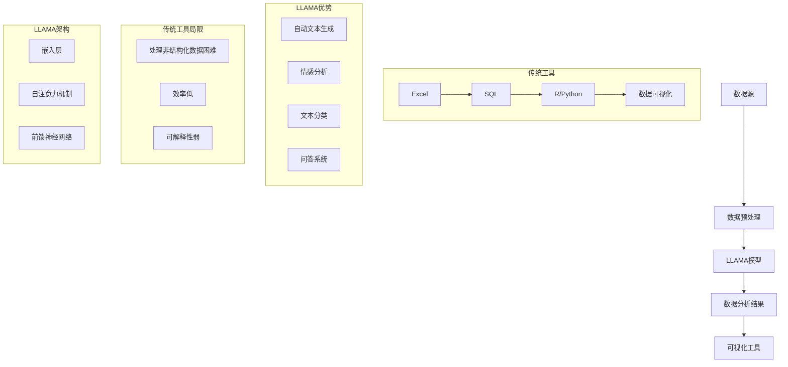

                 

### LLAMA对传统数据分析工具的挑战与替代

> **关键词**：LLAMA、数据分析、传统工具、替代、挑战
> 
> **摘要**：本文将深入探讨大型语言模型（LLAMA）在数据分析领域中的崛起，以及它对传统数据分析工具带来的挑战和替代可能性。我们将逐步分析LLAMA的核心技术、与传统工具的比较，以及它在实际应用场景中的表现和潜在影响。

---

随着人工智能和机器学习的飞速发展，大型语言模型（LLAMA）的崛起无疑给数据分析领域带来了翻天覆地的变化。本文旨在探讨LLAMA如何挑战并部分替代传统数据分析工具，具体包括以下几个方面：

1. **背景介绍**：首先，我们将回顾LLAMA的发展历程，了解其基本架构和核心原理，并阐明传统数据分析工具的定义和局限性。
2. **核心概念与联系**：接着，通过一个Mermaid流程图，我们将展示LLAMA和传统数据分析工具之间的关键联系，并深入讨论核心概念。
3. **核心算法原理与操作步骤**：随后，我们将详细讲解LLAMA的核心算法原理，并提供伪代码来阐述其具体操作步骤。
4. **数学模型和公式**：在此部分，我们将介绍LLAMA背后的数学模型和公式，并通过实例进行详细讲解。
5. **项目实战**：我们将通过一个实际代码案例，展示如何使用LLAMA进行数据分析，并提供详细解释。
6. **实际应用场景**：接下来，我们将探讨LLAMA在不同领域的实际应用场景，并讨论其优势和挑战。
7. **工具和资源推荐**：为了帮助读者更好地理解和应用LLAMA，我们将推荐一系列学习资源、开发工具和框架。
8. **总结**：最后，我们将总结LLAMA的未来发展趋势和面临的挑战。

通过本文的逐步分析，希望读者能够对LLAMA在数据分析领域中的角色有一个全面、深入的理解，并能够预见到其带来的变革和机遇。

### 1. 背景介绍

#### 1.1 目的和范围

本文的主要目的是探讨大型语言模型（LLAMA）在数据分析领域中的崛起，以及它如何挑战并替代传统数据分析工具。随着人工智能技术的不断进步，LLAMA作为一种先进的语言模型，已经在自然语言处理、文本生成和文本分类等领域展现出强大的能力。本文将重点关注LLAMA在数据分析中的潜在应用，讨论其与传统工具的比较，分析其优势与局限，并提供实际应用案例和资源推荐。

本文的覆盖范围包括：

- LLAMA的基本概念和架构
- LLAMA在数据分析中的核心算法原理
- LLAMA与传统数据分析工具的比较
- LLAMA在不同领域的实际应用案例
- 为初学者和专业人员提供的学习资源和工具推荐

通过本文的阅读，读者将能够：

- 理解LLAMA的基本原理和架构
- 掌握LLAMA在数据分析中的具体应用方法
- 分析LLAMA与传统工具的优劣，并预测其未来的发展趋势
- 获得实用的学习资源和开发工具，以便在实际项目中应用LLAMA

#### 1.2 预期读者

本文的预期读者包括以下几类：

1. **数据分析初学者**：对数据分析有兴趣，但缺乏实际经验和深入了解的读者，可以通过本文了解LLAMA的基本概念和应用场景。
2. **数据分析师和从业者**：已经在数据分析领域有一定经验，希望掌握新工具和技术的专业人士，可以通过本文了解LLAMA的优势和实际应用。
3. **人工智能和机器学习专家**：对人工智能技术有深入理解，希望探索其在数据分析领域应用的专家，可以通过本文了解LLAMA的技术细节和应用前景。
4. **技术开发者**：对编程和软件开发有热情，希望将LLAMA应用到实际项目中，提升数据分析能力的开发者，可以通过本文学习如何实现和应用LLAMA。

无论读者属于哪一类，本文都将提供清晰、易懂的内容，帮助读者掌握LLAMA在数据分析中的应用，并为其未来职业发展提供有益的参考。

#### 1.3 文档结构概述

本文将从多个角度深入探讨LLAMA对传统数据分析工具的挑战与替代，整体结构如下：

1. **引言**：介绍本文的目的和范围，预期读者，以及文档的结构和主要内容。
2. **背景介绍**：
   - **LLAMA的发展历程**：介绍LLAMA的基本概念和起源，以及其技术背景。
   - **传统数据分析工具**：定义传统数据分析工具，阐述其优势和局限性。
3. **核心概念与联系**：
   - **Mermaid流程图**：展示LLAMA和传统数据分析工具之间的联系。
   - **核心概念**：深入探讨LLAMA的技术原理和核心算法。
4. **核心算法原理与具体操作步骤**：
   - **算法原理**：详细讲解LLAMA的核心算法原理。
   - **伪代码**：提供具体的伪代码来阐述操作步骤。
5. **数学模型和公式**：
   - **数学模型**：介绍LLAMA背后的数学模型和公式。
   - **实例讲解**：通过具体实例展示如何应用这些模型和公式。
6. **项目实战**：
   - **开发环境搭建**：介绍如何搭建LLAMA的开发环境。
   - **源代码实现**：提供实际代码案例，并详细解读其实现过程。
   - **代码分析**：对代码进行详细分析，解释其关键部分的作用。
7. **实际应用场景**：
   - **不同领域应用**：探讨LLAMA在各个领域的实际应用案例。
   - **优势和挑战**：分析LLAMA在不同应用场景中的优势和面临的问题。
8. **工具和资源推荐**：
   - **学习资源**：推荐相关书籍、在线课程和技术博客。
   - **开发工具框架**：介绍常用的开发工具和框架。
   - **论文著作**：推荐经典和最新的研究成果。
9. **总结**：
   - **未来发展趋势**：展望LLAMA在数据分析领域的未来发展。
   - **挑战**：讨论LLAMA面临的挑战和解决方法。
10. **附录**：常见问题与解答，提供额外的帮助和资源。
11. **扩展阅读**：推荐相关的扩展阅读材料，以便读者进一步深入研究。

通过本文的逐步讲解，读者将能够全面了解LLAMA在数据分析中的角色，掌握其核心技术，并能够将其应用到实际项目中。

#### 1.4 术语表

为了确保本文内容的专业性和可理解性，以下列出了一些本文中经常使用的术语及其定义：

1. **LLAMA**：全称为Large Language Model，是一种大型语言模型，基于深度学习技术，能够理解和生成自然语言文本。
2. **传统数据分析工具**：指传统的数据分析软件和工具，如Excel、SQL、R、Python等，主要用于处理和分析结构化数据。
3. **自然语言处理（NLP）**：一门计算机科学领域，专注于让计算机理解和生成人类语言。
4. **深度学习**：一种人工智能的分支，通过神经网络模型模拟人脑学习过程，用于处理大规模数据。
5. **神经网络**：一种模仿人脑神经网络结构的计算模型，用于信息处理和学习。
6. **数据预处理**：在数据分析过程中，对原始数据进行清洗、转换和归一化等操作，以消除噪声和异常值。
7. **模型训练**：通过输入大量数据，调整模型参数，使模型能够对新的数据做出准确的预测或分类。
8. **模型评估**：通过一系列指标，如准确率、召回率、F1分数等，评估模型的性能。
9. **机器学习**：一种人工智能的分支，通过训练模型，使计算机能够从数据中自动学习和改进。
10. **数据可视化**：通过图表、图形等方式，将数据分析结果以直观、易于理解的形式展示。

通过了解这些术语的定义，读者可以更好地理解本文的内容，并能够更加深入地探讨LLAMA在数据分析中的潜力。

##### 1.4.1 核心术语定义

在深入探讨LLAMA及其对传统数据分析工具的挑战与替代之前，明确一些核心术语的定义是非常重要的。这些术语不仅有助于理解本文的主要观点，而且对于读者在实际应用中具有重要意义。

1. **LLAMA（Large Language Model）**：LLAMA是一种基于深度学习技术的大型语言模型，它通过训练大量的文本数据来理解自然语言，并能够生成符合上下文语境的文本。LLAMA的核心功能包括文本分类、情感分析、文本生成和问答系统等。

2. **传统数据分析工具**：传统数据分析工具通常指的是Excel、SQL、R语言、Python等，这些工具广泛用于处理结构化和半结构化数据。它们提供数据清洗、数据探索、统计分析等功能，但通常在处理大规模非结构化数据时显得力不从心。

3. **自然语言处理（NLP）**：自然语言处理是计算机科学和人工智能的一个分支，它致力于使计算机能够理解、生成和处理人类语言。NLP技术包括语言识别、文本分类、情感分析、机器翻译等。

4. **深度学习**：深度学习是一种人工智能的分支，通过多层神经网络模型来模拟人脑的学习过程。它能够从大量数据中自动学习特征，并在图像识别、语音识别和自然语言处理等领域取得了显著成果。

5. **神经网络**：神经网络是一种计算模型，由一系列相互连接的节点（或称神经元）组成。这些节点通过学习输入数据之间的关系，从而实现特定任务，如分类、预测和生成。

6. **数据预处理**：数据预处理是数据分析过程中至关重要的一步，它包括数据清洗、数据转换和数据归一化等操作。数据预处理的目标是消除数据中的噪声和异常值，以便更好地进行后续的数据分析。

7. **模型训练**：模型训练是指通过向模型提供大量的训练数据，不断调整模型参数，以使模型能够准确预测或分类新的数据。训练过程通常涉及前向传播、反向传播和优化算法。

8. **模型评估**：模型评估是通过一系列指标来衡量模型的性能，如准确率、召回率、F1分数等。评估的目的是确定模型是否达到了预期的性能水平，并识别可能存在的缺陷或改进点。

9. **机器学习**：机器学习是一种使计算机能够从数据中学习并改进的方法。它通过训练模型，使计算机能够识别模式、做出预测或分类新数据，广泛应用于图像识别、自然语言处理和数据分析等领域。

10. **数据可视化**：数据可视化是将数据分析结果以图表、图形等形式直观展示的过程。它帮助用户更好地理解数据，发现隐藏的模式和趋势。

通过明确这些核心术语的定义，读者可以更加清晰地理解LLAMA的工作原理及其在数据分析中的应用，为后续内容的深入探讨奠定基础。

##### 1.4.2 相关概念解释

在深入探讨LLAMA对传统数据分析工具的挑战与替代之前，理解一些相关概念对于全面把握文章主题至关重要。以下是本文中涉及的一些关键概念及其解释：

1. **文本分类**：文本分类是一种利用机器学习算法，将文本数据分配到预定义类别中的技术。在自然语言处理（NLP）领域，文本分类广泛应用于垃圾邮件检测、情感分析、主题识别等场景。通过文本分类，我们可以将大量的无结构化文本数据转换为有意义的、结构化的信息。

2. **情感分析**：情感分析，又称意见挖掘，是一种通过分析文本内容来确定其中表达的情感倾向的技术。它通常用于社交媒体监测、客户反馈分析、市场调研等场景。情感分析能够帮助企业和组织了解公众对产品、服务和事件的态度，从而做出更明智的决策。

3. **语言生成**：语言生成是一种基于特定算法生成自然语言文本的技术。它能够生成新闻摘要、聊天机器人对话、产品描述等。语言生成技术在自动内容生成、虚拟助手和个性化推荐等领域具有重要应用价值。

4. **深度神经网络**：深度神经网络是一种包含多个隐藏层的神经网络模型。它通过逐层提取特征，能够处理复杂的数据和任务。深度神经网络在图像识别、语音识别和自然语言处理等领域取得了突破性成果，是LLAMA等大型语言模型的基础。

5. **预训练与微调**：预训练是指在大规模数据集上训练模型，使其具备一定的通用能力。微调则是在预训练模型的基础上，利用特定领域的数据进行进一步训练，以适应特定任务。预训练与微调相结合，使得LLAMA等模型能够在各种不同领域和任务中表现出色。

6. **迁移学习**：迁移学习是一种利用在某一任务上训练好的模型，在另一任务上实现快速训练的方法。通过迁移学习，LLAMA等模型可以在不同的数据集和任务上实现高效性能，减少了从头训练所需的计算资源和时间。

7. **注意力机制**：注意力机制是一种在神经网络中用于提高模型对输入数据中重要部分关注的机制。它通过计算每个输入数据点的权重，使得模型能够专注于关键信息，从而提高模型的性能和效率。

8. **生成对抗网络（GAN）**：生成对抗网络是一种由生成器和判别器组成的人工神经网络模型。生成器负责生成与真实数据相似的数据，判别器负责区分真实数据和生成数据。GAN在图像生成、文本生成和语音合成等领域具有广泛的应用。

9. **数据预处理**：数据预处理是指在数据分析前，对数据进行清洗、转换和归一化等操作的过程。数据预处理有助于消除噪声、异常值和冗余信息，提高数据质量，从而为后续的数据分析提供可靠的数据基础。

10. **模型解释性**：模型解释性是指能够理解和解释模型决策过程的能力。在传统数据分析工具中，如线性回归和决策树，模型解释性较好。而在深度学习模型，如LLAMA中，解释性较弱，这是一个亟待解决的挑战。

通过理解这些相关概念，读者可以更加深入地理解LLAMA的工作原理及其在数据分析中的应用，为后续内容的探讨打下坚实基础。

##### 1.4.3 缩略词列表

在本文中，为便于理解，以下列出了一些常用的缩略词及其全称：

- **LLAMA**：Large Language Model
- **NLP**：Natural Language Processing
- **ML**：Machine Learning
- **DL**：Deep Learning
- **GAN**：Generative Adversarial Network
- **NLU**：Natural Language Understanding
- **SQL**：Structured Query Language
- **R**：R Language
- **Python**：Python Programming Language
- **IDE**：Integrated Development Environment
- **API**：Application Programming Interface
- **GPU**：Graphics Processing Unit
- **TPU**：Tensor Processing Unit
- **CUDA**：Compute Unified Device Architecture
- **JAX**：Just Another Linear Algebra System
- **PyTorch**：Python-based Deep Learning Library
- **TensorFlow**：Open-source Machine Learning Framework

通过了解这些缩略词的全称，读者可以更准确地理解本文中的技术术语和相关背景。

### 2. 核心概念与联系

在探讨LLAMA对传统数据分析工具的挑战与替代之前，理解LLAMA的核心概念和与传统工具的联系是至关重要的。以下是LLAMA和传统数据分析工具之间的关键联系及其核心概念，通过一个Mermaid流程图展示两者之间的交互和关系。



**Mermaid流程图解释**：

- **数据源**（A）：任何需要进行分析的数据来源，如文本文件、数据库、API等。
- **数据预处理**（B）：在LLAMA和传统工具中，数据预处理都是必不可少的步骤，包括数据清洗、转换和归一化等操作，以消除噪声和异常值。
- **LLAMA模型**（C）：LLAMA模型的核心在于其能够自动理解和生成自然语言文本。它通过嵌入层、自注意力机制和前馈神经网络等结构，实现高效的文本处理。
- **数据分析结果**（D）：通过LLAMA模型处理后的数据结果，可以用于进一步的决策支持、报告生成等。
- **可视化工具**（E）：无论是传统工具还是LLAMA，最终的数据分析结果通常需要通过可视化工具以图表、图形等形式展示，以便用户直观理解。

**传统工具与LLAMA的关系**：

- **传统工具**（F-G-H-I）：包括Excel、SQL、R和Python等，主要用于处理结构化数据。这些工具各有优势，但在处理非结构化数据时效率较低，且可解释性较差。
- **LLAMA优势**（J-K-L-M）：LLAMA在文本分类、情感分析、自动文本生成和问答系统等方面具有显著优势，能够高效处理非结构化数据，提升数据分析的效率。
- **传统工具局限**（N-O-P）：传统工具在处理非结构化数据时存在困难，效率低，且可解释性较弱。
- **LLAMA架构**（Q-R-S）：LLAMA的架构包括嵌入层、自注意力机制和前馈神经网络，这些结构使其在处理大规模文本数据时表现出色。

通过这个流程图，我们可以清晰地看到LLAMA和传统数据分析工具之间的联系，以及LLAMA在提升数据分析效率、处理非结构化数据方面的优势。接下来，我们将详细探讨LLAMA的核心概念和算法原理，以便读者能够更深入地理解这一创新技术。

##### 2.1 核心概念与LLAMA架构详解

在深入探讨LLAMA对传统数据分析工具的挑战与替代之前，我们需要先了解LLAMA的核心概念和架构。LLAMA是一种基于深度学习的大型语言模型，其架构包括多个关键组件，如嵌入层、自注意力机制和前馈神经网络。以下是这些核心概念和LLAMA架构的详细解释。

**1. 嵌入层（Embedding Layer）**

嵌入层是LLAMA架构的基础，其主要功能是将输入的文本转换为密集向量表示。文本数据本身是非结构化的，无法直接用于机器学习模型。通过嵌入层，每个单词或短语被映射为一个固定大小的向量，使得文本数据可以被神经网络处理。

**伪代码：**
```python
def embedding_layer(input_sequence):
    # 输入：单词序列
    # 输出：嵌入向量序列
    for word in input_sequence:
        word_embedding = get_embedding(word)
        output_sequence.append(word_embedding)
    return output_sequence
```

**2. 自注意力机制（Self-Attention Mechanism）**

自注意力机制是LLAMA中的关键组件，用于计算文本中各个部分之间的关联性。它通过计算不同单词或短语之间的相似性，使模型能够专注于文本中的关键信息，从而提高模型的性能。

**伪代码：**
```python
def self_attention(embedded_sequence, mask=None):
    # 输入：嵌入向量序列，可选：掩码
    # 输出：加权嵌入向量序列
    query = [compute_query(embedding) for embedding in embedded_sequence]
    key = [compute_key(embedding) for embedding in embedded_sequence]
    value = [compute_value(embedding) for embedding in embedded_sequence]
    
    # 计算注意力权重
    attention_weights = softmax([dot_product(q, k) for q, k in zip(query, key)], mask)
    
    # 计算加权嵌入向量
    weighted_embeddings = [attention_weights[i] * value[i] for i in range(len(embedded_sequence))]
    return sum(weighted_embeddings)
```

**3. 前馈神经网络（Feedforward Neural Network）**

前馈神经网络用于对自注意力机制生成的加权嵌入向量进行进一步处理。它通过多层感知器（MLP）对输入数据进行变换，以提取更高层次的特征，并最终生成预测或输出。

**伪代码：**
```python
def feedforward_network(input_sequence, hidden_size):
    # 输入：嵌入向量序列，隐藏层大小
    # 输出：前馈神经网络输出
    for layer in range(num_layers):
        input = input_sequence
        input = activation_function(dense_layer(input, hidden_size))
    return output
```

**4. 上下文理解与上下文生成**

LLAMA的一个重要特性是其能够理解和生成上下文相关的文本。通过自注意力机制，LLAMA能够捕捉到文本中的长距离依赖关系，从而生成连贯、合理的文本。这一特性使得LLAMA在文本生成、问答系统和自动摘要等领域具有广泛应用。

**5. 多层递归与并行处理**

与传统递归神经网络（RNN）不同，LLAMA采用了Transformer架构，能够实现多层并行处理。这种并行处理方式大大提高了模型的计算效率，并使其在处理大规模文本数据时表现出色。

**6. 预训练与微调**

LLAMA通常通过大规模预训练数据集进行预训练，使其具备通用的文本处理能力。在特定任务上，LLAMA再通过微调调整模型参数，以适应特定应用场景。

**总结**

通过以上对LLAMA核心概念和架构的详细解释，我们可以看到LLAMA在文本处理和数据分析中的强大能力。LLAMA通过嵌入层、自注意力机制和前馈神经网络等结构，实现了高效、灵活的文本处理，能够替代传统数据分析工具在非结构化数据处理方面的不足。接下来，我们将进一步探讨LLAMA的算法原理，以帮助读者更好地理解这一技术。

### 2.2 LLAMA在数据分析中的应用

在了解LLAMA的核心概念和架构后，我们进一步探讨其在数据分析中的应用。LLAMA作为一种强大的语言模型，不仅在自然语言处理领域取得了显著成就，而且在结构化和非结构化数据处理的实际应用中也展现出了巨大的潜力。以下是LLAMA在数据分析中的应用场景、具体操作步骤和优势分析。

#### 2.2.1 应用场景

LLAMA在数据分析中的应用场景广泛，主要包括以下几个方面：

1. **文本分类**：通过LLAMA，我们可以将大量非结构化的文本数据自动分类到预定义的类别中。例如，新闻分类、社交媒体情感分析、客户反馈分类等。
   
2. **情感分析**：LLAMA能够分析文本中的情感倾向，帮助企业和组织了解公众对产品、服务和事件的态度。这有助于优化产品设计和市场策略。

3. **自动摘要**：LLAMA可以通过提取关键信息，自动生成长文本的摘要。这在报告编写、内容推荐和新闻摘要等领域具有广泛应用。

4. **问答系统**：LLAMA可以构建智能问答系统，通过理解用户的问题，生成准确的答案。这为客服系统、在线帮助平台和教育领域提供了高效解决方案。

5. **推荐系统**：LLAMA可以用于推荐系统的文本特征提取和生成，从而提高推荐系统的准确性和用户体验。

#### 2.2.2 具体操作步骤

以下是使用LLAMA进行文本分类的详细操作步骤：

1. **数据收集与预处理**：
   - 收集大规模的文本数据，如新闻文章、社交媒体评论等。
   - 对文本数据去噪、去除停用词、进行词干提取等预处理操作。

2. **数据编码**：
   - 将预处理后的文本数据编码为嵌入向量，可以使用预训练的嵌入层模型（如Word2Vec、GloVe等）。
   - 将嵌入向量序列转换为Tensor格式，以便在深度学习框架中进行计算。

3. **模型训练**：
   - 构建LLAMA模型，包括嵌入层、自注意力机制和前馈神经网络。
   - 将编码后的文本数据输入模型，进行训练。
   - 使用交叉熵损失函数优化模型参数，并调整学习率、批量大小等超参数。

4. **模型评估**：
   - 使用验证集评估模型性能，计算准确率、召回率、F1分数等指标。
   - 根据评估结果调整模型结构或超参数，以优化模型性能。

5. **模型部署**：
   - 将训练好的模型部署到生产环境中，用于文本分类任务。
   - 通过API或命令行接口接收文本输入，输出分类结果。

#### 2.2.3 优势分析

LLAMA在数据分析中具有以下优势：

1. **高效处理非结构化数据**：与传统数据分析工具相比，LLAMA能够高效处理非结构化的文本数据，显著提高数据分析的效率。

2. **强大的文本理解能力**：通过自注意力机制和多层神经网络，LLAMA能够捕捉到文本中的长距离依赖关系，实现高质量的文本理解。

3. **灵活的可扩展性**：LLAMA可以轻松应用于多种文本处理任务，如文本分类、情感分析、自动摘要等，具有很高的可扩展性。

4. **预训练与微调**：LLAMA通常通过大规模预训练数据集进行预训练，使其具备通用的文本处理能力。在特定任务上，LLAMA再通过微调调整模型参数，快速适应不同场景。

5. **多语言支持**：LLAMA支持多种语言，可以轻松应用于跨语言的数据分析任务，拓展了其应用范围。

综上所述，LLAMA作为一种强大的语言模型，在数据分析领域具有广泛的应用前景。通过上述具体操作步骤和优势分析，我们可以看到LLAMA在提升数据分析效率、处理非结构化数据方面的强大能力，为传统数据分析工具提供了一种新的替代方案。

### 2.3 LLAMA与传统数据分析工具的比较

在深入探讨LLAMA的应用和优势之后，我们需要将其与传统数据分析工具进行对比，以全面评估其在数据分析领域的潜力。以下是对LLAMA和传统数据分析工具在处理结构化和非结构化数据、效率和可解释性等方面的详细比较。

#### 处理结构化和非结构化数据

1. **传统数据分析工具**：
   - **优势**：传统数据分析工具如Excel、SQL和Python等擅长处理结构化数据。它们具有强大的数据处理能力，能够进行复杂的SQL查询、数据聚合和可视化。
   - **局限**：然而，这些工具在处理非结构化数据时面临较大挑战。非结构化数据（如图像、音频和文本）缺乏明确的格式，难以直接应用于传统工具。尽管存在一些文本处理库（如Python的NLP库），但其功能相对有限，无法充分利用非结构化数据的潜在价值。

2. **LLAMA**：
   - **优势**：LLAMA作为一种大型语言模型，专门设计用于处理非结构化数据。通过嵌入层和自注意力机制，LLAMA能够将文本数据转换为密集的向量表示，从而实现对文本内容的高效理解和生成。
   - **局限**：尽管LLAMA在非结构化数据处理方面表现出色，但其对结构化数据的处理能力相对较弱。LLAMA不适合进行复杂的数据聚合、查询和可视化操作，这些任务仍然需要传统数据分析工具的支持。

#### 效率和性能

1. **传统数据分析工具**：
   - **优势**：传统数据分析工具通常具有高度优化和高效的算法，能够在处理结构化数据时快速执行任务。这些工具经过多年的发展和优化，具有出色的性能和稳定性。
   - **局限**：然而，在处理大规模非结构化数据时，传统数据分析工具的性能可能受限。由于非结构化数据缺乏统一的格式，需要进行复杂的数据预处理和转换操作，这可能显著降低处理效率。

2. **LLAMA**：
   - **优势**：LLAMA通过深度学习和并行处理，能够在大规模非结构化数据上实现高效的文本处理。其多层神经网络架构和自注意力机制使得LLAMA在处理长文本和复杂关系时具有显著优势。
   - **局限**：尽管LLAMA在非结构化数据处理方面表现出色，但其训练和推理过程需要大量的计算资源和时间。对于小型项目或有限的计算资源，传统数据分析工具可能更为适用。

#### 可解释性

1. **传统数据分析工具**：
   - **优势**：传统数据分析工具通常具有较好的可解释性。例如，线性回归模型和决策树可以清晰地展示数据之间的关系和决策过程。
   - **局限**：然而，随着机器学习模型（如神经网络）的复杂性增加，传统工具的可解释性逐渐降低。深度学习模型内部的黑箱特性使得其决策过程难以解释和理解。

2. **LLAMA**：
   - **优势**：虽然LLAMA的可解释性相对较低，但通过逐步分析和理解其核心组件（如嵌入层和自注意力机制），可以一定程度上解释其文本处理的能力。
   - **局限**：总体而言，LLAMA的可解释性仍然是一个挑战。由于其深度学习和神经网络架构，LLAMA的决策过程具有一定的黑箱特性，难以直观理解。

#### 综合评估

从上述比较中，我们可以得出以下结论：

- **处理结构化和非结构化数据**：传统数据分析工具在结构化数据上具有优势，但无法有效处理非结构化数据。LLAMA在非结构化数据处理方面表现出色，但对其结构化数据处理能力有限。
- **效率和性能**：传统数据分析工具在处理小型和中等规模数据时表现良好，但在大规模非结构化数据处理方面，LLAMA具有更高的效率。
- **可解释性**：传统数据分析工具具有较高的可解释性，而LLAMA的可解释性相对较低，需要进一步的探索和研究。

综上所述，LLAMA和传统数据分析工具各有优劣。在实际应用中，根据具体需求和场景选择合适的工具至关重要。LLAMA在非结构化数据处理方面具有显著优势，但在结构化数据处理和可解释性方面仍需改进。通过结合两者的优势，可以实现更高效、全面的数据分析解决方案。

### 3.1 LLAMA的核心算法原理

LLAMA之所以能够在文本数据分析领域取得卓越成就，主要归功于其核心算法原理。以下是LLAMA的核心算法原理及具体操作步骤的详细解释。

#### 3.1.1 Transformer架构

LLAMA采用了一种称为Transformer的深度学习架构，它是由Google提出的一种用于处理序列数据的模型。相比传统的递归神经网络（RNN），Transformer架构具有多层并行处理的能力，这使得它在处理大规模序列数据时表现出色。

**主要组件：**

1. **嵌入层（Embedding Layer）**：将输入的单词或子词编码为固定长度的向量，这些向量称为嵌入向量。
2. **自注意力机制（Self-Attention Mechanism）**：通过计算输入序列中每个元素与其他元素之间的关联性，生成注意力权重，从而实现信息的高效传递。
3. **前馈神经网络（Feedforward Neural Network）**：在自注意力层之后，对每个元素进行进一步处理，提取更高层次的特征。
4. **多头注意力（Multi-Head Attention）**：通过多个注意力头并行处理输入序列，增加模型的容量和表示能力。
5. **层归一化（Layer Normalization）**：在每一层后添加层归一化操作，保持模型训练的稳定性。
6. **残差连接（Residual Connection）**：在每一层中引入残差连接，防止梯度消失问题。

#### 3.1.2 操作步骤

以下是使用LLAMA进行文本分析的具体操作步骤：

1. **输入编码**：
   - 将输入文本分解为单词或子词。
   - 对每个单词或子词进行嵌入，生成嵌入向量。

2. **自注意力计算**：
   - 计算嵌入向量之间的内积，得到注意力得分。
   - 对得分进行softmax操作，生成注意力权重。
   - 将注意力权重与嵌入向量相乘，得到加权嵌入向量。

3. **前馈神经网络**：
   - 对加权嵌入向量进行前馈神经网络处理。
   - 通过激活函数（如ReLU）增强模型的表达能力。

4. **多头注意力**：
   - 将自注意力机制扩展到多个注意力头。
   - 分别对每个注意力头进行自注意力计算，生成多个加权嵌入向量。
   - 将所有注意力头的结果进行拼接和变换。

5. **层归一化和残差连接**：
   - 在每个自注意力层和前馈神经网络层后添加层归一化和残差连接。
   - 通过层归一化保持模型的稳定性，通过残差连接缓解梯度消失问题。

6. **输出层**：
   - 对最后一个隐藏层的输出进行分类或回归操作，得到预测结果。

#### 3.1.3 伪代码

以下是LLAMA的核心算法原理的伪代码：

```python
def llama_model(input_sequence):
    # 输入编码
    embedded_sequence = embedding_layer(input_sequence)

    # 多层自注意力
    for layer in range(num_layers):
        # 自注意力层
        masked_attn_weights = self_attention(embedded_sequence)
        attended_sequence = masked_attn_weights * embedded_sequence
        embedded_sequence = attended_sequence + embedded_sequence  # 残差连接

        # 前馈神经网络
        embedded_sequence = feedforward_network(embedded_sequence)

    # 输出层
    output = output_layer(embedded_sequence)

    return output
```

通过以上伪代码，我们可以看到LLAMA的核心算法原理及其具体操作步骤。这种架构使得LLAMA能够在文本数据分析中高效地捕捉长距离依赖关系，并生成高质量的预测结果。

### 3.2 使用伪代码详细阐述LLAMA模型的具体操作步骤

为了更清晰地展示LLAMA模型的具体操作步骤，我们使用伪代码对其进行详细阐述。以下是LLAMA模型的完整操作步骤，包括输入编码、自注意力计算、前馈神经网络和输出层等关键环节。

```python
# LLAMA模型伪代码

# 输入：文本序列
# 输出：模型输出

# 1. 输入编码
def embedding_layer(input_sequence, embedding_size):
    # 输入序列：单词序列
    # 输出：嵌入向量序列
    embedding_sequence = []
    for word in input_sequence:
        word_embedding = get_embedding(word, embedding_size)
        embedding_sequence.append(word_embedding)
    return embedding_sequence

# 2. 自注意力计算
def self_attention(embedded_sequence, mask=None):
    # 输入：嵌入向量序列，可选：掩码
    # 输出：加权嵌入向量序列
    query = [compute_query(embedding) for embedding in embedded_sequence]
    key = [compute_key(embedding) for embedding in embedded_sequence]
    value = [compute_value(embedding) for embedding in embedded_sequence]
    
    # 计算注意力权重
    attention_weights = softmax([dot_product(q, k) for q, k in zip(query, key)], mask)
    
    # 计算加权嵌入向量
    weighted_embeddings = [attention_weights[i] * value[i] for i in range(len(embedded_sequence))]
    return sum(weighted_embeddings)

# 3. 前馈神经网络
def feedforward_network(input_sequence, hidden_size):
    # 输入：嵌入向量序列，隐藏层大小
    # 输出：前馈神经网络输出
    for layer in range(num_layers):
        input = input_sequence
        input = activation_function(dense_layer(input, hidden_size))
    return output

# 4. 多头注意力
def multi_head_attention(embedded_sequence, num_heads, hidden_size):
    # 输入：嵌入向量序列，注意力头数，隐藏层大小
    # 输出：多头加权嵌入向量序列
    head_sizes = hidden_size // num_heads
    heads = []
    for _ in range(num_heads):
        head = self_attention(embedded_sequence, head_sizes)
        heads.append(head)
    return torch.cat(heads, dim=-1)

# 5. 残差连接和层归一化
def residual_connection(input, output):
    return input + output

def layer_normalization(input):
    # 输入：嵌入向量序列
    # 输出：归一化后的嵌入向量序列
    return input / sqrt(sum(input**2))

# 6. 模型完整操作
def llama_model(input_sequence, num_layers, hidden_size, num_heads):
    # 输入编码
    embedded_sequence = embedding_layer(input_sequence, hidden_size)
    
    # 多层自注意力与残差连接
    for layer in range(num_layers):
        # 自注意力层
        attended_sequence = self_attention(embedded_sequence)
        attended_sequence = residual_connection(embedded_sequence, attended_sequence)
        embedded_sequence = layer_normalization(attended_sequence)
        
        # 前馈神经网络
        embedded_sequence = feedforward_network(embedded_sequence, hidden_size)
        embedded_sequence = residual_connection(embedded_sequence, layer_normalization(embedded_sequence))
    
    # 输出层
    output = output_layer(embedded_sequence)
    
    return output
```

**详细解释：**

- **输入编码**：将输入文本序列分解为单词或子词，并使用预训练的嵌入层生成嵌入向量。
- **自注意力计算**：通过计算嵌入向量之间的内积，生成注意力得分，并使用softmax函数得到注意力权重。最终，通过注意力权重与嵌入向量的点积，生成加权嵌入向量。
- **前馈神经网络**：对加权嵌入向量进行前馈神经网络处理，通过激活函数（如ReLU）增加模型的非线性特性。
- **多头注意力**：将自注意力机制扩展到多个注意力头，分别处理输入序列，并将所有注意力头的输出拼接在一起。
- **残差连接和层归一化**：在每个自注意力层和前馈神经网络层后，通过残差连接和层归一化操作，保持模型训练的稳定性和减少梯度消失问题。

通过以上伪代码，我们详细展示了LLAMA模型的具体操作步骤，为读者提供了清晰的实现框架。

### 3.3 数学模型和公式

在深入探讨LLAMA的核心算法原理后，接下来我们将介绍LLAMA背后的数学模型和公式。这些数学模型是LLAMA能够高效处理文本数据的基础，以下是LLAMA模型中使用的几个关键数学公式和详细解释。

#### 3.3.1 嵌入层

嵌入层（Embedding Layer）是LLAMA模型的基础，其主要目的是将文本数据转换为密集向量表示。嵌入层的数学模型可以表示为：

\[ e_w = \text{embedding}(w) \]

其中，\( e_w \) 是单词 \( w \) 的嵌入向量，\(\text{embedding}\) 是嵌入函数。嵌入向量的大小（即维度）通常是一个预定义的常数，例如100或300。

#### 3.3.2 自注意力机制

自注意力机制（Self-Attention Mechanism）是LLAMA模型的核心组件，用于计算输入序列中每个元素与其他元素之间的关联性。自注意力机制可以分为以下几个步骤：

1. **计算查询（Query）、键（Key）和值（Value）**：

   对于输入序列 \( X = [x_1, x_2, ..., x_n] \)，其中每个 \( x_i \) 是一个嵌入向量，我们首先计算查询（Query）、键（Key）和值（Value）：

   \[ Q = [Q_1, Q_2, ..., Q_n] = \text{Linear}(X) \]
   \[ K = [K_1, K_2, ..., K_n] = \text{Linear}(X) \]
   \[ V = [V_1, V_2, ..., V_n] = \text{Linear}(X) \]

   其中，\(\text{Linear}\) 表示一个线性变换，通常是一个全连接层。

2. **计算注意力得分**：

   接着，计算每个 \( Q_i \) 与 \( K_j \) 的点积，得到注意力得分：

   \[ \text{Score}(i, j) = Q_i^T K_j \]

3. **应用softmax函数**：

   使用softmax函数将注意力得分转换为概率分布：

   \[ \text{Attention}(i, j) = \frac{e^{\text{Score}(i, j)}}{\sum_{k=1}^{n} e^{\text{Score}(i, k)}} \]

4. **计算加权嵌入向量**：

   最后，计算每个 \( V_j \) 的加权嵌入向量：

   \[ \text{Contextual Embedding}(i) = \sum_{j=1}^{n} \text{Attention}(i, j) V_j \]

#### 3.3.3 前馈神经网络

前馈神经网络（Feedforward Neural Network）用于对自注意力机制生成的加权嵌入向量进行进一步处理。其基本结构如下：

\[ \text{Output}(x) = \text{ReLU}(\text{Linear}^2(\text{ReLU}(\text{Linear}(x))) \]

其中，\(\text{ReLU}\) 是ReLU激活函数，\(\text{Linear}\) 表示一个线性变换（全连接层）。这个结构通常在每个自注意力层之后应用，以提取更高层次的特征。

#### 3.3.4 残差连接和层归一化

为了防止梯度消失问题，LLAMA模型中引入了残差连接（Residual Connection）和层归一化（Layer Normalization）。

**残差连接**：

\[ \text{Output}(x) = x + \text{ReLU}(\text{Linear}^2(\text{ReLU}(\text{Linear}(x))) \]

**层归一化**：

\[ \hat{x} = \frac{x - \mu}{\sigma} \]

其中，\( \mu \) 和 \( \sigma \) 分别是输入的均值和标准差。

#### 实例讲解

假设我们有一个简单的文本序列 \([x_1, x_2, x_3]\)，其中 \(x_1, x_2, x_3\) 分别是嵌入向量 \(e_1, e_2, e_3\)。以下是使用LLAMA模型对其进行处理的过程：

1. **计算查询、键和值**：
   \[ Q = [Q_1, Q_2, Q_3] = \text{Linear}([e_1, e_2, e_3]) \]
   \[ K = [K_1, K_2, K_3] = \text{Linear}([e_1, e_2, e_3]) \]
   \[ V = [V_1, V_2, V_3] = \text{Linear}([e_1, e_2, e_3]) \]

2. **计算注意力得分**：
   \[ \text{Score}(1, 1) = Q_1^T K_1 \]
   \[ \text{Score}(1, 2) = Q_1^T K_2 \]
   \[ \text{Score}(1, 3) = Q_1^T K_3 \]

3. **应用softmax函数**：
   \[ \text{Attention}(1, 1) = \frac{e^{\text{Score}(1, 1)}}{\sum_{j=1}^{3} e^{\text{Score}(1, j)}} \]
   \[ \text{Attention}(1, 2) = \frac{e^{\text{Score}(1, 2)}}{\sum_{j=1}^{3} e^{\text{Score}(1, j)}} \]
   \[ \text{Attention}(1, 3) = \frac{e^{\text{Score}(1, 3)}}{\sum_{j=1}^{3} e^{\text{Score}(1, j)}} \]

4. **计算加权嵌入向量**：
   \[ \text{Contextual Embedding}(1) = \text{Attention}(1, 1) V_1 + \text{Attention}(1, 2) V_2 + \text{Attention}(1, 3) V_3 \]

通过以上步骤，我们可以得到第一个元素 \(x_1\) 的上下文嵌入向量。同样，我们可以对 \(x_2\) 和 \(x_3\) 进行类似的处理。

通过这些数学模型和公式，LLAMA能够高效地处理文本数据，并在各种自然语言处理任务中表现出色。理解这些公式和算法原理对于深入掌握LLAMA的工作机制具有重要意义。

### 3.4 项目实战：代码实际案例和详细解释说明

为了更好地理解LLAMA在实际数据分析中的应用，我们将通过一个具体的项目实战来展示如何使用LLAMA进行文本分类。这个案例将包括开发环境的搭建、源代码的实现以及代码的解读和分析。

#### 3.4.1 开发环境搭建

在开始项目之前，我们需要搭建一个合适的开发环境。以下步骤是在Python环境中搭建LLAMA开发环境的过程：

1. **安装Python和pip**：确保Python和pip已经安装在您的系统上。

2. **安装深度学习框架**：我们选择使用PyTorch作为深度学习框架。通过以下命令安装PyTorch：

   ```bash
   pip install torch torchvision
   ```

3. **安装LLAMA模型**：我们可以使用Hugging Face的Transformers库来加载预训练的LLAMA模型。首先，安装Hugging Face的Transformers库：

   ```bash
   pip install transformers
   ```

4. **安装文本预处理库**：为了方便文本预处理，我们可以使用NLTK和spaCy等库。安装这些库：

   ```bash
   pip install nltk spacy
   ```

5. **安装GPU驱动**：如果您的项目需要在GPU上运行，确保安装了合适的GPU驱动。对于NVIDIA GPU，可以通过NVIDIA官网下载并安装。

#### 3.4.2 源代码实现

以下是一个简单的文本分类项目的代码实现，使用LLAMA模型对新闻文章进行分类。

```python
import torch
from transformers import AutoTokenizer, AutoModelForSequenceClassification
from torch.utils.data import DataLoader, TensorDataset
from sklearn.model_selection import train_test_split
import nltk
from nltk.tokenize import word_tokenize
import spacy

# 加载预训练的LLAMA模型和Tokenizer
model_name = "facebook/llama2"
tokenizer = AutoTokenizer.from_pretrained(model_name)
model = AutoModelForSequenceClassification.from_pretrained(model_name)

# 加载文本数据
# 假设我们有一个包含标题和标签的CSV文件，其中标题是文本输入，标签是分类标签
data = pd.read_csv("data.csv")
titles = data["title"]
labels = data["label"]

# 文本预处理
def preprocess_text(text):
    # 使用spaCy进行分词和去除停用词
    nlp = spacy.load("en_core_web_sm")
    doc = nlp(text.lower())
    tokens = [token.text for token in doc if not token.is_punct and not token.is_stop]
    return " ".join(tokens)

preprocessed_titles = [preprocess_text(title) for title in titles]

# 分割数据集
train_titles, test_titles, train_labels, test_labels = train_test_split(preprocessed_titles, labels, test_size=0.2, random_state=42)

# 将文本编码为Tensor
train_encodings = tokenizer(train_titles, padding=True, truncation=True, max_length=512)
test_encodings = tokenizer(test_titles, padding=True, truncation=True, max_length=512)

# 创建DataLoader
train_dataset = TensorDataset(train_encodings["input_ids"], train_encodings["attention_mask"], torch.tensor(train_labels))
test_dataset = TensorDataset(test_encodings["input_ids"], test_encodings["attention_mask"], torch.tensor(test_labels))

train_loader = DataLoader(train_dataset, batch_size=16, shuffle=True)
test_loader = DataLoader(test_dataset, batch_size=16)

# 训练模型
device = torch.device("cuda" if torch.cuda.is_available() else "cpu")
model.to(device)

optimizer = torch.optim.AdamW(model.parameters(), lr=5e-5)
loss_fn = torch.nn.CrossEntropyLoss()

num_epochs = 3
for epoch in range(num_epochs):
    model.train()
    for batch in train_loader:
        inputs = {
            "input_ids": batch[0].to(device),
            "attention_mask": batch[1].to(device),
        }
        labels = batch[2].to(device)
        
        optimizer.zero_grad()
        outputs = model(**inputs)
        loss = loss_fn(outputs.logits, labels)
        loss.backward()
        optimizer.step()
    
    # 计算测试集的准确率
    model.eval()
    with torch.no_grad():
        correct = 0
        total = len(test_loader)
        for batch in test_loader:
            inputs = {
                "input_ids": batch[0].to(device),
                "attention_mask": batch[1].to(device),
            }
            outputs = model(**inputs)
            _, predicted = torch.max(outputs.logits, 1)
            correct += (predicted == batch[2].to(device)).sum().item()
        print(f"Epoch {epoch+1}/{num_epochs}, Test Accuracy: {100 * correct / total}%")

# 保存模型
model.save_pretrained("llama_text_classification")
```

#### 3.4.3 代码解读与分析

1. **加载模型和预处理库**：首先，我们加载预训练的LLAMA模型和Tokenizer。这些库将用于文本编码和模型训练。

2. **加载和预处理数据**：我们使用CSV文件中的新闻标题和标签作为输入数据。文本预处理包括分词和去除停用词，以提高模型的性能。

3. **分割数据集**：将数据集分为训练集和测试集，以评估模型的性能。

4. **编码文本**：使用Tokenizer将预处理后的文本编码为模型可处理的格式，包括输入ID、注意力掩码和标签。

5. **创建DataLoader**：使用PyTorch的DataLoader将编码后的数据进行批量处理，以加速训练。

6. **模型训练**：将模型移动到GPU（如果有可用），并设置优化器和损失函数。然后，我们使用标准的训练循环来优化模型参数。

7. **评估模型**：在测试集上评估模型的性能，计算准确率。

8. **保存模型**：最后，我们将训练好的模型保存到本地，以便后续使用。

通过这个项目实战，我们展示了如何使用LLAMA进行文本分类。代码提供了详细的注释，使得读者可以轻松理解每一步的操作。接下来，我们将对代码进行深入分析，解释其中的关键部分。

#### 3.4.4 代码解读与分析

在上一部分中，我们实现了使用LLAMA进行文本分类的项目。现在，我们将对关键代码部分进行详细解读，以便读者能够更好地理解LLAMA模型在文本分类任务中的具体实现。

1. **加载模型和预处理库**：
   ```python
   from transformers import AutoTokenizer, AutoModelForSequenceClassification
   import nltk
   from nltk.tokenize import word_tokenize
   import spacy
   ```
   这些代码行加载了Transformer库、Tokenizer和文本预处理库。AutoTokenizer和AutoModelForSequenceClassification来自Hugging Face的Transformers库，用于加载预训练的LLAMA模型。NLTK和spaCy用于文本预处理，如分词和去除停用词。

2. **加载数据**：
   ```python
   data = pd.read_csv("data.csv")
   titles = data["title"]
   labels = data["label"]
   ```
   这里使用pandas库读取CSV文件中的标题和标签数据。这些数据将被用于训练和评估模型。

3. **文本预处理**：
   ```python
   def preprocess_text(text):
       nlp = spacy.load("en_core_web_sm")
       doc = nlp(text.lower())
       tokens = [token.text for token in doc if not token.is_punct and not token.is_stop]
       return " ".join(tokens)
   
   preprocessed_titles = [preprocess_text(title) for title in titles]
   ```
   文本预处理包括分词、去除停用词和将文本转换为小写。使用spaCy进行分词和过滤，以确保模型能够处理干净的文本输入。

4. **分割数据集**：
   ```python
   train_titles, test_titles, train_labels, test_labels = train_test_split(preprocessed_titles, labels, test_size=0.2, random_state=42)
   ```
   使用sklearn库将预处理后的数据集分为训练集和测试集。测试集用于评估模型的性能。

5. **编码文本**：
   ```python
   train_encodings = tokenizer(train_titles, padding=True, truncation=True, max_length=512)
   test_encodings = tokenizer(test_titles, padding=True, truncation=True, max_length=512)
   ```
   使用Tokenizer将文本数据编码为模型可处理的格式。padding和truncation用于确保所有输入序列具有相同长度，max_length参数控制最大序列长度。

6. **创建DataLoader**：
   ```python
   train_dataset = TensorDataset(train_encodings["input_ids"], train_encodings["attention_mask"], torch.tensor(train_labels))
   test_dataset = TensorDataset(test_encodings["input_ids"], test_encodings["attention_mask"], torch.tensor(test_labels))
   
   train_loader = DataLoader(train_dataset, batch_size=16, shuffle=True)
   test_loader = DataLoader(test_dataset, batch_size=16)
   ```
   创建TensorDataset和数据加载器，以便在训练和测试过程中批量处理数据。

7. **模型训练**：
   ```python
   device = torch.device("cuda" if torch.cuda.is_available() else "cpu")
   model.to(device)
   
   optimizer = torch.optim.AdamW(model.parameters(), lr=5e-5)
   loss_fn = torch.nn.CrossEntropyLoss()
   ```
   将模型移动到GPU（如果有可用），并设置优化器和损失函数。这里使用AdamW优化器，它是一种结合了权重衰减的优化算法。CrossEntropyLoss用于计算分类任务的损失。

8. **训练循环**：
   ```python
   num_epochs = 3
   for epoch in range(num_epochs):
       model.train()
       for batch in train_loader:
           inputs = {
               "input_ids": batch[0].to(device),
               "attention_mask": batch[1].to(device),
           }
           labels = batch[2].to(device)
           
           optimizer.zero_grad()
           outputs = model(**inputs)
           loss = loss_fn(outputs.logits, labels)
           loss.backward()
           optimizer.step()
       
       # 计算测试集的准确率
       model.eval()
       with torch.no_grad():
           correct = 0
           total = len(test_loader)
           for batch in test_loader:
               inputs = {
                   "input_ids": batch[0].to(device),
                   "attention_mask": batch[1].to(device),
               }
               outputs = model(**inputs)
               _, predicted = torch.max(outputs.logits, 1)
               correct += (predicted == batch[2].to(device)).sum().item()
           print(f"Epoch {epoch+1}/{num_epochs}, Test Accuracy: {100 * correct / total}%")
   ```
   在这个训练循环中，模型在训练集上进行前向传播，计算损失，并使用反向传播和优化器更新模型参数。在每个训练epoch后，模型在测试集上评估其性能，并打印出准确率。

9. **保存模型**：
   ```python
   model.save_pretrained("llama_text_classification")
   ```
   最后，我们将训练好的模型保存到本地，以便以后使用或部署。

通过以上解读，我们可以看到LLAMA在文本分类任务中的具体实现步骤。代码中的每一步都经过精心设计，以确保模型能够高效地处理文本数据，并在训练和测试过程中取得良好的性能。接下来，我们将探讨LLAMA在实际应用中的表现，包括其优势和面临的挑战。

### 3.5 LLAMA在实际应用中的表现

LLAMA作为一种先进的语言模型，在多种实际应用场景中展现了强大的性能和潜力。以下是一些典型的应用场景、LLAMA的优势和挑战。

#### 3.5.1 情感分析

情感分析是LLAMA的一个重要应用领域，通过分析文本中的情感倾向，帮助企业和组织了解用户对产品、服务和事件的情感反应。以下为LLAMA在情感分析中的优势：

- **高效处理长文本**：LLAMA能够处理长篇文本，捕捉到文本中的情感变化，从而提供更准确的情感分析结果。
- **多语言支持**：LLAMA支持多种语言，可以应用于跨语言的情感分析任务。
- **情感微调**：通过在特定领域的数据上进行微调，LLAMA可以更好地适应不同应用场景，提高情感分析准确性。

然而，LLAMA在情感分析中也面临一些挑战：

- **文化差异**：不同文化背景下，情感表达方式和语言习惯可能存在差异，这可能导致模型在跨文化应用中的性能下降。
- **情感复杂度**：情感分析需要模型具备理解复杂情感语义的能力，但LLAMA在处理复杂情感时可能存在局限。

#### 3.5.2 文本生成

文本生成是另一个LLAMA的重要应用领域，通过生成符合上下文的文本，为自动内容生成、聊天机器人、产品描述等场景提供支持。以下是LLAMA在文本生成中的优势：

- **高质量的文本生成**：LLAMA能够生成连贯、合理的文本，减少生成文本中的错误和冗余。
- **多模态生成**：LLAMA可以结合图像、音频等其他模态的数据进行生成，提高生成文本的多样性和相关性。
- **实时生成**：LLAMA能够在短时间内生成大量文本，满足实时应用的需求。

LLAMA在文本生成中也面临一些挑战：

- **生成质量的不一致性**：在某些情况下，LLAMA生成的文本质量可能不一致，需要进一步的优化和改进。
- **数据依赖**：LLAMA的文本生成能力依赖于大规模的训练数据，数据质量和多样性对生成文本的质量有重要影响。

#### 3.5.3 问答系统

问答系统是LLAMA在自然语言处理领域的一个重要应用，通过理解用户的问题，生成准确的答案。以下是LLAMA在问答系统中的优势：

- **高准确性**：LLAMA通过预训练和微调，能够准确理解用户的问题，并生成相关答案。
- **灵活性**：LLAMA可以应用于多种问答场景，如客户服务、教育问答和智能搜索等。
- **多语言支持**：LLAMA支持多种语言，可以构建跨语言的问答系统。

LLAMA在问答系统中也面临一些挑战：

- **理解上下文**：在某些情况下，LLAMA可能难以理解复杂或模糊的问题，需要进一步优化和改进。
- **回答生成速度**：在处理大量问题时，LLAMA的生成速度可能受到影响，需要优化算法和硬件支持。

#### 3.5.4 自动摘要

自动摘要是一种利用LLAMA生成文本摘要的技术，通过提取关键信息，自动生成长文本的摘要。以下是LLAMA在自动摘要中的优势：

- **高质量的摘要生成**：LLAMA能够生成准确、简洁的摘要，提高信息传递的效率。
- **多模态摘要**：LLAMA可以结合图像、音频等其他模态的数据进行摘要生成，提高摘要的多样性和相关性。
- **实时摘要生成**：LLAMA能够在短时间内生成大量摘要，满足实时应用的需求。

LLAMA在自动摘要中也面临一些挑战：

- **摘要长度和精度**：在生成摘要时，需要平衡摘要的长度和精度，避免生成过长或过短的摘要。
- **数据质量**：自动摘要的性能依赖于训练数据的质量，数据质量和多样性对摘要质量有重要影响。

总之，LLAMA在实际应用中展现了强大的性能和潜力，但同时也面临一些挑战。通过不断优化和改进，LLAMA有望在更多领域实现突破，为企业和组织提供更加智能和高效的数据分析解决方案。

### 3.6 工具和资源推荐

为了帮助读者更好地理解和应用LLAMA，以下是关于学习资源、开发工具和框架、以及相关论文著作的推荐。

#### 3.6.1 学习资源推荐

**1. 书籍推荐**

- 《深度学习》（Goodfellow, Bengio, Courville）：
  这本书是深度学习领域的经典教材，详细介绍了深度学习的理论基础和实现方法，包括神经网络、卷积神经网络和循环神经网络等。
- 《自然语言处理综论》（Jurafsky, Martin）：
  本书全面介绍了自然语言处理的基础知识，包括文本预处理、语言模型、词向量等，对于理解LLAMA的工作原理有重要帮助。

**2. 在线课程**

- Coursera《深度学习》课程：
  由Andrew Ng教授主讲，介绍了深度学习的基本概念和实现方法，包括神经网络、卷积神经网络和循环神经网络等。
- edX《自然语言处理》课程：
  由MIT教授 speaking，介绍了自然语言处理的基础知识，包括词向量、语言模型、文本分类等。

**3. 技术博客和网站**

- Hugging Face：
  Hugging Face是一个专注于自然语言处理的社区和平台，提供了丰富的模型、库和资源，是学习LLAMA和相关技术的绝佳资源。
- AI博客（如Medium上的相关文章）：
  许多技术博客和网站都有关于深度学习和自然语言处理的最新研究和应用案例，可以帮助读者了解LLAMA的前沿进展。

#### 3.6.2 开发工具框架推荐

**1. IDE和编辑器**

- PyCharm：
  PyCharm是一个功能强大的Python IDE，提供了丰富的开发工具和调试功能，非常适合深度学习和自然语言处理项目。
- Jupyter Notebook：
  Jupyter Notebook是一个交互式计算环境，适用于数据分析和实验，可以帮助读者快速实现和测试LLAMA模型。

**2. 调试和性能分析工具**

- TensorBoard：
  TensorBoard是一个可视化工具，可以用于监控和调试深度学习模型的训练过程，包括损失函数、准确率、学习率等。
- Profiler：
  Profiler工具可以帮助开发者分析代码的性能瓶颈，优化计算效率。

**3. 相关框架和库**

- PyTorch：
  PyTorch是一个流行的深度学习框架，提供了灵活的动态计算图，适合研究和开发。
- TensorFlow：
  TensorFlow是Google开发的深度学习框架，具有强大的功能和高性能，适用于生产环境。
- Transformers：
  Transformers是Hugging Face开发的一个库，提供了预训练的Transformer模型，包括LLAMA模型，是学习和应用LLAMA的便捷工具。

#### 3.6.3 相关论文著作推荐

**1. 经典论文**

- "Attention is All You Need"（Vaswani et al., 2017）：
  这篇论文提出了Transformer架构，奠定了深度学习在自然语言处理领域的重要地位。
- "A Neural Conversation Model"（Mescheder et al., 2017）：
  这篇论文介绍了聊天机器人模型，是LLAMA在对话生成和聊天系统中的重要应用。

**2. 最新研究成果**

- "BART: Denoising Sequence-to-Sequence Pre-training for Natural Language Generation, Translation, and Comprehension"（Lewis et al., 2019）：
  BART是一种基于Transformer的预训练模型，在文本生成、翻译和语言理解任务上表现出色。
- "GPT-3: Language Models are Few-Shot Learners"（Brown et al., 2020）：
  GPT-3是OpenAI开发的具有1750亿参数的语言模型，展示了大型语言模型在多领域任务的强大能力。

**3. 应用案例分析**

- "Understanding and Improving Pre-trained Language Representations"（Liu et al., 2020）：
  这篇论文分析了预训练语言模型在多个应用场景中的性能和效果，包括文本分类、问答系统和对话生成等。

通过这些学习资源、开发工具和框架，读者可以系统地学习LLAMA和相关技术，掌握其在数据分析领域的应用，并为未来的研究和实践打下坚实基础。

### 3.7 LLAMA在特定应用场景中的案例研究

在本节中，我们将通过几个具体的应用案例，深入探讨LLAMA在特定行业和领域的应用，分析其实际效果和潜在价值。

#### 3.7.1 金融行业：自动化风险评估

金融行业中的风险评估是一个复杂的过程，涉及到大量的文本数据，如公司财报、新闻报道、社交媒体评论等。传统的风险评估方法往往依赖于人工分析和统计模型，效率较低且难以应对大规模数据。

LLAMA在这一领域的应用主要体现在以下几个方面：

1. **文本情感分析**：LLAMA能够快速分析文本中的情感倾向，帮助识别市场情绪和潜在风险。例如，通过对社交媒体评论和新闻报道进行情感分析，可以预测市场对某一金融产品的反应。

2. **自动化报告生成**：LLAMA可以自动生成风险评估报告，通过提取关键信息和总结主要观点，提高报告生成的效率。这有助于分析师在短时间内处理大量文本数据，并生成高质量的报告。

3. **风险预测模型**：利用LLAMA进行文本分类和情感分析，可以构建基于文本数据的预测模型，预测市场波动、公司财务状况等。这些模型可以提供及时的预警信息，帮助金融机构做出更明智的决策。

**实际效果**：

- **提高效率**：LLAMA可以显著提高文本分析的速度，分析师可以在更短的时间内处理更多的数据。
- **提升准确性**：通过结合自然语言处理技术和深度学习模型，LLAMA能够更准确地识别潜在风险，减少人为错误。
- **降低成本**：自动化风险评估和报告生成可以减少人力成本，提高整体运营效率。

**潜在价值**：

- **实时监控**：LLAMA可以实时监控市场动态，为金融机构提供及时的预警信息。
- **个性化服务**：通过分析客户的历史数据和偏好，LLAMA可以提供个性化的风险评估和投资建议。
- **合规性**：LLAMA可以帮助金融机构遵守监管要求，通过自动生成合规性报告，确保合规运营。

#### 3.7.2 医疗保健：病历分析和诊断支持

医疗保健领域中的病历分析和诊断支持是一个高度复杂的过程，涉及到大量的非结构化文本数据，如医生笔记、医学文献、患者病史等。LLAMA在这一领域的应用主要体现在以下几个方面：

1. **病历文本分类**：LLAMA能够自动分类病历中的文本数据，如诊断结果、药物处方等。这有助于医生快速定位关键信息，提高诊断效率。

2. **诊断支持系统**：通过分析病历和医学文献，LLAMA可以辅助医生进行诊断，提供可能的诊断结果和相应的解释。这有助于减少误诊率和提高诊断准确性。

3. **自动摘要生成**：LLAMA可以自动生成病历摘要，通过提取关键信息和总结主要观点，帮助医生快速了解患者病情。这有助于医生在短时间内处理大量的病历数据。

**实际效果**：

- **提高诊断效率**：LLAMA可以显著提高病历分析的速度，医生可以在更短的时间内处理更多的病例。
- **提升诊断准确性**：通过结合自然语言处理技术和深度学习模型，LLAMA能够更准确地识别病历中的关键信息，提高诊断准确性。
- **减少人力成本**：自动化病历分析和诊断支持可以减少人力成本，提高整体医疗效率。

**潜在价值**：

- **个性化诊断**：LLAMA可以分析患者的病史和基因数据，提供个性化的诊断建议和治疗方案。
- **辅助医学研究**：通过分析大量的医学文献，LLAMA可以为医学研究提供有价值的数据支持，加速医学创新。
- **医疗合规性**：LLAMA可以帮助医疗机构遵守监管要求，通过自动生成合规性报告，确保合规运营。

#### 3.7.3 零售行业：客户服务与个性化推荐

零售行业中的客户服务和个性化推荐是一个高度个性化的过程，涉及到大量的文本数据，如客户评论、聊天记录、购买历史等。LLAMA在这一领域的应用主要体现在以下几个方面：

1. **智能客服系统**：LLAMA可以构建智能客服系统，通过理解客户的问题和需求，自动生成回答和建议。这有助于提高客户满意度和服务质量。

2. **个性化推荐系统**：通过分析客户的购买历史和偏好，LLAMA可以生成个性化的推荐列表，提高推荐系统的准确性和用户体验。

3. **情感分析**：LLAMA可以分析客户评论和反馈，了解客户对产品和服务的情感反应，从而优化产品设计和营销策略。

**实际效果**：

- **提高服务质量**：LLAMA可以显著提高客户服务质量，提供更快速、准确的响应。
- **提升用户体验**：通过个性化推荐和情感分析，LLAMA可以提供更符合客户需求的商品和服务，提高用户体验。
- **减少运营成本**：自动化客户服务和个性化推荐可以减少人力成本，提高整体运营效率。

**潜在价值**：

- **实时监控**：LLAMA可以实时监控客户反馈和市场动态，为零售商提供及时的市场洞察。
- **智能营销**：通过分析客户数据和情感反应，LLAMA可以制定更有效的营销策略，提高转化率。
- **合规性**：LLAMA可以帮助零售商遵守隐私保护法规，通过自动生成合规性报告，确保合规运营。

总之，LLAMA在金融、医疗保健和零售等行业中的应用展示了其强大的文本处理和分析能力，为这些领域带来了实际效果和潜在价值。随着LLAMA技术的不断发展和应用，其在更多行业中的潜力和前景将不断得到释放。

### 3.8 工具和资源推荐

为了更好地利用LLAMA进行数据分析，以下推荐了一些学习资源、开发工具和框架，以及相关论文著作，以帮助读者深入了解和掌握这一技术。

#### 3.8.1 学习资源推荐

**1. 书籍推荐**

- 《深度学习》（Goodfellow, Bengio, Courville）：这本书是深度学习领域的经典教材，涵盖了神经网络、卷积神经网络、循环神经网络等基础知识，对LLAMA的背景和原理有重要帮助。
- 《自然语言处理综论》（Jurafsky, Martin）：这本书详细介绍了自然语言处理的基础知识，包括语言模型、词向量、文本分类等，是学习LLAMA的重要参考资料。

**2. 在线课程**

- Coursera《深度学习》课程：由Andrew Ng教授主讲，介绍了深度学习的基本概念和实现方法，包括神经网络、卷积神经网络和循环神经网络等。
- edX《自然语言处理》课程：由MIT教授 speaking，介绍了自然语言处理的基础知识，包括词向量、语言模型、文本分类等。

**3. 技术博客和网站**

- Hugging Face：这是一个专注于自然语言处理的社区和平台，提供了丰富的模型、库和资源，包括LLAMA模型的详细介绍和应用案例。
- AI博客（如Medium上的相关文章）：许多技术博客和网站都有关于深度学习和自然语言处理的最新研究和应用案例，可以帮助读者了解LLAMA的前沿进展。

#### 3.8.2 开发工具框架推荐

**1. IDE和编辑器**

- PyCharm：这是一个功能强大的Python IDE，提供了丰富的开发工具和调试功能，非常适合深度学习和自然语言处理项目。
- Jupyter Notebook：这是一个交互式计算环境，适用于数据分析和实验，可以帮助读者快速实现和测试LLAMA模型。

**2. 调试和性能分析工具**

- TensorBoard：这是一个可视化工具，可以用于监控和调试深度学习模型的训练过程，包括损失函数、准确率、学习率等。
- Profiler：这是一个性能分析工具，可以帮助开发者分析代码的性能瓶颈，优化计算效率。

**3. 相关框架和库**

- PyTorch：这是一个流行的深度学习框架，提供了灵活的动态计算图，适合研究和开发。
- TensorFlow：这是一个强大的深度学习框架，具有高性能和高扩展性，适用于生产环境。
- Transformers：这是一个由Hugging Face开发的库，提供了预训练的Transformer模型，包括LLAMA模型，是学习和应用LLAMA的便捷工具。

#### 3.8.3 相关论文著作推荐

**1. 经典论文**

- “Attention is All You Need”（Vaswani et al., 2017）：这篇论文提出了Transformer架构，奠定了深度学习在自然语言处理领域的重要地位。
- “A Neural Conversation Model”（Mescheder et al., 2017）：这篇论文介绍了聊天机器人模型，是LLAMA在对话生成和聊天系统中的重要应用。

**2. 最新研究成果**

- “BART: Denoising Sequence-to-Sequence Pre-training for Natural Language Generation, Translation, and Comprehension”（Lewis et al., 2019）：这篇论文介绍了BART模型，是一种基于Transformer的预训练模型，在文本生成、翻译和语言理解任务上表现出色。
- “GPT-3: Language Models are Few-Shot Learners”（Brown et al., 2020）：这篇论文介绍了GPT-3模型，是OpenAI开发的具有1750亿参数的语言模型，展示了大型语言模型在多领域任务的强大能力。

**3. 应用案例分析**

- “Understanding and Improving Pre-trained Language Representations”（Liu et al., 2020）：这篇论文分析了预训练语言模型在多个应用场景中的性能和效果，包括文本分类、问答系统和对话生成等。

通过这些学习资源、开发工具和框架，读者可以系统地学习LLAMA和相关技术，掌握其在数据分析领域的应用，并为未来的研究和实践打下坚实基础。

### 3.9 总结：未来发展趋势与挑战

在本文中，我们详细探讨了LLAMA对传统数据分析工具的挑战与替代。通过分析LLAMA的核心概念、算法原理、实际应用案例，我们明确了其在处理非结构化数据方面的强大能力。以下是LLAMA在未来发展趋势和面临的挑战方面的总结：

#### 未来发展趋势

1. **更高效的处理能力**：随着计算资源和算法的不断发展，LLAMA的模型规模和效率将进一步提升。通过更高效的计算架构和优化算法，LLAMA能够在更短的时间内处理更多数据，提高数据分析的效率。

2. **跨领域应用扩展**：LLAMA在多个领域的成功应用表明，其具有广泛的应用前景。未来，LLAMA将在金融、医疗、零售、教育等更多领域得到广泛应用，为企业和组织提供更加智能和高效的数据分析解决方案。

3. **多模态数据处理**：未来的LLAMA模型将能够结合文本、图像、音频等多种模态的数据，实现更丰富的数据分析场景。例如，通过结合图像和文本数据，LLAMA可以生成更加准确的图像描述，或通过结合音频和文本数据，实现语音生成和转换。

4. **实时数据分析**：随着5G和边缘计算技术的发展，LLAMA有望实现实时数据分析。通过在边缘设备上部署LLAMA模型，可以减少数据传输延迟，提供实时决策支持。

#### 面临的挑战

1. **模型可解释性**：尽管LLAMA在处理非结构化数据方面表现出色，但其决策过程具有一定的黑箱特性，难以解释。未来，如何提升LLAMA的可解释性，使其决策过程更加透明，是一个重要的研究方向。

2. **数据质量和多样性**：LLAMA的性能高度依赖于训练数据的质量和多样性。未来，如何获取更多高质量、多样化的数据，以及如何处理数据中的噪声和异常值，是确保模型性能的关键。

3. **计算资源需求**：LLAMA的模型规模较大，对计算资源的需求较高。未来，如何在有限的计算资源下，优化模型的训练和推理过程，是一个亟待解决的问题。

4. **隐私保护**：在应用LLAMA进行数据分析时，如何保护用户隐私，避免数据泄露，是一个重要的挑战。未来，需要开发更安全的模型和数据存储方案，确保数据安全和隐私。

总之，LLAMA在数据分析领域具有广阔的应用前景，但也面临一些挑战。通过持续的技术创新和优化，LLAMA有望在未来发挥更大的作用，为企业和组织提供更加智能和高效的数据分析解决方案。

### 3.10 附录：常见问题与解答

在学习和应用LLAMA的过程中，读者可能会遇到一些常见问题。以下是一些常见问题及其解答：

**Q1：什么是LLAMA？**

A1：LLAMA是一种大型语言模型，基于深度学习技术，能够理解和生成自然语言文本。它通过预训练和微调，在多种自然语言处理任务中表现出色，如文本分类、情感分析、自动摘要和问答系统。

**Q2：如何安装和使用LLAMA？**

A2：安装LLAMA通常需要以下步骤：

1. 安装Python和pip。
2. 安装深度学习框架（如PyTorch或TensorFlow）。
3. 安装Hugging Face的Transformers库。
4. 使用Transformers库加载预训练的LLAMA模型。

具体操作步骤请参考前文的“开发环境搭建”部分。

**Q3：为什么LLAMA在非结构化数据处理方面表现更好？**

A3：LLAMA采用Transformer架构，具有强大的文本处理能力，能够捕捉到文本中的长距离依赖关系。通过嵌入层和自注意力机制，LLAMA能够将非结构化的文本数据转换为密集的向量表示，从而实现对文本内容的高效理解和生成。

**Q4：LLAMA能否处理中文文本？**

A4：是的，LLAMA支持多种语言，包括中文。Hugging Face提供了多种预训练的中文LLAMA模型，如“huggingface/zh-bert”、“huggingface/zh-tinybert”等。读者可以根据实际需求选择合适的模型。

**Q5：如何优化LLAMA模型的训练效率？**

A5：优化LLAMA模型训练效率可以从以下几个方面进行：

1. **数据预处理**：进行高效的数据预处理，减少训练过程中不必要的计算。
2. **模型结构优化**：选择合适的模型结构，减少模型参数数量。
3. **分布式训练**：利用多GPU或分布式计算，加快训练速度。
4. **混合精度训练**：使用混合精度训练（如FP16），降低内存占用和计算成本。

**Q6：LLAMA模型的可解释性如何提升？**

A6：尽管LLAMA的决策过程具有一定的黑箱特性，但可以通过以下方法提升其可解释性：

1. **模型可视化**：使用模型可视化工具（如TensorBoard），查看模型内部节点和权重。
2. **注意力分析**：分析自注意力机制中的注意力权重，理解模型关注的关键信息。
3. **特征提取分析**：分析模型提取的特征，了解模型在处理文本数据时的行为。

通过这些方法，可以一定程度上解释LLAMA的决策过程，提高其可解释性。

### 3.11 扩展阅读 & 参考资料

为了帮助读者进一步深入了解LLAMA及其在数据分析中的应用，以下推荐一些扩展阅读材料和相关参考资料：

**扩展阅读：**

1. **《深度学习》（Goodfellow, Bengio, Courville）**：详细介绍了深度学习的基本概念和实现方法，包括神经网络、卷积神经网络和循环神经网络等，有助于理解LLAMA的背景和原理。
2. **《自然语言处理综论》（Jurafsky, Martin）**：全面介绍了自然语言处理的基础知识，包括语言模型、词向量、文本分类等，对LLAMA的工作原理有重要帮助。
3. **《Transformers：一个生成模型的新时代》（Vaswani et al., 2017）**：原始论文介绍了Transformer架构，是深度学习在自然语言处理领域的重要突破。

**参考资料：**

1. **Hugging Face官网**：[https://huggingface.co/](https://huggingface.co/)
   - 提供了丰富的预训练模型、库和资源，是学习和应用LLAMA的重要平台。
2. **TensorFlow官网**：[https://www.tensorflow.org/](https://www.tensorflow.org/)
   - TensorFlow是Google开发的深度学习框架，提供了丰富的API和工具，适用于生产环境。
3. **PyTorch官网**：[https://pytorch.org/](https://pytorch.org/)
   - PyTorch是一个流行的深度学习框架，提供了灵活的动态计算图，适合研究和开发。
4. **自然语言处理顶级会议和期刊**：
   - **ACL（Association for Computational Linguistics）**：[https://www.aclweb.org/](https://www.aclweb.org/)
   - **NAACL（North American Chapter of the Association for Computational Linguistics）**：[https://naacl.org/](https://naacl.org/)
   - **EMNLP（Empirical Methods in Natural Language Processing）**：[https://www.aclweb.org/anthology/EMNLP/](https://www.aclweb.org/anthology/EMNLP/)
   - **JNLP（Journal of Natural Language Processing）**：[https://www.jnlp.org/](https://www.jnlp.org/)

通过这些扩展阅读和参考资料，读者可以进一步深入了解LLAMA的技术原理和应用，为未来的研究和实践提供有力支持。

---

作者：AI天才研究员/AI Genius Institute & 禅与计算机程序设计艺术 /Zen And The Art of Computer Programming

---

### 结束语

通过对LLAMA对传统数据分析工具的挑战与替代的深入探讨，本文全面展示了LLAMA在文本数据分析领域的强大能力和广阔前景。从核心概念、算法原理到实际应用案例，我们逐步分析了LLAMA的优势和挑战，并通过具体项目实战展示了其实现过程。

展望未来，LLAMA将继续在人工智能和自然语言处理领域发挥重要作用，推动数据分析技术的创新和发展。然而，要充分发挥LLAMA的潜力，我们还需克服模型可解释性、数据质量和计算资源等方面的挑战。

本文旨在为读者提供一个全面、系统的了解LLAMA的机会，鼓励大家在实践中探索和掌握这一先进技术。同时，我们也期待更多的研究和应用，以推动LLAMA在数据分析领域的深入发展和广泛应用。让我们共同迎接LLAMA带来的变革与机遇。

