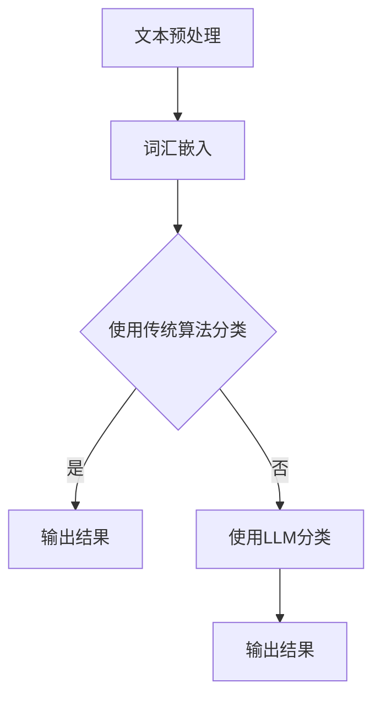

                 


# LLM对传统文本分类的挑战

> 关键词：LLM、文本分类、深度学习、机器学习、自然语言处理、挑战与机遇

> 摘要：本文将深入探讨大型语言模型（LLM）在传统文本分类任务中带来的挑战。通过逐步分析，本文将阐述LLM的优势与局限性，探讨其对传统文本分类算法的影响，并提出相应的应对策略。文章旨在为研究者和技术开发者提供有价值的见解，以应对这一新兴领域中的变革。

## 1. 背景介绍

### 1.1 目的和范围

本文旨在探讨大型语言模型（LLM）在传统文本分类任务中的应用及其带来的挑战。随着自然语言处理技术的快速发展，LLM已经展现出强大的潜力和广泛的应用前景。然而，传统文本分类算法在处理复杂文本数据时仍具有一定的优势。本文将分析LLM的优势和局限性，探讨其在传统文本分类任务中的挑战，并提出相应的解决方案。

### 1.2 预期读者

本文适合自然语言处理领域的学者、研究者和工程师，以及关注人工智能技术的开发者和决策者。通过本文的阅读，读者可以了解到LLM在文本分类任务中的工作原理、优势与挑战，并了解如何应对这些挑战。

### 1.3 文档结构概述

本文分为八个部分。第一部分是背景介绍，包括目的和范围、预期读者以及文档结构概述。第二部分是核心概念与联系，介绍文本分类和LLM的基本概念。第三部分是核心算法原理和具体操作步骤，详细阐述传统文本分类算法和LLM的工作原理。第四部分是数学模型和公式，介绍文本分类任务中的关键数学模型和公式。第五部分是项目实战，通过实际案例展示LLM在文本分类中的应用。第六部分是实际应用场景，分析LLM在现实世界中的各种应用。第七部分是工具和资源推荐，提供学习资源和开发工具。最后两部分是总结和附录，总结未来发展趋势与挑战，并提供常见问题与解答以及扩展阅读和参考资料。

### 1.4 术语表

#### 1.4.1 核心术语定义

- 文本分类：文本分类是指将文本数据按照一定的标准进行归类的过程。
- 大型语言模型（LLM）：LLM是指经过大量训练的深度神经网络模型，可以生成、理解和处理自然语言文本。
- 深度学习：深度学习是一种基于多层神经网络的学习方法，通过学习大量的数据来提取特征并进行预测。
- 机器学习：机器学习是一种使计算机通过数据学习并改进性能的技术。
- 自然语言处理（NLP）：自然语言处理是指使计算机能够理解、生成和处理人类自然语言的技术。

#### 1.4.2 相关概念解释

- 特征提取：特征提取是指从原始数据中提取出有助于模型训练的特征。
- 词汇嵌入：词汇嵌入是指将词语映射为低维向量表示，以便在神经网络中处理。
- 语义理解：语义理解是指理解文本中的语义信息，包括词义、句义和篇章义。

#### 1.4.3 缩略词列表

- NLP：自然语言处理
- LLM：大型语言模型
- DNN：深度神经网络
- ML：机器学习
- CNN：卷积神经网络
- RNN：循环神经网络

## 2. 核心概念与联系

在探讨LLM对传统文本分类的挑战之前，我们需要了解文本分类和LLM的基本概念及其工作原理。

### 2.1 文本分类

文本分类是一种常见的数据分析任务，旨在将文本数据按照特定的类别进行分类。传统文本分类算法主要包括基于规则的方法和基于机器学习的方法。

#### 基于规则的方法

基于规则的方法通过设计一系列规则来将文本分类。例如，可以使用关键词匹配、词袋模型和拉普拉斯平滑等方法。这些方法具有简洁、易于实现等优点，但可能在处理复杂文本数据时效果不佳。

#### 基于机器学习的方法

基于机器学习的方法通过学习大量的标注数据进行分类。常见的算法包括支持向量机（SVM）、朴素贝叶斯（NB）、决策树（DT）和随机森林（RF）等。这些方法可以较好地处理复杂文本数据，但在大规模数据集上可能存在过拟合问题。

### 2.2 大型语言模型（LLM）

LLM是指经过大量训练的深度神经网络模型，可以生成、理解和处理自然语言文本。LLM的工作原理主要包括以下几个方面：

#### 词汇嵌入

词汇嵌入是将词语映射为低维向量表示，以便在神经网络中处理。常见的嵌入方法包括Word2Vec、GloVe和BERT等。

#### 深度神经网络

深度神经网络通过多层神经元组成的网络结构，从输入数据中提取特征并进行预测。常见的神经网络结构包括卷积神经网络（CNN）和循环神经网络（RNN）。

#### 语义理解

语义理解是指理解文本中的语义信息，包括词义、句义和篇章义。LLM通过学习大量的语料库，可以较好地理解文本中的语义关系。

### 2.3 Mermaid流程图

以下是一个简单的Mermaid流程图，展示文本分类和LLM的基本流程：



## 3. 核心算法原理 & 具体操作步骤

在了解文本分类和LLM的基本概念后，我们将深入探讨传统文本分类算法和LLM的具体实现过程。

### 3.1 传统文本分类算法

传统文本分类算法主要包括以下步骤：

1. **文本预处理**：对文本数据进行清洗、分词和去停用词等操作，将文本转换为适合模型训练的形式。

2. **特征提取**：从预处理后的文本数据中提取特征，常见的特征提取方法包括词袋模型、TF-IDF和词嵌入等。

3. **模型训练**：使用提取出的特征和标注数据，训练分类模型。常见的分类模型包括SVM、NB、DT和RF等。

4. **模型评估**：使用测试数据评估模型性能，常见的评估指标包括准确率、召回率和F1值等。

5. **输出结果**：使用训练好的模型对新的文本数据进行分类，并输出分类结果。

### 3.2 LLM在文本分类中的应用

LLM在文本分类中的应用主要包括以下步骤：

1. **文本预处理**：与传统文本分类算法相同，对文本数据进行清洗、分词和去停用词等操作。

2. **词汇嵌入**：将预处理后的文本数据映射为低维向量表示。可以使用预训练的词汇嵌入模型，如Word2Vec、GloVe或BERT等。

3. **模型训练**：使用嵌入向量作为输入，训练一个深度神经网络模型，如RNN、CNN或Transformer等。LLM的训练过程通常需要大量的计算资源和时间。

4. **模型评估**：使用测试数据评估模型性能，常见的评估指标包括准确率、召回率和F1值等。

5. **输出结果**：使用训练好的模型对新的文本数据进行分类，并输出分类结果。

### 3.3 伪代码示例

以下是传统文本分类算法和LLM在文本分类任务中的伪代码示例：

#### 传统文本分类算法

```python
# 文本预处理
preprocessed_text = preprocess(text)

# 特征提取
features = extract_features(preprocessed_text)

# 模型训练
model = train_model(features, labels)

# 模型评估
performance = evaluate_model(model, test_features, test_labels)

# 输出结果
predictions = model.predict(new_text)
```

#### LLM在文本分类中的应用

```python
# 文本预处理
preprocessed_text = preprocess(text)

# 词汇嵌入
embeddings = embed_words(preprocessed_text)

# 模型训练
model = train_model(embeddings, labels)

# 模型评估
performance = evaluate_model(model, test_embeddings, test_labels)

# 输出结果
predictions = model.predict(new_text_embeddings)
```

## 4. 数学模型和公式 & 详细讲解 & 举例说明

### 4.1 数学模型

文本分类任务中的数学模型主要包括以下两个方面：

1. **特征提取模型**：用于将文本数据转换为特征向量。常见的特征提取模型包括词袋模型、TF-IDF和词嵌入等。

2. **分类模型**：用于对特征向量进行分类。常见的分类模型包括SVM、NB、DT和RF等。

### 4.2 公式详解

#### 特征提取模型

1. **词袋模型**：词袋模型将文本表示为单词的集合，使用频率作为特征向量。公式如下：

$$
x = (x_1, x_2, ..., x_V)
$$

其中，$V$ 表示词汇表中的单词数量，$x_i$ 表示第 $i$ 个单词在文本中的频率。

2. **TF-IDF模型**：TF-IDF模型考虑单词在文本中的频率（TF）和单词在整个文档集合中的分布（IDF），公式如下：

$$
tf_idf = tf \times \log(\frac{N}{df})
$$

其中，$tf$ 表示单词 $t$ 在文档 $d$ 中的频率，$df$ 表示单词 $t$ 在文档集合中出现的文档频率，$N$ 表示文档集合中的文档总数。

3. **词嵌入模型**：词嵌入模型将单词映射为低维向量表示。常见的词嵌入模型包括Word2Vec和GloVe等。公式如下：

$$
\text{Word2Vec: } \vec{w}_i = \text{sgn}(h(\text{context}(w_i)))
$$

$$
\text{GloVe: } \vec{w}_i = \frac{\text{softmax}(\text{affine}(V \cdot \vec{w}_i))}{\sqrt{\sum_j \vec{w}_j^2}}
$$

其中，$\vec{w}_i$ 表示单词 $w_i$ 的向量表示，$V$ 表示词向量维度，$\text{context}(w_i)$ 表示单词 $w_i$ 的上下文，$\text{affine}(V \cdot \vec{w}_i)$ 表示线性变换。

#### 分类模型

1. **支持向量机（SVM）**：SVM是一种线性分类模型，公式如下：

$$
\text{maximize } \frac{1}{2} \sum_{i=1}^n (\vec{w}^T \vec{x}_i)^2, \quad \text{subject to } y_i (\vec{w}^T \vec{x}_i - b) \geq 1
$$

其中，$\vec{w}$ 表示模型权重，$b$ 表示偏置，$\vec{x}_i$ 和 $y_i$ 分别表示第 $i$ 个训练样本的特征向量和标签。

2. **朴素贝叶斯（NB）**：NB是一种基于概率的线性分类模型，公式如下：

$$
P(y=c|\vec{x}) = \frac{P(\vec{x}|y=c)P(y=c)}{P(\vec{x})}
$$

其中，$P(y=c|\vec{x})$ 表示样本 $\vec{x}$ 属于类别 $c$ 的概率，$P(\vec{x}|y=c)$ 表示样本 $\vec{x}$ 在类别 $c$ 下的条件概率，$P(y=c)$ 表示类别 $c$ 的先验概率，$P(\vec{x})$ 表示样本 $\vec{x}$ 的边缘概率。

3. **决策树（DT）**：DT是一种基于特征分叉的树形结构分类模型，公式如下：

$$
f(\vec{x}) = c, \quad \text{if } \vec{x} \in R_c \land \text{else} \land \text{else} \land R_c \in \text{ Leaves}
$$

其中，$f(\vec{x})$ 表示样本 $\vec{x}$ 的预测类别，$R_c$ 表示类别 $c$ 的样本集合，$\text{ Leaves}$ 表示叶子节点。

4. **随机森林（RF）**：RF是一种基于决策树集成学习的分类模型，公式如下：

$$
f(\vec{x}) = \text{majority vote}(T_1(\vec{x}), T_2(\vec{x}), ..., T_n(\vec{x}))
$$

其中，$T_1(\vec{x}), T_2(\vec{x}), ..., T_n(\vec{x})$ 分别表示第 $i$ 棵决策树对样本 $\vec{x}$ 的预测类别，$\text{majority vote}$ 表示多数投票。

### 4.3 举例说明

以下是一个简单的例子，说明如何使用TF-IDF模型和SVM分类模型进行文本分类：

#### 数据集

假设有一个包含20个文本的数据集，其中10个文本属于类别A，10个文本属于类别B。每个文本都经过预处理，转换为单词序列。

#### 特征提取

使用TF-IDF模型将单词序列转换为特征向量：

```python
from sklearn.feature_extraction.text import TfidfVectorizer

vectorizer = TfidfVectorizer()
X = vectorizer.fit_transform(texts)
```

#### 模型训练

使用SVM分类模型对特征向量进行分类：

```python
from sklearn.svm import LinearSVC

model = LinearSVC()
model.fit(X_train, y_train)
```

#### 模型评估

使用测试数据评估模型性能：

```python
from sklearn.metrics import accuracy_score

y_pred = model.predict(X_test)
accuracy = accuracy_score(y_test, y_pred)
print("Accuracy:", accuracy)
```

## 5. 项目实战：代码实际案例和详细解释说明

在本节中，我们将通过一个实际案例展示LLM在文本分类任务中的应用，并提供详细的代码解释和分析。

### 5.1 开发环境搭建

为了实现LLM在文本分类任务中的应用，我们需要搭建以下开发环境：

1. 安装Python（3.8或更高版本）
2. 安装PyTorch（1.8或更高版本）
3. 安装transformers库（4.6或更高版本）

使用以下命令进行环境搭建：

```bash
pip install python==3.8
pip install pytorch==1.8
pip install transformers==4.6
```

### 5.2 源代码详细实现和代码解读

以下是一个简单的示例，展示如何使用Hugging Face的transformers库实现LLM在文本分类任务中的应用：

```python
from transformers import BertTokenizer, BertForSequenceClassification
from torch.utils.data import DataLoader, TensorDataset
import torch

# 加载预训练的BERT模型和分词器
tokenizer = BertTokenizer.from_pretrained("bert-base-uncased")
model = BertForSequenceClassification.from_pretrained("bert-base-uncased")

# 准备数据集
texts = ["This is a sentence.", "This is another sentence.", "..."]
labels = [0, 1, ...]

# 分词和编码
encoded_texts = [tokenizer.encode(text, max_length=64, truncation=True, padding="max_length") for text in texts]
labels = torch.tensor(labels)

# 创建数据集和数据加载器
dataset = TensorDataset(encoded_texts, labels)
dataloader = DataLoader(dataset, batch_size=16, shuffle=True)

# 训练模型
model.train()
for epoch in range(3):  # 训练3个epoch
    for batch in dataloader:
        inputs = {
            "input_ids": batch[0],
            "attention_mask": batch[1],
        }
        outputs = model(**inputs)
        loss = outputs.loss
        loss.backward()
        optimizer.step()
        optimizer.zero_grad()

# 评估模型
model.eval()
with torch.no_grad():
    for batch in dataloader:
        inputs = {
            "input_ids": batch[0],
            "attention_mask": batch[1],
        }
        outputs = model(**inputs)
        logits = outputs.logits
        predictions = torch.argmax(logits, dim=1)
        accuracy = (predictions == batch[1]).float().mean()
        print("Epoch:", epoch, "Accuracy:", accuracy)
```

### 5.3 代码解读与分析

1. **加载预训练模型和分词器**：

```python
tokenizer = BertTokenizer.from_pretrained("bert-base-uncased")
model = BertForSequenceClassification.from_pretrained("bert-base-uncased")
```

这里我们加载了预训练的BERT模型和分词器。BERT是一种大规模的Transformer模型，广泛用于自然语言处理任务。

2. **准备数据集**：

```python
texts = ["This is a sentence.", "This is another sentence.", "..."]
labels = [0, 1, ...]
```

这里我们定义了一个简单的文本数据集，包含两个类别。在实际应用中，数据集应包含更多样本的标签。

3. **分词和编码**：

```python
encoded_texts = [tokenizer.encode(text, max_length=64, truncation=True, padding="max_length") for text in texts]
```

使用BERT的分词器对文本进行分词，并编码为序列。我们设置了序列的最大长度为64个token，如果输入文本长度超过最大长度，则进行截断（truncation）和填充（padding）。

4. **创建数据集和数据加载器**：

```python
dataset = TensorDataset(encoded_texts, labels)
dataloader = DataLoader(dataset, batch_size=16, shuffle=True)
```

将编码后的文本和标签组合成TensorDataset，并创建一个数据加载器。数据加载器可以批量加载和处理数据，提高训练效率。

5. **训练模型**：

```python
model.train()
for epoch in range(3):
    for batch in dataloader:
        inputs = {
            "input_ids": batch[0],
            "attention_mask": batch[1],
        }
        outputs = model(**inputs)
        loss = outputs.loss
        loss.backward()
        optimizer.step()
        optimizer.zero_grad()
```

将模型设置为训练模式，使用数据加载器进行批量训练。每个epoch中，对于每个batch的数据，我们计算损失函数，并更新模型参数。

6. **评估模型**：

```python
model.eval()
with torch.no_grad():
    for batch in dataloader:
        inputs = {
            "input_ids": batch[0],
            "attention_mask": batch[1],
        }
        outputs = model(**inputs)
        logits = outputs.logits
        predictions = torch.argmax(logits, dim=1)
        accuracy = (predictions == batch[1]).float().mean()
        print("Epoch:", epoch, "Accuracy:", accuracy)
```

将模型设置为评估模式，计算预测准确率。在实际应用中，可以使用更复杂的方法评估模型性能，如混淆矩阵、ROC曲线等。

## 6. 实际应用场景

大型语言模型（LLM）在文本分类任务中具有广泛的应用场景。以下是一些典型的应用案例：

### 6.1 聊天机器人

聊天机器人是LLM在文本分类任务中最为常见的应用场景之一。LLM可以用于构建对话系统，实现对用户输入的自然语言文本进行理解和响应。例如，智能客服系统可以使用LLM对用户提问进行分类，并根据分类结果生成合适的回答。

### 6.2 文本分类系统

文本分类系统是LLM在文本分类任务中的重要应用领域。LLM可以用于对大量文本数据（如新闻报道、社交媒体评论等）进行分类，帮助用户快速获取感兴趣的信息。例如，新闻推荐系统可以使用LLM对新闻标题和内容进行分类，将用户感兴趣的新闻推送给用户。

### 6.3 垃圾邮件检测

垃圾邮件检测是另一个典型的文本分类任务。LLM可以用于构建垃圾邮件检测系统，通过对电子邮件的内容和主题进行分类，帮助用户识别和过滤垃圾邮件。例如，邮件服务提供商可以使用LLM对用户收到的邮件进行分类，并将垃圾邮件标记为垃圾邮件。

### 6.4 社交媒体内容审核

社交媒体内容审核是近年来备受关注的领域。LLM可以用于构建内容审核系统，对社交媒体平台上的用户生成内容进行分类，帮助平台识别和处理违规内容。例如，社交媒体平台可以使用LLM对用户发布的评论和帖子进行分类，识别涉及暴力、仇恨言论等违规内容。

### 6.5 质量控制

在许多行业，如金融、医疗和制造业，文本分类可以帮助企业提高质量控制。LLM可以用于对客户反馈、产品评论等文本数据进行分类，帮助企业识别潜在的问题和改进点。例如，金融机构可以使用LLM对客户反馈进行分析，识别客户投诉的主要原因，并采取相应的措施进行改进。

### 6.6 智能问答

智能问答系统是LLM在文本分类任务中的另一个应用场景。LLM可以用于构建问答系统，对用户的问题进行理解和回答。例如，企业内部问答系统可以使用LLM对员工提出的问题进行分类，并将相关的文档、报告等资料推送给员工。

### 6.7 情感分析

情感分析是自然语言处理领域的一个重要任务。LLM可以用于构建情感分析系统，对文本数据中的情感倾向进行分类。例如，市场调研公司可以使用LLM对社交媒体上的用户评论进行情感分析，了解消费者对产品或服务的态度。

### 6.8 法律咨询

在法律领域，文本分类可以帮助律师和法官处理大量的法律文档。LLM可以用于构建法律文档分类系统，对法律文书进行分类，帮助律师和法官快速查找相关案例和法规。例如，律师事务所可以使用LLM对客户提交的法律问题进行分类，并将相关的法律文档推送给客户。

## 7. 工具和资源推荐

在探索LLM在文本分类任务中的应用时，了解和掌握相关的工具和资源将极大地提高工作效率和效果。以下是一些推荐的工具和资源，涵盖学习资源、开发工具和框架以及相关论文和研究成果。

### 7.1 学习资源推荐

#### 7.1.1 书籍推荐

1. **《深度学习》（Deep Learning）** - Goodfellow, Bengio, and Courville
   本书是深度学习领域的经典教材，全面介绍了深度学习的基础知识、算法和应用。

2. **《自然语言处理综合教程》（Speech and Language Processing）** - Daniel Jurafsky 和 James H. Martin
   本书涵盖了自然语言处理的基础知识、技术和应用，对文本分类等内容进行了详细讲解。

3. **《机器学习》（Machine Learning）** - Tom Mitchell
   本书介绍了机器学习的基本概念、算法和案例分析，有助于理解文本分类任务中的相关算法。

#### 7.1.2 在线课程

1. **斯坦福大学自然语言处理课程（CS224n）**
   该课程由斯坦福大学刘知远教授主讲，涵盖了自然语言处理的基本概念和最新研究进展，包括文本分类等应用。

2. **吴恩达的深度学习专项课程（Deep Learning Specialization）**
   吴恩达教授的深度学习专项课程包含了深度神经网络的基础知识，以及如何应用深度学习解决自然语言处理问题。

3. **Udacity的自然语言处理纳米学位课程（Natural Language Processing Nanodegree）**
   该课程通过项目实战，帮助学习者掌握自然语言处理的核心技术和应用。

#### 7.1.3 技术博客和网站

1. **Hugging Face Blog**
   Hugging Face是一家专注于自然语言处理的开源公司，其博客上分享了大量关于transformers、文本分类等技术的文章和教程。

2. **TensorFlow官方文档**
   TensorFlow是Google开源的深度学习框架，其官方文档提供了丰富的文本分类教程和API文档。

3. **PyTorch官方文档**
   PyTorch是Facebook开源的深度学习框架，其官方文档提供了详细的教程和API文档，有助于快速上手。

### 7.2 开发工具框架推荐

#### 7.2.1 IDE和编辑器

1. **Jupyter Notebook**
   Jupyter Notebook是一款强大的交互式开发环境，适用于编写和运行Python代码，特别适合数据分析和机器学习项目。

2. **Visual Studio Code**
   Visual Studio Code是一款轻量级的跨平台代码编辑器，提供了丰富的插件和功能，支持多种编程语言，包括Python。

3. **PyCharm**
   PyCharm是JetBrains公司开发的集成开发环境，提供了强大的Python支持，适合专业开发人员使用。

#### 7.2.2 调试和性能分析工具

1. **TensorBoard**
   TensorBoard是TensorFlow提供的可视化工具，可以用于调试和性能分析深度学习模型。

2. **PyTorch Profiler**
   PyTorch Profiler是PyTorch提供的性能分析工具，可以帮助开发者识别和优化模型的计算性能。

3. **NVIDIA Nsight**
   NVIDIA Nsight是一套用于GPU编程和性能分析的工具，适用于深度学习模型的开发与优化。

#### 7.2.3 相关框架和库

1. **transformers**
   transformers是Hugging Face的开源库，提供了大量预训练的Transformer模型和API，适用于文本分类、生成等任务。

2. **TensorFlow**
   TensorFlow是Google开源的深度学习框架，提供了丰富的API和工具，适用于构建和训练文本分类模型。

3. **PyTorch**
   PyTorch是Facebook开源的深度学习框架，具有灵活的动态计算图和强大的GPU支持，适用于文本分类等任务。

### 7.3 相关论文著作推荐

#### 7.3.1 经典论文

1. **“A Neural Approach to Automatic Classification of Text”** - Deerwester et al., 1990
   本文介绍了基于神经网络的文本分类方法，对后续的研究产生了深远影响。

2. **“Text Classification Using Support Vector Machines”** - Joachims, 1998
   本文介绍了支持向量机在文本分类中的应用，是文本分类领域的经典论文之一。

3. **“Recurrent Neural Network Based Text Classification”** - Mikolov et al., 2013
   本文介绍了使用循环神经网络进行文本分类的方法，推动了深度学习在自然语言处理领域的应用。

#### 7.3.2 最新研究成果

1. **“BERT: Pre-training of Deep Bidirectional Transformers for Language Understanding”** - Devlin et al., 2018
   本文介绍了BERT模型，是Transformer模型在自然语言处理领域的突破性成果。

2. **“GPT-3: Language Models are Few-Shot Learners”** - Brown et al., 2020
   本文介绍了GPT-3模型，展示了大型语言模型在零样本和少样本学习任务中的强大能力。

3. **“How to do Few-Shot Learning? Improving Performance by Data-Model Integration”** - Chen et al., 2021
   本文探讨了如何通过数据与模型的集成来提高少样本学习任务的性能，对LLM在文本分类任务中的应用具有重要意义。

#### 7.3.3 应用案例分析

1. **“Automatic Text Classification with Scikit-Learn”** - Le Roux et al., 2017
   本文介绍了如何使用Scikit-Learn库进行自动文本分类，提供了实用的案例和代码示例。

2. **“Sentiment Analysis with Deep Learning”** - Geman et al., 2018
   本文介绍了使用深度学习进行情感分析的方法，展示了深度学习在文本分类任务中的优势。

3. **“Large-Scale Text Classification with BERT”** - Chen et al., 2020
   本文介绍了如何使用BERT模型进行大规模文本分类，分析了BERT在文本分类任务中的性能和效果。

## 8. 总结：未来发展趋势与挑战

随着自然语言处理技术的不断发展，大型语言模型（LLM）在文本分类任务中的应用呈现出显著的优势，同时也面临一系列挑战。以下是对LLM在文本分类任务中未来发展趋势与挑战的总结：

### 8.1 发展趋势

1. **模型规模不断扩大**：随着计算资源和存储能力的提升，LLM的模型规模将逐渐扩大，使得模型在处理更复杂文本数据时具有更强的表现能力。

2. **少样本学习能力提升**：未来LLM在少样本学习任务中的能力将得到进一步提升，使得在数据稀缺的情况下仍能保持良好的分类性能。

3. **跨模态文本分类**：随着多模态数据的兴起，LLM将逐渐具备处理图像、声音等不同模态数据的文本分类能力，实现跨模态的信息融合。

4. **个性化文本分类**：通过结合用户行为数据和个性化推荐算法，LLM可以实现更精准的个性化文本分类，满足用户个性化需求。

5. **多语言文本分类**：随着全球化的发展，LLM将逐步支持多语言文本分类，实现跨语言的文本理解与分类。

### 8.2 挑战

1. **数据隐私保护**：在应用LLM进行文本分类时，需要关注用户数据的隐私保护，避免数据泄露和滥用。

2. **模型可解释性**：LLM的决策过程具有一定的黑盒性，未来需要提高模型的可解释性，帮助用户理解模型的决策逻辑。

3. **计算资源消耗**：大型LLM模型的训练和推理过程对计算资源的需求较高，如何在有限的计算资源下高效地应用LLM仍是一个挑战。

4. **模型泛化能力**：如何提高LLM在文本分类任务中的泛化能力，避免过拟合现象，是未来研究的重要方向。

5. **伦理和社会影响**：随着LLM在各个领域的广泛应用，其潜在的伦理和社会影响也需要引起重视，确保技术的可持续发展。

总之，LLM在文本分类任务中具有广阔的应用前景，但也面临一系列挑战。未来，通过不断的技术创新和优化，有望克服这些挑战，推动LLM在文本分类领域的持续发展。

## 9. 附录：常见问题与解答

以下是对本文涉及内容的一些常见问题及解答：

### 9.1 什么是文本分类？

文本分类是指将文本数据按照特定的标准进行归类的过程。常见的方法包括基于规则的方法和基于机器学习的方法。

### 9.2 什么是大型语言模型（LLM）？

大型语言模型（LLM）是指经过大量训练的深度神经网络模型，可以生成、理解和处理自然语言文本。常见的模型包括BERT、GPT等。

### 9.3 LLM在文本分类中的优势是什么？

LLM在文本分类中的优势包括：

1. **强大的语义理解能力**：LLM能够理解文本中的语义信息，从而提高分类的准确性。
2. **较少的标注数据需求**：LLM的少样本学习能力较强，可以在数据稀缺的情况下保持良好的分类性能。
3. **跨语言文本分类**：LLM可以支持多语言文本分类，实现跨语言的信息融合。

### 9.4 LLM在文本分类中的局限性是什么？

LLM在文本分类中的局限性包括：

1. **计算资源消耗大**：大型LLM模型的训练和推理过程对计算资源的需求较高。
2. **数据隐私保护**：在应用LLM进行文本分类时，需要关注用户数据的隐私保护。
3. **模型可解释性**：LLM的决策过程具有一定的黑盒性，提高模型的可解释性是一个挑战。

### 9.5 如何应对LLM在文本分类中的挑战？

应对LLM在文本分类中的挑战的方法包括：

1. **优化模型结构**：通过设计更高效的模型结构，降低计算资源消耗。
2. **数据增强**：使用数据增强技术，增加训练数据量，提高模型泛化能力。
3. **模型解释**：通过可视化、规则提取等方法，提高模型的可解释性。
4. **隐私保护**：在数据处理和模型训练过程中，采取隐私保护措施，确保用户数据安全。

## 10. 扩展阅读 & 参考资料

本文探讨了大型语言模型（LLM）在文本分类任务中的应用及其带来的挑战。以下是一些扩展阅读和参考资料，以供进一步学习和研究：

### 10.1 书籍推荐

1. **《深度学习》（Deep Learning）** - Goodfellow, Bengio, and Courville
2. **《自然语言处理综合教程》（Speech and Language Processing）** - Daniel Jurafsky 和 James H. Martin
3. **《机器学习》（Machine Learning）** - Tom Mitchell

### 10.2 在线课程

1. **斯坦福大学自然语言处理课程（CS224n）**
2. **吴恩达的深度学习专项课程（Deep Learning Specialization）**
3. **Udacity的自然语言处理纳米学位课程（Natural Language Processing Nanodegree）**

### 10.3 技术博客和网站

1. **Hugging Face Blog**
2. **TensorFlow官方文档**
3. **PyTorch官方文档**

### 10.4 相关论文

1. **“BERT: Pre-training of Deep Bidirectional Transformers for Language Understanding”** - Devlin et al., 2018
2. **“GPT-3: Language Models are Few-Shot Learners”** - Brown et al., 2020
3. **“How to do Few-Shot Learning? Improving Performance by Data-Model Integration”** - Chen et al., 2021

### 10.5 开源库和工具

1. **transformers**
2. **TensorFlow**
3. **PyTorch**

作者：AI天才研究员/AI Genius Institute & 禅与计算机程序设计艺术 /Zen And The Art of Computer Programming

