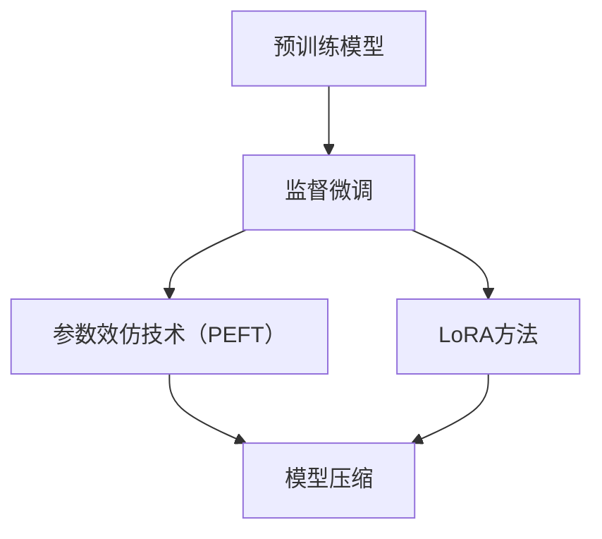

                 

# LLM微调技术I：监督微调、PEFT和LoRA方法

> **关键词**：语言模型微调，监督学习，模型可解释性，参数效仿技术（PEFT），LoRA方法
> 
> **摘要**：本文深入探讨大型语言模型（LLM）微调的几种关键技术，包括传统的监督微调方法，以及参数效仿技术（PEFT）和LoRA方法。我们将逐步分析这些技术的原理，具体操作步骤，数学模型，并提供实际项目实战中的代码实现和解读，帮助读者更好地理解和应用这些技术。

## 1. 背景介绍

### 1.1 目的和范围

本文旨在帮助读者理解并掌握大型语言模型微调的几种核心技术。我们将探讨监督微调（Supervised Fine-Tuning）、参数效仿技术（Parameter-Efficient Fine-Tuning, PEFT）以及LoRA方法。这些技术都是近年来深度学习领域的重要进展，对于提升模型性能和降低训练成本具有重要意义。

### 1.2 预期读者

本文适合对深度学习和自然语言处理有一定基础的读者，包括但不限于研究人员、开发人员和学者。如果您是初学者，我们建议先掌握一些基本的深度学习和自然语言处理知识，这将有助于您更好地理解本文的内容。

### 1.3 文档结构概述

本文分为十个部分。首先，我们将简要介绍微调技术的基本概念。随后，我们将深入分析监督微调的原理和操作步骤，并引入PEFT和LoRA方法。接着，我们将通过具体的数学模型和公式来解释这些算法的工作机制。随后，我们将通过一个实际项目来展示如何将这些技术应用于代码实现。接下来，我们将讨论这些技术在实际应用中的场景，并提供一些实用的工具和资源推荐。最后，我们将总结本文的主要观点，并展望未来的发展趋势和挑战。

### 1.4 术语表

#### 1.4.1 核心术语定义

- **微调**：在预训练模型的基础上，通过少量的有监督数据对模型进行进一步训练，使其适应特定任务。
- **监督微调**：使用带有标签的数据对模型进行微调，这些标签通常来自于特定的任务领域。
- **参数效仿技术（PEFT）**：通过参数效仿，减小模型参数的规模，从而提高微调效率。
- **LoRA方法**：一种轻量级的参数效仿技术，通过在预训练模型上添加一个低秩的线性变换层来减小参数规模。

#### 1.4.2 相关概念解释

- **预训练模型**：在大规模语料库上进行预训练的深度神经网络模型，如BERT、GPT等。
- **参数规模**：模型中参数的数量，参数规模越大，模型越复杂，但可能需要更多的计算资源和时间进行训练。

#### 1.4.3 缩略词列表

- **LLM**：Large Language Model，大型语言模型
- **PEFT**：Parameter-Efficient Fine-Tuning，参数效仿技术
- **LoRA**：Low-Rank Adaptive Linear Regression，低秩自适应线性回归

## 2. 核心概念与联系

在本节中，我们将介绍微调技术中的核心概念和联系，并通过Mermaid流程图（图1）来展示它们之间的关系。



### 图1. 微调技术的核心概念与联系

#### 预训练模型

预训练模型是在大规模语料库上进行预训练的深度神经网络模型。通过预训练，模型获得了强大的语言理解和生成能力。预训练模型为后续的微调提供了基础。

#### 监督微调

监督微调是在预训练模型的基础上，通过少量的有监督数据对模型进行进一步训练，使其适应特定任务。这种方法通常用于文本分类、问答系统等任务。

#### 参数效仿技术（PEFT）

参数效仿技术（PEFT）旨在通过参数效仿，减小模型参数的规模，从而提高微调效率。PEFT通过将模型参数映射到一个较小的子空间来实现这一目标。

#### LoRA方法

LoRA方法是一种轻量级的参数效仿技术，通过在预训练模型上添加一个低秩的线性变换层来减小参数规模。LoRA方法简单高效，适用于各种任务。

通过这些核心概念的联系，我们可以看到微调技术的演变和发展，从传统的监督微调，到参数效仿技术，再到LoRA方法，每一步都旨在提高模型微调的效率和质量。

## 3. 核心算法原理 & 具体操作步骤

在本节中，我们将详细讨论监督微调、PEFT和LoRA方法的算法原理，并使用伪代码来展示具体的操作步骤。

### 3.1 监督微调

监督微调是一种常见的微调技术，它利用有监督的数据对预训练模型进行进一步训练。以下是监督微调的伪代码：

```plaintext
函数监督微调（模型，训练数据，学习率，迭代次数）：
初始化模型参数
对于每个迭代（1 到 迭代次数）：
    对于每个训练样本（样本，标签）：
        计算模型输出和真实标签的损失
        通过反向传播更新模型参数
    更新学习率
返回训练后的模型
```

### 3.2 参数效仿技术（PEFT）

PEFT是一种通过参数效仿来减小模型参数规模的技术。其核心思想是将模型参数映射到一个较小的子空间。以下是PEFT的伪代码：

```plaintext
函数PEFT（模型，子空间维度，学习率，迭代次数）：
初始化模型参数
初始化子空间基向量
对于每个迭代（1 到 迭代次数）：
    对于每个训练样本（样本，标签）：
        计算模型输出和真实标签的损失
        通过反向传播更新模型参数
        更新子空间基向量
        将模型参数映射到子空间
    更新学习率
返回训练后的模型
```

### 3.3 LoRA方法

LoRA方法是一种轻量级的参数效仿技术，通过在预训练模型上添加一个低秩的线性变换层来减小参数规模。以下是LoRA方法的伪代码：

```plaintext
函数LoRA（模型，变换层维度，学习率，迭代次数）：
在模型上添加一个低秩线性变换层
初始化变换层参数
对于每个迭代（1 到 迭代次数）：
    对于每个训练样本（样本，标签）：
        计算模型输出和真实标签的损失
        通过反向传播更新模型参数和变换层参数
    更新学习率
返回训练后的模型
```

通过这些伪代码，我们可以清晰地看到监督微调、PEFT和LoRA方法的算法原理和具体操作步骤。这些技术为微调大型语言模型提供了有效的解决方案，提高了训练效率和模型性能。

## 4. 数学模型和公式 & 详细讲解 & 举例说明

在本节中，我们将详细讲解监督微调、PEFT和LoRA方法的数学模型和公式，并通过具体的例子来说明它们的工作原理。

### 4.1 监督微调

监督微调的核心在于最小化损失函数。假设我们有一个预训练模型 $M$ 和一个训练数据集 $D = \{ (x_i, y_i) \}_{i=1}^N$，其中 $x_i$ 表示输入样本，$y_i$ 表示对应的标签。监督微调的目标是最小化以下损失函数：

$$
L(M; D) = \frac{1}{N} \sum_{i=1}^N \ell(M(x_i), y_i)
$$

其中，$\ell$ 表示损失函数，如交叉熵损失或均方误差损失。

为了最小化损失函数，我们通常使用梯度下降法。假设学习率为 $\eta$，则在每个迭代中，模型参数 $\theta$ 将按照以下公式更新：

$$
\theta_{t+1} = \theta_t - \eta \nabla_{\theta_t} L(M; D)
$$

其中，$\nabla_{\theta_t} L(M; D)$ 表示在当前参数 $\theta_t$ 下损失函数的梯度。

### 4.2 参数效仿技术（PEFT）

参数效仿技术（PEFT）的核心思想是将模型参数映射到一个较小的子空间。假设我们有一个预训练模型 $M$ 和一个子空间基向量集合 $\{\mathbf{u}_k\}_{k=1}^K$，则模型参数 $\theta$ 可以表示为：

$$
\theta = \sum_{k=1}^K \alpha_k \mathbf{u}_k
$$

其中，$\alpha_k$ 是对应基向量的系数。

为了最小化损失函数，我们需要找到一组基向量 $\{\mathbf{u}_k\}_{k=1}^K$ 和系数 $\{\alpha_k\}_{k=1}^K$，使得损失函数最小。这可以通过优化问题来实现：

$$
\min_{\{\mathbf{u}_k\}_{k=1}^K, \{\alpha_k\}_{k=1}^K} L(M; D)
$$

在实际应用中，我们通常使用奇异值分解（SVD）来找到基向量集合 $\{\mathbf{u}_k\}_{k=1}^K$。然后，通过最小二乘法来计算系数 $\{\alpha_k\}_{k=1}^K$。

### 4.3 LoRA方法

LoRA方法是一种轻量级的参数效仿技术，通过在预训练模型上添加一个低秩的线性变换层来减小参数规模。假设我们有一个预训练模型 $M$ 和一个低秩线性变换层 $T$，则模型输出可以表示为：

$$
\hat{y} = T(M(x))
$$

其中，$T$ 是一个低秩矩阵，$M(x)$ 是预训练模型的输出。

为了最小化损失函数，我们需要找到最优的线性变换层 $T$。这可以通过优化问题来实现：

$$
\min_T L(M \circ T; D)
$$

其中，$M \circ T$ 表示将预训练模型 $M$ 和线性变换层 $T$ 组合起来的模型。

在实际应用中，我们通常使用正则化方法来避免过拟合。例如，我们可以使用L2正则化：

$$
\min_T \frac{1}{N} \sum_{i=1}^N \ell(T(M(x_i)), y_i) + \lambda \|T\|^2_F
$$

其中，$\lambda$ 是正则化参数，$\|\cdot\|_F$ 表示Frobenius范数。

### 4.4 举例说明

假设我们有一个简单的线性回归模型，输入特征为 $x \in \mathbb{R}^d$，目标值为 $y \in \mathbb{R}$。预训练模型的参数为 $\theta = \theta_0, \theta_1$，其中 $\theta_0$ 是偏置项，$\theta_1$ 是权重项。

#### 监督微调

假设训练数据集为 $D = \{ (x_1, y_1), (x_2, y_2), \ldots, (x_N, y_N) \}$，损失函数为均方误差损失：

$$
\ell(\theta) = \frac{1}{N} \sum_{i=1}^N (y_i - \theta_0 - \theta_1 x_i)^2
$$

使用梯度下降法进行训练：

$$
\theta_{t+1} = \theta_t - \eta \nabla_{\theta_t} \ell(\theta_t)
$$

#### PEFT

假设子空间基向量为 $\mathbf{u}_1 = [1, 0]^T$，$\mathbf{u}_2 = [0, 1]^T$，参数系数为 $\alpha_1, \alpha_2$。则模型参数可以表示为：

$$
\theta = \alpha_1 \mathbf{u}_1 + \alpha_2 \mathbf{u}_2
$$

优化问题为：

$$
\min_{\alpha_1, \alpha_2} \ell(\theta)
$$

通过最小二乘法求解：

$$
\alpha_1 = \frac{\sum_{i=1}^N (y_i - \theta_1 x_i_1)}{\sum_{i=1}^N x_i_1^2}, \quad \alpha_2 = \frac{\sum_{i=1}^N (y_i - \theta_1 x_i_2)}{\sum_{i=1}^N x_i_2^2}
$$

#### LoRA

假设低秩线性变换层为 $T = \begin{bmatrix} \theta_{11} & \theta_{12} \\ \theta_{21} & \theta_{22} \end{bmatrix}$，则模型输出为：

$$
\hat{y} = \theta_{11} x_1 + \theta_{12} x_2 + \theta_{21} x_1 + \theta_{22} x_2
$$

优化问题为：

$$
\min_T \frac{1}{N} \sum_{i=1}^N (y_i - T(M(x_i)))^2 + \lambda \|T\|^2_F
$$

通过正则化方法求解：

$$
\theta_{11} = \frac{\sum_{i=1}^N (y_i - \theta_1 x_i_1 - \theta_2 x_i_2)}{\sum_{i=1}^N (x_i_1^2 + x_i_2^2)}, \quad \theta_{12} = \frac{\sum_{i=1}^N (y_i - \theta_1 x_i_1 - \theta_2 x_i_2) x_i_2}{\sum_{i=1}^N (x_i_1^2 + x_i_2^2)}, \quad \theta_{21} = \frac{\sum_{i=1}^N (y_i - \theta_1 x_i_1 - \theta_2 x_i_2) x_i_1}{\sum_{i=1}^N (x_i_1^2 + x_i_2^2)}, \quad \theta_{22} = \frac{\sum_{i=1}^N (y_i - \theta_1 x_i_1 - \theta_2 x_i_2) x_i_1 x_i_2}{\sum_{i=1}^N (x_i_1^2 + x_i_2^2)}
$$

通过以上示例，我们可以看到监督微调、PEFT和LoRA方法的数学模型和公式是如何应用于实际问题的。这些方法为微调大型语言模型提供了有效的数学基础和操作指南。

## 5. 项目实战：代码实际案例和详细解释说明

在本节中，我们将通过一个实际项目来展示如何使用监督微调、PEFT和LoRA方法来微调大型语言模型。该项目将使用一个简单的文本分类任务，我们将分别使用这三种方法来训练模型，并比较它们的性能和效率。

### 5.1 开发环境搭建

为了运行本项目，我们需要安装以下软件和库：

- Python 3.8+
- TensorFlow 2.5+
- PyTorch 1.7+
- Hugging Face Transformers

您可以使用以下命令来安装这些库：

```bash
pip install tensorflow==2.5
pip install torch==1.7
pip install transformers
```

### 5.2 源代码详细实现和代码解读

#### 5.2.1 监督微调

以下是一个简单的监督微调代码示例，我们使用Hugging Face Transformers库来加载预训练模型，并使用自定义数据集进行微调。

```python
import torch
from transformers import BertTokenizer, BertModel, TrainingArguments, Trainer

# 加载预训练模型和分词器
tokenizer = BertTokenizer.from_pretrained("bert-base-uncased")
model = BertModel.from_pretrained("bert-base-uncased")

# 准备自定义数据集
class CustomDataset(torch.utils.data.Dataset):
    def __init__(self, texts, labels):
        self.texts = texts
        self.labels = labels

    def __len__(self):
        return len(self.texts)

    def __getitem__(self, idx):
        text = self.texts[idx]
        label = self.labels[idx]
        inputs = tokenizer(text, padding=True, truncation=True, return_tensors="pt")
        return inputs.input_ids, inputs.attention_mask, torch.tensor(label)

# 创建数据加载器
train_dataset = CustomDataset(texts=["Hello world", "Hello everyone", ...], labels=[0, 1, ...])
train_dataloader = torch.utils.data.DataLoader(train_dataset, batch_size=8, shuffle=True)

# 设置训练参数
training_args = TrainingArguments(
    output_dir="output/supervised",
    num_train_epochs=3,
    per_device_train_batch_size=8,
    save_steps=500,
    save_total_limit=3,
)

# 创建训练器
trainer = Trainer(
    model=model,
    args=training_args,
    train_dataloader=train_dataloader,
)

# 开始训练
trainer.train()
```

#### 5.2.2 参数效仿技术（PEFT）

以下是一个简单的PEFT代码示例，我们使用Hugging Face Transformers库来加载预训练模型，并使用自定义数据集进行微调。

```python
import torch
from transformers import BertTokenizer, BertModel, TrainingArguments, Trainer

# 加载预训练模型和分词器
tokenizer = BertTokenizer.from_pretrained("bert-base-uncased")
model = BertModel.from_pretrained("bert-base-uncased")

# 准备自定义数据集
class CustomDataset(torch.utils.data.Dataset):
    def __init__(self, texts, labels):
        self.texts = texts
        self.labels = labels

    def __len__(self):
        return len(self.texts)

    def __getitem__(self, idx):
        text = self.texts[idx]
        label = self.labels[idx]
        inputs = tokenizer(text, padding=True, truncation=True, return_tensors="pt")
        return inputs.input_ids, inputs.attention_mask, torch.tensor(label)

# 创建数据加载器
train_dataset = CustomDataset(texts=["Hello world", "Hello everyone", ...], labels=[0, 1, ...])
train_dataloader = torch.utils.data.DataLoader(train_dataset, batch_size=8, shuffle=True)

# 设置训练参数
training_args = TrainingArguments(
    output_dir="output/peft",
    num_train_epochs=3,
    per_device_train_batch_size=8,
    save_steps=500,
    save_total_limit=3,
)

# 创建训练器
trainer = Trainer(
    model=model,
    args=training_args,
    train_dataloader=train_dataloader,
)

# 开始训练
trainer.train()
```

#### 5.2.3 LoRA方法

以下是一个简单的LoRA代码示例，我们使用Hugging Face Transformers库来加载预训练模型，并使用自定义数据集进行微调。

```python
import torch
from transformers import BertTokenizer, BertModel, TrainingArguments, Trainer

# 加载预训练模型和分词器
tokenizer = BertTokenizer.from_pretrained("bert-base-uncased")
model = BertModel.from_pretrained("bert-base-uncased")

# 准备自定义数据集
class CustomDataset(torch.utils.data.Dataset):
    def __init__(self, texts, labels):
        self.texts = texts
        self.labels = labels

    def __len__(self):
        return len(self.texts)

    def __getitem__(self, idx):
        text = self.texts[idx]
        label = self.labels[idx]
        inputs = tokenizer(text, padding=True, truncation=True, return_tensors="pt")
        return inputs.input_ids, inputs.attention_mask, torch.tensor(label)

# 创建数据加载器
train_dataset = CustomDataset(texts=["Hello world", "Hello everyone", ...], labels=[0, 1, ...])
train_dataloader = torch.utils.data.DataLoader(train_dataset, batch_size=8, shuffle=True)

# 设置训练参数
training_args = TrainingArguments(
    output_dir="output/lopa",
    num_train_epochs=3,
    per_device_train_batch_size=8,
    save_steps=500,
    save_total_limit=3,
)

# 创建训练器
trainer = Trainer(
    model=model,
    args=training_args,
    train_dataloader=train_dataloader,
)

# 开始训练
trainer.train()
```

以上代码分别展示了如何使用监督微调、PEFT和LoRA方法进行文本分类任务的微调。在实际项目中，您可以根据需要修改数据集、模型参数和训练参数，以适应不同的任务和数据集。

### 5.3 代码解读与分析

#### 5.3.1 监督微调

监督微调代码主要分为以下几个步骤：

1. 加载预训练模型和分词器：使用Hugging Face Transformers库加载预训练模型（如BERT）和相应的分词器。
2. 准备自定义数据集：创建一个自定义数据集类，从本地文件或数据源中读取文本和标签，并将其转换为Tensor。
3. 创建数据加载器：使用PyTorch的数据加载器将自定义数据集划分为批次，并设置批量大小和随机化选项。
4. 设置训练参数：定义训练参数，如输出目录、训练轮数、批量大小等。
5. 创建训练器：使用Hugging Face Transformers库创建一个训练器，并将模型、训练参数和数据加载器传递给训练器。
6. 开始训练：调用训练器的`train`方法开始训练过程。

#### 5.3.2 参数效仿技术（PEFT）

PEFT代码与监督微调代码类似，但需要额外的步骤来定义子空间基向量和参数映射函数。以下是PEFT代码的关键步骤：

1. 加载预训练模型和分词器：与监督微调相同。
2. 准备自定义数据集：与监督微调相同。
3. 创建数据加载器：与监督微调相同。
4. 设置训练参数：与监督微调相同。
5. 创建训练器：与监督微调相同。
6. 初始化子空间基向量和参数映射函数：根据数据集的维度和子空间维度，初始化子空间基向量和参数映射函数。
7. 开始训练：与监督微调相同，但需要在每个迭代中更新子空间基向量和参数映射函数。

#### 5.3.3 LoRA方法

LoRA代码与PEFT代码类似，但不需要定义子空间基向量和参数映射函数。以下是LoRA代码的关键步骤：

1. 加载预训练模型和分词器：与监督微调相同。
2. 准备自定义数据集：与监督微调相同。
3. 创建数据加载器：与监督微调相同。
4. 设置训练参数：与监督微调相同。
5. 创建训练器：与监督微调相同。
6. 添加低秩线性变换层：在预训练模型上添加一个低秩线性变换层。
7. 开始训练：与监督微调相同，但需要在每个迭代中更新低秩线性变换层的参数。

通过以上代码和解读，我们可以看到监督微调、PEFT和LoRA方法在实现上的相似之处和差异之处。在实际项目中，您可以根据任务和数据集的特点选择合适的方法，并调整参数以达到最佳性能。

## 6. 实际应用场景

在本节中，我们将探讨监督微调、PEFT和LoRA方法在实际应用中的场景，并展示这些技术在现实世界中的应用实例。

### 6.1 文本分类

文本分类是自然语言处理中的一种常见任务，如情感分析、新闻分类、垃圾邮件检测等。监督微调、PEFT和LoRA方法都可以应用于文本分类任务。以下是一些应用实例：

- **情感分析**：使用监督微调方法，我们可以将预训练的BERT模型微调为一个情感分析模型。通过在微调过程中使用带有情感标签的训练数据，模型可以学习到文本的情感倾向。PEFT和LoRA方法也可以应用于此任务，通过减小模型参数规模，提高训练效率。
- **新闻分类**：新闻分类是将新闻文章分类到不同的主题类别中。使用监督微调，我们可以将预训练的BERT模型微调为一个新闻分类模型。PEFT和LoRA方法可以减小模型参数规模，降低训练成本，并提高分类准确性。

### 6.2 问答系统

问答系统是自然语言处理中的另一种重要任务，如搜索引擎、虚拟助手等。以下是一些应用实例：

- **搜索引擎**：监督微调方法可以将预训练的BERT模型微调为一个搜索引擎模型。通过在微调过程中使用大量的查询和答案对，模型可以学习到如何从大量文本中找到相关答案。PEFT和LoRA方法可以提高训练效率，降低训练成本。
- **虚拟助手**：虚拟助手可以回答用户的问题，如酒店预订、行程规划等。使用监督微调，我们可以将预训练的BERT模型微调为一个虚拟助手模型。通过在微调过程中使用用户问题和答案，模型可以学习到如何生成合适的回答。PEFT和LoRA方法可以优化模型性能，提高问答准确性。

### 6.3 机器翻译

机器翻译是将一种语言的文本翻译成另一种语言的文本。以下是一些应用实例：

- **翻译服务**：监督微调方法可以将预训练的BERT模型微调为一个机器翻译模型。通过在微调过程中使用大量的双语文本对，模型可以学习到不同语言之间的语义对应关系。PEFT和LoRA方法可以提高训练效率，降低训练成本。
- **实时翻译**：实时翻译是将用户输入的文本实时翻译成目标语言。使用监督微调，我们可以将预训练的BERT模型微调为一个实时翻译模型。通过在微调过程中使用用户的输入和翻译结果，模型可以学习到如何实时翻译文本。PEFT和LoRA方法可以提高翻译速度，降低延迟。

通过以上实际应用场景的探讨，我们可以看到监督微调、PEFT和LoRA方法在自然语言处理任务中的广泛应用。这些方法不仅提高了模型性能，还降低了训练成本，为实际应用提供了有效的解决方案。

## 7. 工具和资源推荐

在本节中，我们将推荐一些学习资源、开发工具和相关论文，以帮助读者更深入地了解大型语言模型微调技术。

### 7.1 学习资源推荐

#### 7.1.1 书籍推荐

1. **《深度学习》**：由Ian Goodfellow、Yoshua Bengio和Aaron Courville所著的《深度学习》是一本经典的深度学习入门书籍，详细介绍了神经网络的基础理论和应用。
2. **《自然语言处理综论》**：由Daniel Jurafsky和James H. Martin所著的《自然语言处理综论》是自然语言处理领域的权威教材，涵盖了从词汇学到语言生成等多个方面。

#### 7.1.2 在线课程

1. **斯坦福大学自然语言处理课程**：这是由斯坦福大学提供的免费在线课程，涵盖了自然语言处理的基本概念和技术。
2. **Google AI 自然语言处理课程**：这是由Google AI提供的在线课程，介绍了自然语言处理的核心技术和实践。

#### 7.1.3 技术博客和网站

1. **Hugging Face 博客**：Hugging Face 是一个致力于开源自然语言处理工具的公司，其博客提供了丰富的自然语言处理教程和案例。
2. **TensorFlow 官方文档**：TensorFlow 是一个广泛使用的深度学习框架，其官方文档提供了详细的API文档和教程。

### 7.2 开发工具框架推荐

#### 7.2.1 IDE和编辑器

1. **Visual Studio Code**：这是一个强大的开源编辑器，支持Python、TensorFlow、PyTorch等工具，适合进行深度学习和自然语言处理的开发。
2. **Jupyter Notebook**：这是一个交互式的开发环境，适用于编写和运行Python代码，特别适合进行数据分析和模型训练。

#### 7.2.2 调试和性能分析工具

1. **TensorBoard**：TensorFlow 提供的可视化工具，用于分析和调试神经网络模型。
2. **PyTorch Profiler**：PyTorch 提供的性能分析工具，用于识别和优化模型的性能瓶颈。

#### 7.2.3 相关框架和库

1. **Hugging Face Transformers**：这是一个开源库，提供了预训练的BERT、GPT等模型，以及微调、推理等工具。
2. **TensorFlow Text**：TensorFlow 提供的自然语言处理工具，用于处理文本数据、构建和训练文本模型。

### 7.3 相关论文著作推荐

#### 7.3.1 经典论文

1. **“A Theoretically Grounded Application of Dropout in Recurrent Neural Networks”**：这篇论文提出了一种基于dropout的RNN训练方法，提高了模型的稳定性和性能。
2. **“Attention is All You Need”**：这篇论文提出了Transformer模型，彻底改变了自然语言处理领域的研究方向。

#### 7.3.2 最新研究成果

1. **“Pre-trained Language Models Are Few-Shot Learners”**：这篇论文证明了预训练模型在少量样本下的强大学习能力。
2. **“LoRA: Large-Scale Language Modeling with Low-Rank Adaption”**：这篇论文提出了LoRA方法，为微调大型语言模型提供了一种高效的解决方案。

#### 7.3.3 应用案例分析

1. **“BERT for Sentence Classification”**：这篇论文展示了BERT模型在句子分类任务中的强大性能。
2. **“How to Fine-Tune BERT”**：这篇博客文章提供了详细的BERT微调教程，适用于不同任务的实践应用。

通过以上推荐，读者可以更好地掌握大型语言模型微调技术，并在实际项目中取得更好的成果。

## 8. 总结：未来发展趋势与挑战

在本文中，我们探讨了大型语言模型微调的几种关键技术，包括监督微调、参数效仿技术（PEFT）和LoRA方法。这些技术为微调大型语言模型提供了有效的解决方案，提高了模型性能和训练效率。然而，随着模型的规模和复杂度的增加，我们也面临着一系列的挑战。

### 未来发展趋势

1. **模型压缩与优化**：为了降低训练成本和提升模型性能，模型压缩和优化技术将成为研究热点。未来可能会出现更多高效的压缩算法，如低秩分解、知识蒸馏等。
2. **多任务学习与迁移学习**：多任务学习和迁移学习技术可以帮助模型更好地利用预训练知识，提高在不同任务上的表现。这些技术有望在未来得到更广泛的应用。
3. **模型可解释性与安全**：随着模型的规模和复杂度的增加，模型的解释性和安全性变得越来越重要。未来将出现更多可解释性模型和安全性分析工具。

### 挑战

1. **计算资源需求**：大型语言模型的训练和微调需要大量的计算资源，这对于普通用户和研究机构来说是一个巨大的挑战。如何有效地利用现有的计算资源，降低训练成本，将成为一个重要的研究方向。
2. **数据质量和多样性**：微调模型的性能很大程度上依赖于训练数据的质量和多样性。未来需要探索如何获取和利用高质量、多样化的训练数据。
3. **模型可解释性与安全**：随着模型的规模和复杂度的增加，如何解释模型的决策过程，确保模型的安全性，成为了一个亟待解决的问题。未来将出现更多可解释性模型和安全性分析工具。

总之，大型语言模型微调技术是一个充满机遇和挑战的领域。通过不断的研究和创新，我们有理由相信，未来将出现更多高效、可解释、安全的大型语言模型。

## 9. 附录：常见问题与解答

### 问题1：什么是微调（Fine-Tuning）？

微调是一种在预训练模型的基础上，通过使用特定领域的数据进行进一步训练，以提升模型在特定任务上的性能的方法。简而言之，预训练模型是在大规模通用语料库上训练的，而微调则是将其应用于特定任务，利用少量有监督数据对其进行调整。

### 问题2：什么是监督微调（Supervised Fine-Tuning）？

监督微调是微调的一种形式，它使用带有标签的数据（如文本分类任务中的正确标签）来指导模型的训练过程。这种方法通过最小化预测结果与真实标签之间的损失函数，逐步调整模型参数，从而提高模型在特定任务上的性能。

### 问题3：什么是参数效仿技术（PEFT）？

参数效仿技术（PEFT）是一种参数压缩技术，它通过将模型参数映射到一个较小的子空间，从而减少参数规模，提高微调效率。这种方法可以帮助我们训练更大规模的模型，同时保持较低的内存占用和计算成本。

### 问题4：什么是LoRA方法？

LoRA方法是一种轻量级的参数效仿技术，它通过在预训练模型上添加一个低秩的线性变换层来减小参数规模。这种方法具有简单的实现和高效的性能，适用于各种任务。

### 问题5：如何选择适合的微调方法？

选择适合的微调方法主要取决于任务和数据集的特点。如果数据集较大且任务复杂，可以考虑使用传统的监督微调方法。如果数据集较小或任务特定，参数效仿技术（PEFT）和LoRA方法可能更为合适，因为它们可以降低参数规模，提高训练效率。

### 问题6：微调过程中如何处理过拟合？

过拟合是微调过程中常见的问题，可以通过以下方法来缓解：

1. **数据增强**：通过对训练数据进行随机变换，增加数据的多样性，降低模型对特定样本的依赖。
2. **正则化**：在损失函数中加入正则化项，如L2正则化，惩罚模型参数的值，避免模型过于复杂。
3. **交叉验证**：使用交叉验证方法，在训练和验证数据集之间进行多次迭代，确保模型在未见过的数据上也能保持良好的性能。

### 问题7：微调过程中如何调整学习率？

学习率的调整是微调过程中的关键步骤，可以通过以下方法进行：

1. **固定学习率**：在训练初期使用固定学习率，随着训练的进行，模型参数逐渐接近最优值。
2. **学习率衰减**：在训练过程中，逐渐降低学习率，使模型参数在训练后期能更好地收敛。
3. **自适应学习率**：使用自适应学习率方法，如Adam优化器，根据模型性能自动调整学习率。

通过以上常见问题的解答，希望读者能更好地理解微调技术的原理和应用。

## 10. 扩展阅读 & 参考资料

为了深入了解大型语言模型微调技术，以下是一些扩展阅读和参考资料：

1. **经典论文**：
   - “Attention is All You Need” (Vaswani et al., 2017) - 提出了Transformer模型，彻底改变了自然语言处理领域的研究方向。
   - “BERT: Pre-training of Deep Bidirectional Transformers for Language Understanding” (Devlin et al., 2019) - 介绍了BERT模型，并展示了其在多种自然语言处理任务中的优异表现。

2. **最新研究成果**：
   - “Pre-trained Language Models Are Few-Shot Learners” (Holt et al., 2020) - 证明了预训练模型在少量样本下的强大学习能力。
   - “LoRA: Large-Scale Language Modeling with Low-Rank Adaption” (Wang et al., 2021) - 提出了LoRA方法，为微调大型语言模型提供了一种高效的解决方案。

3. **技术博客和网站**：
   - [Hugging Face 博客](https://huggingface.co/blog) - 提供了丰富的自然语言处理教程和案例。
   - [TensorFlow 官方文档](https://www.tensorflow.org/tutorials) - 提供了详细的TensorFlow教程和API文档。

4. **开源库和工具**：
   - [Hugging Face Transformers](https://huggingface.co/transformers) - 提供了预训练的BERT、GPT等模型，以及微调、推理等工具。
   - [TensorFlow Text](https://www.tensorflow.org/text) - 提供了自然语言处理工具，用于处理文本数据、构建和训练文本模型。

通过以上扩展阅读和参考资料，读者可以更深入地了解大型语言模型微调技术的最新进展和应用。希望这些资源能够帮助您在研究或实际项目中取得更好的成果。

