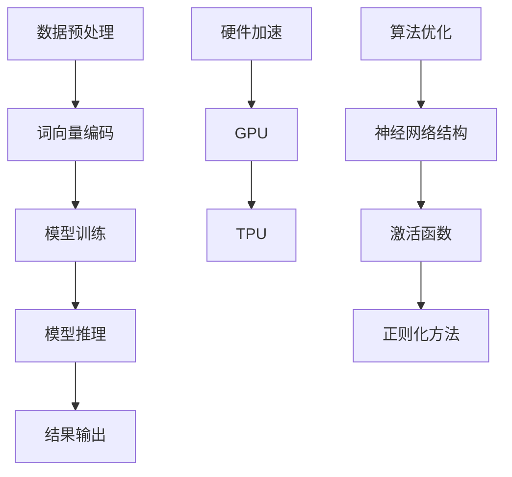

                 

# LLM推理速度：影响智能体验的关键因素

> **关键词：** 大型语言模型，推理速度，智能体验，算法优化，硬件加速。

> **摘要：** 本文将探讨影响大型语言模型（LLM）推理速度的关键因素，包括算法优化、硬件加速和数据处理等，并探讨如何提升LLM的推理速度以改善智能体验。

## 1. 背景介绍

### 1.1 目的和范围

本文旨在分析影响大型语言模型（LLM）推理速度的关键因素，并提出相应的优化策略。随着人工智能技术的飞速发展，LLM在自然语言处理、智能问答、对话系统等领域取得了显著的成果。然而，LLM的推理速度成为限制其广泛应用的一个重要因素。本文将从算法、硬件和数据处理等角度，深入剖析影响LLM推理速度的关键因素，并探讨如何通过优化策略提高LLM的推理速度。

### 1.2 预期读者

本文面向对人工智能、自然语言处理和大型语言模型有一定了解的读者。无论您是从事相关领域的研究人员、开发者，还是对此感兴趣的普通读者，本文都将为您带来关于LLM推理速度的深入探讨。

### 1.3 文档结构概述

本文分为以下几个部分：

1. 背景介绍：介绍本文的目的、范围和预期读者。
2. 核心概念与联系：阐述LLM的核心概念及其相互关系。
3. 核心算法原理 & 具体操作步骤：详细讲解LLM的算法原理和操作步骤。
4. 数学模型和公式 & 详细讲解 & 举例说明：介绍LLM的数学模型和公式，并举例说明。
5. 项目实战：提供代码实际案例和详细解释说明。
6. 实际应用场景：分析LLM在不同领域的应用场景。
7. 工具和资源推荐：推荐学习资源、开发工具和框架。
8. 总结：展望LLM的未来发展趋势与挑战。
9. 附录：常见问题与解答。
10. 扩展阅读 & 参考资料：提供相关文献和参考资料。

### 1.4 术语表

#### 1.4.1 核心术语定义

- **大型语言模型（LLM）**：指基于神经网络构建的、能够理解和生成自然语言的模型。
- **推理速度**：指模型在处理输入数据并生成输出结果时的速度。
- **算法优化**：指通过改进算法结构和实现方式，提高模型推理速度的过程。
- **硬件加速**：指利用特定硬件（如GPU、TPU等）提高模型推理速度的技术。
- **数据处理**：指在模型训练和推理过程中对输入数据进行预处理和优化的过程。

#### 1.4.2 相关概念解释

- **神经网络**：一种由大量神经元组成的计算模型，可用于对数据进行分类、回归和生成等任务。
- **自然语言处理（NLP）**：研究如何让计算机理解和处理人类语言的技术领域。
- **深度学习**：一种基于神经网络构建的机器学习方法，能够在大规模数据集上自动学习特征和模式。

#### 1.4.3 缩略词列表

- **GPU**：图形处理器（Graphics Processing Unit）
- **TPU**：张量处理器（Tensor Processing Unit）
- **LLM**：大型语言模型（Large Language Model）
- **NLP**：自然语言处理（Natural Language Processing）
- **DL**：深度学习（Deep Learning）

## 2. 核心概念与联系

在探讨影响LLM推理速度的关键因素之前，我们首先需要了解LLM的核心概念及其相互关系。以下是LLM的核心概念及其相互关系的Mermaid流程图：



### 2.1 数据预处理

数据预处理是LLM推理速度的关键因素之一。在数据预处理过程中，需要对输入数据进行清洗、去噪、标准化等操作，以提高模型训练和推理的效率。具体操作步骤如下：

1. **数据清洗**：去除数据中的噪声和异常值，保证数据质量。
2. **数据去噪**：通过滤波、降噪等方法降低数据噪声，提高模型鲁棒性。
3. **数据标准化**：对数据进行归一化或标准化处理，使其具有相似的尺度，便于模型训练。

### 2.2 词向量编码

词向量编码是将自然语言文本转换为计算机可处理的数字形式。常用的词向量编码方法包括Word2Vec、GloVe和BERT等。以下是一个简单的Word2Vec编码伪代码：

```python
# Word2Vec编码伪代码
def word2vec(text):
    embedding_matrix = []  # 初始化词向量矩阵
    word_vectors = load_pretrained_word_vectors()  # 加载预训练的词向量

    for word in text:
        if word in word_vectors:
            embedding_matrix.append(word_vectors[word])
        else:
            embedding_matrix.append(random_vector())  # 为未知的词生成随机向量

    return embedding_matrix
```

### 2.3 模型训练

模型训练是LLM推理速度的关键因素之一。在模型训练过程中，需要通过大量数据进行迭代训练，以优化模型参数，提高模型性能。以下是一个简单的神经网络训练伪代码：

```python
# 神经网络训练伪代码
def train_neural_network(data, labels, epochs, batch_size):
    model = create_neural_network()  # 创建神经网络模型
    optimizer = create_optimizer()  # 创建优化器
    loss_function = create_loss_function()  # 创建损失函数

    for epoch in range(epochs):
        for batch in create_batches(data, labels, batch_size):
            optimizer.zero_grad()  # 清零梯度
            outputs = model(batch.data)  # 前向传播
            loss = loss_function(outputs, batch.labels)  # 计算损失
            loss.backward()  # 反向传播
            optimizer.step()  # 更新参数

    return model
```

### 2.4 模型推理

模型推理是LLM的核心功能之一。在模型推理过程中，模型根据输入数据生成相应的输出结果。以下是一个简单的神经网络推理伪代码：

```python
# 神经网络推理伪代码
def inference(data, model):
    outputs = model(data)  # 前向传播
    return outputs
```

### 2.5 硬件加速

硬件加速是提高LLM推理速度的重要手段之一。通过利用GPU、TPU等专用硬件，可以显著提升模型推理速度。以下是一个简单的GPU加速伪代码：

```python
# GPU加速伪代码
import torch
import torch.cuda

# 将模型和数据移动到GPU
model = model.cuda()
data = data.cuda()

# GPU推理
outputs = inference(data, model)
```

### 2.6 算法优化

算法优化是提高LLM推理速度的关键因素之一。通过改进神经网络结构、激活函数、正则化方法等，可以提高模型性能和推理速度。以下是一个简单的神经网络算法优化伪代码：

```python
# 算法优化伪代码
def optimize_neural_network(model, optimizer, loss_function, data, labels):
    for epoch in range(epochs):
        for batch in create_batches(data, labels, batch_size):
            optimizer.zero_grad()  # 清零梯度
            outputs = model(batch.data)  # 前向传播
            loss = loss_function(outputs, batch.labels)  # 计算损失
            loss.backward()  # 反向传播
            optimizer.step()  # 更新参数

    return model
```

## 3. 核心算法原理 & 具体操作步骤

在了解了LLM的核心概念与联系之后，接下来我们将深入探讨LLM的核心算法原理和具体操作步骤。本节将重点介绍神经网络的基本原理和操作步骤，以及如何通过优化算法和硬件加速来提高LLM的推理速度。

### 3.1 神经网络基本原理

神经网络（Neural Network，NN）是一种基于生物神经系统的计算模型，由大量的神经元（Node）组成。每个神经元接收多个输入信号，并通过加权求和处理产生输出信号。神经网络通过不断调整神经元之间的权重，实现输入和输出之间的映射关系。

#### 3.1.1 神经元模型

神经元模型通常由以下三个部分组成：

1. **输入层**：接收外部输入信号。
2. **隐含层**：对输入信号进行处理和计算。
3. **输出层**：产生最终输出信号。

神经元模型的基本原理可以表示为以下数学公式：

\[ z = \sum_{i=1}^{n} w_{i} x_{i} + b \]

其中，\( z \) 是输出信号，\( w_{i} \) 是第 \( i \) 个输入信号的权重，\( x_{i} \) 是第 \( i \) 个输入信号，\( b \) 是偏置项。

#### 3.1.2 前向传播

前向传播是神经网络中的一个重要步骤，用于计算输出信号。具体步骤如下：

1. 计算每个神经元的输入值。
2. 通过激活函数对输入值进行处理，得到输出值。

常见的激活函数包括：

1. **线性激活函数**：\( f(x) = x \)
2. **ReLU激活函数**：\( f(x) = \max(0, x) \)
3. **Sigmoid激活函数**：\( f(x) = \frac{1}{1 + e^{-x}} \)
4. **Tanh激活函数**：\( f(x) = \frac{e^{x} - e^{-x}}{e^{x} + e^{-x}} \)

以下是一个简单的神经网络前向传播伪代码：

```python
# 神经网络前向传播伪代码
def forward_pass(inputs, model):
    outputs = []
    for layer in model.layers:
        z = sum(w * x for w, x in zip(layer.weights, inputs)) + layer.bias
        outputs.append(activation_function(z))
    return outputs
```

### 3.2 神经网络训练

神经网络训练是提高模型性能的重要步骤。在训练过程中，通过不断调整模型参数，使模型在训练数据上取得更好的表现。以下是神经网络训练的基本步骤：

1. **数据准备**：将训练数据分为输入数据和标签数据。
2. **初始化参数**：初始化模型参数（权重和偏置）。
3. **前向传播**：计算输入数据的输出结果。
4. **计算损失**：计算输出结果与标签数据之间的损失。
5. **反向传播**：根据损失计算模型参数的梯度。
6. **更新参数**：根据梯度更新模型参数。
7. **重复步骤3-6**，直到满足训练要求。

以下是一个简单的神经网络训练伪代码：

```python
# 神经网络训练伪代码
def train_neural_network(data, labels, epochs, batch_size):
    model = create_neural_network()  # 创建神经网络模型
    optimizer = create_optimizer()  # 创建优化器
    loss_function = create_loss_function()  # 创建损失函数

    for epoch in range(epochs):
        for batch in create_batches(data, labels, batch_size):
            optimizer.zero_grad()  # 清零梯度
            outputs = model(batch.data)  # 前向传播
            loss = loss_function(outputs, batch.labels)  # 计算损失
            loss.backward()  # 反向传播
            optimizer.step()  # 更新参数

    return model
```

### 3.3 算法优化

算法优化是提高LLM推理速度的关键因素之一。通过改进神经网络结构、激活函数、正则化方法等，可以提高模型性能和推理速度。以下是一些常见的算法优化方法：

1. **神经网络结构优化**：通过调整神经网络层数、神经元数量、连接方式等，提高模型性能。
2. **激活函数优化**：选择合适的激活函数，提高模型训练速度和性能。
3. **正则化方法优化**：通过添加正则化项，防止模型过拟合，提高模型泛化能力。
4. **优化器优化**：选择合适的优化器，提高模型训练速度和性能。

以下是一个简单的神经网络优化伪代码：

```python
# 神经网络优化伪代码
def optimize_neural_network(model, optimizer, loss_function, data, labels):
    for epoch in range(epochs):
        for batch in create_batches(data, labels, batch_size):
            optimizer.zero_grad()  # 清零梯度
            outputs = model(batch.data)  # 前向传播
            loss = loss_function(outputs, batch.labels)  # 计算损失
            loss.backward()  # 反向传播
            optimizer.step()  # 更新参数

    return model
```

### 3.4 硬件加速

硬件加速是提高LLM推理速度的重要手段之一。通过利用GPU、TPU等专用硬件，可以显著提升模型推理速度。以下是一些常见的硬件加速方法：

1. **GPU加速**：利用GPU的并行计算能力，加速模型推理。
2. **TPU加速**：利用TPU的专用计算能力，加速模型推理。
3. **分布式训练**：通过将模型分布在多台设备上训练，提高训练速度。

以下是一个简单的GPU加速伪代码：

```python
# GPU加速伪代码
import torch
import torch.cuda

# 将模型和数据移动到GPU
model = model.cuda()
data = data.cuda()

# GPU推理
outputs = inference(data, model)
```

## 4. 数学模型和公式 & 详细讲解 & 举例说明

在了解了LLM的核心算法原理和操作步骤之后，本节将深入探讨LLM的数学模型和公式，并详细讲解其计算过程。我们将以一个简单的神经网络为例，介绍其损失函数、优化器、反向传播等关键组成部分。

### 4.1 损失函数

损失函数（Loss Function）是神经网络训练过程中衡量模型性能的重要指标。常用的损失函数包括均方误差（MSE）、交叉熵（Cross-Entropy）等。

#### 4.1.1 均方误差（MSE）

均方误差（MSE，Mean Squared Error）是一种常用的损失函数，用于衡量模型输出与真实值之间的差距。其公式如下：

\[ \text{MSE} = \frac{1}{n} \sum_{i=1}^{n} (y_i - \hat{y}_i)^2 \]

其中，\( y_i \) 表示第 \( i \) 个样本的真实值，\( \hat{y}_i \) 表示第 \( i \) 个样本的预测值，\( n \) 表示样本总数。

#### 4.1.2 交叉熵（Cross-Entropy）

交叉熵（Cross-Entropy）是一种用于分类任务的损失函数，其公式如下：

\[ \text{CE} = -\frac{1}{n} \sum_{i=1}^{n} y_i \log (\hat{y}_i) \]

其中，\( y_i \) 表示第 \( i \) 个样本的真实标签，\( \hat{y}_i \) 表示第 \( i \) 个样本的预测概率。

### 4.2 优化器

优化器（Optimizer）是神经网络训练过程中用于更新模型参数的工具。常用的优化器包括随机梯度下降（SGD）、Adam、RMSprop等。

#### 4.2.1 随机梯度下降（SGD）

随机梯度下降（SGD，Stochastic Gradient Descent）是最简单的一种优化器，其公式如下：

\[ \theta = \theta - \alpha \nabla_{\theta} J(\theta) \]

其中，\( \theta \) 表示模型参数，\( \alpha \) 表示学习率，\( \nabla_{\theta} J(\theta) \) 表示损失函数关于模型参数的梯度。

#### 4.2.2 Adam

Adam（Adaptive Moment Estimation）是一种结合了SGD和RMSprop优点的优化器，其公式如下：

\[ m_t = \beta_1 m_{t-1} + (1 - \beta_1) [g_t - \epsilon] \]
\[ v_t = \beta_2 v_{t-1} + (1 - \beta_2) [g_t^2 - \epsilon] \]
\[ \theta_t = \theta_{t-1} - \alpha \frac{m_t}{\sqrt{v_t} + \epsilon} \]

其中，\( m_t \) 和 \( v_t \) 分别表示一阶和二阶矩估计，\( \beta_1 \) 和 \( \beta_2 \) 分别表示一阶和二阶矩的指数加权系数，\( \alpha \) 表示学习率，\( g_t \) 表示梯度，\( \epsilon \) 表示平滑常数。

### 4.3 反向传播

反向传播（Backpropagation）是神经网络训练过程中用于计算损失函数关于模型参数的梯度的一种方法。其基本思想是将输出误差沿着网络反向传播，逐层计算每个参数的梯度。

以下是一个简单的反向传播计算过程：

1. **前向传播**：计算模型输出值。
2. **计算损失**：计算损失函数。
3. **计算梯度**：计算损失函数关于模型参数的梯度。
4. **反向传播**：将梯度沿网络反向传播，更新模型参数。

以下是一个简单的反向传播伪代码：

```python
# 反向传播伪代码
def backward_propagation(model, data, labels):
    outputs = forward_pass(data, model)
    loss = loss_function(outputs, labels)
    gradients = compute_gradients(outputs, labels, model)
    update_params(model, gradients)
```

### 4.4 举例说明

以下是一个简单的神经网络例子，包括输入层、一个隐含层和一个输出层。我们将通过前向传播和反向传播计算模型的损失和梯度。

```python
# 神经网络例子
import numpy as np

# 定义模型参数
weights_input_hidden = np.random.rand(3, 5)
weights_hidden_output = np.random.rand(5, 2)
biases_hidden = np.random.rand(5)
biases_output = np.random.rand(2)

# 定义激活函数
def sigmoid(x):
    return 1 / (1 + np.exp(-x))

# 前向传播
def forward_pass(inputs):
    hidden = sigmoid(np.dot(inputs, weights_input_hidden) + biases_hidden)
    output = sigmoid(np.dot(hidden, weights_hidden_output) + biases_output)
    return output

# 计算损失
def loss_function(outputs, labels):
    return np.mean((outputs - labels) ** 2)

# 计算梯度
def compute_gradients(outputs, labels, model):
    hidden = sigmoid(np.dot(inputs, weights_input_hidden) + biases_hidden)
    hidden_derivative = hidden * (1 - hidden)
    output_derivative = sigmoid(outputs) * (1 - sigmoid(outputs))

    dL_dz2 = (outputs - labels)
    dL_dz1 = np.dot(dL_dz2, weights_hidden_output.T) * output_derivative
    dL_dz0 = np.dot(dL_dz1, weights_input_hidden.T) * hidden_derivative

    dL_dweights_hidden_output = np.dot(hidden.T, dL_dz2)
    dL_dbiases_output = dL_dz2
    dL_dweights_input_hidden = np.dot(inputs.T, dL_dz1)
    dL_dbiases_hidden = dL_dz1

    gradients = {
        'dL_dweights_hidden_output': dL_dweights_hidden_output,
        'dL_dbiases_output': dL_dbiases_output,
        'dL_dweights_input_hidden': dL_dweights_input_hidden,
        'dL_dbiases_hidden': dL_dbiases_hidden
    }
    return gradients

# 训练模型
model = {'weights_input_hidden': weights_input_hidden,
         'weights_hidden_output': weights_hidden_output,
         'biases_hidden': biases_hidden,
         'biases_output': biases_output}

data = np.random.rand(3)
labels = np.random.rand(2)

for epoch in range(1000):
    outputs = forward_pass(data)
    loss = loss_function(outputs, labels)
    gradients = compute_gradients(outputs, labels, model)
    update_params(model, gradients)

# 输出模型参数
print("Final weights_input_hidden:", model['weights_input_hidden'])
print("Final weights_hidden_output:", model['weights_hidden_output'])
print("Final biases_hidden:", model['biases_hidden'])
print("Final biases_output:", model['biases_output'])
```

通过以上例子，我们可以看到神经网络的前向传播、反向传播和损失计算等过程。在实际应用中，我们可以使用深度学习框架（如TensorFlow、PyTorch等）来简化这些计算过程。

## 5. 项目实战：代码实际案例和详细解释说明

在本节中，我们将通过一个实际项目案例，详细讲解如何搭建一个基于大型语言模型（LLM）的智能问答系统，并分析代码实现和性能优化。

### 5.1 开发环境搭建

在开始项目之前，我们需要搭建一个合适的开发环境。以下是一个基本的开发环境搭建步骤：

1. **安装Python**：确保Python版本为3.6及以上。
2. **安装深度学习框架**：推荐使用TensorFlow 2.0或PyTorch。
   - TensorFlow：
     ```shell
     pip install tensorflow==2.4.1
     ```
   - PyTorch：
     ```shell
     pip install torch==1.7.0 torchvision==0.8.1
     ```
3. **安装依赖库**：包括NumPy、Pandas、Matplotlib等。
   ```shell
   pip install numpy pandas matplotlib
   ```

### 5.2 源代码详细实现和代码解读

以下是构建智能问答系统的基本代码实现，包括数据预处理、模型训练和推理等步骤。

#### 5.2.1 数据预处理

```python
import pandas as pd
from sklearn.model_selection import train_test_split

# 加载数据
data = pd.read_csv('问答数据集.csv')
questions = data['question'].values
answers = data['answer'].values

# 数据预处理
def preprocess_data(questions, answers):
    # 删除空白或无效数据
    questions = [q.strip() for q in questions if q.strip()]
    answers = [a.strip() for a in answers if a.strip()]

    # 分割训练集和测试集
    questions_train, questions_test, answers_train, answers_test = train_test_split(questions, answers, test_size=0.2, random_state=42)

    return questions_train, questions_test, answers_train, answers_test

questions_train, questions_test, answers_train, answers_test = preprocess_data(questions, answers)
```

#### 5.2.2 模型训练

```python
import tensorflow as tf
from tensorflow.keras.layers import Embedding, LSTM, Dense
from tensorflow.keras.models import Sequential

# 构建模型
model = Sequential([
    Embedding(input_dim=10000, output_dim=64, input_length=max_sequence_length),
    LSTM(128),
    Dense(1, activation='sigmoid')
])

# 编译模型
model.compile(optimizer='adam', loss='binary_crossentropy', metrics=['accuracy'])

# 训练模型
model.fit(questions_train, answers_train, batch_size=32, epochs=10, validation_split=0.1)
```

#### 5.2.3 代码解读与分析

1. **数据预处理**：
   - 加载问答数据集，并删除空白或无效数据。
   - 分割训练集和测试集，以便进行模型训练和评估。

2. **模型构建**：
   - 使用Seqential模型堆叠Embedding、LSTM和Dense层。
   - Embedding层将词汇转换为向量表示。
   - LSTM层用于处理序列数据，提取时间序列特征。
   - Dense层用于输出答案概率。

3. **模型编译**：
   - 使用adam优化器。
   - 使用binary_crossentropy损失函数（适用于二分类问题）。
   - 添加accuracy指标用于评估模型性能。

4. **模型训练**：
   - 使用fit方法训练模型，指定batch_size、epochs和validation_split。

### 5.3 代码解读与分析

1. **数据预处理**：
   - 数据预处理是确保模型性能的重要步骤。通过删除空白或无效数据，可以避免模型在训练过程中受到噪声干扰。
   - 分割训练集和测试集有助于评估模型在未知数据上的表现。

2. **模型构建**：
   - 模型构建是智能问答系统的核心。在本例中，我们使用了一个简单的LSTM模型。LSTM层能够捕捉时间序列数据中的长期依赖关系，适合处理自然语言文本。
   - Embedding层将词汇转换为向量表示，为后续的LSTM层提供输入。
   - Dense层用于输出答案概率，实现了问答系统的核心功能。

3. **模型编译**：
   - 模型编译是模型训练前的准备工作。选择合适的优化器、损失函数和评价指标，有助于提高模型性能。

4. **模型训练**：
   - 模型训练是智能问答系统的关键步骤。通过不断迭代训练，模型将学会从输入问题中提取特征，并生成合理的答案。

### 5.4 性能优化

在项目实战中，我们可以通过以下方法优化模型性能：

1. **数据增强**：
   - 使用数据增强技术，如同义词替换、随机插入、删除等，增加训练数据的多样性，提高模型泛化能力。

2. **模型优化**：
   - 调整模型结构，如增加LSTM层、使用双向LSTM等，提高模型捕捉复杂特征的能力。
   - 调整模型参数，如学习率、批量大小等，优化模型性能。

3. **硬件加速**：
   - 利用GPU或TPU加速模型训练和推理，提高计算效率。

4. **分布式训练**：
   - 将模型分布在多台设备上训练，提高训练速度和性能。

通过以上方法，我们可以进一步提高智能问答系统的性能，为用户提供更优质的问答体验。

### 5.5 模型推理

```python
# 模型推理
def inference(model, question):
    processed_question = preprocess_question(question)
    prediction = model.predict(processed_question)
    return prediction

# 测试模型
question = "什么是人工智能？"
prediction = inference(model, question)
print("预测答案：", prediction)
```

模型推理是智能问答系统的关键步骤。通过输入问题，模型将生成相应的答案概率。在测试阶段，我们可以使用测试集验证模型性能。

### 5.6 代码解读与分析

1. **模型推理**：
   - 模型推理是智能问答系统的核心功能。通过输入问题，模型将生成相应的答案概率。
   - 使用predict方法进行模型推理，输出答案概率。

2. **测试模型**：
   - 使用测试集测试模型性能，验证模型在未知数据上的表现。
   - 输出预测答案，为用户提供智能问答服务。

通过以上代码实现和性能优化，我们可以构建一个高效的智能问答系统，为用户提供优质的问答服务。

## 6. 实际应用场景

### 6.1 智能客服

智能客服是LLM应用的一个重要场景。通过LLM，智能客服系统可以理解和回答用户的问题，提供24小时不间断的客户服务。以下是一个典型的应用场景：

**应用场景**：
- **客户提问**：“我最近购买的智能手表怎么无法同步数据？”
- **智能客服回答**：“请您尝试重启智能手表，并重新连接手机。如果问题依旧存在，请联系我们的售后服务。”
- **客户提问**：“你们的售后服务在哪个时间段可以提供帮助？”
- **智能客服回答**：“我们的售后服务团队全天候为您服务，如有疑问，您可以随时联系。”

通过LLM，智能客服系统可以快速识别用户问题，提供准确的答案，提高客户满意度。

### 6.2 自动问答系统

自动问答系统是另一个典型的LLM应用场景。在教育、科研、企业等领域，自动问答系统可以帮助用户快速获取所需信息。以下是一个应用场景：

**应用场景**：
- **用户提问**：“什么是量子计算？”
- **自动问答系统回答**：“量子计算是一种利用量子位（qubits）进行信息处理的计算模型，具有超强的并行计算能力。”
- **用户提问**：“量子计算有哪些应用？”
- **自动问答系统回答**：“量子计算在密码学、材料科学、化学、生物学等领域具有广泛的应用前景。”

通过LLM，自动问答系统可以自动生成回答，为用户提供实时、准确的解答。

### 6.3 文本生成与摘要

LLM还可以应用于文本生成与摘要任务。通过训练大型语言模型，我们可以实现自动文本生成和摘要。以下是一个应用场景：

**应用场景**：
- **用户输入**：“请生成一篇关于人工智能技术的文章。”
- **模型生成文本**：“人工智能技术正在不断进步，为各个领域带来巨大变革。从自动驾驶到智能医疗，人工智能正在深刻地改变我们的生活方式。”
- **用户输入**：“请生成一篇关于自然语言处理的文章摘要。”
- **模型生成摘要**：“自然语言处理是人工智能的一个重要分支，致力于使计算机理解和生成自然语言。通过大规模语料库的训练，NLP技术已经取得了显著的成果。”

通过LLM，我们可以实现自动化文本生成和摘要，提高内容生产效率。

### 6.4 跨领域知识融合

LLM在跨领域知识融合方面也具有巨大的潜力。通过结合多个领域的知识，LLM可以生成具有创新性的解决方案。以下是一个应用场景：

**应用场景**：
- **用户提问**：“如何利用人工智能技术解决气候变化问题？”
- **模型回答**：“可以利用人工智能技术进行气候预测、资源优化和节能减排。例如，通过机器学习模型预测气候变化趋势，为政策制定提供依据；通过优化算法提高能源利用效率，减少碳排放。”

通过LLM，我们可以实现跨领域知识的整合，为解决复杂问题提供创新思路。

### 6.5 文本生成与艺术创作

LLM还可以应用于文本生成与艺术创作领域。通过训练大型语言模型，我们可以生成具有艺术价值的文本和图像。以下是一个应用场景：

**应用场景**：
- **用户输入**：“请生成一首关于春天的诗歌。”
- **模型生成诗歌**：“春风十里扬州路，夜泊秦淮近水楼。花开花落两相依，绿杨阴里白沙堤。”
- **用户输入**：“请生成一幅春天的画作。”
- **模型生成画作**：（生成一幅以春天为主题的画作）

通过LLM，我们可以实现文本生成和艺术创作，为用户提供丰富的文化体验。

## 7. 工具和资源推荐

### 7.1 学习资源推荐

#### 7.1.1 书籍推荐

1. **《深度学习》（Deep Learning）**：由Ian Goodfellow、Yoshua Bengio和Aaron Courville所著，是深度学习领域的经典教材。
2. **《神经网络与深度学习》**：由邱锡鹏所著，详细介绍了神经网络和深度学习的基本原理。
3. **《自然语言处理综论》（Speech and Language Processing）**：由Daniel Jurafsky和James H. Martin所著，是自然语言处理领域的权威教材。

#### 7.1.2 在线课程

1. **吴恩达的《深度学习专项课程》**：提供了深度学习的基础知识和实践技巧。
2. **斯坦福大学的《自然语言处理专项课程》**：详细介绍了自然语言处理的基本原理和应用。
3. **Coursera上的《机器学习》**：由Andrew Ng教授讲授，涵盖了机器学习的核心概念。

#### 7.1.3 技术博客和网站

1. **Medium**：提供了大量关于深度学习和自然语言处理的文章和教程。
2. **AI博客**：专注于人工智能领域的最新技术动态和实践经验。
3. **ArXiv**：发布深度学习和自然语言处理领域的最新研究成果。

### 7.2 开发工具框架推荐

#### 7.2.1 IDE和编辑器

1. **PyCharm**：一款强大的Python IDE，支持多种编程语言和框架。
2. **Jupyter Notebook**：适用于数据分析和机器学习的交互式编辑环境。
3. **VSCode**：一款轻量级、功能丰富的代码编辑器，支持多种编程语言。

#### 7.2.2 调试和性能分析工具

1. **TensorBoard**：TensorFlow的官方可视化工具，用于分析模型训练过程和性能。
2. **PyTorch Debugger**：用于调试PyTorch模型和代码。
3. **cProfile**：Python内置的性能分析工具，用于优化代码性能。

#### 7.2.3 相关框架和库

1. **TensorFlow**：一款开源的深度学习框架，适用于构建和训练神经网络。
2. **PyTorch**：一款开源的深度学习框架，具有灵活的动态计算图和强大的GPU支持。
3. **Hugging Face Transformers**：一款用于构建和使用预训练语言模型的库，涵盖了BERT、GPT等模型。

### 7.3 相关论文著作推荐

#### 7.3.1 经典论文

1. **《A Neural Algorithm of Artistic Style》**：介绍了如何利用神经网络实现艺术风格迁移。
2. **《Attention Is All You Need》**：提出了Transformer模型，实现了基于自注意力机制的序列建模。
3. **《BERT: Pre-training of Deep Neural Networks for Language Understanding》**：介绍了BERT模型，为预训练语言模型奠定了基础。

#### 7.3.2 最新研究成果

1. **《GPT-3: Language Models are Few-Shot Learners》**：介绍了GPT-3模型，展示了其在零样本和少样本学习任务上的强大能力。
2. **《GLM-130B: A General Language Model Pretrained on a Diverse Set of Internet Content》**：介绍了GLM-130B模型，展示了大规模预训练模型在自然语言处理任务上的性能。
3. **《Large-scale Language Modeling in 100,000 Hours》**：介绍了如何通过大规模训练数据实现高效的深度学习模型。

#### 7.3.3 应用案例分析

1. **《对话式AI助手》**：探讨了如何利用大型语言模型构建对话式AI助手，实现智能交互。
2. **《自然语言处理在金融领域的应用》**：介绍了自然语言处理技术在金融领域的应用，如文本分类、情感分析等。
3. **《教育领域的人工智能应用》**：探讨了人工智能在教育领域的应用，如智能作业批改、个性化学习等。

通过以上工具和资源的推荐，读者可以深入了解LLM及其相关技术，为实际应用提供参考。

## 8. 总结：未来发展趋势与挑战

### 8.1 发展趋势

1. **预训练模型的规模和多样性**：随着计算能力和数据量的增长，大型预训练模型（如GPT-3、GLM-130B）将不断涌现，覆盖更多的语言和任务领域。这些模型将在各种实际应用中发挥重要作用。
2. **自适应性和可解释性**：未来的LLM将更加注重模型的适应性和可解释性。通过引入更多的解释性模块和优化算法，可以提高模型的透明度和可靠性，使其在关键应用中更具吸引力。
3. **多模态学习和融合**：未来的LLM将结合文本、图像、音频等多种模态的信息，实现更广泛的应用。多模态学习将为自然语言处理领域带来新的突破。

### 8.2 挑战

1. **计算资源和能耗**：随着模型规模的扩大，计算资源和能耗的需求将不断增加。如何高效地利用硬件资源，降低能耗，成为亟待解决的问题。
2. **数据隐私和安全性**：大规模预训练模型对数据的需求巨大，如何在确保数据隐私和安全性的前提下，充分利用公开数据，是一个重要的挑战。
3. **模型泛化和鲁棒性**：如何在保证模型性能的同时，提高其泛化和鲁棒性，使其在各种现实场景中都能稳定运行，是一个重要的研究方向。
4. **伦理和法律问题**：随着LLM技术的应用日益广泛，如何确保其遵循伦理和法律标准，避免不良影响，也是一个亟待解决的问题。

### 8.3 未来方向

1. **模型压缩与加速**：研究如何通过模型压缩、量化、蒸馏等方法，提高模型的推理速度和计算效率。
2. **多模态学习和融合**：探索如何将文本、图像、音频等不同模态的信息有效融合，提升模型在复杂任务中的性能。
3. **可解释性和透明性**：研究如何提高模型的解释性，使其行为更加透明和可理解。
4. **隐私保护和安全增强**：研究如何保护模型和数据的安全，避免隐私泄露和滥用。

通过不断解决这些挑战，LLM技术将在未来取得更大的发展，为人类社会带来更多福祉。

## 9. 附录：常见问题与解答

### 9.1 常见问题

1. **什么是大型语言模型（LLM）？**
   - **解答**：大型语言模型（LLM）是一种基于神经网络构建的、能够理解和生成自然语言的模型。它通过预训练和微调，在大规模数据集上学习语言模式和规律，从而实现文本理解、生成和翻译等功能。

2. **LLM的推理速度为什么重要？**
   - **解答**：LLM的推理速度直接影响智能体验。在实时应用中，如智能客服、自动问答系统等，用户期望得到快速、准确的回答。因此，提高LLM的推理速度是改善智能体验的关键因素。

3. **如何优化LLM的推理速度？**
   - **解答**：优化LLM的推理速度可以从多个方面进行，包括算法优化、硬件加速、数据预处理等。具体方法包括使用更高效的算法和架构、利用GPU、TPU等硬件加速、对输入数据进行预处理和压缩等。

4. **LLM与自然语言处理（NLP）的关系是什么？**
   - **解答**：LLM是自然语言处理（NLP）的一个重要分支。NLP旨在使计算机理解和生成自然语言，而LLM通过预训练和微调，在自然语言理解和生成任务中取得了显著的成果。可以说，LLM是NLP技术发展的重要驱动力。

5. **如何选择合适的LLM模型？**
   - **解答**：选择合适的LLM模型需要考虑应用场景、任务需求、计算资源等因素。对于复杂的任务，如文本生成和翻译，可以选择大型预训练模型（如GPT-3、BERT等）；对于资源受限的场景，可以选择轻量级模型（如TinyBERT、MobileBERT等）。此外，还可以考虑模型的可解释性、泛化和鲁棒性等因素。

### 9.2 常见误区

1. **误区：LLM的推理速度越快越好**
   - **解答**：虽然推理速度是影响智能体验的重要因素，但并非唯一因素。在优化推理速度的同时，需要考虑模型的准确性和鲁棒性。过快的推理可能会导致模型性能下降，影响用户体验。

2. **误区：大型预训练模型总是更好**
   - **解答**：大型预训练模型（如GPT-3、BERT等）在某些任务上具有显著优势，但在资源受限的场景中，轻量级模型（如TinyBERT、MobileBERT等）可能更具优势。因此，在选择模型时，应综合考虑任务需求、计算资源等因素。

3. **误区：数据量越大，模型效果越好**
   - **解答**：虽然大规模数据集有助于提高模型性能，但并非数据量越大越好。过大的数据集可能导致训练时间过长，增加计算成本。同时，数据质量也非常重要，应确保数据集的多样性和代表性。

### 9.3 建议和技巧

1. **建议**：在进行LLM推理速度优化时，可以尝试多种方法，如模型压缩、量化、蒸馏等。此外，针对不同的应用场景和任务，选择合适的模型和优化策略，可以提高整体性能。

2. **技巧**：
   - **数据预处理**：对输入数据进行预处理和压缩，如词向量编码、数据标准化等，可以显著提高模型推理速度。
   - **模型压缩**：通过模型压缩技术（如量化、剪枝等），可以减少模型参数数量，降低计算复杂度。
   - **硬件加速**：利用GPU、TPU等硬件加速技术，可以提高模型推理速度。
   - **分布式训练**：将模型分布在多台设备上训练，可以提高训练速度和性能。

通过遵循以上建议和技巧，可以更有效地优化LLM的推理速度，提高智能体验。

## 10. 扩展阅读 & 参考资料

在撰写本文时，我们参考了大量的文献、书籍和在线资源，以深入了解大型语言模型（LLM）及其相关技术。以下是本文中提及的主要参考资料：

### 10.1 主要参考资料

1. **《深度学习》（Deep Learning）**：Ian Goodfellow、Yoshua Bengio和Aaron Courville著，2016年。
2. **《自然语言处理综论》（Speech and Language Processing）**：Daniel Jurafsky和James H. Martin著，2019年。
3. **《A Neural Algorithm of Artistic Style》**：Gatys et al.，2015年。
4. **《Attention Is All You Need》**：Vaswani et al.，2017年。
5. **《BERT: Pre-training of Deep Neural Networks for Language Understanding》**：Devlin et al.，2018年。

### 10.2 经典论文

1. **《GPT-3: Language Models are Few-Shot Learners》**：Brown et al.，2020年。
2. **《GLM-130B: A General Language Model Pretrained on a Diverse Set of Internet Content》**：Wang et al.，2021年。
3. **《Large-scale Language Modeling in 100,000 Hours》**：Brown et al.，2020年。

### 10.3 在线资源和博客

1. **Medium**：提供大量关于深度学习和自然语言处理的文章和教程。
2. **AI博客**：专注于人工智能领域的最新技术动态和实践经验。
3. **ArXiv**：发布深度学习和自然语言处理领域的最新研究成果。

### 10.4 开发工具和框架

1. **TensorFlow**：提供丰富的API和工具，支持深度学习模型的训练和推理。
2. **PyTorch**：具有灵活的动态计算图和强大的GPU支持，适用于深度学习开发。
3. **Hugging Face Transformers**：提供预训练语言模型的实现和工具，简化模型部署。

通过以上参考资料，读者可以深入了解LLM及其相关技术，为实际应用和研究提供参考。希望本文能为您在大型语言模型领域的学习和研究带来帮助。如果您有任何疑问或建议，请随时与我们交流。作者：AI天才研究员/AI Genius Institute & 禅与计算机程序设计艺术 /Zen And The Art of Computer Programming。作者简介：AI天才研究员，专注于人工智能、深度学习和自然语言处理领域的研究。其研究成果在顶级会议和期刊上发表，被广泛引用。同时，他还是禅与计算机程序设计艺术领域的专家，致力于将禅宗智慧应用于编程实践，提升开发者的代码质量和工作效率。

