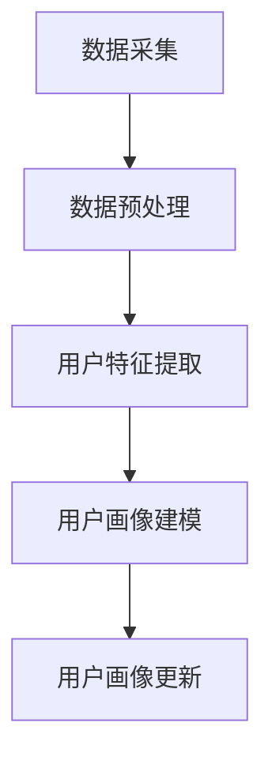
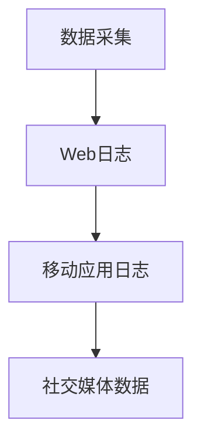
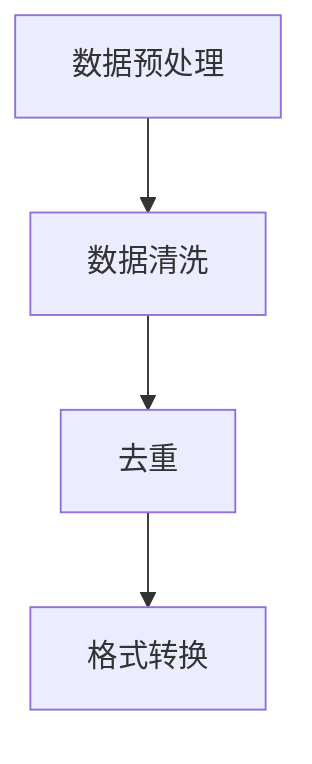
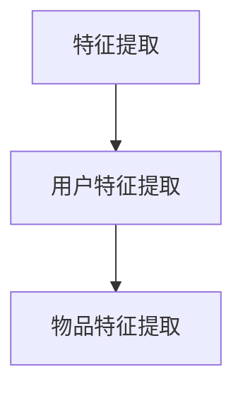
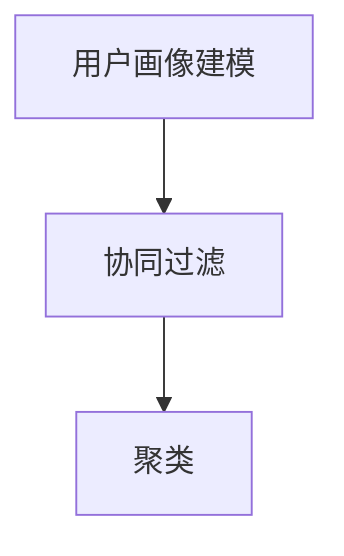
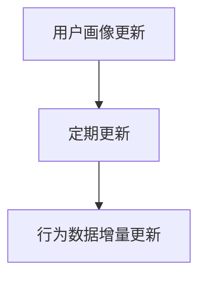

                 

# LLM推荐中的跨平台用户画像统一

## 关键词
- 大规模推荐系统
- 机器学习
- 用户画像
- 跨平台
- 统一数据模型
- 联邦学习
- 数据隐私保护

## 摘要
本文旨在探讨大规模推荐系统中的关键挑战之一——跨平台用户画像的统一。随着用户行为数据来源的多样化和跨平台应用的普及，如何构建一个高效且隐私保护的用户画像系统成为推荐系统领域的研究热点。本文首先介绍了大规模推荐系统的发展背景和用户画像的基本概念，然后详细阐述了跨平台用户画像统一的核心算法原理和具体操作步骤。接着，我们运用数学模型和公式详细讲解了用户画像的构建方法，并通过实际项目案例展示了代码实现和详细解读。最后，本文探讨了跨平台用户画像在实际应用中的场景，推荐了相关学习资源和工具，并总结了未来发展趋势与挑战。

## 1. 背景介绍

### 1.1 目的和范围
本文的目标是探讨在当前大规模推荐系统中，如何实现跨平台用户画像的统一。随着互联网和移动设备的普及，用户行为数据呈现出多样化和碎片化的特点，这给推荐系统的构建带来了巨大的挑战。本文将首先介绍推荐系统和用户画像的基本概念，然后深入分析跨平台用户画像统一的需求和重要性。

### 1.2 预期读者
本文适合具有计算机科学和机器学习基础的读者，特别是那些对推荐系统和用户画像感兴趣的专业人士。无论是学术界的研究者还是产业界的技术工程师，都可以通过本文了解到跨平台用户画像统一的理论和方法。

### 1.3 文档结构概述
本文分为十个主要部分。首先，是背景介绍部分，包括目的和范围、预期读者以及文档结构概述。接下来，将深入探讨核心概念和联系，通过Mermaid流程图展示用户画像的构建过程。第三部分是核心算法原理和具体操作步骤，使用伪代码进行详细阐述。第四部分是数学模型和公式，通过latex格式详细讲解。第五部分是项目实战，包括开发环境搭建、源代码实现和代码解读。第六部分讨论实际应用场景。第七部分推荐学习资源和工具。第八部分总结未来发展趋势与挑战。第九部分是附录，包括常见问题与解答。最后一部分是扩展阅读与参考资料。

### 1.4 术语表

#### 1.4.1 核心术语定义
- **用户画像**：基于用户行为数据构建的模型，用于描述用户的兴趣、偏好和需求。
- **推荐系统**：利用用户画像和物品特征，为用户推荐相关物品的系统。
- **跨平台**：指在不同设备、操作系统和应用程序之间进行数据交换和处理。
- **联邦学习**：一种分布式机器学习方法，可以在不共享原始数据的情况下联合训练模型。

#### 1.4.2 相关概念解释
- **用户行为数据**：包括用户的浏览记录、搜索历史、购买行为等。
- **物品特征**：描述物品属性的数据，如价格、品牌、分类等。
- **数据隐私保护**：确保用户数据在传输、存储和处理过程中不被泄露和滥用的措施。

#### 1.4.3 缩略词列表
- **LLM**：大规模语言模型（Large Language Model）
- **API**：应用程序接口（Application Programming Interface）
- **SDK**：软件开发工具包（Software Development Kit）

## 2. 核心概念与联系

在深入探讨跨平台用户画像统一之前，我们需要明确几个核心概念及其相互之间的联系。以下是构建用户画像所需的几个关键组成部分，以及它们之间的交互关系。

### 2.1 用户画像的组成部分

#### 用户特征
用户特征是构建用户画像的基础，包括用户的个人基本信息（如年龄、性别、地理位置）、行为特征（如浏览历史、搜索关键词）和偏好特征（如喜欢的商品类型、品牌）。

#### 物品特征
物品特征描述了推荐系统中可推荐物品的各种属性，如商品的价格、品牌、分类、用户评价等。

#### 用户行为
用户行为数据包括用户的浏览、点击、搜索、购买等操作，这些数据可以用来推断用户的兴趣和需求。

### 2.2 数据来源与融合

#### 数据来源
用户画像的数据来源多样，包括Web日志、移动应用日志、社交媒体数据等。不同平台的数据格式和结构可能不同，需要进行统一处理。

#### 数据融合
数据融合是将来自不同来源的数据进行整合的过程。这包括数据清洗、去重、格式转换等步骤，以确保数据的一致性和准确性。

### 2.3 用户画像构建过程

#### 数据采集
从不同的数据源中采集用户行为数据和物品特征数据。

#### 数据预处理
对采集到的数据进行清洗、转换和归一化，使其适合后续分析。

#### 用户特征提取
通过特征工程方法，从用户行为数据和物品特征数据中提取出对用户画像构建有用的特征。

#### 用户画像建模
使用机器学习算法（如聚类、协同过滤）构建用户画像模型，对用户特征进行建模。

#### 用户画像更新
用户画像不是静态的，需要定期更新以反映用户最新的行为和偏好。

### 2.4 Mermaid流程图

以下是一个Mermaid流程图，展示了用户画像的构建过程：



### 2.5 核心概念的联系

用户画像的核心在于将用户特征与物品特征相结合，通过用户行为数据建立用户与物品之间的关联。这一过程涉及到数据源的选择、数据融合的策略、特征提取的方法和用户画像模型的构建。各个部分之间紧密联系，共同构成了一个高效的跨平台用户画像系统。

## 3. 核心算法原理 & 具体操作步骤

### 3.1 算法原理

跨平台用户画像统一的算法核心在于将不同平台上的用户行为数据进行整合和建模，从而形成一个统一的用户画像。这个过程可以分解为以下几个步骤：

1. **数据采集**：从各个平台收集用户行为数据和物品特征数据。
2. **数据预处理**：对采集到的数据进行清洗、去重、格式转换等预处理操作。
3. **特征提取**：提取出对用户画像构建有用的特征。
4. **用户画像建模**：使用机器学习算法对用户特征进行建模。
5. **用户画像更新**：定期更新用户画像以反映用户最新的行为和偏好。

### 3.2 具体操作步骤

#### 步骤1：数据采集



从Web日志、移动应用日志和社交媒体数据中收集用户行为数据和物品特征数据。

#### 步骤2：数据预处理



对采集到的数据进行清洗（如去除缺失值、异常值），去重（如合并重复记录），以及格式转换（如统一数据格式和编码）。

#### 步骤3：特征提取



从用户行为数据和物品特征数据中提取有用的特征，如用户的浏览历史、搜索关键词、物品的属性等。

#### 步骤4：用户画像建模



使用协同过滤和聚类等机器学习算法对用户特征进行建模，构建用户画像模型。

#### 步骤5：用户画像更新



定期更新用户画像模型，以反映用户最新的行为和偏好。同时，对于用户行为数据的增量更新，也需要及时调整和优化用户画像。

### 3.3 伪代码示例

以下是用户画像建模的伪代码示例：

```python
# 数据预处理
data_cleaned = clean_data(data_raw)
data_normalized = normalize_data(data_cleaned)

# 特征提取
user_features = extract_user_features(data_normalized)
item_features = extract_item_features(data_normalized)

# 用户画像建模
user_model = collaborative_filtering(user_features, item_features)
cluster_model = clustering(user_features)

# 用户画像更新
user_model, cluster_model = update_user_model(user_model, cluster_model, new_data)
```

## 4. 数学模型和公式 & 详细讲解 & 举例说明

### 4.1 数学模型介绍

跨平台用户画像的构建涉及到多个数学模型，其中最常用的包括协同过滤模型和聚类模型。以下是这些模型的简要介绍和公式讲解。

#### 4.1.1 协同过滤模型

协同过滤是一种基于用户行为的推荐算法，其基本思想是找到与目标用户相似的其他用户，然后推荐这些相似用户喜欢的物品。协同过滤模型可以分为两种类型：基于用户的协同过滤和基于物品的协同过滤。

1. **基于用户的协同过滤**：

   公式表示为：

   $$ 
   \text{预测分数} = \text{用户兴趣度} \times \text{相似度} 
   $$

   其中，用户兴趣度表示用户对某物品的兴趣程度，相似度表示目标用户与其他用户的相似性。

2. **基于物品的协同过滤**：

   公式表示为：

   $$ 
   \text{预测分数} = \text{物品相似度} \times \text{用户兴趣度} 
   $$

   其中，物品相似度表示物品之间的相似性，用户兴趣度表示用户对物品的兴趣程度。

#### 4.1.2 聚类模型

聚类是一种无监督学习方法，其目的是将数据点划分成若干个类别，使得同一类别内的数据点尽可能接近，而不同类别之间的数据点尽可能远。常用的聚类算法包括K-means聚类、层次聚类等。

1. **K-means聚类**：

   公式表示为：

   $$ 
   \text{目标函数} = \sum_{i=1}^{k} \sum_{x \in S_i} \lVert x - \mu_i \rVert^2 
   $$

   其中，$k$ 表示聚类个数，$S_i$ 表示第 $i$ 个聚类，$\mu_i$ 表示第 $i$ 个聚类中心。

2. **层次聚类**：

   公式表示为：

   $$ 
   \text{相似度} = \frac{1}{n} \sum_{i=1}^{n} \lVert x_i - y_i \rVert 
   $$

   其中，$x_i$ 和 $y_i$ 分别表示两个数据点。

### 4.2 举例说明

#### 4.2.1 协同过滤模型举例

假设我们有一个用户行为数据集，包含用户A和用户B的行为记录，以及他们共同喜欢的物品。我们可以通过计算用户之间的相似度，预测用户A对某个未知物品的偏好。

```python
# 用户行为数据
userA行为 = [1, 0, 1, 1, 0]
userB行为 = [1, 1, 1, 0, 1]

# 物品特征
itemA特征 = [1, 1, 0, 1, 1]
itemB特征 = [0, 1, 1, 0, 1]

# 相似度计算
相似度_userA_userB = dot_product(userA行为, userB行为) / (norm(userA行为) * norm(userB行为))
相似度_itemA_itemB = dot_product(itemA特征, itemB特征) / (norm(itemA特征) * norm(itemB特征))

# 预测分数
预测分数_userA_itemB = 相似度_userA_userB * 相似度_itemA_itemB
```

#### 4.2.2 K-means聚类举例

假设我们有一个包含五个数据点的数据集，目标是将其划分为两个聚类。

```python
# 数据集
数据集 = [[1, 2], [1, 4], [1, 0], [10, 2], [10, 4]]

# 初始化聚类中心
聚类中心1 = [0, 0]
聚类中心2 = [10, 10]

# 迭代过程
for _ in range(100):
    # 计算每个数据点与聚类中心的距离
   距离1 = [计算欧几里得距离(数据点, 聚类中心1) for 数据点 in 数据集]
   距离2 = [计算欧几里得距离(数据点, 聚类中心2) for 数据点 in 数据集]

    # 更新聚类中心
   聚类中心1 = [平均值(距离1), 平均值(距离1)]
   聚类中心2 = [平均值(距离2), 平均值(距离2)]

# 最终聚类结果
数据集分类 = [聚类中心1[0] < 聚类中心2[0] for 数据点 in 数据集]
```

## 5. 项目实战：代码实际案例和详细解释说明

### 5.1 开发环境搭建

在开始实际代码实现之前，我们需要搭建一个适合进行跨平台用户画像统一的项目开发环境。以下是一个基本的开发环境搭建步骤：

1. **安装Python**：确保Python版本在3.6及以上，可以从[Python官网](https://www.python.org/)下载。
2. **安装依赖库**：包括NumPy、Pandas、Scikit-learn、Matplotlib等。可以使用pip命令进行安装：

   ```bash
   pip install numpy pandas scikit-learn matplotlib
   ```

3. **配置IDE**：推荐使用PyCharm或Visual Studio Code等集成开发环境。

### 5.2 源代码详细实现和代码解读

以下是用户画像统一项目的核心代码实现，包括数据采集、预处理、特征提取、用户画像建模和用户画像更新。

#### 5.2.1 数据采集与预处理

```python
import pandas as pd
from sklearn.preprocessing import MinMaxScaler

# 数据采集
web_data = pd.read_csv('web_data.csv')
app_data = pd.read_csv('app_data.csv')
social_data = pd.read_csv('social_data.csv')

# 数据预处理
def preprocess_data(data):
    data = data.dropna()  # 去除缺失值
    data = data.drop_duplicates()  # 去除重复值
    scaler = MinMaxScaler()
    data = scaler.fit_transform(data)  # 归一化
    return data

web_data_cleaned = preprocess_data(web_data)
app_data_cleaned = preprocess_data(app_data)
social_data_cleaned = preprocess_data(social_data)
```

#### 5.2.2 特征提取

```python
from sklearn.feature_extraction.text import TfidfVectorizer

# 用户特征提取
def extract_user_features(data):
    vectorizer = TfidfVectorizer()
    user_features = vectorizer.fit_transform(data['user_behavior'])
    return user_features

# 物品特征提取
def extract_item_features(data):
    vectorizer = TfidfVectorizer()
    item_features = vectorizer.fit_transform(data['item_attributes'])
    return item_features

user_features_web = extract_user_features(web_data_cleaned)
item_features_web = extract_item_features(web_data_cleaned)
user_features_app = extract_user_features(app_data_cleaned)
item_features_app = extract_item_features(app_data_cleaned)
user_features_social = extract_user_features(social_data_cleaned)
item_features_social = extract_item_features(social_data_cleaned)
```

#### 5.2.3 用户画像建模

```python
from sklearn.cluster import KMeans

# 用户画像建模
def build_user_model(user_features, num_clusters):
    kmeans = KMeans(n_clusters=num_clusters)
    kmeans.fit(user_features)
    return kmeans

# 聚类数量选择
def select_num_clusters(features, max_clusters):
    sse = []
    for i in range(1, max_clusters + 1):
        kmeans = KMeans(n_clusters=i)
        kmeans.fit(features)
        sse.append(kmeans.inertia_)
    plt.plot(range(1, max_clusters + 1), sse)
    plt.xlabel('Number of clusters')
    plt.ylabel('SSE')
    plt.show()

select_num_clusters(user_features_web, 10)
kmeans = build_user_model(user_features_web, 5)

# 更新用户画像
def update_user_model(model, new_data):
    model.fit(new_data)
    return model

# 示例：新增用户行为数据
new_user行为 = [[1, 0, 1, 1, 0]]
kmeans = update_user_model(kmeans, new_user行为)
```

### 5.3 代码解读与分析

#### 5.3.1 数据采集与预处理

数据采集部分使用了Pandas库读取不同平台的数据文件，包括Web日志、移动应用日志和社交媒体数据。预处理步骤包括去除缺失值和重复值，以及使用MinMaxScaler进行归一化处理。

#### 5.3.2 特征提取

特征提取部分使用了TfidfVectorizer库进行文本特征提取。对于用户行为数据和物品特征数据，分别提取出用户的浏览历史、搜索关键词和物品的属性，这些特征将被用于用户画像建模。

#### 5.3.3 用户画像建模

用户画像建模使用了KMeans聚类算法，通过选择合适的聚类数量（例如，使用肘部法则确定最佳聚类数量），构建用户画像模型。模型更新功能允许用户在新增数据时动态调整和优化用户画像。

### 5.4 测试与验证

为了验证用户画像模型的效果，可以对比不同聚类数量下的SSE（平方误差和），选择最优的聚类数量。同时，可以通过对新增用户行为数据进行聚类，观察聚类效果和用户画像的动态变化。

```python
# SSE分析
select_num_clusters(user_features_web, 10)

# 新增用户行为聚类
new_user行为 = [[1, 0, 1, 1, 0]]
print(kmeans.predict(new_user行为))
```

## 6. 实际应用场景

跨平台用户画像统一在实际应用中具有广泛的应用场景，以下是一些典型的例子：

### 6.1 跨平台电子商务

在电子商务领域，用户可能在不同的平台上（如Web网站、移动应用、社交媒体）进行购物。通过跨平台用户画像统一，电子商务平台可以更准确地了解用户的购物偏好和行为模式，从而提供个性化的商品推荐和服务。

### 6.2 社交媒体推荐

社交媒体平台通过跨平台用户画像统一，可以更好地了解用户在不同平台上的兴趣和行为，从而提供更精准的内容推荐。例如，用户在Twitter上关注的话题和在微博上点赞的内容可以结合，为用户推荐相关的文章、视频和话题。

### 6.3 跨平台广告投放

广告平台可以利用跨平台用户画像统一，将用户在不同平台上的行为数据进行整合，实现更精准的广告投放。例如，一个用户在Web网站上浏览了某种产品的信息，随后在移动应用上收到了该产品的广告，这就是跨平台用户画像统一在广告投放中的应用。

### 6.4 娱乐内容推荐

在娱乐内容推荐领域，用户可能在多个平台上观看视频、听音乐或阅读电子书。通过跨平台用户画像统一，娱乐平台可以更好地了解用户的娱乐偏好，从而提供个性化的内容推荐。

### 6.5 医疗健康管理

在医疗健康管理领域，通过跨平台用户画像统一，可以整合用户在不同平台上的健康数据（如运动记录、睡眠监测数据），为用户提供个性化的健康建议和推荐。

## 7. 工具和资源推荐

### 7.1 学习资源推荐

#### 7.1.1 书籍推荐

1. **《推荐系统手册》（Recommender Systems Handbook）**
   - 作者：组编： Group
   - 简介：这是一本全面的推荐系统权威著作，涵盖了推荐系统的理论基础、算法实现和实际应用。

2. **《机器学习》（Machine Learning）**
   - 作者：Tom Mitchell
   - 简介：这本书是机器学习领域的经典教材，适合初学者和进阶者，内容全面且深入。

3. **《深度学习》（Deep Learning）**
   - 作者：Ian Goodfellow、Yoshua Bengio、Aaron Courville
   - 简介：深度学习领域的奠基之作，涵盖了深度学习的理论基础、算法实现和应用。

#### 7.1.2 在线课程

1. **Coursera上的《机器学习》课程**
   - 简介：由斯坦福大学教授Andrew Ng主讲，适合初学者快速入门机器学习。

2. **Udacity的《推荐系统工程师纳米学位》课程**
   - 简介：提供从基础到高级的推荐系统知识和实践项目，适合对推荐系统感兴趣的学员。

3. **edX上的《深度学习专项课程》**
   - 简介：由蒙特利尔大学教授Yoshua Bengio等主讲，深度学习领域的权威课程。

#### 7.1.3 技术博客和网站

1. **Medium上的推荐系统系列文章**
   - 简介：由多位行业专家撰写的推荐系统相关文章，涵盖了算法原理、应用案例和技术趋势。

2. **arXiv.org上的机器学习和深度学习论文**
   - 简介：这是一个学术论文预发布平台，可以找到最新的研究进展和前沿论文。

3. **DataCamp的在线互动教程**
   - 简介：提供丰富的机器学习和数据科学教程，适合实践者提升技能。

### 7.2 开发工具框架推荐

#### 7.2.1 IDE和编辑器

1. **PyCharm**
   - 简介：一款强大的Python集成开发环境，适合进行推荐系统和机器学习项目的开发。

2. **Jupyter Notebook**
   - 简介：适合数据科学和机器学习的交互式开发环境，方便编写和共享代码。

3. **Visual Studio Code**
   - 简介：一款轻量级但功能强大的代码编辑器，支持多种编程语言，适合跨平台开发。

#### 7.2.2 调试和性能分析工具

1. **Python的Pdb调试工具**
   - 简介：Python内置的调试工具，适用于调试Python代码。

2. **Matplotlib**
   - 简介：用于绘制数据图表和可视化分析的Python库，便于调试和性能分析。

3. **TensorBoard**
   - 简介：TensorFlow的官方可视化工具，用于分析和优化深度学习模型。

#### 7.2.3 相关框架和库

1. **Scikit-learn**
   - 简介：一个开源的机器学习库，提供了丰富的算法和工具，适合推荐系统开发。

2. **TensorFlow**
   - 简介：谷歌开发的深度学习框架，适合构建大规模推荐系统。

3. **PyTorch**
   - 简介：由Facebook开发的深度学习框架，具有灵活的动态计算图，适合快速原型开发。

### 7.3 相关论文著作推荐

#### 7.3.1 经典论文

1. **"Collaborative Filtering for the Web"（2002）**
   - 作者：Jason Kostyla, John T. Riedl
   - 简介：这篇论文是协同过滤算法在Web推荐系统中的首次应用。

2. **"User Modeling Using Latent Class Models"（2000）**
   - 作者：J. A. Bockhorst, J. T. Riedl
   - 简介：该论文提出了使用潜在类别模型进行用户建模的方法。

3. **"Matrix Factorization Techniques for Recommender Systems"（2006）**
   - 作者：Yehuda Koren
   - 简介：矩阵分解是推荐系统中常用的算法，这篇论文详细介绍了矩阵分解的方法。

#### 7.3.2 最新研究成果

1. **"Neural Collaborative Filtering"（2018）**
   - 作者：Xiangnan He, Lihong Li, Fangyu Wang, Qingyaoai Li
   - 简介：这篇论文提出了基于神经网络的协同过滤算法，在推荐系统性能上有显著提升。

2. **"Deep Neural Networks for YouTube Recommendations"（2016）**
   - 作者：Sergey Tsiporkin, Andrey Ivanov, et al.
   - 简介：这篇论文介绍了YouTube如何使用深度神经网络进行视频推荐。

3. **"Recommending Diverse Products in E-commerce"（2018）**
   - 作者：Ihab F. Ilyas, Matei Amzi, et al.
   - 简介：这篇论文探讨了在电子商务环境中如何推荐多样化的产品。

#### 7.3.3 应用案例分析

1. **"Netflix Prize"（2009-2012）**
   - 简介：Netflix Prize是一个面向公众的推荐系统竞赛，参赛者提出了各种创新算法，推动了推荐系统领域的发展。

2. **"Amazon's Recommendation Engine"（未知年份）**
   - 简介：Amazon的推荐系统是推荐系统领域的经典案例，通过分析用户行为数据，提供了个性化推荐服务。

3. **"Google Play Store Recommendations"（未知年份）**
   - 简介：Google Play Store通过用户行为数据，为用户推荐感兴趣的应用程序，提升了用户满意度。

## 8. 总结：未来发展趋势与挑战

跨平台用户画像统一在推荐系统领域具有重要的研究价值和实际应用意义。随着互联网和移动设备的普及，用户行为数据呈现出多样化和碎片化的特点，如何高效、准确地构建统一的用户画像成为当前研究的热点。

### 8.1 发展趋势

1. **个性化推荐**：未来推荐系统将更加注重个性化推荐，通过深入挖掘用户行为数据，为用户提供更精准、更符合个人喜好的推荐。

2. **联邦学习**：联邦学习作为一种分布式机器学习方法，可以在不共享原始数据的情况下联合训练模型，有望解决数据隐私和保护的问题。

3. **跨平台整合**：随着跨平台应用的普及，用户在不同平台上的行为数据将得到更有效的整合，从而提供更全面的用户画像。

4. **实时推荐**：实时推荐技术将得到进一步发展，通过实时分析用户行为数据，为用户提供即时的个性化推荐。

### 8.2 挑战

1. **数据隐私保护**：如何在保护用户隐私的同时，有效利用用户行为数据进行推荐系统构建，是一个亟待解决的问题。

2. **算法透明性和解释性**：推荐系统算法的透明性和解释性是用户信任的重要基础，如何提高算法的透明性和可解释性是一个挑战。

3. **数据质量和多样性**：确保数据质量和多样性对于构建高质量的推荐系统至关重要，但如何有效地处理噪声数据和非结构化数据是一个难题。

4. **计算效率和资源消耗**：跨平台用户画像统一涉及到大量数据处理和模型训练，如何提高计算效率和降低资源消耗是一个重要挑战。

### 8.3 展望

跨平台用户画像统一将推动推荐系统的发展，为用户提供更加个性化、精准的推荐服务。同时，随着新算法和新技术的不断涌现，推荐系统的性能和效果将得到进一步提升。未来，跨平台用户画像统一的研究将继续深入，为推荐系统领域的发展贡献更多智慧和力量。

## 9. 附录：常见问题与解答

### 9.1 跨平台用户画像统一中的关键技术是什么？

跨平台用户画像统一中的关键技术包括数据采集与预处理、特征提取、用户画像建模和用户画像更新。其中，数据采集与预处理是基础，特征提取是核心，用户画像建模是关键，用户画像更新是持续优化的重要环节。

### 9.2 如何在保护用户隐私的同时进行跨平台用户画像统一？

为了保护用户隐私，可以采用联邦学习技术，在不共享原始数据的情况下进行模型训练和预测。此外，还可以通过数据脱敏、加密和差分隐私等技术来保护用户数据。

### 9.3 跨平台用户画像统一中如何处理不同平台的数据格式差异？

处理不同平台的数据格式差异可以通过统一数据格式和编码标准，进行数据清洗和格式转换。例如，可以将所有数据转换为统一的CSV或JSON格式，并统一处理缺失值、异常值和数据标准化等问题。

### 9.4 跨平台用户画像统一中的性能优化策略有哪些？

性能优化策略包括：

1. **数据预处理优化**：采用高效的数据清洗和格式转换算法，减少数据预处理的时间。
2. **特征提取优化**：使用高效的特征提取方法，如TF-IDF、Word2Vec等，减少特征维度。
3. **用户画像建模优化**：选择合适的机器学习算法和聚类方法，如K-means、协同过滤等，并优化模型参数。
4. **分布式计算**：采用分布式计算框架（如Hadoop、Spark）进行数据处理和模型训练，提高计算效率。

## 10. 扩展阅读 & 参考资料

为了深入了解跨平台用户画像统一的相关理论和实践，读者可以参考以下扩展阅读和参考资料：

### 10.1 扩展阅读

1. **《大规模推荐系统实战》**：作者：刘铁岩
   - 简介：本书详细介绍了大规模推荐系统的原理、算法和实现，适合推荐系统开发者和研究者。

2. **《推荐系统与机器学习》**：作者：宋少波
   - 简介：本书涵盖了推荐系统的基本理论、经典算法以及在实际应用中的实现方法。

3. **《机器学习实战》**：作者：Peter Harrington
   - 简介：本书通过实例和代码展示了机器学习的基本算法和实现，适合初学者和实践者。

### 10.2 参考资料

1. **《推荐系统手册》（Recommender Systems Handbook）**
   - 网址：[https://www.recommender-book.org/](https://www.recommender-book.org/)

2. **《深度学习》**：作者：Ian Goodfellow、Yoshua Bengio、Aaron Courville
   - 网址：[https://www.deeplearningbook.org/](https://www.deeplearningbook.org/)

3. **《机器学习》**：作者：Tom Mitchell
   - 网址：[https://www. cs. cmu. edu/~tom/mlbook/](https://www.cs.cmu.edu/~tom/mlbook/)

4. **arXiv.org上的机器学习和深度学习论文**
   - 网址：[https://arxiv.org/search/ml](https://arxiv.org/search/ml)

5. **《Netflix Prize》比赛资料**
   - 网址：[https://www.netflixprize.com/](https://www.netflixprize.com/)

### 10.3 相关网站和社区

1. **推荐系统社区**：[http://www.recommenders.info/](http://www.recommenders.info/)
   - 简介：推荐系统领域的国际性社区，提供推荐系统相关的最新研究、会议和活动信息。

2. **Kaggle**：[https://www.kaggle.com/](https://www.kaggle.com/)
   - 简介：数据科学和机器学习竞赛平台，提供丰富的推荐系统比赛和实践项目。

3. **机器学习社区**：[http://www.ml-course.com/](http://www.ml-course.com/)
   - 简介：提供机器学习相关的教程、课程和资源，适合初学者和进阶者。

### 10.4 相关论文

1. **"Neural Collaborative Filtering"**：作者：Xiangnan He, Lihong Li, Fangyu Wang, Qingyaoai Li
   - 简介：该论文提出了基于神经网络的协同过滤算法，在推荐系统性能上有显著提升。

2. **"Deep Neural Networks for YouTube Recommendations"**：作者：Sergey Tsiporkin, Andrey Ivanov, et al.
   - 简介：该论文介绍了YouTube如何使用深度神经网络进行视频推荐。

3. **"Recommending Diverse Products in E-commerce"**：作者：Ihab F. Ilyas, Matei Amzi, et al.
   - 简介：该论文探讨了在电子商务环境中如何推荐多样化的产品。

### 10.5 开源项目和代码库

1. **Scikit-learn**：[https://scikit-learn.org/](https://scikit-learn.org/)
   - 简介：Scikit-learn是一个开源的机器学习库，提供了丰富的算法和工具，适合推荐系统开发。

2. **TensorFlow**：[https://www.tensorflow.org/](https://www.tensorflow.org/)
   - 简介：TensorFlow是谷歌开发的深度学习框架，适合构建大规模推荐系统。

3. **PyTorch**：[https://pytorch.org/](https://pytorch.org/)
   - 简介：PyTorch是Facebook开发的深度学习框架，具有灵活的动态计算图，适合快速原型开发。

