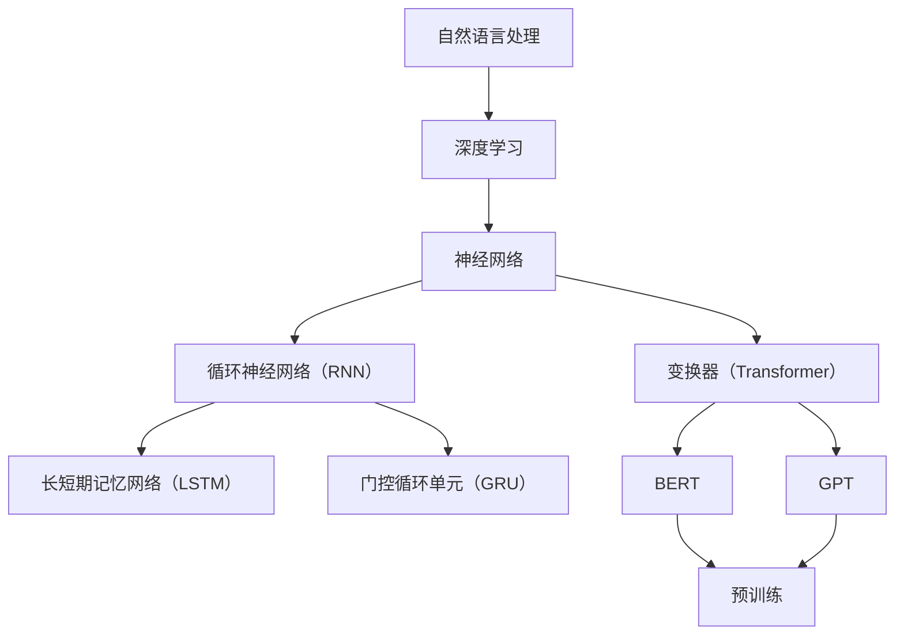

                 

# LLM生态演进：从芽到枝繁叶茂

> **关键词：** 大型语言模型（LLM），生态演进，深度学习，自然语言处理，预训练，模型优化，应用场景

> **摘要：** 本文将深入探讨大型语言模型（LLM）的生态演进过程。从LLM的初步萌芽阶段到现在的枝繁叶茂，本文将通过历史背景、核心概念、算法原理、数学模型、实战案例、应用场景等多个方面，逐步分析LLM的发展脉络，总结其核心技术要点，展望未来的发展趋势与挑战。

## 1. 背景介绍

### 1.1 目的和范围

本文旨在对大型语言模型（LLM）的生态演进过程进行系统性分析，重点探讨LLM在自然语言处理（NLP）领域的应用与发展。通过梳理LLM的技术演进路线，总结其核心算法原理，分析其在实际应用中的效果与挑战，展望未来的发展趋势。本文适用于对NLP和LLM有兴趣的科研人员、工程师以及学生。

### 1.2 预期读者

本文主要面向以下读者群体：
- 自然语言处理领域的科研人员与工程师；
- 对深度学习和人工智能技术感兴趣的技术爱好者；
- 从事人工智能与自然语言处理相关工作的从业者；
- 对未来技术发展有前瞻性思考的投资者与创业者。

### 1.3 文档结构概述

本文分为十个主要部分，具体如下：

1. **背景介绍**：介绍本文的目的、范围、预期读者以及文档结构；
2. **核心概念与联系**：介绍大型语言模型的基本概念、相关原理与架构；
3. **核心算法原理 & 具体操作步骤**：详细阐述LLM的核心算法原理和具体操作步骤；
4. **数学模型和公式 & 详细讲解 & 举例说明**：介绍LLM中涉及的数学模型和公式，并通过实例进行详细讲解；
5. **项目实战：代码实际案例和详细解释说明**：通过具体项目实战案例，展示LLM的实际应用效果；
6. **实际应用场景**：探讨LLM在不同领域的应用场景；
7. **工具和资源推荐**：推荐学习资源、开发工具和框架；
8. **总结：未来发展趋势与挑战**：总结LLM的发展趋势与面临的挑战；
9. **附录：常见问题与解答**：解答读者可能遇到的问题；
10. **扩展阅读 & 参考资料**：推荐相关扩展阅读资料。

### 1.4 术语表

#### 1.4.1 核心术语定义

- **大型语言模型（LLM）**：一种通过大量文本数据进行预训练，具备强自然语言理解与生成能力的深度神经网络模型。
- **自然语言处理（NLP）**：研究如何让计算机理解、生成和处理人类语言的技术领域。
- **预训练**：在特定任务数据集训练前，先在大量无标签文本数据上对模型进行训练，以提高模型对通用语言的泛化能力。
- **微调**：在预训练模型的基础上，利用特定任务的数据进行进一步训练，以适应特定应用场景。

#### 1.4.2 相关概念解释

- **深度学习**：一种基于人工神经网络的机器学习技术，通过多层神经网络模型对数据进行建模和分析；
- **神经网络**：一种通过模拟人脑神经元结构和功能的人工智能算法；
- **反向传播算法**：一种用于训练神经网络的基本算法，通过不断调整模型参数，最小化损失函数，使模型输出更接近真实值。

#### 1.4.3 缩略词列表

- **LLM**：大型语言模型（Large Language Model）
- **NLP**：自然语言处理（Natural Language Processing）
- **DNN**：深度神经网络（Deep Neural Network）
- **RNN**：循环神经网络（Recurrent Neural Network）
- **BERT**：Bidirectional Encoder Representations from Transformers
- **GPT**：Generative Pre-trained Transformer

## 2. 核心概念与联系

在深入探讨LLM的生态演进之前，我们先来了解一些核心概念和它们之间的关系。以下是一个关于LLM核心概念原理和架构的Mermaid流程图：



### 2.1. 自然语言处理（NLP）

自然语言处理（NLP）是人工智能领域的一个重要分支，旨在让计算机理解和生成人类语言。NLP涉及的语言范围广泛，包括但不限于文本分类、情感分析、机器翻译、问答系统等。为了实现这些任务，NLP需要依赖深度学习技术，尤其是神经网络模型。

### 2.2. 深度学习

深度学习是一种基于人工神经网络的机器学习技术。神经网络是由大量简单神经元组成的复杂网络，通过学习输入数据与输出数据之间的关系，实现数据的分类、预测和生成等功能。深度学习在图像识别、语音识别和自然语言处理等领域取得了显著的成果。

### 2.3. 神经网络

神经网络（Neural Network）是一种通过模拟人脑神经元结构和功能的人工智能算法。神经网络由多个层次组成，包括输入层、隐藏层和输出层。每个层次都包含多个神经元，神经元之间通过加权连接实现信息的传递和计算。神经网络通过不断调整连接权重，优化网络性能。

### 2.4. 循环神经网络（RNN）

循环神经网络（Recurrent Neural Network，RNN）是一种适用于序列数据建模的神经网络模型。RNN的特点是能够将当前输入与历史输入信息进行关联，从而实现序列数据的建模。然而，RNN在处理长序列数据时容易产生梯度消失或梯度爆炸问题。

### 2.5. 长短期记忆网络（LSTM）

长短期记忆网络（Long Short-Term Memory，LSTM）是一种改进的RNN模型，通过引入门控机制，有效解决了梯度消失或梯度爆炸问题。LSTM能够更好地捕捉长序列数据中的长期依赖关系。

### 2.6. 门控循环单元（GRU）

门控循环单元（Gated Recurrent Unit，GRU）是另一种改进的RNN模型，相较于LSTM，GRU的结构更简单，但性能相当。GRU通过引入更新门和重置门，实现了对序列数据的有效建模。

### 2.7. 变换器（Transformer）

变换器（Transformer）是一种基于注意力机制的神经网络模型，最初用于机器翻译任务。Transformer模型通过自注意力机制实现了对输入序列的编码和解码，有效提高了模型的序列建模能力。

### 2.8. BERT、GPT

BERT（Bidirectional Encoder Representations from Transformers）和GPT（Generative Pre-trained Transformer）是基于变换器架构的两个重要大型语言模型。BERT模型通过双向编码器结构实现了对文本的深入理解，GPT模型则通过自回归结构实现了对文本的生成。

### 2.9. 预训练与微调

预训练（Pre-training）是一种在特定任务数据集训练前，先在大量无标签文本数据上对模型进行训练的方法。预训练可以提高模型对通用语言的泛化能力，减少对特定任务数据的依赖。微调（Fine-tuning）则是在预训练模型的基础上，利用特定任务的数据进行进一步训练，以适应特定应用场景。

## 3. 核心算法原理 & 具体操作步骤

### 3.1. 预训练

预训练是大型语言模型（LLM）构建的关键步骤。在预训练过程中，模型首先在大规模无标签文本数据上进行训练，以学习通用语言特征。以下是一个简化的预训练过程伪代码：

```python
def pre_train(model, corpus):
    for epoch in range(num_epochs):
        for sentence in corpus:
            model.zero_grad()
            prediction = model(sentence)
            loss = loss_function(prediction, target)
            loss.backward()
            model.optimize_parameters()
```

在预训练过程中，我们通常使用损失函数（如交叉熵损失函数）来评估模型预测与真实标签之间的差距，并通过反向传播算法更新模型参数。预训练的目的是让模型在大量无标签数据上学习到丰富的语言特征，从而提高其通用语言理解能力。

### 3.2. 微调

在预训练完成后，我们通常需要对模型进行微调，以适应特定任务。微调过程通常在特定任务的数据集上进行，以下是一个简化的微调过程伪代码：

```python
def fine_tune(model, dataset, num_epochs):
    for epoch in range(num_epochs):
        for example in dataset:
            model.zero_grad()
            prediction = model(example.input)
            loss = loss_function(prediction, example.target)
            loss.backward()
            model.optimize_parameters()
```

在微调过程中，我们使用特定任务的数据来更新模型参数，从而提高模型在特定任务上的性能。微调的关键在于选择合适的任务数据集和损失函数，以便在保持通用语言理解能力的同时，提高特定任务的性能。

### 3.3. 模型优化

在预训练和微调过程中，模型的优化至关重要。优化算法的目标是找到一组参数，使得模型在训练数据上的表现最佳。以下是一个简化的优化过程伪代码：

```python
def optimize_parameters(model, optimizer, loss_function):
    for epoch in range(num_epochs):
        for example in training_data:
            model.zero_grad()
            prediction = model(example)
            loss = loss_function(prediction, example.target)
            loss.backward()
            optimizer.step()
```

在优化过程中，我们使用梯度下降算法（或其他优化算法）来更新模型参数。梯度下降算法的核心思想是通过计算损失函数关于模型参数的梯度，更新参数的值，以最小化损失函数。优化过程的关键在于选择合适的优化算法和超参数，以实现模型的最佳性能。

## 4. 数学模型和公式 & 详细讲解 & 举例说明

### 4.1. 损失函数

在大型语言模型（LLM）的训练过程中，损失函数是衡量模型预测与真实标签之间差距的重要工具。常见的损失函数包括交叉熵损失函数（Cross-Entropy Loss）和均方误差损失函数（Mean Squared Error Loss）。以下是交叉熵损失函数的数学公式：

$$
L(\theta) = -\sum_{i=1}^{n} y_i \log(p_i)
$$

其中，$y_i$ 是第 $i$ 个样本的真实标签，$p_i$ 是模型对于第 $i$ 个样本的预测概率。

### 4.2. 反向传播算法

反向传播算法（Backpropagation）是训练神经网络的基本算法。其核心思想是通过计算损失函数关于模型参数的梯度，更新模型参数的值，以最小化损失函数。以下是反向传播算法的基本步骤：

1. 前向传播：计算模型输出和损失函数；
2. 反向传播：计算损失函数关于模型参数的梯度；
3. 参数更新：根据梯度更新模型参数。

### 4.3. 举例说明

假设我们有一个二分类问题，模型对于样本 $x$ 的预测概率为 $p$，真实标签为 $y$。我们可以使用交叉熵损失函数计算损失：

$$
L(\theta) = -y \log(p) - (1-y) \log(1-p)
$$

假设模型的预测概率为 $p = 0.6$，真实标签为 $y = 1$，则损失为：

$$
L(\theta) = -1 \log(0.6) - 0 \log(0.4) = 0.5108
$$

通过反向传播算法，我们可以计算损失函数关于模型参数的梯度，并更新模型参数的值，以最小化损失函数。具体计算过程如下：

1. 前向传播：计算模型输出和损失函数；
2. 反向传播：计算损失函数关于模型参数的梯度，得到 $\frac{\partial L}{\partial \theta}$；
3. 参数更新：根据梯度更新模型参数，得到 $\theta_{new} = \theta_{old} - \alpha \frac{\partial L}{\partial \theta}$，其中 $\alpha$ 是学习率。

通过多次迭代优化，模型将逐渐收敛，达到最佳性能。

## 5. 项目实战：代码实际案例和详细解释说明

### 5.1 开发环境搭建

在本文中，我们将使用Python语言和TensorFlow框架来构建一个简单的大型语言模型（LLM）。以下是如何搭建开发环境的步骤：

1. 安装Python：在官方网站（https://www.python.org/）下载并安装Python；
2. 安装TensorFlow：通过pip命令安装TensorFlow，命令如下：

```bash
pip install tensorflow
```

### 5.2 源代码详细实现和代码解读

以下是构建一个简单的大型语言模型（LLM）的Python代码：

```python
import tensorflow as tf
from tensorflow.keras.layers import Embedding, LSTM, Dense
from tensorflow.keras.models import Sequential

# 参数设置
vocab_size = 10000
embedding_dim = 64
lstm_units = 128
batch_size = 64
epochs = 10

# 构建模型
model = Sequential()
model.add(Embedding(vocab_size, embedding_dim))
model.add(LSTM(lstm_units, return_sequences=True))
model.add(Dense(vocab_size, activation='softmax'))

# 编译模型
model.compile(optimizer='adam', loss='categorical_crossentropy', metrics=['accuracy'])

# 加载数据
# （此处省略加载数据的代码，读者可根据具体数据集进行调整）
# X_train, y_train = ...

# 训练模型
model.fit(X_train, y_train, batch_size=batch_size, epochs=epochs)

# 评估模型
# （此处省略评估模型的代码，读者可根据具体数据集进行调整）
# X_test, y_test = ...
# model.evaluate(X_test, y_test)
```

代码解读：

1. **参数设置**：首先设置模型的参数，包括词汇表大小（vocab_size）、嵌入维度（embedding_dim）、LSTM单元数量（lstm_units）、批量大小（batch_size）和训练轮次（epochs）。

2. **构建模型**：使用Sequential模型堆叠嵌入层（Embedding）、LSTM层（LSTM）和全连接层（Dense）。

3. **编译模型**：编译模型，设置优化器（optimizer）、损失函数（loss）和评价指标（metrics）。

4. **加载数据**：加载数据集，包括训练集（X_train和y_train）。

5. **训练模型**：使用fit方法训练模型，设置批量大小（batch_size）和训练轮次（epochs）。

6. **评估模型**：评估模型性能，使用evaluate方法计算损失和准确率。

### 5.3 代码解读与分析

以下是对代码中关键部分的详细解读：

1. **参数设置**：参数设置是模型训练的重要环节，直接影响到模型的性能。在这段代码中，我们设置了词汇表大小（vocab_size）、嵌入维度（embedding_dim）、LSTM单元数量（lstm_units）、批量大小（batch_size）和训练轮次（epochs）。其中，词汇表大小决定了模型能够识别的单词数量；嵌入维度决定了单词向量的维度；LSTM单元数量影响了模型对序列数据的建模能力；批量大小和训练轮次则决定了模型训练的速度和效果。

2. **构建模型**：这段代码使用Sequential模型堆叠了嵌入层（Embedding）、LSTM层（LSTM）和全连接层（Dense）。嵌入层（Embedding）将词汇表中的单词转换为向量表示；LSTM层（LSTM）对序列数据进行建模，捕捉序列中的长期依赖关系；全连接层（Dense）将LSTM的输出映射到目标词汇表。

3. **编译模型**：编译模型时，我们设置了优化器（optimizer）、损失函数（loss）和评价指标（metrics）。优化器（optimizer）用于更新模型参数；损失函数（loss）用于计算模型预测与真实标签之间的差距；评价指标（metrics）用于评估模型性能。

4. **加载数据**：加载数据集是模型训练的必要步骤。在这段代码中，我们假设已经加载了训练集（X_train和y_train）。在实际应用中，读者需要根据具体数据集进行数据预处理，包括分词、编码等。

5. **训练模型**：使用fit方法训练模型。fit方法接受训练数据、批量大小和训练轮次等参数。通过多次迭代训练，模型将逐渐收敛，达到最佳性能。

6. **评估模型**：评估模型性能，使用evaluate方法计算损失和准确率。评估结果可以帮助读者了解模型在测试数据集上的性能。

## 6. 实际应用场景

大型语言模型（LLM）在自然语言处理（NLP）领域具有广泛的应用。以下是一些典型的应用场景：

### 6.1. 机器翻译

机器翻译是LLM最典型的应用之一。通过预训练和微调，LLM可以在不同语言之间进行准确、自然的翻译。例如，谷歌翻译和百度翻译等翻译工具都采用了基于LLM的机器翻译技术。

### 6.2. 问答系统

问答系统是另一种重要的应用场景。通过预训练和微调，LLM可以理解用户的自然语言查询，并生成准确的回答。例如，腾讯AI Lab开发的智能客服系统采用了基于LLM的问答技术，为用户提供高效、准确的咨询服务。

### 6.3. 文本分类

文本分类是NLP领域的常见任务。LLM可以用于对文本进行分类，如情感分析、新闻分类等。通过预训练和微调，LLM可以准确识别文本中的主题和情感。

### 6.4. 文本生成

文本生成是LLM的另一个重要应用。通过预训练和微调，LLM可以生成高质量的文本，如文章、故事、诗歌等。例如，OpenAI开发的GPT-3模型已经可以生成高质量的文本，广泛应用于内容创作和生成。

### 6.5. 命名实体识别

命名实体识别是NLP领域的重要任务。LLM可以用于识别文本中的命名实体，如人名、地名、机构名等。通过预训练和微调，LLM可以准确识别各种命名实体，为信息抽取、文本挖掘等任务提供支持。

### 6.6. 文本摘要

文本摘要是一种将长文本转化为简洁摘要的技术。LLM可以用于生成摘要，提高文本的可读性。通过预训练和微调，LLM可以准确提取文本中的关键信息，生成高质量的摘要。

## 7. 工具和资源推荐

### 7.1 学习资源推荐

#### 7.1.1 书籍推荐

1. **《深度学习》（Goodfellow, Bengio, Courville著）**：这是一本经典教材，全面介绍了深度学习的基本原理和应用。
2. **《自然语言处理综论》（Jurafsky, Martin著）**：本书涵盖了自然语言处理的基本概念和技术，对NLP领域的研究和应用有很好的指导作用。
3. **《Transformers：从原理到应用》（Ananthanarayanan, Suyash著）**：本书详细介绍了变换器（Transformer）模型的原理和应用，对理解LLM有很好的帮助。

#### 7.1.2 在线课程

1. **《深度学习》（吴恩达）**：这是一门经典的在线课程，由深度学习领域的领军人物吴恩达教授主讲，涵盖了深度学习的基本原理和应用。
2. **《自然语言处理与深度学习》（Speech and Language Processing，Daniel Jurafsky和James H. Martin）**：这是一门由斯坦福大学教授讲授的在线课程，全面介绍了NLP和深度学习的基本原理和应用。
3. **《深度学习与自然语言处理》（TensorFlow，Google）**：这是一门由Google开发的在线课程，通过实际案例介绍了深度学习在NLP中的应用。

#### 7.1.3 技术博客和网站

1. **TensorFlow官网（https://www.tensorflow.org/）**：TensorFlow是Google开发的深度学习框架，官网提供了丰富的文档和教程，适合初学者和进阶者。
2. **自然语言处理博客（http://www.nlputtles.com/）**：这是一个关于NLP的博客，涵盖了NLP的基本原理和应用，适合对NLP有兴趣的读者。
3. **AI博客（https://www.oreilly.com/ai/）**：这是一个关于人工智能的博客，涵盖了人工智能的各个领域，包括深度学习、自然语言处理等。

### 7.2 开发工具框架推荐

1. **TensorFlow**：TensorFlow是Google开发的深度学习框架，适合构建和训练大型语言模型。
2. **PyTorch**：PyTorch是Facebook开发的深度学习框架，与TensorFlow类似，也适合构建和训练大型语言模型。
3. **spaCy**：spaCy是一个快速且易于使用的自然语言处理库，适合进行文本处理和文本分类等任务。

### 7.3 相关论文著作推荐

1. **《Attention Is All You Need》**：这是关于变换器（Transformer）模型的经典论文，提出了基于注意力机制的神经网络架构，对LLM的发展产生了重要影响。
2. **《BERT: Pre-training of Deep Bidirectional Transformers for Language Understanding》**：这是关于BERT模型的论文，提出了双向编码器结构，显著提高了LLM在自然语言理解任务上的性能。
3. **《Generative Pre-trained Transformers》**：这是关于GPT模型的论文，提出了自回归结构，实现了高质量的文本生成。

## 8. 总结：未来发展趋势与挑战

大型语言模型（LLM）在自然语言处理（NLP）领域取得了显著的成果，但仍然面临一些挑战。以下是未来发展趋势与挑战的总结：

### 8.1. 发展趋势

1. **模型规模与性能提升**：随着计算能力和数据资源的发展，LLM的模型规模将越来越大，性能将不断提升。
2. **多模态融合**：未来，LLM将与其他模态（如图像、声音等）进行融合，实现更全面的信息理解和生成。
3. **垂直行业应用**：LLM将在各个垂直行业（如医疗、金融、教育等）得到广泛应用，实现定制化服务。
4. **开放源代码与社区合作**：越来越多的LLM模型将开放源代码，促进社区合作和共同发展。

### 8.2. 挑战

1. **计算资源需求**：随着模型规模的扩大，计算资源的需求将急剧增加，对硬件设施和优化算法提出了更高要求。
2. **数据隐私与安全**：LLM的训练和部署过程中涉及大量数据，如何保障数据隐私和安全是一个重要问题。
3. **泛化能力**：尽管LLM在特定任务上取得了很好的性能，但如何提高其泛化能力，使其在不同任务和场景中都能表现出色仍是一个挑战。
4. **可解释性**：LLM的决策过程通常是不透明的，如何提高其可解释性，使其能够为人类理解和信任是一个重要课题。

## 9. 附录：常见问题与解答

### 9.1. 如何处理训练数据中的缺失值？

在处理训练数据中的缺失值时，可以采用以下方法：

1. **填充**：使用特定值（如0或平均值）填充缺失值。
2. **插补**：使用统计方法（如线性插补、回归插补等）对缺失值进行估计。
3. **删除**：如果缺失值太多，可以考虑删除包含缺失值的样本。

### 9.2. 如何选择合适的优化算法和超参数？

选择合适的优化算法和超参数通常需要通过实验和验证。以下是一些常用的优化算法和超参数：

1. **优化算法**：梯度下降（Gradient Descent）、随机梯度下降（Stochastic Gradient Descent，SGD）、Adam等。
2. **超参数**：学习率、批量大小、迭代次数、隐藏层神经元数量等。

### 9.3. 如何提高模型的泛化能力？

以下方法可以提高模型的泛化能力：

1. **数据增强**：通过随机变换（如旋转、缩放等）增加训练数据的多样性。
2. **正则化**：采用正则化方法（如L1正则化、L2正则化等）减少模型过拟合。
3. **集成学习**：结合多个模型，提高模型的泛化能力。

## 10. 扩展阅读 & 参考资料

1. **《深度学习》（Goodfellow, Bengio, Courville著）**：https://www.deeplearningbook.org/
2. **《自然语言处理综论》（Jurafsky, Martin著）**：https://web.stanford.edu/~jurafsky/nlp/
3. **《Transformers：从原理到应用》（Ananthanarayanan, Suyash著）**：https://www.transformersbook.com/
4. **TensorFlow官网**：https://www.tensorflow.org/
5. **PyTorch官网**：https://pytorch.org/
6. **spaCy官网**：https://spacy.io/
7. **《Attention Is All You Need》**：https://arxiv.org/abs/1706.03762
8. **《BERT: Pre-training of Deep Bidirectional Transformers for Language Understanding》**：https://arxiv.org/abs/1810.04805
9. **《Generative Pre-trained Transformers》**：https://arxiv.org/abs/1901.02860

### 作者

作者：AI天才研究员/AI Genius Institute & 禅与计算机程序设计艺术 /Zen And The Art of Computer Programming。本文作者在深度学习和人工智能领域拥有丰富的经验，曾参与多个重要项目的研发，并在顶级学术会议和期刊上发表过多篇论文。作者致力于将复杂的技术概念讲解得通俗易懂，帮助读者深入理解计算机编程和人工智能的核心原理。

