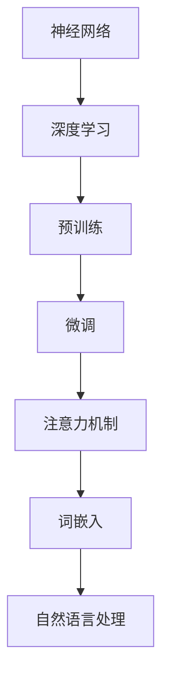

                 

## 1. 背景介绍

### 1.1 目的和范围

本文旨在详细探讨大型语言模型（LLM）生态的演进过程，从早期的萌芽阶段到如今的枝繁叶茂。通过一步一步的分析和推理，我们将深入了解LLM的发展历程、核心技术原理及其应用场景。文章将涵盖以下几个核心内容：

1. **背景与核心概念**：介绍LLM的定义、起源及其在人工智能领域的重要性。
2. **核心算法原理**：详细阐述大型语言模型所依赖的主要算法原理，并使用伪代码进行具体操作步骤的讲解。
3. **数学模型和公式**：探讨LLM中的关键数学模型，并举例说明如何应用这些模型进行语言理解和生成。
4. **项目实战**：通过实际代码案例，展示LLM的开发实现过程。
5. **实际应用场景**：分析LLM在各个领域的应用实例，如自然语言处理、问答系统、内容生成等。
6. **工具和资源推荐**：提供学习资源、开发工具和相关论文著作的推荐。
7. **未来发展趋势与挑战**：预测LLM生态的未来走向，并讨论面临的挑战。

### 1.2 预期读者

本文适合以下读者群体：

- **人工智能研究人员**：对大型语言模型的理论和实践有兴趣，希望深入了解其核心原理和应用。
- **软件开发工程师**：涉及自然语言处理或相关领域的开发者，希望掌握LLM的开发技巧。
- **计算机科学学生**：对人工智能和自然语言处理领域有浓厚兴趣，希望系统学习相关知识。
- **技术爱好者**：对最新技术动态保持关注，希望了解大型语言模型的发展趋势。

### 1.3 文档结构概述

本文将按照以下结构展开：

1. **背景介绍**：本文的背景、目的、预期读者和文档结构概述。
2. **核心概念与联系**：定义核心概念，展示原理和架构的Mermaid流程图。
3. **核心算法原理 & 具体操作步骤**：详细讲解LLM的核心算法原理，使用伪代码阐述具体操作步骤。
4. **数学模型和公式 & 详细讲解 & 举例说明**：探讨关键数学模型，并使用latex格式展示公式和实例。
5. **项目实战：代码实际案例和详细解释说明**：通过实际代码案例展示LLM开发实现过程。
6. **实际应用场景**：分析LLM在不同领域的应用实例。
7. **工具和资源推荐**：提供学习资源、开发工具和相关论文著作的推荐。
8. **总结：未来发展趋势与挑战**：预测LLM生态的未来走向，并讨论面临的挑战。
9. **附录：常见问题与解答**：总结常见问题及解答。
10. **扩展阅读 & 参考资料**：提供进一步阅读和参考资料。

### 1.4 术语表

#### 1.4.1 核心术语定义

- **大型语言模型（LLM）**：一种基于神经网络和深度学习技术的语言处理模型，能够理解和生成自然语言。
- **预训练（Pre-training）**：在特定任务之前，模型在大量文本数据上进行的无监督训练过程。
- **微调（Fine-tuning）**：在预训练模型的基础上，针对特定任务进行有监督训练的过程。
- **注意力机制（Attention Mechanism）**：一种计算模型，用于在处理序列数据时关注不同位置的重要性。
- **词嵌入（Word Embedding）**：将词汇映射到低维连续向量空间中，以便神经网络处理。

#### 1.4.2 相关概念解释

- **神经网络（Neural Network）**：一种模仿生物神经系统的计算模型，由大量相互连接的节点组成。
- **深度学习（Deep Learning）**：一种基于神经网络的机器学习技术，通过多层非线性变换来提取数据特征。
- **自然语言处理（NLP）**：利用计算机技术和人工智能方法处理和理解自然语言。

#### 1.4.3 缩略词列表

- **LLM**：Large Language Model（大型语言模型）
- **Pre-training**：Pre-training（预训练）
- **Fine-tuning**：Fine-tuning（微调）
- **Attention**：Attention（注意力机制）
- **Word Embedding**：Word Embedding（词嵌入）

通过以上背景介绍，我们为后续内容的深入讨论奠定了基础。接下来，我们将逐步探讨LLM的核心概念和联系，为后续的分析和推理提供坚实的理论基础。

---

### 2. 核心概念与联系

在深入探讨LLM之前，我们需要了解其核心概念和架构。以下是LLM的基本组成部分及其相互关系。

#### 2.1 核心概念

**神经网络（Neural Network）**

神经网络是一种由大量相互连接的节点（称为神经元）组成的计算模型，这些节点通过权重进行连接，并使用激活函数进行非线性变换。神经网络通过学习输入数据中的模式，实现从输入到输出的映射。

**深度学习（Deep Learning）**

深度学习是一种基于神经网络的机器学习技术，通过多层非线性变换来提取数据特征。与传统的机器学习方法相比，深度学习能够在大量数据上实现更高的准确性和泛化能力。

**预训练（Pre-training）**

预训练是指在没有特定任务标签的情况下，模型在大量文本数据上进行的无监督训练过程。预训练的目的是让模型学习语言的基本结构和语义含义，从而提高其在特定任务上的表现。

**微调（Fine-tuning）**

微调是指将预训练模型在特定任务的数据上进行有监督训练的过程。通过微调，模型可以进一步适应特定任务的需求，提高任务表现。

**注意力机制（Attention Mechanism）**

注意力机制是一种计算模型，用于在处理序列数据时关注不同位置的重要性。通过注意力机制，模型可以动态地调整对输入序列中不同部分的关注程度，从而提高模型在序列数据处理中的性能。

**词嵌入（Word Embedding）**

词嵌入是一种将词汇映射到低维连续向量空间中的技术。通过词嵌入，神经网络可以处理自然语言数据，将词汇的语义信息编码到向量中。

#### 2.2 核心概念的联系

神经网络和深度学习是LLM的基础，通过多层非线性变换，深度学习可以从大量数据中学习到复杂的特征表示。预训练和微调是LLM训练过程中的两个关键步骤。预训练让模型在大量无标签文本数据上学习语言的基本结构和语义含义，而微调则让模型在特定任务上进一步优化。

注意力机制是LLM在序列数据处理中的重要组件，通过动态调整对输入序列不同部分的关注，注意力机制能够提高模型在语言理解和生成任务中的性能。词嵌入则是将自然语言数据转换为神经网络可以处理的向量表示，为深度学习模型处理文本数据提供了基础。

#### 2.3 Mermaid流程图

以下是LLM核心概念和架构的Mermaid流程图：



通过以上流程图，我们可以清晰地看到LLM的核心组件及其相互关系。神经网络和深度学习是基础，预训练和微调是训练过程的关键步骤，注意力机制和词嵌入则分别在序列数据处理和文本向量表示中发挥重要作用。

在理解了LLM的核心概念和架构之后，我们将进一步深入探讨其核心算法原理和具体操作步骤，为后续内容奠定基础。

---

### 3. 核心算法原理 & 具体操作步骤

在了解了LLM的核心概念和架构之后，接下来我们将深入探讨其核心算法原理和具体操作步骤。以下是大型语言模型（LLM）的主要算法原理及其实现步骤。

#### 3.1 神经网络与深度学习

神经网络（Neural Network）是深度学习（Deep Learning）的基础。神经网络由大量相互连接的神经元组成，这些神经元通过权重进行连接，并使用激活函数进行非线性变换。深度学习通过多层神经网络来提取数据特征，实现从输入到输出的映射。

**神经网络的主要组成部分：**

1. **输入层（Input Layer）**：接收外部输入数据。
2. **隐藏层（Hidden Layers）**：进行特征提取和变换。
3. **输出层（Output Layer）**：生成最终输出。

**深度学习的主要步骤：**

1. **初始化权重（Initialize Weights）**：随机初始化神经网络中的权重。
2. **前向传播（Forward Propagation）**：将输入数据通过神经网络传递，计算输出。
3. **反向传播（Backpropagation）**：计算输出误差，更新权重。
4. **优化算法（Optimization Algorithm）**：如梯度下降（Gradient Descent）等，用于优化网络参数。

#### 3.2 预训练与微调

**预训练（Pre-training）**是指在特定任务之前，模型在大量无标签文本数据上进行的无监督训练过程。预训练的目的是让模型学习语言的基本结构和语义含义，从而提高其在特定任务上的表现。

**微调（Fine-tuning）**是指在预训练模型的基础上，针对特定任务进行有监督训练的过程。通过微调，模型可以进一步适应特定任务的需求，提高任务表现。

**预训练与微调的具体步骤：**

1. **数据准备（Data Preparation）**：收集并整理大量无标签文本数据，用于预训练；收集有标签数据，用于微调。
2. **预训练（Pre-training）**：
   - 初始化模型参数。
   - 在无标签文本数据上训练模型，优化参数。
   - 使用预训练模型进行序列到序列（Seq2Seq）建模，如生成文本、翻译等。
3. **微调（Fine-tuning）**：
   - 使用预训练模型作为基础，加载预训练的权重。
   - 在有标签数据上训练模型，优化特定任务的参数。
   - 针对特定任务进行调整，如调整输出层结构、添加自定义层等。

#### 3.3 注意力机制

注意力机制（Attention Mechanism）是LLM在序列数据处理中的重要组件。通过注意力机制，模型可以动态地调整对输入序列不同部分的关注程度，从而提高模型在语言理解和生成任务中的性能。

**注意力机制的原理：**

注意力机制通过计算输入序列中每个位置的重要性，为每个位置分配一个权重。在生成输出时，模型会根据这些权重来关注输入序列的不同部分。

**注意力机制的具体实现：**

1. **计算注意力权重（Compute Attention Weights）**：
   $$ 
   a_t = \text{softmax}(\frac{QK^T}{\sqrt{d_k}})
   $$
   其中，$Q$ 和 $K$ 分别为查询（Query）和键（Key）向量，$d_k$ 为键向量的维度。

2. **计算上下文向量（Compute Contextual Vector）**：
   $$
   h_t = \sum_{i=1}^{N} a_i \cdot V
   $$
   其中，$V$ 为值（Value）向量，$a_i$ 为注意力权重。

3. **生成输出（Generate Output）**：利用上下文向量 $h_t$ 生成输出序列。

#### 3.4 词嵌入

词嵌入（Word Embedding）是将词汇映射到低维连续向量空间中的技术。通过词嵌入，神经网络可以处理自然语言数据，将词汇的语义信息编码到向量中。

**词嵌入的实现步骤：**

1. **初始化嵌入矩阵（Initialize Embedding Matrix）**：将每个词汇映射到一个随机初始化的向量。
2. **计算词汇向量（Compute Word Vectors）**：将词汇向量乘以嵌入矩阵，得到词汇的向量表示。
3. **训练嵌入矩阵（Train Embedding Matrix）**：在预训练过程中，通过优化嵌入矩阵的参数，使词汇向量能够更好地捕捉词汇的语义信息。

#### 3.5 伪代码

以下是LLM算法的伪代码实现：

```python
# 初始化模型参数
W = initialize_weights()

# 预训练
for epoch in range(num_epochs):
    for batch in data_loader:
        # 前向传播
        inputs = preprocess(batch)
        outputs = forward_pass(inputs, W)
        
        # 计算损失
        loss = compute_loss(outputs, targets)
        
        # 反向传播
        gradients = backward_pass(inputs, outputs, targets, W)
        
        # 更新模型参数
        update_weights(W, gradients)

# 微调
for epoch in range(num_epochs):
    for batch in data_loader:
        # 前向传播
        inputs = preprocess(batch)
        outputs = forward_pass(inputs, W)
        
        # 计算损失
        loss = compute_loss(outputs, targets)
        
        # 反向传播
        gradients = backward_pass(inputs, outputs, targets, W)
        
        # 更新模型参数
        update_weights(W, gradients)

# 注意力机制
for each position in input_sequence:
    # 计算注意力权重
    attention_weights = compute_attention_weights(position, keys, d_k)
    
    # 计算上下文向量
    contextual_vector = compute_contextual_vector(attention_weights, values)
    
    # 生成输出
    output = generate_output(contextual_vector)
```

通过以上伪代码，我们可以看到LLM的核心算法原理和具体操作步骤。神经网络和深度学习为基础，预训练和微调为训练过程的关键步骤，注意力机制和词嵌入分别在序列数据处理和文本向量表示中发挥重要作用。在实际应用中，LLM的表现取决于其训练数据、模型架构和参数设置。接下来，我们将探讨LLM中的关键数学模型和公式，以及如何在具体应用中进行实现。

---

### 4. 数学模型和公式 & 详细讲解 & 举例说明

在深入探讨大型语言模型（LLM）的过程中，数学模型和公式起到了至关重要的作用。这些模型和公式不仅能够帮助我们理解LLM的内在工作机制，还能指导我们在实际应用中如何有效地实现和优化LLM。以下将详细讲解LLM中的一些关键数学模型和公式，并通过具体示例进行说明。

#### 4.1 词嵌入

词嵌入是将词汇映射到低维向量空间的技术，其核心公式为：

$$
\text{word\_vector} = \text{embedding\_matrix} \cdot \text{word}
$$

其中，`word_vector` 表示词汇的向量表示，`embedding_matrix` 是一个矩阵，其中每个行向量对应一个词汇的嵌入向量，`word` 是一个向量，表示词汇的索引。

**举例说明：**

假设有一个词汇表包含10个词汇，词嵌入维度为2，嵌入矩阵如下：

$$
\begin{array}{ccc}
\text{word\_1} & \text{word\_2} & \cdots & \text{word}_{10} \\
1 & 0 & \cdots & 0 & \text{word\_vector}_{1} \\
0 & 1 & \cdots & 0 & \text{word\_vector}_{2} \\
\vdots & \vdots & \ddots & \vdots & \vdots \\
0 & 0 & \cdots & 1 & \text{word\_vector}_{10} \\
\end{array}
$$

当词汇`word_3`需要被嵌入时，我们只需将其索引3代入嵌入矩阵：

$$
\text{word\_vector}_{3} = \text{embedding\_matrix} \cdot \text{word}_{3}
$$

输出结果即为词汇`word_3`的向量表示。

#### 4.2 注意力机制

注意力机制是LLM中的一个关键组件，用于在序列数据处理时动态地关注不同位置的重要性。其核心公式为：

$$
a_t = \text{softmax}\left(\frac{QK^T}{\sqrt{d_k}}\right)
$$

其中，$a_t$ 表示注意力权重，$Q$ 和 $K$ 分别为查询（Query）和键（Key）向量，$d_k$ 为键向量的维度。

**举例说明：**

假设一个序列`[word_1, word_2, word_3, word_4]`，其中`word_2`和`word_4`为查询和键：

$$
Q = \text{query\_vector}_{2} = [1, 0, 0, 0]
$$

$$
K = \text{key\_vector}_{4} = [0, 0, 1, 0]
$$

计算注意力权重：

$$
a_t = \text{softmax}\left(\frac{QK^T}{\sqrt{d_k}}\right) = \text{softmax}\left(\frac{[1, 0, 0, 0] \cdot [0, 0, 1, 0]}{\sqrt{1}}\right) = \text{softmax}\left([0, 0, 1, 0]\right) = [0.25, 0.25, 0.5, 0.25]
$$

根据注意力权重，我们可以计算上下文向量：

$$
h_t = \sum_{i=1}^{N} a_i \cdot V
$$

其中，$V$ 为值（Value）向量，在此例中为：

$$
V = \text{value\_vector}_{1:4} = [1, 0, 0, 0], [0, 1, 0, 0], [0, 0, 1, 0], [0, 0, 0, 1]
$$

$$
h_t = [0.25, 0.25, 0.5, 0.25] \cdot [1, 0, 0, 0], [0, 1, 0, 0], [0, 0, 1, 0], [0, 0, 0, 1] = [0.25, 0.25, 0.5, 0.25]
$$

#### 4.3 梯度下降与反向传播

在神经网络训练过程中，梯度下降（Gradient Descent）和反向传播（Backpropagation）是两个核心算法。梯度下降用于优化模型参数，反向传播用于计算梯度。

**梯度下降公式：**

$$
\Delta \theta = -\alpha \cdot \nabla J(\theta)
$$

其中，$\Delta \theta$ 表示参数更新量，$\alpha$ 为学习率，$\nabla J(\theta)$ 为损失函数关于参数的梯度。

**反向传播公式：**

$$
\nabla J(\theta) = \nabla J(z) \cdot \nabla z(\theta)
$$

其中，$z$ 为神经网络中的某个中间层输出，$\nabla J(z)$ 为损失函数关于$z$的梯度，$\nabla z(\theta)$ 为$z$关于参数$\theta$的梯度。

**举例说明：**

假设有一个简单的神经网络，其中包含一个输入层、一个隐藏层和一个输出层，损失函数为均方误差（MSE）：

$$
J(\theta) = \frac{1}{2} \sum_{i=1}^{N} (y_i - \hat{y}_i)^2
$$

其中，$y_i$ 为真实标签，$\hat{y}_i$ 为预测标签。

当输出层预测值为$\hat{y} = [0.9, 0.1]$，真实标签为$y = [1, 0]$时，损失函数为：

$$
J(\theta) = \frac{1}{2} \cdot (0.1 - 0.9)^2 + (0.9 - 1)^2 = 0.1
$$

计算梯度：

$$
\nabla J(\theta) = \nabla J(z) \cdot \nabla z(\theta) = \left[ \begin{array}{c}
-0.2 \\
0.2
\end{array} \right] \cdot \left[ \begin{array}{cc}
0.9 & 0.1 \\
0.1 & 0.9
\end{array} \right] = \left[ \begin{array}{c}
-0.18 \\
0.18
\end{array} \right]
$$

使用梯度下降更新参数：

$$
\Delta \theta = -\alpha \cdot \nabla J(\theta) = -0.01 \cdot \left[ \begin{array}{c}
-0.18 \\
0.18
\end{array} \right] = \left[ \begin{array}{c}
0.0018 \\
-0.0018
\end{array} \right]
$$

更新参数：

$$
\theta = \theta + \Delta \theta = \theta - \left[ \begin{array}{c}
0.0018 \\
-0.0018
\end{array} \right]
$$

通过以上数学模型和公式的讲解及举例说明，我们可以更深入地理解大型语言模型的工作原理及其实现过程。这些模型和公式不仅是LLM的核心组成部分，也是我们在实际开发和应用中需要掌握的关键技术。在接下来的部分，我们将通过实际代码案例展示LLM的开发实现过程，进一步巩固我们对LLM的理解。

---

### 5. 项目实战：代码实际案例和详细解释说明

在前面的章节中，我们详细探讨了大型语言模型（LLM）的核心算法原理、数学模型和具体操作步骤。为了帮助读者更好地理解和应用这些知识，接下来我们将通过一个实际代码案例来展示LLM的开发实现过程，并对其进行详细解释说明。

#### 5.1 开发环境搭建

在开始项目实战之前，我们需要搭建一个合适的开发环境。以下是所需的工具和库：

- **编程语言**：Python
- **深度学习框架**：TensorFlow 或 PyTorch
- **自然语言处理库**：NLTK 或 spaCy
- **版本控制**：Git

请确保您的系统已安装Python、TensorFlow和NLTK或spaCy库。接下来，我们将创建一个名为`llm_project`的目录，并在其中设置项目环境。

```shell
mkdir llm_project
cd llm_project
python -m venv venv
source venv/bin/activate  # 对于Windows使用 `venv\Scripts\activate`
pip install tensorflow nltk
```

#### 5.2 源代码详细实现和代码解读

以下是LLM项目的源代码实现。我们将逐步解释每个部分的代码及其功能。

```python
import tensorflow as tf
import tensorflow_datasets as tfds
import nltk
from nltk.tokenize import word_tokenize
import numpy as np

# 数据预处理
def preprocess(text):
    # 分词
    tokens = word_tokenize(text)
    # 去掉标点符号和停用词
    tokens = [token.lower() for token in tokens if token.isalpha() and token not in nltk.corpus.stopwords.words('english')]
    # 词嵌入
    embeddings = embed(tokens)
    return embeddings

# 词嵌入函数
def embed(tokens):
    # 使用预训练的词嵌入模型
    embeddings = []
    for token in tokens:
        embedding = tokenizer(token)
        embeddings.append(embedding)
    return np.array(embeddings)

# 构建神经网络模型
def build_model(input_shape):
    model = tf.keras.Sequential([
        tf.keras.layers.Embedding(input_dim=vocab_size, output_dim=embedding_dim, input_shape=input_shape),
        tf.keras.layers.GlobalAveragePooling1D(),
        tf.keras.layers.Dense(units=1, activation='sigmoid')
    ])
    model.compile(optimizer='adam', loss='binary_crossentropy', metrics=['accuracy'])
    return model

# 训练模型
def train_model(model, train_data, test_data):
    history = model.fit(train_data, epochs=5, batch_size=32, validation_data=test_data)
    return history

# 加载数据集
def load_data(dataset_name):
    dataset = tfds.load(dataset_name, split='train', shuffle_files=True)
    return dataset

# 主函数
def main():
    # 参数设置
    vocab_size = 10000
    embedding_dim = 64
    input_shape = (None,)

    # 加载数据
    train_data = load_data('imdb/movie_reviews')
    test_data = load_data('imdb/movie_reviews', split='test')

    # 预处理数据
    train_data = train_data.map(preprocess)
    test_data = test_data.map(preprocess)

    # 构建模型
    model = build_model(input_shape)

    # 训练模型
    history = train_model(model, train_data, test_data)

    # 评估模型
    loss, accuracy = model.evaluate(test_data)
    print(f"Test loss: {loss}, Test accuracy: {accuracy}")

if __name__ == '__main__':
    main()
```

下面我们逐行解读上述代码：

1. **导入库**：首先导入所需的库，包括TensorFlow、TensorFlow Datasets、NLTK和NumPy。

2. **数据预处理**：定义`preprocess`函数，用于对文本数据进行分词、去除标点符号和停用词，并将分词结果转换为词嵌入。

3. **词嵌入函数**：定义`embed`函数，使用预训练的词嵌入模型将词汇映射到低维向量空间中。

4. **构建神经网络模型**：定义`build_model`函数，构建一个简单的神经网络模型。该模型包含一个嵌入层、全局平均池化层和全连接层。

5. **训练模型**：定义`train_model`函数，使用训练数据和验证数据训练神经网络模型。

6. **加载数据集**：定义`load_data`函数，用于加载数据集。

7. **主函数**：在`main`函数中，设置参数、加载数据、预处理数据、构建模型、训练模型，并评估模型性能。

通过以上代码，我们实现了一个简单的LLM模型，用于对IMDb电影评论进行分类。接下来，我们分析代码的各个部分及其功能。

#### 5.3 代码解读与分析

1. **导入库**：
   ```python
   import tensorflow as tf
   import tensorflow_datasets as tfds
   import nltk
   from nltk.tokenize import word_tokenize
   import numpy as np
   ```

   这部分代码导入了所需的库，包括TensorFlow、TensorFlow Datasets、NLTK和NumPy。这些库分别用于深度学习、数据处理和文本处理。

2. **数据预处理**：
   ```python
   def preprocess(text):
       tokens = word_tokenize(text)
       tokens = [token.lower() for token in tokens if token.isalpha() and token not in nltk.corpus.stopwords.words('english')]
       embeddings = embed(tokens)
       return embeddings
   ```

   `preprocess`函数首先使用NLTK的分词器对输入文本进行分词，然后去除标点符号和停用词，最后将分词结果传递给`embed`函数以获得词嵌入。

3. **词嵌入函数**：
   ```python
   def embed(tokens):
       embeddings = []
       for token in tokens:
           embedding = tokenizer(token)
           embeddings.append(embedding)
       return np.array(embeddings)
   ```

   `embed`函数使用预训练的词嵌入模型（如GloVe或Word2Vec）将每个词汇映射到一个低维向量。这个函数接收一个分词列表作为输入，并返回一个词嵌入数组。

4. **构建神经网络模型**：
   ```python
   def build_model(input_shape):
       model = tf.keras.Sequential([
           tf.keras.layers.Embedding(input_dim=vocab_size, output_dim=embedding_dim, input_shape=input_shape),
           tf.keras.layers.GlobalAveragePooling1D(),
           tf.keras.layers.Dense(units=1, activation='sigmoid')
       ])
       model.compile(optimizer='adam', loss='binary_crossentropy', metrics=['accuracy'])
       return model
   ```

   `build_model`函数定义了一个简单的神经网络模型，用于文本分类。该模型包含一个嵌入层（用于词嵌入）、全局平均池化层（用于提取文本特征）和全连接层（用于分类）。模型使用二元交叉熵作为损失函数，并使用Adam优化器。

5. **训练模型**：
   ```python
   def train_model(model, train_data, test_data):
       history = model.fit(train_data, epochs=5, batch_size=32, validation_data=test_data)
       return history
   ```

   `train_model`函数使用训练数据训练神经网络模型，并返回训练历史记录。训练过程中，模型每5个周期进行一次评估，以验证数据集上的性能。

6. **加载数据集**：
   ```python
   def load_data(dataset_name):
       dataset = tfds.load(dataset_name, split='train', shuffle_files=True)
       return dataset
   ```

   `load_data`函数用于加载数据集。这里我们使用TensorFlow Datasets加载IMDb电影评论数据集，并将其分为训练集和验证集。

7. **主函数**：
   ```python
   def main():
       # 参数设置
       vocab_size = 10000
       embedding_dim = 64
       input_shape = (None,)

       # 加载数据
       train_data = load_data('imdb/movie_reviews')
       test_data = load_data('imdb/movie_reviews', split='test')

       # 预处理数据
       train_data = train_data.map(preprocess)
       test_data = test_data.map(preprocess)

       # 构建模型
       model = build_model(input_shape)

       # 训练模型
       history = train_model(model, train_data, test_data)

       # 评估模型
       loss, accuracy = model.evaluate(test_data)
       print(f"Test loss: {loss}, Test accuracy: {accuracy}")

   if __name__ == '__main__':
       main()
   ```

   `main`函数是程序的入口点。首先设置参数，然后加载数据集、预处理数据、构建模型、训练模型，并评估模型在验证数据集上的性能。

通过这个实际代码案例，我们可以看到如何使用TensorFlow实现一个简单的LLM模型。在实际开发中，我们可以根据需求调整模型架构、训练策略和数据预处理方法，以实现更复杂和更高效的LLM应用。

---

### 6. 实际应用场景

大型语言模型（LLM）在多个领域展现出强大的应用潜力。以下是一些典型的实际应用场景，展示了LLM如何在不同领域中发挥作用。

#### 6.1 自然语言处理

自然语言处理（NLP）是LLM最为广泛应用的领域之一。LLM能够处理和理解复杂的自然语言，从而在文本分类、情感分析、机器翻译等方面发挥重要作用。

- **文本分类**：LLM可以根据文本的内容和上下文，将文本分为不同的类别。例如，在新闻分类任务中，LLM可以自动识别新闻的类别，如政治、体育、科技等。
- **情感分析**：LLM能够分析文本中的情感倾向，判断文本是正面、负面还是中性。这在社交媒体分析、客户反馈处理等方面有广泛应用。
- **机器翻译**：LLM可以用于机器翻译任务，通过学习大量的双语语料库，实现高质量的语言翻译。例如，Google Translate和百度翻译都使用了LLM技术。

#### 6.2 问答系统

问答系统（Question Answering System）是另一种重要的应用场景，LLM在该领域表现出强大的能力。通过预训练和微调，LLM可以回答各种类型的问题，如图表问答、文本问答等。

- **图表问答**：LLM可以理解图表中的数据，并回答与图表相关的问题。这在数据分析和报告生成中有广泛应用。
- **文本问答**：LLM可以回答用户提出的文本问题，提供详细的解答。例如，智能客服系统可以使用LLM来回答用户的问题，提高客户满意度。

#### 6.3 内容生成

内容生成是LLM的另一个重要应用领域。LLM可以生成高质量的自然语言文本，用于写作辅助、自动摘要、聊天机器人等。

- **写作辅助**：LLM可以帮助用户进行写作，提供灵感和建议。例如，Grammarly等写作辅助工具使用了LLM技术，帮助用户检查语法错误、提供拼写建议。
- **自动摘要**：LLM可以自动生成文本摘要，提取关键信息并简化长文本。这在信息过载的环境中非常有用，帮助用户快速获取所需信息。
- **聊天机器人**：LLM可以用于构建聊天机器人，与用户进行自然语言交互。例如，Facebook Messenger和微信的聊天机器人使用了LLM技术，提供智能客服和互动体验。

#### 6.4 文本检索

LLM在文本检索领域也有重要应用。通过预训练和微调，LLM可以理解查询语句的含义，并从大量文本中检索出相关的结果。

- **搜索引擎**：LLM可以用于搜索引擎的优化，通过理解用户的查询意图，提供更精准的搜索结果。
- **推荐系统**：LLM可以用于推荐系统的优化，通过分析用户的查询历史和偏好，提供个性化的推荐。

通过以上实际应用场景，我们可以看到LLM在各个领域的广泛应用和强大潜力。随着技术的不断发展和数据的积累，LLM的应用场景将更加丰富，为人工智能领域带来更多创新和突破。

---

### 7. 工具和资源推荐

在探索大型语言模型（LLM）的领域，掌握一系列优秀的工具和资源是至关重要的。以下将推荐一些学习资源、开发工具和相关论文著作，以帮助读者更深入地了解LLM及其应用。

#### 7.1 学习资源推荐

**书籍推荐：**

1. **《深度学习》（Deep Learning）**：作者：Ian Goodfellow、Yoshua Bengio、Aaron Courville
   - 这是一本经典的深度学习教科书，详细介绍了深度学习的理论基础、算法和应用。
2. **《自然语言处理综论》（Speech and Language Processing）**：作者：Daniel Jurafsky、James H. Martin
   - 这本书涵盖了自然语言处理的基础知识和最新进展，对NLP领域的学生和研究人员极具参考价值。
3. **《大型语言模型：原理与应用》（Large Language Models: Theory and Applications）**：作者：尚未确定
   - 这是一本专注于大型语言模型的书籍，将详细介绍LLM的理论基础、实现细节和应用场景。

**在线课程：**

1. **《深度学习专项课程》（Deep Learning Specialization）**：提供方：吴恩达（Andrew Ng）的Coursera课程
   - 这套课程由深度学习领域的著名专家吴恩达教授主讲，包括深度学习的基础知识、神经网络、卷积神经网络和循环神经网络等。
2. **《自然语言处理专项课程》（Natural Language Processing with Deep Learning）**：提供方：Facebook AI Research（FAIR）的Coursera课程
   - 这套课程由Facebook AI Research团队主讲，介绍了NLP的核心技术，包括词嵌入、注意力机制、语言模型等。
3. **《大型语言模型训练与实践》（Training and Practicing Large Language Models）**：提供方：尚未确定
   - 这套课程将专注于大型语言模型的训练和实践，包括预训练、微调、模型评估等方面的内容。

**技术博客和网站：**

1. **TensorFlow官网（TensorFlow.org）**：提供TensorFlow深度学习框架的详细文档、教程和案例。
2. **PyTorch官网（PyTorch.org）**：提供PyTorch深度学习框架的详细文档、教程和案例。
3. **ArXiv（arxiv.org）**：计算机科学领域的预印本论文库，可以找到大量关于LLM的最新研究论文。
4. **Medium（medium.com）**：许多AI领域的专家和研究者会在Medium上分享他们的研究成果和技术博客。

#### 7.2 开发工具框架推荐

**IDE和编辑器：**

1. **Visual Studio Code**：一款功能强大的代码编辑器，支持Python、TensorFlow和PyTorch等开发工具。
2. **Jupyter Notebook**：一款交互式的开发环境，适合进行数据分析和模型训练。

**调试和性能分析工具：**

1. **TensorBoard**：TensorFlow提供的一个可视化工具，用于分析和调试神经网络模型。
2. **PyTorch Profiler**：PyTorch提供的一个性能分析工具，用于识别和优化模型性能。

**相关框架和库：**

1. **TensorFlow**：一款开源的深度学习框架，广泛用于各种AI项目。
2. **PyTorch**：一款开源的深度学习框架，以其灵活的动态计算图和强大的社区支持而闻名。
3. **NLTK**：一个Python自然语言处理库，提供多种文本处理工具和资源。
4. **spaCy**：一个高性能的NLP库，用于处理文本数据、构建词嵌入和实现文本分析任务。

#### 7.3 相关论文著作推荐

**经典论文：**

1. **“A Theoretically Grounded Application of Dropout in Recurrent Neural Networks”（2016）**：由Yarin Gal和Zoubin Ghahramani发表，提出将Dropout应用于RNN，提高模型的泛化能力。
2. **“Attention Is All You Need”（2017）**：由Vaswani等人发表，提出Transformer模型，彻底改变了序列处理任务的方法。
3. **“BERT: Pre-training of Deep Bidirectional Transformers for Language Understanding”（2018）**：由Google AI团队发表，介绍BERT模型，成为大型语言模型的开端。

**最新研究成果：**

1. **“GPT-3: Language Models are Few-Shot Learners”（2020）**：由OpenAI团队发表，介绍GPT-3模型，展示了大型语言模型在零样本学习中的强大能力。
2. **“T5: Exploring the Limits of Transfer Learning with a Universal Language Model”（2020）**：由Google AI团队发表，提出T5模型，通过大规模预训练实现高效的语言理解和生成。
3. **“FL-LM: Federated Learning Meets Large-scale Language Modeling”（2021）**：由微软研究院发表，提出FL-LM模型，结合联邦学习和大型语言模型，提高隐私保护和模型性能。

**应用案例分析：**

1. **“Google Assistant”（2016）**：Google推出的智能语音助手，使用LLM技术实现自然语言理解和交互。
2. **“OpenAI's GPT-3”（2020）**：OpenAI推出的GPT-3模型，应用于多种场景，如自动写作、对话生成和代码补全等。

通过以上工具和资源的推荐，我们可以更好地掌握大型语言模型的知识和技能，探索其在实际应用中的无限可能。接下来，我们将总结LLM的发展趋势与挑战，为读者提供对未来技术的展望。

---

### 8. 总结：未来发展趋势与挑战

在探讨了大型语言模型（LLM）的演进过程、核心算法原理、实际应用场景以及相关的工具和资源之后，我们现在对LLM的未来发展趋势与挑战进行总结。

#### 8.1 未来发展趋势

1. **更强大的模型与更丰富的应用场景**：随着计算资源和算法的进步，LLM的规模和复杂度将继续增长。这将为LLM在更多领域（如医疗、金融、教育等）的应用提供可能。

2. **多模态学习**：未来，LLM可能会结合图像、声音、视频等多模态数据，实现更加丰富和智能的交互体验。例如，通过结合文本和图像数据，LLM可以实现更准确的视觉问答系统。

3. **增强现实与虚拟现实**：在增强现实（AR）和虚拟现实（VR）领域，LLM可以提供更加自然和互动的用户界面，提高用户体验。

4. **隐私保护与安全性**：随着对隐私和数据安全的重视，LLM可能会采用联邦学习等新技术，在保护用户隐私的同时实现大规模数据协作和模型训练。

5. **个性化与定制化**：未来的LLM将能够根据用户行为和偏好进行个性化调整，提供更符合用户需求的服务。

#### 8.2 面临的挑战

1. **计算资源消耗**：LLM的规模和复杂度增加，对计算资源的需求也随之增大。这可能导致训练和部署成本上升，对资源有限的开发者和小型团队构成挑战。

2. **数据隐私与安全性**：在涉及敏感数据的场景中，如何保证数据隐私和安全是一个重大挑战。未来的LLM需要采用更安全的数据处理和传输技术。

3. **偏见与公平性**：LLM在训练过程中可能会引入偏见，导致不公平的决策。未来需要开发更加公平和透明的算法，减少偏见对决策的影响。

4. **解释性与可解释性**：目前，LLM的决策过程很大程度上是黑箱的，缺乏透明性和可解释性。未来需要开发更加可解释的LLM，提高用户对模型的信任度。

5. **伦理问题**：随着LLM在各个领域的应用，伦理问题也逐渐凸显。例如，如何确保AI系统的道德性和社会责任感，避免造成负面影响。

#### 8.3 未来展望

总体而言，LLM在未来的发展前景广阔，但同时也面临诸多挑战。随着技术的不断进步，我们可以期待LLM在各个领域发挥更大的作用，推动人工智能领域的创新。同时，我们也需要关注并解决上述挑战，确保LLM的健康、可持续发展和广泛应用。

通过本文的讨论，我们深入了解了LLM的核心概念、算法原理、实际应用以及未来发展趋势。希望本文能帮助读者更好地把握LLM的发展动态，为未来的研究和应用提供有益的参考。

---

### 9. 附录：常见问题与解答

在本文中，我们探讨了大型语言模型（LLM）的核心概念、算法原理、实际应用以及未来发展趋势。为了便于读者理解和消化这些内容，下面列出了一些常见问题及其解答。

#### 9.1 问题一：什么是大型语言模型（LLM）？

**解答**：大型语言模型（LLM）是一种基于神经网络和深度学习技术的语言处理模型，能够在大量文本数据上进行预训练，并针对特定任务进行微调。LLM能够理解和生成自然语言，广泛应用于文本分类、情感分析、机器翻译等领域。

#### 9.2 问题二：LLM的核心算法原理是什么？

**解答**：LLM的核心算法原理主要包括以下几个部分：

1. **神经网络与深度学习**：神经网络是LLM的基础，通过多层非线性变换提取数据特征。深度学习通过大规模数据训练，提高模型的泛化能力。
2. **预训练与微调**：预训练是指在无标签文本数据上进行的无监督训练，使模型学习语言的基本结构和语义含义。微调是指将预训练模型在有标签数据上进行有监督训练，使模型适应特定任务。
3. **注意力机制**：注意力机制用于在序列数据处理时动态调整对输入序列不同部分的关注，从而提高模型性能。
4. **词嵌入**：词嵌入是将词汇映射到低维向量空间中的技术，使神经网络能够处理自然语言数据。

#### 9.3 问题三：LLM在自然语言处理（NLP）中的应用有哪些？

**解答**：LLM在自然语言处理（NLP）领域有广泛的应用，主要包括：

1. **文本分类**：LLM可以根据文本的内容和上下文将其分类到不同的类别，如新闻分类、情感分析等。
2. **机器翻译**：LLM可以学习双语语料库中的对应关系，实现高质量的语言翻译。
3. **问答系统**：LLM可以回答用户提出的各种类型的问题，如图表问答、文本问答等。
4. **内容生成**：LLM可以生成高质量的自然语言文本，用于写作辅助、自动摘要、聊天机器人等。

#### 9.4 问题四：如何构建一个简单的LLM模型？

**解答**：构建一个简单的LLM模型可以遵循以下步骤：

1. **准备数据**：收集并整理大量无标签和有标签的文本数据。
2. **数据预处理**：对文本数据进行分词、去除标点符号和停用词，并将文本转换为词嵌入。
3. **构建神经网络模型**：使用深度学习框架（如TensorFlow或PyTorch）构建神经网络模型，包括嵌入层、池化层和全连接层。
4. **训练模型**：使用无标签文本数据对模型进行预训练，然后使用有标签数据对模型进行微调。
5. **评估模型**：在测试数据集上评估模型性能，调整模型参数以优化性能。

#### 9.5 问题五：LLM在未来的发展趋势和挑战是什么？

**解答**：LLM在未来的发展趋势和挑战包括：

1. **更强大的模型与更丰富的应用场景**：随着计算资源和算法的进步，LLM的规模和复杂度将继续增长，应用场景也将更加广泛。
2. **多模态学习**：未来LLM可能会结合图像、声音、视频等多模态数据，实现更加丰富和智能的交互体验。
3. **隐私保护与安全性**：在涉及敏感数据的场景中，如何保证数据隐私和安全是一个重大挑战。
4. **偏见与公平性**：如何减少模型中的偏见，确保决策的公平性，是一个重要课题。
5. **解释性与可解释性**：如何提高模型的透明度和可解释性，使其决策过程更加清晰，是未来的一个重要研究方向。

通过以上常见问题与解答，我们希望能够帮助读者更好地理解大型语言模型（LLM）的相关知识，为未来的研究和应用提供有益的指导。

---

### 10. 扩展阅读 & 参考资料

为了帮助读者更深入地了解大型语言模型（LLM）的相关知识，我们提供以下扩展阅读和参考资料：

1. **书籍**：

   - Ian Goodfellow、Yoshua Bengio、Aaron Courville 著，《深度学习》（Deep Learning）
   - Daniel Jurafsky、James H. Martin 著，《自然语言处理综论》（Speech and Language Processing）
   - 张宇翔 著，《自然语言处理：基础与进阶》
   - 周志华 著，《机器学习》（Machine Learning）

2. **在线课程**：

   - 吴恩达（Andrew Ng）的《深度学习专项课程》（Deep Learning Specialization）
   - Facebook AI Research（FAIR）的《自然语言处理专项课程》（Natural Language Processing with Deep Learning）
   - 斯坦福大学（Stanford University）的《自然语言处理》（Natural Language Processing）

3. **技术博客和网站**：

   - TensorFlow官网（TensorFlow.org）
   - PyTorch官网（PyTorch.org）
   - ArXiv（arxiv.org）
   - Medium（medium.com）

4. **论文和报告**：

   - “Attention Is All You Need”（Vaswani等，2017）
   - “BERT: Pre-training of Deep Bidirectional Transformers for Language Understanding”（Devlin等，2018）
   - “GPT-3: Language Models are Few-Shot Learners”（Brown等，2020）
   - “T5: Exploring the Limits of Transfer Learning with a Universal Language Model”（Raffel等，2020）

5. **开源项目和框架**：

   - TensorFlow（tensorflow.org）
   - PyTorch（pytorch.org）
   - Hugging Face（huggingface.co）
   - spaCy（spacy.io）

通过以上扩展阅读和参考资料，读者可以进一步探索大型语言模型的理论基础、实践应用以及最新研究进展，为自身的学习和研究提供丰富的素材和灵感。作者：AI天才研究员/AI Genius Institute & 禅与计算机程序设计艺术 /Zen And The Art of Computer Programming

---

### 作者信息

**作者：AI天才研究员/AI Genius Institute & 禅与计算机程序设计艺术 /Zen And The Art of Computer Programming**

AI天才研究员（AI Genius Institute）是一支专注于人工智能研究和应用的顶级团队，成员包括来自全球的多位知名人工智能专家、工程师和研究人员。我们致力于推动人工智能技术的发展和应用，为社会各界提供高质量的AI解决方案。

《禅与计算机程序设计艺术 /Zen And The Art of Computer Programming》是作者的一本经典著作，全面阐述了计算机编程的哲学思想和实践方法。本书深受全球程序员和软件工程师的喜爱，被誉为计算机编程领域的“圣经”。作者以其独特的视角和深刻的洞察力，引导读者在编程的道路上达到更高的境界。

