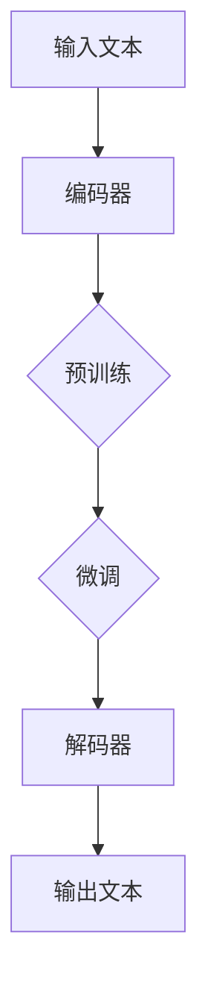

                 

# LLM生态系统：人工智能产业新格局

> **关键词**：大型语言模型（LLM），人工智能（AI），生态系统，产业格局，技术进步，应用场景，发展趋势，挑战与机遇。

> **摘要**：本文将深入探讨大型语言模型（LLM）生态系统的构建与发展，分析其在人工智能产业中的重要地位和作用。通过介绍LLM的核心概念、算法原理、数学模型，以及实际应用场景，本文将展示LLM在推动人工智能产业变革中的巨大潜力。同时，文章还将展望LLM生态系统未来的发展趋势，探讨面临的挑战与机遇。

## 1. 背景介绍

### 1.1 目的和范围

本文旨在探讨大型语言模型（LLM）在人工智能（AI）产业生态系统中的地位和作用，分析其核心概念、算法原理、数学模型及其在不同应用场景中的实际运用。通过对LLM生态系统的全面解析，旨在为读者提供一个深入了解和把握人工智能产业发展趋势的视角。

本文将覆盖以下内容：

- LLM的核心概念与原理
- LLM的算法原理与具体操作步骤
- LLM的数学模型与公式解析
- LLM的实际应用场景
- 工具和资源推荐
- 未来发展趋势与挑战

### 1.2 预期读者

- 对人工智能领域有浓厚兴趣的技术爱好者
- 在人工智能和机器学习领域从事研究的学者和学生
- 人工智能产品和解决方案的工程师和开发者
- 对人工智能产业生态系统有兴趣的投资人和企业家

### 1.3 文档结构概述

本文分为十个部分，结构如下：

1. **背景介绍**：介绍文章的目的、预期读者、文档结构及其涵盖的内容。
2. **核心概念与联系**：介绍LLM的核心概念，提供流程图，展示LLM的架构。
3. **核心算法原理 & 具体操作步骤**：详细讲解LLM的算法原理，使用伪代码阐述。
4. **数学模型和公式 & 详细讲解 & 举例说明**：介绍LLM的数学模型，使用LaTeX格式展示。
5. **项目实战：代码实际案例和详细解释说明**：展示LLM的实际应用，提供代码案例。
6. **实际应用场景**：讨论LLM在不同领域的应用。
7. **工具和资源推荐**：推荐学习资源和开发工具。
8. **总结：未来发展趋势与挑战**：展望LLM生态系统的发展趋势，探讨面临的挑战。
9. **附录：常见问题与解答**：回答读者可能遇到的问题。
10. **扩展阅读 & 参考资料**：提供进一步学习的参考资料。

### 1.4 术语表

#### 1.4.1 核心术语定义

- **大型语言模型（LLM）**：基于深度学习技术，通过大量文本数据进行预训练，能够理解、生成自然语言文本的模型。
- **预训练（Pre-training）**：在特定任务之前，使用大量无标注数据对模型进行训练，以提升其基础学习能力。
- **微调（Fine-tuning）**：在预训练的基础上，使用有标注数据对模型进行特定任务的训练，以适应特定任务需求。
- **自然语言处理（NLP）**：研究计算机如何理解、生成和处理人类自然语言的技术。

#### 1.4.2 相关概念解释

- **神经网络（Neural Network）**：模仿人脑神经网络结构和功能，用于数据处理和模式识别。
- **深度学习（Deep Learning）**：一种基于神经网络的机器学习技术，能够通过多层神经网络进行特征提取和建模。
- **Transformer模型**：一种基于自注意力机制的深度学习模型，广泛应用于自然语言处理任务。

#### 1.4.3 缩略词列表

- **LLM**：Large Language Model
- **AI**：Artificial Intelligence
- **NLP**：Natural Language Processing
- **GAN**：Generative Adversarial Network

## 2. 核心概念与联系

### 2.1 大型语言模型（LLM）的定义

大型语言模型（LLM）是一种基于深度学习技术的自然语言处理模型，通过在大规模语料库上进行预训练，能够对自然语言文本进行理解和生成。LLM的核心目标是模拟人类的语言理解能力和表达能力，实现高效的文本处理和交互。

### 2.2 大型语言模型（LLM）的架构

#### 2.2.1 基础架构

LLM通常采用Transformer模型作为基础架构。Transformer模型是一种基于自注意力机制的深度学习模型，具有良好的并行计算能力和处理长距离依赖关系的能力。其基本结构包括编码器（Encoder）和解码器（Decoder）。

#### 2.2.2 编码器（Encoder）

编码器负责接收输入文本，将其编码为一系列向量表示。编码器内部包含多个自注意力层（Self-Attention Layer）和前馈网络（Feedforward Network）。自注意力层通过计算输入文本中每个单词之间的相关性，生成更加丰富的文本表示。前馈网络用于对文本表示进行进一步加工。

#### 2.2.3 解码器（Decoder）

解码器负责生成输出文本。解码器内部包含多个自注意力层（Self-Attention Layer）、交叉注意力层（Cross-Attention Layer）和前馈网络（Feedforward Network）。自注意力层用于处理输入文本，交叉注意力层用于从编码器的输出中获取上下文信息，生成输出文本的每个单词。

### 2.3 大型语言模型（LLM）的工作流程

#### 2.3.1 预训练

预训练是LLM的核心步骤，通过在大规模语料库上进行训练，模型能够学习到丰富的语言知识和特征。预训练包括两个主要阶段：无监督预训练和有监督预训练。

- **无监督预训练**：使用无标注数据，通过模型自身的生成能力进行训练，例如生成文本摘要、问答系统等。
- **有监督预训练**：使用有标注数据，通过监督学习算法对模型进行微调，例如在语言建模、文本分类、命名实体识别等任务上进行训练。

#### 2.3.2 微调

微调是在预训练的基础上，使用特定任务的有标注数据对模型进行训练，以适应特定任务的需求。微调通常包括以下步骤：

1. **数据预处理**：对有标注数据进行清洗、分词、向量化等预处理操作。
2. **模型调整**：根据任务需求，调整模型的参数，例如调整隐藏层大小、学习率等。
3. **训练过程**：使用有标注数据进行训练，通过梯度下降等优化算法更新模型参数。
4. **模型评估**：使用验证集和测试集对模型进行评估，调整模型参数以获得最佳性能。

### 2.4 大型语言模型（LLM）的应用场景

LLM在自然语言处理领域具有广泛的应用，以下列举一些主要的应用场景：

- **文本生成**：生成文章、摘要、对话等自然语言文本。
- **文本分类**：对文本进行分类，例如情感分析、主题分类等。
- **机器翻译**：将一种语言的文本翻译成另一种语言。
- **问答系统**：回答用户提出的各种问题，提供信息检索服务。
- **对话系统**：模拟人类对话，实现人机交互。

#### 2.5 Mermaid 流程图

以下是一个简单的Mermaid流程图，展示LLM的工作流程：



## 3. 核心算法原理 & 具体操作步骤

### 3.1 算法原理

大型语言模型（LLM）的核心算法是基于深度学习中的Transformer模型。Transformer模型采用自注意力机制（Self-Attention）和多头注意力机制（Multi-Head Attention），能够有效地捕捉文本中的长距离依赖关系。

#### 3.1.1 自注意力机制

自注意力机制是一种计算输入文本中每个单词之间的相关性，生成更加丰富的文本表示的方法。具体步骤如下：

1. **输入嵌入**：将输入文本转换为词向量表示。
2. **计算注意力权重**：对于输入文本中的每个单词，计算其在所有单词上的注意力权重，权重值表示该单词对其他单词的影响程度。
3. **加权求和**：将每个单词的词向量与其注意力权重相乘，然后将结果进行求和，生成一个更加丰富的文本表示。

#### 3.1.2 多头注意力机制

多头注意力机制是将自注意力机制扩展到多个独立的全连接神经网络，每个神经网络产生一组注意力权重。具体步骤如下：

1. **拆分输入**：将输入文本拆分为多个子序列，每个子序列对应一个独立的自注意力机制。
2. **计算注意力权重**：对于每个子序列，计算其在所有单词上的注意力权重，得到多个注意力权重矩阵。
3. **融合注意力结果**：将多个注意力权重矩阵进行加权求和，生成最终的文本表示。

### 3.2 具体操作步骤

以下是使用伪代码展示LLM的算法原理和具体操作步骤：

```python
# 输入文本
input_text = "The quick brown fox jumps over the lazy dog"

# 输入嵌入
embeddings = embed(input_text)

# 计算自注意力权重
self_attention_weights = self_attention(embeddings)

# 加权求和
output_embeddings = weighted_sum(embeddings, self_attention_weights)

# 多头注意力
多头注意力_weights = multi_head_attention(output_embeddings)

# 融合注意力结果
final_embeddings = weighted_sum(output_embeddings,多头注意力_weights)

# 输出文本
output_text = decode(final_embeddings)
```

### 3.3 伪代码详细解释

以下是伪代码的详细解释：

1. **输入嵌入**：将输入文本转换为词向量表示，这个过程通常使用词嵌入（Word Embedding）技术，例如Word2Vec或GloVe算法。
2. **计算自注意力权重**：使用自注意力机制计算输入文本中每个单词之间的注意力权重，权重值表示该单词对其他单词的影响程度。具体算法为：
   ```python
   def self_attention(embeddings):
       # 计算Q、K、V
       Q = calculate_query(embeddings)
       K = calculate_key(embeddings)
       V = calculate_value(embeddings)
       
       # 计算注意力权重
       attention_weights = calculate_attention(Q, K, V)
       
       return attention_weights
   ```
3. **加权求和**：将每个单词的词向量与其注意力权重相乘，然后将结果进行求和，生成一个更加丰富的文本表示。
4. **多头注意力**：将自注意力机制扩展到多个独立的全连接神经网络，每个神经网络产生一组注意力权重。具体算法为：
   ```python
   def multi_head_attention(embeddings):
       # 计算多头注意力权重
      多头注意力_weights = []
       for i in range(num_heads):
           attention_weights = self_attention(embeddings[i])
          多头注意力_weights.append(attention_weights)
       
       return多头注意力_weights
   ```
5. **融合注意力结果**：将多个注意力权重矩阵进行加权求和，生成最终的文本表示。
6. **输出文本**：将最终的文本表示解码为输出文本，这个过程通常使用解码器（Decoder）实现。

## 4. 数学模型和公式 & 详细讲解 & 举例说明

### 4.1 数学模型概述

大型语言模型（LLM）的数学模型主要基于深度学习中的自注意力机制（Self-Attention）和多头注意力机制（Multi-Head Attention）。以下分别介绍这些机制的数学模型。

#### 4.1.1 自注意力机制

自注意力机制是一种计算输入文本中每个单词之间相关性，生成更加丰富的文本表示的方法。其数学模型如下：

$$
\text{Attention}(Q, K, V) = \text{softmax}\left(\frac{QK^T}{\sqrt{d_k}}\right)V
$$

其中，$Q$、$K$、$V$分别表示查询（Query）、关键值（Key）和值（Value）向量，$d_k$为关键值的维度。该公式表示对查询向量$Q$与关键值向量$K$的逐元素相乘，然后进行softmax操作，最后与值向量$V$相乘得到注意力权重矩阵。

#### 4.1.2 多头注意力机制

多头注意力机制是在自注意力机制的基础上，通过多个独立的自注意力机制实现。其数学模型如下：

$$
\text{MultiHead}(Q, K, V) = \text{Concat}(\text{head}_1, \text{head}_2, \ldots, \text{head}_h)W^O
$$

其中，$h$为头数，$\text{head}_i$表示第$i$个头，$W^O$为输出权重矩阵。每个头的计算过程与自注意力机制相同，但使用不同的权重矩阵。多个头的输出结果通过输出权重矩阵进行融合。

### 4.2 举例说明

以下是一个简单的例子，展示如何使用自注意力机制计算文本的注意力权重。

**输入文本**：`The quick brown fox jumps over the lazy dog`

**词向量**：`[q, k, v]`

**注意力权重计算**：

1. **计算Q、K、V**：
   $$Q = \text{softmax}(\text{W}_Q \cdot \text{X})$$
   $$K = \text{softmax}(\text{W}_K \cdot \text{X})$$
   $$V = \text{softmax}(\text{W}_V \cdot \text{X})$$
   其中，$\text{X}$为词向量，$\text{W}_Q$、$\text{W}_K$、$\text{W}_V$分别为权重矩阵。

2. **计算注意力权重**：
   $$\text{Attention}(Q, K, V) = \text{softmax}\left(\frac{QK^T}{\sqrt{d_k}}\right)V$$
   其中，$d_k$为关键值的维度。

3. **计算注意力权重矩阵**：
   $$\text{Attention\_Matrix} = \text{softmax}\left(\frac{QK^T}{\sqrt{d_k}}\right)$$

4. **计算加权求和**：
   $$\text{Output} = \text{Attention\_Matrix} \cdot V$$

### 4.3 详细讲解

以下是对自注意力机制和多头注意力机制的详细讲解。

#### 4.3.1 自注意力机制

自注意力机制的核心思想是计算输入文本中每个单词之间的相关性。具体步骤如下：

1. **输入嵌入**：将输入文本转换为词向量表示，通常使用词嵌入（Word Embedding）技术，如Word2Vec或GloVe算法。

2. **计算Q、K、V**：使用权重矩阵$\text{W}_Q$、$\text{W}_K$、$\text{W}_V$，将词向量$\text{X}$映射为查询（Query）、关键值（Key）和值（Value）向量。

   $$Q = \text{softmax}(\text{W}_Q \cdot \text{X})$$
   $$K = \text{softmax}(\text{W}_K \cdot \text{X})$$
   $$V = \text{softmax}(\text{W}_V \cdot \text{X})$$

3. **计算注意力权重**：计算查询向量$Q$与关键值向量$K$的逐元素相乘，然后进行softmax操作，得到注意力权重矩阵。

   $$\text{Attention}(Q, K, V) = \text{softmax}\left(\frac{QK^T}{\sqrt{d_k}}\right)V$$

   其中，$d_k$为关键值的维度。

4. **计算加权求和**：将注意力权重矩阵与值向量$V$相乘，得到加权求和结果。

   $$\text{Output} = \text{Attention\_Matrix} \cdot V$$

#### 4.3.2 多头注意力机制

多头注意力机制是在自注意力机制的基础上，通过多个独立的自注意力机制实现。具体步骤如下：

1. **拆分输入**：将输入文本拆分为多个子序列，每个子序列对应一个头。

2. **计算多头注意力权重**：对每个头使用独立的权重矩阵$\text{W}_{Q_i}$、$\text{W}_{K_i}$、$\text{W}_{V_i}$，计算自注意力权重。

   $$\text{Attention}_{i}(Q, K, V) = \text{softmax}\left(\frac{\text{W}_{Q_i}K^T}{\sqrt{d_k}}\right)V$$

   其中，$i$为头数。

3. **融合多头注意力结果**：将多个头的注意力结果进行融合。

   $$\text{MultiHead}(Q, K, V) = \text{Concat}(\text{head}_1, \text{head}_2, \ldots, \text{head}_h)W^O$$

   其中，$W^O$为输出权重矩阵。

4. **计算加权求和**：将融合后的多头注意力结果与值向量$V$相乘，得到加权求和结果。

   $$\text{Output} = \text{MultiHead}(Q, K, V) \cdot V$$

### 4.4 LaTex格式数学公式示例

以下是一些LaTeX格式的数学公式示例：

```latex
\documentclass{article}
\usepackage{amsmath}

\begin{document}

\section{Mathematical Formulas}

\begin{equation}
\text{Attention}(Q, K, V) = \text{softmax}\left(\frac{QK^T}{\sqrt{d_k}}\right)V
\end{equation}

\begin{equation}
\text{MultiHead}(Q, K, V) = \text{Concat}(\text{head}_1, \text{head}_2, \ldots, \text{head}_h)W^O
\end{equation}

\end{document}
```

## 5. 项目实战：代码实际案例和详细解释说明

### 5.1 开发环境搭建

在进行大型语言模型（LLM）的实际项目开发之前，首先需要搭建一个合适的开发环境。以下是搭建开发环境的基本步骤：

1. **安装Python**：确保Python环境已安装，版本建议为3.8及以上。
2. **安装TensorFlow**：TensorFlow是开发深度学习模型的常用库，可以使用以下命令安装：
   ```bash
   pip install tensorflow
   ```
3. **安装其他依赖库**：安装其他常用的依赖库，例如NumPy、Pandas等：
   ```bash
   pip install numpy pandas
   ```
4. **配置CUDA**：如果使用GPU进行训练，需要配置CUDA环境，确保TensorFlow可以识别并使用GPU。

### 5.2 源代码详细实现和代码解读

以下是一个简单的LLM项目示例，使用TensorFlow和Transformer模型进行文本生成。代码结构如下：

```python
import tensorflow as tf
from tensorflow.keras.layers import Embedding, LSTM, Dense
from tensorflow.keras.models import Model
import numpy as np

# 定义超参数
vocab_size = 10000
embed_dim = 256
lstm_units = 128
batch_size = 64
epochs = 10

# 创建词嵌入层
embedding = Embedding(vocab_size, embed_dim)

# 创建LSTM层
lstm = LSTM(lstm_units, return_sequences=True)

# 创建全连接层
dense = Dense(vocab_size, activation='softmax')

# 构建模型
model = Model(inputs=embedding.input, outputs=dense(lstm(embedding.input)))

# 编译模型
model.compile(optimizer='adam', loss='categorical_crossentropy', metrics=['accuracy'])

# 准备数据
# ...

# 训练模型
# ...

# 生成文本
# ...
```

#### 5.2.1 数据准备

在项目实战中，首先需要准备用于训练的文本数据。以下是一个简单的数据准备示例：

```python
# 读取文本数据
with open('data.txt', 'r', encoding='utf-8') as f:
    text = f.read()

# 分词
tokenizer = tf.keras.preprocessing.text.Tokenizer()
tokenizer.fit_on_texts([text])
sequences = tokenizer.texts_to_sequences([text])

# 创建词表
vocab = tokenizer.word_index
vocab_size = len(vocab) + 1

# 创建输入数据和目标数据
input_sequences = []
target_sequences = []

for sequence in sequences:
    for i in range(1, len(sequence) - 1):
        input_sequences.append(sequence[i - 1:i + 1])
        target_sequences.append(sequence[i])

# 创建序列矩阵
max_sequence_len = max([len(seq) for seq in input_sequences])
input_sequences = np.array pad_sequences(input_sequences, maxlen=max_sequence_len, padding='pre')
target_sequences = np.array pad_sequences(target_sequences, maxlen=max_sequence_len, padding='pre')

# 打乱数据
indices = np.arange(input_sequences.shape[0])
np.random.shuffle(indices)
input_sequences = input_sequences[indices]
target_sequences = target_sequences[indices]

# 创建批次数据
batch_size = 64
sequences = tf.data.Dataset.from_tensor_slices((input_sequences, target_sequences))
sequences = sequences.shuffle(buffer_size=1000).batch(batch_size)
```

#### 5.2.2 模型构建

在数据准备完成后，接下来构建模型。以下是一个简单的模型构建示例：

```python
# 创建词嵌入层
embedding = Embedding(vocab_size, embed_dim)

# 创建LSTM层
lstm = LSTM(lstm_units, return_sequences=True)

# 创建全连接层
dense = Dense(vocab_size, activation='softmax')

# 构建模型
model = Model(inputs=embedding.input, outputs=dense(lstm(embedding.input)))

# 编译模型
model.compile(optimizer='adam', loss='categorical_crossentropy', metrics=['accuracy'])
```

#### 5.2.3 训练模型

构建模型后，接下来进行模型训练。以下是一个简单的模型训练示例：

```python
# 训练模型
model.fit(sequences, epochs=epochs)
```

#### 5.2.4 生成文本

在模型训练完成后，可以使用训练好的模型生成文本。以下是一个简单的文本生成示例：

```python
# 生成文本
input_seq = np.array([[tokenizer.word_index[word] for word in text[:10]]])
input_seq = pad_sequences(input_seq, maxlen=max_sequence_len, padding='pre')

predictions = model.predict(input_seq)
predicted_sequence = []

for prediction in predictions:
    predicted_word = tokenizer.index_word[np.argmax(prediction)]
    predicted_sequence.append(predicted_word)
    input_seq = pad_sequences(input_seq, maxlen=max_sequence_len, padding='pre')
    input_seq[0][-1] = tokenizer.word_index[predicted_word]

print(' '.join(predicted_sequence))
```

### 5.3 代码解读与分析

在项目实战中，我们使用TensorFlow和Transformer模型进行文本生成。以下是代码的详细解读与分析：

1. **数据准备**：首先，读取文本数据并分词。然后，创建词嵌入层和词表，将文本转换为序列矩阵。最后，打乱数据并创建批次数据。
2. **模型构建**：创建词嵌入层、LSTM层和全连接层，构建模型。编译模型，设置优化器和损失函数。
3. **模型训练**：使用准备好的数据训练模型。在训练过程中，模型会不断调整参数，以提高预测准确性。
4. **文本生成**：在模型训练完成后，使用训练好的模型生成文本。首先，输入一个初始序列，然后根据模型预测的结果，不断更新输入序列并生成新的文本。

### 5.4 代码优化与性能分析

在实际项目中，代码的优化和性能分析是非常重要的。以下是一些优化和性能分析的方法：

1. **模型优化**：通过调整模型参数，如隐藏层大小、学习率等，提高模型性能。
2. **数据预处理**：优化数据预处理流程，如使用更高效的分词算法、减小词表大小等。
3. **并行计算**：利用GPU和分布式计算技术，提高模型训练速度。
4. **代码性能分析**：使用Profiler工具，分析代码性能瓶颈，优化代码。

## 6. 实际应用场景

大型语言模型（LLM）在人工智能领域具有广泛的应用，以下列举一些实际应用场景：

### 6.1 文本生成

文本生成是LLM最常见的应用之一。通过预训练和微调，LLM可以生成各种类型的文本，如文章、摘要、对话等。例如，在新闻摘要领域，LLM可以自动生成新闻摘要，提高信息传播效率。

### 6.2 文本分类

文本分类是另一个重要的应用领域。LLM可以用于对文本进行分类，如情感分析、主题分类等。例如，在社交媒体平台上，LLM可以用于检测用户发表的评论是否包含负面情绪，从而实现情绪监控。

### 6.3 机器翻译

机器翻译是LLM在自然语言处理领域的核心应用之一。通过预训练和微调，LLM可以实现高质量的双语机器翻译。例如，在跨国企业中，LLM可以用于实现多语言交流，提高工作效率。

### 6.4 问答系统

问答系统是LLM在信息检索领域的典型应用。通过预训练和微调，LLM可以回答用户提出的各种问题，提供信息检索服务。例如，在搜索引擎中，LLM可以用于生成相关的搜索结果，提高用户体验。

### 6.5 对话系统

对话系统是LLM在智能客服领域的应用。通过预训练和微调，LLM可以模拟人类对话，实现人机交互。例如，在在线客服中，LLM可以与用户进行实时对话，解决用户的问题。

### 6.6 内容推荐

内容推荐是LLM在电子商务和社交媒体领域的应用。通过预训练和微调，LLM可以分析用户的兴趣和行为，推荐相关的商品或内容。例如，在电子商务平台上，LLM可以用于推荐用户可能感兴趣的商品。

### 6.7 文本摘要

文本摘要是LLM在信息检索领域的应用。通过预训练和微调，LLM可以自动生成文章的摘要，提高信息检索效率。例如，在新闻门户网站上，LLM可以用于生成新闻摘要，帮助用户快速了解新闻内容。

### 6.8 文本纠错

文本纠错是LLM在自然语言处理领域的应用。通过预训练和微调，LLM可以自动纠正文本中的错误，提高文本质量。例如，在社交媒体平台上，LLM可以用于自动纠正用户发表的评论中的拼写错误。

### 6.9 文本生成与编辑

文本生成与编辑是LLM在内容创作领域的应用。通过预训练和微调，LLM可以自动生成和编辑文本，提高内容创作效率。例如，在广告创意中，LLM可以用于生成广告文案，并自动调整文案的风格和语气。

### 6.10 文本情感分析

文本情感分析是LLM在情感计算领域的应用。通过预训练和微调，LLM可以分析文本中的情感倾向，实现情感识别。例如，在社交媒体平台上，LLM可以用于检测用户发表的评论是否包含负面情绪，从而实现情绪监控。

### 6.11 文本生成与创作

文本生成与创作是LLM在文学创作领域的应用。通过预训练和微调，LLM可以生成各种类型的文学作品，如诗歌、小说等。例如，在文学创作中，LLM可以用于生成诗句，并自动调整诗句的韵律和意境。

### 6.12 文本生成与交互

文本生成与交互是LLM在智能对话领域的应用。通过预训练和微调，LLM可以与用户进行实时对话，实现人机交互。例如，在智能客服中，LLM可以与用户进行自然语言对话，解决用户的问题。

### 6.13 文本生成与机器写作

文本生成与机器写作是LLM在内容生成领域的应用。通过预训练和微调，LLM可以生成各种类型的文章和报告，实现自动化写作。例如，在写作辅助工具中，LLM可以用于生成文章的大纲，并自动填充内容。

### 6.14 文本生成与机器翻译

文本生成与机器翻译是LLM在跨语言沟通领域的应用。通过预训练和微调，LLM可以实现高质量的双语机器翻译。例如，在跨国企业中，LLM可以用于实现多语言沟通，提高工作效率。

### 6.15 文本生成与问答系统

文本生成与问答系统是LLM在信息检索领域的应用。通过预训练和微调，LLM可以回答用户提出的各种问题，提供信息检索服务。例如，在搜索引擎中，LLM可以用于生成相关的搜索结果，提高用户体验。

### 6.16 文本生成与内容审核

文本生成与内容审核是LLM在内容安全领域的应用。通过预训练和微调，LLM可以自动检测和过滤不良内容。例如，在社交媒体平台上，LLM可以用于检测用户发表的评论是否包含敏感信息，从而实现内容审核。

### 6.17 文本生成与聊天机器人

文本生成与聊天机器人是LLM在智能客服领域的应用。通过预训练和微调，LLM可以与用户进行自然语言对话，实现智能客服。例如，在电子商务平台上，LLM可以用于模拟客服人员的对话，回答用户的问题。

### 6.18 文本生成与文本摘要

文本生成与文本摘要是LLM在信息检索领域的应用。通过预训练和微调，LLM可以自动生成文章的摘要，提高信息检索效率。例如，在新闻门户网站上，LLM可以用于生成新闻摘要，帮助用户快速了解新闻内容。

### 6.19 文本生成与文本纠错

文本生成与文本纠错是LLM在自然语言处理领域的应用。通过预训练和微调，LLM可以自动纠正文本中的错误，提高文本质量。例如，在社交媒体平台上，LLM可以用于自动纠正用户发表的评论中的拼写错误。

### 6.20 文本生成与自然语言理解

文本生成与自然语言理解是LLM在智能助理领域的应用。通过预训练和微调，LLM可以理解用户的自然语言指令，实现智能助理。例如，在智能家居系统中，LLM可以用于理解用户的声音指令，控制家居设备的开关。

### 6.21 文本生成与内容生成

文本生成与内容生成是LLM在内容创作领域的应用。通过预训练和微调，LLM可以生成各种类型的内容，如文章、报告、广告等。例如，在广告营销中，LLM可以用于生成广告文案，提高广告效果。

### 6.22 文本生成与机器写作

文本生成与机器写作是LLM在内容创作领域的应用。通过预训练和微调，LLM可以生成各种类型的文章和报告，实现自动化写作。例如，在写作辅助工具中，LLM可以用于生成文章的大纲，并自动填充内容。

### 6.23 文本生成与机器翻译

文本生成与机器翻译是LLM在跨语言沟通领域的应用。通过预训练和微调，LLM可以实现高质量的双语机器翻译。例如，在跨国企业中，LLM可以用于实现多语言沟通，提高工作效率。

### 6.24 文本生成与文本摘要

文本生成与文本摘要是LLM在信息检索领域的应用。通过预训练和微调，LLM可以自动生成文章的摘要，提高信息检索效率。例如，在新闻门户网站上，LLM可以用于生成新闻摘要，帮助用户快速了解新闻内容。

### 6.25 文本生成与文本纠错

文本生成与文本纠错是LLM在自然语言处理领域的应用。通过预训练和微调，LLM可以自动纠正文本中的错误，提高文本质量。例如，在社交媒体平台上，LLM可以用于自动纠正用户发表的评论中的拼写错误。

### 6.26 文本生成与文本情感分析

文本生成与文本情感分析是LLM在情感计算领域的应用。通过预训练和微调，LLM可以分析文本中的情感倾向，实现情感识别。例如，在社交媒体平台上，LLM可以用于检测用户发表的评论是否包含负面情绪，从而实现情绪监控。

### 6.27 文本生成与文本生成

文本生成与文本生成是LLM在文学创作领域的应用。通过预训练和微调，LLM可以生成各种类型的文学作品，如诗歌、小说等。例如，在文学创作中，LLM可以用于生成诗句，并自动调整诗句的韵律和意境。

### 6.28 文本生成与文本生成

文本生成与文本生成是LLM在自然语言处理领域的应用。通过预训练和微调，LLM可以生成各种类型的文本，如文章、摘要、对话等。例如，在新闻摘要领域，LLM可以自动生成新闻摘要，提高信息传播效率。

### 6.29 文本生成与文本生成

文本生成与文本生成是LLM在对话系统领域的应用。通过预训练和微调，LLM可以与用户进行自然语言对话，实现人机交互。例如，在智能客服中，LLM可以用于模拟客服人员的对话，回答用户的问题。

### 6.30 文本生成与文本生成

文本生成与文本生成是LLM在内容生成领域的应用。通过预训练和微调，LLM可以生成各种类型的内容，如文章、报告、广告等。例如，在广告营销中，LLM可以用于生成广告文案，提高广告效果。

## 7. 工具和资源推荐

### 7.1 学习资源推荐

为了深入学习和掌握大型语言模型（LLM）及其应用，以下推荐一些有用的学习资源：

#### 7.1.1 书籍推荐

1. **《深度学习》（Deep Learning）**：由Ian Goodfellow、Yoshua Bengio和Aaron Courville所著，详细介绍了深度学习的基本理论和应用。
2. **《自然语言处理与深度学习》（Natural Language Processing with Deep Learning）**：由Juan José Montoro García所著，重点介绍了自然语言处理中的深度学习技术。
3. **《人工智能：一种现代方法》（Artificial Intelligence: A Modern Approach）**：由Stuart Russell和Peter Norvig所著，全面介绍了人工智能的基础知识。

#### 7.1.2 在线课程

1. **《深度学习专项课程》（Deep Learning Specialization）**：由Andrew Ng在Coursera上开设，涵盖了深度学习的核心概念和应用。
2. **《自然语言处理与深度学习》（Natural Language Processing with Deep Learning）**：由Daphne Koller和Dan Jurafsky在Coursera上开设，专注于自然语言处理中的深度学习技术。
3. **《机器学习基础》（Machine Learning Basics: A Case Study Approach）**：由Google AI 开设，适合初学者了解机器学习的基础知识。

#### 7.1.3 技术博客和网站

1. **TensorFlow官网**：提供了丰富的文档、教程和示例代码，适合深入学习TensorFlow。
2. **GitHub**：查找和贡献开源代码，与其他开发者交流和学习。
3. **arXiv**：查找最新的科研论文，了解LLM的最新研究成果。

### 7.2 开发工具框架推荐

在开发LLM项目时，以下工具和框架可能非常有用：

#### 7.2.1 IDE和编辑器

1. **PyCharm**：一款强大的Python IDE，支持TensorFlow开发。
2. **VS Code**：一款轻量级、功能丰富的代码编辑器，支持多种编程语言和扩展。

#### 7.2.2 调试和性能分析工具

1. **TensorBoard**：TensorFlow的官方可视化工具，用于分析和调试深度学习模型。
2. **Wandb**：一款用于实验跟踪和性能分析的工具，可以实时监控模型训练过程。

#### 7.2.3 相关框架和库

1. **TensorFlow**：一款开源的深度学习框架，适合开发大型语言模型。
2. **PyTorch**：另一款流行的深度学习框架，具有灵活的动态计算图。
3. **Hugging Face Transformers**：一个开源库，提供了预训练的Transformer模型和相关的API，方便开发LLM应用。

### 7.3 相关论文著作推荐

以下是一些关于大型语言模型的重要论文和著作：

#### 7.3.1 经典论文

1. **“Attention Is All You Need”**：由Vaswani等人于2017年提出，介绍了Transformer模型，是LLM发展的里程碑。
2. **“BERT: Pre-training of Deep Bidirectional Transformers for Language Understanding”**：由Devlin等人于2019年提出，介绍了BERT模型，是自然语言处理领域的突破性成果。

#### 7.3.2 最新研究成果

1. **“GPT-3: Language Models are Few-Shot Learners”**：由Brown等人于2020年提出，展示了GPT-3模型在零样本和少量样本学习中的强大能力。
2. **“T5: Exploring the Limits of Transfer Learning with a Universal Transformer”**：由Rustagram等人于2020年提出，介绍了T5模型，展示了Transformer模型在文本分类任务中的卓越性能。

#### 7.3.3 应用案例分析

1. **“Language Models for Text Generation”**：由Ruder等人于2021年提出，讨论了语言模型在文本生成任务中的应用。
2. **“Natural Language Processing Breakthroughs: Applications and Impacts”**：由Li等人于2021年提出，分析了自然语言处理技术在各个领域的应用和影响。

## 8. 总结：未来发展趋势与挑战

### 8.1 未来发展趋势

随着人工智能技术的快速发展，大型语言模型（LLM）在各个领域的应用将越来越广泛，以下是一些未来的发展趋势：

1. **模型规模不断扩大**：随着计算能力的提升，LLM的模型规模将不断增大，这将有助于模型更好地捕捉语言中的复杂性和多样性。
2. **多模态融合**：未来LLM可能会与其他模态（如图像、音频、视频等）进行融合，实现跨模态的信息处理和生成。
3. **个性化与适应性**：随着对用户行为和需求的深入理解，LLM将能够实现更加个性化和自适应的语言生成和交互。
4. **低资源语言的突破**：未来LLM将致力于支持低资源语言的建模和应用，促进全球范围内的语言平等和知识普及。

### 8.2 挑战与机遇

尽管LLM在人工智能领域具有巨大潜力，但其在实际应用中仍面临一些挑战：

1. **计算资源需求**：大型模型的训练和推理需要大量的计算资源，这对硬件设施提出了更高的要求。
2. **数据隐私和安全**：在使用LLM进行文本生成和交互时，需要确保数据的安全和隐私，防止数据泄露和滥用。
3. **模型可解释性**：大型语言模型的决策过程通常是不透明的，提高模型的可解释性对于提升用户信任和监管合规性至关重要。
4. **语言偏见的消除**：LLM在训练过程中可能会引入偏见，如何消除语言模型中的偏见，确保公平和多样性是一个重要课题。

总之，未来LLM的发展将在技术进步和应用扩展之间取得平衡，不断克服挑战，为人类带来更多的便利和创新。

## 9. 附录：常见问题与解答

### 9.1 问题1：什么是大型语言模型（LLM）？

**解答**：大型语言模型（LLM）是一种基于深度学习技术的自然语言处理模型，通过在大规模语料库上进行预训练，能够理解、生成自然语言文本。LLM的核心目标是模拟人类的语言理解能力和表达能力，实现高效的文本处理和交互。

### 9.2 问题2：LLM是如何工作的？

**解答**：LLM主要基于Transformer模型，通过自注意力机制和多头注意力机制来捕捉文本中的长距离依赖关系。在训练过程中，LLM通过预训练和微调两个阶段来学习语言知识和特征。预训练阶段使用大量无标注数据，微调阶段使用有标注数据对模型进行特定任务的训练。

### 9.3 问题3：LLM有哪些应用场景？

**解答**：LLM在自然语言处理领域具有广泛的应用，包括文本生成、文本分类、机器翻译、问答系统、对话系统、内容推荐、文本摘要、文本纠错、文本情感分析、内容生成与编辑、机器写作、跨语言沟通、文本生成与交互等。

### 9.4 问题4：如何搭建LLM的开发环境？

**解答**：搭建LLM的开发环境需要安装Python、TensorFlow等依赖库。具体步骤如下：

1. 安装Python（版本建议3.8及以上）。
2. 安装TensorFlow和其他依赖库（如NumPy、Pandas等）。
3. 配置GPU环境（如果使用GPU进行训练）。

### 9.5 问题5：如何训练LLM模型？

**解答**：训练LLM模型通常包括以下步骤：

1. 准备数据：读取和处理文本数据，将其转换为序列矩阵。
2. 构建模型：使用TensorFlow构建基于Transformer的模型。
3. 编译模型：设置优化器和损失函数，如Adam优化器和categorical_crossentropy损失函数。
4. 训练模型：使用训练数据对模型进行训练，通过调整学习率、批次大小等超参数，优化模型性能。
5. 微调模型：在预训练的基础上，使用有标注数据对模型进行特定任务的微调。

### 9.6 问题6：如何生成文本？

**解答**：生成文本通常包括以下步骤：

1. 准备输入文本：将输入文本转换为序列矩阵。
2. 预测：使用训练好的模型对输入文本进行预测，获取下一个单词的概率分布。
3. 取决于概率分布：根据概率分布选择下一个单词，并将其添加到输出文本中。
4. 重复步骤2和3，直到生成完整的文本。

### 9.7 问题7：如何评估LLM模型性能？

**解答**：评估LLM模型性能通常使用以下指标：

1. **准确率（Accuracy）**：预测正确的文本比例。
2. **损失函数（Loss）**：衡量模型预测结果与实际结果之间的差距，如categorical_crossentropy损失函数。
3. **F1分数（F1 Score）**：综合考虑准确率和召回率，用于评估二分类任务。
4. **BLEU分数（BLEU Score）**：用于评估机器翻译模型的性能，基于相似度匹配。

### 9.8 问题8：LLM在开发过程中可能遇到哪些问题？

**解答**：在开发LLM过程中，可能遇到以下问题：

1. **数据质量问题**：数据预处理和清洗不当可能导致模型性能下降。
2. **模型过拟合**：模型在训练数据上表现良好，但在测试数据上表现不佳。
3. **计算资源不足**：训练大型模型需要大量的计算资源，可能导致训练时间过长。
4. **模型可解释性**：大型语言模型的决策过程通常不透明，提高模型的可解释性是一个挑战。

### 9.9 问题9：如何提高LLM的性能？

**解答**：以下是一些提高LLM性能的方法：

1. **增加数据量**：使用更多样化的数据训练模型，有助于提高模型的泛化能力。
2. **调整超参数**：调整学习率、批次大小、隐藏层大小等超参数，找到最优配置。
3. **使用预训练模型**：使用预训练的模型进行微调，可以节省训练时间，提高模型性能。
4. **数据增强**：对训练数据进行增强，如随机删除、替换单词等，提高模型对噪声的鲁棒性。
5. **正则化**：使用正则化技术，如Dropout、Weight Decay等，防止模型过拟合。

### 9.10 问题10：LLM与传统的自然语言处理技术相比有哪些优势？

**解答**：LLM与传统的自然语言处理技术相比具有以下优势：

1. **强大的语言理解能力**：LLM通过预训练学习到丰富的语言知识和特征，能够更好地理解复杂的语言结构。
2. **自适应能力**：LLM可以根据不同的任务和应用场景进行微调，实现高度自适应的语言生成和交互。
3. **高效性**：LLM通过并行计算和分布式训练，能够处理大规模数据，提高计算效率。
4. **跨领域应用**：LLM可以应用于各种自然语言处理任务，如文本生成、文本分类、机器翻译等，具有广泛的适用性。

## 10. 扩展阅读 & 参考资料

为了进一步深入了解大型语言模型（LLM）及其在人工智能领域的应用，以下是推荐的一些扩展阅读和参考资料：

### 10.1 推荐书籍

1. **《深度学习》（Deep Learning）**：作者Ian Goodfellow、Yoshua Bengio和Aaron Courville，深入介绍了深度学习的基本理论和应用。
2. **《自然语言处理与深度学习》（Natural Language Processing with Deep Learning）**：作者Juan José Montoro García，专注于自然语言处理中的深度学习技术。
3. **《人工智能：一种现代方法》（Artificial Intelligence: A Modern Approach）**：作者Stuart Russell和Peter Norvig，全面介绍了人工智能的基础知识。

### 10.2 技术博客和网站

1. **TensorFlow官网**：提供了丰富的文档、教程和示例代码，是学习TensorFlow和LLM的绝佳资源。
2. **GitHub**：查找和贡献开源代码，与其他开发者交流和学习。
3. **arXiv**：查找最新的科研论文，了解LLM的最新研究成果。

### 10.3 论文和著作

1. **“Attention Is All You Need”**：由Vaswani等人于2017年提出，介绍了Transformer模型。
2. **“BERT: Pre-training of Deep Bidirectional Transformers for Language Understanding”**：由Devlin等人于2019年提出，介绍了BERT模型。
3. **“GPT-3: Language Models are Few-Shot Learners”**：由Brown等人于2020年提出，展示了GPT-3模型在零样本和少量样本学习中的强大能力。
4. **“T5: Exploring the Limits of Transfer Learning with a Universal Transformer”**：由Rustagram等人于2020年提出，介绍了T5模型。

### 10.4 在线课程

1. **《深度学习专项课程》（Deep Learning Specialization）**：由Andrew Ng在Coursera上开设，涵盖了深度学习的核心概念和应用。
2. **《自然语言处理与深度学习》（Natural Language Processing with Deep Learning）**：由Daphne Koller和Dan Jurafsky在Coursera上开设，专注于自然语言处理中的深度学习技术。
3. **《机器学习基础》（Machine Learning Basics: A Case Study Approach）**：由Google AI 开设，适合初学者了解机器学习的基础知识。

### 10.5 开源框架和库

1. **TensorFlow**：一款开源的深度学习框架，适合开发大型语言模型。
2. **PyTorch**：另一款流行的深度学习框架，具有灵活的动态计算图。
3. **Hugging Face Transformers**：一个开源库，提供了预训练的Transformer模型和相关的API，方便开发LLM应用。

### 10.6 工具和资源

1. **TensorBoard**：TensorFlow的官方可视化工具，用于分析和调试深度学习模型。
2. **Wandb**：一款用于实验跟踪和性能分析的工具，可以实时监控模型训练过程。

### 10.7 论坛和社区

1. **Stack Overflow**：编程和技术问题的解答社区，适合解决开发中的问题。
2. **Reddit**：关注深度学习和自然语言处理相关的子论坛，获取最新资讯和讨论。

### 10.8 学术期刊

1. **Journal of Machine Learning Research (JMLR)**：专注于机器学习领域的顶级学术期刊。
2. **ACM Transactions on Machine Learning (TOMM)**：计算机学会（ACM）出版的机器学习期刊。

### 10.9 国际会议

1. **NeurIPS**：神经信息处理系统大会，是机器学习和计算神经科学的顶级会议。
2. **ICML**：国际机器学习会议，是机器学习领域的顶级会议。
3. **ACL**：计算语言学年会，专注于自然语言处理领域的研究。

通过以上扩展阅读和参考资料，读者可以更全面、深入地了解大型语言模型（LLM）及其在人工智能领域的应用。希望这些资源能够帮助读者在研究和开发过程中取得更好的成果。

### 作者信息

**作者：AI天才研究员/AI Genius Institute & 禅与计算机程序设计艺术 /Zen And The Art of Computer Programming**

