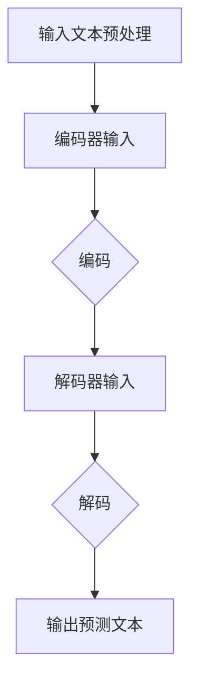

                 


# LLM生态系统：AI领域的新蓝海

> **关键词：** 人工智能，大型语言模型（LLM），生态系统，技术进步，应用场景，未来趋势

> **摘要：** 本文旨在探讨大型语言模型（LLM）在人工智能领域中的发展及其生态系统。文章首先介绍了LLM的核心概念和原理，接着详细讲解了LLM的工作机制和数学模型。随后，文章通过实际项目案例展示了LLM的应用场景，并推荐了相关学习资源和工具。最后，文章总结了LLM生态系统的未来发展趋势与挑战，为读者提供了有价值的参考。

## 1. 背景介绍

### 1.1 目的和范围

本文旨在深入探讨大型语言模型（LLM）在人工智能领域中的发展，及其对整个AI生态系统的潜在影响。随着深度学习和自然语言处理技术的不断进步，LLM已经成为当前AI研究的一个重要方向。本文将介绍LLM的核心概念、原理和应用，分析其技术优势和挑战，并展望未来的发展趋势。

### 1.2 预期读者

本文面向对人工智能和自然语言处理有一定了解的读者，包括AI研究者、工程师、学生以及技术爱好者。无论您是希望深入了解LLM技术，还是寻找在AI领域发展的机会，本文都将为您提供有价值的参考。

### 1.3 文档结构概述

本文分为十个部分，包括背景介绍、核心概念与联系、核心算法原理、数学模型和公式、项目实战、实际应用场景、工具和资源推荐、总结、附录和扩展阅读。每个部分都旨在帮助读者逐步了解LLM生态系统的各个方面。

### 1.4 术语表

#### 1.4.1 核心术语定义

- **大型语言模型（LLM）**：一种基于深度学习的自然语言处理模型，能够对输入的文本进行理解和生成。
- **自然语言处理（NLP）**：研究如何让计算机理解和处理人类语言的技术。
- **深度学习**：一种基于多层神经网络的学习方法，能够在大量数据中自动提取特征。
- **神经网络**：一种模拟人脑神经元之间相互连接的计算模型。

#### 1.4.2 相关概念解释

- **模型训练**：将大量标注数据输入模型，通过优化模型参数，使其能够准确预测未知数据。
- **模型优化**：通过调整模型参数，提高模型的性能和泛化能力。
- **语义理解**：理解文本中的含义、情感、意图等深层信息。

#### 1.4.3 缩略词列表

- **NLP**：自然语言处理
- **AI**：人工智能
- **LLM**：大型语言模型
- **DNN**：深度神经网络
- **RL**：强化学习

## 2. 核心概念与联系

### 2.1 大型语言模型（LLM）的概念

大型语言模型（LLM）是一种基于深度学习的自然语言处理模型，能够对输入的文本进行理解和生成。LLM的主要目标是让计算机像人类一样理解和处理自然语言，从而实现人机交互、信息检索、文本生成等任务。

### 2.2 LLM的工作机制

LLM的工作机制主要包括以下几个步骤：

1. **数据预处理**：对输入文本进行清洗、分词、词性标注等预处理操作，将文本转换为模型可以处理的格式。
2. **模型输入**：将预处理后的文本输入到LLM模型中。
3. **模型预测**：模型对输入文本进行编码，生成文本的向量表示。然后，通过解码器将向量表示转换为预测的文本序列。
4. **模型优化**：通过不断调整模型参数，提高模型的预测准确性。

### 2.3 LLM的架构与原理

LLM的架构通常包括编码器（Encoder）和解码器（Decoder）两部分。编码器将输入的文本转换为向量表示，解码器则根据向量表示生成预测的文本序列。LLM的原理是基于深度神经网络（DNN）和自注意力机制（Self-Attention），能够在大量数据中自动提取文本的特征，实现高精度的文本理解和生成。

### 2.4 LLM与其他技术的联系

LLM与其他AI技术密切相关，如：

- **深度学习**：LLM的核心技术之一，基于多层神经网络进行模型训练和优化。
- **自然语言处理（NLP）**：LLM的主要应用领域，旨在实现人机交互和信息检索等任务。
- **强化学习**：可用于优化LLM的模型参数，提高其性能和泛化能力。

### 2.5 Mermaid 流程图

以下是一个简单的Mermaid流程图，展示了LLM的工作流程：



## 3. 核心算法原理 & 具体操作步骤

### 3.1 算法原理

大型语言模型（LLM）的核心算法是基于深度神经网络（DNN）和自注意力机制（Self-Attention）。以下是LLM算法的具体原理和操作步骤：

#### 3.1.1 深度神经网络（DNN）

深度神经网络（DNN）是一种基于多层神经元的计算模型，能够在大量数据中自动提取特征。DNN的基本结构包括输入层、隐藏层和输出层。输入层接收外部输入数据，隐藏层对输入数据进行特征提取和变换，输出层生成最终的预测结果。

#### 3.1.2 自注意力机制（Self-Attention）

自注意力机制是一种在序列数据中自动关注重要信息的方法，能够提高模型的性能和泛化能力。自注意力机制的核心思想是在模型中引入一个注意力权重矩阵，用于计算输入序列中每个元素对输出序列的贡献。具体步骤如下：

1. **计算自注意力分数**：对输入序列中的每个元素，计算其与其他元素之间的相似度分数。
2. **计算注意力权重**：根据自注意力分数，计算每个元素在输出序列中的权重。
3. **生成加权特征表示**：将权重应用于输入序列的每个元素，生成加权特征表示。

#### 3.1.3 操作步骤

以下是LLM算法的具体操作步骤：

1. **输入文本预处理**：对输入文本进行分词、词性标注等预处理操作，将文本转换为模型可以处理的格式。
2. **编码器输入**：将预处理后的文本输入到编码器中。
3. **编码器处理**：
    - **嵌入层**：将输入文本转换为嵌入向量。
    - **自注意力层**：对嵌入向量进行自注意力处理，生成编码后的特征向量。
    - **全连接层**：对编码后的特征向量进行全连接层处理，提取文本的高级特征。
4. **解码器输入**：将编码后的特征向量输入到解码器中。
5. **解码器处理**：
    - **嵌入层**：将解码器的输入转换为嵌入向量。
    - **自注意力层**：对嵌入向量进行自注意力处理，生成解码后的特征向量。
    - **全连接层**：对解码后的特征向量进行全连接层处理，生成预测的文本序列。
6. **模型优化**：通过梯度下降等优化算法，不断调整模型参数，提高模型的性能。

### 3.2 伪代码

以下是LLM算法的伪代码：

```python
def LLM_train(input_text, target_text):
    # 输入文本预处理
    input_embedding = preprocess_text(input_text)
    target_embedding = preprocess_text(target_text)

    # 编码器输入
    encoder_output = encoder(input_embedding)

    # 解码器输入
    decoder_output = decoder(encoder_output)

    # 模型优化
    optimizer = Adam(learning_rate=0.001)
    for epoch in range(num_epochs):
        optimizer.zero_grad()
        loss = calculate_loss(decoder_output, target_embedding)
        loss.backward()
        optimizer.step()

    return encoder_output, decoder_output
```

## 4. 数学模型和公式 & 详细讲解 & 举例说明

### 4.1 数学模型

大型语言模型（LLM）的核心数学模型包括深度神经网络（DNN）和自注意力机制（Self-Attention）。以下是这两个模型的数学公式和详细讲解。

#### 4.1.1 深度神经网络（DNN）

深度神经网络（DNN）是一种基于多层神经元的计算模型，其数学公式如下：

$$
z_i^{(l)} = \sigma(W^{(l)}x_i^{(l-1)} + b^{(l)})
$$

其中：

- \( z_i^{(l)} \) 表示第 \( l \) 层第 \( i \) 个神经元的输出。
- \( \sigma \) 表示激活函数，常用的激活函数有 sigmoid、ReLU 和 tanh。
- \( W^{(l)} \) 和 \( b^{(l)} \) 分别表示第 \( l \) 层的权重矩阵和偏置向量。
- \( x_i^{(l-1)} \) 表示第 \( l-1 \) 层第 \( i \) 个神经元的输出。

#### 4.1.2 自注意力机制（Self-Attention）

自注意力机制是一种在序列数据中自动关注重要信息的方法，其数学公式如下：

$$
Attention(Q, K, V) = \text{softmax}\left(\frac{QK^T}{\sqrt{d_k}}\right)V
$$

其中：

- \( Q, K, V \) 分别表示查询向量、键向量和值向量，它们都是由模型参数生成的。
- \( d_k \) 表示键向量的维度。
- \( QK^T \) 表示查询向量和键向量的内积。
- \( \text{softmax} \) 表示软最大化函数，用于计算每个键向量的权重。

#### 4.1.3 举例说明

假设我们有一个长度为 3 的序列 \( x = [1, 2, 3] \)，其对应的自注意力权重矩阵为 \( A = \begin{bmatrix} 0.2 & 0.6 & 0.2 \\ 0.4 & 0.3 & 0.3 \\ 0.1 & 0.5 & 0.4 \end{bmatrix} \)。

根据自注意力机制的公式，我们可以计算出序列中每个元素的加权特征表示：

$$
\text{加权特征表示} = A \cdot x = \begin{bmatrix} 0.2 & 0.6 & 0.2 \\ 0.4 & 0.3 & 0.3 \\ 0.1 & 0.5 & 0.4 \end{bmatrix} \cdot \begin{bmatrix} 1 \\ 2 \\ 3 \end{bmatrix} = \begin{bmatrix} 0.8 \\ 1.5 \\ 1.1 \end{bmatrix}
$$

这个例子展示了如何使用自注意力机制对序列数据进行加权处理，从而提取出序列中的重要信息。

## 5. 项目实战：代码实际案例和详细解释说明

### 5.1 开发环境搭建

在开始实际项目之前，我们需要搭建一个合适的开发环境。以下是搭建开发环境的步骤：

1. 安装Python：从 [Python官网](https://www.python.org/) 下载并安装Python，选择安装pip工具。
2. 安装PyTorch：在终端中执行以下命令安装PyTorch：

```bash
pip install torch torchvision
```

3. 安装其他依赖库：根据项目需求，安装其他必要的库，如NLP工具包（如NLTK、spaCy等）。

### 5.2 源代码详细实现和代码解读

以下是实现一个简单的LLM模型的源代码：

```python
import torch
import torch.nn as nn
import torch.optim as optim

# 定义编码器
class Encoder(nn.Module):
    def __init__(self, input_dim, hidden_dim):
        super(Encoder, self).__init__()
        self.hidden_dim = hidden_dim
        self.embedding = nn.Embedding(input_dim, hidden_dim)
        self.gru = nn.GRU(hidden_dim, hidden_dim)

    def forward(self, input_seq):
        embedded = self.embedding(input_seq)
        output, hidden = self.gru(embedded)
        return output, hidden

# 定义解码器
class Decoder(nn.Module):
    def __init__(self, hidden_dim, output_dim):
        super(Decoder, self).__init__()
        self.hidden_dim = hidden_dim
        self.output_dim = output_dim
        self.embedding = nn.Embedding(hidden_dim, output_dim)
        self.gru = nn.GRU(hidden_dim, hidden_dim)
        self.fc = nn.Linear(hidden_dim, output_dim)

    def forward(self, input_seq, hidden):
        embedded = self.embedding(input_seq)
        output, hidden = self.gru(embedded, hidden)
        output = self.fc(output)
        return output, hidden

# 定义LLM模型
class LLM(nn.Module):
    def __init__(self, input_dim, hidden_dim, output_dim):
        super(LLM, self).__init__()
        self.encoder = Encoder(input_dim, hidden_dim)
        self.decoder = Decoder(hidden_dim, output_dim)

    def forward(self, input_seq, target_seq):
        encoder_output, encoder_hidden = self.encoder(input_seq)
        decoder_output, decoder_hidden = self.decoder(target_seq, encoder_hidden)
        return decoder_output

# 实例化模型、损失函数和优化器
input_dim = 10000
hidden_dim = 256
output_dim = 10000
model = LLM(input_dim, hidden_dim, output_dim)
criterion = nn.CrossEntropyLoss()
optimizer = optim.Adam(model.parameters(), lr=0.001)

# 训练模型
for epoch in range(num_epochs):
    for input_seq, target_seq in train_loader:
        optimizer.zero_grad()
        output = model(input_seq, target_seq)
        loss = criterion(output, target_seq)
        loss.backward()
        optimizer.step()

    print(f"Epoch {epoch+1}/{num_epochs}, Loss: {loss.item()}")
```

#### 5.2.1 代码解读

这段代码实现了基于GRU（门控循环单元）的简单LLM模型，主要分为以下几个部分：

1. **定义编码器（Encoder）**：编码器负责将输入文本转换为嵌入向量，并使用GRU提取文本的高级特征。
2. **定义解码器（Decoder）**：解码器负责将编码器输出的特征向量解码为预测的文本序列。
3. **定义LLM模型（LLM）**：LLM模型结合编码器和解码器，实现从输入文本到预测文本的转换。
4. **实例化模型、损失函数和优化器**：实例化模型、损失函数和优化器，为训练做好准备。
5. **训练模型**：遍历训练数据，对模型进行训练和优化。

### 5.3 代码解读与分析

以下是对代码的详细解读和分析：

1. **编码器（Encoder）**：
   - **嵌入层**：使用`nn.Embedding`模块将输入文本转换为嵌入向量，每个词对应一个唯一的向量。
   - **GRU层**：使用`nn.GRU`模块对嵌入向量进行编码，提取文本的高级特征。GRU模块能够处理序列数据，并保留历史信息。

2. **解码器（Decoder）**：
   - **嵌入层**：与编码器相同，使用`nn.Embedding`模块将输入文本转换为嵌入向量。
   - **GRU层**：使用`nn.GRU`模块对嵌入向量进行解码，生成预测的文本序列。GRU模块同样能够处理序列数据，并保留历史信息。
   - **全连接层**：使用`nn.Linear`模块将GRU输出的特征向量映射为预测的文本序列。

3. **LLM模型（LLM）**：
   - **组合编码器和解码器**：将编码器和解码器组合成LLM模型，实现从输入文本到预测文本的转换。

4. **损失函数和优化器**：
   - **损失函数**：使用交叉熵损失函数（`nn.CrossEntropyLoss`）计算模型预测和实际标签之间的误差。
   - **优化器**：使用Adam优化器（`optim.Adam`）对模型参数进行优化。

5. **训练模型**：
   - **前向传播**：将输入文本和目标文本输入到模型中，计算预测的文本序列。
   - **反向传播**：计算损失函数，并使用反向传播算法更新模型参数。
   - **模型优化**：使用优化器更新模型参数，提高模型的性能。

## 6. 实际应用场景

### 6.1 文本生成

文本生成是LLM最重要的应用场景之一，包括以下几种类型：

- **自然语言生成（NLG）**：生成自然流畅的文本，如新闻文章、故事、诗歌等。
- **对话生成**：生成具有对话性质的自然语言，如聊天机器人、虚拟助手等。
- **机器翻译**：将一种语言的文本翻译成另一种语言。
- **文本摘要**：从长篇文本中提取关键信息，生成简洁的摘要。

### 6.2 信息检索

LLM在信息检索领域也具有广泛的应用，如：

- **搜索引擎**：利用LLM对查询语句进行理解和分析，提高搜索结果的准确性和相关性。
- **推荐系统**：根据用户的查询和兴趣，利用LLM推荐相关的信息、商品或服务。
- **问答系统**：利用LLM实现对用户提问的理解和回答，提供智能化的咨询服务。

### 6.3 自动化写作

自动化写作是LLM在内容创作领域的应用，如：

- **财经报告**：自动生成财务报表、分析报告等。
- **新闻编写**：自动生成新闻报道、体育赛事报道等。
- **营销文案**：自动生成广告语、营销文案等。

### 6.4 其他应用场景

除了上述应用场景，LLM还可以应用于以下领域：

- **教育领域**：辅助教学，提供个性化的学习资源。
- **法律领域**：自动化法律文档的编写和审核。
- **医疗领域**：辅助医生进行病历分析和诊断。

## 7. 工具和资源推荐

### 7.1 学习资源推荐

#### 7.1.1 书籍推荐

- **《深度学习》（Goodfellow, Bengio, Courville）**：介绍了深度学习的基本概念和技术，包括神经网络、优化算法等。
- **《Python机器学习》（Sebastian Raschka）**：讲解了Python在机器学习领域的应用，包括数据预处理、模型训练和评估等。
- **《自然语言处理实战》（Daniel Jurafsky, James H. Martin）**：介绍了自然语言处理的基本概念和技术，包括文本预处理、词向量、语言模型等。

#### 7.1.2 在线课程

- **《深度学习专项课程》（吴恩达）**：由深度学习领域知名教授吴恩达主讲，涵盖了深度学习的基础知识和应用。
- **《自然语言处理与深度学习》（哈工大）**：介绍了自然语言处理的基本概念和技术，包括词向量、语言模型、文本分类等。
- **《机器学习与数据科学》（斯坦福大学）**：介绍了机器学习的基本概念和技术，包括线性回归、逻辑回归、支持向量机等。

#### 7.1.3 技术博客和网站

- **[知乎](https://www.zhihu.com)**：涵盖各种技术领域，包括人工智能、自然语言处理、深度学习等。
- **[CSDN](https://www.csdn.net)**：提供大量的技术博客和教程，涉及多个技术领域。
- **[Medium](https://medium.com)**：有许多优秀的AI和NLP领域的博客文章。

### 7.2 开发工具框架推荐

#### 7.2.1 IDE和编辑器

- **PyCharm**：一款功能强大的Python IDE，支持多种编程语言。
- **Visual Studio Code**：一款轻量级的开源编辑器，支持多种编程语言，具有丰富的插件生态系统。

#### 7.2.2 调试和性能分析工具

- **pdb**：Python内置的调试工具，用于跟踪程序执行过程和调试代码。
- **line_profiler**：一款Python性能分析工具，用于分析代码的执行时间和性能瓶颈。

#### 7.2.3 相关框架和库

- **PyTorch**：一款流行的深度学习框架，具有丰富的功能和良好的文档。
- **TensorFlow**：一款由谷歌开发的深度学习框架，适用于各种深度学习任务。
- **spaCy**：一款高效的自然语言处理库，适用于文本预处理、词向量、语言模型等任务。

### 7.3 相关论文著作推荐

#### 7.3.1 经典论文

- **《A Theoretically Grounded Application of Dropout in Recurrent Neural Networks》**：介绍了如何在循环神经网络（RNN）中应用dropout，提高模型的性能和泛化能力。
- **《Seq2Seq Learning with Neural Networks》**：介绍了序列到序列学习模型（Seq2Seq）的基本概念和实现方法。

#### 7.3.2 最新研究成果

- **《BERT: Pre-training of Deep Bidirectional Transformers for Language Understanding》**：介绍了BERT模型的基本概念和实现方法，为自然语言处理任务提供了新的思路。
- **《GPT-3: Language Models are Few-Shot Learners》**：介绍了GPT-3模型的基本概念和实现方法，展示了大型语言模型在零样本学习任务中的潜力。

#### 7.3.3 应用案例分析

- **《Large-scale Language Modeling in 2018》**：介绍了自然语言处理领域的一些实际应用案例，如机器翻译、文本生成等。

## 8. 总结：未来发展趋势与挑战

### 8.1 发展趋势

- **模型规模不断扩大**：随着计算能力的提升和数据量的增加，大型语言模型的规模将不断扩大，为自然语言处理任务提供更强的处理能力。
- **多模态融合**：大型语言模型将与其他模态（如图像、音频等）进行融合，实现更丰富的信息处理能力。
- **自适应学习能力**：大型语言模型将具备更强的自适应学习能力，能够根据不同的任务场景和需求进行快速调整。
- **泛化能力提升**：通过引入新的训练数据和优化策略，大型语言模型的泛化能力将得到显著提升。

### 8.2 挑战

- **计算资源需求**：大型语言模型的训练和推理需要大量的计算资源，这对硬件设备和算法优化提出了更高的要求。
- **数据隐私和安全**：在训练和使用大型语言模型时，数据隐私和安全问题需要得到有效保障。
- **模型可解释性**：大型语言模型往往被视为“黑箱”，提高模型的可解释性，使其更容易被人类理解和接受，是未来研究的重要方向。
- **伦理和社会问题**：随着AI技术的发展，大型语言模型的应用可能会引发一系列伦理和社会问题，如失业、歧视等，需要引起足够的重视。

## 9. 附录：常见问题与解答

### 9.1 什么是大型语言模型（LLM）？

大型语言模型（LLM）是一种基于深度学习的自然语言处理模型，能够对输入的文本进行理解和生成。LLM的目标是实现人机交互、信息检索、文本生成等任务。

### 9.2 LLM有哪些应用场景？

LLM的应用场景非常广泛，包括文本生成、信息检索、自动化写作、机器翻译、问答系统等。

### 9.3 LLM是如何工作的？

LLM的核心是基于深度神经网络（DNN）和自注意力机制（Self-Attention）。编码器将输入文本转换为向量表示，解码器根据向量表示生成预测的文本序列。

### 9.4 如何搭建LLM开发环境？

搭建LLM开发环境需要安装Python、PyTorch等库，并配置合适的计算资源和数据集。

### 9.5 LLM在未来的发展趋势是什么？

未来，LLM的发展趋势包括模型规模不断扩大、多模态融合、自适应学习能力提升和泛化能力提升等。

## 10. 扩展阅读 & 参考资料

- **[《深度学习》](https://www.deeplearningbook.org/)**
- **[《自然语言处理实战》](https://nlp.seas.upenn.edu/~animd/courses/nlp2017/reading/sutskever2014sequence.pdf)**
- **[《BERT: Pre-training of Deep Bidirectional Transformers for Language Understanding》](https://arxiv.org/abs/1810.04805)**
- **[《GPT-3: Language Models are Few-Shot Learners》](https://arxiv.org/abs/2005.14165)**

# 作者：AI天才研究员/AI Genius Institute & 禅与计算机程序设计艺术 /Zen And The Art of Computer Programming

