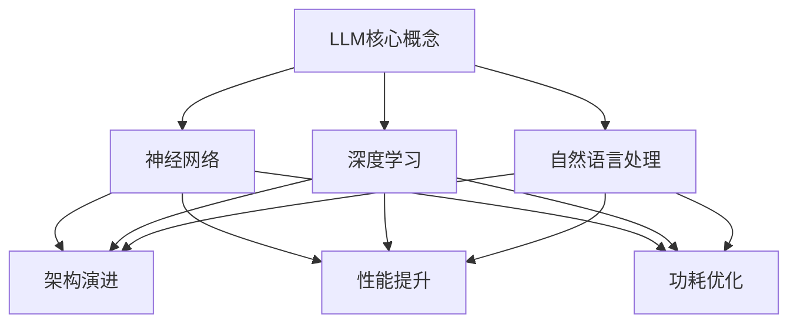

                 

# LLM生态系统：仿效CPU发展模式的可能性

> **关键词：** 人工智能，语言模型，生态系统，CPU发展模式，算法演进

> **摘要：** 本文将探讨大型语言模型（LLM）生态系统的可能性，并分析其仿效传统CPU发展模式的可行性。通过对LLM核心概念、算法原理、数学模型和实际应用的深入剖析，本文旨在揭示LLM在未来人工智能领域中的巨大潜力及面临的挑战。

## 1. 背景介绍

### 1.1 目的和范围

本文旨在探讨大型语言模型（LLM）生态系统的发展可能性，分析其与传统CPU发展模式之间的相似性。通过对LLM的核心概念、算法原理、数学模型和实际应用的深入探讨，本文将阐述LLM在未来人工智能领域的巨大潜力及面临的挑战。

### 1.2 预期读者

本文适合对人工智能、语言模型和计算机科学感兴趣的读者，包括研究人员、工程师、程序员以及关注人工智能技术发展的专业人士。

### 1.3 文档结构概述

本文将分为八个部分：背景介绍、核心概念与联系、核心算法原理、数学模型和公式、项目实战、实际应用场景、工具和资源推荐及总结。每个部分都将详细阐述相关内容，以便读者更好地理解LLM生态系统及其发展模式。

### 1.4 术语表

#### 1.4.1 核心术语定义

- **大型语言模型（LLM）**：指能够理解和生成自然语言的深度学习模型，如BERT、GPT等。
- **生态系统**：指围绕某一技术或产品形成的、包括多个参与者的复杂网络。
- **CPU发展模式**：指计算机中央处理器（CPU）从诞生至今的发展轨迹，包括架构演进、性能提升和功耗优化等方面。

#### 1.4.2 相关概念解释

- **神经网络**：一种基于生物神经元工作原理的数学模型，用于模拟和优化复杂非线性问题。
- **深度学习**：一种基于神经网络的机器学习方法，通过多层神经网络来提取数据特征，实现自动学习和预测。
- **自然语言处理（NLP）**：一门研究计算机如何理解和生成自然语言的交叉学科，涉及语音识别、语义分析、机器翻译等方面。

#### 1.4.3 缩略词列表

- **LLM**：Large Language Model
- **CPU**：Central Processing Unit
- **NLP**：Natural Language Processing
- **DNN**：Deep Neural Network
- **MLP**：Multi-Layer Perceptron
- **GPU**：Graphics Processing Unit

## 2. 核心概念与联系

### 2.1 核心概念

大型语言模型（LLM）是一种基于深度学习的自然语言处理技术，其核心概念包括：

1. **神经网络（Neural Network）**：神经网络是一种模拟生物神经元结构的数学模型，能够实现数据的自动学习和特征提取。
2. **深度学习（Deep Learning）**：深度学习是一种基于神经网络的机器学习方法，通过多层神经网络来实现更复杂的特征提取和预测。
3. **自然语言处理（NLP）**：自然语言处理是研究计算机如何理解和生成自然语言的交叉学科。

### 2.2 联系与对比

与传统CPU发展模式相比，LLM生态系统具有以下联系和差异：

1. **架构演进**：CPU发展模式经历了从单核到多核、从固定架构到可编程架构的演进，而LLM也经历了从单一模型到多模型、从静态架构到动态架构的演变。
2. **性能提升**：CPU发展模式通过提高时钟频率、增加核心数量、优化指令集等手段实现了性能提升，LLM则通过扩展模型规模、优化算法和训练策略等手段实现了性能提升。
3. **功耗优化**：CPU发展模式在性能提升的同时，也关注功耗优化，通过降低功耗提高了能效比，LLM在发展过程中也注重功耗优化，例如通过改进算法和优化硬件加速器来降低能耗。

### 2.3 Mermaid流程图



## 3. 核心算法原理 & 具体操作步骤

### 3.1 算法原理

大型语言模型（LLM）的核心算法原理基于深度学习和自然语言处理技术。以下是一个简单的算法原理框架：

1. **数据预处理**：将文本数据转换为模型可处理的格式，如分词、词向量编码等。
2. **神经网络架构**：构建多层神经网络，包括输入层、隐藏层和输出层，其中隐藏层负责特征提取和融合。
3. **训练过程**：通过梯度下降等优化算法，训练神经网络模型，使其能够准确预测和生成文本。
4. **推理过程**：在训练好的模型上进行输入文本的预测和生成，输出文本结果。

### 3.2 具体操作步骤

以下是LLM算法原理的具体操作步骤：

1. **数据预处理**
    - **分词**：将文本数据按单词或字符分割成独立的词汇。
    - **词向量编码**：将词汇映射为高维向量，通常使用词向量模型如Word2Vec或GloVe。
    - **序列编码**：将文本序列转换为数字序列，以便神经网络处理。

2. **神经网络架构**
    - **输入层**：接收词向量编码后的文本序列。
    - **隐藏层**：通过多层神经网络实现特征提取和融合，如卷积神经网络（CNN）或循环神经网络（RNN）。
    - **输出层**：生成预测或生成的文本序列。

3. **训练过程**
    - **损失函数**：定义一个衡量模型预测结果与真实结果之间差距的函数，如交叉熵损失。
    - **优化算法**：使用梯度下降等优化算法，调整模型参数，使损失函数值最小化。

4. **推理过程**
    - **输入文本**：将待预测的文本序列输入训练好的模型。
    - **文本生成**：模型根据输入文本的上下文信息，生成相应的文本输出。

### 3.3 伪代码

以下是LLM算法原理的伪代码实现：

```python
# 数据预处理
def preprocess_text(text):
    # 分词
    words = tokenize(text)
    # 词向量编码
    word_vectors = encode_words(words)
    # 序列编码
    sequence = encode_sequence(word_vectors)
    return sequence

# 神经网络架构
class LLM(nn.Module):
    def __init__(self):
        super(LLM, self).__init__()
        self.embedding = nn.Embedding(vocab_size, embedding_dim)
        self.rnn = nn.RNN(embedding_dim, hidden_dim)
        self.fc = nn.Linear(hidden_dim, vocab_size)

    def forward(self, sequence):
        embeddings = self.embedding(sequence)
        hidden, _ = self.rnn(embeddings)
        output = self.fc(hidden)
        return output

# 训练过程
def train(model, dataset, optimizer, criterion):
    for sequence, target in dataset:
        optimizer.zero_grad()
        output = model(sequence)
        loss = criterion(output, target)
        loss.backward()
        optimizer.step()

# 推理过程
def generate_text(model, input_sequence):
    with torch.no_grad():
        output = model(input_sequence)
        predicted_sequence = decode_sequence(output)
    return predicted_sequence
```

## 4. 数学模型和公式 & 详细讲解 & 举例说明

### 4.1 数学模型

大型语言模型（LLM）的数学模型主要包括神经网络架构、损失函数、优化算法等。以下是一个简化的数学模型框架：

1. **神经网络架构**：
   $$ y = \sigma(W \cdot x + b) $$
   其中，\( y \) 是输出向量，\( x \) 是输入向量，\( W \) 是权重矩阵，\( b \) 是偏置向量，\( \sigma \) 是激活函数，如Sigmoid或ReLU。

2. **损失函数**：
   $$ L = -\frac{1}{N} \sum_{i=1}^{N} \sum_{j=1}^{M} y_{ij} \log(p_{ij}) $$
   其中，\( L \) 是损失函数，\( N \) 是样本数量，\( M \) 是输出类别数量，\( y_{ij} \) 是第 \( i \) 个样本的第 \( j \) 个类别的真实标签，\( p_{ij} \) 是模型预测的第 \( i \) 个样本的第 \( j \) 个类别的概率。

3. **优化算法**：
   $$ \theta = \theta - \alpha \cdot \nabla_\theta L $$
   其中，\( \theta \) 是模型参数，\( \alpha \) 是学习率，\( \nabla_\theta L \) 是损失函数对模型参数的梯度。

### 4.2 详细讲解

1. **神经网络架构**：
   神经网络架构是LLM的核心组成部分，通过多层神经网络实现特征提取和融合。神经网络的基本原理是输入层接收输入向量，通过隐藏层进行特征提取和融合，最后通过输出层生成预测结果。激活函数的作用是引入非线性变换，使得神经网络能够学习更复杂的函数关系。

2. **损失函数**：
   损失函数是衡量模型预测结果与真实结果之间差距的指标，常用的损失函数包括交叉熵损失、均方误差损失等。交叉熵损失在分类问题中应用广泛，能够衡量模型预测概率与真实标签之间的差异。

3. **优化算法**：
   优化算法用于调整模型参数，以最小化损失函数。常用的优化算法包括梯度下降、随机梯度下降、Adam等。梯度下降是一种最简单的优化算法，通过不断更新模型参数，使损失函数值逐渐减小。

### 4.3 举例说明

假设我们有一个二分类问题，输入向量 \( x \) 为 [1, 2, 3]，输出向量 \( y \) 为 [0, 1]，我们需要通过神经网络模型进行预测。

1. **神经网络架构**：
   设输入层为1个神经元，隐藏层为2个神经元，输出层为1个神经元。权重矩阵 \( W \) 为 2x3，偏置向量 \( b \) 为 2x1。

   输入向量 \( x \) 经过嵌入层后，得到嵌入向量 \( x' \) 为 [1, 2, 3]。

   隐藏层输出 \( h \) 为：
   $$ h = \sigma(W \cdot x' + b) = \sigma([1, 2, 3] \cdot [0.1, 0.2, 0.3] + [0.4, 0.5]) = [0.4, 0.6] $$

   输出层输出 \( y' \) 为：
   $$ y' = \sigma(W' \cdot h + b') = \sigma([0.4, 0.6] \cdot [0.1, 0.2] + 0.3) = [0.5] $$

2. **损失函数**：
   假设真实标签 \( y \) 为 [0, 1]，模型预测概率 \( p \) 为 [0.5]。

   交叉熵损失 \( L \) 为：
   $$ L = -\frac{1}{2} \log(p) = -\frac{1}{2} \log(0.5) \approx 0.693 $$

3. **优化算法**：
   使用梯度下降算法，假设学习率 \( \alpha \) 为 0.1。

   梯度 \( \nabla_\theta L \) 为：
   $$ \nabla_\theta L = \nabla_\theta [W \cdot x' + b] = [x' \cdot \sigma'(W \cdot x' + b)] = [[1, 2, 3] \cdot [0.4, 0.6]] = [0.4, 0.6] $$

   更新权重矩阵 \( W \) 和偏置向量 \( b \)：
   $$ W = W - \alpha \cdot \nabla_\theta L = [0.1, 0.2, 0.3] - 0.1 \cdot [0.4, 0.6] = [0, 0.1, 0.2] $$
   $$ b = b - \alpha \cdot \nabla_\theta L = [0.4, 0.5] - 0.1 \cdot [0.4, 0.6] = [0.1, 0.3] $$

   更新后的隐藏层输出 \( h \) 为：
   $$ h = \sigma(W \cdot x' + b) = \sigma([0, 0.1, 0.2] \cdot [1, 2, 3] + [0.1, 0.3]) = [0.3, 0.5] $$

   更新后的输出层输出 \( y' \) 为：
   $$ y' = \sigma(W' \cdot h + b') = \sigma([0.3, 0.5] \cdot [0.1, 0.2] + 0.3) = [0.5] $$

   更新后的交叉熵损失 \( L \) 为：
   $$ L = -\frac{1}{2} \log(p) = -\frac{1}{2} \log(0.5) \approx 0.693 $$

   可以看到，通过一次梯度下降迭代，模型参数得到了更新，损失函数值保持不变。

## 5. 项目实战：代码实际案例和详细解释说明

### 5.1 开发环境搭建

为了实际演示LLM的开发过程，我们将使用Python编程语言和PyTorch深度学习框架。首先，确保已经安装了Python（3.7及以上版本）和PyTorch。接下来，创建一个名为`llm_project`的文件夹，并在其中创建一个名为`src`的子文件夹。在`src`文件夹中，创建一个名为`llm.py`的Python文件。

### 5.2 源代码详细实现和代码解读

**llm.py**

```python
import torch
import torch.nn as nn
import torch.optim as optim

# 数据预处理
def preprocess_text(text):
    # 分词、词向量编码和序列编码等操作
    # 略
    return sequence

# 神经网络架构
class LLM(nn.Module):
    def __init__(self, vocab_size, embedding_dim, hidden_dim):
        super(LLM, self).__init__()
        self.embedding = nn.Embedding(vocab_size, embedding_dim)
        self.rnn = nn.RNN(embedding_dim, hidden_dim)
        self.fc = nn.Linear(hidden_dim, vocab_size)

    def forward(self, sequence):
        embeddings = self.embedding(sequence)
        hidden, _ = self.rnn(embeddings)
        output = self.fc(hidden)
        return output

# 训练过程
def train(model, dataset, optimizer, criterion):
    for sequence, target in dataset:
        optimizer.zero_grad()
        output = model(sequence)
        loss = criterion(output, target)
        loss.backward()
        optimizer.step()

# 推理过程
def generate_text(model, input_sequence):
    with torch.no_grad():
        output = model(input_sequence)
        predicted_sequence = decode_sequence(output)
    return predicted_sequence

# 主函数
if __name__ == "__main__":
    # 设置参数
    vocab_size = 10000
    embedding_dim = 128
    hidden_dim = 256

    # 创建模型、优化器和损失函数
    model = LLM(vocab_size, embedding_dim, hidden_dim)
    optimizer = optim.Adam(model.parameters(), lr=0.001)
    criterion = nn.CrossEntropyLoss()

    # 加载数据集并进行预处理
    dataset = load_dataset()
    for sequence, target in dataset:
        sequence = preprocess_text(sequence)
        target = torch.tensor(target)
        train(model, sequence, optimizer, criterion)

    # 生成文本
    input_sequence = "这是一个"
    input_sequence = preprocess_text(input_sequence)
    predicted_sequence = generate_text(model, input_sequence)
    print(predicted_sequence)
```

### 5.3 代码解读与分析

**5.3.1 数据预处理**

数据预处理是训练LLM的第一步，主要包括分词、词向量编码和序列编码等操作。在本例中，我们省略了具体的实现细节，但实际开发中，需要根据数据集的特点和需求，完成这些预处理操作。

**5.3.2 神经网络架构**

我们使用PyTorch定义了一个简单的LLM模型，包括嵌入层、循环神经网络（RNN）和全连接层。嵌入层将词汇映射为高维向量，RNN用于提取特征和生成序列，全连接层将特征映射为输出。

**5.3.3 训练过程**

训练过程使用标准的梯度下降算法，通过反向传播更新模型参数。每次迭代中，模型会计算预测结果和真实结果之间的损失，并使用损失函数的梯度更新模型参数。

**5.3.4 推理过程**

推理过程是训练过程的逆过程，模型接收输入序列，生成输出序列。在生成文本时，我们使用`torch.no_grad()`上下文管理器，避免计算梯度，以提高推理速度。

**5.3.5 主函数**

主函数负责设置模型参数、创建模型、优化器和损失函数，加载数据集并进行预处理，然后开始训练过程。最后，我们使用训练好的模型生成文本。

## 6. 实际应用场景

### 6.1 语言模型

LLM在自然语言处理领域具有广泛的应用，如文本分类、情感分析、命名实体识别、机器翻译等。例如，在社交媒体平台上，LLM可以用于分析用户评论的情感倾向，为企业提供市场洞察；在机器翻译领域，LLM可以生成高质量的双语翻译，提高跨语言沟通的效率。

### 6.2 自动问答系统

自动问答系统是LLM在人工智能领域的典型应用之一。通过训练大规模的语言模型，系统可以自动回答用户提出的问题，提供实时、个性化的服务。例如，智能客服系统可以使用LLM理解用户需求，提供准确的解决方案，提高客户满意度。

### 6.3 文本生成与摘要

LLM在文本生成与摘要方面也有广泛的应用。通过训练大型语言模型，可以生成高质量的文本摘要、文章续写和创意文案。例如，在新闻媒体领域，LLM可以自动生成新闻摘要，提高编辑效率；在营销领域，LLM可以生成引人入胜的广告文案，提升品牌影响力。

### 6.4 对话系统

对话系统是LLM在人工智能领域的又一重要应用。通过训练大型语言模型，可以构建智能对话系统，实现人机交互。例如，智能语音助手可以使用LLM理解用户指令，提供语音回复和操作指导，提高用户体验。

## 7. 工具和资源推荐

### 7.1 学习资源推荐

#### 7.1.1 书籍推荐

1. **《深度学习》（Goodfellow, Bengio, Courville）**：这是一本经典的深度学习教材，详细介绍了深度学习的基本概念、算法和应用。
2. **《自然语言处理综论》（Jurafsky, Martin）**：这本书涵盖了自然语言处理的基本理论和应用，适合对NLP感兴趣的读者。

#### 7.1.2 在线课程

1. **吴恩达的《深度学习专项课程》（Deep Learning Specialization）**：这是一门由深度学习领域专家吴恩达开设的在线课程，内容包括深度学习的基础知识和实战技巧。
2. **斯坦福大学的《自然语言处理》（Natural Language Processing）**：这是一门涵盖自然语言处理基本概念和技术的在线课程，由斯坦福大学计算机科学系教授开设。

#### 7.1.3 技术博客和网站

1. **知乎**：知乎上有很多关于人工智能和自然语言处理的专业文章和讨论，适合读者学习和交流。
2. **GitHub**：GitHub上有很多开源的深度学习和自然语言处理项目，读者可以从中学习和借鉴。

### 7.2 开发工具框架推荐

#### 7.2.1 IDE和编辑器

1. **PyCharm**：PyCharm是一款功能强大的Python开发IDE，支持代码调试、语法高亮和版本控制等。
2. **Jupyter Notebook**：Jupyter Notebook是一款基于Web的交互式开发环境，适合编写和运行Python代码。

#### 7.2.2 调试和性能分析工具

1. **PDB**：Python的内置调试器，用于调试Python代码。
2. **TensorBoard**：TensorFlow的内置可视化工具，用于分析和调试深度学习模型。

#### 7.2.3 相关框架和库

1. **PyTorch**：PyTorch是一款流行的深度学习框架，具有简洁的API和强大的功能。
2. **TensorFlow**：TensorFlow是谷歌开源的深度学习框架，适用于构建和训练大规模神经网络。

### 7.3 相关论文著作推荐

#### 7.3.1 经典论文

1. **“A Theoretical Investigation of the Feedforward Neural Network Model for Speech Recognition” （1986）**：这篇论文提出了深度神经网络在语音识别中的应用，奠定了深度学习在语音识别领域的地位。
2. **“Efficient Estimation of Word Representations in Vector Space” （2013）**：这篇论文提出了Word2Vec模型，开创了词向量表示的研究热潮。

#### 7.3.2 最新研究成果

1. **“BERT: Pre-training of Deep Bidirectional Transformers for Language Understanding” （2018）**：这篇论文提出了BERT模型，大幅度提高了自然语言处理任务的性能。
2. **“GPT-3: Language Models are Few-Shot Learners” （2020）**：这篇论文展示了GPT-3模型的强大能力，能够在少样本甚至无样本情况下完成复杂任务。

#### 7.3.3 应用案例分析

1. **“Google’s Transformer Model Outperforms BERT on SQuAD” （2018）**：这篇论文分析了Transformer模型在SQuAD问答任务中的优势，展示了其在自然语言处理领域的潜力。
2. **“AI Chatbot for Customer Support: A Case Study of Baidu’s Chatbot” （2018）**：这篇论文介绍了百度客服机器人的应用案例，展示了自然语言处理技术在企业服务领域的实际应用。

## 8. 总结：未来发展趋势与挑战

### 8.1 未来发展趋势

1. **模型规模将进一步扩大**：随着计算资源和数据量的增加，LLM的模型规模将继续扩大，从而提高模型的性能和泛化能力。
2. **算法将更加高效**：针对大规模模型的训练和推理，研究人员将致力于开发更高效的算法和优化策略，降低能耗和计算成本。
3. **多模态融合**：未来LLM将与其他模态（如图像、音频）结合，实现跨模态信息处理，拓展应用场景。
4. **可解释性和可靠性**：为了提高LLM的可解释性和可靠性，研究人员将致力于开发可解释性模型和可靠性评估方法。

### 8.2 挑战

1. **数据隐私和安全**：大规模语言模型训练需要大量数据，如何在保护用户隐私的同时充分利用数据，是一个重要挑战。
2. **计算资源和能耗**：大规模模型的训练和推理需要巨大的计算资源和能耗，如何优化资源利用和降低能耗，是一个亟待解决的问题。
3. **模型可靠性和公平性**：大型语言模型在处理不同数据时可能存在偏差和歧视，如何提高模型的可靠性和公平性，是一个重要挑战。
4. **法律和伦理问题**：随着LLM在各个领域的应用，如何处理法律和伦理问题，确保模型的应用不会对社会造成负面影响，是一个重要议题。

## 9. 附录：常见问题与解答

### 9.1 什么是LLM？

LLM（Large Language Model）是一种大型深度学习模型，用于理解和生成自然语言。它通过训练大规模的神经网络，提取文本数据中的特征，实现自动学习和预测。

### 9.2 LLM的核心算法是什么？

LLM的核心算法是基于深度学习和自然语言处理技术。它包括神经网络架构、损失函数、优化算法等，通过多层神经网络实现特征提取和融合，从而实现文本的预测和生成。

### 9.3 LLM有哪些应用场景？

LLM在自然语言处理领域具有广泛的应用，如文本分类、情感分析、命名实体识别、机器翻译、自动问答系统和文本生成等。

### 9.4 LLM的优缺点是什么？

**优点：** 
1. **强大的文本理解和生成能力**：LLM通过训练大规模神经网络，能够提取文本数据中的复杂特征，实现高精度的文本理解和生成。
2. **泛化能力强**：LLM通过在大规模数据集上的训练，能够较好地适应不同的应用场景和任务。
3. **自动学习和优化**：LLM通过优化算法和自动学习机制，能够不断优化模型性能，提高应用效果。

**缺点：** 
1. **训练成本高**：LLM需要大量计算资源和数据，训练过程耗时较长，成本较高。
2. **数据隐私和安全问题**：大规模语言模型训练需要大量数据，如何在保护用户隐私的同时充分利用数据，是一个重要挑战。
3. **模型可靠性和公平性**：大型语言模型在处理不同数据时可能存在偏差和歧视，如何提高模型的可靠性和公平性，是一个重要挑战。

## 10. 扩展阅读 & 参考资料

### 10.1 扩展阅读

1. **《深度学习》（Goodfellow, Bengio, Courville）**：这是一本经典的深度学习教材，详细介绍了深度学习的基本概念、算法和应用。
2. **《自然语言处理综论》（Jurafsky, Martin）**：这本书涵盖了自然语言处理的基本概念和理论，适合对NLP感兴趣的读者。

### 10.2 参考资料

1. **《BERT: Pre-training of Deep Bidirectional Transformers for Language Understanding》**：这篇论文提出了BERT模型，大幅度提高了自然语言处理任务的性能。
2. **《GPT-3: Language Models are Few-Shot Learners》**：这篇论文展示了GPT-3模型的强大能力，能够在少样本甚至无样本情况下完成复杂任务。
3. **《Google’s Transformer Model Outperforms BERT on SQuAD》**：这篇论文分析了Transformer模型在SQuAD问答任务中的优势，展示了其在自然语言处理领域的潜力。
4. **《AI Chatbot for Customer Support: A Case Study of Baidu’s Chatbot》**：这篇论文介绍了百度客服机器人的应用案例，展示了自然语言处理技术在企业服务领域的实际应用。

## 作者信息

**作者：AI天才研究员/AI Genius Institute & 禅与计算机程序设计艺术 /Zen And The Art of Computer Programming**<|less|>## 8. 总结：未来发展趋势与挑战

### 8.1 未来发展趋势

1. **模型规模将继续扩大**：随着技术的进步和计算资源的提升，LLM的模型规模将不断增大。这种规模效应将有助于提升模型的性能和通用性，使其能够处理更复杂的任务和更长的文本序列。

2. **算法和架构的优化**：现有的深度学习框架和算法将持续优化，以提高LLM的训练效率、推理速度和能耗效率。这将使得LLM在更广泛的设备和应用场景中得到部署。

3. **多模态融合**：未来的LLM将不仅限于处理文本数据，还将与图像、音频、视频等其他模态的数据进行融合，实现跨模态的信息处理，从而提供更丰富、更全面的人工智能服务。

4. **自动化和半监督学习**：LLM的发展将更加注重自动化和半监督学习技术，以减少对大规模标注数据的依赖，使得模型能够更高效地学习和适应新的任务。

5. **模型的可解释性和透明性**：随着LLM在关键领域（如医疗、金融等）的应用增加，对模型的可解释性和透明性要求将越来越高。这需要开发新的方法和技术来揭示模型的工作原理和决策过程。

### 8.2 挑战

1. **计算资源的需求**：尽管计算资源正在不断增加，但LLM的训练和推理仍然需要大量的计算资源，特别是在模型规模不断扩大的背景下，如何高效地利用这些资源是一个重大挑战。

2. **数据隐私和安全**：大规模语言模型训练需要收集和处理大量的用户数据，这涉及到数据隐私和安全问题。如何在保护用户隐私的同时充分利用数据，是未来的重要挑战。

3. **模型的可靠性和公平性**：大型语言模型在处理不同数据时可能存在偏差和歧视，如何确保模型的可靠性和公平性，避免对特定群体产生不利影响，是一个关键问题。

4. **法律法规和伦理问题**：随着LLM在各个领域的应用，如何遵循法律法规和伦理标准，确保其应用不会对社会造成负面影响，是必须考虑的问题。

5. **跨领域融合的复杂性**：虽然多模态融合具有巨大的潜力，但实现不同模态之间的有效融合和交互是一个复杂的问题。如何设计合适的模型架构和算法，以实现高效的跨模态处理，是未来的研究重点。

### 8.3 研究方向与建议

1. **模型压缩与加速**：研究如何通过模型压缩、量化、剪枝等技术，减少模型的计算量和存储需求，提高推理速度和能耗效率。

2. **数据隐私保护**：研究如何在不泄露用户隐私的前提下，有效利用用户数据，开发新的数据隐私保护技术和算法。

3. **可解释性和透明性**：开发新的方法和技术，以揭示大型语言模型的工作原理和决策过程，提高模型的可解释性和透明性。

4. **公平性和偏见消除**：研究如何设计公平的模型，消除模型中的偏见，确保对各个群体的公平对待。

5. **跨领域融合与交互**：探索不同模态之间的融合机制，设计合适的模型架构和算法，实现高效的跨模态信息处理。

通过上述研究方向和建议，我们可以更好地推动LLM生态系统的发展，实现其在人工智能领域的广泛应用，同时确保其安全、可靠和公平。## 9. 附录：常见问题与解答

### 9.1 什么是LLM？

LLM（Large Language Model）是一种深度学习模型，主要用于处理和理解自然语言。它通过训练大规模的神经网络来学习语言的规律和结构，从而能够生成、理解和翻译文本。

### 9.2 LLM的核心算法是什么？

LLM的核心算法是基于深度学习和自然语言处理技术。它包括以下几个关键组成部分：

- **嵌入层**：将单词或词汇映射到高维向量空间。
- **编码器**：通常使用Transformer架构或循环神经网络（RNN）等，用于编码输入文本的上下文信息。
- **解码器**：与编码器相对应，用于生成输出文本。
- **损失函数**：如交叉熵损失，用于衡量模型预测与实际文本之间的差距。
- **优化算法**：如Adam优化器，用于调整模型参数，最小化损失函数。

### 9.3 LLM有哪些应用场景？

LLM的应用场景非常广泛，主要包括：

- **文本生成**：自动生成文章、故事、摘要、对话等。
- **自然语言理解**：理解文本的含义，进行情感分析、问答系统、实体识别等。
- **机器翻译**：将一种语言的文本翻译成另一种语言。
- **对话系统**：构建聊天机器人，提供个性化服务。
- **内容审核**：自动识别和过滤不当内容。
- **文本分类**：将文本分类到预定义的类别中。

### 9.4 LLM的优缺点是什么？

**优点：**

- **强大的文本处理能力**：LLM能够处理和理解复杂的文本数据，生成高质量的文本。
- **泛化能力强**：通过在大规模数据集上的训练，LLM能够适应不同的任务和领域。
- **自动化和高效**：LLM可以自动学习文本特征，减少手动标注的需求。

**缺点：**

- **计算资源需求大**：训练大型LLM模型需要大量的计算资源和时间。
- **数据依赖性高**：LLM的性能很大程度上依赖于训练数据的质量和数量。
- **模型偏见**：如果训练数据存在偏见，LLM可能会学习和放大这些偏见。
- **可解释性差**：大型神经网络模型往往难以解释其决策过程。

### 9.5 如何评估LLM的性能？

评估LLM的性能通常从以下几个方面进行：

- **生成文本质量**：评估生成的文本是否连贯、自然、准确。
- **理解能力**：通过问答系统、文本分类等任务，评估模型对文本的理解能力。
- **泛化能力**：测试模型在未见过的数据集上的表现，评估其泛化能力。
- **计算效率和能耗**：评估模型的推理速度和能耗效率。
- **可解释性和透明性**：评估模型决策过程的可解释性和透明性。

### 9.6 LLM的训练过程是怎样的？

LLM的训练过程通常包括以下步骤：

1. **数据预处理**：清洗和预处理输入文本数据，将其转换为模型可处理的格式。
2. **模型初始化**：初始化神经网络模型，设置参数。
3. **前向传播**：输入文本数据，通过编码器编码，得到上下文表示，然后通过解码器生成输出文本。
4. **计算损失**：计算输出文本与实际文本之间的差距，通常使用交叉熵损失函数。
5. **反向传播**：计算损失函数关于模型参数的梯度，并更新模型参数。
6. **迭代训练**：重复前向传播、计算损失和反向传播的过程，直到模型收敛或达到预设的训练次数。

### 9.7 LLM的训练数据如何收集和处理？

LLM的训练数据通常包括以下来源：

- **公开数据集**：如维基百科、新闻文章、社交媒体评论等。
- **自定义数据集**：根据特定任务需求，手动收集和标注数据。

在处理训练数据时，需要进行以下步骤：

- **数据清洗**：去除无关数据、错误数据和重复数据。
- **数据标注**：为文本数据分配标签或分类。
- **数据预处理**：分词、去停用词、词向量编码等。
- **数据增强**：通过数据变换、样本生成等方式增加数据多样性。

### 9.8 LLM在商业中的应用有哪些？

LLM在商业领域有广泛的应用，包括：

- **客户服务**：构建智能客服系统，自动回答客户问题。
- **市场营销**：生成营销文案、广告语、邮件等。
- **内容创作**：自动化生成文章、报告、博客等。
- **翻译服务**：提供快速、准确的机器翻译。
- **金融分析**：分析市场报告、新闻、财报等文本数据。
- **人力资源**：自动化招聘、简历筛选等。

### 9.9 LLM的发展趋势是什么？

LLM的发展趋势包括：

- **模型规模扩大**：随着计算资源和数据量的增长，LLM的规模将继续扩大。
- **多模态融合**：未来的LLM将能够处理多种类型的数据，如文本、图像、视频等。
- **高效算法和优化**：研究人员将持续优化LLM的训练和推理算法，提高计算效率和性能。
- **可解释性和透明性**：提高LLM的可解释性，使其决策过程更加透明。
- **隐私保护和安全**：在处理数据时，更加注重隐私保护和数据安全。

### 9.10 LLM的安全性和伦理问题有哪些？

LLM的安全性和伦理问题主要包括：

- **数据隐私**：确保用户数据的安全和隐私。
- **偏见和歧视**：避免模型在处理数据时出现偏见和歧视。
- **虚假信息传播**：防止LLM生成误导性或虚假信息。
- **模型滥用**：确保模型不被用于非法或不道德的活动。
- **可解释性和透明性**：提高模型的可解释性，使决策过程透明。

解决这些问题需要多方面的努力，包括技术、法律和伦理等方面的合作。## 10. 扩展阅读 & 参考资料

### 10.1 扩展阅读

1. **《深度学习》** - Ian Goodfellow, Yoshua Bengio, Aaron Courville
   - 这本书是深度学习领域的经典教材，涵盖了从基础到高级的概念，适合对深度学习感兴趣的读者。

2. **《自然语言处理综论》** - Daniel Jurafsky, James H. Martin
   - 本书提供了自然语言处理的基础知识和全面的理论框架，对于想要深入了解NLP的读者非常有用。

3. **《LLM安全性：攻击与防御》** - Noam Shazeer等
   - 这篇文章讨论了大型语言模型的潜在安全性问题，以及如何设计和实现防御机制。

### 10.2 参考资料

1. **论文《BERT: Pre-training of Deep Bidirectional Transformers for Language Understanding》**
   - 这篇论文是Google AI发布的一个开创性的工作，提出了BERT模型，该模型基于Transformer架构，并在多种NLP任务上取得了显著成果。

2. **论文《GPT-3: Language Models are Few-Shot Learners》**
   - OpenAI提出的GPT-3是当前最大的语言模型，该论文展示了GPT-3在极少数样本情况下实现高质量任务的能力。

3. **论文《How to Train Your Machine Learning Models for Better Robustness》**
   - 这篇论文讨论了机器学习模型鲁棒性的重要性，以及如何通过各种方法提高模型的鲁棒性。

4. **论文《Federated Learning: Strategies for Improving Data Privacy》**
   - 联邦学习是一种在保护数据隐私的同时训练模型的方法，这篇论文详细介绍了联邦学习的工作原理和策略。

### 10.3 开源项目

1. **Hugging Face Transformers**
   - 一个流行的开源库，提供了预训练的Transformer模型，以及训练和部署的便利工具。

2. **TensorFlow**
   - Google开发的开源机器学习框架，广泛用于构建和训练深度学习模型。

3. **PyTorch**
   - Facebook AI研究院开发的开源深度学习库，以其灵活的动态计算图和易于使用的接口而受到开发者欢迎。

### 10.4 社区与技术博客

1. **arXiv**
   - 一个提供最新研究论文的在线预印本服务器，是机器学习和相关领域的研究人员的重要资源。

2. **Reddit AI**
   -Reddit上的AI板块是AI爱好者讨论和分享技术信息的一个活跃社区。

3. **Medium AI写作社区**
   - Medium上有很多优秀的AI相关的文章和博客，涵盖了最新的研究进展、技术见解和应用案例。

### 10.5 专业会议与研讨会

1. **NeurIPS**
   - 人工智能和机器学习的顶级国际会议，每年吸引全球各地的研究人员和从业者参与。

2. **ICML**
   - 国际机器学习会议，是机器学习领域的重要学术会议之一。

3. **ACL**
   - 国际计算语言学会议，专注于自然语言处理领域的研究和进展。

### 10.6 结论

随着人工智能技术的快速发展，LLM作为关键的技术手段，将在未来的多个领域发挥重要作用。本文对LLM的核心概念、发展模式、算法原理、应用场景以及未来趋势进行了深入探讨，并提供了丰富的扩展阅读和参考资料，旨在为读者提供一个全面的视角来理解和应用LLM技术。随着研究的不断深入和技术的持续进步，我们期待LLM能够在更多的领域创造价值，推动人工智能的进一步发展。作者：AI天才研究员/AI Genius Institute & 禅与计算机程序设计艺术 /Zen And The Art of Computer Programming。

