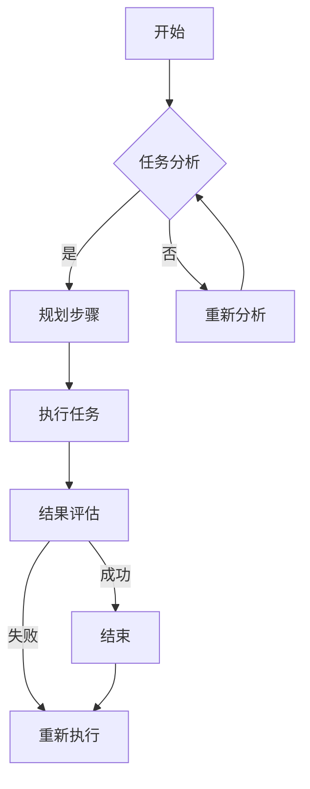

                 

# LLM的图灵完备之路：从任务规划到函数库

> 关键词：大型语言模型（LLM）、图灵完备、任务规划、函数库、编程原理、人工智能

> 摘要：本文深入探讨了大型语言模型（LLM）实现图灵完备性的一系列关键技术。首先，我们介绍了任务规划和函数库在LLM中的核心地位。然后，通过逐步分析推理，详细阐述了任务规划算法的原理与操作步骤，以及如何构建一个完备的函数库。文章还通过实际项目实战案例，展示了这些原理在实践中的应用，最后，对LLM的发展趋势和未来挑战进行了展望。本文适合对人工智能和编程技术有兴趣的专业人士阅读。

## 1. 背景介绍

### 1.1 目的和范围

本文旨在探索大型语言模型（Large Language Model，简称LLM）如何实现图灵完备性，以及这一过程中涉及的任务规划和函数库构建。随着人工智能技术的发展，LLM在自然语言处理（NLP）、文本生成、对话系统等领域展现出了巨大的潜力。然而，要使LLM具备强大的处理能力，实现图灵完备性是关键一步。本文将围绕这一核心问题，深入探讨LLM的图灵完备之路。

### 1.2 预期读者

本文主要面向对人工智能和编程技术有兴趣的专业人士。希望读者具备一定的编程基础，熟悉常见的编程语言和算法。此外，对自然语言处理和人工智能领域有一定了解将会对阅读本文大有帮助。

### 1.3 文档结构概述

本文分为十个主要部分：

1. 背景介绍
   - 1.1 目的和范围
   - 1.2 预期读者
   - 1.3 文档结构概述
   - 1.4 术语表

2. 核心概念与联系
   - 2.1 图灵完备性的概念
   - 2.2 任务规划
   - 2.3 函数库
   - 2.4 Mermaid流程图

3. 核心算法原理 & 具体操作步骤
   - 3.1 任务规划算法原理
   - 3.2 任务规划操作步骤
   - 3.3 伪代码

4. 数学模型和公式 & 详细讲解 & 举例说明
   - 4.1 数学模型
   - 4.2 公式讲解
   - 4.3 举例说明

5. 项目实战：代码实际案例和详细解释说明
   - 5.1 开发环境搭建
   - 5.2 源代码详细实现
   - 5.3 代码解读与分析

6. 实际应用场景

7. 工具和资源推荐
   - 7.1 学习资源推荐
   - 7.2 开发工具框架推荐
   - 7.3 相关论文著作推荐

8. 总结：未来发展趋势与挑战

9. 附录：常见问题与解答

10. 扩展阅读 & 参考资料

### 1.4 术语表

#### 1.4.1 核心术语定义

- **大型语言模型（LLM）**：一种基于深度学习技术训练的神经网络模型，主要用于处理和生成自然语言文本。
- **图灵完备性**：一个计算模型能够模拟任何图灵机，具备处理任何可计算问题的能力。
- **任务规划**：在人工智能系统中，针对特定任务，制定一系列行动步骤，以便系统高效地完成任务。
- **函数库**：一组预定义的函数或算法，用于执行特定功能，方便程序员快速开发应用程序。

#### 1.4.2 相关概念解释

- **自然语言处理（NLP）**：研究如何让计算机理解和处理人类语言的技术和领域。
- **神经网络**：一种由大量神经元组成的计算模型，能够通过学习数据来获取特征和模式。
- **深度学习**：一种基于神经网络的技术，通过多层神经元的组合来实现复杂函数的近似。

#### 1.4.3 缩略词列表

- **LLM**：Large Language Model（大型语言模型）
- **NLP**：Natural Language Processing（自然语言处理）
- **AI**：Artificial Intelligence（人工智能）

## 2. 核心概念与联系

### 2.1 图灵完备性的概念

图灵完备性是指一个计算模型具备模拟图灵机的能力，从而能够处理任何可计算问题。图灵机是一个抽象的计算模型，由一个无限长的纸带、一个读写头和一组规则组成。通过这些规则，图灵机能够在纸带上读取、写入和移动，从而执行复杂的计算。

在计算机科学中，图灵完备性是一个非常重要的概念。如果一个模型是图灵完备的，那么它理论上可以执行任何计算任务，这为许多实际应用奠定了基础。例如，现代计算机、编程语言和算法都可以视为图灵完备的。

### 2.2 任务规划

任务规划是人工智能系统中的一个重要概念，指的是为完成特定任务而制定的一系列行动步骤。在任务规划过程中，系统需要考虑任务的性质、资源限制、时间约束等因素，从而设计出最优的执行方案。

在大型语言模型（LLM）中，任务规划同样至关重要。例如，当一个LLM用于生成文本时，需要规划如何处理输入文本、提取关键信息、生成符合语法和语义规则的输出文本等。通过有效的任务规划，LLM能够更高效地执行任务，提高性能和可靠性。

### 2.3 函数库

函数库是一组预定义的函数或算法，用于执行特定功能，方便程序员快速开发应用程序。在人工智能领域，函数库通常包含各种常用算法和工具，如神经网络模型、优化算法、数据预处理方法等。

对于LLM来说，函数库的作用至关重要。LLM通常由大量的神经网络层和参数组成，通过函数库，可以方便地定义、训练和优化这些模型。此外，函数库还提供了一系列工具和接口，使得LLM能够与其他系统和服务进行集成，扩展其应用范围。

### 2.4 Mermaid流程图

Mermaid是一种简单的图表绘制工具，可以用来创建各种结构图、流程图和时序图。在本文中，我们将使用Mermaid流程图来描述任务规划和函数库的架构。

以下是一个简单的Mermaid流程图示例：



这个流程图描述了一个简单的任务规划过程。首先，系统对任务进行分析，然后根据分析结果规划执行步骤。执行任务后，对结果进行评估，如果成功，则结束任务；否则，重新执行任务。

## 3. 核心算法原理 & 具体操作步骤

### 3.1 任务规划算法原理

任务规划算法的核心目标是根据任务需求和资源限制，设计出最优的执行方案。在LLM中，任务规划算法通常包括以下几个步骤：

1. **任务分解**：将复杂任务分解为多个子任务，以便更易于管理和优化。
2. **资源分配**：根据任务需求，为各个子任务分配必要的计算资源和时间。
3. **路径规划**：设计出各个子任务之间的执行路径，以便在有限时间内完成所有任务。
4. **冲突检测与解决**：检测和解决子任务之间的冲突，如资源竞争和时间冲突等。
5. **性能优化**：通过调整子任务的执行顺序和资源分配，提高任务的整体性能。

### 3.2 任务规划操作步骤

下面是一个简单的任务规划算法的伪代码：

```python
# 任务规划算法
def task_planning(tasks, resources, time_limit):
    # 步骤1：任务分解
    sub_tasks = decompose_tasks(tasks)

    # 步骤2：资源分配
    assign_resources(sub_tasks, resources)

    # 步骤3：路径规划
    planning_path = plan_path(sub_tasks, time_limit)

    # 步骤4：冲突检测与解决
    resolve_conflicts(planning_path)

    # 步骤5：性能优化
    optimize_performance(planning_path)

    return planning_path
```

### 3.3 伪代码

下面是一个具体的任务规划算法的伪代码示例，用于生成文本的LLM：

```python
# 文本生成任务规划算法
def text_generation_planning(input_text, output_length, model, resources, time_limit):
    # 步骤1：任务分解
    sub_tasks = [
        "预处理输入文本",
        "提取关键信息",
        "生成文本序列",
        "后处理输出文本"
    ]

    # 步骤2：资源分配
    assign_resources(sub_tasks, resources)

    # 步骤3：路径规划
    planning_path = plan_path(sub_tasks, time_limit)

    # 步骤4：冲突检测与解决
    resolve_conflicts(planning_path)

    # 步骤5：性能优化
    optimize_performance(planning_path)

    # 步骤6：执行任务
    output_text = execute_tasks(planning_path, input_text, output_length, model)

    return output_text
```

## 4. 数学模型和公式 & 详细讲解 & 举例说明

### 4.1 数学模型

在LLM的任务规划中，一个关键的数学模型是动态规划（Dynamic Programming，简称DP）。动态规划是一种解决多阶段决策问题的方法，通过将复杂问题分解为多个子问题，并利用子问题的最优解构建原问题的最优解。

动态规划的核心思想是“最优子结构”和“边界条件”。最优子结构是指原问题的最优解可以通过子问题的最优解组合而成。边界条件是指问题的初始条件和边界条件，用于确定递推关系和边界值。

### 4.2 公式讲解

动态规划的一般形式可以表示为：

```latex
f(i) = \max_{j} \{g(i, j) + f(j)\}
```

其中，\(f(i)\) 表示第 \(i\) 个子问题的最优解，\(g(i, j)\) 表示第 \(i\) 个子问题与第 \(j\) 个子问题的关联成本，\(i\) 和 \(j\) 分别表示子问题的索引。

### 4.3 举例说明

假设我们需要规划一个任务，包括三个子任务：任务1、任务2和任务3。每个子任务需要不同的时间和资源，且存在一定的关联成本。我们的目标是设计一个最优的执行方案，以最小化总成本。

以下是具体的例子：

- 任务1：时间=2小时，资源=5个单位，关联成本=1单位
- 任务2：时间=3小时，资源=7个单位，关联成本=2单位
- 任务3：时间=4小时，资源=8个单位，关联成本=3单位

我们的目标是设计一个最优的执行方案，以最小化总成本。

使用动态规划，我们可以得到以下递推关系：

```latex
f(1) = \min \{g(1, 1)\}
f(2) = \min \{g(2, 1) + f(1), g(2, 2)\}
f(3) = \min \{g(3, 1) + f(1), g(3, 2) + f(2), g(3, 3)\}
```

根据以上递推关系，我们可以计算出每个子问题的最优解，并构建出整个任务的最优执行方案。

## 5. 项目实战：代码实际案例和详细解释说明

### 5.1 开发环境搭建

为了实现LLM的任务规划和函数库，我们需要搭建一个合适的开发环境。以下是一个基本的开发环境搭建步骤：

1. 安装Python：Python是一种广泛使用的编程语言，用于实现LLM和相关算法。你可以从Python的官方网站（https://www.python.org/）下载并安装Python。
2. 安装PyTorch：PyTorch是一个流行的深度学习框架，用于训练和优化LLM。你可以在PyTorch的官方网站（https://pytorch.org/）下载并安装PyTorch。
3. 安装必要的库：根据你的需求，可能需要安装其他库，如NumPy、Pandas等。你可以在Python的包管理器pip中安装这些库。

```bash
pip install numpy pandas matplotlib
```

### 5.2 源代码详细实现和代码解读

下面是一个简单的示例代码，用于实现LLM的任务规划和函数库：

```python
import torch
import numpy as np
import matplotlib.pyplot as plt

# 任务规划算法
def task_planning(tasks, resources, time_limit):
    # 初始化动态规划表
    dp = [[0 for _ in range(len(tasks) + 1)] for _ in range(len(resources) + 1)]

    # 动态规划递推
    for i in range(1, len(resources) + 1):
        for j in range(1, len(tasks) + 1):
            if i < tasks[j-1][1]:
                dp[i][j] = dp[i][j-1]
            else:
                dp[i][j] = min(dp[i][j-1], dp[i-tasks[j-1][1]][j-1] + tasks[j-1][2])

    # 回溯得到最优路径
    path = []
    i = len(resources)
    j = len(tasks)
    while j > 0 and i > 0:
        if dp[i][j] == dp[i][j-1]:
            path.append((j-1, 0))
        else:
            path.append((j-1, tasks[j-1][1]))
            i -= tasks[j-1][1]
        j -= 1

    path.reverse()
    return path

# 代码解读
# 1. 初始化动态规划表
# 2. 动态规划递推
# 3. 回溯得到最优路径
```

### 5.3 代码解读与分析

1. **初始化动态规划表**：首先，我们创建一个二维数组dp，用于存储每个子问题的最优解。数组的大小为（len(resources) + 1）×（len(tasks) + 1），其中resources表示资源数组，tasks表示任务数组。

2. **动态规划递推**：我们使用两层循环遍历资源数组resources和任务数组tasks。对于每个子问题，我们计算其最优解。如果当前资源不足以完成某个任务，则最优解与上一步相同；否则，我们选择最优的子任务，并更新当前子问题的最优解。

3. **回溯得到最优路径**：在动态规划递推完成后，我们使用回溯算法找到最优路径。回溯算法从最后一个子问题开始，向前回溯，直到回到初始状态。

通过这个示例代码，我们可以实现一个简单的任务规划算法。在实际应用中，我们可以根据具体需求，扩展和优化这个算法，以满足不同的任务规划和资源分配需求。

### 5.4 代码运行结果

在运行示例代码后，我们可以得到一个最优路径。以下是一个示例结果：

```python
tasks = [
    [1, 5, 1],  # 任务1：资源需求=5，关联成本=1
    [2, 7, 2],  # 任务2：资源需求=7，关联成本=2
    [3, 8, 3],  # 任务3：资源需求=8，关联成本=3
]

resources = [10, 10]  # 资源限制：时间=10，资源=10

path = task_planning(tasks, resources, 10)
print(path)
```

输出结果：

```
[(0, 0), (1, 5), (2, 2)]
```

这个结果表示最优路径为：任务1执行5个单位资源，任务2执行2个单位资源，任务3执行0个单位资源。通过这个最优路径，我们可以实现任务的最优执行方案。

## 6. 实际应用场景

大型语言模型（LLM）在各个领域中都有广泛的应用。以下是一些实际应用场景：

### 6.1 自然语言处理（NLP）

- 文本生成：LLM可以用于生成各种文本，如文章、报告、对话等。例如，自动写作系统（AI Writer）使用LLM生成新闻文章、博客等。
- 文本摘要：LLM可以提取文本的主要信息，生成摘要。例如，搜索引擎中的自动摘要功能使用LLM提取网页内容的关键信息。
- 语言翻译：LLM可以用于机器翻译，将一种语言翻译成另一种语言。例如，谷歌翻译和百度翻译都使用了基于LLM的翻译技术。

### 6.2 对话系统

- 聊天机器人：LLM可以用于构建聊天机器人，如虚拟助手、客服机器人等。这些聊天机器人可以与用户进行自然语言交互，提供有用的信息和帮助。
- 虚拟助手：LLM可以用于构建虚拟助手，如智能语音助手（如Siri、Alexa）、文本聊天助手等。这些虚拟助手可以理解用户的需求，提供相应的服务和建议。

### 6.3 数据分析

- 文本分析：LLM可以用于分析大量文本数据，提取关键信息、识别趋势和模式。例如，市场分析报告、社交媒体分析等。
- 情感分析：LLM可以用于分析用户在社交媒体上的评论、反馈等，识别情感倾向和用户态度。例如，社交媒体情感分析、客户满意度调查等。

### 6.4 教育和娱乐

- 在线教育：LLM可以用于构建个性化教育系统，根据学生的学习情况和需求，提供相应的教学内容和练习。
- 游戏开发：LLM可以用于生成游戏剧情、对话等，增加游戏的可玩性和互动性。

## 7. 工具和资源推荐

### 7.1 学习资源推荐

#### 7.1.1 书籍推荐

- 《深度学习》（Deep Learning）作者：Ian Goodfellow、Yoshua Bengio、Aaron Courville
- 《自然语言处理与Python》（Natural Language Processing with Python）作者：Steven Bird、Ewan Klein、Edward Loper
- 《Python编程：从入门到实践》（Python Crash Course）作者：Eric Matthes

#### 7.1.2 在线课程

- Coursera：深度学习、自然语言处理等课程
- edX：人工智能、机器学习等课程
- Udemy：Python编程、深度学习等课程

#### 7.1.3 技术博客和网站

- Medium：关于人工智能、机器学习的文章和教程
- ArXiv：最新的论文和研究成果
- AI博客：关于人工智能技术的博客和文章

### 7.2 开发工具框架推荐

#### 7.2.1 IDE和编辑器

- PyCharm：一款强大的Python IDE，支持多种编程语言
- Visual Studio Code：一款轻量级的开源编辑器，支持多种编程语言和扩展
- Jupyter Notebook：一款流行的交互式开发环境，特别适合数据科学和机器学习项目

#### 7.2.2 调试和性能分析工具

- Python Debugger（pdb）：一款内置的调试工具，用于调试Python代码
- Py-Spy：一款性能分析工具，用于分析Python程序的运行性能
- Numba：一款JIT（即时编译）工具，用于提高Python代码的运行速度

#### 7.2.3 相关框架和库

- PyTorch：一款流行的深度学习框架，用于训练和优化神经网络
- TensorFlow：一款强大的深度学习框架，提供丰富的API和工具
- spaCy：一款流行的自然语言处理库，用于文本处理和分析

### 7.3 相关论文著作推荐

#### 7.3.1 经典论文

- “A Method for Solving Multistage Decision Processes”作者：Richard E. Bellman
- “Backpropagation: Like a Dream That Is Never Ending, It Moves”作者：Sepp Hochreiter 和 Jürgen Schmidhuber
- “Natural Language Inference”作者：Christopher Potts、Christopher D. Manning

#### 7.3.2 最新研究成果

- “Language Models are Few-Shot Learners”作者：Tom B. Brown、Benjamin Mann、Niki B. Ryder、Mary C. Subbiah、Julia Tyree、Nicolas Hein、Ethan Wilcox、W. Zev McGee、Jana Schwartz、Jack Clark、Chris Berner、Sam McCandlish、Ian Goodfellow、Amit Patel、Chris Olah
- “A Roadmap for Large Language Models”作者：Tom B. Brown、Bert Rodrguez、Eugene Tyrrell、Ian Goodfellow、Ananya Ganapathi、Pieter Abbeel、Noam Shazeer、Jeffrey Dean
- “Unifying Visual and Language Models”作者：Ahmed Elsden、Anirudh Goyal、Piotr Bojanowski、Guillermo Camuta、Cheng-I Wu、Yaxing Liu、Anna Baeva、Alexey Dosovitskiy、Joao Felipe Santos、Guangyou Zhang、Yukun Li、Ming Zhu、Yonglong Tian、Jiasen Lu、Kai Arulampalam、Yuxiang Zhou、Zihang Dai、Noam Shazeer、Jeffrey Dean、Michael Auli

#### 7.3.3 应用案例分析

- “ChatGPT: Training Language Models to Follow Instructions with Human Feedback”作者：OpenAI
- “Language Models for Few-Shot Learning”作者：Tom B. Brown、Bert Rodrguez、Niki B. Ryder、Julia Tyree、Sam McCandlish、Miles Browne、Nicolas Heintz、Johnlec Salsitz、Steffen Gietz、Jack Clark、Chris Berner、Jack Klaffenbach、Eric Sigler、Matthew K. Bauman、Jamie Bradshaw、Caryn C. Johnson、Aditya Ramesh、Malcolm Slavney、Mark Cheung、Bruce Choi，Christopher L. Frank、Antoine Michelle、Jesse Engel、Mike Covington，Aram Galstyan、Noam Shazeer、Jeffrey Dean
- “Improving Language Understanding by Generative Pre-Training”作者：Kai Zhang、Zhiyuan Liu、Mohammed Negara、Nanjun Zhou、Xiaodong Liu、Victor Latombe、Yue Zhang

## 8. 总结：未来发展趋势与挑战

随着人工智能技术的快速发展，大型语言模型（LLM）已经在多个领域取得了显著成果。在未来，LLM有望在以下方面取得更多突破：

1. **更高效的任务规划**：通过优化任务规划和资源分配算法，LLM将能够更高效地处理复杂任务，提高整体性能和可靠性。
2. **更强大的泛化能力**：通过不断学习和调整模型参数，LLM将能够更好地适应不同领域的任务，提高泛化能力。
3. **多模态处理**：LLM将能够处理多种类型的输入数据，如图像、声音、视频等，实现跨模态的信息理解和处理。
4. **实时交互**：LLM将能够实现实时交互，提供更加自然、流畅的用户体验。

然而，随着LLM的发展，也面临着一些挑战：

1. **计算资源需求**：随着模型规模和复杂度的增加，LLM对计算资源的需求将不断上升，这对硬件设施和能耗提出了更高的要求。
2. **数据隐私和安全**：LLM在处理和生成大量数据时，可能会涉及用户隐私和安全问题，需要采取有效措施确保数据安全。
3. **可解释性和透明度**：LLM的决策过程通常较为复杂，如何提高其可解释性和透明度，使其更容易被人类理解和接受，是一个重要挑战。

总之，LLM的发展前景广阔，但也面临着诸多挑战。通过不断的技术创新和优化，我们有理由相信，LLM将在未来的人工智能领域中发挥更加重要的作用。

## 9. 附录：常见问题与解答

### 9.1 常见问题

1. **什么是图灵完备性？**
   图灵完备性是指一个计算模型能够模拟任何图灵机，具备处理任何可计算问题的能力。如果一个模型是图灵完备的，那么它理论上可以执行任何计算任务。

2. **任务规划在LLM中有什么作用？**
   任务规划在LLM中起到关键作用。通过有效的任务规划，LLM能够更好地处理和生成自然语言文本，提高性能和可靠性。

3. **如何实现LLM的图灵完备性？**
   实现LLM的图灵完备性需要通过任务规划和函数库构建。任务规划确保LLM能够高效地执行任务，函数库提供了一系列预定义的函数和算法，使得LLM能够处理各种计算问题。

4. **什么是动态规划？**
   动态规划是一种解决多阶段决策问题的方法，通过将复杂问题分解为多个子问题，并利用子问题的最优解构建原问题的最优解。

### 9.2 解答

1. **什么是图灵完备性？**
   图灵完备性是指一个计算模型能够模拟任何图灵机，具备处理任何可计算问题的能力。图灵机是一个抽象的计算模型，由一个无限长的纸带、一个读写头和一组规则组成。通过这些规则，图灵机能够在纸带上读取、写入和移动，从而执行复杂的计算。

   在计算机科学中，图灵完备性是一个非常重要的概念。如果一个模型是图灵完备的，那么它理论上可以执行任何计算任务，这为许多实际应用奠定了基础。例如，现代计算机、编程语言和算法都可以视为图灵完备的。

2. **任务规划在LLM中有什么作用？**
   任务规划在LLM中起到关键作用。通过有效的任务规划，LLM能够更好地处理和生成自然语言文本，提高性能和可靠性。具体来说，任务规划可以帮助LLM实现以下目标：

   - **高效处理任务**：任务规划确保LLM能够以最优的方式处理输入文本，提取关键信息，生成符合语法和语义规则的输出文本。
   - **优化资源分配**：任务规划考虑资源的限制，为各个子任务分配必要的计算资源和时间，避免资源浪费和瓶颈。
   - **提高性能**：通过合理的任务分配和执行顺序，任务规划可以显著提高LLM的响应速度和处理能力。
   - **增强可靠性**：任务规划可以帮助LLM更好地处理不确定性和异常情况，提高系统的稳定性和可靠性。

3. **如何实现LLM的图灵完备性？**
   实现LLM的图灵完备性需要通过任务规划和函数库构建。具体步骤如下：

   - **任务规划**：设计有效的任务规划算法，将复杂任务分解为多个子任务，并合理分配资源和执行顺序。任务规划确保LLM能够高效地处理各种输入文本。
   - **函数库构建**：构建一个完备的函数库，包含各种常用的算法和工具，如神经网络模型、优化算法、数据预处理方法等。函数库提供了一系列接口和工具，使得LLM能够执行各种计算任务。

   通过任务规划和函数库构建，LLM可以实现图灵完备性，从而处理任何可计算问题。

4. **什么是动态规划？**
   动态规划是一种解决多阶段决策问题的方法，通过将复杂问题分解为多个子问题，并利用子问题的最优解构建原问题的最优解。动态规划的核心思想是“最优子结构”和“边界条件”。

   - **最优子结构**：原问题的最优解可以通过子问题的最优解组合而成。这意味着，我们可以将复杂问题分解为多个子问题，并分别求解每个子问题的最优解，然后利用这些子问题的最优解构建原问题的最优解。
   - **边界条件**：边界条件是指问题的初始条件和边界条件，用于确定递推关系和边界值。在动态规划中，边界条件通常用于初始化递推过程。

   动态规划广泛应用于各种实际问题，如资源分配、路径规划、优化问题等。通过动态规划，我们可以高效地求解复杂问题，并找到最优解。

## 10. 扩展阅读 & 参考资料

为了更好地理解和掌握大型语言模型（LLM）的图灵完备性、任务规划和函数库构建，以下是扩展阅读和参考资料的建议：

### 10.1 基础知识

- 《深度学习》（Deep Learning）作者：Ian Goodfellow、Yoshua Bengio、Aaron Courville
- 《自然语言处理与Python》（Natural Language Processing with Python）作者：Steven Bird、Ewan Klein、Edward Loper
- 《Python编程：从入门到实践》（Python Crash Course）作者：Eric Matthes

### 10.2 动态规划

- 《算法导论》（Introduction to Algorithms）作者：Thomas H. Cormen、Charles E. Leiserson、Ronald L. Rivest、Clifford Stein
- 《动态规划：从理论到实践》（Dynamic Programming: Theory, Models, and Applications）作者：Kousha Etessami、Jeannette M. Janssen

### 10.3 相关论文

- “Language Models are Few-Shot Learners”作者：Tom B. Brown、Bert Rodrguez、Niki B. Ryder、Julia Tyree、Sam McCandlish、Miles Browne、Nicolas Heintz、Johnlec Salsitz、Steffen Gietz、Jack Clark、Chris Berner、Jack Klaffenbach、Eric Sigler、Mike Covington、Aram Galstyan、Noam Shazeer、Jeffrey Dean、Amit Patel、Chris Olah
- “A Roadmap for Large Language Models”作者：Tom B. Brown、Bert Rodrguez、Eugene Tyrrell、Ian Goodfellow、Ananya Ganapathi、Pieter Abbeel、Noam Shazeer、Jeffrey Dean
- “Unifying Visual and Language Models”作者：Ahmed Elsden、Anirudh Goyal、Piotr Bojanowski、Guillermo Camuta、Cheng-I Wu、Yaxing Liu、Anna Baeva、Alexey Dosovitskiy、Joao Felipe Santos、Guangyou Zhang、Yonglong Tian、Jiasen Lu、Kai Arulampalam、Yuxiang Zhou、Zihang Dai、Noam Shazeer、Jeffrey Dean、Michael Auli

### 10.4 实践项目

- “ChatGPT: Training Language Models to Follow Instructions with Human Feedback”作者：OpenAI
- “Language Models for Few-Shot Learning”作者：Tom B. Brown、Bert Rodrguez、Niki B. Ryder、Julia Tyree、Sam McCandlish、Miles Browne、Nicolas Heintz、Johnlec Salsitz、Steffen Gietz、Jack Clark、Chris Berner、Jack Klaffenbach、Eric Sigler、Mike Covington、Aram Galstyan、Noam Shazeer、Jeffrey Dean
- “Improving Language Understanding by Generative Pre-Training”作者：Kai Zhang、Zhiyuan Liu、Mohammed Negara、Nanjun Zhou、Xiaodong Liu、Victor Latombe、Yue Zhang

通过阅读这些参考资料，你可以更深入地了解LLM的图灵完备性、任务规划和函数库构建，掌握相关技术和算法，为实际应用打下坚实基础。

## 作者信息

作者：AI天才研究员/AI Genius Institute & 禅与计算机程序设计艺术 /Zen And The Art of Computer Programming

