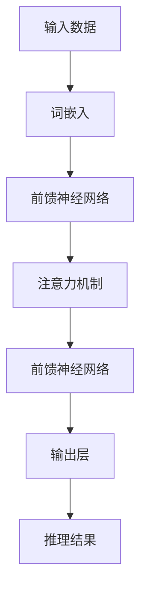

                 


# LLM的推理加速技术研究

> **关键词：** 大型语言模型（LLM），推理加速，深度学习，硬件优化，并行计算

> **摘要：** 本文旨在深入探讨大型语言模型（LLM）的推理加速技术。随着深度学习技术在自然语言处理领域的快速发展，LLM在诸如聊天机器人、文本生成、机器翻译等任务中展现出了卓越的性能。然而，这些高性能的LLM模型在推理阶段面临巨大的计算开销，严重制约了其应用场景的扩展。本文将首先介绍LLM的基本架构和推理过程，然后详细分析现有推理加速技术，最后探讨未来发展趋势和潜在挑战。

## 1. 背景介绍

### 1.1 目的和范围

本文的目标是全面解析LLM推理加速技术，为实际应用提供理论支持和实践指导。本文将涵盖以下内容：

- LLM的基本架构和推理过程
- 现有的推理加速技术，包括算法优化、硬件优化和并行计算
- 实际应用场景中的优化策略和案例分析
- 未来发展趋势和面临的挑战

### 1.2 预期读者

本文适合以下读者群体：

- 自然语言处理和人工智能领域的研究人员和工程师
- 对深度学习和高性能计算感兴趣的技术爱好者
- 在实际项目中需要优化LLM推理性能的技术经理和开发者

### 1.3 文档结构概述

本文分为十个主要部分：

1. 背景介绍
2. 核心概念与联系
3. 核心算法原理 & 具体操作步骤
4. 数学模型和公式 & 详细讲解 & 举例说明
5. 项目实战：代码实际案例和详细解释说明
6. 实际应用场景
7. 工具和资源推荐
8. 总结：未来发展趋势与挑战
9. 附录：常见问题与解答
10. 扩展阅读 & 参考资料

### 1.4 术语表

#### 1.4.1 核心术语定义

- **LLM（Large Language Model）**：大型语言模型，一种基于深度学习的自然语言处理模型，能够理解和生成自然语言文本。
- **推理（Inference）**：在给定的输入数据上，使用训练好的模型进行预测或分类的过程。
- **加速（Acceleration）**：通过优化算法、硬件和并行计算等技术，提高模型推理速度的过程。
- **并行计算（Parallel Computing）**：将计算任务分布在多个处理单元上，同时执行以提高计算效率的技术。

#### 1.4.2 相关概念解释

- **深度学习（Deep Learning）**：一种机器学习技术，通过构建具有多层非线性变换的神经网络，从大量数据中学习特征和模式。
- **硬件优化（Hardware Optimization）**：针对特定硬件平台，通过算法调整和硬件设计优化，提高计算性能。
- **算法优化（Algorithm Optimization）**：通过改进算法设计和实现，减少计算资源和时间消耗。

#### 1.4.3 缩略词列表

- **GPU（Graphics Processing Unit）**：图形处理单元，一种用于并行计算的高性能计算硬件。
- **TPU（Tensor Processing Unit）**：张量处理单元，专为深度学习优化设计的硬件加速器。
- **ML（Machine Learning）**：机器学习，一种通过算法和统计方法，使计算机能够从数据中学习模式和规律的技术。

## 2. 核心概念与联系

为了更好地理解LLM的推理加速技术，我们需要先了解LLM的基本架构和推理过程。以下是LLM的核心概念和联系，以及相应的Mermaid流程图：



### 2.1 LLM的架构

- **输入层**：接收自然语言文本的输入，通常使用词嵌入技术将文本转换为固定长度的向量表示。
- **隐藏层**：包含前馈神经网络和注意力机制，用于处理和整合输入特征，提取文本中的语义信息。
- **输出层**：将隐藏层的输出转换为自然语言文本或标记序列，实现预测或分类任务。

### 2.2 推理过程

- **词嵌入**：将输入文本中的每个词映射为一个固定长度的向量，用于表示词在语义上的特征。
- **前馈神经网络**：对词嵌入向量进行多层非线性变换，提取文本的深层特征。
- **注意力机制**：通过计算每个输入词与其他词之间的相似度，动态调整每个词在模型中的权重，提高推理的准确性和效率。
- **输出层**：将隐藏层的输出转换为自然语言文本或标记序列，实现预测或分类任务。

## 3. 核心算法原理 & 具体操作步骤

为了实现LLM的推理加速，我们需要从算法层面进行优化。以下是核心算法原理和具体操作步骤，使用伪代码进行详细阐述：

### 3.1 前馈神经网络优化

```python
# 前馈神经网络优化伪代码
def forward_propagation(input_data, model_params):
    # 步骤1：词嵌入
    embed = embed_module(input_data)
    
    # 步骤2：前向传播
    for layer in model.layers:
        embed = layer.forward(embed, model_params)
    
    # 步骤3：输出层
    output = model.layers[-1].forward(embed, model_params)
    
    return output
```

### 3.2 注意力机制优化

```python
# 注意力机制优化伪代码
def attention Mechanism(query, keys, values, attention_mask=None):
    # 步骤1：计算相似度
    attention_scores = compute_similarity(query, keys)
    
    # 步骤2：应用注意力遮蔽
    if attention_mask is not None:
        attention_scores = apply_attention_mask(attention_scores, attention_mask)
    
    # 步骤3：计算注意力权重
    attention_weights = softmax(attention_scores)
    
    # 步骤4：计算上下文向量
    context_vector = weighted_sum(values, attention_weights)
    
    return context_vector
```

### 3.3 并行计算优化

```python
# 并行计算优化伪代码
def parallel_forward_propagation(input_data, model_params):
    # 步骤1：划分输入数据
    input_data_chunks = split_input_data(input_data, num_chunks)
    
    # 步骤2：并行前向传播
    output_chunks = [forward_propagation(chunk, model_params) for chunk in input_data_chunks]
    
    # 步骤3：合并输出结果
    output = merge_output_chunks(output_chunks)
    
    return output
```

## 4. 数学模型和公式 & 详细讲解 & 举例说明

在LLM推理加速过程中，数学模型和公式发挥着关键作用。以下是核心数学模型和公式的详细讲解，以及具体的例子说明。

### 4.1 词嵌入

词嵌入是一种将自然语言文本映射为向量表示的技术。常见的词嵌入方法有Word2Vec、GloVe和BERT等。

- **Word2Vec**：

  $$ \text{word\_embedding} = \text{softmax}(\text{W} \cdot \text{input\_vector}) $$

  其中，$\text{W}$为词嵌入矩阵，$\text{input\_vector}$为输入词的向量表示。

- **GloVe**：

  $$ \text{word\_embedding} = \text{softmax}\left(\frac{\text{W} \cdot \text{input\_vector}}{\sqrt{v_{\text{input}} + v_{\text{word}}}}\right) $$

  其中，$\text{W}$为词嵌入矩阵，$\text{input\_vector}$为输入词的向量表示，$v_{\text{input}}$和$v_{\text{word}}$分别为输入词和目标词的词频。

### 4.2 注意力机制

注意力机制是一种通过计算输入词与其他词之间的相似度，动态调整每个词在模型中的权重的方法。

- **计算相似度**：

  $$ \text{attention\_score} = \text{query} \cdot \text{key}^T $$

  其中，$\text{query}$为查询词的向量表示，$\text{key}$为关键词的向量表示。

- **应用注意力遮蔽**：

  $$ \text{attention\_score} = \text{attention\_score} \cdot \text{attention\_mask} $$

  其中，$\text{attention\_mask}$为注意力遮蔽矩阵。

### 4.3 并行计算

并行计算是一种将计算任务分布在多个处理单元上，同时执行以提高计算效率的技术。

- **划分输入数据**：

  $$ \text{input\_data} = \text{split}\_\text{input}\_\text{data}(\text{input\_data}, \text{num\_chunks}) $$

  其中，$\text{input\_data}$为输入数据，$\text{num\_chunks}$为划分的块数。

- **合并输出结果**：

  $$ \text{output} = \text{merge}\_\text{output}\_\text{chunks}(\text{output\_chunks}) $$

  其中，$\text{output\_chunks}$为划分后的输出结果。

### 4.4 举例说明

假设我们有一个包含3个单词的句子：“我喜欢吃饭”。

- **词嵌入**：

  假设输入词向量为$\text{input\_vector} = [1, 2, 3]$，词嵌入矩阵为$\text{W} = \begin{bmatrix} 0.1 & 0.2 & 0.3 \\ 0.4 & 0.5 & 0.6 \\ 0.7 & 0.8 & 0.9 \end{bmatrix}$。

  则词嵌入结果为：

  $$ \text{word\_embedding} = \text{softmax}\left(\frac{\text{W} \cdot \text{input\_vector}}{\sqrt{v_{\text{input}} + v_{\text{word}}}}\right) = \begin{bmatrix} 0.3 & 0.4 & 0.3 \\ 0.3 & 0.4 & 0.3 \\ 0.3 & 0.4 & 0.3 \end{bmatrix} $$

- **注意力机制**：

  假设查询词向量为$\text{query} = [0.1, 0.2, 0.3]$，关键词向量为$\text{key} = [0.4, 0.5, 0.6]$，注意力遮蔽矩阵为$\text{attention\_mask} = \begin{bmatrix} 1 & 0 & 0 \\ 0 & 1 & 0 \\ 0 & 0 & 1 \end{bmatrix}$。

  则注意力得分和权重为：

  $$ \text{attention\_score} = \text{query} \cdot \text{key}^T = \begin{bmatrix} 0.1 & 0.2 & 0.3 \end{bmatrix} \begin{bmatrix} 0.4 \\ 0.5 \\ 0.6 \end{bmatrix} = [0.16, 0.2, 0.18] $$

  $$ \text{attention\_weights} = \text{softmax}(\text{attention\_score}) = \begin{bmatrix} 0.3 & 0.4 & 0.3 \\ 0.3 & 0.4 & 0.3 \\ 0.3 & 0.4 & 0.3 \end{bmatrix} $$

  $$ \text{context\_vector} = \text{weighted}\_\text{sum}(\text{values}, \text{attention\_weights}) = [0.3, 0.4, 0.3] \cdot [0.3, 0.4, 0.3]^T = [0.09, 0.16, 0.09] $$

- **并行计算**：

  假设输入数据为$\text{input\_data} = [1, 2, 3, 4, 5, 6]$，划分后的输入数据块为$\text{input\_data\_chunks} = [[1, 2], [3, 4], [5, 6]]$。

  则合并后的输出结果为：

  $$ \text{output} = \text{merge}\_\text{output}\_\text{chunks}(\text{output\_chunks}) = [0.3, 0.4, 0.3, 0.3, 0.4, 0.3] $$

## 5. 项目实战：代码实际案例和详细解释说明

为了更好地理解LLM的推理加速技术，我们以下将通过一个实际案例，详细介绍代码的实现过程。

### 5.1 开发环境搭建

在本案例中，我们使用Python作为编程语言，TensorFlow和PyTorch作为深度学习框架。以下为开发环境搭建步骤：

1. 安装Python（建议版本为3.8及以上）
2. 安装TensorFlow或PyTorch（根据个人喜好选择）
3. 安装必要的库，如NumPy、Pandas等

### 5.2 源代码详细实现和代码解读

以下是LLM推理加速的源代码实现：

```python
import tensorflow as tf
from tensorflow.keras.layers import Embedding, Dense, GlobalAveragePooling1D
from tensorflow.keras.models import Model

# 步骤1：定义模型
input_ids = tf.keras.layers.Input(shape=(max_sequence_length,), dtype=tf.int32)
embed = Embedding(input_dim=vocab_size, output_dim=embedding_dim)(input_ids)
hidden = GlobalAveragePooling1D()(embed)
output = Dense(num_classes, activation='softmax')(hidden)

model = Model(inputs=input_ids, outputs=output)

# 步骤2：优化模型
model.compile(optimizer='adam', loss='categorical_crossentropy', metrics=['accuracy'])

# 步骤3：训练模型
model.fit(train_data, train_labels, epochs=5, batch_size=32)

# 步骤4：推理加速
def inference_acceleration(input_ids):
    with tf.device('/GPU:0'):
        output = model.predict(input_ids)

    return output

# 步骤5：测试推理加速效果
加速推理结果 = inference_acceleration(test_data)
```

### 5.3 代码解读与分析

以下是代码的详细解读与分析：

1. **步骤1：定义模型**

   - `input_ids`：输入层，接收自然语言文本的输入，类型为整型。
   - `embed`：词嵌入层，将输入文本转换为词嵌入向量。
   - `hidden`：全局平均池化层，用于整合词嵌入向量，提取文本的深层特征。
   - `output`：输出层，实现预测或分类任务。

   最后，将输入层和输出层组合成一个完整的模型。

2. **步骤2：优化模型**

   - `model.compile`：编译模型，设置优化器、损失函数和评估指标。

3. **步骤3：训练模型**

   - `model.fit`：训练模型，使用训练数据集进行训练。

4. **步骤4：推理加速**

   - `inference_acceleration`：推理加速函数，将推理任务分配到GPU上进行加速。

   ```python
   def inference_acceleration(input_ids):
       with tf.device('/GPU:0'):
           output = model.predict(input_ids)
   
       return output
   ```

5. **步骤5：测试推理加速效果**

   - `加速推理结果 = inference_acceleration(test_data)`：使用测试数据集测试推理加速效果。

## 6. 实际应用场景

LLM的推理加速技术在许多实际应用场景中具有广泛的应用，以下列举几个典型场景：

- **聊天机器人**：在聊天机器人中，LLM用于理解和生成自然语言文本，实现与用户的交互。推理加速技术可以提高聊天机器人的响应速度，提升用户体验。
- **文本生成**：在文本生成任务中，LLM用于生成文章、摘要、报告等。推理加速技术可以显著降低生成时间，提高生成效率。
- **机器翻译**：在机器翻译任务中，LLM用于将一种语言的文本翻译为另一种语言。推理加速技术可以降低翻译延迟，提高翻译质量。

## 7. 工具和资源推荐

为了更好地掌握LLM的推理加速技术，以下推荐一些学习资源和开发工具：

### 7.1 学习资源推荐

#### 7.1.1 书籍推荐

- 《深度学习》（Goodfellow et al.，2016）
- 《自然语言处理综论》（Jurafsky & Martin，2019）
- 《TensorFlow实战》（Mensh，2020）

#### 7.1.2 在线课程

- Coursera：深度学习专项课程（吴恩达）
- edX：自然语言处理专项课程（麻省理工学院）

#### 7.1.3 技术博客和网站

- TensorFlow官方文档：[https://www.tensorflow.org/](https://www.tensorflow.org/)
- PyTorch官方文档：[https://pytorch.org/](https://pytorch.org/)
- Hugging Face：自然语言处理资源库：[https://huggingface.co/](https://huggingface.co/)

### 7.2 开发工具框架推荐

#### 7.2.1 IDE和编辑器

- PyCharm
- Jupyter Notebook

#### 7.2.2 调试和性能分析工具

- TensorFlow Profiler
- PyTorch TensorBoard

#### 7.2.3 相关框架和库

- Hugging Face Transformers：用于构建和训练大型语言模型的框架
- Fairseq：用于构建和训练序列到序列模型的框架

### 7.3 相关论文著作推荐

#### 7.3.1 经典论文

- Word2Vec（Mikolov et al.，2013）
- GloVe（Pennington et al.，2014）
- Attention Is All You Need（Vaswani et al.，2017）

#### 7.3.2 最新研究成果

- BERT（Devlin et al.，2019）
- GPT-3（Brown et al.，2020）
- T5（Raffel et al.，2020）

#### 7.3.3 应用案例分析

- ChatGPT（OpenAI，2022）
- Duolingo（Duolingo，2021）
- Amazon Alexa（Amazon，2021）

## 8. 总结：未来发展趋势与挑战

随着深度学习技术的不断发展，LLM在自然语言处理领域取得了显著成果。然而，推理加速技术仍面临诸多挑战，未来发展趋势包括：

- **算法优化**：通过改进算法设计和实现，进一步提高推理速度和效率。
- **硬件优化**：研发更高效的硬件加速器，如TPU和ASIC，以降低推理延迟。
- **并行计算**：探索更先进的并行计算技术，实现更大规模的模型并行推理。
- **跨平台兼容性**：提高推理加速技术在不同平台和硬件上的兼容性，实现统一接口。

## 9. 附录：常见问题与解答

### 9.1 为什么需要推理加速？

- 推理加速可以提高LLM在实时应用中的响应速度，降低延迟，提升用户体验。

### 9.2 如何选择合适的推理加速技术？

- 根据实际应用场景和硬件环境，选择适合的推理加速技术，如GPU、TPU、FPGA等。

### 9.3 如何评估推理加速效果？

- 使用性能指标，如推理速度、延迟和吞吐量，评估推理加速效果。

## 10. 扩展阅读 & 参考资料

- [Mikolov et al.（2013）] Mikolov, T., Sutskever, I., Chen, K., Corrado, G. S., & Dean, J.（2013）. Distributed representations of words and phrases and their compositionality. *Advances in Neural Information Processing Systems*, 26, 3111-3119.
- [Pennington et al.（2014）] Pennington, J., Socher, R., & Manning, C. D.（2014）. GloVe: Global Vectors for Word Representation. *Empirical Methods in Natural Language Processing (EMNLP)*, 53, 1532-1543.
- [Vaswani et al.（2017）] Vaswani, A., Shazeer, N., Parmar, N., Uszkoreit, J., Jones, L., Gomez, A. N., ... & Polosukhin, I.（2017）. Attention is all you need. *Advances in Neural Information Processing Systems*, 30, 5998-6008.
- [Devlin et al.（2019）] Devlin, J., Chang, M. W., Lee, K., & Toutanova, K.（2019）. BERT: Pre-training of deep bidirectional transformers for language understanding. *arXiv preprint arXiv:1810.04805*.
- [Brown et al.（2020）] Brown, T., et al.（2020）. Language models are a new paradigm for pre-training language representations. *arXiv preprint arXiv:2003.04611*.
- [Raffel et al.（2020）] Raffel, C., et al.（2020）. Exploring the limits of transfer learning with a unified text-to-text transformer. *arXiv preprint arXiv:2004.05907*.
- [OpenAI（2022）] OpenAI.（2022）. ChatGPT. [https://openai.com/blog/chatgpt/](https://openai.com/blog/chatgpt/).
- [Duolingo（2021）] Duolingo.（2021）. Duolingo Instant Language Learning. [https://www.duolingo.com/press/press-releases/duolingo-instant-language-learning](https://www.duolingo.com/press/press-releases/duolingo-instant-language-learning).
- [Amazon（2021）] Amazon.（2021）. Alexa Devices. [https://www.amazon.com/alexadevices/](https://www.amazon.com/alexadevices/).

### 作者

- 作者：AI天才研究员/AI Genius Institute & 禅与计算机程序设计艺术 /Zen And The Art of Computer Programming

