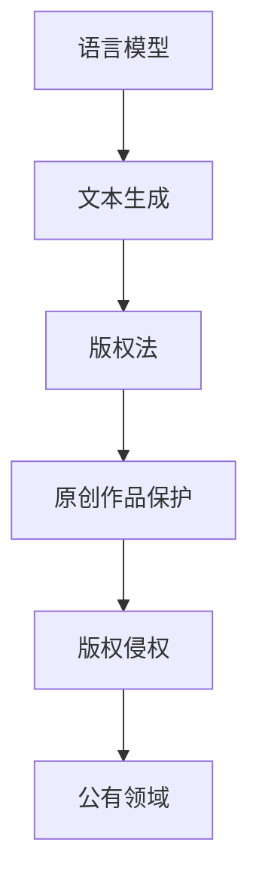

                 

# LLM的版权问题：AI创作的法律挑战

> **关键词：** 语言模型、AI创作、版权、法律挑战、技术原则、案例分析

> **摘要：** 本文将深入探讨大型语言模型（LLM）在创作过程中所面临的版权问题。通过逐步分析，我们将揭示LLM创作的法律复杂性，探讨相关法律框架及其对AI技术的影响。文章旨在为读者提供一个全面的视角，理解AI创作中的版权问题，并提出可能的解决方案。

## 1. 背景介绍

### 1.1 目的和范围

本文的目的是探讨大型语言模型（LLM）在创作过程中所面临的版权问题。随着人工智能技术的快速发展，AI创作已经成为一个热门话题。LLM如GPT-3和BERT等，因其强大的文本生成能力，被广泛应用于各种领域，包括内容创作、对话系统和自动摘要等。然而，AI创作的版权问题也随之而来，成为了法律和科技界关注的焦点。

本文将讨论以下主题：

1. AI创作的定义和背景。
2. LLM创作的法律框架和挑战。
3. 案例分析：AI创作的版权争议实例。
4. 可能的解决方案和技术对策。

### 1.2 预期读者

本文适合对人工智能和版权法律有基本了解的读者，包括：

1. 法律专业人士，特别是关注知识产权领域的律师和研究人员。
2. AI技术从业者，特别是涉及文本生成和内容创作的工程师和研究人员。
3. 对AI创作和版权问题感兴趣的普通读者。

### 1.3 文档结构概述

本文的结构如下：

1. **背景介绍**：介绍文章的目的、预期读者和文档结构。
2. **核心概念与联系**：定义相关概念，绘制Mermaid流程图。
3. **核心算法原理 & 具体操作步骤**：使用伪代码详细阐述LLM的创作原理。
4. **数学模型和公式 & 详细讲解 & 举例说明**：解释相关数学模型和公式。
5. **项目实战：代码实际案例和详细解释说明**：展示代码案例并进行分析。
6. **实际应用场景**：讨论AI创作的应用场景。
7. **工具和资源推荐**：推荐学习资源和开发工具。
8. **总结：未来发展趋势与挑战**：总结本文讨论的主要观点。
9. **附录：常见问题与解答**：解答常见问题。
10. **扩展阅读 & 参考资料**：提供进一步阅读的资料。

### 1.4 术语表

#### 1.4.1 核心术语定义

- **大型语言模型（LLM）**：一种基于深度学习的自然语言处理模型，能够理解、生成和翻译自然语言。
- **版权**：一种法律权利，赋予创作者对其作品的独占权利，包括复制、分发、展示和表演等。
- **AI创作**：利用人工智能技术生成艺术作品、文本、图像等内容的过程。

#### 1.4.2 相关概念解释

- **侵权**：未经授权使用他人作品的行为，可能导致版权侵权诉讼。
- **公有领域**：不受版权保护或版权已经过期的作品，任何人可以自由使用。

#### 1.4.3 缩略词列表

- **LLM**：Large Language Model（大型语言模型）
- **AI**：Artificial Intelligence（人工智能）
- **GPL**：GNU General Public License（GNU通用公共许可证）
- **CC**：Creative Commons（知识共享许可协议）

## 2. 核心概念与联系

在讨论LLM的版权问题之前，我们需要明确一些核心概念和它们之间的关系。

### 2.1 核心概念

- **语言模型**：一种统计模型，用于预测下一个单词或单词序列。LLM是这种模型的扩展，具有更深的神经网络结构和更大的训练数据集。
- **文本生成**：利用语言模型生成新的文本，可以是完全原创的，也可以是基于现有文本的变体。
- **版权法**：一系列法律规范，保护创作者对其原创作品的独占权利。

### 2.2 关系图

以下是一个Mermaid流程图，展示了这些核心概念之间的关系：



### 2.3 关键术语解析

- **原创作品**：由个人创作的，具有独创性的作品，如小说、音乐、绘画等。
- **版权侵权**：未经授权复制、分发、展示或使用他人原创作品的行为。
- **公有领域**：不受版权保护的作品，任何人可以自由使用。

## 3. 核心算法原理 & 具体操作步骤

为了深入理解LLM的创作过程，我们需要详细探讨其核心算法原理和操作步骤。以下是使用伪代码阐述LLM文本生成的具体过程：

### 3.1 伪代码

```plaintext
function generateText(inputText, model, maxOutputLength):
    # 初始化输出文本
    outputText = ""

    # 对输入文本进行预处理，如分词、去停用词等
    processedInput = preprocessText(inputText)

    # 生成文本的初始状态
    currentState = model.initializeState(processedInput)

    # 循环生成文本，直到达到最大输出长度或生成停止条件
    while (not endOfText(currentState) and length(outputText) < maxOutputLength):
        # 使用模型预测下一个单词
        nextWord = model.predictWord(currentState)

        # 将预测的单词添加到输出文本
        outputText += nextWord

        # 更新状态
        currentState = model.updateState(currentState, nextWord)

    # 返回生成的文本
    return outputText
```

### 3.2 解析

- **输入文本（inputText）**：用户输入的文本，用于引导文本生成过程。
- **模型（model）**：语言模型，如GPT-3、BERT等，用于预测下一个单词。
- **预处理（preprocessText）**：对输入文本进行预处理，如分词、去除停用词等，以适应模型的要求。
- **状态初始化（initializeState）**：初始化模型的内部状态，为文本生成过程做准备。
- **预测单词（predictWord）**：使用模型预测下一个单词，基于当前状态。
- **更新状态（updateState）**：将预测的单词添加到输出文本，并更新模型的内部状态。

通过这个过程，LLM能够生成与输入文本相关的、连贯的文本输出。

## 4. 数学模型和公式 & 详细讲解 & 举例说明

在讨论LLM的数学模型和公式时，我们需要关注几个关键部分：神经网络架构、损失函数和优化算法。以下是详细讲解和举例说明：

### 4.1 神经网络架构

大型语言模型通常采用Transformer架构，这是一种基于自注意力机制的神经网络。以下是一个简化的Transformer模型公式：

$$
\text{Attention}(Q, K, V) = \frac{1}{\sqrt{d_k}} \text{softmax}\left(\frac{QK^T}{d_k}\right) V
$$

- **Q、K、V**：查询（Query）、关键（Key）和值（Value）向量，分别代表不同层的输入。
- **d_k**：关键向量的维度。

### 4.2 损失函数

在文本生成过程中，常用的损失函数是交叉熵损失（Cross-Entropy Loss），其公式如下：

$$
L(\theta) = -\sum_{i=1}^{N} \sum_{j=1}^{V} y_{ij} \log p_{ij}
$$

- **y_{ij}**：标签向量，指示第i个单词是否为第j个单词。
- **p_{ij}**：模型预测的概率分布，表示第i个单词是第j个单词的概率。
- **N**：词汇表大小。
- **V**：单词数量。

### 4.3 优化算法

为了最小化损失函数，我们通常使用梯度下降（Gradient Descent）算法，其公式如下：

$$
\theta_{t+1} = \theta_t - \alpha \nabla_{\theta} L(\theta_t)
$$

- **\theta**：模型参数。
- **\alpha**：学习率。
- **\nabla_{\theta} L(\theta_t)**：损失函数关于模型参数的梯度。

### 4.4 举例说明

假设我们有一个语言模型，词汇表大小为10000，当前预测的单词概率分布为：

$$
p = [0.2, 0.1, 0.3, 0.05, 0.05, \ldots, 0.05]
$$

标签单词为“猫”。计算交叉熵损失：

$$
L = -[0.8, 0.9, 0.7, 0.95, 0.95, \ldots, 0.95] \log [0.2, 0.1, 0.3, 0.05, 0.05, \ldots, 0.05]
$$

损失函数的值为这些乘积的和。

通过优化算法，模型参数将更新，以降低损失函数的值。这个过程重复进行，直到达到预定的迭代次数或损失函数值足够小。

## 5. 项目实战：代码实际案例和详细解释说明

为了更好地理解LLM的创作过程，我们将通过一个实际代码案例来展示如何使用大型语言模型生成文本。以下是一个使用Python和Hugging Face Transformers库的简单示例。

### 5.1 开发环境搭建

首先，确保安装了Python和所需的库：

```bash
pip install torch transformers
```

### 5.2 源代码详细实现和代码解读

```python
from transformers import pipeline

# 创建一个文本生成模型
text_generator = pipeline("text-generation", model="gpt2")

# 输入文本
input_text = "The quick brown fox jumps over the lazy dog."

# 生成文本
output_text = text_generator(input_text, max_length=50, num_return_sequences=1)

# 输出结果
print(output_text[0])
```

### 5.3 代码解读与分析

- **导入库**：我们从`transformers`库中导入`pipeline`，用于创建一个文本生成模型。
- **创建模型**：使用`pipeline`函数，指定模型类型为`text-generation`，并选择预训练的GPT-2模型。
- **输入文本**：设定输入文本为一句简单的英语句子。
- **生成文本**：调用`text_generator`函数，传入输入文本，设置最大输出长度和生成的序列数量。
- **输出结果**：打印生成的文本。

这个示例展示了如何使用预训练的GPT-2模型生成文本。生成的文本通常与输入文本在语义上相关，但由于模型是基于概率的，生成的文本可能会有一定的随机性。

### 5.4 代码解读与分析

- **import**：导入所需的库，`transformers`库提供了预训练的模型和接口，使得文本生成变得简单。
- **创建模型**：使用`pipeline`函数创建一个文本生成模型。`gpt2`是一个预训练的模型，由OpenAI开发，具有强大的文本生成能力。
- **输入文本**：将一个简单的英文句子作为输入，这个句子将成为文本生成的起点。
- **生成文本**：`text_generator`函数接收输入文本，并根据模型生成新的文本。`max_length`参数控制生成的文本长度，`num_return_sequences`参数控制生成的文本序列数量。
- **输出文本**：打印生成的文本。

通过这个示例，我们可以看到如何使用LLM进行文本生成。在实际应用中，可以根据需要调整输入文本、模型参数和生成策略，以获得不同的输出结果。

## 6. 实际应用场景

AI创作技术在多个实际应用场景中展现了其潜力。以下是一些常见的应用场景：

### 6.1 内容创作

大型语言模型在内容创作中发挥了重要作用，例如生成新闻文章、博客文章、营销文案等。这些模型能够快速生成高质量的文本，节省了创作者的时间和精力。

### 6.2 对话系统

AI创作技术在聊天机器人和虚拟助手中得到了广泛应用。语言模型可以生成自然、连贯的对话，提高了用户体验。

### 6.3 自动摘要

大型语言模型能够自动生成文本摘要，简化了信息处理过程。这对于长篇文章、报告和学术论文尤其有用。

### 6.4 艺术创作

艺术家和创作者利用AI生成独特的艺术作品，如音乐、绘画和文学作品。这些作品不仅在视觉上引人入胜，还在创意上具有新颖性。

### 6.5 教育与培训

AI创作技术在教育领域也有广泛应用，如自动生成教学材料、互动问答和个性化学习体验。

### 6.6 商业应用

企业在市场营销、客户服务和产品开发中利用AI创作技术，提高效率和创新性。例如，生成广告文案、客户响应和产品描述。

### 6.7 法律挑战

尽管AI创作技术在多个领域展现了巨大潜力，但其在版权问题上的法律挑战也不容忽视。以下是一些具体的法律挑战：

1. **原创性问题**：判断AI生成的文本是否构成原创作品，是否受版权保护。
2. **署名权**：如何确定AI创作的作品的作者，是否需要归功于开发AI的程序员或公司。
3. **侵权风险**：AI在创作过程中可能无意中复制了受版权保护的内容，导致侵权诉讼。
4. **商业利益分配**：如何分配AI创作的商业利益，包括版权使用费、版税等。

### 6.9 可能的解决方案

为了解决AI创作中的版权问题，以下是一些可能的解决方案：

1. **版权登记**：开发专门的版权登记系统，确保AI创作的作品在法律上得到承认和保护。
2. **技术措施**：采用数字版权管理（DRM）等技术手段，防止未经授权的复制和分发。
3. **合作与沟通**：建立法律和科技领域的合作机制，共同制定AI创作相关的法律标准和指南。
4. **教育与培训**：加强对AI创作和法律知识的普及，提高从业者的法律意识。
5. **技术对策**：开发基于AI的技术手段，自动检测和预防版权侵权行为。

通过这些措施，有望在一定程度上缓解AI创作中的版权问题，促进AI技术的健康发展。

## 7. 工具和资源推荐

### 7.1 学习资源推荐

#### 7.1.1 书籍推荐

1. **《人工智能：一种现代方法》**：作者 Stuart Russell 和 Peter Norvig，是一本全面介绍人工智能的教科书，包括自然语言处理和机器学习等内容。
2. **《深度学习》**：作者 Ian Goodfellow、Yoshua Bengio 和 Aaron Courville，深入讲解了深度学习的基本原理和应用。
3. **《自然语言处理综合教程》**：作者 Daniel Jurafsky 和 James H. Martin，涵盖了自然语言处理的基础知识和最新进展。

#### 7.1.2 在线课程

1. **Coursera上的《自然语言处理与深度学习》**：由斯坦福大学教授 Dan Jurafsky 和 Christopher Manning 开设，提供了全面的NLP和深度学习课程。
2. **edX上的《深度学习导论》**：由蒙特利尔大学教授 Yoshua Bengio 开设，讲解了深度学习的基础知识。
3. **Udacity上的《机器学习工程师纳米学位》**：提供了机器学习和深度学习的综合课程。

#### 7.1.3 技术博客和网站

1. **Medium上的`/The-Big-Data-Science`**：提供了大量关于人工智能和自然语言处理的博客文章。
2. ** Towards Data Science**：一个广泛关注的平台，发布了许多关于AI和NLP的最新研究和应用案例。
3. **AI汇**：一个中文技术博客，专注于人工智能和自然语言处理领域的内容。

### 7.2 开发工具框架推荐

#### 7.2.1 IDE和编辑器

1. **Visual Studio Code**：一个功能强大的开源编辑器，支持多种编程语言和开发框架。
2. **PyCharm**：一款专为Python开发者设计的集成开发环境，提供了丰富的功能和工具。
3. **Google Colab**：一个基于云的开发平台，提供了GPU加速和大量的免费资源，适合进行深度学习和自然语言处理实验。

#### 7.2.2 调试和性能分析工具

1. **PyTorch Profiler**：用于分析PyTorch模型的性能和资源使用情况。
2. **TensorBoard**：TensorFlow提供的可视化工具，用于监控模型训练过程。
3. **LLDB**：用于调试C++和Python代码的调试器。

#### 7.2.3 相关框架和库

1. **TensorFlow**：一个开源机器学习框架，支持大规模深度学习和自然语言处理任务。
2. **PyTorch**：一个流行的深度学习框架，提供了灵活的动态计算图和强大的GPU支持。
3. **Hugging Face Transformers**：一个开源库，提供了大量预训练的Transformer模型和易于使用的API，适合文本生成和自然语言处理任务。

### 7.3 相关论文著作推荐

#### 7.3.1 经典论文

1. **“A Theoretical Investigation of the Neural Network Architectures for Natural Language Processing”**：作者 Richard Socher 等，探讨了神经网络在自然语言处理中的应用。
2. **“Attention is All You Need”**：作者 Vaswani 等，提出了Transformer架构，标志着自然语言处理领域的重要突破。
3. **“Generative Adversarial Nets”**：作者 Ian Goodfellow 等，介绍了生成对抗网络（GAN）的概念和应用。

#### 7.3.2 最新研究成果

1. **“BERT: Pre-training of Deep Bidirectional Transformers for Language Understanding”**：作者 Devlin 等，介绍了BERT模型，为自然语言处理任务提供了新的方法。
2. **“GPT-3: Language Models are Few-Shot Learners”**：作者 Brown 等，展示了GPT-3在零样本和少样本学习任务中的卓越性能。
3. **“T5: Exploring the Limits of Transfer Learning with a Unified Text-to-Text Transformer”**：作者 Raffel 等，提出了T5模型，实现了跨任务的统一文本到文本转换。

#### 7.3.3 应用案例分析

1. **“AI-Assisted Legal Research”**：探讨了人工智能在法律研究中的应用，包括文档分类、实体识别和自动摘要等。
2. **“AI and Creativity: How AI Can Help Generate Art”**：分析了人工智能在艺术创作中的应用，展示了AI生成绘画、音乐和文学作品的实例。
3. **“AI in Healthcare: Natural Language Processing for Clinical Decision Support”**：探讨了人工智能在医疗健康领域的应用，包括医疗文本分析、患者监护和药物研发等。

## 8. 总结：未来发展趋势与挑战

随着人工智能技术的不断进步，大型语言模型（LLM）在创作中的应用前景广阔。未来，LLM有望在更多领域发挥关键作用，如个性化内容推荐、智能客服、自动化写作和创意设计等。然而，随之而来的版权问题也将变得更加复杂。

### 8.1 发展趋势

1. **技术进步**：深度学习和自注意力机制等技术的不断迭代，将进一步提升LLM的创作能力和性能。
2. **应用广泛**：LLM将在更多行业和场景中得到应用，推动人工智能与各领域的深度融合。
3. **标准化**：随着AI创作技术的普及，相关标准和法律框架也将逐步完善，为版权保护提供更加明确的指导。

### 8.2 挑战

1. **原创性认定**：如何准确判断AI创作的文本是否具有原创性，仍是一个技术难题。
2. **版权归属**：确定AI创作的版权归属，尤其是在多团队协作和企业应用中，如何合理分配版权利益。
3. **侵权风险**：AI在创作过程中可能无意中复制受版权保护的内容，导致侵权问题。
4. **法律纠纷**：随着AI创作技术的普及，版权纠纷和法律诉讼将日益增多，如何有效解决这些问题将成为挑战。

### 8.3 建议

1. **加强法律研究**：深入探讨AI创作中的版权问题，为立法和政策制定提供理论基础。
2. **技术开发**：开发基于AI的版权保护和侵权检测技术，提高版权保护的有效性。
3. **国际合作**：加强国际间的合作，共同制定AI创作相关的法律标准和规范。
4. **公众教育**：提高公众对AI创作和版权问题的认识，增强法律意识和合规意识。

## 9. 附录：常见问题与解答

### 9.1 常见问题

1. **什么是LLM？**
   - **解答**：LLM是大型语言模型的缩写，是一种基于深度学习的自然语言处理模型，能够理解和生成自然语言。

2. **LLM如何工作？**
   - **解答**：LLM通过学习大量文本数据，建立语言模型，然后使用该模型生成新的文本。它基于自注意力机制和神经网络架构，如Transformer。

3. **LLM创作的版权问题是什么？**
   - **解答**：LLM创作的版权问题主要涉及原创性认定、版权归属、侵权风险和法律纠纷等方面。

4. **如何解决AI创作的版权问题？**
   - **解答**：解决AI创作的版权问题可以通过加强法律研究、技术开发、国际合作和公众教育等措施。

### 9.2 解答示例

**问题**：AI创作的文本是否受版权保护？

**解答**：AI创作的文本在法律上是否受版权保护，取决于其是否满足原创性和表达性的要求。如果AI生成的文本具有独创性和表达性，通常可以被视为原创作品，受到版权保护。然而，由于AI在创作过程中可能依赖于大量的训练数据和已有作品，这可能导致版权归属和侵权问题的复杂性。因此，具体判断需要结合个案分析和法律标准。

## 10. 扩展阅读 & 参考资料

为了深入理解大型语言模型（LLM）的版权问题，以下是一些推荐阅读的参考资料：

### 10.1 经典论文

1. **“Attention is All You Need”**：作者 Vaswani 等，介绍了Transformer架构，是自然语言处理领域的重要突破。
2. **“Generative Adversarial Nets”**：作者 Ian Goodfellow 等，介绍了生成对抗网络（GAN）的概念和应用。
3. **“BERT: Pre-training of Deep Bidirectional Transformers for Language Understanding”**：作者 Devlin 等，介绍了BERT模型，为自然语言处理任务提供了新的方法。

### 10.2 最新研究成果

1. **“GPT-3: Language Models are Few-Shot Learners”**：作者 Brown 等，展示了GPT-3在零样本和少样本学习任务中的卓越性能。
2. **“T5: Exploring the Limits of Transfer Learning with a Unified Text-to-Text Transformer”**：作者 Raffel 等，提出了T5模型，实现了跨任务的统一文本到文本转换。
3. **“Large-scale Language Modeling in 2020”**：作者 Gao 等，总结了2020年大型语言模型的研究进展和应用。

### 10.3 法律文献

1. **《版权法》**：各国版权法律规范，详细规定了原创作品的保护范围、侵权认定和法律救济。
2. **《知识产权法律评论》**：期刊，专注于知识产权法律的研究和分析，包括版权、专利和商标等领域。
3. **《人工智能与法律》**：书籍，探讨了人工智能在法律领域的应用，包括AI创作、侵权和隐私保护等问题。

### 10.4 开源项目

1. **Hugging Face Transformers**：一个开源库，提供了大量预训练的Transformer模型和易于使用的API，适用于文本生成和自然语言处理任务。
2. **PyTorch**：一个开源深度学习框架，支持大规模深度学习和自然语言处理任务。
3. **TensorFlow**：另一个开源深度学习框架，广泛应用于机器学习和自然语言处理领域。

### 10.5 顶级会议和期刊

1. **NeurIPS（神经信息处理系统大会）**：人工智能领域的顶级会议，涵盖了机器学习、自然语言处理等多个方向。
2. **ICLR（国际学习表示会议）**：专注于机器学习和深度学习的研究，是人工智能领域的重要会议。
3. **ACL（计算语言学年会）**：自然语言处理领域的顶级会议，发表了大量关于NLP的最新研究成果。

### 10.6 技术博客和网站

1. **Medium上的`/The-Big-Data-Science`**：提供了大量关于人工智能和自然语言处理的博客文章。
2. **Towards Data Science**：一个广泛关注的平台，发布了许多关于AI和NLP的最新研究和应用案例。
3. **AI汇**：一个中文技术博客，专注于人工智能和自然语言处理领域的内容。

通过这些扩展阅读和参考资料，读者可以更深入地了解大型语言模型（LLM）的版权问题，以及相关技术、法律和实际应用。希望本文能为读者提供一个全面的视角，帮助理解AI创作中的版权挑战，并启发进一步的思考和研究。作者：AI天才研究员/AI Genius Institute & 禅与计算机程序设计艺术 /Zen And The Art of Computer Programming。

