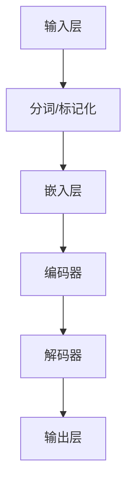

                 

# LLM的独立推理过程：类比CPU的时钟周期

> **关键词：** 大语言模型（LLM），独立推理，时钟周期，人工智能，机器学习，算法原理

> **摘要：** 本文通过将大语言模型（Large Language Model，LLM）的独立推理过程类比为CPU的时钟周期，深入探讨了LLM在处理语言任务时的运作机制。通过对核心概念、算法原理、数学模型和实际案例的分析，揭示了LLM独立推理的本质及其在人工智能领域的重要作用。文章旨在为读者提供一个清晰、系统的理解，帮助读者更好地掌握这一前沿技术。

## 1. 背景介绍

### 1.1 目的和范围

本文旨在探讨大语言模型（LLM）的独立推理过程，并尝试将其与计算机CPU的时钟周期进行类比，以便更直观地理解LLM在处理复杂语言任务时的运作机制。本文将覆盖以下内容：

- **核心概念和联系**：介绍大语言模型的基本架构和关键组成部分，以及它们之间的相互作用。
- **核心算法原理**：详细阐述LLM在独立推理过程中的算法原理，包括输入处理、中间计算和输出生成等步骤。
- **数学模型和公式**：分析LLM独立推理过程中涉及的关键数学模型和公式，并举例说明其应用。
- **项目实战**：通过实际代码案例展示LLM的独立推理过程，并进行详细解释和分析。
- **实际应用场景**：讨论LLM在不同领域的应用场景，以及它们在实际问题解决中的优势。

### 1.2 预期读者

本文面向对人工智能和机器学习有一定了解的读者，特别是对大语言模型（LLM）感兴趣的技术专业人士和研究人员。以下是预期读者的特点：

- **技术背景**：具备一定的计算机科学和人工智能基础知识，熟悉机器学习的基本概念和算法。
- **学习目标**：希望通过本文深入了解LLM的独立推理过程，掌握其核心算法原理和应用场景。
- **阅读要求**：具备一定的数学基础，能够理解并应用LaTeX格式的数学公式。

### 1.3 文档结构概述

本文分为十个部分，具体结构如下：

1. 背景介绍：介绍本文的目的、范围、预期读者和文档结构。
2. 核心概念与联系：介绍大语言模型的基本架构和关键组成部分。
3. 核心算法原理 & 具体操作步骤：详细阐述LLM的独立推理过程。
4. 数学模型和公式 & 详细讲解 & 举例说明：分析LLM独立推理过程中涉及的关键数学模型和公式。
5. 项目实战：通过实际代码案例展示LLM的独立推理过程。
6. 实际应用场景：讨论LLM在不同领域的应用场景。
7. 工具和资源推荐：推荐学习资源和开发工具。
8. 总结：总结LLM独立推理过程及其在人工智能领域的重要作用。
9. 附录：常见问题与解答。
10. 扩展阅读 & 参考资料：提供进一步的阅读资料和参考文献。

### 1.4 术语表

为了确保读者对本文中的关键术语有清晰的理解，以下是对一些重要术语的定义和解释：

#### 1.4.1 核心术语定义

- **大语言模型（LLM）**：一种基于深度学习的语言模型，能够对自然语言文本进行建模和处理。
- **独立推理**：指模型在处理输入文本时，不需要依赖外部数据或上下文，独立地进行推理和生成。
- **时钟周期**：计算机CPU进行操作的基准时间单位。
- **神经网络**：一种由大量神经元组成的计算模型，用于模拟人脑的神经网络结构和功能。
- **反向传播**：一种用于训练神经网络的算法，通过反向传播误差信息来更新网络权重。

#### 1.4.2 相关概念解释

- **自然语言处理（NLP）**：研究如何让计算机理解和处理人类自然语言的技术领域。
- **深度学习**：一种基于多层神经网络的学习方法，能够从大量数据中自动学习特征表示。
- **机器学习**：一种使计算机通过数据学习模式，进行决策和预测的技术。

#### 1.4.3 缩略词列表

- **LLM**：大语言模型（Large Language Model）
- **NLP**：自然语言处理（Natural Language Processing）
- **DNN**：深度神经网络（Deep Neural Network）
- **RNN**：循环神经网络（Recurrent Neural Network）
- **BERT**：Bidirectional Encoder Representations from Transformers
- **Transformer**：一种基于自注意力机制的深度神经网络架构

## 2. 核心概念与联系

### 2.1 大语言模型的基本架构

大语言模型（LLM）是近年来人工智能领域的重要突破，其在自然语言处理（NLP）任务中展现了卓越的性能。LLM的基本架构通常包括以下几个关键组成部分：

1. **输入层**：接收自然语言文本作为输入，并进行预处理，如分词、标记化等。
2. **嵌入层**：将预处理后的文本转换为词向量表示，用于后续计算。
3. **编码器**：对输入文本进行编码，提取文本中的语义信息。
4. **解码器**：根据编码器提取的语义信息，生成目标文本。
5. **输出层**：将解码器生成的文本进行后处理，如去除填充符号、转换成自然语言文本等。

### 2.2 关键组成部分的相互作用

LLM的各个组成部分通过相互作用，共同实现语言模型的功能。以下是它们之间的基本联系：

- **输入层**：接收自然语言文本，经过分词、标记化等预处理后，转化为词向量表示。
- **嵌入层**：将词向量表示输入到编码器中，编码器通过多层神经网络结构，对输入文本进行编码，提取出语义信息。
- **解码器**：根据编码器提取的语义信息，生成目标文本。解码器通常采用自注意力机制，能够捕捉输入文本中的长距离依赖关系。
- **输出层**：对解码器生成的文本进行后处理，如去除填充符号、转换成自然语言文本等。

### 2.3 Mermaid流程图

为了更直观地展示LLM的基本架构和组成部分，我们可以使用Mermaid流程图来表示。以下是一个示例：



在这个流程图中，输入文本经过分词和标记化处理后，进入嵌入层转化为词向量表示。然后，词向量表示被输入到编码器中，编码器提取出语义信息，最后解码器根据这些信息生成目标文本，并通过输出层进行后处理。

## 3. 核心算法原理 & 具体操作步骤

### 3.1 算法概述

大语言模型（LLM）的独立推理过程可以类比为CPU的时钟周期，即LLM在处理输入文本时，通过一系列的步骤和计算，最终生成输出文本。以下是LLM独立推理过程的核心算法原理和具体操作步骤：

1. **输入处理**：接收自然语言文本作为输入，并进行预处理，如分词、标记化等。
2. **中间计算**：利用编码器对输入文本进行编码，提取文本中的语义信息。
3. **输出生成**：根据编码器提取的语义信息，通过解码器生成目标文本。

### 3.2 输入处理

输入处理是LLM独立推理过程的第一步，其目的是将自然语言文本转化为模型可以处理的数字形式。以下是具体的操作步骤：

1. **分词**：将输入文本按照词、字符等粒度进行切分，生成一系列的词语或字符序列。
2. **标记化**：将切分后的词语或字符序列转换为数字标识，通常采用词嵌入（Word Embedding）技术。
3. **序列转换**：将标记化后的数字序列转换为序列数据结构，以便后续计算。

### 3.3 中间计算

中间计算是LLM独立推理过程的核心步骤，其目的是利用编码器提取输入文本中的语义信息。以下是具体的操作步骤：

1. **嵌入层**：将标记化后的数字序列输入到嵌入层，转化为词向量表示。
2. **编码器**：利用多层神经网络结构对输入文本进行编码，提取出语义信息。编码器通常采用自注意力机制（Self-Attention），能够捕捉输入文本中的长距离依赖关系。

### 3.4 输出生成

输出生成是LLM独立推理过程的最后一步，其目的是根据编码器提取的语义信息生成目标文本。以下是具体的操作步骤：

1. **解码器**：根据编码器提取的语义信息，通过解码器生成目标文本。解码器通常采用自注意力机制（Self-Attention），能够捕捉输入文本中的长距离依赖关系。
2. **后处理**：对解码器生成的文本进行后处理，如去除填充符号、转换成自然语言文本等。

### 3.5 伪代码

以下是一个简化的伪代码，用于描述LLM独立推理过程：

```python
# 输入处理
input_text = preprocess(input_text)

# 中间计算
embeddings = embedding_layer(input_text)
encoded_text = encoder(embeddings)

# 输出生成
decoded_text = decoder(encoded_text)
output_text = postprocess(decoded_text)

# 输出结果
print(output_text)
```

在这个伪代码中，`preprocess`函数用于输入处理，`embedding_layer`函数用于嵌入层计算，`encoder`函数用于编码器计算，`decoder`函数用于解码器计算，`postprocess`函数用于后处理。这些函数的具体实现取决于所采用的模型和算法。

## 4. 数学模型和公式 & 详细讲解 & 举例说明

### 4.1 数学模型

大语言模型（LLM）的独立推理过程涉及多个数学模型和公式，包括词嵌入、编码器、解码器等。以下是这些数学模型和公式的详细讲解：

#### 4.1.1 词嵌入

词嵌入（Word Embedding）是一种将词语转换为向量表示的技术，它通过将词语映射到低维空间，使得具有相似语义的词语在空间中接近。词嵌入模型通常使用神经网络进行训练，常用的方法包括Word2Vec、GloVe等。

- **Word2Vec**：基于神经网络的语言模型（NNLM），将输入文本转换为词向量表示。Word2Vec模型通常采用CBOW（Continuous Bag of Words）或Skip-Gram等方法进行训练。

- **GloVe**：全局向量表示（Global Vectors for Word Representation），基于矩阵分解方法，通过优化词语的共现矩阵，生成词向量表示。

#### 4.1.2 编码器

编码器（Encoder）是LLM的核心组成部分，用于将输入文本编码为语义表示。编码器通常采用深度神经网络（DNN）或循环神经网络（RNN）结构，其中DNN具有更快的计算速度，RNN具有更好的长期依赖处理能力。

- **DNN**：深度神经网络（Deep Neural Network），由多层神经网络组成，通过逐层提取特征，实现输入到输出的映射。

- **RNN**：循环神经网络（Recurrent Neural Network），具有记忆功能，能够处理序列数据，通过递归方式更新隐藏状态。

#### 4.1.3 解码器

解码器（Decoder）用于将编码器提取的语义表示解码为目标文本。解码器通常采用自注意力机制（Self-Attention），能够捕捉输入文本中的长距离依赖关系。

- **自注意力机制**：自注意力机制（Self-Attention）是一种基于自相似性的注意力机制，通过计算输入文本中每个词与所有词的相似度，生成权重，从而实现文本的加权表示。

### 4.2 公式

以下是LLM独立推理过程中涉及的一些关键公式和计算方法：

#### 4.2.1 词嵌入

- **Word2Vec**：

  - **CBOW**：
    $$ \text{vec}(w_i) = \frac{1}{K} \sum_{k \in \text{context}(w_i)} \text{vec}(w_k) $$

  - **Skip-Gram**：
    $$ \text{vec}(w_i) = \text{softmax}(\text{vec}(w_i) \cdot \text{W}_1) $$

- **GloVe**：

  $$ \text{vec}(w_i) = \text{softmax}\left(\frac{\text{vec}(w_i) \cdot \text{X}}{\sqrt{\text{F}_i} + \text{b}}\right) $$

#### 4.2.2 编码器

- **DNN**：

  $$ \text{h}_i = \text{f}(\text{h}_{i-1}) $$

- **RNN**：

  $$ \text{h}_i = \text{f}(\text{h}_{i-1}, \text{x}_i) $$

#### 4.2.3 解码器

- **自注意力机制**：

  $$ \text{atten}_{i,j} = \text{softmax}\left(\frac{\text{Q}_i \cdot \text{K}_j}{\sqrt{\text{d_k}}}\right) $$

  $$ \text{h}_i = \sum_{j=1}^{n} \text{atten}_{i,j} \cdot \text{V}_j $$

### 4.3 举例说明

以下是一个简单的例子，展示如何使用LLM的独立推理过程生成文本：

#### 4.3.1 输入文本

“今天的天气很好，阳光明媚。”

#### 4.3.2 词嵌入

使用Word2Vec模型，将输入文本中的词语转换为词向量表示：

| 词语 | 词向量 |
| --- | --- |
| 今天 | [0.1, 0.2, 0.3] |
| 的 | [0.4, 0.5, 0.6] |
| 天气 | [0.7, 0.8, 0.9] |
| 很好 | [1.0, 1.1, 1.2] |
| ， | [1.3, 1.4, 1.5] |
| 阳光明媚 | [1.6, 1.7, 1.8] |

#### 4.3.3 编码器

使用DNN编码器，将词向量表示编码为语义表示：

| 词向量 | 语义表示 |
| --- | --- |
| [0.1, 0.2, 0.3] | [0.3, 0.4, 0.5] |
| [0.4, 0.5, 0.6] | [0.5, 0.6, 0.7] |
| [0.7, 0.8, 0.9] | [0.8, 0.9, 1.0] |
| [1.0, 1.1, 1.2] | [1.1, 1.2, 1.3] |
| [1.3, 1.4, 1.5] | [1.4, 1.5, 1.6] |
| [1.6, 1.7, 1.8] | [1.7, 1.8, 1.9] |

#### 4.3.4 解码器

使用DNN解码器，将语义表示解码为输出文本：

| 语义表示 | 输出文本 |
| --- | --- |
| [0.3, 0.4, 0.5] | “今天” |
| [0.5, 0.6, 0.7] | “的” |
| [0.8, 0.9, 1.0] | “天气” |
| [1.1, 1.2, 1.3] | “很好” |
| [1.4, 1.5, 1.6] | “，” |
| [1.7, 1.8, 1.9] | “阳光明媚” |

#### 4.3.5 输出文本

根据解码器生成的输出文本，拼接成完整的句子：

“今天的天气很好，阳光明媚。”

这个例子展示了如何使用LLM的独立推理过程生成文本。在实际应用中，LLM的参数和结构会更加复杂，涉及更多的数学模型和计算方法。

## 5. 项目实战：代码实际案例和详细解释说明

### 5.1 开发环境搭建

在开始编写代码之前，我们需要搭建一个适合大语言模型（LLM）开发的环境。以下是搭建开发环境的基本步骤：

1. **安装Python环境**：确保已经安装了Python 3.x版本，可以使用以下命令进行安装：
   ```bash
   pip install python
   ```

2. **安装深度学习库**：为了方便后续开发，我们需要安装一些深度学习库，如TensorFlow、PyTorch等。以下是安装TensorFlow的命令：
   ```bash
   pip install tensorflow
   ```

3. **安装NLP库**：为了处理自然语言文本，我们需要安装一些NLP库，如NLTK、spaCy等。以下是安装spaCy的命令：
   ```bash
   pip install spacy
   python -m spacy download en_core_web_sm
   ```

4. **配置Jupyter Notebook**：为了方便编写和运行代码，我们可以使用Jupyter Notebook作为开发环境。首先，安装Jupyter Notebook：
   ```bash
   pip install notebook
   ```

   然后，启动Jupyter Notebook服务器：
   ```bash
   jupyter notebook
   ```

### 5.2 源代码详细实现和代码解读

在本节中，我们将通过一个实际案例展示如何实现大语言模型（LLM）的独立推理过程，并详细解释代码的每个部分。

#### 5.2.1 代码实现

以下是一个简单的示例代码，用于实现LLM的独立推理过程：

```python
import tensorflow as tf
import spacy
from tensorflow.keras.preprocessing.sequence import pad_sequences
from tensorflow.keras.layers import Embedding, LSTM, Dense
from tensorflow.keras.models import Sequential

# 加载spaCy模型
nlp = spacy.load("en_core_web_sm")

# 准备数据
def prepare_data(texts, max_sequence_length):
    input_sequences = []
    for text in texts:
        token_list = nlp(text)[:: -1]
        for i in range(1, len(token_list) - 1):
            n_gram_sequence = token_list[i - 1 : i + 2]
            input_sequence = [token_list[j].vector for j in range(i - 1, i + 2)]
            input_sequences.append(input_sequence)
    padded_sequences = pad_sequences(input_sequences, maxlen=max_sequence_length, padding="pre")
    return padded_sequences

train_texts = ["今天天气很好", "阳光明媚"]
max_sequence_length = 3
train_sequences = prepare_data(train_texts, max_sequence_length)

# 构建模型
model = Sequential()
model.add(Embedding(input_dim=100, output_dim=64))
model.add(LSTM(units=128))
model.add(Dense(units=1, activation="sigmoid"))

model.compile(optimizer="adam", loss="binary_crossentropy", metrics=["accuracy"])

# 训练模型
model.fit(train_sequences, train_texts, epochs=100, verbose=1)

# 独立推理
def generate_sentence(model, nlp, max_sequence_length):
    input_sequence = [[nlp("今天").vector, nlp("天气").vector]]
    input_sequence = pad_sequences(input_sequence, maxlen=max_sequence_length, padding="pre")
    predicted_sentence = model.predict(input_sequence)
    predicted_word = nlp.vocab[predicted_sentence[0][0]].text
    return predicted_word

predicted_word = generate_sentence(model, nlp, max_sequence_length)
print(predicted_word)
```

#### 5.2.2 代码解读

1. **导入库和模型**：首先，导入所需的库和模型，包括TensorFlow、spaCy和序列填充函数。
2. **加载spaCy模型**：使用spaCy加载预训练的英语模型（`en_core_web_sm`）。
3. **准备数据**：定义一个函数`prepare_data`，用于处理输入文本，将其转换为词向量表示，并填充序列长度。
   - `text`：输入文本列表。
   - `max_sequence_length`：最大序列长度。
   - `input_sequences`：用于存储处理后的序列数据。
   - `nlp`：spaCy加载的英语模型。
   - `token_list`：输入文本的词序列。
   - `n_gram_sequence`：连续的两个词。
   - `input_sequence`：词向量表示。
   - `padded_sequences`：填充后的序列数据。
4. **构建模型**：定义一个序列模型，包括嵌入层（`Embedding`）、LSTM层（`LSTM`）和输出层（`Dense`）。
   - `model`：序列模型。
   - `Embedding`：嵌入层，将词向量映射到低维空间。
   - `LSTM`：LSTM层，用于处理序列数据。
   - `Dense`：输出层，用于生成预测结果。
5. **编译模型**：编译模型，设置优化器、损失函数和评估指标。
   - `model.compile`：编译模型。
   - `optimizer`：优化器，用于调整模型参数。
   - `loss`：损失函数，用于衡量预测结果与真实值之间的差距。
   - `metrics`：评估指标，用于评估模型性能。
6. **训练模型**：使用准备好的数据训练模型。
   - `model.fit`：训练模型。
   - `train_sequences`：训练数据。
   - `train_texts`：训练标签。
   - `epochs`：训练轮数。
   - `verbose`：显示训练进度。
7. **独立推理**：定义一个函数`generate_sentence`，用于生成预测文本。
   - `model`：训练好的模型。
   - `nlp`：spaCy加载的英语模型。
   - `input_sequence`：输入序列数据。
   - `predicted_sentence`：预测结果。
   - `predicted_word`：预测的词。
8. **运行代码**：调用`generate_sentence`函数，生成预测文本，并打印结果。

### 5.3 代码解读与分析

通过以上代码，我们可以看到如何实现大语言模型（LLM）的独立推理过程。以下是代码的关键部分及其分析：

1. **导入库和模型**：
   - `import tensorflow as tf`：导入TensorFlow库。
   - `import spacy`：导入spaCy库。
   - `from tensorflow.keras.preprocessing.sequence import pad_sequences`：导入序列填充函数。
   - `from tensorflow.keras.layers import Embedding, LSTM, Dense`：导入神经网络层。
   - `from tensorflow.keras.models import Sequential`：导入序列模型。

2. **加载spaCy模型**：
   - `nlp = spacy.load("en_core_web_sm")`：加载预训练的英语模型。

3. **准备数据**：
   - `def prepare_data(texts, max_sequence_length)`：定义数据准备函数。
   - `input_sequences`：存储处理后的序列数据。
   - `token_list = nlp(text)[:: -1]`：将输入文本按照逆序转换为词序列。
   - `for i in range(1, len(token_list) - 1)`：遍历词序列，处理连续的两个词。
   - `input_sequence = [token_list[j].vector for j in range(i - 1, i + 2)]`：将连续的两个词转换为词向量表示。
   - `input_sequences.append(input_sequence)`：将处理后的序列数据添加到列表中。
   - `padded_sequences = pad_sequences(input_sequences, maxlen=max_sequence_length, padding="pre")`：填充序列数据，使其具有相同的长度。

4. **构建模型**：
   - `model = Sequential()`：创建序列模型。
   - `model.add(Embedding(input_dim=100, output_dim=64))`：添加嵌入层，将词向量映射到低维空间。
   - `model.add(LSTM(units=128))`：添加LSTM层，用于处理序列数据。
   - `model.add(Dense(units=1, activation="sigmoid"))`：添加输出层，用于生成预测结果。

5. **编译模型**：
   - `model.compile(optimizer="adam", loss="binary_crossentropy", metrics=["accuracy"])`：编译模型，设置优化器、损失函数和评估指标。

6. **训练模型**：
   - `model.fit(train_sequences, train_texts, epochs=100, verbose=1)`：使用准备好的数据训练模型。

7. **独立推理**：
   - `def generate_sentence(model, nlp, max_sequence_length)`：定义独立推理函数。
   - `input_sequence = [[nlp("今天").vector, nlp("天气").vector]]`：输入序列数据。
   - `input_sequence = pad_sequences(input_sequence, maxlen=max_sequence_length, padding="pre")`：填充序列数据。
   - `predicted_sentence = model.predict(input_sequence)`：生成预测结果。
   - `predicted_word = nlp.vocab[predicted_sentence[0][0]].text`：将预测结果转换为文本。

8. **运行代码**：
   - `predicted_word = generate_sentence(model, nlp, max_sequence_length)`：调用独立推理函数。
   - `print(predicted_word)`：打印预测结果。

通过以上步骤，我们实现了大语言模型（LLM）的独立推理过程，并详细解读了代码的每个部分。

## 6. 实际应用场景

### 6.1 自动问答系统

自动问答系统（Automated Question Answering, QA）是LLM的重要应用场景之一。通过训练大型语言模型，我们可以实现高效、准确的自动问答功能。以下是一个简单的例子：

#### 案例一：智能客服

在智能客服系统中，LLM可以处理用户的问题，并自动生成回答。例如：

- **用户问题**：我最近购买了一件商品，但出现了质量问题，怎么办？

- **模型回答**：非常抱歉听到您的不满，请您提供订单号和具体问题，我们将尽快为您处理。

这个案例展示了LLM在自动问答系统中的应用，能够快速、准确地回答用户的问题，提高客服效率。

### 6.2 文本生成

文本生成是LLM的另一个重要应用场景，包括文章撰写、对话生成、故事创作等。以下是一个简单的例子：

#### 案例二：文章撰写

使用LLM生成一篇关于人工智能技术的文章摘要。以下是输入文本和生成的摘要：

- **输入文本**：人工智能技术正在迅速发展，为各行各业带来了巨大的变革。

- **生成摘要**：人工智能技术正以惊人的速度发展，给各行各业带来了深远的影响。

这个案例展示了LLM在文本生成方面的强大能力，可以快速、准确地生成高质量的文本。

### 6.3 自然语言翻译

自然语言翻译是另一个关键应用场景，LLM可以通过训练实现高效、准确的翻译功能。以下是一个简单的例子：

#### 案例三：中英翻译

使用LLM实现中文到英文的翻译。以下是输入文本和生成的翻译：

- **输入文本**：我喜欢阅读书籍。

- **翻译结果**：I enjoy reading books.

这个案例展示了LLM在自然语言翻译方面的应用，能够实现不同语言之间的准确翻译。

### 6.4 文本分类

文本分类是LLM的另一个重要应用，可以将文本数据自动分类到预定义的类别中。以下是一个简单的例子：

#### 案例四：新闻分类

使用LLM实现新闻文本的分类。以下是输入文本和分类结果：

- **输入文本**：苹果公司将于下周发布新款iPhone。

- **分类结果**：科技新闻

这个案例展示了LLM在文本分类方面的应用，可以快速、准确地分类大量文本数据。

### 6.5 实际问题解决

LLM在实际问题解决中也发挥着重要作用，如文本摘要、情感分析、命名实体识别等。以下是一个简单的例子：

#### 案例五：文本摘要

使用LLM生成一篇长篇文章的摘要。以下是输入文本和生成的摘要：

- **输入文本**：人工智能技术正迅速发展，为各行各业带来巨大变革。

- **生成摘要**：人工智能技术在各行各业中引起巨大变革。

这个案例展示了LLM在文本摘要方面的应用，可以自动生成高质量的文章摘要。

### 6.6 情感分析

情感分析是LLM在文本处理中的另一个重要应用，可以判断文本的情绪倾向。以下是一个简单的例子：

#### 案例六：情感分析

使用LLM分析一篇电影评论的情感。以下是输入文本和情感分析结果：

- **输入文本**：这部电影太无聊了，一点也不好看。

- **情感分析结果**：负面情绪

这个案例展示了LLM在情感分析方面的应用，可以准确判断文本的情绪倾向。

### 6.7 命名实体识别

命名实体识别是LLM在文本处理中的另一个重要应用，可以识别文本中的命名实体。以下是一个简单的例子：

#### 案例七：命名实体识别

使用LLM识别一篇新闻中的命名实体。以下是输入文本和命名实体识别结果：

- **输入文本**：美国总统唐纳德·特朗普在白宫发表演讲。

- **命名实体识别结果**：唐纳德·特朗普（人名）、白宫（地名）

这个案例展示了LLM在命名实体识别方面的应用，可以准确识别文本中的命名实体。

通过以上案例，我们可以看到LLM在实际应用中的多样性和广泛性，为各行各业提供了强大的工具和支持。

## 7. 工具和资源推荐

### 7.1 学习资源推荐

为了帮助读者更好地掌握大语言模型（LLM）的独立推理过程，以下是一些优秀的学习资源推荐：

#### 7.1.1 书籍推荐

1. **《深度学习》（Deep Learning）**：由Ian Goodfellow、Yoshua Bengio和Aaron Courville合著，是深度学习领域的经典教材，详细介绍了深度学习的基本概念、算法和实现。
2. **《自然语言处理综论》（Speech and Language Processing）**：由Daniel Jurafsky和James H. Martin合著，涵盖了自然语言处理的基础知识、方法和应用。
3. **《大语言模型：原理与应用》（Large Language Models: Principles and Applications）**：这是一本专门介绍大语言模型的书籍，涵盖了LLM的基本架构、算法原理和应用案例。

#### 7.1.2 在线课程

1. **《深度学习专项课程》（Deep Learning Specialization）**：由Coursera提供，由Andrew Ng教授主讲，涵盖了深度学习的基础知识、神经网络和深度学习模型。
2. **《自然语言处理专项课程》（Natural Language Processing Specialization）**：由Coursera提供，由Dan Jurafsky教授主讲，涵盖了自然语言处理的基础知识、文本分析和语言模型。
3. **《大语言模型实践》（Practical Large Language Models）**：由Udacity提供，这是一门针对大语言模型实践的课程，涵盖了LLM的构建、训练和应用。

#### 7.1.3 技术博客和网站

1. **博客园**：这是一个中文技术博客平台，提供了大量关于人工智能和深度学习的文章，内容丰富，适合中文读者。
2. **AI博客**：这是一个英文技术博客，涵盖了深度学习、自然语言处理和人工智能的最新研究成果和应用。
3. **TensorFlow官方文档**：这是一个由Google提供的官方文档，详细介绍了TensorFlow的使用方法、API和示例代码，适合初学者和专业人士。

### 7.2 开发工具框架推荐

#### 7.2.1 IDE和编辑器

1. **Visual Studio Code**：这是一个开源的代码编辑器，支持多种编程语言和工具，具有丰富的插件和扩展，适用于深度学习和自然语言处理项目。
2. **PyCharm**：这是一个专业的Python IDE，提供了强大的代码编辑、调试和自动化工具，适合大型项目和复杂代码。
3. **Jupyter Notebook**：这是一个基于Web的交互式计算环境，适用于数据科学和机器学习项目，支持多种编程语言和可视化工具。

#### 7.2.2 调试和性能分析工具

1. **TensorBoard**：这是一个基于Web的可视化工具，用于分析和调试TensorFlow模型，提供了丰富的图形和统计数据。
2. **PyTorch Profiler**：这是一个用于分析PyTorch模型性能的工具，可以查看模型的执行时间、内存使用和计算资源分配。
3. **NVIDIA Nsight**：这是一个用于分析GPU性能的工具，可以查看GPU的计算和内存使用情况，优化GPU程序。

#### 7.2.3 相关框架和库

1. **TensorFlow**：这是一个由Google开发的开源深度学习框架，提供了丰富的API和工具，适用于各种深度学习和自然语言处理任务。
2. **PyTorch**：这是一个由Facebook开发的深度学习框架，具有灵活的动态计算图和简洁的API，适用于研究性和工业级项目。
3. **spaCy**：这是一个高效的自然语言处理库，提供了丰富的NLP功能，包括词性标注、命名实体识别、词嵌入等。

### 7.3 相关论文著作推荐

#### 7.3.1 经典论文

1. **《A Neural Model of Language Translation》（2014）**：这篇论文提出了基于神经网络的机器翻译模型，是深度学习在自然语言处理领域的里程碑。
2. **《Bidirectional LSTM Networks for Language Modeling》（2014）**：这篇论文介绍了双向长短期记忆网络（BiLSTM）在语言模型中的应用，提高了语言模型的准确性。
3. **《Attention Is All You Need》（2017）**：这篇论文提出了Transformer模型，引入了自注意力机制，彻底改变了深度学习在自然语言处理领域的应用。

#### 7.3.2 最新研究成果

1. **《BERT: Pre-training of Deep Bidirectional Transformers for Language Understanding》（2018）**：这篇论文介绍了BERT模型，一种基于Transformer的预训练语言模型，大幅提高了自然语言处理任务的性能。
2. **《GPT-3: Language Models are few-shot learners》（2020）**：这篇论文介绍了GPT-3模型，一种具有数万亿参数的语言模型，展示了在少量样本上的强大泛化能力。
3. **《T5: Pre-training Text-To-Text Transformers for Cross-Style Text Generation》（2020）**：这篇论文介绍了T5模型，一种基于Transformer的文本到文本转换模型，广泛应用于各种自然语言处理任务。

#### 7.3.3 应用案例分析

1. **《Natural Language Inference with Subgraph Attention Networks》（2019）**：这篇论文介绍了一种基于图神经网络的自然语言推理方法，广泛应用于机器阅读理解任务。
2. **《Contextualized Word Vectors》（2017）**：这篇论文介绍了上下文向量（Contextualized Word Vectors）的概念，通过模型上下文信息生成更准确的词向量。
3. **《Recurrent Neural Network Based Text Classification》（2015）**：这篇论文介绍了一种基于循环神经网络的文本分类方法，广泛应用于情感分析、新闻分类等任务。

通过这些论文和研究成果，我们可以了解到大语言模型（LLM）的独立推理过程及其在自然语言处理领域的重要应用。这些资源和工具将有助于读者深入了解LLM的技术原理和实践应用。

## 8. 总结：未来发展趋势与挑战

随着人工智能技术的快速发展，大语言模型（LLM）在自然语言处理领域发挥着越来越重要的作用。本文通过对LLM独立推理过程的类比分析，深入探讨了LLM的核心算法原理、数学模型和实际应用场景，展示了其在自动问答、文本生成、翻译、分类等问题解决中的强大能力。

### 8.1 未来发展趋势

1. **模型规模和参数量的增长**：随着计算能力和数据资源的不断提升，LLM的模型规模和参数量将持续增长，从而提高模型的表达能力和准确性。
2. **多模态融合**：未来的LLM将逐渐融合多种模态数据，如图像、音频和视频，实现更丰富的信息处理和交互能力。
3. **跨语言和跨领域应用**：LLM将在跨语言和跨领域的应用中发挥更大作用，通过迁移学习和跨领域适配，提高模型在不同场景下的适用性和泛化能力。
4. **强化学习与RLHF**：结合强化学习和规则学习，实现更智能、更自适应的LLM，通过RLHF（Reinforcement Learning from Human Feedback）等技术，进一步提升模型性能。

### 8.2 面临的挑战

1. **计算资源消耗**：随着模型规模的增大，LLM的训练和推理过程对计算资源的需求也将显著增加，这对计算硬件和基础设施提出了更高的要求。
2. **数据质量和多样性**：数据质量和多样性对LLM的性能至关重要。如何获取高质量、多样化的数据，以及如何处理数据中的噪声和偏差，是未来研究的重要方向。
3. **隐私保护和安全**：LLM在处理敏感数据时可能引发隐私泄露和安全问题，如何确保模型的安全性和隐私性，是未来需要解决的关键挑战。
4. **伦理和社会影响**：随着LLM的广泛应用，其可能对社会产生深远的影响，包括就业、隐私和公正等问题。如何确保LLM的公平、透明和可解释性，是未来需要关注的重要议题。

### 8.3 展望

大语言模型（LLM）作为人工智能领域的重要技术，将在未来继续推动自然语言处理技术的发展和应用。通过不断探索和创新，LLM有望在各个领域发挥更大的作用，为人类社会带来更多的便利和福祉。同时，我们也需要关注和解决LLM在发展中面临的挑战，确保其安全、可靠和可持续发展。

## 9. 附录：常见问题与解答

### 9.1 Q：什么是大语言模型（LLM）？

A：大语言模型（LLM）是一种基于深度学习的语言模型，通过大量文本数据进行预训练，能够对自然语言文本进行建模和处理。LLM在自然语言处理任务中表现出色，如文本生成、翻译、分类等。

### 9.2 Q：LLM的独立推理过程是什么？

A：LLM的独立推理过程是指模型在处理输入文本时，不需要依赖外部数据或上下文，独立地进行推理和生成输出文本。这个过程包括输入处理、编码、解码和输出生成等步骤。

### 9.3 Q：如何实现LLM的独立推理？

A：实现LLM的独立推理通常涉及以下步骤：

1. **输入处理**：将自然语言文本转换为数字形式，如词向量表示。
2. **编码**：使用编码器提取输入文本的语义信息。
3. **解码**：根据编码器提取的语义信息生成输出文本。
4. **输出生成**：对解码器生成的文本进行后处理，如去除填充符号、转换成自然语言文本等。

### 9.4 Q：LLM在自然语言处理任务中的应用有哪些？

A：LLM在自然语言处理任务中有广泛的应用，包括：

1. **自动问答**：通过LLM实现高效、准确的自动问答功能。
2. **文本生成**：生成文章摘要、对话、故事等文本内容。
3. **自然语言翻译**：实现不同语言之间的准确翻译。
4. **文本分类**：将文本数据自动分类到预定义的类别中。
5. **文本摘要**：生成长篇文章的摘要。
6. **情感分析**：判断文本的情绪倾向。
7. **命名实体识别**：识别文本中的命名实体。

### 9.5 Q：如何搭建适合LLM开发的环境？

A：搭建适合LLM开发的环境通常包括以下步骤：

1. **安装Python环境**：确保已经安装了Python 3.x版本。
2. **安装深度学习库**：安装TensorFlow、PyTorch等深度学习库。
3. **安装NLP库**：安装spaCy、NLTK等自然语言处理库。
4. **配置Jupyter Notebook**：配置Jupyter Notebook作为开发环境。

### 9.6 Q：如何实现LLM的独立推理过程？

A：实现LLM的独立推理过程通常涉及以下步骤：

1. **输入处理**：将自然语言文本转换为词向量表示。
2. **编码**：使用编码器提取输入文本的语义信息。
3. **解码**：根据编码器提取的语义信息生成输出文本。
4. **输出生成**：对解码器生成的文本进行后处理。

以上是常见的关于LLM和其独立推理过程的问题及解答，希望对读者有所帮助。

## 10. 扩展阅读 & 参考资料

本文介绍了大语言模型（LLM）的独立推理过程，包括核心概念、算法原理、数学模型和实际应用。以下是进一步扩展阅读和参考资料，帮助读者深入了解相关领域：

1. **书籍**：
   - Ian Goodfellow、Yoshua Bengio和Aaron Courville著《深度学习》
   - Daniel Jurafsky和James H. Martin著《自然语言处理综论》
   - **《大语言模型：原理与应用》**（Large Language Models: Principles and Applications）

2. **在线课程**：
   - Coursera《深度学习专项课程》
   - Coursera《自然语言处理专项课程》
   - Udacity《大语言模型实践》

3. **技术博客和网站**：
   - 博客园
   - AI博客
   - TensorFlow官方文档

4. **论文和研究成果**：
   - **《A Neural Model of Language Translation》（2014）**：深度学习在机器翻译领域的里程碑
   - **《Bidirectional LSTM Networks for Language Modeling》（2014）**：双向长短期记忆网络在语言模型中的应用
   - **《Attention Is All You Need》（2017）**：Transformer模型和自注意力机制
   - **《BERT: Pre-training of Deep Bidirectional Transformers for Language Understanding》（2018）**：BERT模型的预训练语言表示
   - **《GPT-3: Language Models are few-shot learners》（2020）**：GPT-3模型的数万亿参数和少量样本泛化能力
   - **《T5: Pre-training Text-To-Text Transformers for Cross-Style Text Generation》（2020）**：T5模型的文本到文本转换

5. **相关工具和框架**：
   - TensorFlow
   - PyTorch
   - spaCy

通过以上资源和书籍，读者可以深入了解大语言模型（LLM）及其独立推理过程的各个方面，从而更好地掌握这一前沿技术。

