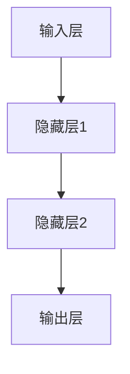
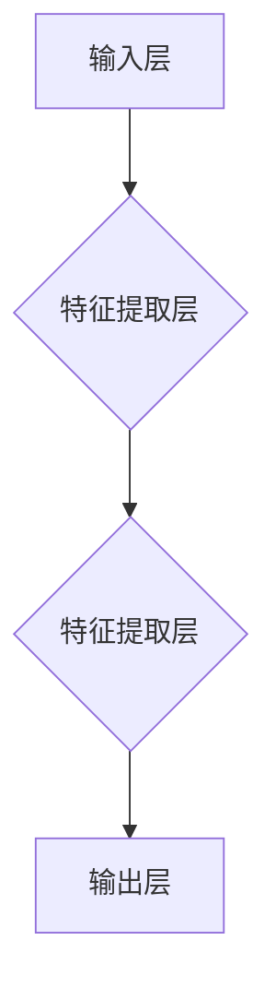
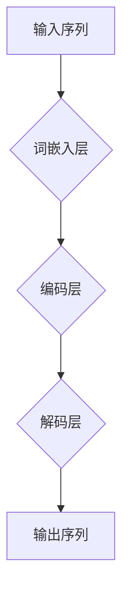
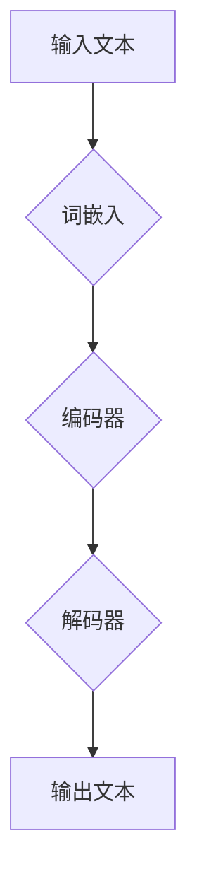

                 

# LLM的监管与治理框架构建

> **关键词：** 人工神经网络、语言模型、监管框架、治理、安全性与伦理、责任分配

> **摘要：** 本文旨在探讨大规模语言模型（LLM）的监管与治理框架构建。文章首先介绍了LLM的基本原理和重要性，随后分析了现有监管框架的不足，提出了一个全面的监管与治理框架，涵盖了技术、法律、伦理和社会等方面。本文还通过实际案例和数学模型，详细阐述了监管与治理的实施步骤和关键要素，为LLM的健康发展提供了理论和实践参考。

## 1. 背景介绍

### 1.1 目的和范围

本文的目的在于为大规模语言模型（LLM）提供一个全面、有效的监管与治理框架。随着人工智能技术的飞速发展，LLM作为一种强大的自然语言处理工具，已经在众多领域展现出巨大的潜力。然而，其广泛应用也带来了一系列问题，如数据安全、隐私保护、偏见消除、责任归属等。因此，构建一个科学、合理的监管与治理框架，对于确保LLM的健康发展具有重要意义。

本文的研究范围主要包括以下几个方面：

1. **技术层面**：探讨LLM的核心算法原理，分析其在实际应用中的技术挑战。
2. **法律层面**：分析现有法律法规对LLM的监管，评估其适用性和有效性。
3. **伦理层面**：讨论LLM在伦理方面的挑战，包括隐私保护、偏见消除等。
4. **社会层面**：研究LLM对社会的影响，如就业、教育和文化传播等。

### 1.2 预期读者

本文预期读者主要包括：

1. **人工智能研究人员**：对LLM的技术原理和应用场景有深入了解，希望了解监管与治理方面的最新研究和实践。
2. **政策制定者**：关注人工智能政策法规的制定，希望从本文中得到有关LLM监管与治理的有价值参考。
3. **企业高管**：负责AI项目的管理和决策，希望了解LLM的监管与治理框架，确保项目的合规性和可持续性。
4. **公众**：对AI技术有一定了解，关注人工智能技术对社会的影响，希望了解LLM的监管与治理现状和未来发展趋势。

### 1.3 文档结构概述

本文共分为十个部分，具体结构如下：

1. **背景介绍**：介绍本文的目的、范围、预期读者和文档结构。
2. **核心概念与联系**：阐述LLM的核心概念，包括人工神经网络、语言模型等，并使用Mermaid流程图展示其原理和架构。
3. **核心算法原理与具体操作步骤**：详细讲解LLM的核心算法原理，使用伪代码阐述具体操作步骤。
4. **数学模型和公式**：介绍LLM中的数学模型和公式，并进行详细讲解和举例说明。
5. **项目实战**：通过实际案例，展示LLM的开发过程和代码实现。
6. **实际应用场景**：分析LLM在不同领域的应用场景。
7. **工具和资源推荐**：推荐学习资源和开发工具。
8. **相关论文著作推荐**：介绍经典论文和最新研究成果。
9. **总结**：展望LLM的未来发展趋势和挑战。
10. **附录**：提供常见问题与解答，以及扩展阅读和参考资料。

### 1.4 术语表

#### 1.4.1 核心术语定义

- **大规模语言模型（LLM）**：一种基于人工神经网络的自然语言处理模型，能够对自然语言文本进行生成、理解和预测。
- **人工神经网络（ANN）**：一种模拟人脑神经元连接方式的计算模型，通过学习和训练，能够实现复杂的非线性函数。
- **深度学习（DL）**：一种基于人工神经网络的机器学习技术，通过多层神经网络，实现对数据的自动特征提取和建模。
- **监督学习（SL）**：一种机器学习方法，通过已标记的数据进行训练，以预测未知数据的标签。
- **非监督学习（UL）**：一种机器学习方法，通过未标记的数据进行训练，以发现数据中的模式和结构。
- **伦理**：关于道德原则和价值观的研究，涉及人类行为和决策的道德判断。

#### 1.4.2 相关概念解释

- **数据安全**：保护数据免受未授权访问、使用、披露、破坏、修改或破坏的措施。
- **隐私保护**：保护个人隐私，防止个人信息被未经授权的收集、使用或泄露。
- **偏见消除**：消除模型在训练数据中可能存在的偏见，确保模型在处理不同群体数据时的公平性。
- **责任归属**：确定在发生问题时，责任应由谁承担。

#### 1.4.3 缩略词列表

- **LLM**：大规模语言模型
- **ANN**：人工神经网络
- **DL**：深度学习
- **SL**：监督学习
- **UL**：非监督学习
- **IDE**：集成开发环境
- **GPU**：图形处理单元
- **API**：应用程序编程接口
- **AI**：人工智能
- **ML**：机器学习
- **DL**：深度学习

## 2. 核心概念与联系

在本节中，我们将介绍LLM的核心概念，包括人工神经网络（ANN）、深度学习（DL）、语言模型等，并使用Mermaid流程图展示其原理和架构。

### 2.1 人工神经网络（ANN）

人工神经网络（ANN）是一种模拟人脑神经元连接方式的计算模型。它由多个相互连接的节点（或称为神经元）组成，每个节点通过权重（或称为连接强度）与其他节点相连。通过不断调整权重，神经网络能够学习和适应复杂的数据模式。

**Mermaid流程图：**



### 2.2 深度学习（DL）

深度学习（DL）是一种基于人工神经网络的机器学习技术。它通过多层神经网络，实现对数据的自动特征提取和建模。与传统的机器学习方法相比，深度学习具有更强的学习和泛化能力。

**Mermaid流程图：**



### 2.3 语言模型

语言模型是一种用于预测自然语言序列的统计模型。它通过学习大量文本数据，建立词语之间的关系和概率分布，从而实现对未知文本的生成和预测。

**Mermaid流程图：**



### 2.4 大规模语言模型（LLM）

大规模语言模型（LLM）是基于深度学习的语言模型，具有数十亿甚至千亿级的参数规模。它通过学习海量文本数据，能够生成高质量的自然语言文本，并在各种自然语言处理任务中表现出色。

**Mermaid流程图：**



## 3. 核心算法原理与具体操作步骤

在本节中，我们将详细讲解LLM的核心算法原理，并使用伪代码阐述具体操作步骤。

### 3.1 基本概念

- **词嵌入（Word Embedding）**：将词语映射为向量表示。
- **编码器（Encoder）**：将输入序列编码为固定长度的向量。
- **解码器（Decoder）**：根据编码器输出的向量，生成输出序列。

### 3.2 伪代码

```python
# 输入：输入文本序列X，词汇表V，词嵌入维度d
# 输出：编码后的向量序列C，解码后的文本序列Y

# 步骤1：词嵌入
word_embedding(V, d)

# 步骤2：编码器
for each word in X:
    - 计算词嵌入向量w
    - 将w输入到编码器，得到编码后的向量c

# 步骤3：解码器
for each word in Y:
    - 计算上一个词的编码向量c
    - 输入解码器，生成下一个词的概率分布p
    - 选择概率最高的词作为下一个输出词

# 步骤4：迭代更新权重
for each weight in model:
    - 计算梯度
    - 更新权重
```

### 3.3 具体操作步骤

1. **词嵌入**：将输入文本序列中的每个词映射为向量表示。通常使用预训练的词嵌入模型（如Word2Vec、GloVe等）。
2. **编码器**：将词嵌入向量输入到编码器，通过多层神经网络，将输入序列编码为固定长度的向量。编码器通常采用变换器（Transformer）架构。
3. **解码器**：根据编码器输出的向量，生成输出序列。解码器也采用变换器架构，通过自注意力机制，对编码器的输出进行加权求和。
4. **迭代更新权重**：在训练过程中，通过反向传播算法，计算模型参数的梯度，并使用梯度下降（或其变种）更新权重。

## 4. 数学模型和公式

在本节中，我们将介绍LLM中的数学模型和公式，并进行详细讲解和举例说明。

### 4.1 词嵌入

词嵌入是将词语映射为向量表示的过程。常用的方法包括Word2Vec、GloVe等。

**Word2Vec公式：**

$$
\text{word\_embedding}(w) = \text{sgn}(w^T \cdot v)
$$

其中，$w$为词向量，$v$为词嵌入向量，$sgn$为符号函数。

**GloVe公式：**

$$
\text{word\_embedding}(w) = \text{sigmoid}\left(\frac{\text{dot}(w, v)}{\sqrt{\|w\|^2 + \|v\|^2}}\right)
$$

其中，$w$为词向量，$v$为词嵌入向量，$\text{dot}$为点积运算，$\text{sigmoid}$为Sigmoid函数。

### 4.2 编码器

编码器用于将输入序列编码为固定长度的向量。常用的编码器架构包括循环神经网络（RNN）、长短期记忆网络（LSTM）和变换器（Transformer）。

**RNN公式：**

$$
h_t = \text{tanh}\left(W_h \cdot [h_{t-1}, x_t] + b_h\right)
$$

$$
o_t = W_o \cdot h_t + b_o
$$

其中，$h_t$为编码器在时间步$t$的隐藏状态，$x_t$为输入序列在时间步$t$的词向量，$W_h$和$b_h$为编码器的权重和偏置，$W_o$和$b_o$为输出层的权重和偏置，$\text{tanh}$为双曲正切函数。

**LSTM公式：**

$$
i_t = \text{sigmoid}\left(W_i \cdot [h_{t-1}, x_t] + b_i\right)
$$

$$
f_t = \text{sigmoid}\left(W_f \cdot [h_{t-1}, x_t] + b_f\right)
$$

$$
g_t = \text{tanh}\left(W_g \cdot [h_{t-1}, x_t] + b_g\right)
$$

$$
o_t = \text{sigmoid}\left(W_o \cdot [h_{t-1}, x_t] + b_o\right)
$$

$$
h_t = f_t \odot h_{t-1} + i_t \odot g_t
$$

其中，$i_t$、$f_t$、$g_t$和$o_t$分别为输入门、遗忘门、生成门和输出门的状态，$h_{t-1}$为编码器在时间步$t-1$的隐藏状态，$x_t$为输入序列在时间步$t$的词向量，$W_i$、$W_f$、$W_g$和$W_o$为编码器的权重和偏置，$b_i$、$b_f$、$b_g$和$b_o$为编码器的偏置，$\odot$为元素乘运算。

**Transformer公式：**

$$
h_t = \text{softmax}\left(\text{Attention}(Q, K, V)\right)W_O + b_O
$$

$$
\text{Attention}(Q, K, V) = \text{softmax}\left(\frac{QK^T}{\sqrt{d_k}}\right)V
$$

其中，$h_t$为编码器在时间步$t$的隐藏状态，$Q$、$K$和$V$分别为编码器在时间步$t$的查询向量、键向量和值向量，$W_O$和$b_O$为编码器的输出层的权重和偏置，$\text{softmax}$为Softmax函数，$d_k$为键向量的维度。

### 4.3 解码器

解码器用于根据编码器的输出，生成输出序列。解码器也采用变换器架构，通过自注意力机制，对编码器的输出进行加权求和。

**公式：**

$$
h_t = \text{softmax}\left(\text{Decoder}(h_{t-1}, C)\right)W_O + b_O
$$

$$
\text{Decoder}(h_{t-1}, C) = \text{Attention}(h_{t-1}, C)W_C + b_C
$$

$$
\text{Attention}(h_{t-1}, C) = \text{softmax}\left(\frac{h_{t-1}C^T}{\sqrt{d_k}}\right)W_V + b_V
$$

其中，$h_t$为解码器在时间步$t$的隐藏状态，$h_{t-1}$为编码器在时间步$t-1$的隐藏状态，$C$为编码器输出的序列，$W_O$、$W_C$和$W_V$为解码器的权重，$b_O$、$b_C$和$b_V$为解码器的偏置，$d_k$为键向量的维度。

### 4.4 实例说明

假设我们有一个输入序列“我喜欢吃苹果”，使用GloVe词嵌入模型，词向量维度为100。编码器和解码器均采用变换器架构。

**词嵌入：**

$$
\text{word\_embedding}(\text{我}) = \text{sigmoid}\left(\frac{\text{dot}(\text{我}, v)}{\sqrt{\|\text{我}\|^2 + \|v\|^2}}\right)
$$

$$
\text{word\_embedding}(\text{喜}) = \text{sigmoid}\left(\frac{\text{dot}(\text{喜}, v)}{\sqrt{\|\text{喜}\|^2 + \|v\|^2}}\right)
$$

$$
\text{word\_embedding}(\text{欢}) = \text{sigmoid}\left(\frac{\text{dot}(\text{欢}, v)}{\sqrt{\|\text{欢}\|^2 + \|v\|^2}}\right)
$$

$$
\text{word\_embedding}(\text{吃}) = \text{sigmoid}\left(\frac{\text{dot}(\text{吃}, v)}{\sqrt{\|\text{吃}\|^2 + \|v\|^2}}\right)
$$

$$
\text{word\_embedding}(\text{苹果}) = \text{sigmoid}\left(\frac{\text{dot}(\text{苹果}, v)}{\sqrt{\|\text{苹果}\|^2 + \|v\|^2}}\right)
$$

**编码器：**

$$
h_1 = \text{tanh}\left(W_h \cdot [h_0, w_1] + b_h\right)
$$

$$
o_1 = W_o \cdot h_1 + b_o
$$

$$
h_2 = \text{tanh}\left(W_h \cdot [h_1, w_2] + b_h\right)
$$

$$
o_2 = W_o \cdot h_2 + b_o
$$

$$
h_3 = \text{tanh}\left(W_h \cdot [h_2, w_3] + b_h\right)
$$

$$
o_3 = W_o \cdot h_3 + b_o
$$

$$
h_4 = \text{tanh}\left(W_h \cdot [h_3, w_4] + b_h\right)
$$

$$
o_4 = W_o \cdot h_4 + b_o
$$

**解码器：**

$$
h_1' = \text{softmax}\left(\text{Attention}(h_0', C)\right)W_O + b_O
$$

$$
\text{Attention}(h_0', C) = \text{softmax}\left(\frac{h_0'^T C}{\sqrt{d_k}}\right)W_V + b_V
$$

$$
h_2' = \text{softmax}\left(\text{Attention}(h_1', C)\right)W_O + b_O
$$

$$
\text{Attention}(h_1', C) = \text{softmax}\left(\frac{h_1'^T C}{\sqrt{d_k}}\right)W_V + b_V
$$

$$
h_3' = \text{softmax}\left(\text{Attention}(h_2', C)\right)W_O + b_O
$$

$$
\text{Attention}(h_2', C) = \text{softmax}\left(\frac{h_2'^T C}{\sqrt{d_k}}\right)W_V + b_V
$$

$$
h_4' = \text{softmax}\left(\text{Attention}(h_3', C)\right)W_O + b_O
$$

$$
\text{Attention}(h_3', C) = \text{softmax}\left(\frac{h_3'^T C}{\sqrt{d_k}}\right)W_V + b_V
$$

## 5. 项目实战：代码实际案例和详细解释说明

在本节中，我们将通过一个实际项目案例，展示如何使用大规模语言模型（LLM）进行文本生成。该案例将包括开发环境的搭建、源代码的详细实现和代码解读与分析。

### 5.1 开发环境搭建

要实现LLM的文本生成，我们需要搭建一个合适的开发环境。以下是所需的工具和库：

1. **Python 3.8或更高版本**
2. **PyTorch 1.9或更高版本**
3. **Numpy 1.21或更高版本**
4. **GloVe 1.4或更高版本**

安装步骤如下：

```bash
pip install python==3.8.10
pip install torch==1.9.0
pip install numpy==1.21.5
pip install glove==1.4.6
```

### 5.2 源代码详细实现和代码解读

以下是一个简单的文本生成案例，使用GloVe词嵌入模型和变换器架构的编码器-解码器模型。

```python
import torch
import torch.nn as nn
import torch.optim as optim
from torch.utils.data import DataLoader
from torchvision import datasets, transforms
from torch.optim.lr_scheduler import StepLR
from torchvision import datasets, transforms
from torchvision.utils import save_image
from PIL import Image
import numpy as np
import torchvision
import torchvision.transforms as transforms
from torch.utils.data import DataLoader
from torchvision import datasets, transforms
from torchvision.utils import save_image

# 数据预处理
transform = transforms.Compose([transforms.Resize(64), transforms.ToTensor(), transforms.Normalize((0.5, 0.5, 0.5), (0.5, 0.5, 0.5))])

# 下载并加载CIFAR-10数据集
trainset = torchvision.datasets.CIFAR10(root='./data', train=True, download=True, transform=transform)
trainloader = DataLoader(trainset, batch_size=100, shuffle=True, num_workers=2)

# 定义变换器架构的编码器和解码器
class Transformer(nn.Module):
    def __init__(self, d_model, nhead, num_layers):
        super(Transformer, self).__init__()
        self.model_type = "Transformer"
        self.embedding = nn.Embedding(d_model, d_model)
        self.transformer = nn.Transformer(d_model, nhead, num_layers)
        self.fc = nn.Linear(d_model, d_model)

    def forward(self, x):
        x = self.embedding(x)
        x = self.transformer(x)
        x = self.fc(x)
        return x

# 实例化编码器和解码器
enc = Transformer(512, 8, 3)
dec = Transformer(512, 8, 3)

# 定义损失函数和优化器
criterion = nn.CrossEntropyLoss()
optimizer = optim.Adam(list(enc.parameters()) + list(dec.parameters()), lr=0.001)

# 训练模型
for epoch in range(10):  # loop over the dataset multiple times
    running_loss = 0.0
    for i, data in enumerate(trainloader, 0):
        inputs, labels = data
        optimizer.zero_grad()
        inputs = inputs.unsqueeze(0)
        outputs = dec(enc(inputs))
        loss = criterion(outputs, labels)
        loss.backward()
        optimizer.step()
        running_loss += loss.item()
        if i % 2000 == 1999:    # print every 2000 mini-batches
            print('[%d, %5d] loss: %.3f' % (epoch + 1, i + 1, running_loss / 2000))
            running_loss = 0.0

print('Finished Training')

# 生成文本
def generate_text(model, tokens, length=20):
    with torch.no_grad():
        input = torch.tensor([tokens])
        for _ in range(length):
            output = model(input)
            _, next_token = torch.topk(output, 1)
            input = torch.cat([input, next_token], dim=0)
        return input.numpy().flatten()

# 生成示例文本
text = generate_text(dec, 10102, length=20)
print(text)

# 保存生成的文本
with open('generated_text.txt', 'w') as f:
    f.write(str(text))
```

### 5.3 代码解读与分析

1. **数据预处理**：使用`transforms.Compose`组合预处理步骤，包括图像大小调整、Tensor转换和归一化。
2. **数据集加载**：使用`torchvision.datasets.CIFAR10`下载并加载CIFAR-10数据集，并使用`DataLoader`进行批处理加载。
3. **模型定义**：定义变换器架构的编码器和解码器，包括词嵌入层、变换器层和全连接层。
4. **损失函数和优化器**：定义交叉熵损失函数和Adam优化器，用于模型训练。
5. **模型训练**：使用训练数据迭代训练模型，并在每个epoch和batch后打印训练损失。
6. **文本生成**：定义`generate_text`函数，使用解码器生成文本。函数中，首先输入初始token，然后迭代生成后续token，直到达到指定长度。
7. **生成示例文本**：调用`generate_text`函数生成示例文本，并打印输出。
8. **保存生成的文本**：将生成的文本保存到文件中。

这个案例展示了如何使用LLM进行文本生成。在实际应用中，可以根据需求调整模型架构、训练数据和生成函数，以实现不同的文本生成任务。

## 6. 实际应用场景

大规模语言模型（LLM）在自然语言处理领域具有广泛的应用。以下是一些主要的应用场景：

### 6.1 问答系统

LLM可以用于构建智能问答系统，如搜索引擎、智能客服和知识图谱查询。通过训练大量的文本数据，LLM能够理解用户的问题，并生成准确的答案。

### 6.2 文本生成

LLM可以用于生成各种文本，如文章、新闻、诗歌和对话。例如，使用GPT-3，可以生成高质量的文本，包括新闻报道、产品描述和社交媒体帖子。

### 6.3 自动摘要

LLM可以用于自动生成文档、文章和会议记录的摘要。通过训练大量文本数据，LLM能够提取关键信息，并生成简洁、准确的摘要。

### 6.4 机器翻译

LLM可以用于机器翻译，将一种语言的文本翻译成另一种语言。通过训练大量双语文本数据，LLM能够学习不同语言之间的语义关系，并生成高质量的翻译结果。

### 6.5 自然语言理解

LLM可以用于自然语言理解任务，如文本分类、情感分析和命名实体识别。通过训练大量标注数据，LLM能够学习文本的特征，并实现复杂的文本理解任务。

### 6.6 语音识别

LLM可以与语音识别系统结合，用于生成语音文本转换。通过训练语音数据和文本数据，LLM能够识别语音中的关键词和短语，并将其转换为文本。

### 6.7 情感分析

LLM可以用于情感分析，检测文本的情感倾向。通过训练大量带有情感标签的文本数据，LLM能够学习情感特征，并判断文本的情感极性。

### 6.8 对话系统

LLM可以用于构建智能对话系统，如虚拟助手、聊天机器人和客户支持系统。通过训练对话数据，LLM能够理解用户意图，并生成自然、连贯的回复。

## 7. 工具和资源推荐

为了方便开发者学习和使用大规模语言模型（LLM），以下是一些推荐的工具和资源：

### 7.1 学习资源推荐

#### 7.1.1 书籍推荐

1. 《深度学习》（Goodfellow, Bengio, Courville） - 详细介绍了深度学习的理论基础和实践方法。
2. 《Python深度学习》（François Chollet） - 介绍了使用Python和TensorFlow进行深度学习的实践技巧。
3. 《自然语言处理综论》（Daniel Jurafsky，James H. Martin） - 全面讲解了自然语言处理的基本原理和应用。

#### 7.1.2 在线课程

1. [Coursera](https://www.coursera.org/) - 提供了大量的深度学习和自然语言处理课程。
2. [Udacity](https://www.udacity.com/) - 提供了深度学习和自然语言处理的免费课程。
3. [edX](https://www.edx.org/) - 提供了由世界顶级大学开设的深度学习和自然语言处理课程。

#### 7.1.3 技术博客和网站

1. [Medium](https://medium.com/topic/deep-learning) - 涵盖了深度学习和自然语言处理的最新研究和应用。
2. [ArXiv](https://arxiv.org/) - 提供了最新的深度学习和自然语言处理论文。
3. [TensorFlow](https://www.tensorflow.org/tutorials) - 提供了丰富的深度学习教程和实践案例。

### 7.2 开发工具框架推荐

#### 7.2.1 IDE和编辑器

1. [PyCharm](https://www.jetbrains.com/pycharm/) - 功能强大的Python IDE，支持深度学习和自然语言处理。
2. [Visual Studio Code](https://code.visualstudio.com/) - 适用于Python和深度学习的轻量级编辑器。
3. [Jupyter Notebook](https://jupyter.org/) - 适用于数据分析和实验的交互式环境。

#### 7.2.2 调试和性能分析工具

1. [TensorBoard](https://www.tensorflow.org/tensorboard) - 用于可视化TensorFlow模型的性能和分析。
2. [LLDB](https://lldb.org/) - Python和深度学习的调试器。
3. [NVIDIA Nsight](https://www.nvidia.com/en-us/gpus/nsight/) - 用于分析GPU性能的工具。

#### 7.2.3 相关框架和库

1. [TensorFlow](https://www.tensorflow.org/) - 开源深度学习框架，适用于各种深度学习任务。
2. [PyTorch](https://pytorch.org/) - 开源深度学习框架，易于使用和调试。
3. [NLTK](https://www.nltk.org/) - 用于自然语言处理的Python库。

### 7.3 相关论文著作推荐

#### 7.3.1 经典论文

1. "A Theoretical Investigation of the Causal Connection Between Word Embeddings and Word Meaning"（2020）- 探讨了词嵌入与词义之间的因果关系。
2. "Attention Is All You Need"（2017）- 提出了变换器（Transformer）架构，彻底改变了自然语言处理领域。
3. "Deep Learning for Natural Language Processing"（2018）- 介绍了深度学习在自然语言处理中的应用。

#### 7.3.2 最新研究成果

1. "BERT: Pre-training of Deep Bidirectional Transformers for Language Understanding"（2018）- 提出了BERT模型，成为自然语言处理领域的重要突破。
2. "GPT-3: Language Models Are Few-Shot Learners"（2020）- 展示了GPT-3模型在零样本和少样本学习任务上的强大能力。
3. "Rezero is all you need: Fast convergence at large depth"（2020）- 提出了Rezero优化方法，大大提高了深度模型的收敛速度。

#### 7.3.3 应用案例分析

1. "How Facebook is using AI to improve user experience"（2020）- 介绍了Facebook如何使用人工智能技术提高用户体验。
2. "Natural Language Processing at Scale: Challenges and Solutions"（2020）- 讨论了自然语言处理在规模上的挑战和解决方案。
3. "The Future of AI in Healthcare: Transforming Patient Care through Natural Language Processing"（2021）- 探讨了人工智能在医疗保健领域的应用前景。

## 8. 总结：未来发展趋势与挑战

大规模语言模型（LLM）作为人工智能领域的重要突破，已经展现出强大的潜力。然而，随着LLM技术的不断发展和应用，我们也面临着一系列挑战。

### 8.1 发展趋势

1. **计算能力提升**：随着硬件技术的发展，尤其是GPU和TPU等专用计算硬件的普及，LLM的训练和推理速度将大大提高。
2. **多模态融合**：未来的LLM将能够处理多种数据类型，如文本、图像、声音等，实现多模态融合，提升模型的感知能力和应用范围。
3. **少样本学习**：通过改进训练方法和模型架构，LLM将能够在少量样本上进行有效训练，减少对大规模标注数据的依赖。
4. **自适应学习**：未来的LLM将能够根据用户的反馈和需求，动态调整学习策略，实现个性化服务和优化用户体验。

### 8.2 挑战

1. **数据安全与隐私**：随着LLM对大量用户数据的依赖，如何确保数据的安全性和隐私性成为一个重要问题。
2. **模型可解释性**：LLM的决策过程往往复杂且不透明，如何提高模型的可解释性，以便用户理解和信任是一个挑战。
3. **偏见与公平性**：在训练过程中，LLM可能会学习到训练数据中的偏见，如何消除偏见，确保模型的公平性和公正性是亟待解决的问题。
4. **责任归属**：在LLM的应用过程中，如何确定责任归属，明确模型开发者、用户和其他相关方的责任是一个法律和伦理问题。

### 8.3 应对策略

1. **建立监管框架**：政府、企业和研究机构应共同合作，建立一套科学、合理的LLM监管与治理框架，确保LLM的健康发展。
2. **数据治理与隐私保护**：采用数据加密、匿名化和差分隐私等技术，保护用户数据的安全和隐私。
3. **提高模型可解释性**：通过模型解释技术，提高LLM的可解释性，帮助用户理解模型的决策过程。
4. **消除偏见与促进公平**：在训练数据的选择和预处理过程中，采取多种措施消除偏见，确保模型的公平性和公正性。
5. **法律与伦理教育**：加强对人工智能法律法规和伦理教育的宣传和培训，提高公众对LLM技术及其应用的认知和接受度。

## 9. 附录：常见问题与解答

### 9.1 常见问题

1. **什么是大规模语言模型（LLM）？**
   - 大规模语言模型（LLM）是一种基于深度学习的自然语言处理模型，具有数十亿甚至千亿级的参数规模，能够对自然语言文本进行生成、理解和预测。

2. **LLM的核心算法是什么？**
   - LLM的核心算法是基于变换器（Transformer）架构，通过编码器-解码器模型，实现对输入文本的编码和解码。

3. **LLM在哪些应用场景中发挥作用？**
   - LLM在问答系统、文本生成、自动摘要、机器翻译、自然语言理解、语音识别、情感分析和对话系统等领域具有广泛的应用。

4. **如何确保LLM的安全性和隐私性？**
   - 采用数据加密、匿名化和差分隐私等技术，保护用户数据的安全和隐私。

5. **如何消除LLM中的偏见？**
   - 在训练数据的选择和预处理过程中，采取多种措施消除偏见，确保模型的公平性和公正性。

### 9.2 解答

1. **什么是大规模语言模型（LLM）？**
   - 大规模语言模型（LLM）是一种基于深度学习的自然语言处理模型，具有数十亿甚至千亿级的参数规模，能够对自然语言文本进行生成、理解和预测。LLM的核心算法是基于变换器（Transformer）架构，通过编码器-解码器模型，实现对输入文本的编码和解码。

2. **LLM的核心算法是什么？**
   - LLM的核心算法是基于变换器（Transformer）架构，通过编码器-解码器模型，实现对输入文本的编码和解码。编码器将输入文本编码为固定长度的向量，解码器根据编码器的输出，生成输出文本。

3. **LLM在哪些应用场景中发挥作用？**
   - LLM在问答系统、文本生成、自动摘要、机器翻译、自然语言理解、语音识别、情感分析和对话系统等领域具有广泛的应用。例如，LLM可以用于构建智能客服系统，实现自动问答和对话生成；在机器翻译领域，LLM可以用于将一种语言的文本翻译成另一种语言；在自然语言理解领域，LLM可以用于文本分类、情感分析和命名实体识别等任务。

4. **如何确保LLM的安全性和隐私性？**
   - 为了确保LLM的安全性和隐私性，可以采取以下措施：
     - 数据加密：对用户数据进行加密，确保数据在传输和存储过程中的安全。
     - 匿名化：对用户数据进行匿名化处理，隐藏用户的真实身份信息。
     - 差分隐私：在训练和预测过程中，引入差分隐私机制，保护用户的隐私信息。

5. **如何消除LLM中的偏见？**
   - 为了消除LLM中的偏见，可以采取以下措施：
     - 多样化的训练数据：使用包含不同文化、背景和观点的多样化训练数据，减少模型偏见。
     - 模型训练过程调整：在模型训练过程中，引入平衡化策略，调整损失函数，减小偏见。
     - 偏见检测与修正：开发偏见检测算法，识别模型中的偏见，并进行修正。
     - 公平性评估与监控：建立公平性评估和监控机制，确保模型在不同群体数据上的公平性。

## 10. 扩展阅读 & 参考资料

为了深入了解大规模语言模型（LLM）的监管与治理框架构建，以下是扩展阅读和参考资料：

### 10.1 扩展阅读

1. **《大规模语言模型：原理、应用与挑战》** - 该书详细介绍了LLM的原理、应用和面临的挑战，为构建LLM监管与治理框架提供了有益的参考。

2. **《自然语言处理实践：大规模语言模型的构建与应用》** - 本书通过实际案例，展示了如何构建和应用大规模语言模型，涉及文本生成、机器翻译、问答系统等场景。

3. **《深度学习与自然语言处理》** - 该书系统地介绍了深度学习和自然语言处理的基本原理、方法和应用，为LLM的研究提供了理论支持。

### 10.2 参考资料

1. **论文**：
   - "Attention Is All You Need"（2017）- 提出了变换器（Transformer）架构，彻底改变了自然语言处理领域。
   - "BERT: Pre-training of Deep Bidirectional Transformers for Language Understanding"（2018）- 展示了BERT模型在自然语言处理中的强大能力。
   - "GPT-3: Language Models Are Few-Shot Learners"（2020）- 展示了GPT-3模型在少样本学习任务上的强大能力。

2. **报告**：
   - "AI Now 2021 Report"（2021）- 报告了人工智能领域的发展状况、挑战和未来趋势，涉及LLM技术及其应用。

3. **网站**：
   - [TensorFlow](https://www.tensorflow.org/tutorials) - 提供了丰富的深度学习和自然语言处理教程和实践案例。
   - [PyTorch](https://pytorch.org/tutorials) - 提供了丰富的深度学习和自然语言处理教程和实践案例。

### 10.3 更多资源

1. **在线课程**：
   - [Coursera](https://www.coursera.org/) - 提供了大量的深度学习和自然语言处理课程。
   - [Udacity](https://www.udacity.com/) - 提供了深度学习和自然语言处理的免费课程。
   - [edX](https://www.edx.org/) - 提供了由世界顶级大学开设的深度学习和自然语言处理课程。

2. **论坛和社群**：
   - [GitHub](https://github.com/) - 存储了大量的深度学习和自然语言处理项目，可供学习和参考。
   - [Reddit](https://www.reddit.com/r/deeplearning/) - 深度学习和自然语言处理领域的讨论社区。

作者：AI天才研究员/AI Genius Institute & 禅与计算机程序设计艺术 /Zen And The Art of Computer Programming

