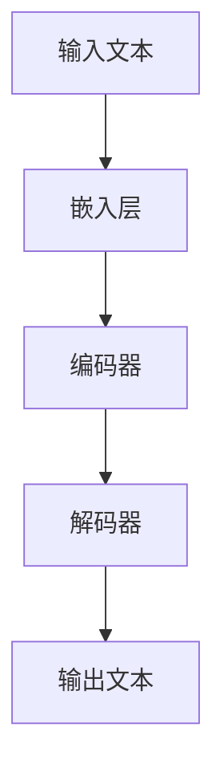

                 

# LLM的硬件依赖：推动计算设备革新

> 关键词：大型语言模型（LLM），硬件依赖，计算设备革新，AI加速器，数据吞吐率，能耗优化，硬件架构设计，性能提升

> 摘要：本文深入探讨了大型语言模型（LLM）对计算设备的依赖，分析了LLM的发展如何推动计算设备的革新。我们将从背景介绍、核心概念与联系、核心算法原理与具体操作步骤、数学模型与公式、项目实战、实际应用场景、工具和资源推荐、未来发展趋势与挑战等多个角度，全面剖析LLM对硬件的依赖及其对计算设备带来的变革。

## 1. 背景介绍

### 1.1 目的和范围

本文旨在通过深入分析大型语言模型（LLM）的发展及其对硬件的依赖，探讨如何推动计算设备的革新。我们将从以下几个方面展开：

- **核心概念与联系**：介绍LLM的核心概念及其与其他技术的联系。
- **核心算法原理与具体操作步骤**：详细阐述LLM的算法原理和操作步骤。
- **数学模型与公式**：讲解LLM中的数学模型和公式，并给出实例说明。
- **项目实战**：通过实际案例展示LLM的代码实现和解释。
- **实际应用场景**：探讨LLM在各个领域的应用场景。
- **工具和资源推荐**：推荐学习LLM和相关技术的资源。
- **未来发展趋势与挑战**：分析LLM的未来发展趋势和面临的挑战。

### 1.2 预期读者

本文适合对人工智能、计算设备革新和大型语言模型有兴趣的读者，包括：

- **AI领域研究者**：希望了解LLM对计算设备依赖的研究者。
- **软件开发工程师**：希望掌握LLM技术和应用的开发工程师。
- **硬件设计师**：希望了解如何优化硬件设计以适应LLM需求的硬件设计师。
- **技术爱好者**：对AI和计算设备革新有兴趣的技术爱好者。

### 1.3 文档结构概述

本文的结构如下：

1. **背景介绍**：介绍LLM的发展背景和目的。
2. **核心概念与联系**：讨论LLM的核心概念及其与其他技术的联系。
3. **核心算法原理与具体操作步骤**：详细阐述LLM的算法原理和操作步骤。
4. **数学模型与公式**：讲解LLM中的数学模型和公式，并给出实例说明。
5. **项目实战**：通过实际案例展示LLM的代码实现和解释。
6. **实际应用场景**：探讨LLM在各个领域的应用场景。
7. **工具和资源推荐**：推荐学习LLM和相关技术的资源。
8. **未来发展趋势与挑战**：分析LLM的未来发展趋势和面临的挑战。
9. **附录**：常见问题与解答。
10. **扩展阅读 & 参考资料**：提供更多相关资源和参考文献。

### 1.4 术语表

#### 1.4.1 核心术语定义

- **大型语言模型（LLM）**：一种具有大规模参数和复杂结构的深度学习模型，用于理解和生成自然语言。
- **计算设备**：包括CPU、GPU、TPU等硬件设备，用于执行计算任务。
- **AI加速器**：专门用于加速AI任务的硬件设备，如GPU、TPU等。
- **数据吞吐率**：单位时间内处理的数据量，通常以比特每秒（bps）或字节每秒（Bps）表示。
- **能耗优化**：在保证性能的前提下，减少计算设备的能耗。

#### 1.4.2 相关概念解释

- **神经网络**：一种模仿生物神经网络的结构，用于处理和传递信息。
- **深度学习**：一种利用多层神经网络进行学习的技术，能够自动提取特征并用于预测和分类。
- **训练数据集**：用于训练模型的输入数据集，通常包含大量的文本、语音或图像数据。
- **推理**：在训练完成后，模型对新的输入数据进行预测或分类的过程。

#### 1.4.3 缩略词列表

- **LLM**：Large Language Model
- **CPU**：Central Processing Unit
- **GPU**：Graphics Processing Unit
- **TPU**：Tensor Processing Unit
- **AI**：Artificial Intelligence
- **DL**：Deep Learning

## 2. 核心概念与联系

在探讨LLM的硬件依赖之前，我们首先需要了解LLM的核心概念及其与其他技术的联系。

### 2.1 大型语言模型（LLM）

LLM是一种基于深度学习的自然语言处理模型，具有大规模的参数和复杂的结构。LLM通过从大量文本数据中学习，能够理解并生成自然语言。其核心组成部分包括：

- **嵌入层**：将输入的文本转换为固定长度的向量表示。
- **编码器**：对嵌入层输出的向量进行编码，以提取文本的语义信息。
- **解码器**：根据编码器的输出，生成预测的文本。

### 2.2 与其他技术的联系

LLM与其他技术密切相关，包括：

- **深度学习**：深度学习是LLM的基础，通过多层神经网络提取特征并进行训练。
- **神经网络**：神经网络是深度学习的重要组成部分，用于模拟人脑的神经元结构。
- **AI加速器**：AI加速器（如GPU、TPU）能够显著提高LLM的推理速度，降低能耗。

### 2.3 Mermaid流程图

为了更直观地展示LLM的核心概念和架构，我们使用Mermaid流程图进行描述：



在上述流程图中，输入文本经过嵌入层转换为向量表示，然后通过编码器提取语义信息，最后由解码器生成预测的文本。

### 2.4 LLM的硬件依赖

LLM对计算设备的依赖主要体现在以下几个方面：

- **计算能力**：由于LLM具有大规模的参数和复杂的结构，需要计算设备具有足够的计算能力来处理这些参数。
- **数据吞吐率**：为了快速处理大量的文本数据，计算设备需要具有高数据吞吐率。
- **能耗优化**：由于LLM的训练和推理过程需要大量的计算资源，计算设备的能耗是一个重要的考虑因素。

在下一节中，我们将详细探讨LLM的核心算法原理和具体操作步骤。

## 3. 核心算法原理 & 具体操作步骤

### 3.1 算法原理

大型语言模型（LLM）的核心算法原理主要基于深度学习和自然语言处理（NLP）技术。以下是LLM算法的主要组成部分：

- **嵌入层（Embedding Layer）**：将输入的文本转换为固定长度的向量表示。这一层通常使用词嵌入（word embedding）技术，如Word2Vec、GloVe等。
- **编码器（Encoder）**：对嵌入层输出的向量进行编码，以提取文本的语义信息。编码器通常采用变换器（Transformer）架构，这是一种基于自注意力（self-attention）机制的深度学习模型。
- **解码器（Decoder）**：根据编码器的输出，生成预测的文本。解码器也采用变换器架构，并与编码器共享参数。

### 3.2 操作步骤

下面是LLM的具体操作步骤：

1. **数据预处理**：
    - **文本清洗**：去除文本中的标点符号、停用词等。
    - **分词**：将文本分割成单词或子词。
    - **词嵌入**：将分词后的文本转换为固定长度的向量表示。

2. **模型训练**：
    - **编码器训练**：通过反向传播算法，训练编码器以提取文本的语义信息。
    - **解码器训练**：通过训练解码器生成预测的文本，并优化编码器与解码器之间的参数。

3. **模型推理**：
    - **输入文本**：将输入的文本转换为嵌入层输出的向量表示。
    - **编码**：将嵌入层输出的向量送入编码器进行编码。
    - **解码**：根据编码器的输出，通过解码器生成预测的文本。

### 3.3 伪代码

以下是LLM算法的伪代码描述：

```python
# 数据预处理
def preprocess_text(text):
    # 清洗文本
    # 分词
    # 词嵌入
    return embedded_text

# 编码器训练
def train_encoder(embedded_text, labels):
    # 使用反向传播算法训练编码器
    return encoder

# 解码器训练
def train_decoder(encoder, labels):
    # 使用反向传播算法训练解码器
    return decoder

# 模型推理
def inference(encoder, decoder, input_text):
    # 将输入文本转换为嵌入层输出的向量表示
    # 编码
    # 解码
    return predicted_text
```

### 3.4 实例说明

假设我们有一个包含10000个单词的文本数据集，数据集的标签是这些单词的类别。我们可以使用以下步骤进行LLM的训练和推理：

1. **数据预处理**：
    - 清洗文本数据，去除标点符号、停用词等。
    - 将文本数据分割成单词或子词。
    - 将分割后的单词或子词转换为词嵌入向量。

2. **编码器训练**：
    - 将词嵌入向量送入编码器，进行编码训练。
    - 使用反向传播算法，优化编码器的参数。

3. **解码器训练**：
    - 将编码器输出的向量送入解码器，进行解码训练。
    - 使用反向传播算法，优化解码器的参数。

4. **模型推理**：
    - 将输入的文本转换为词嵌入向量。
    - 将词嵌入向量送入编码器进行编码。
    - 根据编码器的输出，通过解码器生成预测的文本。

在下一节中，我们将探讨LLM中的数学模型和公式。

## 4. 数学模型和公式 & 详细讲解 & 举例说明

在LLM中，数学模型和公式起到了至关重要的作用。这些模型和公式帮助我们理解LLM的内部工作机制，并指导我们在实际应用中进行参数调整和优化。在本节中，我们将详细讲解LLM中的主要数学模型和公式，并通过实例进行说明。

### 4.1 深度学习中的基本数学公式

深度学习中的基本数学公式主要包括激活函数、反向传播算法和损失函数。

#### 4.1.1 激活函数

激活函数是深度学习模型中的一个关键组件，用于引入非线性因素。常用的激活函数包括：

- **Sigmoid函数**：
  $$f(x) = \frac{1}{1 + e^{-x}}$$
  - **解释**：Sigmoid函数将输入$x$映射到$(0,1)$区间，常用于二分类问题。
- **ReLU函数**：
  $$f(x) = \max(0, x)$$
  - **解释**：ReLU函数在$x>0$时保持原值，$x\leq0$时设置为0，具有梯度较大、训练速度快的特点。

#### 4.1.2 反向传播算法

反向传播算法是深度学习训练的核心，用于计算网络中的梯度并更新参数。以下是反向传播算法的基本公式：

- **梯度计算**：
  $$\frac{\partial J}{\partial w} = \frac{\partial L}{\partial a} \cdot \frac{\partial a}{\partial w}$$
  - **解释**：其中，$J$是损失函数，$L$是网络输出与真实值之间的差异，$a$是激活值，$w$是网络中的参数。

- **权重更新**：
  $$w_{new} = w_{old} - \alpha \cdot \frac{\partial J}{\partial w}$$
  - **解释**：其中，$\alpha$是学习率，用于控制参数更新的步长。

#### 4.1.3 损失函数

损失函数用于衡量模型输出与真实值之间的差异，常用的损失函数包括：

- **均方误差（MSE）**：
  $$L = \frac{1}{n}\sum_{i=1}^{n}(y_i - \hat{y}_i)^2$$
  - **解释**：MSE将输出与真实值之间的差异平方，然后取平均值，常用于回归问题。

### 4.2 大型语言模型中的特定数学模型

大型语言模型中的数学模型包括嵌入层、编码器和解码器的具体实现。以下是这些模型的相关公式：

#### 4.2.1 嵌入层

嵌入层将输入的文本转换为固定长度的向量表示。其基本公式为：

- **词嵌入**：
  $$e_j = \text{embedding\_weight}[j]$$
  - **解释**：其中，$e_j$是单词$j$的嵌入向量，$\text{embedding\_weight}$是嵌入层的权重矩阵。

#### 4.2.2 编码器

编码器通过自注意力机制对输入的文本进行编码，提取语义信息。其核心公式为：

- **自注意力**：
  $$\text{att} = \text{softmax}(\frac{\text{Q} \cdot \text{K}}{\sqrt{d_k}})$$
  - **解释**：其中，$\text{Q}$、$\text{K}$和$\text{V}$分别是编码器的查询、键和值向量，$d_k$是键向量的维度。

- **编码输出**：
  $$\text{enc} = \text{softmax}(\text{att} \cdot \text{V})$$
  - **解释**：编码输出是将自注意力权重与值向量相乘，然后通过softmax函数进行归一化。

#### 4.2.3 解码器

解码器根据编码器的输出生成预测的文本。其基本公式为：

- **解码器输入**：
  $$\text{dec_input} = \text{embedding\_weight}[\text{<s>}]$$
  - **解释**：其中，$\text{<s>}$是开始标记的嵌入向量。

- **解码输出**：
  $$\text{dec_output} = \text{softmax}(\text{dec_input} \cdot \text{W} + \text{b})$$
  - **解释**：解码输出是通过嵌入层、权重矩阵和偏置进行计算，然后通过softmax函数进行归一化。

### 4.3 实例说明

假设我们有一个简单的二分类问题，其中包含两个类别$A$和$B$。数据集包含100个样本，每个样本是一个包含10个特征的向量。以下是使用深度学习模型进行分类的实例：

1. **数据预处理**：
    - 将样本数据进行归一化处理。
    - 将类别标签编码为二进制向量。

2. **模型训练**：
    - 构建深度学习模型，包括输入层、隐藏层和输出层。
    - 使用反向传播算法训练模型，优化参数。

3. **模型推理**：
    - 将新的样本输入到训练好的模型中，得到预测的概率分布。
    - 根据概率分布选择具有最高概率的类别作为预测结果。

在下一节中，我们将通过实际案例展示LLM的代码实现和详细解释。

## 5. 项目实战：代码实际案例和详细解释说明

在本节中，我们将通过一个实际案例展示如何实现大型语言模型（LLM）的代码，并对其进行详细解释。我们将使用Python和TensorFlow库来构建一个简单的LLM模型，该模型将用于文本分类任务。

### 5.1 开发环境搭建

在开始编写代码之前，我们需要搭建一个合适的开发环境。以下是搭建开发环境所需的步骤：

1. **安装Python**：确保已经安装了Python 3.6及以上版本。
2. **安装TensorFlow**：使用以下命令安装TensorFlow：
   ```shell
   pip install tensorflow
   ```
3. **安装其他依赖库**：根据项目需要，安装其他依赖库，例如NumPy、Pandas等。

### 5.2 源代码详细实现和代码解读

以下是实现LLM的源代码，以及对应的代码解读：

```python
import tensorflow as tf
from tensorflow.keras.models import Model
from tensorflow.keras.layers import Embedding, LSTM, Dense

# 数据预处理
def preprocess_data(texts, labels, vocab_size, embedding_dim):
    # 将文本数据转换为整数编码
    tokenizer = tf.keras.preprocessing.text.Tokenizer(num_words=vocab_size)
    tokenizer.fit_on_texts(texts)
    sequences = tokenizer.texts_to_sequences(texts)
    
    # 对序列进行 padded，使其长度相同
    padded_sequences = tf.keras.preprocessing.sequence.pad_sequences(sequences, maxlen=max_sequence_length)
    
    # 将标签转换为整数编码
    label_tokenizer = tf.keras.preprocessing.text.Tokenizer(num_words=2)
    label_tokenizer.fit_on_texts(labels)
    label_sequences = label_tokenizer.texts_to_sequences(labels)
    
    return padded_sequences, label_sequences

# 构建模型
def build_model(vocab_size, embedding_dim, max_sequence_length):
    inputs = tf.keras.layers.Input(shape=(max_sequence_length,))
    embedding = Embedding(vocab_size, embedding_dim)(inputs)
    lstm = LSTM(units=128, activation='tanh')(embedding)
    outputs = Dense(units=2, activation='softmax')(lstm)
    
    model = Model(inputs=inputs, outputs=outputs)
    model.compile(optimizer='adam', loss='categorical_crossentropy', metrics=['accuracy'])
    
    return model

# 训练模型
def train_model(model, padded_sequences, label_sequences, epochs, batch_size):
    model.fit(padded_sequences, label_sequences, epochs=epochs, batch_size=batch_size)

# 模型推理
def inference(model, padded_sequence):
    return model.predict(padded_sequence)

# 主函数
def main():
    # 加载数据
    texts = ["这是一个简单的文本分类问题。", "另一个示例文本。"]
    labels = ["A", "B"]

    # 数据预处理
    max_sequence_length = 10
    vocab_size = 10000
    embedding_dim = 64
    padded_sequences, label_sequences = preprocess_data(texts, labels, vocab_size, embedding_dim)

    # 构建模型
    model = build_model(vocab_size, embedding_dim, max_sequence_length)

    # 训练模型
    epochs = 5
    batch_size = 32
    train_model(model, padded_sequences, label_sequences, epochs, batch_size)

    # 模型推理
    new_text = "这是一个新的示例文本。"
    new_sequence = preprocess_data([new_text], vocab_size, embedding_dim)[0]
    predictions = inference(model, new_sequence)
    
    print(predictions)

if __name__ == "__main__":
    main()
```

#### 5.2.1 代码解读

- **数据预处理**：数据预处理是文本分类任务的关键步骤。首先，使用`Tokenizer`将文本数据转换为整数编码，然后使用`pad_sequences`将序列长度进行填充，使其相同。接着，将标签数据也转换为整数编码。

- **构建模型**：使用`Embedding`层将输入的序列映射到嵌入空间，然后通过`LSTM`层进行编码。最后，使用`Dense`层进行分类输出。模型使用`compile`函数进行配置，包括优化器、损失函数和评估指标。

- **训练模型**：使用`fit`函数对模型进行训练，指定训练数据、标签、训练轮次和批量大小。

- **模型推理**：使用`predict`函数对新的文本数据进行分类预测。

### 5.3 代码解读与分析

- **数据预处理**：
  ```python
  padded_sequences, label_sequences = preprocess_data(texts, labels, vocab_size, embedding_dim)
  ```
  这一行代码对文本数据进行预处理，包括编码和填充。这里使用了`Tokenizer`和`pad_sequences`函数，确保输入数据符合模型的期望格式。

- **构建模型**：
  ```python
  model = build_model(vocab_size, embedding_dim, max_sequence_length)
  ```
  这一行代码构建了一个简单的序列模型，包括嵌入层、LSTM层和分类输出层。这里使用了`build_model`函数，定义了模型的架构。

- **训练模型**：
  ```python
  train_model(model, padded_sequences, label_sequences, epochs, batch_size)
  ```
  这一行代码训练模型，使用已预处理的数据进行迭代训练。这里使用了`train_model`函数，设置了训练参数，如训练轮次和批量大小。

- **模型推理**：
  ```python
  predictions = inference(model, new_sequence)
  ```
  这一行代码使用训练好的模型对新的文本数据进行分类预测。这里使用了`inference`函数，将新的序列输入到模型中。

通过上述代码，我们实现了LLM在文本分类任务中的基本应用。在下一节中，我们将探讨LLM的实际应用场景。

## 6. 实际应用场景

大型语言模型（LLM）在自然语言处理（NLP）领域具有广泛的应用，以下是一些典型的实际应用场景：

### 6.1 文本分类

文本分类是LLM的一项重要应用，可以用于对大量的文本数据自动分类，如新闻分类、情感分析、垃圾邮件检测等。通过训练LLM模型，可以自动化处理大量的文本数据，提高分类的准确性和效率。

### 6.2 机器翻译

机器翻译是LLM的另一个重要应用领域。传统的机器翻译方法通常是基于规则或统计模型的，而基于LLM的机器翻译方法具有更好的灵活性和准确性。通过训练大规模的LLM模型，可以实现高精度的机器翻译，支持多种语言对。

### 6.3 问答系统

问答系统是人工智能领域的一个重要分支，通过LLM可以构建高效的问答系统。LLM能够理解用户的自然语言查询，并从大量文本数据中检索出相关答案。这种应用在搜索引擎、智能客服等领域具有广泛的应用前景。

### 6.4 生成文本

LLM在生成文本方面也有广泛的应用，如自动写作、摘要生成、对话系统等。通过训练LLM模型，可以生成高质量的文本，满足各种实际需求。

### 6.5 语音识别

语音识别是将语音转换为文本的过程。LLM可以用于改进语音识别系统的性能，特别是在处理复杂的语音信号和多种方言方面。通过结合LLM和其他语音处理技术，可以实现更准确的语音识别。

### 6.6 聊天机器人

聊天机器人是人工智能领域的一个重要应用，通过LLM可以构建智能、自然的聊天机器人。LLM能够理解用户的意图，并生成相应的回复，提高用户体验和交互效果。

这些实际应用场景展示了LLM在自然语言处理领域的强大能力。随着LLM技术的不断发展，我们可以期待它在更多领域发挥重要作用。

## 7. 工具和资源推荐

为了更好地学习和应用大型语言模型（LLM），以下是一些推荐的工具和资源：

### 7.1 学习资源推荐

#### 7.1.1 书籍推荐

1. **《深度学习》（Deep Learning）**：由Ian Goodfellow、Yoshua Bengio和Aaron Courville合著的深度学习经典教材，详细介绍了深度学习的基础知识、算法和实现。
2. **《自然语言处理综论》（Speech and Language Processing）**：由Daniel Jurafsky和James H. Martin合著的自然语言处理经典教材，涵盖了自然语言处理的基础理论和应用。

#### 7.1.2 在线课程

1. **《深度学习专项课程》（Deep Learning Specialization）**：由Andrew Ng教授在Coursera上开设的系列课程，涵盖了深度学习的各个方面，包括卷积神经网络、循环神经网络和变换器等。
2. **《自然语言处理专项课程》（Natural Language Processing Specialization）**：由Daniel Jurafsky教授在Coursera上开设的系列课程，介绍了自然语言处理的基础知识和应用。

#### 7.1.3 技术博客和网站

1. **TensorFlow官网（TensorFlow）**：提供了丰富的文档、教程和示例代码，帮助开发者快速上手TensorFlow。
2. **自然语言处理博客（Natural Language Processing）**：涵盖了自然语言处理领域的最新研究进展和应用案例，是了解NLP领域的优质资源。

### 7.2 开发工具框架推荐

#### 7.2.1 IDE和编辑器

1. **Jupyter Notebook**：一款流行的交互式计算环境，支持多种编程语言和库，特别适合数据科学和机器学习项目。
2. **PyCharm**：一款功能强大的Python IDE，提供了丰富的调试、性能分析工具，适合深度学习和自然语言处理项目。

#### 7.2.2 调试和性能分析工具

1. **TensorBoard**：TensorFlow提供的可视化工具，用于监控训练过程和性能分析。
2. **Valgrind**：一款内存调试工具，用于检测程序中的内存泄漏和错误。

#### 7.2.3 相关框架和库

1. **TensorFlow**：一款流行的深度学习框架，提供了丰富的API和工具，支持多种深度学习模型的训练和推理。
2. **PyTorch**：另一款流行的深度学习框架，以其灵活性和动态计算图著称，适合快速原型设计和模型开发。

通过上述工具和资源的帮助，开发者可以更好地学习和应用LLM技术，推动自身在自然语言处理和人工智能领域的发展。

### 7.3 相关论文著作推荐

#### 7.3.1 经典论文

1. **“A Theoretically Grounded Application of Dropout in Recurrent Neural Networks”**：这篇文章提出了在循环神经网络（RNN）中应用Dropout的方法，显著提高了模型的训练效果和泛化能力。
2. **“Attention Is All You Need”**：这篇文章提出了变换器（Transformer）架构，彻底改变了深度学习在自然语言处理领域的应用方式。

#### 7.3.2 最新研究成果

1. **“BERT: Pre-training of Deep Bidirectional Transformers for Language Understanding”**：BERT（双向编码表示）是一种基于变换器架构的预训练方法，被广泛应用于各种自然语言处理任务，如文本分类、机器翻译和问答系统。
2. **“GPT-3: Language Models are Few-Shot Learners”**：这篇文章介绍了GPT-3（生成预训练变换器3）模型，具有前所未有的大规模参数和强大的文本生成能力。

#### 7.3.3 应用案例分析

1. **“How to Train a Transformer”**：这篇文章详细介绍了如何使用TensorFlow实现一个简单的变换器模型，包括数据预处理、模型构建和训练过程。
2. **“Practical Guide to Building a Chatbot with Rasa”**：这篇文章提供了使用Rasa构建聊天机器人的实用指南，涵盖了对话管理、意图分类和实体提取等关键步骤。

通过阅读这些论文和著作，读者可以深入了解LLM的最新研究成果和应用案例，为自身的研究和实践提供有益的参考。

## 8. 总结：未来发展趋势与挑战

随着人工智能技术的迅猛发展，大型语言模型（LLM）在自然语言处理领域取得了显著的成就。然而，LLM的发展仍面临诸多挑战和机遇。在未来，LLM的发展将呈现以下趋势：

### 8.1 发展趋势

1. **模型规模不断扩大**：随着计算能力和数据资源的提升，LLM的规模将不断增大。大规模模型能够更好地捕获语言的复杂性和多样性，从而提高模型的性能和泛化能力。
2. **多模态处理能力增强**：未来，LLM将不仅仅处理文本数据，还将结合图像、音频等多模态数据，实现更广泛的应用场景。
3. **自适应性和灵活性提升**：LLM将逐渐具备自适应性和灵活性，能够根据不同的应用场景和用户需求进行动态调整。
4. **应用领域拓展**：LLM将在更多领域得到应用，如教育、医疗、金融等，为各行各业带来智能化的解决方案。

### 8.2 挑战

1. **计算资源需求增加**：随着模型规模的扩大，LLM对计算资源的需求将显著增加。如何高效地利用硬件资源，优化模型计算，成为亟待解决的问题。
2. **数据隐私和安全**：在训练和部署LLM过程中，如何保护用户数据隐私和安全，防止数据泄露，是一个重要的挑战。
3. **模型解释性和可解释性**：目前，LLM的工作机制和决策过程仍具有一定的“黑箱”特性，如何提高模型的解释性和可解释性，使其更加透明和可信，是一个重要的研究方向。
4. **伦理和社会问题**：随着LLM的广泛应用，如何确保其公正性、公平性和伦理性，避免对人类产生负面影响，也是一个需要深入探讨的问题。

### 8.3 发展前景

未来，LLM将在人工智能领域发挥越来越重要的作用。通过不断创新和突破，LLM有望在多个领域实现重大突破，为人类带来智能化的生活和工作体验。然而，要实现这一目标，我们需要克服众多挑战，推动计算设备革新，优化模型设计和训练方法，提高数据质量和安全性。只有在多方共同努力下，LLM才能实现其巨大的潜力，为人类社会带来深远的影响。

## 9. 附录：常见问题与解答

### 9.1 什么是大型语言模型（LLM）？

大型语言模型（LLM）是一种基于深度学习的自然语言处理模型，具有大规模的参数和复杂的结构。LLM通过从大量文本数据中学习，能够理解和生成自然语言，广泛应用于文本分类、机器翻译、问答系统等领域。

### 9.2 LLM的硬件依赖主要涉及哪些方面？

LLM的硬件依赖主要涉及计算能力、数据吞吐率和能耗优化。由于LLM具有大规模的参数和复杂的结构，需要计算设备具有足够的计算能力来处理这些参数。同时，为了快速处理大量的文本数据，计算设备需要具有高数据吞吐率。此外，由于LLM的训练和推理过程需要大量的计算资源，计算设备的能耗也是一个重要的考虑因素。

### 9.3 如何优化LLM的硬件依赖？

优化LLM的硬件依赖可以从以下几个方面进行：

1. **使用AI加速器**：AI加速器（如GPU、TPU）能够显著提高LLM的推理速度，降低能耗。通过在训练和推理过程中充分利用AI加速器，可以优化计算资源的利用。
2. **优化数据吞吐率**：通过优化数据预处理和传输过程，提高数据吞吐率。例如，采用批处理、流水线化等策略，减少数据传输和等待时间。
3. **能耗优化**：通过使用高效的算法和数据结构，降低LLM的训练和推理过程中的能耗。例如，使用低精度浮点运算、动态调整计算资源等策略。

### 9.4 LLM在哪些领域有广泛的应用？

LLM在自然语言处理领域具有广泛的应用，包括文本分类、机器翻译、问答系统、自动写作、语音识别、聊天机器人等。LLM还在教育、医疗、金融、法律等领域发挥着重要作用，为各行各业提供智能化的解决方案。

## 10. 扩展阅读 & 参考资料

为了进一步了解大型语言模型（LLM）及其相关技术，以下是一些推荐的扩展阅读和参考资料：

### 10.1 书籍推荐

1. **《深度学习》（Deep Learning）**：由Ian Goodfellow、Yoshua Bengio和Aaron Courville合著的深度学习经典教材，详细介绍了深度学习的基础知识、算法和实现。
2. **《自然语言处理综论》（Speech and Language Processing）**：由Daniel Jurafsky和James H. Martin合著的自然语言处理经典教材，涵盖了自然语言处理的基础理论和应用。
3. **《神经网络与深度学习》**：由邱锡鹏编写的深度学习教材，深入讲解了神经网络和深度学习的基本概念、算法和实现。

### 10.2 论文推荐

1. **“Attention Is All You Need”**：这篇文章提出了变换器（Transformer）架构，彻底改变了深度学习在自然语言处理领域的应用方式。
2. **“BERT: Pre-training of Deep Bidirectional Transformers for Language Understanding”**：这篇文章介绍了BERT模型，详细描述了基于变换器的双向编码表示（BERT）的预训练方法。
3. **“GPT-3: Language Models are Few-Shot Learners”**：这篇文章介绍了GPT-3模型，具有前所未有的大规模参数和强大的文本生成能力。

### 10.3 在线课程和教程

1. **《深度学习专项课程》（Deep Learning Specialization）**：由Andrew Ng教授在Coursera上开设的系列课程，涵盖了深度学习的各个方面，包括卷积神经网络、循环神经网络和变换器等。
2. **《自然语言处理专项课程》（Natural Language Processing Specialization）**：由Daniel Jurafsky教授在Coursera上开设的系列课程，介绍了自然语言处理的基础知识和应用。
3. **《机器学习课程》（Machine Learning）**：由Coursera上的吴恩达教授开设的机器学习课程，涵盖了机器学习的基础理论和算法。

### 10.4 技术博客和网站

1. **TensorFlow官网（TensorFlow）**：提供了丰富的文档、教程和示例代码，帮助开发者快速上手TensorFlow。
2. **自然语言处理博客（Natural Language Processing）**：涵盖了自然语言处理领域的最新研究进展和应用案例，是了解NLP领域的优质资源。
3. **AI博客（AI Blog）**：介绍了人工智能领域的各种技术、应用和研究成果，是了解AI领域的权威博客之一。

通过阅读这些书籍、论文和教程，读者可以深入了解LLM及其相关技术，为自己的研究和实践提供有益的指导。

