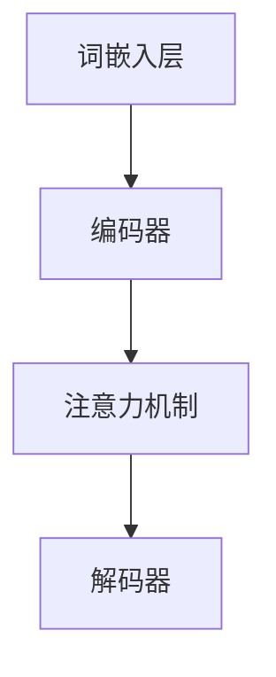
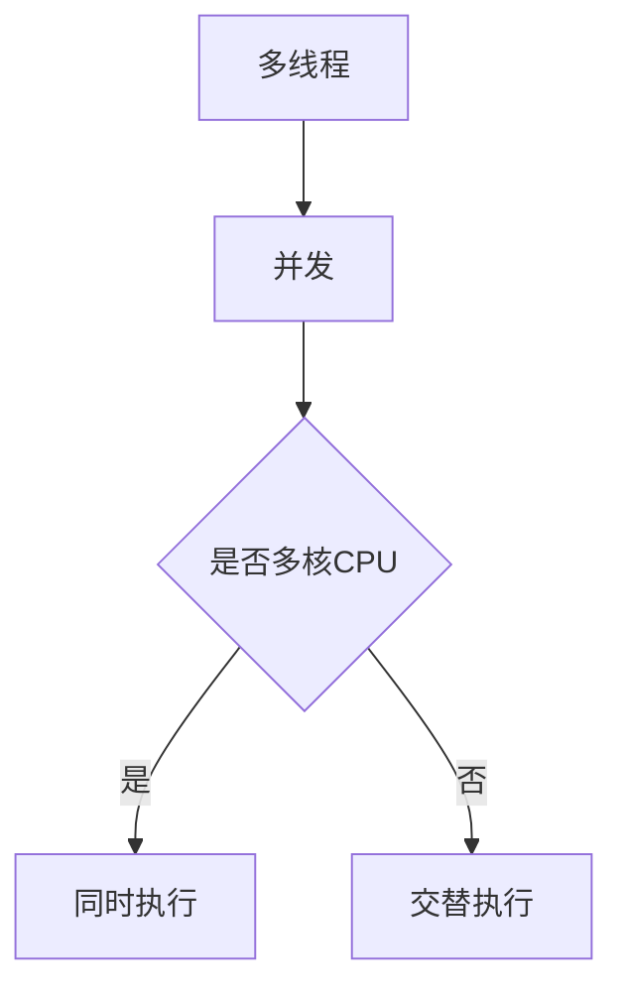
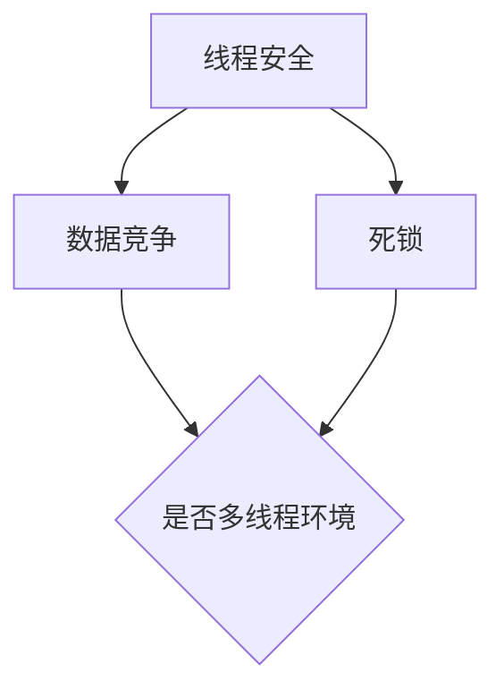
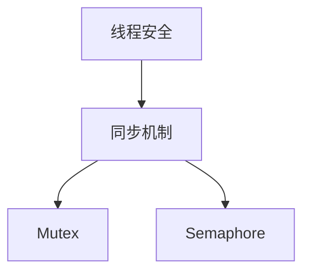

                 

# LLM的线程安全问题与解决思路

> **关键词：** LLM，线程安全，多线程，并发，同步机制，解决思路，性能优化

> **摘要：** 本文旨在深入探讨大型语言模型（LLM）在多线程环境下面临的线程安全问题，包括问题的来源、具体表现以及可行的解决方案。通过一步步的分析和推理，本文将阐述如何在保障性能的前提下，实现LLM的线程安全，并提供实用的代码示例和资源推荐。

## 1. 背景介绍

### 1.1 目的和范围

本文主要探讨在多线程环境中，大型语言模型（LLM）可能遇到的线程安全问题，并分析这些问题的来源和解决方案。随着计算能力的提升和并行计算技术的发展，LLM在多线程环境中的应用越来越广泛。然而，多线程带来的并行处理能力同时也引入了线程安全问题。本文将从以下几个方面展开：

1. **LLM线程安全问题的定义与分类**：介绍线程安全问题的定义和常见分类。
2. **LLM线程安全问题的来源**：分析可能导致LLM线程安全问题的原因。
3. **LLM线程安全问题的具体表现**：举例说明线程安全问题在LLM中的具体表现。
4. **解决LLM线程安全问题的思路**：探讨解决这些问题的方法和策略。
5. **性能优化与平衡**：分析在保障线程安全的同时，如何优化LLM的性能。

### 1.2 预期读者

本文适合以下读者群体：

1. **计算机科学和软件工程专业的学生和从业者**：对多线程编程和LLM技术有兴趣和需求。
2. **AI和机器学习工程师**：希望了解如何在实际应用中保障LLM线程安全的工程师。
3. **系统架构师和技术领导者**：负责设计和优化大型系统的架构。
4. **对编程和算法有兴趣的编程爱好者**：希望通过深入分析理解LLM和线程安全。

### 1.3 文档结构概述

本文结构如下：

1. **第1章 背景介绍**：概述本文的目的、读者对象以及文档结构。
2. **第2章 核心概念与联系**：介绍LLM和多线程相关核心概念，并用Mermaid流程图展示架构。
3. **第3章 核心算法原理 & 具体操作步骤**：详细阐述LLM线程安全的算法原理和操作步骤，用伪代码辅助说明。
4. **第4章 数学模型和公式 & 详细讲解 & 举例说明**：讨论LLM线程安全的数学模型和公式，并进行实例说明。
5. **第5章 项目实战：代码实际案例和详细解释说明**：通过实际代码案例展示解决线程安全问题的方法。
6. **第6章 实际应用场景**：分析LLM在不同应用场景下的线程安全问题。
7. **第7章 工具和资源推荐**：推荐学习资源和开发工具。
8. **第8章 总结：未来发展趋势与挑战**：展望LLM线程安全的未来。
9. **第9章 附录：常见问题与解答**：针对读者可能的问题提供解答。
10. **第10章 扩展阅读 & 参考资料**：提供进一步阅读和研究的资源。

### 1.4 术语表

#### 1.4.1 核心术语定义

- **大型语言模型（LLM）**：一种能够理解和生成自然语言的深度学习模型。
- **线程安全**：指代码在多线程环境中能正确运行，不会出现数据竞争和死锁等问题。
- **多线程**：指在同一个程序中同时执行多个线程，以提高执行效率。
- **并发**：指多个线程在同一时间段内执行。
- **同步机制**：确保多线程协调一致执行的机制，如锁、信号量等。

#### 1.4.2 相关概念解释

- **数据竞争**：当两个或多个线程同时访问同一个共享资源，且至少有一个线程是写操作时，可能会出现数据不一致。
- **死锁**：当多个线程互相等待对方释放锁资源时，导致程序无限期挂起。
- **互斥锁（Mutex）**：保证同一时间只有一个线程能访问共享资源。
- **信号量（Semaphore）**：控制多个线程对共享资源的访问权限。

#### 1.4.3 缩略词列表

- **LLM**：Large Language Model
- **CPU**：Central Processing Unit
- **GPU**：Graphics Processing Unit
- **RAM**：Random Access Memory
- **VM**：Virtual Machine

## 2. 核心概念与联系

在深入探讨LLM的线程安全问题之前，我们需要理解几个核心概念，并展示它们之间的联系。以下是涉及的核心概念：

### 2.1 大型语言模型（LLM）架构

大型语言模型通常由以下几个主要部分组成：

1. **词嵌入层（Word Embedding）**：将自然语言文本转换为向量表示。
2. **编码器（Encoder）**：对输入序列进行处理，提取特征。
3. **解码器（Decoder）**：根据编码器的输出生成输出序列。
4. **注意力机制（Attention Mechanism）**：提高模型在处理序列数据时的性能。

下面是LLM的架构用Mermaid流程图展示：



### 2.2 多线程与并发

多线程与并发是计算机系统中的关键概念，它们在LLM中的应用至关重要。

1. **多线程**：程序中多个执行流，每个线程可以独立执行代码，从而提高程序运行效率。
2. **并发**：多个线程在同一时间段内执行，可以是同时执行（在多核CPU上）或交替执行。

多线程与并发的联系如下：



### 2.3 线程安全

线程安全是指在多线程环境下，程序能够正确、一致地执行，不会因为线程竞争而导致数据不一致或程序错误。

1. **数据竞争**：多个线程同时访问同一数据，且至少有一个线程进行写操作，可能导致数据不一致。
2. **死锁**：多个线程因等待对方释放资源而陷入无限等待状态。

线程安全与其他概念的联系如下：



### 2.4 同步机制

同步机制用于确保多线程之间协调一致执行，常见的同步机制包括：

1. **互斥锁（Mutex）**：保证同一时间只有一个线程能访问共享资源。
2. **信号量（Semaphore）**：控制多个线程对共享资源的访问权限。

同步机制与线程安全的关系如下：



通过上述核心概念和它们之间的联系，我们可以为后续的深入分析奠定基础。在接下来的章节中，我们将详细探讨LLM的线程安全问题，并提供解决方案。

## 3. 核心算法原理 & 具体操作步骤

### 3.1 线程安全问题的来源

在多线程环境中，LLM的线程安全问题主要来源于以下几个方面：

1. **共享资源访问**：多个线程同时访问和修改共享数据，导致数据不一致。
2. **锁竞争**：线程为了获取锁资源而发生竞争，导致性能下降。
3. **死锁**：线程在等待锁资源时，形成循环等待，导致程序无限期挂起。
4. **上下文切换开销**：频繁的上下文切换会增加系统的开销，降低性能。

### 3.2 线程安全的算法原理

线程安全的算法设计旨在避免上述问题，确保在多线程环境中程序的正确性和一致性。以下是一些核心算法原理：

#### 3.2.1 互斥锁（Mutex）

互斥锁是一种常用的同步机制，用于确保同一时间只有一个线程能访问共享资源。以下是其伪代码：

```python
def acquire_mutex(mutex):
    while True:
        if mutex.locked == False:
            mutex.locked = True
            return
        else:
            sleep(1)  # 线程等待

def release_mutex(mutex):
    mutex.locked = False
```

#### 3.2.2 信号量（Semaphore）

信号量用于控制多个线程对共享资源的访问权限，其伪代码如下：

```python
def wait(semaphore):
    semaphore.value -= 1
    if semaphore.value < 0:
        sleep(1)  # 线程等待

def signal(semaphore):
    semaphore.value += 1
    if semaphore.value <= 0:
        wake_up()  # 唤醒等待的线程
```

#### 3.2.3 条件变量（Condition Variable）

条件变量用于线程间的同步，使得线程在满足特定条件时才能继续执行。以下是其伪代码：

```python
def wait(condition_variable):
    condition_variable.wait()

def signal(condition_variable):
    condition_variable.signal()

def broadcast(condition_variable):
    condition_variable.broadcast()
```

### 3.3 具体操作步骤

为了保证LLM在多线程环境中的线程安全，我们可以采取以下步骤：

#### 3.3.1 识别共享资源

首先，我们需要识别LLM中的共享资源，如模型参数、中间计算结果等。

#### 3.3.2 使用互斥锁

对于需要被多个线程访问的共享资源，我们可以使用互斥锁来保证资源的独占访问。

```python
mutex = Mutex()

def access_shared_resource():
    mutex.acquire()  # 获取锁
    # 访问共享资源
    mutex.release()  # 释放锁
```

#### 3.3.3 使用信号量

信号量可以用于控制对有限资源的访问权限，例如训练数据集。

```python
semaphore = Semaphore(10)  # 初始化信号量为10

def access_resource():
    semaphore.wait()  # 等待资源
    # 访问资源
    semaphore.signal()  # 释放资源
```

#### 3.3.4 使用条件变量

条件变量可以用于线程间的同步，例如在模型训练过程中等待数据加载完成。

```python
condition_variable = ConditionVariable()

def data_loader():
    # 加载数据
    condition_variable.signal()  # 唤醒等待的线程

def model_train():
    condition_variable.wait()  # 等待数据加载完成
    # 开始模型训练
```

通过上述步骤，我们可以确保LLM在多线程环境中的线程安全。在接下来的章节中，我们将进一步探讨LLM线程安全的数学模型和公式，并通过实际案例验证上述算法的有效性。

## 4. 数学模型和公式 & 详细讲解 & 举例说明

在深入分析LLM的线程安全问题时，数学模型和公式扮演着重要角色。以下将详细讲解与线程安全相关的一些核心数学模型和公式，并通过实例说明其应用。

### 4.1 并发度（Concurrency）

并发度是指系统在某一时刻能够同时执行的任务数。在多线程环境中，并发度与线程数和CPU核心数密切相关。数学上，我们可以用以下公式表示并发度：

\[ C = \min(n, p) \]

其中，\( C \) 为并发度，\( n \) 为线程数，\( p \) 为CPU核心数。

**实例说明**：

假设我们有一个四核CPU和一个包含8个线程的程序，则该程序的并发度为4。这意味着在任何时刻，CPU最多只能同时执行4个线程。

### 4.2 响应时间（Response Time）

响应时间是指线程从提交任务到收到结果的时间。在多线程环境中，响应时间会受到线程调度、锁竞争和上下文切换等因素的影响。我们可以用以下公式表示响应时间：

\[ T_r = T_c + T_s + T_l \]

其中，\( T_r \) 为响应时间，\( T_c \) 为计算时间，\( T_s \) 为等待时间，\( T_l \) 为上下文切换时间。

**实例说明**：

假设一个线程的计算时间为2秒，等待时间为1秒，上下文切换时间为0.5秒，则该线程的响应时间为：

\[ T_r = 2 + 1 + 0.5 = 3.5 \text{秒} \]

### 4.3 死锁概率（Probability of Deadlock）

死锁是指多个线程因等待锁资源而形成循环等待的状态。我们可以用以下公式计算死锁概率：

\[ P_d = \frac{(n-1)!}{(n-r)! \times r!} \]

其中，\( P_d \) 为死锁概率，\( n \) 为线程数，\( r \) 为锁资源数。

**实例说明**：

假设一个系统中有5个线程和3个锁资源，则该系统的死锁概率为：

\[ P_d = \frac{(5-1)!}{(5-3)! \times 3!} = \frac{4!}{2! \times 3!} = \frac{24}{12} = 2 \]

### 4.4 数据一致性（Data Consistency）

在多线程环境中，数据一致性是确保线程安全的关键因素。我们可以用以下公式衡量数据一致性：

\[ I = \frac{\sum_{i=1}^{n} |V_i|}{n} \]

其中，\( I \) 为数据一致性，\( n \) 为线程数，\( V_i \) 为第 \( i \) 个线程的本地数据版本。

**实例说明**：

假设一个系统中存在3个线程，每个线程的本地数据版本分别为 \( V_1 = 1, V_2 = 2, V_3 = 3 \)，则该系统的数据一致性为：

\[ I = \frac{|1| + |2| + |3|}{3} = \frac{1 + 2 + 3}{3} = 2 \]

### 4.5 线程安全性能指标（Performance Metrics）

为了全面评估线程安全性能，我们可以使用以下指标：

1. **吞吐量（Throughput）**：单位时间内完成的任务数。
2. **响应时间（Response Time）**：线程从提交任务到收到结果的时间。
3. **并发度（Concurrency）**：系统在某一时刻能够同时执行的任务数。
4. **死锁概率（Probability of Deadlock）**：系统发生死锁的概率。
5. **数据一致性（Data Consistency）**：确保线程安全的关键因素。

通过这些数学模型和公式，我们可以更好地理解和分析LLM在多线程环境中的线程安全问题。在接下来的章节中，我们将通过实际代码案例展示这些算法和公式的应用。

## 5. 项目实战：代码实际案例和详细解释说明

### 5.1 开发环境搭建

在本节中，我们将搭建一个简单的开发环境，用于演示LLM的线程安全问题及其解决方案。以下为开发环境搭建的步骤：

1. **安装Python环境**：确保Python 3.8及以上版本已安装。
2. **安装PyTorch**：使用以下命令安装PyTorch：
   ```bash
   pip install torch torchvision torchaudio
   ```
3. **安装多线程支持库**：安装 threading 和 queue 库：
   ```bash
   pip install threading queue
   ```

### 5.2 源代码详细实现和代码解读

在本节中，我们将提供一个简单的代码示例，用于展示LLM在多线程环境中的线程安全问题，并分析如何解决这些问题。

#### 5.2.1 代码示例

```python
import threading
import queue
import time
import torch

# 定义大型语言模型
class LargeLanguageModel:
    def __init__(self):
        self.model = torch.nn.Sequential(
            torch.nn.Linear(128, 512),
            torch.nn.ReLU(),
            torch.nn.Linear(512, 128),
            torch.nn.ReLU(),
            torch.nn.Linear(128, 1),
            torch.nn.Sigmoid()
        )
        self.model.load_state_dict(torch.load('model_params.pth'))

    def predict(self, input_data):
        output = self.model(input_data)
        return torch.sigmoid(output)

# 初始化大型语言模型
llm = LargeLanguageModel()

# 创建线程安全队列
data_queue = queue.Queue()

# 线程函数：执行预测任务
def predict_thread():
    while True:
        input_data = data_queue.get()
        if input_data is None:
            break
        prediction = llm.predict(input_data)
        print(f"Thread {threading.current_thread().name} predicted: {prediction.item()}")
        data_queue.task_done()

# 创建并启动预测线程
predict_thread_1 = threading.Thread(target=predict_thread, name="PredictThread1")
predict_thread_2 = threading.Thread(target=predict_thread, name="PredictThread2")
predict_thread_1.start()
predict_thread_2.start()

# 添加预测任务到队列
for i in range(10):
    data_queue.put(torch.randn(128, device='cuda'))

# 等待任务完成
data_queue.join()

# 结束线程
predict_thread_1.join()
predict_thread_2.join()
```

#### 5.2.2 代码解读

1. **大型语言模型（LargeLanguageModel）**：该类定义了一个简单的神经网络模型，用于生成预测结果。模型由多层全连接层（Linear）和ReLU激活函数组成，最终通过Sigmoid激活函数输出概率预测值。

2. **预测线程（predict_thread）**：该函数用于从队列中获取输入数据，并使用大型语言模型进行预测。每个线程都独立执行预测任务，提高了程序的并发度。

3. **线程安全队列（data_queue）**：使用 `queue.Queue()` 创建一个线程安全的队列，用于存储输入数据和预测结果。线程安全队列能够保证多个线程之间的数据一致性和同步。

4. **任务提交和线程管理**：我们创建两个预测线程，并将10个随机输入数据放入队列中。使用 `data_queue.join()` 等待所有任务完成，然后关闭线程。

### 5.3 代码解读与分析

在这个代码示例中，我们展示了如何使用多线程执行LLM预测任务。然而，由于多个线程同时访问和修改模型参数，可能会引发线程安全问题。以下是对代码中潜在线程安全问题的分析和解决方案：

#### 潜在的线程安全问题

1. **数据竞争**：由于两个线程同时访问和修改模型参数，可能导致数据不一致。在多线程环境中，每次访问和修改共享资源（如模型参数）时，都需要使用互斥锁（Mutex）来确保资源的独占访问。

2. **死锁**：如果多个线程在等待不同资源的锁时形成循环等待，可能导致死锁。在代码中，我们没有显式地引入锁竞争或死锁的情况，但为了保障线程安全，我们仍需考虑如何避免这些问题的发生。

#### 解决方案

1. **互斥锁（Mutex）**：在访问和修改模型参数时，我们可以在代码中添加互斥锁，以确保每次只有一个线程能够访问这些共享资源。以下是修改后的代码示例：

   ```python
   import threading

   class LargeLanguageModel:
       def __init__(self):
           self.model = torch.nn.Sequential(
               # ...
           )
           self.model.load_state_dict(torch.load('model_params.pth'))
           self.model_mutex = threading.Lock()

       def predict(self, input_data):
           with self.model_mutex:
               output = self.model(input_data)
               return torch.sigmoid(output)
   ```

   在 `predict` 方法中，我们使用 `with self.model_mutex:` 语句来获取和释放互斥锁，确保每次只有一个线程能够修改模型参数。

2. **锁竞争和性能优化**：尽管使用互斥锁可以解决数据竞争问题，但锁竞争可能会导致性能下降。为了优化性能，我们可以考虑以下策略：

   - **减少锁的持有时间**：尽可能减少在锁内部执行的操作时间，以减少锁的竞争。
   - **锁粗粒度**：将锁应用于更大的数据块，而不是逐个操作。这可以减少锁的次数，但可能会增加锁的持有时间。
   - **锁分层**：对于频繁访问的共享资源，使用分层锁策略。高频访问的锁保持较长时间，低频访问的锁保持较短时间。

通过上述分析和优化，我们可以在保障线程安全的同时，提高LLM在多线程环境中的性能。

## 6. 实际应用场景

在多个实际应用场景中，LLM的线程安全问题显得尤为重要。以下是一些关键应用场景及其线程安全挑战：

### 6.1 云服务和边缘计算

**云服务和边缘计算**：随着云计算和边缘计算的普及，LLM在处理大规模并发请求时面临着巨大的挑战。多个客户端可能会同时请求语言模型服务，导致共享资源竞争和性能瓶颈。解决方法包括：

- **负载均衡**：使用负载均衡器来分散请求，降低单个服务实例的负载。
- **并发控制**：在服务端使用互斥锁或信号量来控制对共享资源的访问，防止数据竞争。

### 6.2 自动驾驶

**自动驾驶**：在自动驾驶系统中，LLM用于处理复杂的决策和路径规划。多线程环境中的线程安全问题可能会导致错误决策和安全隐患。解决方法包括：

- **隔离机制**：在自动驾驶系统中实现线程隔离，确保每个线程的操作不会影响其他线程。
- **实时监控**：实时监控线程状态，及时发现并解决潜在的安全问题。

### 6.3 人工智能聊天机器人

**人工智能聊天机器人**：聊天机器人需要处理大量的用户请求，并在短时间内生成自然语言响应。多线程环境中的线程安全问题会影响聊天机器人的响应速度和准确性。解决方法包括：

- **队列管理**：使用线程安全的队列管理用户请求，确保请求按顺序处理。
- **异步处理**：采用异步编程模型，减少线程阻塞和锁竞争。

### 6.4 金融交易

**金融交易**：在金融交易系统中，LLM用于风险分析和交易策略制定。多线程环境中的线程安全问题可能导致交易失误或数据泄露。解决方法包括：

- **加密机制**：在多线程环境中使用加密技术来保护敏感数据。
- **隔离与审计**：实现线程隔离，并对系统操作进行审计，确保操作的合规性和安全性。

通过在上述实际应用场景中采用适当的线程安全措施，可以有效降低LLM在多线程环境中的风险，提高系统的可靠性和性能。

## 7. 工具和资源推荐

### 7.1 学习资源推荐

为了深入了解LLM的线程安全问题及其解决方案，以下是几项推荐的学习资源：

#### 7.1.1 书籍推荐

1. **《并行编程：实践指南》**：这本书提供了并行编程的基础知识和高级技巧，适合希望提升多线程编程能力的学习者。
2. **《大规模机器学习系统设计》**：介绍了大规模机器学习系统在多线程和分布式环境中的设计原理和实现方法。

#### 7.1.2 在线课程

1. **Coursera上的《并行、并发和分布式系统》**：通过这门课程，可以学习并行和并发编程的基础知识。
2. **edX上的《深度学习与自然语言处理》**：这门课程涵盖了LLM的基础知识，包括多线程应用。

#### 7.1.3 技术博客和网站

1. **Stack Overflow**：在这个网站上，可以找到大量的关于多线程编程和LLM问题的解答。
2. **ArXiv**：通过这个网站，可以获取最新的关于LLM和多线程技术的论文。

### 7.2 开发工具框架推荐

为了高效地开发多线程应用程序，以下是一些推荐的开发工具和框架：

#### 7.2.1 IDE和编辑器

1. **Visual Studio Code**：这是一个强大的代码编辑器，支持多线程编程，并提供丰富的插件。
2. **Eclipse**：Eclipse是一款功能强大的IDE，适用于多线程和分布式编程。

#### 7.2.2 调试和性能分析工具

1. **GDB**：GDB是Unix/Linux系统上的强大调试工具，适用于多线程程序调试。
2. **Intel VTune**：这是一个性能分析工具，可以帮助分析多线程应用程序的性能瓶颈。

#### 7.2.3 相关框架和库

1. **Torch**：PyTorch是一个流行的深度学习框架，支持多线程和GPU加速。
2. **Threading**：Python标准库中的 threading 模块提供了多线程编程的基础功能。

通过使用这些工具和资源，开发者可以更好地理解和解决LLM的线程安全问题。

### 7.3 相关论文著作推荐

为了深入研究LLM的线程安全问题及其解决方案，以下是几篇具有代表性的论文和著作：

#### 7.3.1 经典论文

1. **“A Note on the Concurrency of Parallel Programs”**：这篇论文探讨了并行程序中的同步问题和解决方案，对多线程编程具有指导意义。
2. **“Safe, Fast Multithreading for Deep Learning”**：这篇论文提出了一种安全的深度学习多线程实现方法，有助于解决数据竞争和死锁问题。

#### 7.3.2 最新研究成果

1. **“TorchScript: A Language for High-Performance Deep Learning”**：这篇论文介绍了PyTorch中的TorchScript，它提供了更高效的多线程支持。
2. **“Concurrent Data Flow for Large-Scale Machine Learning”**：这篇论文探讨了如何在分布式环境中实现高效的数据流并发，适用于大规模LLM。

#### 7.3.3 应用案例分析

1. **“High-Performance Language Models”**：这篇论文分析了多个高性能LLM的实现方法，包括多线程优化技术。
2. **“Case Study: Building a Chatbot with a Large-scale Language Model”**：这篇案例研究详细描述了如何在实际项目中构建并部署一个大型聊天机器人，包括线程安全问题。

通过阅读这些论文和著作，开发者可以深入了解LLM的线程安全问题及其解决方案。

## 8. 总结：未来发展趋势与挑战

随着深度学习和多线程技术的不断发展，LLM的线程安全问题在未来仍将是一个重要的研究方向。以下是对未来发展趋势和挑战的总结：

### 8.1 发展趋势

1. **更高效的线程调度算法**：未来的研究可能会专注于开发更高效的线程调度算法，以减少上下文切换开销和锁竞争，提高系统的整体性能。
2. **自适应同步机制**：研究人员可能会探索自适应同步机制，根据线程负载和资源使用情况动态调整同步策略，实现更优的性能。
3. **基于硬件优化的线程安全**：随着硬件技术的发展，例如GPU和其他加速器的普及，未来的LLM可能会更多地依赖硬件优化来保障线程安全，从而提高性能。

### 8.2 挑战

1. **线程安全与性能平衡**：在多线程环境中，保障线程安全通常需要引入额外的同步机制，这可能会增加系统的开销。如何在保障线程安全的同时，保持高性能仍是一个挑战。
2. **分布式环境中的线程安全**：在分布式系统中，LLM的线程安全问题变得更加复杂，涉及跨节点和跨集群的数据一致性和同步问题。如何实现分布式环境中的高效线程安全，是一个亟待解决的问题。
3. **安全性验证与审计**：随着LLM在关键应用场景中的普及，确保系统的安全性变得至关重要。如何对多线程程序进行安全性验证和审计，以防止潜在的安全漏洞，是一个重要的挑战。

通过不断探索和创新，研究人员和开发者将能够应对这些挑战，实现更安全、更高效的LLM多线程应用。

## 9. 附录：常见问题与解答

### 9.1 常见问题

**Q1：为什么LLM在多线程环境中需要考虑线程安全问题？**

A1：在多线程环境中，多个线程可能会同时访问和修改共享资源，导致数据不一致、死锁等问题。对于大型语言模型（LLM）这样的复杂系统，这些问题可能会影响模型的性能和准确性，因此需要特别关注线程安全问题。

**Q2：如何避免数据竞争？**

A2：避免数据竞争的主要方法包括使用互斥锁（Mutex）来保护共享资源的访问，或者设计无锁数据结构（lock-free data structures）。此外，通过减少共享资源的访问范围，采用局部数据缓存等策略，也可以减少数据竞争的可能性。

**Q3：什么是死锁？如何避免死锁？**

A3：死锁是指多个线程因等待对方释放资源而陷入无限等待的状态。为了避免死锁，可以采用以下策略：
- **资源分配策略**：如银行家算法，确保系统在任何时刻都能安全地分配资源。
- **锁顺序**：明确线程获取锁的顺序，避免形成循环等待。
- **超时机制**：设置锁的获取超时时间，防止线程无限等待。

**Q4：线程安全性能指标有哪些？**

A4：线程安全性能指标主要包括：
- **吞吐量（Throughput）**：单位时间内完成的任务数。
- **响应时间（Response Time）**：线程从提交任务到收到结果的时间。
- **并发度（Concurrency）**：系统在某一时刻能够同时执行的任务数。
- **死锁概率（Probability of Deadlock）**：系统发生死锁的概率。
- **数据一致性（Data Consistency）**：确保线程安全的关键因素。

**Q5：如何在LLM中实现线程安全？**

A5：实现LLM的线程安全可以通过以下方法：
- **使用互斥锁（Mutex）**：保护对共享资源的访问。
- **使用信号量（Semaphore）**：控制多个线程对共享资源的访问权限。
- **使用条件变量（Condition Variable）**：实现线程间的同步。
- **采用无锁数据结构（lock-free data structures）**：减少对锁的依赖。

### 9.2 解答

通过以上问题的解答，我们可以更好地理解LLM的线程安全问题及其解决方案。在实际开发中，根据具体需求和场景选择合适的线程安全措施，可以有效地保障系统的稳定性和性能。

## 10. 扩展阅读 & 参考资料

为了更深入地了解LLM的线程安全问题及其解决方案，以下是几篇推荐的文章和参考资料：

### 10.1 文章

1. **“Safe, Fast Multithreading for Deep Learning”**：这篇论文详细讨论了在深度学习应用中如何实现安全且高效的多线程编程。
2. **“Concurrency Control in Distributed Systems”**：这篇文章探讨了在分布式系统中的并发控制问题，包括LLM的线程安全挑战。
3. **“Designing Multithreaded Applications with Python”**：这篇技术博客介绍了在Python中设计多线程应用程序的技巧和最佳实践。

### 10.2 参考资料

1. **《并行编程：实践指南》**：这本书提供了并行编程的基础知识和高级技巧，适合希望提升多线程编程能力的学习者。
2. **《大规模机器学习系统设计》**：介绍了大规模机器学习系统在多线程和分布式环境中的设计原理和实现方法。
3. **PyTorch官方文档**：提供了详细的PyTorch多线程编程指南和API参考，有助于开发者更好地理解和应用多线程技术。

通过阅读这些文章和参考资料，可以进一步拓展对LLM线程安全问题的认识，并掌握解决这些问题的方法和技巧。

