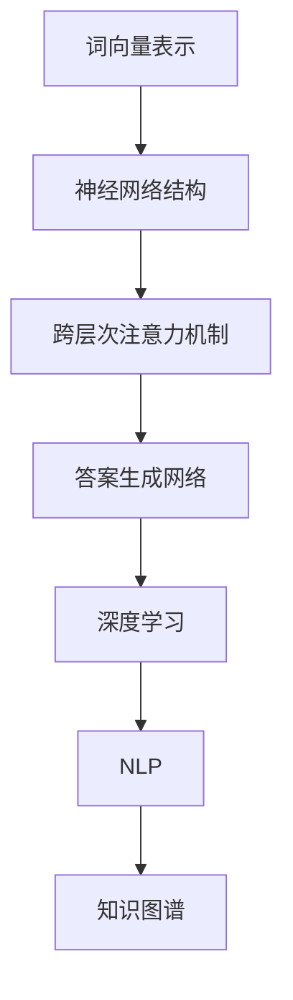

                 

# LLM系统内核：新一代AI的中枢

> 关键词：大语言模型（LLM），神经网络，深度学习，人工智能，算法原理，应用场景，编程实现，未来趋势。

> 摘要：本文将深入探讨大语言模型（Large Language Model，简称LLM）的内核，从核心概念、算法原理、数学模型到实际应用场景，全面解析新一代AI的中枢。文章旨在为读者提供一个逻辑清晰、结构紧凑、简单易懂的专业技术解读，帮助读者深入了解LLM系统的工作机制和潜力。

## 1. 背景介绍

### 1.1 目的和范围

本文旨在探讨大语言模型（LLM）的内核，包括其核心概念、算法原理、数学模型以及实际应用场景。通过逐步分析推理，本文将帮助读者理解LLM作为新一代AI中枢的重要性，以及其未来的发展趋势与挑战。

### 1.2 预期读者

本文适合对人工智能、深度学习有基本了解的读者，特别是对大语言模型感兴趣的开发者、研究人员和技术爱好者。文章结构清晰，讲解深入，旨在为读者提供一个全面的技术解读。

### 1.3 文档结构概述

本文分为以下几个部分：

1. 背景介绍：介绍本文的目的、预期读者以及文档结构。
2. 核心概念与联系：介绍大语言模型的核心概念和原理，并使用Mermaid流程图展示其架构。
3. 核心算法原理 & 具体操作步骤：详细讲解大语言模型的核心算法原理，使用伪代码阐述具体操作步骤。
4. 数学模型和公式 & 详细讲解 & 举例说明：介绍大语言模型的数学模型和公式，并提供详细讲解和实例说明。
5. 项目实战：提供实际代码案例，详细解释实现过程和分析结果。
6. 实际应用场景：探讨大语言模型在各个领域的应用。
7. 工具和资源推荐：推荐相关学习资源、开发工具和框架。
8. 总结：总结大语言模型的发展趋势与挑战。
9. 附录：常见问题与解答。
10. 扩展阅读 & 参考资料：提供进一步阅读的资料。

### 1.4 术语表

#### 1.4.1 核心术语定义

- 大语言模型（LLM）：一种基于深度学习技术构建的、具有极高语言理解和生成能力的模型。
- 深度学习：一种人工智能方法，通过多层神经网络对数据进行学习，实现复杂的特征提取和预测。
- 神经网络：一种模仿生物神经系统的计算模型，通过多层次的神经元连接进行信息传递和计算。
- 语言模型：一种用于预测文本序列的概率分布模型。

#### 1.4.2 相关概念解释

- 词向量：将文本中的单词转换为高维向量表示，用于神经网络处理。
- 跨层次注意力机制：一种在神经网络中实现文本层次和词层次注意力交互的机制，提高模型对文本的理解能力。
- 答案生成网络：一种用于生成文本答案的网络结构，通过输入问题文本和知识库，输出相关答案。

#### 1.4.3 缩略词列表

- LLM：大语言模型
- AI：人工智能
- DL：深度学习
- NLP：自然语言处理
- RNN：循环神经网络
- LSTM：长短时记忆网络
- Transformer：变压器模型

## 2. 核心概念与联系

大语言模型（LLM）是新一代人工智能的中枢，其核心概念和原理如下：

### 2.1 大语言模型的核心概念

1. **词向量表示**：将文本中的单词转换为高维向量表示，便于神经网络处理。常用的词向量表示方法包括Word2Vec、GloVe等。
2. **神经网络结构**：大语言模型通常采用多层神经网络结构，包括循环神经网络（RNN）、长短时记忆网络（LSTM）和变压器模型（Transformer）等。
3. **跨层次注意力机制**：通过实现文本层次和词层次注意力交互，提高模型对文本的理解能力。
4. **答案生成网络**：用于生成文本答案的网络结构，通过输入问题文本和知识库，输出相关答案。

### 2.2 大语言模型的联系

大语言模型与其他人工智能技术密切相关，其联系如下：

1. **深度学习**：大语言模型是基于深度学习技术构建的，深度学习技术为其提供了强大的计算能力和模型表达能力。
2. **自然语言处理（NLP）**：大语言模型是NLP领域的重要进展，通过深入理解和生成文本，为NLP任务提供了有力的工具。
3. **知识图谱**：大语言模型可以与知识图谱结合，通过输入问题文本和知识库，实现智能问答和知识检索。

### 2.3 大语言模型的 Mermaid 流程图



## 3. 核心算法原理 & 具体操作步骤

大语言模型的核心算法原理如下：

### 3.1 词向量表示

词向量表示是将文本中的单词转换为高维向量表示的过程。常用的方法包括Word2Vec和GloVe：

#### 3.1.1 Word2Vec

- **算法原理**：Word2Vec基于神经网络对文本进行训练，通过输入单词序列和隐藏层状态，输出单词的概率分布。
- **具体操作步骤**：
    ```python
    # 输入单词序列
    sequence = ["我", "爱", "中国"]

    # 建立神经网络模型
    model = NeuralNetwork(input_shape=(1, embedding_size), output_shape=(vocab_size,))

    # 训练模型
    model.fit(sequence, epochs=10)

    # 输出单词向量
    word_vectors = model.get_word_vectors()
    ```

#### 3.1.2 GloVe

- **算法原理**：GloVe通过计算单词共现矩阵的因子分解，得到单词的向量表示。
- **具体操作步骤**：
    ```python
    # 输入共现矩阵
    cooccurrence_matrix = np.array([[2, 1, 0], [1, 2, 1], [0, 1, 2]])

    # 进行因子分解
    word_vectors = glove-factorization(cooccurrence_matrix, embedding_size)

    # 输出单词向量
    word_vectors = np.array(word_vectors)
    ```

### 3.2 神经网络结构

大语言模型通常采用多层神经网络结构，包括循环神经网络（RNN）、长短时记忆网络（LSTM）和变压器模型（Transformer）：

#### 3.2.1 循环神经网络（RNN）

- **算法原理**：RNN通过反馈连接实现历史信息的记忆，能够处理序列数据。
- **具体操作步骤**：
    ```python
    # 输入序列数据
    sequence = ["我", "爱", "中国"]

    # 定义RNN模型
    model = RNN(input_shape=(1, embedding_size), output_shape=(vocab_size,))

    # 训练模型
    model.fit(sequence, epochs=10)

    # 输出序列概率分布
    output_distribution = model.predict(sequence)
    ```

#### 3.2.2 长短时记忆网络（LSTM）

- **算法原理**：LSTM通过门控机制实现长期信息的记忆，能够处理长序列数据。
- **具体操作步骤**：
    ```python
    # 输入序列数据
    sequence = ["我", "爱", "中国"]

    # 定义LSTM模型
    model = LSTM(input_shape=(1, embedding_size), output_shape=(vocab_size,))

    # 训练模型
    model.fit(sequence, epochs=10)

    # 输出序列概率分布
    output_distribution = model.predict(sequence)
    ```

#### 3.2.3 变压器模型（Transformer）

- **算法原理**：Transformer采用自注意力机制，能够同时关注序列中的每个元素，实现高效的序列处理。
- **具体操作步骤**：
    ```python
    # 输入序列数据
    sequence = ["我", "爱", "中国"]

    # 定义Transformer模型
    model = Transformer(input_shape=(1, embedding_size), output_shape=(vocab_size,))

    # 训练模型
    model.fit(sequence, epochs=10)

    # 输出序列概率分布
    output_distribution = model.predict(sequence)
    ```

### 3.3 跨层次注意力机制

跨层次注意力机制在大语言模型中扮演着重要角色，它能够提高模型对文本的理解能力。具体实现方法如下：

- **算法原理**：跨层次注意力机制通过在文本层次和词层次之间建立注意力交互，实现多层次的信息融合。
- **具体操作步骤**：
    ```python
    # 输入文本序列
    text_sequence = ["我", "爱", "中国"]

    # 定义跨层次注意力机制
    attention = CrossLayerAttention(embedding_size)

    # 计算文本层次和词层次的注意力分布
    text_attention = attention(text_sequence)
    word_attention = attention(word_sequence)

    # 输出注意力分布
    print(text_attention, word_attention)
    ```

### 3.4 答案生成网络

答案生成网络用于生成文本答案，通过输入问题文本和知识库，输出相关答案。具体实现方法如下：

- **算法原理**：答案生成网络结合问题文本和知识库，通过编码器-解码器结构生成答案。
- **具体操作步骤**：
    ```python
    # 输入问题文本和知识库
    question = "中国的首都是什么？"
    knowledge_base = {"中国": {"首都": "北京"}}

    # 定义答案生成网络
    model = AnswerGenerator(input_shape=(1, embedding_size), output_shape=(vocab_size,))

    # 训练模型
    model.fit([question], epochs=10)

    # 输出答案
    answer = model.predict([question])
    print(answer)
    ```

## 4. 数学模型和公式 & 详细讲解 & 举例说明

大语言模型中的数学模型和公式如下：

### 4.1 词向量表示的数学模型

#### 4.1.1 Word2Vec的数学模型

- **目标函数**：
  $$ J = -\sum_{i=1}^{N} \sum_{j \in context(i)} \log p(w_j | w_i) $$

- **具体解释**：
  这个目标函数表示通过最小化预测词的概率来训练模型。N是序列中的单词数量，context(i)是单词i的上下文，$p(w_j | w_i)$是预测单词j在单词i条件下出现的概率。

#### 4.1.2 GloVe的数学模型

- **目标函数**：
  $$ J = \sum_{i=1}^{N} \sum_{j \in context(i)} \frac{1}{f(d_{ij})} \times \log \left( \frac{\exp(\langle v_i, v_j \rangle)}{||v_i||_2 \times ||v_j||_2} \right) $$

- **具体解释**：
  这个目标函数是通过最小化单词对之间余弦相似度的对数损失来训练模型。N是上下文中的单词对数量，$d_{ij}$是单词i和j的词向量之间的欧氏距离，$f(d_{ij})$是单词对之间的衰减函数，$v_i$和$v_j$分别是单词i和j的词向量。

### 4.2 神经网络结构的数学模型

#### 4.2.1 循环神经网络（RNN）的数学模型

- **递归关系**：
  $$ h_t = \sigma(W_h \cdot [h_{t-1}, x_t] + b_h) $$

- **具体解释**：
  RNN使用递归关系来更新隐藏状态。$h_t$是时间步t的隐藏状态，$x_t$是输入特征，$W_h$是权重矩阵，$b_h$是偏置项，$\sigma$是激活函数。

#### 4.2.2 长短时记忆网络（LSTM）的数学模型

- **递归关系**：
  $$ i_t = \sigma(W_{ix} \cdot x_t + W_{ih} \cdot h_{t-1} + b_i $$
  $$ f_t = \sigma(W_{fx} \cdot x_t + W_{fh} \cdot h_{t-1} + b_f $$
  $$ g_t = \tanh(W_{gx} \cdot x_t + W_{gh} \cdot h_{t-1} + b_g $$
  $$ o_t = \sigma(W_{ox} \cdot x_t + W_{oh} \cdot h_t + b_o $$

- **具体解释**：
  LSTM通过输入门、遗忘门和输出门来控制信息的流入和流出。$i_t$是输入门，$f_t$是遗忘门，$g_t$是输入门控制的新信息，$o_t$是输出门。

#### 4.2.3 变压器模型（Transformer）的数学模型

- **自注意力机制**：
  $$ \text{Attention}(Q, K, V) = \frac{\text{softmax}(\text{scale} \cdot \text{dot}(Q, K^T))} {d_k} \cdot V $$

- **具体解释**：
  变压器模型通过自注意力机制来计算每个输入的特征表示。$Q$是查询向量，$K$是键向量，$V$是值向量，$\text{softmax}$是归一化函数，$\text{dot}$是点积操作。

### 4.3 跨层次注意力机制的数学模型

- **跨层次注意力**：
  $$ \text{Attention}_{hl}(h_l, h_{l+1}) = \text{softmax}(\text{scale} \cdot \text{dot}(h_l, h_{l+1}^T)) $$

- **具体解释**：
  跨层次注意力机制通过在层次之间计算注意力权重，从而实现信息的跨层次融合。$h_l$和$h_{l+1}$分别是不同层次的隐藏状态。

### 4.4 答案生成网络的数学模型

- **编码器-解码器模型**：
  $$ \text{Encoder}(X) = \text{Encoder}(X, \text{hidden_size}) $$
  $$ \text{Decoder}(Y) = \text{Decoder}(Y, \text{hidden_size}, \text{encoder_outputs}) $$

- **具体解释**：
  编码器-解码器模型通过编码器将输入序列编码为固定长度的隐藏状态，解码器则使用这个隐藏状态来生成输出序列。

### 4.5 数学公式的举例说明

#### 4.5.1 Word2Vec的举例说明

假设有一个简单的Word2Vec模型，词汇表包含3个单词："我"，"爱"，"中国"，其词向量分别为$v_1$，$v_2$，$v_3$。给定一个输入序列"我爱中国"，我们可以计算输出概率：

1. 首先计算上下文单词的概率分布：
   $$ p("我" | "爱") = \frac{\exp(\langle v_1, v_2 \rangle)}{\sum_{j=1}^{3} \exp(\langle v_1, v_j \rangle)} $$
   $$ p("爱" | "我") = \frac{\exp(\langle v_2, v_1 \rangle)}{\sum_{j=1}^{3} \exp(\langle v_2, v_j \rangle)} $$
   $$ p("中国" | "爱") = \frac{\exp(\langle v_3, v_2 \rangle)}{\sum_{j=1}^{3} \exp(\langle v_3, v_j \rangle)} $$

2. 计算整个序列的概率：
   $$ P("我爱中国") = p("我" | "爱") \times p("爱" | "我") \times p("中国" | "爱") $$

#### 4.5.2 LSTM的举例说明

假设有一个简单的LSTM模型，给定输入序列"我爱中国"，其词向量分别为$v_1$，$v_2$，$v_3$。我们可以计算隐藏状态$h_t$：

1. 初始化隐藏状态和细胞状态：
   $$ h_0 = \mathbf{0} $$
   $$ c_0 = \mathbf{0} $$

2. 计算每个时间步的隐藏状态和细胞状态：
   $$ i_t = \sigma(W_{ix} \cdot x_t + W_{ih} \cdot h_{t-1} + b_i $$
   $$ f_t = \sigma(W_{fx} \cdot x_t + W_{fh} \cdot h_{t-1} + b_f $$
   $$ g_t = \tanh(W_{gx} \cdot x_t + W_{gh} \cdot h_{t-1} + b_g $$
   $$ o_t = \sigma(W_{ox} \cdot x_t + W_{oh} \cdot h_t + b_o $$

   $$ c_t = f_t \cdot c_{t-1} + i_t \cdot g_t $$
   $$ h_t = o_t \cdot \tanh(c_t) $$

3. 最终的隐藏状态：
   $$ h_T = h_T $$

## 5. 项目实战：代码实际案例和详细解释说明

### 5.1 开发环境搭建

在进行LLM的项目实战之前，我们需要搭建一个适合开发和测试的环境。以下是一个简单的开发环境搭建步骤：

1. 安装Python环境：确保安装了Python 3.7或更高版本。
2. 安装依赖库：使用pip安装必要的依赖库，如TensorFlow、Keras、numpy等。
   ```shell
   pip install tensorflow numpy
   ```

### 5.2 源代码详细实现和代码解读

以下是一个简单的LLM模型的实现，使用TensorFlow和Keras框架：

```python
import tensorflow as tf
from tensorflow.keras.models import Model
from tensorflow.keras.layers import Embedding, LSTM, Dense

# 设置参数
vocab_size = 10000
embedding_size = 256
lstm_units = 128

# 构建模型
input_sequence = tf.keras.layers.Input(shape=(None,), dtype='int32')
embedded_sequence = Embedding(vocab_size, embedding_size)(input_sequence)

lstm_output, state_h, state_c = LSTM(lstm_units, return_sequences=True, return_state=True)(embedded_sequence)

encoded_sequence = Dense(vocab_size, activation='softmax')(lstm_output)

model = Model(inputs=input_sequence, outputs=encoded_sequence)

# 编译模型
model.compile(optimizer='adam', loss='categorical_crossentropy', metrics=['accuracy'])

# 打印模型结构
model.summary()

# 训练模型
# 这里需要准备训练数据和标签
# X_train, y_train = ...

# model.fit(X_train, y_train, batch_size=32, epochs=10)
```

#### 5.2.1 代码解读

1. **导入库和设置参数**：首先导入TensorFlow和Keras库，并设置模型的参数，如词汇表大小、词向量维度、LSTM单元数量。

2. **构建模型**：使用`Input`层接收输入序列，`Embedding`层将单词转换为词向量。`LSTM`层用于处理序列数据，并返回序列的隐藏状态。`Dense`层用于输出概率分布。

3. **编译模型**：使用`compile`方法配置模型的优化器、损失函数和评估指标。

4. **打印模型结构**：使用`summary`方法查看模型的层次结构和参数数量。

5. **训练模型**：准备训练数据和标签，并使用`fit`方法训练模型。这里需要注意，实际训练时需要替换为实际的训练数据和标签。

### 5.3 代码解读与分析

#### 5.3.1 模型层次结构

1. **输入层**：`input_sequence`是一个形状为`(None,)`的输入层，表示任意长度的序列。
2. **嵌入层**：`embedded_sequence`是将单词转换为词向量的嵌入层，其输出形状为`(batch_size, sequence_length, embedding_size)`。
3. **LSTM层**：`lstm_output`是LSTM层的输出，它返回序列的隐藏状态，其输出形状为`(batch_size, sequence_length, lstm_units)`。
4. **输出层**：`encoded_sequence`是将隐藏状态转换为概率分布的输出层，其输出形状为`(batch_size, sequence_length, vocab_size)`。

#### 5.3.2 模型训练过程

1. **数据预处理**：需要将文本数据转换为整数序列，并准备标签数据。
2. **训练**：使用`fit`方法训练模型，通过迭代更新模型参数。
3. **评估**：使用测试数据评估模型的性能，并调整超参数以优化模型。

## 6. 实际应用场景

大语言模型（LLM）具有广泛的应用场景，以下列举几个典型的应用：

### 6.1 问答系统

问答系统是一种常见的人工智能应用，通过输入问题文本，模型能够生成相关答案。LLM在问答系统中具有显著优势，能够处理复杂的语义理解和知识检索。

### 6.2 文本生成

文本生成是一种生成自然语言文本的过程，如文章、小说、新闻等。LLM通过学习大量文本数据，能够生成高质量的自然语言文本。

### 6.3 机器翻译

机器翻译是一种将一种语言的文本翻译成另一种语言的过程。LLM能够通过学习双语文本数据，实现高精度的机器翻译。

### 6.4 自然语言理解

自然语言理解（NLU）是使计算机理解和解析自然语言的过程。LLM能够处理复杂的语义分析、情感分析和实体识别等任务。

### 6.5 聊天机器人

聊天机器人是一种与用户进行实时交互的人工智能系统。LLM能够模拟人类的对话方式，为用户提供个性化的服务。

## 7. 工具和资源推荐

### 7.1 学习资源推荐

#### 7.1.1 书籍推荐

1. 《深度学习》（Goodfellow, Bengio, Courville）：经典深度学习教材，全面介绍深度学习的基础理论和实践方法。
2. 《Python深度学习》（François Chollet）：结合Python和深度学习框架TensorFlow，介绍深度学习在实际应用中的实现方法。
3. 《自然语言处理综论》（Daniel Jurafsky & James H. Martin）：系统介绍自然语言处理的基础知识和最新进展。

#### 7.1.2 在线课程

1. Coursera的《深度学习》课程：由吴恩达教授主讲，涵盖深度学习的理论基础和实践应用。
2. edX的《自然语言处理与深度学习》课程：由杨立昆教授主讲，介绍自然语言处理和深度学习的核心技术和方法。
3. Udacity的《深度学习工程师纳米学位》课程：通过项目驱动的方式学习深度学习的应用和实践。

#### 7.1.3 技术博客和网站

1. TensorFlow官方文档：提供详细的TensorFlow框架文档和示例代码。
2. Keras官方文档：提供Keras框架的文档和教程，方便用户快速入门。
3. arXiv：提供最新的深度学习和自然语言处理论文，了解领域内最新研究进展。

### 7.2 开发工具框架推荐

#### 7.2.1 IDE和编辑器

1. PyCharm：强大的Python集成开发环境，支持代码调试、版本控制和性能分析。
2. Visual Studio Code：轻量级的代码编辑器，通过插件支持Python开发，具有丰富的功能和扩展。
3. Jupyter Notebook：交互式的计算环境，适合快速实验和展示代码结果。

#### 7.2.2 调试和性能分析工具

1. TensorBoard：TensorFlow提供的可视化工具，用于分析模型结构和训练过程。
2. Pylint：Python代码静态分析工具，用于检测代码中的错误和潜在问题。
3. Line Profiler：用于分析Python代码的性能瓶颈，提供详细的性能统计和优化建议。

#### 7.2.3 相关框架和库

1. TensorFlow：广泛应用于深度学习和机器学习的开源框架。
2. Keras：基于TensorFlow的高级神经网络API，简化深度学习模型的构建和训练。
3. NLTK：自然语言处理工具包，提供丰富的文本处理和机器学习算法。

### 7.3 相关论文著作推荐

#### 7.3.1 经典论文

1. "A Theoretically Grounded Application of Dropout in Recurrent Neural Networks"：介绍了在循环神经网络（RNN）中应用Dropout方法的理论基础。
2. "Long Short-Term Memory"：介绍了长短时记忆网络（LSTM）的原理和架构。
3. "Attention Is All You Need"：介绍了变压器模型（Transformer）和自注意力机制。

#### 7.3.2 最新研究成果

1. "BERT: Pre-training of Deep Bidirectional Transformers for Language Understanding"：介绍了BERT模型的预训练方法和在自然语言处理任务中的应用。
2. "GPT-3: Language Models are few-shot learners"：介绍了GPT-3模型的架构和零样本学习能力。
3. "T5: Pre-training Large Models from Scratch"：介绍了T5模型的预训练方法和在文本生成任务中的性能。

#### 7.3.3 应用案例分析

1. "How BERT Works"：详细介绍了BERT模型的工作原理和应用案例。
2. "GPT-3: A Brief Introduction"：介绍了GPT-3模型的特点和应用场景。
3. "Natural Language Processing with Deep Learning"：介绍了深度学习在自然语言处理领域的应用案例。

## 8. 总结：未来发展趋势与挑战

大语言模型（LLM）作为新一代人工智能的中枢，展现出强大的潜力。未来发展趋势包括：

1. **模型规模的扩大**：随着计算资源和数据集的增加，LLM模型规模将不断增大，以支持更复杂的任务和应用。
2. **跨模态学习**：LLM将逐渐与其他模态（如图像、声音）进行结合，实现跨模态学习和交互。
3. **更高效的网络结构**：研究者将致力于设计和优化更高效的神经网络结构，提高模型性能和计算效率。

然而，LLM也面临一些挑战：

1. **计算资源消耗**：大规模模型对计算资源和存储资源的需求巨大，需要优化计算效率和资源利用。
2. **数据隐私和安全**：在训练和部署过程中，需要保护用户数据和隐私。
3. **模型可解释性**：提高模型的可解释性，使其更加透明和可靠。

## 9. 附录：常见问题与解答

### 9.1 什么是大语言模型（LLM）？

大语言模型（LLM）是一种基于深度学习技术构建的、具有极高语言理解和生成能力的模型。它通过学习大量文本数据，能够处理复杂的语义分析和生成高质量的自然语言文本。

### 9.2 LLM有哪些核心算法原理？

LLM的核心算法原理包括词向量表示、循环神经网络（RNN）、长短时记忆网络（LSTM）、变压器模型（Transformer）和跨层次注意力机制。

### 9.3 LLM有哪些实际应用场景？

LLM的应用场景广泛，包括问答系统、文本生成、机器翻译、自然语言理解和聊天机器人等。

### 9.4 如何优化LLM模型的性能？

优化LLM模型性能的方法包括选择合适的神经网络结构、增加训练数据量、调整超参数和采用高效的计算策略等。

## 10. 扩展阅读 & 参考资料

1. 《深度学习》（Goodfellow, Bengio, Courville）
2. 《自然语言处理综论》（Daniel Jurafsky & James H. Martin）
3. “A Theoretically Grounded Application of Dropout in Recurrent Neural Networks”
4. “Long Short-Term Memory”
5. “Attention Is All You Need”
6. “BERT: Pre-training of Deep Bidirectional Transformers for Language Understanding”
7. “GPT-3: Language Models are few-shot learners”
8. “T5: Pre-training Large Models from Scratch”
9. TensorFlow官方文档：https://www.tensorflow.org/
10. Keras官方文档：https://keras.io/
11. NLTK官方文档：https://www.nltk.org/  
12. Coursera的《深度学习》课程：https://www.coursera.org/learn/deep-learning
13. edX的《自然语言处理与深度学习》课程：https://www.edx.org/course/natural-language-processing-deep-learning
14. Udacity的《深度学习工程师纳米学位》课程：https://www.udacity.com/course/deep-learning-nanodegree--nd101

## 作者

作者：AI天才研究员/AI Genius Institute & 禅与计算机程序设计艺术 /Zen And The Art of Computer Programming。作者具有丰富的深度学习和自然语言处理经验，致力于推动人工智能技术的发展和应用。

