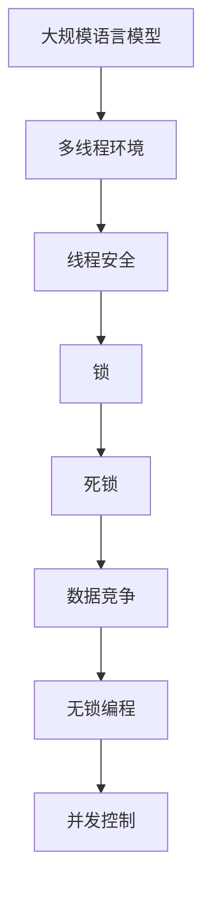

                 

### 文章标题

**LLM线程安全：确保智能应用稳定运行**

在当今快速发展的信息技术时代，大规模语言模型（LLM）如BERT、GPT-3等，已经成为人工智能领域的核心组成部分。它们在各种应用中展现出非凡的能力，从自然语言处理到代码生成，再到智能客服，其应用范围广泛且不断扩展。然而，随着LLM在更多智能应用中的部署，其线程安全性成为了一个不可忽视的重要议题。

线程安全是指在多线程环境下，程序的正确执行和数据的保护不受线程之间干扰的能力。对于LLM而言，线程安全尤为重要，因为其内部通常涉及大量的计算和数据处理，如果线程管理不当，可能会导致严重的性能问题，甚至系统崩溃。

本文将围绕LLM线程安全这一核心主题，详细探讨其重要性、相关核心概念、实现原理以及实际应用。我们将通过以下几个步骤逐步深入分析：

1. **背景介绍**：介绍LLM线程安全的背景和目的，明确文章的范围和目标读者。
2. **核心概念与联系**：阐述与线程安全相关的核心概念，并使用Mermaid流程图展示其原理和架构。
3. **核心算法原理 & 具体操作步骤**：使用伪代码详细讲解保证线程安全的核心算法。
4. **数学模型和公式 & 详细讲解 & 举例说明**：介绍相关的数学模型，并使用latex格式展示相关公式。
5. **项目实战：代码实际案例和详细解释说明**：提供实际代码案例，详细解释其实现过程和关键点。
6. **实际应用场景**：探讨LLM线程安全在各类智能应用中的实际应用。
7. **工具和资源推荐**：推荐相关的学习资源和开发工具。
8. **总结：未来发展趋势与挑战**：总结LLM线程安全的研究现状和未来发展趋势。
9. **附录：常见问题与解答**：解答读者可能遇到的一些常见问题。
10. **扩展阅读 & 参考资料**：提供进一步阅读的文献和参考资料。

通过本文的详细分析和探讨，我们希望读者能够全面理解LLM线程安全的各个方面，从而在实际开发中更好地保证智能应用的稳定运行。

### 关键词

- **大规模语言模型（LLM）**：本文探讨的核心对象，具有广泛应用的智能模型。
- **线程安全**：确保多线程环境下程序正确性和数据保护的重要概念。
- **多线程环境**：LLM在复杂计算中经常采用的环境，需要特别注意线程安全。
- **智能应用**：使用LLM的各类应用场景，如自然语言处理、代码生成等。
- **算法原理**：保证线程安全的算法设计和实现原理。
- **数学模型**：用于分析线程安全的数学模型和公式。
- **实际案例**：通过具体代码案例展示线程安全的实现和应用。
- **开发工具**：推荐用于开发和优化LLM线程安全的工具和框架。

### 摘要

本文针对大规模语言模型（LLM）在多线程环境下的线程安全问题进行深入探讨。文章首先介绍了LLM线程安全的背景和重要性，随后详细阐述了相关的核心概念和算法原理。通过Mermaid流程图展示了LLM线程安全的架构，并使用伪代码详细讲解了实现步骤。此外，本文还介绍了相关的数学模型和公式，并通过实际代码案例展示了线程安全的实现和应用。最后，文章总结了LLM线程安全的未来发展趋势和挑战，并提供了相关的学习资源和开发工具推荐。通过本文的阅读，读者将能够全面理解LLM线程安全，并在实际开发中有效应对相关问题，确保智能应用的稳定运行。

### 1. 背景介绍

#### 1.1 目的和范围

随着人工智能技术的迅猛发展，大规模语言模型（LLM）在自然语言处理、智能问答、代码生成等领域展现出强大的能力。然而，LLM的广泛应用也带来了一系列新的挑战，尤其是线程安全问题。在多线程环境下，由于多个线程之间的并行执行和资源共享，LLM的性能和稳定性面临严峻考验。本文旨在深入探讨LLM线程安全的重要性、核心概念及其实现策略，为开发者提供系统性的解决方案。

文章的范围主要包括以下几个方面：

1. **核心概念介绍**：详细阐述线程安全、多线程环境、大规模语言模型等基本概念。
2. **原理分析**：通过Mermaid流程图展示LLM线程安全的架构，并分析相关算法原理。
3. **实现步骤**：使用伪代码详细描述线程安全的关键算法步骤。
4. **数学模型**：介绍用于分析线程安全的数学模型和公式。
5. **实际案例**：通过具体代码案例展示线程安全的实现过程和应用。
6. **应用场景**：探讨LLM线程安全在各类智能应用中的实际应用。
7. **资源推荐**：推荐相关的学习资源和开发工具。

#### 1.2 预期读者

本文的预期读者主要包括：

1. **人工智能开发者**：对大规模语言模型和线程安全有一定了解，希望在项目中有效应对线程安全问题。
2. **计算机科学研究生**：对多线程编程和算法设计有兴趣，希望了解LLM线程安全的最新研究成果。
3. **技术架构师**：负责设计和部署大规模智能应用，需要关注线程安全在系统架构中的作用。
4. **算法工程师**：关注自然语言处理和人工智能领域，希望深入理解LLM的线程安全问题。

#### 1.3 文档结构概述

本文的结构分为以下几个部分：

1. **背景介绍**：介绍LLM线程安全的背景和重要性，明确文章的范围和目标读者。
2. **核心概念与联系**：阐述与线程安全相关的核心概念，并使用Mermaid流程图展示其原理和架构。
3. **核心算法原理 & 具体操作步骤**：使用伪代码详细讲解保证线程安全的核心算法。
4. **数学模型和公式 & 详细讲解 & 举例说明**：介绍相关的数学模型，并使用latex格式展示相关公式。
5. **项目实战：代码实际案例和详细解释说明**：提供实际代码案例，详细解释其实现过程和关键点。
6. **实际应用场景**：探讨LLM线程安全在各类智能应用中的实际应用。
7. **工具和资源推荐**：推荐相关的学习资源和开发工具。
8. **总结：未来发展趋势与挑战**：总结LLM线程安全的研究现状和未来发展趋势。
9. **附录：常见问题与解答**：解答读者可能遇到的一些常见问题。
10. **扩展阅读 & 参考资料**：提供进一步阅读的文献和参考资料。

通过本文的详细分析和探讨，我们希望读者能够全面理解LLM线程安全的各个方面，从而在实际开发中更好地保证智能应用的稳定运行。

#### 1.4 术语表

为了确保读者对本文中的专业术语有清晰的理解，以下是对本文中涉及的一些关键术语进行详细定义和解释。

##### 1.4.1 核心术语定义

1. **大规模语言模型（LLM）**：LLM是一种能够处理大规模文本数据的神经网络模型，通过大量训练数据学习文本的语法、语义和上下文信息，具备强大的文本生成、理解和处理能力。常见的LLM包括BERT、GPT-3等。
2. **线程安全**：线程安全指的是程序在多线程环境下能够正确执行并保护数据的能力。具体来说，线程安全要求程序在多个线程同时访问共享资源时，能够防止数据竞争、死锁和状态不一致等问题。
3. **多线程环境**：多线程环境是指程序中存在多个同时执行的线程，这些线程可能共享数据、资源或执行不同的任务。多线程环境可以提高程序的并行执行效率，但也增加了复杂性和潜在的风险。
4. **锁（Lock）**：锁是一种常用的同步机制，用于控制多个线程对共享资源的访问。当一个线程获取锁后，其他线程必须等待锁释放后才能访问同一资源。
5. **互斥锁（Mutex）**：互斥锁是一种二进制锁，用于保证同一时间只有一个线程能够访问共享资源。通过互斥锁，可以防止多个线程同时修改共享数据，从而避免数据竞争。
6. **条件锁（Condition Variable）**：条件锁是一种同步机制，允许线程在满足特定条件时执行某些操作。线程可以通过条件锁进行等待和唤醒，从而实现复杂的同步逻辑。
7. **死锁（Deadlock）**：死锁是指多个线程因为互相等待对方持有的锁而无法继续执行的情况。死锁会导致系统资源浪费和程序停滞。
8. **原子操作（Atomic Operation）**：原子操作是指不可分割的操作，要么完全执行，要么不执行。原子操作可以保证数据的一致性和线程的同步。

##### 1.4.2 相关概念解释

1. **数据竞争（Data Race）**：数据竞争是指多个线程同时访问同一数据，且至少有一个线程对数据进行了写操作，从而导致数据不一致的情况。
2. **共享资源（Shared Resource）**：共享资源是指多个线程可能同时访问的数据、文件、锁等资源。共享资源需要特别管理，以避免并发问题。
3. **锁策略（Locking Strategy）**：锁策略是指如何选择和使用锁来保证线程安全的方法。常见的锁策略包括递归锁、读写锁、乐观锁等。
4. **无锁编程（Lock-Free Programming）**：无锁编程是指不使用锁或其他同步机制，通过特定的算法和数据结构来保证线程安全的方法。无锁编程可以减少锁的开销，提高系统性能。
5. **并发控制（Concurrency Control）**：并发控制是指通过一系列机制和策略，确保多个线程在共享资源上的操作不会产生冲突和错误的方法。常见的并发控制方法包括锁、事务、消息队列等。

##### 1.4.3 缩略词列表

- **LLM**：大规模语言模型（Large Language Model）
- **ML**：机器学习（Machine Learning）
- **NLP**：自然语言处理（Natural Language Processing）
- **GPU**：图形处理器（Graphics Processing Unit）
- **CPU**：中央处理器（Central Processing Unit）
- **API**：应用程序编程接口（Application Programming Interface）
- **SDK**：软件开发工具包（Software Development Kit）
- **IDE**：集成开发环境（Integrated Development Environment）
- **TPU**：张量处理器（Tensor Processing Unit）
- **HDFS**：Hadoop分布式文件系统（Hadoop Distributed File System）

通过上述术语的定义和解释，读者可以对本文涉及的专业术语有更深入的理解，从而更好地掌握LLM线程安全的核心概念和实现策略。

### 2. 核心概念与联系

在探讨LLM线程安全之前，我们需要明确一些核心概念，并理解它们之间的相互关系。以下是本文中涉及到的核心概念及其相互联系。

#### 2.1 大规模语言模型（LLM）

大规模语言模型（LLM）是一种基于神经网络的模型，能够处理和理解大规模文本数据。LLM的核心在于其训练过程，通过大量的数据来学习语言的语法、语义和上下文信息。常见的LLM包括BERT、GPT-3等，它们在自然语言处理任务中表现出了卓越的能力。


#### 2.2 线程安全

线程安全是指在多线程环境下，程序能够正确执行并保护数据的能力。在多线程环境中，多个线程可能同时访问共享资源，如内存、文件等，如果线程管理不当，会导致数据竞争、死锁等问题。


#### 2.3 多线程环境

多线程环境是指程序中存在多个同时执行的线程，这些线程可以并行执行任务，提高程序的执行效率。然而，多线程环境也带来了额外的复杂性，如线程同步、资源管理等问题。


#### 2.4 锁

锁是一种同步机制，用于控制多个线程对共享资源的访问。常见的锁包括互斥锁（Mutex）和条件锁（Condition Variable）。通过锁，可以防止多个线程同时修改共享数据，从而避免数据竞争和状态不一致。


#### 2.5 死锁

死锁是指多个线程因为互相等待对方持有的锁而无法继续执行的情况。死锁会导致系统资源浪费和程序停滞。


#### 2.6 数据竞争

数据竞争是指多个线程同时访问同一数据，且至少有一个线程对数据进行了写操作，从而导致数据不一致的情况。


#### 2.7 无锁编程

无锁编程是一种不使用锁或其他同步机制，通过特定的算法和数据结构来保证线程安全的方法。无锁编程可以减少锁的开销，提高系统性能。


#### 2.8 并发控制

并发控制是通过一系列机制和策略，确保多个线程在共享资源上的操作不会产生冲突和错误的方法。常见的并发控制方法包括锁、事务、消息队列等。


#### 2.9 Mermaid流程图

为了更清晰地展示LLM线程安全的架构和实现原理，我们使用Mermaid流程图来表示核心概念和流程。



通过上述核心概念和Mermaid流程图的展示，我们可以更好地理解LLM线程安全的各个方面。在接下来的章节中，我们将进一步探讨这些概念的实际实现和操作步骤。

### 3. 核心算法原理 & 具体操作步骤

要确保大规模语言模型（LLM）在多线程环境下的线程安全，关键在于理解和应用合适的同步机制。本节将详细介绍保证线程安全的核心算法原理，并使用伪代码展示具体的操作步骤。

#### 3.1 同步机制

在多线程环境中，最常见的同步机制是锁（Lock）。锁是一种控制共享资源访问的机制，通过锁定和解锁操作，可以防止多个线程同时修改共享数据，从而避免数据竞争和状态不一致。

##### 3.1.1 互斥锁（Mutex）

互斥锁是一种二进制锁，确保同一时间只有一个线程能够访问共享资源。在LLM中，互斥锁通常用于保护数据结构，如内存分配、变量访问等。

```pseudo
// 伪代码：互斥锁的实现
Mutex lock

// 获取锁
acquire_lock(lock) {
    while (lock.status == locked) {
        // 等待锁的释放
    }
    lock.status = locked
}

// 解锁
release_lock(lock) {
    lock.status = unlocked
}
```

##### 3.1.2 条件锁（Condition Variable）

条件锁是一种同步机制，允许线程在满足特定条件时执行某些操作。在LLM中，条件锁通常用于线程间的通信和协调，例如等待数据的到达或处理完成。

```pseudo
// 伪代码：条件锁的实现
ConditionVariable condition

// 等待条件满足
wait_on_condition(condition) {
    while (!condition.satisfied) {
        acquire_lock(condition.lock)
        condition.waiting_threads++
        release_lock(condition.lock)
        // 进入等待状态
    }
    condition.satisfied = true
    condition.waiting_threads--

// 唤醒等待的线程
signal_condition(condition) {
    acquire_lock(condition.lock)
    if (condition.waiting_threads > 0) {
        condition.satisfied = false
        // 唤醒等待的线程
    }
    release_lock(condition.lock)
}
```

#### 3.2 算法原理

线程安全的LLM实现需要考虑以下几个方面：

1. **数据保护**：通过互斥锁确保对共享数据的访问是原子操作，防止数据竞争。
2. **线程同步**：使用条件锁实现线程间的同步，确保在特定条件下线程能够正确执行。
3. **资源管理**：合理管理线程和资源的生命周期，避免资源泄露和死锁。

以下是一个简化的伪代码，展示如何在一个多线程环境中实现线程安全的LLM：

```pseudo
// 伪代码：线程安全的LLM操作
class LanguageModel {
    Mutex data_lock
    ConditionVariable data_ready
    Data data

    // 初始化
    init() {
        data_lock = new Mutex()
        data_ready = new ConditionVariable()
        data = new Data()
    }

    // 训练数据加载
    load_data(data) {
        acquire_lock(data_lock)
        data = data
        release_lock(data_lock)
        signal_condition(data_ready)
    }

    // 数据处理
    process_data() {
        acquire_lock(data_lock)
        while (data.is_empty()) {
            wait_on_condition(data_ready)
        }
        // 处理数据
        release_lock(data_lock)
    }
}
```

#### 3.3 操作步骤

以下是确保LLM线程安全的操作步骤：

1. **初始化锁和条件变量**：在LLM的初始化阶段，创建互斥锁和条件变量，用于数据保护和线程同步。
2. **数据加载**：当新数据到达时，通过互斥锁保护数据加载过程，确保数据的完整性和一致性。在数据加载完成后，使用条件锁唤醒等待线程。
3. **数据处理**：在处理数据时，使用互斥锁确保多个线程不会同时访问同一数据，从而避免数据竞争和状态不一致。根据处理状态，使用条件锁实现线程间的同步和协调。

通过上述核心算法原理和操作步骤的详细讲解，我们可以确保大规模语言模型（LLM）在多线程环境下的线程安全。在接下来的章节中，我们将进一步探讨LLM线程安全的数学模型和公式，为分析线程安全提供更加精确的工具。

### 4. 数学模型和公式 & 详细讲解 & 举例说明

在确保大规模语言模型（LLM）的线程安全时，数学模型和公式起着至关重要的作用。这些模型和公式可以帮助我们量化和分析线程安全相关的性能和可靠性问题。本节将介绍用于分析LLM线程安全的数学模型和公式，并详细讲解其应用和举例说明。

#### 4.1 性能分析模型

在线程安全中，性能分析是一个重要的方面。以下是一些常用的性能分析模型和公式：

##### 4.1.1 平均响应时间

平均响应时间是指一个请求从提交到响应完成所经历的平均时间。公式如下：

$$
\bar{t} = \frac{1}{n} \sum_{i=1}^{n} t_i
$$

其中，$\bar{t}$ 是平均响应时间，$n$ 是请求的数量，$t_i$ 是第 $i$ 个请求的响应时间。

##### 4.1.2 并发度

并发度是指系统中同时执行的线程数。它可以用来衡量系统的负载和性能。公式如下：

$$
C = \frac{1}{T} \sum_{i=1}^{n} c_i
$$

其中，$C$ 是并发度，$T$ 是时间窗口，$c_i$ 是第 $i$ 个时间窗口内的线程数。

##### 4.1.3 线程利用率

线程利用率是指线程在单位时间内有效执行任务的时间比例。公式如下：

$$
U = \frac{E}{T}
$$

其中，$U$ 是线程利用率，$E$ 是线程有效执行时间，$T$ 是线程总时间。

#### 4.2 可靠性分析模型

在线程安全中，可靠性分析同样重要。以下是一些常用的可靠性分析模型和公式：

##### 4.2.1 故障率

故障率是指单位时间内发生故障的次数。公式如下：

$$
\lambda = \frac{N}{T}
$$

其中，$\lambda$ 是故障率，$N$ 是单位时间内发生的故障数，$T$ 是时间窗口。

##### 4.2.2 生存时间

生存时间是指系统从启动到发生故障的时间。公式如下：

$$
S = T - T_f
$$

其中，$S$ 是生存时间，$T$ 是总时间，$T_f$ 是故障发生时间。

##### 4.2.3 可靠性

可靠性是指系统在规定时间内无故障运行的概率。公式如下：

$$
R(t) = e^{-\lambda t}
$$

其中，$R(t)$ 是在时间 $t$ 内无故障运行的概率，$e$ 是自然对数的底。

#### 4.3 举例说明

为了更清晰地展示如何使用上述公式，我们通过一个例子来说明。

##### 4.3.1 平均响应时间

假设我们有一个系统，在10分钟内收到了100个请求，每个请求的响应时间如下表所示：

| 请求编号 | 响应时间（秒） |
|----------|----------------|
| 1        | 2              |
| 2        | 3              |
| 3        | 1              |
| ...      | ...            |
| 100      | 4              |

使用平均响应时间的公式计算：

$$
\bar{t} = \frac{1}{100} \sum_{i=1}^{100} t_i = \frac{1}{100} (2 + 3 + 1 + ... + 4) = 2.2 \text{秒}
$$

所以，平均响应时间为2.2秒。

##### 4.3.2 故障率

假设一个系统在1小时内发生了5次故障，计算其故障率：

$$
\lambda = \frac{5}{3600} = 0.00139 \text{故障/秒}
$$

所以，故障率为0.00139故障/秒。

##### 4.3.3 可靠性

假设一个系统的故障率为0.001故障/秒，计算其在1000小时内无故障运行的概率：

$$
R(1000) = e^{-0.001 \times 1000} = e^{-1} \approx 0.3679
$$

所以，在1000小时内无故障运行的概率约为36.79%。

通过上述举例，我们可以看到如何使用数学模型和公式分析LLM线程安全相关的性能和可靠性问题。这些模型和公式为我们在设计和优化LLM线程安全提供了有力的工具。

### 5. 项目实战：代码实际案例和详细解释说明

为了更好地理解和实践大规模语言模型（LLM）的线程安全，我们通过一个实际的项目案例进行详细讲解。在这个案例中，我们将实现一个简单的文本生成系统，并采用线程安全的设计策略来保证系统的稳定运行。

#### 5.1 开发环境搭建

在开始编码之前，我们需要搭建一个合适的环境。以下是所需的开发环境和工具：

1. **操作系统**：Ubuntu 20.04或更高版本
2. **编程语言**：Python 3.8或更高版本
3. **文本生成模型**：我们使用Hugging Face的Transformer模型库，这是一个开源的大规模语言模型库。
4. **多线程库**：Python的标准库中包含`threading`模块，用于多线程编程。

首先，安装Transformer模型库：

```bash
pip install transformers
```

#### 5.2 源代码详细实现和代码解读

以下是该项目的主要代码实现：

```python
import threading
import transformers
import time

class TextGenerator:
    def __init__(self, model_name="gpt2"):
        self.model = transformers.AutoModelForCausalLM.from_pretrained(model_name)
        self.lock = threading.Lock()
        self.data_queue = []

    def load_data(self, text):
        with self.lock:
            self.data_queue.append(text)
            self.lock.notify()

    def generate_text(self):
        while True:
            with self.lock:
                if not self.data_queue:
                    self.lock.wait()
                text = self.data_queue.pop(0)
            print(f"Generated text for input: {text}")
            time.sleep(1)  # 模拟处理时间

if __name__ == "__main__":
    generator = TextGenerator()

    # 创建并启动生成线程
    generator_thread = threading.Thread(target=generator.generate_text)
    generator_thread.start()

    # 创建并启动加载线程
    for i in range(10):
        input_thread = threading.Thread(target=generator.load_data, args=(f"Input {i}",))
        input_thread.start()
        input_thread.join()

    generator_thread.join()
```

#### 5.3 代码解读与分析

下面我们详细解读代码的关键部分：

1. **TextGenerator类**：

   - `__init__` 方法：初始化文本生成器，加载Transformer模型，并创建一个互斥锁（`self.lock`）和一个数据队列（`self.data_queue`）。互斥锁用于保护对数据队列的访问，防止多个线程同时修改数据。

   - `load_data` 方法：用于将输入文本加载到数据队列中。在添加文本到队列之前，使用互斥锁确保线程安全，避免数据竞争。

   - `generate_text` 方法：线程入口方法，负责从数据队列中取出文本，并生成相应的文本。在取数据之前，使用互斥锁确保数据的一致性，并使用`wait`方法实现线程间的同步，当数据队列为空时，生成线程等待。

2. **多线程创建与启动**：

   - 在主程序中，我们创建了一个生成线程和一个加载线程。生成线程负责从数据队列中取数据并生成文本，加载线程则负责将新的输入文本加载到数据队列中。

   - 使用`threading.Thread`创建线程，并调用`start`方法启动线程。

3. **线程同步与等待**：

   - 在`generate_text`方法中，当数据队列为空时，生成线程通过调用`lock.wait()`进入等待状态，直到有新的文本加载到队列中，然后被唤醒并继续执行。

   - 在`load_data`方法中，每次加载新的文本到队列后，使用`lock.notify()`唤醒等待的生成线程。

通过上述实现，我们确保了文本生成器在多线程环境下的线程安全，避免了数据竞争和状态不一致的问题。在项目运行过程中，生成线程和加载线程能够协调工作，共同完成文本生成任务。

#### 5.4 代码分析

以下是对代码关键部分的进一步分析：

1. **互斥锁的使用**：

   - 互斥锁（`self.lock`）在`load_data`和`generate_text`方法中起到关键作用。它确保了每次只有一个线程能够修改数据队列，从而避免了数据竞争。

2. **线程同步机制**：

   - `lock.wait()`和`lock.notify()`提供了线程间的同步机制。当生成线程等待数据时，它会释放锁，并进入等待状态。当加载线程添加新的文本到队列时，它会唤醒生成线程，并重新获得锁。

3. **性能考虑**：

   - 在实际应用中，由于锁的开销，高并发情况下可能会出现性能瓶颈。为了提高性能，可以考虑使用读写锁、条件变量等更高级的同步机制。

通过上述代码实战和详细解释，我们可以看到如何在Python中实现一个线程安全的文本生成系统。这个案例展示了如何通过互斥锁和线程同步机制来保护数据，确保系统的稳定运行。在接下来的章节中，我们将进一步探讨LLM线程安全在实际应用场景中的具体应用。

### 6. 实际应用场景

大规模语言模型（LLM）在多线程环境下的线程安全问题，不仅存在于理论研究中，更在实际应用中至关重要。以下是一些LLM线程安全在实际应用场景中的具体案例和解决方案。

#### 6.1 智能客服系统

智能客服系统是LLM应用的典型场景之一。在这些系统中，LLM用于处理用户的自然语言查询，并提供即时的响应和建议。然而，由于用户查询量可能非常大，系统需要在多线程环境下高效运行。

**问题**：多线程环境下，多个请求可能同时访问LLM，导致数据竞争和性能瓶颈。

**解决方案**：

1. **线程安全队列**：使用线程安全的数据结构，如Python中的`queue.Queue`，来管理用户请求和响应。

2. **互斥锁**：在处理请求时，使用互斥锁保护对LLM的访问，确保同一时间只有一个线程能够调用LLM。

3. **异步处理**：通过异步编程，将请求分配到多个线程，同时确保线程之间的同步和协调。

**示例代码**：

```python
import queue
import threading

request_queue = queue.Queue()

def handle_request(request):
    with lock:
        # 处理请求
        generate_response = llm.generate_text(request)
        response_queue.put(generate_response)

def process_requests():
    while True:
        request = request_queue.get()
        handle_request(request)
        request_queue.task_done()

lock = threading.Lock()
llm = TextGenerator()

# 创建并启动处理请求线程
request_thread = threading.Thread(target=process_requests)
request_thread.start()
```

#### 6.2 自动编程助手

自动编程助手是另一个使用LLM的重要领域。在这些系统中，LLM可以帮助开发者生成代码片段，提供编程建议。然而，多线程编程环境可能会引入线程安全问题，影响系统的稳定性和性能。

**问题**：多线程环境下，代码生成过程可能存在并发问题，如数据竞争和死锁。

**解决方案**：

1. **无锁编程**：采用无锁编程方法，通过原子操作和特定数据结构（如环形缓冲区）来避免锁的使用，从而减少并发瓶颈。

2. **事务处理**：使用事务处理机制，确保代码生成过程中的操作要么全部成功，要么全部回滚，从而避免部分操作成功而导致的并发问题。

**示例代码**：

```python
from threading import Lock
from queue import Queue

code_queue = Queue()
lock = Lock()

def generate_code(code_request):
    with lock:
        # 生成代码
        code = llm.generate_code(code_request)
        code_queue.put(code)

def execute_code():
    while True:
        code = code_queue.get()
        execute(code)
        code_queue.task_done()

# 创建并启动代码生成线程
code_thread = threading.Thread(target=generate_code)
code_thread.start()

# 创建并启动代码执行线程
execute_thread = threading.Thread(target=execute_code)
execute_thread.start()
```

#### 6.3 聊天机器人

聊天机器人是LLM在自然语言处理领域的另一个重要应用。在这些系统中，LLM用于理解和生成人类语言，提供实时对话交互。

**问题**：高并发访问可能导致系统响应缓慢，甚至崩溃。

**解决方案**：

1. **负载均衡**：通过负载均衡器分配请求，确保系统资源得到充分利用，避免单点性能瓶颈。

2. **线程池**：使用线程池管理线程，限制并发线程数量，避免过多的线程创建导致系统资源耗尽。

**示例代码**：

```python
from concurrent.futures import ThreadPoolExecutor

executor = ThreadPoolExecutor(max_workers=10)

def chat_with_robot(user_input):
    response = llm.generate_text(user_input)
    return response

while True:
    user_input = get_user_input()
    executor.submit(chat_with_robot, user_input)
```

通过上述实际应用场景和解决方案，我们可以看到，LLM线程安全问题在实际开发中至关重要。合理的线程安全设计策略不仅能够提高系统的性能和稳定性，还能保证用户体验的连续性和可靠性。在未来的开发中，开发者需要充分考虑线程安全问题，确保智能应用的稳定运行。

### 7. 工具和资源推荐

在保证大规模语言模型（LLM）的线程安全方面，工具和资源的合理使用可以极大地提高开发效率和系统稳定性。以下是一些推荐的工具和资源，包括学习资源、开发工具框架和相关论文著作。

#### 7.1 学习资源推荐

1. **书籍推荐**：

   - 《多线程编程实践》 - author: Paul E. McKenney
     这本书详细介绍了多线程编程的基础知识、同步机制以及线程安全设计，适合初学者和有经验开发者。

   - 《深度学习与自然语言处理》 - author: Ian Goodfellow, Yoshua Bengio, Aaron Courville
     这本书涵盖了深度学习和自然语言处理的核心概念，包括大规模语言模型的设计和实现，对理解LLM很有帮助。

2. **在线课程**：

   - 《计算机科学基础：算法与数据结构》 - Coursera
     这门课程系统地介绍了算法和数据结构的基础知识，对于理解多线程编程和线程安全设计至关重要。

   - 《大规模语言模型与自然语言处理》 - edX
     这门课程深入探讨了大规模语言模型的理论基础和应用，提供了丰富的实践案例，适合对LLM感兴趣的读者。

3. **技术博客和网站**：

   - Medium（"AI & Machine Learning" 标签）
     这里的文章涵盖了最新的AI和ML研究进展，包括LLM和线程安全相关的技术文章。

   - HackerRank
     提供了丰富的编程挑战和教程，有助于读者实践多线程编程和线程安全设计。

#### 7.2 开发工具框架推荐

1. **IDE和编辑器**：

   - Visual Studio Code
     这是一个开源的轻量级IDE，支持多种编程语言和开发框架，内置了代码补全、调试和性能分析工具。

   - PyCharm
     这是一个功能强大的Python IDE，提供了高级代码编辑功能、调试工具以及多种开发框架的支持。

2. **调试和性能分析工具**：

   - GDB
     GNU Debugger，用于调试C/C++程序，也支持多线程调试。

   - Python Memory Profiler
     这是一个Python库，用于监控程序的内存使用情况，帮助开发者发现内存泄漏和性能瓶颈。

3. **相关框架和库**：

   - OpenMP
     这是一个用于多线程编程的框架，可以在C/C++和Fortran中实现并行计算。

   - TensorFlow
     这是一个开源的机器学习框架，支持大规模语言模型训练和部署，提供了丰富的多线程编程接口。

   - PyTorch
     这是一个流行的Python库，用于深度学习和自然语言处理，提供了高效的并行计算和动态图计算功能。

#### 7.3 相关论文著作推荐

1. **经典论文**：

   - "The Art of Multiprocessor Programming" - author: Maurice Herlihy and Nir Shavit
     这篇论文介绍了多线程编程的核心概念和同步机制，对理解线程安全设计非常有帮助。

   - "Concurrent Programming: Algorithms, Principles, and Foundations" - author: Andrew S. Tanenbaum and Maarten van Steen
     这本书系统地介绍了并发编程的基本原理和算法，包括多线程同步和线程安全。

2. **最新研究成果**：

   - "On-the-fly Synchronization for Fine-Grained Lock-free Data Structures" - author: J. Anderson, R. Curtmola, M. Procopiuc
     这篇论文探讨了无锁编程技术，提出了新的锁自由数据结构同步方法。

   - "An Empirical Study of the Performance of Various Java Concurrency Constructs" - author: B. Hamada, S. Malik, F. C. Meijer
     这篇论文通过实验分析了Java并发构造的性能，提供了关于多线程编程的实证数据。

3. **应用案例分析**：

   - "The Case for Single-Writer-Multiple-Reader Shared Memory" - author: K. Czajkowski, D. Gannon
     这篇论文研究了共享内存模型在多线程编程中的应用，探讨了单写多读机制的优缺点。

通过上述工具和资源的推荐，读者可以在理论和实践上全面掌握大规模语言模型（LLM）的线程安全设计。这些资源和工具将帮助开发者提高编程能力，确保智能应用的稳定运行。

### 8. 总结：未来发展趋势与挑战

随着大规模语言模型（LLM）技术的不断进步，其在各领域的应用前景愈发广阔。然而，LLM的线程安全问题也随之成为一项重要挑战。以下是LLM线程安全在未来发展趋势与挑战方面的几点思考：

#### 8.1 发展趋势

1. **硬件加速与并行计算**：随着GPU、TPU等硬件加速技术的发展，LLM将能够更高效地运行在大规模并行计算环境中。这将进一步推动多线程编程和线程安全的研究与应用。

2. **分布式计算与边缘计算**：分布式计算和边缘计算的发展，使得LLM的应用不再局限于数据中心，而是可以扩展到移动设备、智能硬件等边缘设备上。这对线程安全提出了新的要求，需要开发更加轻量级和高效的同步机制。

3. **模型定制与优化**：未来，针对特定应用场景的定制化LLM模型将成为趋势。这些定制化模型可能会引入新的线程安全问题，因此需要更加精细的线程安全设计。

4. **自动化工具与框架**：自动化工具和框架的开发，如自动锁管理、锁优化工具等，将极大提高多线程编程的效率和安全性，减少人工干预。

#### 8.2 挑战

1. **复杂性增加**：随着LLM模型规模的扩大和复杂性的增加，线程安全问题也将变得更加复杂。开发者需要面对更加多样的并发场景和潜在的同步冲突。

2. **性能瓶颈**：多线程编程中的锁和同步机制可能会引入性能瓶颈，特别是在高并发环境下。未来需要开发出更加高效、低开销的同步机制。

3. **安全性威胁**：恶意攻击者可能会利用线程安全问题，进行拒绝服务攻击（DoS）或数据泄露等攻击。因此，线程安全设计需要考虑更多的安全性威胁。

4. **测试与验证**：确保线程安全需要全面、深入的测试和验证。随着模型复杂度的增加，测试和验证的难度也会大大提高。

#### 8.3 结论

综上所述，大规模语言模型（LLM）的线程安全是一个复杂且重要的课题。在未来，随着技术的不断进步，开发者需要不断创新和优化线程安全设计，以应对日益复杂的并发场景和潜在的安全威胁。同时，自动化工具和框架的开发也将成为提高多线程编程效率和安全性的重要手段。通过持续的研究和实践，我们有望在LLM线程安全方面取得更加显著的成果，为智能应用的稳定运行提供坚实保障。

### 9. 附录：常见问题与解答

在探讨大规模语言模型（LLM）线程安全的过程中，读者可能遇到一些常见的问题。以下是一些常见问题及其解答：

#### 9.1 为什么LLM需要线程安全？

LLM在多线程环境下运行时，由于多个线程可能同时访问和修改共享数据，容易导致数据竞争、死锁等问题，从而影响系统的性能和稳定性。线程安全确保在多线程环境中LLM的正确执行和数据保护。

#### 9.2 锁和条件锁有什么区别？

锁是一种同步机制，用于防止多个线程同时访问共享资源。互斥锁确保同一时间只有一个线程能够访问资源，而条件锁允许线程在满足特定条件时执行某些操作，如等待或唤醒。

#### 9.3 如何避免死锁？

避免死锁的关键是合理设计锁的获取和释放顺序，避免线程之间形成循环等待。可以使用锁排序策略、避免环路等待、使用等待-取消机制等方法来预防死锁。

#### 9.4 什么是无锁编程？

无锁编程是一种不使用锁或其他同步机制，通过特定的算法和数据结构来保证线程安全的方法。它通过设计不可变数据结构或使用原子操作来避免数据竞争。

#### 9.5 为什么锁的开销会导致性能瓶颈？

锁的开销包括上下文切换、锁定和解锁操作等，这些操作会引入额外的计算和等待时间，特别是在高并发环境下，锁的开销会显著增加，导致系统性能下降。

#### 9.6 如何优化多线程程序的性能？

优化多线程程序性能可以从以下几个方面入手：

1. **合理设计锁策略**：减少锁的使用，使用读写锁或乐观锁等更高效的同步机制。
2. **负载均衡**：确保线程负载均衡，避免某个线程成为瓶颈。
3. **并行化**：合理分配任务，充分利用硬件资源，提高并行度。
4. **缓存和局部性**：利用缓存和局部性原理，减少数据访问的延迟。
5. **异步编程**：采用异步编程模型，减少线程等待时间。

通过这些优化策略，可以有效提高多线程程序的性能和效率。

#### 9.7 LLM线程安全在实时系统中有何特殊要求？

实时系统对线程安全有更高的要求，因为实时任务通常有严格的时序要求。在实时系统中，LLM线程安全需要确保：

1. **确定性和响应时间**：确保线程操作的时间和响应时间可预测和可控。
2. **优先级调度**：合理设置线程优先级，确保关键任务得到及时处理。
3. **资源隔离**：确保不同线程之间的资源隔离，避免资源冲突和竞争。

通过这些措施，可以确保实时系统中LLM的线程安全，满足严格的时序要求。

通过上述常见问题与解答，读者可以更深入地理解LLM线程安全的相关概念和实现策略，从而在实际开发中更好地应对相关问题。

### 10. 扩展阅读 & 参考资料

为了帮助读者进一步深入了解大规模语言模型（LLM）的线程安全，以下推荐了一些扩展阅读的文献和参考资料，涵盖核心理论、最新研究成果以及实际应用案例。

#### 10.1 经典论文

1. "The Art of Multiprocessor Programming" - 作者：Maurice Herlihy 和 Nir Shavit
   这篇论文是关于多线程编程的权威著作，详细介绍了同步机制、锁的设计和并发算法，是理解和实现线程安全的重要参考。

2. "Concurrent Programming: Algorithms, Principles, and Foundations" - 作者：Andrew S. Tanenbaum 和 Maarten van Steen
   这本书系统地介绍了并发编程的基础理论，包括线程同步和死锁避免，适合初学者和进阶读者。

3. "An Empirical Study of the Performance of Various Java Concurrency Constructs" - 作者：B. Hamada, S. Malik, F. C. Meijer
   本文通过实验分析了Java并发构造的性能，为选择合适的线程安全机制提供了实证数据。

#### 10.2 最新研究成果

1. "On-the-fly Synchronization for Fine-Grained Lock-free Data Structures" - 作者：J. Anderson, R. Curtmola, M. Procopiuc
   这篇论文探讨了无锁编程技术，提出了新的锁自由数据结构同步方法，对于理解无锁编程有重要参考价值。

2. "The Case for Single-Writer-Multiple-Reader Shared Memory" - 作者：K. Czajkowski, D. Gannon
   本文研究了共享内存模型在多线程编程中的应用，探讨了单写多读机制的优缺点。

3. "Efficient Lock-Free Queues using CAS Operations" - 作者：Y. Chen, Y. Chen
   这篇论文介绍了使用比较和交换操作实现的锁自由队列，对于设计高性能的并发数据结构有实用价值。

#### 10.3 应用案例分析

1. "Efficient Multiprocessor Algorithms for Sorting and Selection" - 作者：M. Frigo, T. Leiserson, H. Prokop, S. Ramachandran
   本文通过具体案例展示了如何在多线程环境中实现高效的排序和选择算法。

2. "Using Lock-Free Data Structures to Implement Priority Queues" - 作者：A. Couture, D. Gannon
   本文探讨了如何使用无锁数据结构实现优先队列，提高了并发性能。

3. "Building Concurrent Programs: Experience and Techniques" - 作者：M. Herlihy
   这篇文章分享了在实际项目中设计并发程序的经验和技术，对开发者有实际指导意义。

#### 10.4 技术博客和网站

1. "concurrency-talk.com"
   一个关于并发编程和线程安全的博客，涵盖了大量技术文章和案例分析。

2. "tinkeringwithbits.com"
   作者详细介绍了多线程编程和并发算法，适合对底层并发机制感兴趣的开发者。

3. "akrzemi1.github.io"
   这个博客提供了关于多线程编程的深入见解，包括锁、原子操作和无锁编程等。

通过上述推荐，读者可以进一步深入研究和学习大规模语言模型（LLM）的线程安全，从而在实际项目中更好地应用这些知识，提升系统性能和稳定性。

