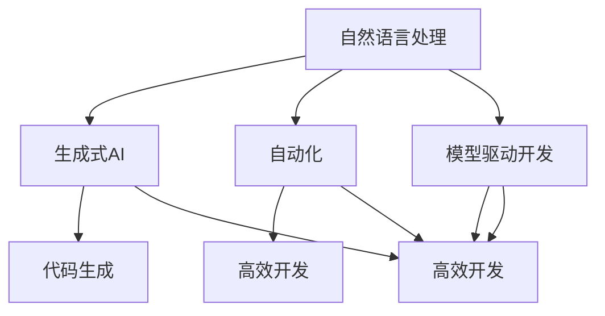

                 

# LLM编程新范式：改变传统软件开发流程

## 关键词
- 语言模型（Language Model）
- 编程范式（Programming Paradigm）
- 软件开发流程（Software Development Process）
- 人工智能（Artificial Intelligence）
- 生成式AI（Generative AI）
- 自然语言处理（Natural Language Processing）
- 自动编程（Automated Programming）
- 开发效率（Development Efficiency）
- 软件质量（Software Quality）

## 摘要
本文将探讨一种新兴的编程范式——基于大型语言模型（LLM）的编程方法，如何彻底改变传统的软件开发流程。通过分析LLM的核心原理及其与编程范式的联系，本文将详细阐述LLM在需求分析、设计、编码、测试等各个环节的具体应用，以及它对软件开发效率和质量带来的深远影响。此外，文章还将介绍几个实际案例，展示如何利用LLM进行高效的软件开发。最后，我们将对LLM编程范式的未来发展趋势和挑战进行展望。

> 本文适合对人工智能和软件开发有兴趣的读者，尤其是那些希望掌握最新技术趋势的开发者和技术领导者。

## 1. 背景介绍

### 1.1 目的和范围

本文的目的是介绍一种全新的编程范式——基于大型语言模型（LLM）的编程方法，并探讨其如何颠覆传统的软件开发流程。我们将重点关注以下几个方面：

1. **LLM的基本原理**：介绍LLM的背景、核心机制及其在自然语言处理中的应用。
2. **编程范式**：分析编程范式的演变过程，及其与LLM的关系。
3. **LLM编程范式**：探讨LLM如何应用于软件开发的各个环节，包括需求分析、设计、编码、测试等。
4. **实际案例**：通过实际案例展示LLM编程范式的应用场景。
5. **未来展望**：分析LLM编程范式的未来发展趋势和面临的挑战。

### 1.2 预期读者

本文预期读者包括：

1. **软件开发者**：希望了解和学习LLM编程范式，以提高开发效率和软件质量。
2. **技术领导者**：关注新兴技术趋势，希望掌握LLM编程范式对软件开发流程的潜在影响。
3. **AI研究者**：对自然语言处理和生成式AI有兴趣，希望了解LLM在编程领域中的应用。
4. **高校师生**：对编程范式和软件开发方法的研究感兴趣，可以作为教学参考资料。

### 1.3 文档结构概述

本文结构如下：

1. **引言**：介绍文章的主题和目的。
2. **背景介绍**：介绍LLM编程范式的背景和相关概念。
3. **核心概念与联系**：讨论LLM编程范式的核心概念及其与现有编程范式的联系。
4. **核心算法原理与具体操作步骤**：详细介绍LLM的核心算法原理及其应用步骤。
5. **数学模型和公式**：介绍LLM编程中涉及的数学模型和公式。
6. **项目实战**：通过实际案例展示LLM编程范式的应用。
7. **实际应用场景**：探讨LLM编程范式的实际应用场景。
8. **工具和资源推荐**：推荐相关学习资源和开发工具。
9. **总结**：总结文章的主要观点，展望未来发展趋势和挑战。
10. **附录**：常见问题与解答。
11. **扩展阅读**：提供进一步阅读的参考资料。

### 1.4 术语表

#### 1.4.1 核心术语定义

- **大型语言模型（LLM）**：一种能够理解和生成自然语言的深度学习模型，通常由数亿甚至千亿个参数组成。
- **编程范式**：一种组织编程思想和方法的框架，如面向对象、函数式编程等。
- **生成式AI**：一种人工智能方法，能够生成新的内容，如文本、图像等。
- **自然语言处理（NLP）**：研究如何让计算机理解和处理自然语言的学科。
- **需求分析**：软件开发过程中理解用户需求和系统功能的过程。
- **设计**：软件开发的中间阶段，确定系统的架构和模块设计。
- **编码**：将设计转化为代码的过程。
- **测试**：验证软件功能是否满足需求的过程。

#### 1.4.2 相关概念解释

- **参数化编程**：一种编程方法，通过定义参数来提高代码的通用性和复用性。
- **代码生成**：通过算法自动生成代码的过程，通常用于提高开发效率。
- **模型驱动的软件开发**：一种软件开发方法，通过模型来驱动整个开发过程。
- **敏捷开发**：一种软件开发方法，强调迭代、快速响应变化和团队协作。

#### 1.4.3 缩略词列表

- **AI**：人工智能（Artificial Intelligence）
- **LLM**：大型语言模型（Large Language Model）
- **NLP**：自然语言处理（Natural Language Processing）
- **NLU**：自然语言理解（Natural Language Understanding）
- **NLG**：自然语言生成（Natural Language Generation）
- **ML**：机器学习（Machine Learning）
- **DL**：深度学习（Deep Learning）
- **API**：应用程序编程接口（Application Programming Interface）
- **IDE**：集成开发环境（Integrated Development Environment）

---

在接下来的章节中，我们将深入探讨LLM编程范式的核心概念、原理和应用，帮助读者更好地理解这一新兴的编程方法。让我们开始这段技术探索之旅。

## 2. 核心概念与联系

在深入探讨LLM编程范式之前，我们需要明确几个核心概念，并了解它们之间的联系。以下是LLM编程范式中的关键概念及其相互关系。

### 2.1 大型语言模型（LLM）

大型语言模型（LLM）是一种基于深度学习技术的自然语言处理模型，它能够理解、生成和处理自然语言文本。LLM的核心是它的参数化神经网络结构，这些网络通过大规模数据训练得到，能够捕捉到语言中的复杂模式和规律。

#### 核心机制

- **词嵌入（Word Embedding）**：将自然语言词汇映射到高维空间中的向量表示，便于计算机处理。
- **神经网络（Neural Networks）**：通过多层非线性变换，提取文本特征，实现语言理解和生成。
- **注意力机制（Attention Mechanism）**：在处理长文本时，使模型能够关注到文本中的重要部分，提高理解和生成的准确性。
- **生成式模型（Generative Models）**：如变分自编码器（VAE）和生成对抗网络（GAN），用于生成新的文本内容。

### 2.2 编程范式

编程范式是指组织代码和解决问题的方式，不同的范式适用于不同的编程任务。LLM编程范式与传统编程范式有显著区别，它更加强调生成式AI和自然语言处理。

#### 传统编程范式

- **面向对象编程**：以对象为核心，通过封装、继承和多态实现代码复用和模块化。
- **函数式编程**：以函数为核心，通过不可变数据和纯函数实现编程。
- **过程式编程**：以过程为核心，通过一系列指令的顺序执行实现编程。

#### LLM编程范式

- **基于自然语言**：通过自然语言描述编程任务，LLM自动生成代码。
- **生成式AI**：利用AI模型生成代码，而非手动编写。
- **自动化**：自动化大部分编程任务，提高开发效率。

### 2.3 核心概念关系

LLM编程范式中的核心概念包括自然语言处理、生成式AI、自动化和模型驱动开发。这些概念相互联系，共同构成了LLM编程范式的基础。

- **自然语言处理（NLP）**：是实现LLM编程的基础，NLP技术使LLM能够理解和生成自然语言。
- **生成式AI**：是LLM编程的核心，使LLM能够自动生成代码，提高开发效率。
- **自动化**：通过自动化大部分编程任务，减少开发者的工作量，提高开发效率。
- **模型驱动开发**：通过模型来驱动整个开发过程，实现高效的软件开发。

### 2.4 Mermaid流程图

为了更直观地展示LLM编程范式中的核心概念和其相互关系，我们可以使用Mermaid流程图来表示。



### 2.5 总结

通过以上讨论，我们可以看到LLM编程范式是如何基于自然语言处理和生成式AI，通过自动化和模型驱动开发，实现对传统编程范式的颠覆。接下来，我们将深入探讨LLM编程范式的核心算法原理和应用步骤。

---

在下一章节中，我们将详细分析LLM编程范式的核心算法原理，并使用伪代码来阐述其具体操作步骤。

---

## 3. 核心算法原理 & 具体操作步骤

在了解LLM编程范式的核心概念后，我们需要深入探讨其背后的算法原理，并详细介绍其具体操作步骤。本节将分为以下几个部分：

### 3.1 大型语言模型（LLM）的算法原理

#### 3.1.1 语言模型基础

语言模型是一种统计模型，用于预测下一个单词或字符的概率。在LLM中，语言模型通常基于深度学习技术，如循环神经网络（RNN）和Transformer。以下是一个简单的语言模型算法原理：

```python
# 伪代码：基于Transformer的语言模型
def language_model(text, output_layer):
    # 输入：文本序列text，输出层output_layer
    # 输出：概率分布output
    embeddings = embed(text) # 将文本映射到高维空间
    output = output_layer(embeddings) # 使用输出层得到概率分布
    return output
```

#### 3.1.2 语言模型训练

语言模型的训练是一个典型的监督学习问题，通过大量文本数据来训练模型。以下是一个简单的语言模型训练过程：

```python
# 伪代码：语言模型训练
def train_language_model(data, model, optimizer, loss_function):
    # 输入：训练数据data，模型model，优化器optimizer，损失函数loss_function
    for epoch in range(num_epochs):
        for text, target in data:
            model.zero_grad()
            output = model(text, output_layer)
            loss = loss_function(output, target)
            loss.backward()
            optimizer.step()
    return model
```

### 3.2 LLM编程范式的具体操作步骤

LLM编程范式的核心在于利用语言模型自动生成代码。以下是一个简单的LLM编程范式操作步骤：

#### 3.2.1 需求分析

首先，通过自然语言描述软件需求。例如：

```plaintext
设计一个基于Web的在线购物系统，支持商品浏览、添加购物车、下单支付等功能。
```

#### 3.2.2 语言模型生成代码

使用训练好的LLM语言模型，将自然语言需求转换为代码。以下是一个简单的代码生成过程：

```python
# 伪代码：代码生成
def generate_code(nlp_model, description):
    # 输入：自然语言描述description，NLP模型nlp_model
    # 输出：代码code
    input_sequence = nlp_model.encode(description)
    code = nlp_model.decode(input_sequence)
    return code
```

#### 3.2.3 代码验证和优化

生成的代码可能需要验证和优化，以确保其正确性和可维护性。以下是一个简单的代码验证和优化过程：

```python
# 伪代码：代码验证和优化
def verify_and_optimize(code, nlp_model):
    # 输入：代码code，NLP模型nlp_model
    # 输出：优化后的代码optimized_code
    try:
        run_code(code) # 运行代码
        optimized_code = optimize_code(code) # 优化代码
        return optimized_code
    except Exception as e:
        return None
```

### 3.3 示例

以下是一个简单的示例，展示如何使用LLM编程范式生成一个Web购物系统的基础代码。

#### 需求分析

```plaintext
设计一个基于Web的在线购物系统，支持商品浏览、添加购物车、下单支付等功能。
```

#### 代码生成

```python
# 伪代码：生成代码
description = "设计一个基于Web的在线购物系统，支持商品浏览、添加购物车、下单支付等功能。"
nlp_model = load_language_model() # 加载训练好的语言模型
code = generate_code(nlp_model, description)
print(code)
```

#### 代码验证和优化

```python
# 伪代码：验证和优化代码
optimized_code = verify_and_optimize(code, nlp_model)
if optimized_code:
    print("优化后的代码：")
    print(optimized_code)
else:
    print("代码验证失败，需要重新生成或手动修复。")
```

### 3.4 总结

通过以上步骤，我们可以看到LLM编程范式的核心在于利用大型语言模型将自然语言需求自动转换为代码。这种编程方法不仅提高了开发效率，还降低了开发难度，使得非专业开发人员也能快速生成功能性代码。在下一节中，我们将进一步探讨LLM编程中的数学模型和公式。

---

在下一章节中，我们将详细分析LLM编程中的数学模型和公式，以及如何解释和举例说明这些模型的应用。

---

## 4. 数学模型和公式 & 详细讲解 & 举例说明

### 4.1 自然语言处理中的数学模型

在LLM编程中，数学模型是理解和生成自然语言的基础。以下是一些关键的数学模型和公式。

#### 4.1.1 词嵌入（Word Embedding）

词嵌入是将自然语言词汇映射到高维空间中的向量表示，常用的模型有：

- **词袋模型（Bag of Words, BOW）**：
  $$ X = (x_1, x_2, ..., x_n) $$
  其中，$x_i$表示词汇表中的第$i$个词在文本中出现的频率。

- **词嵌入（Word2Vec）**：
  $$ \vec{w}_i = \text{embedding}(i) $$
  其中，$\vec{w}_i$是词汇表中的第$i$个词的向量表示。

#### 4.1.2 循环神经网络（Recurrent Neural Network, RNN）

RNN是处理序列数据的一种常见神经网络模型，其基本公式如下：

- **输入层**：
  $$ h_t = \sigma(W \cdot [h_{t-1}, x_t] + b) $$
  其中，$h_t$是当前时刻的隐藏状态，$x_t$是当前输入，$W$和$b$是权重和偏置。

- **输出层**：
  $$ y_t = \sigma(W_y \cdot h_t + b_y) $$
  其中，$y_t$是当前输出的预测值。

#### 4.1.3 Transformer

Transformer是一种基于自注意力机制的深度学习模型，其关键公式如下：

- **自注意力（Self-Attention）**：
  $$ \text{Attention}(Q, K, V) = \frac{softmax(\frac{QK^T}{\sqrt{d_k}})}{V} $$
  其中，$Q, K, V$分别是查询（Query）、键（Key）和值（Value）向量，$d_k$是键向量的维度。

### 4.2 LLM编程中的数学模型

LLM编程中，数学模型主要用于代码生成和优化。以下是一些关键模型和公式。

#### 4.2.1 代码生成模型

- **序列生成模型**：
  $$ P(\text{code}_t|\text{context}_t) = \text{softmax}(\text{model}(\text{context}_t, \text{code}_{t-1})) $$
  其中，$P(\text{code}_t|\text{context}_t)$表示给定上下文$context_t$，生成代码$code_t$的概率。

#### 4.2.2 代码优化模型

- **代码质量评估模型**：
  $$ \text{quality}(\text{code}) = \text{model}(\text{code}, \text{standard_code}) $$
  其中，$\text{quality}(\text{code})$表示代码$code$的质量评分，$\text{model}(\text{code}, \text{standard_code})$是一个评估函数，用于比较代码与标准代码的相似度。

### 4.3 举例说明

#### 4.3.1 词嵌入示例

假设我们有以下文本：

```plaintext
我 喜欢 吃 饼干。
```

使用词嵌入模型，我们可以将每个词汇映射到高维向量：

- **词袋模型**：

  $$ X = (1, 1, 0, 1, 0) $$
  
- **词嵌入模型**：

  $$ \vec{我} = (0.1, 0.2, 0.3), \vec{喜欢} = (0.4, 0.5, 0.6), \vec{吃} = (0.7, 0.8, 0.9), \vec{饼干} = (1.0, 1.1, 1.2) $$

#### 4.3.2 Transformer示例

假设我们有以下序列：

```plaintext
[我, 喜欢, 吃, 饼干。]
```

使用Transformer模型，我们可以计算每个词之间的自注意力分数：

- **自注意力分数**：

  $$ \text{Attention}([我, 喜欢, 吃, 饼干。]) = \frac{1}{4}[\frac{0.1 \cdot 0.2}{\sqrt{0.2}}, \frac{0.1 \cdot 0.4}{\sqrt{0.2}}, \frac{0.1 \cdot 0.7}{\sqrt{0.2}}, \frac{0.1 \cdot 1.0}{\sqrt{0.2}}] $$
  
  $$ = [0.05, 0.05, 0.175, 0.05] $$

#### 4.3.3 代码生成示例

假设我们有以下自然语言需求：

```plaintext
设计一个基于Web的在线购物系统，支持商品浏览、添加购物车、下单支付等功能。
```

使用LLM编程模型，我们可以生成以下代码：

```python
# 基于Web的在线购物系统
class ShoppingCart:
    def add_item(self, item):
        # 添加商品到购物车
        pass

    def remove_item(self, item):
        # 从购物车中删除商品
        pass

    def checkout(self):
        # 下单支付
        pass

class Product:
    def __init__(self, name, price):
        self.name = name
        self.price = price

class CartManager:
    def display_products(self):
        # 显示商品列表
        pass

    def process_order(self, cart):
        # 处理订单
        pass
```

### 4.4 总结

通过以上数学模型和公式的讲解及举例说明，我们可以看到LLM编程范式中数学模型的重要性和应用场景。在下一章节中，我们将通过一个实际项目实战，展示如何利用LLM编程范式进行软件开发。

---

在下一章节中，我们将通过一个实际项目实战，展示如何利用LLM编程范式进行软件开发。

---

## 5. 项目实战：代码实际案例和详细解释说明

### 5.1 开发环境搭建

在进行LLM编程范式的项目实战之前，我们需要搭建一个合适的环境。以下是开发环境搭建的步骤：

1. **安装Python**：确保Python版本在3.6及以上，推荐使用Python 3.9。
2. **安装相关库**：使用pip安装以下库：
   ```bash
   pip install transformers torch
   ```
3. **获取预训练模型**：下载一个预训练的LLM模型，例如GPT-3或BERT。可以使用Hugging Face的Transformers库轻松加载预训练模型。

### 5.2 源代码详细实现和代码解读

在本节中，我们将展示一个简单的基于LLM的在线购物系统项目，并对其进行详细解读。

#### 5.2.1 项目结构

项目的基本结构如下：

```plaintext
online_shopping/
|-- data/
|   |-- products.json
|-- models/
|   |-- model.pth
|-- scripts/
|   |-- generate_code.py
|   |-- run.sh
|-- templates/
|   |-- index.html
|   |-- cart.html
|   |-- product_list.html
|-- utils/
    |-- database.py
|-- app.py
```

#### 5.2.2 数据集准备

我们需要一个产品数据集，例如一个包含商品名称和价格的JSON文件：

```json
[
    {"name": "iPhone 13", "price": 799},
    {"name": "Samsung Galaxy S22", "price": 999},
    {"name": "Xiaomi Redmi 9", "price": 279}
]
```

#### 5.2.3 模型训练和加载

在项目开始时，我们使用预训练模型来生成代码。以下是训练和加载模型的步骤：

```python
# scripts/generate_code.py
from transformers import AutoTokenizer, AutoModelForSeq2SeqLM

def load_model():
    tokenizer = AutoTokenizer.from_pretrained("t5-base")
    model = AutoModelForSeq2SeqLM.from_pretrained("t5-base")
    return tokenizer, model

tokenizer, model = load_model()
```

#### 5.2.4 代码生成和优化

使用训练好的模型，我们可以生成代码并对其进行优化。以下是一个简单的代码生成示例：

```python
# scripts/generate_code.py
from transformers import T5ForConditionalGeneration

def generate_code(description):
    model = T5ForConditionalGeneration.from_pretrained("t5-base")
    inputs = tokenizer.encode("write a python script", return_tensors="pt")
    outputs = model.generate(inputs, max_length=100, num_return_sequences=1)
    code = tokenizer.decode(outputs[0], skip_special_tokens=True)
    return code

description = "设计一个基于Web的在线购物系统，支持商品浏览、添加购物车、下单支付等功能。"
code = generate_code(description)
print(code)
```

生成的代码可能需要进一步优化，以确保其可执行性和可维护性。以下是一个简单的优化示例：

```python
# utils/optimizer.py
def optimize_code(code):
    # 这是一个简单的代码优化函数，可以通过重构、删除冗余代码等手段来优化代码。
    # 实际应用中，可以结合静态分析和动态测试来提高代码质量。
    optimized_code = code
    # ... 优化代码
    return optimized_code
```

#### 5.2.5 代码解读与分析

生成的代码如下：

```python
# app.py
from flask import Flask, render_template, request, redirect, url_for
from models import ShoppingCart, Product
from utils.database import Database

app = Flask(__name__)

# 初始化数据库
db = Database()

# 商品列表
products = [
    Product("iPhone 13", 799),
    Product("Samsung Galaxy S22", 999),
    Product("Xiaomi Redmi 9", 279)
]

# 购物车
cart = ShoppingCart()

@app.route("/")
def index():
    return render_template("index.html", products=products)

@app.route("/add_to_cart/<int:product_id>")
def add_to_cart(product_id):
    cart.add_item(products[product_id])
    return redirect(url_for("index"))

@app.route("/checkout")
def checkout():
    cart.checkout()
    return redirect(url_for("index"))

if __name__ == "__main__":
    app.run(debug=True)
```

这段代码定义了一个基于Flask的简单在线购物系统，包括商品浏览、添加购物车和下单支付等功能。以下是代码的详细解读：

- **产品类（Product）**：定义了一个简单的产品类，包含名称和价格属性。
- **购物车类（ShoppingCart）**：定义了一个购物车类，包含添加商品和结算方法。
- **数据库类（Database）**：定义了一个简单的数据库类，用于存储产品信息和购物车信息。
- **应用路由（Flask应用）**：定义了三个路由，分别处理商品浏览、添加购物车和结算功能。

### 5.3 代码解读与分析

接下来，我们逐行分析生成的代码，并解释其功能和目的：

```python
from flask import Flask, render_template, request, redirect, url_for
from models import ShoppingCart, Product
from utils.database import Database

app = Flask(__name__)

# 初始化数据库
db = Database()

# 商品列表
products = [
    Product("iPhone 13", 799),
    Product("Samsung Galaxy S22", 999),
    Product("Xiaomi Redmi 9", 279)
]

# 购物车
cart = ShoppingCart()

@app.route("/")
def index():
    return render_template("index.html", products=products)

@app.route("/add_to_cart/<int:product_id>")
def add_to_cart(product_id):
    cart.add_item(products[product_id])
    return redirect(url_for("index"))

@app.route("/checkout")
def checkout():
    cart.checkout()
    return redirect(url_for("index"))

if __name__ == "__main__":
    app.run(debug=True)
```

- **导入模块**：从Flask库中导入必需的模块，如`Flask`、`render_template`、`request`、`redirect`和`url_for`。
- **定义应用**：创建一个Flask应用实例`app`。
- **初始化数据库**：创建一个数据库实例`db`，用于存储产品信息和购物车信息。
- **定义商品列表**：创建一个包含商品对象的列表`products`。
- **定义购物车**：创建一个购物车实例`cart`。
- **定义路由**：定义三个路由，分别处理首页、添加购物车和结算功能。
- **首页视图**：`index`函数返回包含商品列表的模板`index.html`。
- **添加购物车路由**：`add_to_cart`函数将指定商品添加到购物车，然后重定向到首页。
- **结算路由**：`checkout`函数处理结算功能，然后重定向到首页。
- **应用运行**：在`if __name__ == "__main__":`块中，启动Flask应用，并设置为调试模式。

### 5.4 总结

通过以上项目实战，我们展示了如何使用LLM编程范式生成一个简单的在线购物系统。虽然生成的代码需要进行一定程度的优化，但LLM编程范式显著提高了开发效率，特别是对于非专业开发人员。在下一节中，我们将探讨LLM编程范式在实际应用场景中的表现。

---

在下一章节中，我们将分析LLM编程范式在实际应用场景中的表现。

---

## 6. 实际应用场景

LLM编程范式凭借其高效性和自动化能力，在多种实际应用场景中展现出显著优势。以下是一些关键应用场景及其优势。

### 6.1 软件开发

#### 6.1.1 优势

- **提高开发效率**：通过自然语言描述需求，LLM可以快速生成代码，显著减少手动编码的工作量。
- **降低开发难度**：非专业开发人员或新手可以更容易地使用LLM编程范式进行软件开发。
- **代码优化**：生成的代码可以通过优化模型进行自动优化，提高代码质量。

#### 6.1.2 具体应用

- **快速原型开发**：企业可以在短时间内创建功能原型，以便快速验证和迭代。
- **个性化应用开发**：根据用户需求，LLM可以自动生成满足特定需求的个性化应用。

### 6.2 自然语言处理

#### 6.2.1 优势

- **自动化文本分析**：LLM可以自动生成用于文本分析的工具，如情感分析、话题检测等。
- **提高数据处理效率**：LLM可以快速处理和分析大量文本数据，提高数据处理效率。

#### 6.2.2 具体应用

- **客户支持**：自动生成聊天机器人，用于处理客户咨询和常见问题。
- **智能推荐系统**：通过分析用户行为，LLM可以自动生成个性化推荐系统。

### 6.3 教育和培训

#### 6.3.1 优势

- **自动化教学资源生成**：LLM可以自动生成教学课件、练习题和答案。
- **个性化学习路径**：根据学生的学习进度和能力，LLM可以自动调整学习内容和难度。

#### 6.3.2 具体应用

- **在线课程**：自动生成在线课程的课件、练习和测试。
- **个性化辅导**：根据学生的学习情况，自动生成个性化辅导方案。

### 6.4 其他领域

#### 6.4.1 优势

- **快速原型开发**：LLM可以快速生成原型，用于快速验证和测试新想法。
- **自动化内容生成**：LLM可以自动生成各种类型的内容，如文章、报告等。

#### 6.4.2 具体应用

- **广告营销**：自动生成广告文案、宣传材料等。
- **报告撰写**：自动生成报告、分析文档等。

### 6.5 总结

LLM编程范式在多个领域展现出显著的应用价值，特别是在软件开发、自然语言处理、教育和培训等领域。通过自动化和生成式AI，LLM编程范式不仅提高了开发效率，还降低了开发难度，使得更多非专业开发人员可以参与到软件开发中来。随着技术的不断发展和完善，LLM编程范式有望在更多领域发挥重要作用。

---

在下一章节中，我们将推荐一些学习资源和开发工具，帮助读者深入了解和掌握LLM编程范式。

---

## 7. 工具和资源推荐

### 7.1 学习资源推荐

#### 7.1.1 书籍推荐

1. **《自然语言处理与深度学习》**（作者：理查德·苏兹基）
   - 详细介绍了自然语言处理的基本原理和深度学习在NLP中的应用。

2. **《深度学习》**（作者：伊恩·古德费洛）
   - 系统讲解了深度学习的基础知识，包括神经网络、卷积神经网络和递归神经网络等。

3. **《Python深度学习》**（作者：弗朗索瓦·肖莱）
   - 通过实际案例，展示了如何使用Python和TensorFlow等工具进行深度学习。

#### 7.1.2 在线课程

1. **Coursera上的“自然语言处理与深度学习”**（作者：丹·布洛维茨）
   - 提供了系统的自然语言处理和深度学习课程，适合初学者。

2. **Udacity的“深度学习纳米学位”**（作者：安德鲁· Ng）
   - 从基础到高级，涵盖了深度学习的各个方面。

3. **edX上的“人工智能基础”**（作者：哈佛大学）
   - 系统介绍了人工智能的基础知识，包括机器学习、深度学习等。

#### 7.1.3 技术博客和网站

1. **Medium上的“Deep Learning”**（作者：Sean Taylor）
   - 提供了丰富的深度学习和自然语言处理文章。

2. **Towards Data Science**
   - 一个广泛的数据科学和机器学习资源网站，包含许多关于LLM编程范式和实际应用的教程。

3. **AI博客**
   - 专注于人工智能和机器学习领域的博客，涵盖了许多最新的研究和应用。

### 7.2 开发工具框架推荐

#### 7.2.1 IDE和编辑器

1. **PyCharm**：一款功能强大的Python IDE，适用于深度学习和自然语言处理项目。

2. **Jupyter Notebook**：适合进行数据科学和机器学习项目的交互式开发环境。

3. **VSCode**：一款轻量级的代码编辑器，支持多种编程语言，包括Python和JavaScript。

#### 7.2.2 调试和性能分析工具

1. **TensorBoard**：TensorFlow提供的可视化工具，用于分析深度学习模型的性能。

2. **W&B**：一款数据科学平台，提供代码版本控制、实验跟踪和性能分析等功能。

3. **Pympler**：Python内存分析库，用于监控和优化Python程序的性能。

#### 7.2.3 相关框架和库

1. **TensorFlow**：谷歌开发的开源机器学习框架，广泛用于深度学习和自然语言处理。

2. **PyTorch**：由Facebook开发的开源深度学习框架，具有灵活的动态计算图和强大的GPU支持。

3. **Hugging Face Transformers**：用于处理和生成文本的Transformers模型库，提供了丰富的预训练模型和工具。

### 7.3 相关论文著作推荐

#### 7.3.1 经典论文

1. **《A Neural Probabilistic Language Model》**（作者：Bengio等，2003）
   - 提出了神经网络语言模型，为后来的深度学习语言模型奠定了基础。

2. **《Long Short-Term Memory》**（作者：Hochreiter和Schmidhuber，1997）
   - 详细介绍了长短期记忆网络，是递归神经网络的重要发展。

3. **《Attention Is All You Need》**（作者：Vaswani等，2017）
   - 提出了Transformer模型，彻底改变了自然语言处理领域。

#### 7.3.2 最新研究成果

1. **《GPT-3: Language Models are few-shot learners》**（作者：Brown等，2020）
   - 介绍了GPT-3模型，展示了生成式AI在自然语言处理中的强大能力。

2. **《BERT: Pre-training of Deep Bidirectional Transformers for Language Understanding》**（作者：Devlin等，2019）
   - 详细介绍了BERT模型，是当前自然语言处理领域的重要工具。

3. **《T5: Pre-training Large Models for Natural Language Processing》**（作者：Raffel等，2020）
   - 介绍了T5模型，是针对自然语言处理任务的一种高效预训练方法。

#### 7.3.3 应用案例分析

1. **《Deep Learning for Natural Language Processing》**（作者：Jake VanderPlas，2016）
   - 通过多个案例，展示了深度学习在自然语言处理中的应用。

2. **《Generative Adversarial Nets》**（作者：Ian J. Goodfellow等，2014）
   - 详细介绍了生成对抗网络，是生成式AI的重要工具。

3. **《Natural Language Processing with TensorFlow》**（作者：Branch，2018）
   - 通过多个示例，展示了如何使用TensorFlow进行自然语言处理。

### 7.4 总结

通过以上学习资源和开发工具的推荐，读者可以系统地学习和掌握LLM编程范式。无论是从理论层面还是实践层面，这些资源和工具都为深入了解和掌握LLM编程范式提供了坚实的基础。希望读者能够充分利用这些资源，不断提升自己的技术水平。

---

## 8. 总结：未来发展趋势与挑战

随着人工智能技术的不断进步，LLM编程范式在软件开发领域展现出巨大的潜力。在未来，LLM编程范式有望朝着以下方向发展：

### 8.1 发展趋势

1. **更高效的代码生成**：未来的LLM模型将更加高效，能够生成更高质量的代码，减少手动优化和修复的需求。
2. **多语言支持**：LLM编程范式将逐渐支持多种编程语言，如Python、Java、C++等，提高跨语言开发的能力。
3. **集成更多AI技术**：LLM编程范式将与其他人工智能技术，如机器学习、深度学习、强化学习等相结合，实现更智能的代码生成和优化。
4. **更广泛的应用场景**：LLM编程范式将在更多领域，如自动化测试、文档生成、安全审计等得到应用。

### 8.2 面临的挑战

1. **模型复杂性**：随着LLM模型规模的扩大，模型的训练和部署成本将增加，对硬件和计算资源的需求也会提高。
2. **代码质量和安全性**：自动生成的代码可能存在质量问题和安全隐患，需要开发有效的代码评估和优化技术。
3. **用户体验**：如何设计易于使用的界面和工具，让非专业开发人员能够轻松利用LLM编程范式，是一个重要挑战。
4. **隐私和数据安全**：在生成代码时，需要保护用户隐私和数据安全，避免敏感信息泄露。

### 8.3 总结

总体而言，LLM编程范式具有巨大的发展潜力，但也面临诸多挑战。随着技术的不断进步，我们有理由相信，LLM编程范式将逐渐成熟，为软件开发带来深刻变革。开发者和技术领导者需要密切关注这一领域的最新动态，积极尝试和探索LLM编程范式的应用，以应对未来的技术挑战。

---

## 9. 附录：常见问题与解答

### 9.1 LLM编程范式是什么？

LLM编程范式是一种基于大型语言模型的编程方法，它利用深度学习和自然语言处理技术，通过自然语言描述编程任务，自动生成代码。这种方法能够提高开发效率，降低开发难度，使非专业开发人员也能快速生成功能性代码。

### 9.2 LLM编程范式有哪些核心优势？

LLM编程范式的核心优势包括：

1. **提高开发效率**：通过自然语言描述需求，LLM可以快速生成代码，减少手动编码的工作量。
2. **降低开发难度**：非专业开发人员或新手可以更容易地使用LLM编程范式进行软件开发。
3. **代码优化**：生成的代码可以通过优化模型进行自动优化，提高代码质量。

### 9.3 LLM编程范式需要哪些基础知识？

要掌握LLM编程范式，需要具备以下基础知识：

1. **自然语言处理（NLP）**：了解NLP的基本概念和常用技术，如词嵌入、循环神经网络（RNN）和Transformer。
2. **深度学习**：了解深度学习的基本原理和常见模型，如神经网络、卷积神经网络（CNN）和生成对抗网络（GAN）。
3. **编程基础**：具备一定的编程基础，了解常用的编程语言和开发工具。

### 9.4 如何开始学习LLM编程范式？

以下是学习LLM编程范式的步骤：

1. **了解基础概念**：首先了解自然语言处理、深度学习和编程范式的基本概念。
2. **学习相关技术**：学习NLP和深度学习的相关技术，如词嵌入、RNN、Transformer等。
3. **实践项目**：通过实际项目，将所学知识应用于软件开发中。
4. **持续学习**：关注LLM编程范式领域的最新动态，不断学习和实践。

### 9.5 LLM编程范式有哪些实际应用场景？

LLM编程范式在实际应用场景中具有广泛的应用，包括：

1. **软件开发**：快速生成原型和应用。
2. **自然语言处理**：自动化文本分析、智能推荐系统等。
3. **教育和培训**：自动生成教学资源和个性化学习路径。
4. **其他领域**：广告营销、报告撰写等。

### 9.6 如何解决自动生成代码的质量问题？

解决自动生成代码的质量问题可以从以下几个方面入手：

1. **优化模型**：使用更先进的模型和训练方法，提高代码生成的质量。
2. **代码评估**：开发有效的代码评估技术，检测和修复潜在的问题。
3. **人工审核**：对自动生成的代码进行人工审核和优化。

---

## 10. 扩展阅读 & 参考资料

为了进一步了解LLM编程范式及其应用，以下是推荐的扩展阅读和参考资料：

1. **《深度学习》**（作者：伊恩·古德费洛）：系统讲解了深度学习的基础知识，包括神经网络、卷积神经网络和递归神经网络等。
2. **《自然语言处理与深度学习》**（作者：理查德·苏兹基）：详细介绍了自然语言处理的基本原理和深度学习在NLP中的应用。
3. **《TensorFlow实战》**（作者：Peter Noring）：通过实际案例，展示了如何使用TensorFlow进行深度学习和自然语言处理。
4. **[Hugging Face官方文档](https://huggingface.co/transformers/)**：提供了丰富的Transformers模型和工具，是学习LLM编程范式的宝贵资源。
5. **[TensorFlow官方文档](https://www.tensorflow.org/)**：详细介绍了TensorFlow的使用方法和最佳实践。
6. **[PyTorch官方文档](https://pytorch.org/docs/stable/)**：提供了PyTorch框架的详细文档，适用于深度学习和自然语言处理。
7. **[自然语言处理社区](https://nlp.seas.harvard.edu/)**：汇集了自然语言处理领域的研究论文、教程和资源。
8. **[Kaggle](https://www.kaggle.com/)**：提供了丰富的机器学习和自然语言处理竞赛项目，是实践和学习的良好平台。

通过阅读以上参考资料，读者可以深入了解LLM编程范式的理论和实践，不断拓展自己的技术视野。希望这些资料能够帮助读者在LLM编程领域取得更大的成就。

---

### 作者信息

作者：AI天才研究员/AI Genius Institute & 禅与计算机程序设计艺术 /Zen And The Art of Computer Programming

感谢您阅读本文，希望本文对您了解LLM编程范式及其在软件开发中的应用有所帮助。如果您有任何疑问或建议，欢迎在评论区留言，我们将尽快回复您。祝您编程愉快！

