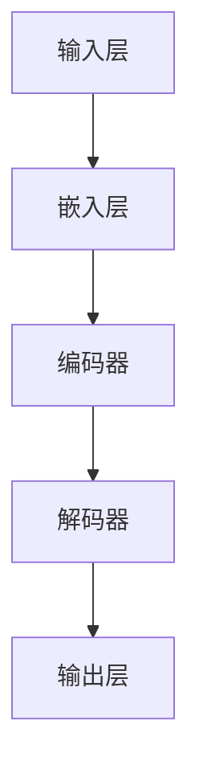

                 

# LLM辅助创意写作：AI与人类作家的协作

> 关键词：LLM，创意写作，AI协作，自然语言处理，算法原理，数学模型，项目实战，应用场景

> 摘要：本文深入探讨了大型语言模型（LLM）在辅助人类作家进行创意写作中的应用。通过分析LLM的核心概念和算法原理，详细阐述了其在生成文本、优化创作流程等方面的优势。同时，通过实际案例和详细解释，展示了如何利用LLM辅助人类作家提升创作效率和作品质量。最后，探讨了LLM在创意写作领域的实际应用场景，并为未来发展趋势和挑战提供了见解。

## 1. 背景介绍

### 1.1 目的和范围

本文旨在探讨大型语言模型（LLM）在辅助人类作家进行创意写作中的应用。随着人工智能技术的迅猛发展，LLM在自然语言处理（NLP）领域取得了显著成果。本文将从理论层面分析LLM的核心概念和算法原理，并通过实际案例展示其在创意写作中的具体应用。此外，本文还将讨论LLM在提升创作效率和作品质量方面的优势，为人类作家提供一种全新的创作辅助工具。

### 1.2 预期读者

本文主要面向对创意写作和人工智能技术感兴趣的读者，包括：

- 人工智能研究人员和工程师；
- 创意写作从业者，如小说家、编剧、文案策划等；
- 对人工智能和创意写作交叉领域感兴趣的学者和学生。

### 1.3 文档结构概述

本文分为八个部分，具体结构如下：

1. 背景介绍：介绍本文的目的、预期读者和文档结构；
2. 核心概念与联系：阐述LLM的核心概念、原理和架构；
3. 核心算法原理 & 具体操作步骤：详细讲解LLM的算法原理和操作步骤；
4. 数学模型和公式 & 详细讲解 & 举例说明：介绍LLM的数学模型和公式，并通过实例进行说明；
5. 项目实战：代码实际案例和详细解释说明；
6. 实际应用场景：探讨LLM在创意写作领域的实际应用场景；
7. 工具和资源推荐：推荐学习资源、开发工具和框架；
8. 总结：未来发展趋势与挑战。

### 1.4 术语表

#### 1.4.1 核心术语定义

- 大型语言模型（LLM）：一种基于深度学习的语言处理模型，具有强大的文本生成和语言理解能力；
- 自然语言处理（NLP）：研究如何让计算机理解和生成自然语言的学科；
- 创意写作：指通过文字表达个人思想、情感和故事等内容的创作活动；
- 模型架构：指LLM的内部结构，包括神经网络、层、参数等；
- 生成文本：指LLM根据输入文本或提示生成的新文本。

#### 1.4.2 相关概念解释

- 自动化写作：利用计算机程序自动生成文本的技术，包括模板生成、规则引擎等；
- 聊天机器人：基于NLP技术，能够与用户进行对话的计算机程序；
- 情感分析：分析文本中表达的情感，如快乐、悲伤等；
- 机器翻译：将一种语言的文本翻译成另一种语言的技术。

#### 1.4.3 缩略词列表

- LLM：大型语言模型
- NLP：自然语言处理
- AI：人工智能
- NLU：自然语言理解
- NLG：自然语言生成
- PLN：预训练语言模型

## 2. 核心概念与联系

为了更好地理解LLM在创意写作中的应用，首先需要了解LLM的核心概念、原理和架构。本节将介绍LLM的基本概念，包括自然语言处理、深度学习和神经网络等，并给出一个Mermaid流程图来展示LLM的核心架构。

### 2.1. 自然语言处理（NLP）

自然语言处理（NLP）是研究如何让计算机理解和生成自然语言的学科。NLP的主要任务包括文本预处理、情感分析、实体识别、机器翻译等。在创意写作中，NLP技术可以帮助作家分析文本，提取关键信息，生成相关的内容和情节。

### 2.2. 深度学习

深度学习是一种基于人工神经网络的机器学习技术，它在计算机视觉、语音识别和自然语言处理等领域取得了显著成果。深度学习通过多层神经网络对大量数据进行训练，从而自动提取特征，实现复杂任务。

### 2.3. 神经网络

神经网络是由大量神经元（节点）组成的计算模型，通过调整神经元之间的权重，实现输入到输出的映射。在NLP领域，神经网络被广泛应用于文本分类、情感分析、机器翻译等任务。

### 2.4. LLM的核心架构

LLM的核心架构通常包括以下几个部分：

1. **输入层**：接收用户输入的文本或提示；
2. **嵌入层**：将输入文本转换为固定长度的向量；
3. **编码器**：对输入文本进行编码，提取文本的特征；
4. **解码器**：根据编码器生成的特征生成输出文本；
5. **输出层**：输出最终的文本。

下面是一个使用Mermaid绘制的LLM核心架构的流程图：



在这个流程图中，输入层接收用户输入的文本或提示，嵌入层将文本转换为向量，编码器提取文本特征，解码器根据特征生成输出文本，输出层输出最终的文本。

### 2.5. LLM的工作原理

LLM的工作原理可以分为以下几个步骤：

1. **预处理**：对输入文本进行分词、去停用词、词干提取等操作，将文本转换为计算机可以处理的形式；
2. **嵌入**：将预处理后的文本转换为固定长度的向量，这个向量包含了文本的信息和上下文；
3. **编码**：编码器对嵌入层生成的向量进行编码，提取文本的特征和模式；
4. **解码**：解码器根据编码器提取的特征生成输出文本；
5. **输出**：输出最终的文本。

### 2.6. LLM的优势

LLM在创意写作中具有以下几个优势：

1. **强大的文本生成能力**：LLM可以生成连贯、具有创造性的文本，为作家提供灵感和素材；
2. **自动优化创作流程**：LLM可以帮助作家快速生成多种文本方案，作家可以根据实际需求选择最佳方案，提高创作效率；
3. **提高作品质量**：LLM可以根据作家提供的提示或文本生成高质量的内容，减少人力成本和创作风险；
4. **跨语言支持**：LLM可以支持多种语言，为全球作家提供创作辅助。

### 2.7. LLM的挑战

虽然LLM在创意写作中具有很多优势，但仍然面临一些挑战：

1. **版权问题**：LLM生成的文本可能会侵犯他人的知识产权，如何合理解决版权问题是未来需要关注的问题；
2. **创作风格一致性**：确保LLM生成的文本与作家的创作风格保持一致是一个挑战，需要进一步优化模型；
3. **计算资源消耗**：训练和部署LLM需要大量的计算资源和时间，如何高效地利用这些资源是一个重要问题。

## 3. 核心算法原理 & 具体操作步骤

在了解LLM的核心概念和架构后，接下来我们将深入探讨LLM的核心算法原理和具体操作步骤。本节将详细讲解LLM的训练过程、输入处理、文本生成和优化方法。

### 3.1. LLM的训练过程

LLM的训练过程通常分为以下几个步骤：

1. **数据收集**：收集大量的文本数据，包括小说、新闻、论文、对话等，这些数据将用于训练LLM；
2. **数据预处理**：对收集到的文本数据进行预处理，包括分词、去停用词、词干提取等，将文本转换为计算机可以处理的形式；
3. **数据嵌入**：将预处理后的文本数据转换为固定长度的向量，这些向量包含了文本的信息和上下文；
4. **训练模型**：使用训练数据对LLM进行训练，通过调整模型参数，使模型能够生成高质量的文本；
5. **评估模型**：使用验证数据集评估模型的性能，根据评估结果调整模型参数，提高模型质量；
6. **模型优化**：对训练好的模型进行优化，包括剪枝、量化、蒸馏等，以提高模型效率和可部署性。

### 3.2. 输入处理

LLM的输入处理是模型生成文本的关键步骤。输入处理主要包括以下几个环节：

1. **分词**：将输入文本分解为单词或词组，这是文本处理的基础；
2. **词性标注**：为每个词分配词性标签，如名词、动词、形容词等，这有助于模型更好地理解文本；
3. **上下文提取**：从输入文本中提取关键信息，如人物、地点、事件等，这些信息将影响文本生成；
4. **嵌入**：将输入文本转换为固定长度的向量，这些向量包含了文本的信息和上下文。

### 3.3. 文本生成

文本生成是LLM的核心功能。文本生成过程可以分为以下几个步骤：

1. **初始化**：随机初始化一个句子或段落，作为生成文本的起点；
2. **生成词**：根据输入文本和模型参数，预测下一个词，并将其添加到生成文本中；
3. **循环**：重复步骤2，直到生成文本达到预定的长度或终止条件；
4. **优化**：对生成的文本进行优化，包括去噪、平滑、连贯性调整等，以提高文本质量。

### 3.4. 优化方法

LLM的优化方法包括以下几个步骤：

1. **损失函数**：使用损失函数评估生成文本的质量，常见的损失函数包括交叉熵损失、均方误差等；
2. **反向传播**：通过反向传播算法，计算模型参数的梯度，并更新模型参数；
3. **优化算法**：选择合适的优化算法，如梯度下降、Adam等，以加速模型训练；
4. **正则化**：使用正则化方法，如dropout、权重衰减等，防止模型过拟合。

下面是一个使用伪代码表示的LLM核心算法：

```python
# 伪代码：LLM核心算法

# 输入：训练数据（文本）
# 输出：训练好的模型

# 步骤1：数据预处理
data = preprocess_data(training_data)

# 步骤2：模型初始化
model = initialize_model()

# 步骤3：训练模型
for epoch in range(num_epochs):
    for batch in data:
        # 步骤3.1：嵌入
        inputs = embed(batch)

        # 步骤3.2：编码
        encoded = encode(inputs)

        # 步骤3.3：解码
        predicted = decode(encoded)

        # 步骤3.4：计算损失
        loss = compute_loss(predicted, batch)

        # 步骤3.5：反向传播
        gradients = backward_pass(loss)

        # 步骤3.6：更新模型参数
        update_model_params(model, gradients)

# 步骤4：模型评估
evaluate_model(model, validation_data)

# 步骤5：模型优化
optimize_model(model, optimization_params)
```

## 4. 数学模型和公式 & 详细讲解 & 举例说明

在理解了LLM的核心算法原理和操作步骤后，本节将深入探讨LLM的数学模型和公式，包括损失函数、优化算法和正则化方法，并通过实例进行详细讲解。

### 4.1. 损失函数

损失函数是评估模型生成文本质量的工具。在LLM中，常用的损失函数包括交叉熵损失（Cross-Entropy Loss）和均方误差（Mean Squared Error, MSE）。

#### 4.1.1. 交叉熵损失

交叉熵损失函数用于分类问题，其公式如下：

$$
L = -\sum_{i=1}^{N} y_i \log(p_i)
$$

其中，$y_i$表示真实标签，$p_i$表示模型预测的概率。在文本生成任务中，交叉熵损失函数可以用来评估模型生成文本的准确性和连贯性。

#### 4.1.2. 均方误差

均方误差通常用于回归问题，其公式如下：

$$
L = \frac{1}{N} \sum_{i=1}^{N} (y_i - \hat{y}_i)^2
$$

其中，$y_i$表示真实值，$\hat{y}_i$表示模型预测的值。在文本生成任务中，均方误差可以用来评估模型生成文本的平滑度和连贯性。

#### 4.1.3. 实例讲解

假设我们有一个文本生成模型，预测的概率分布为$p = [0.1, 0.3, 0.6]$，真实标签为$y = [0, 1, 0]$。使用交叉熵损失函数计算损失：

$$
L = -[0 \cdot \log(0.1) + 1 \cdot \log(0.3) + 0 \cdot \log(0.6)] = \log(0.3) \approx 1.204
$$

### 4.2. 优化算法

优化算法用于调整模型参数，以最小化损失函数。在LLM中，常用的优化算法包括梯度下降（Gradient Descent）和Adam。

#### 4.2.1. 梯度下降

梯度下降是一种简单的优化算法，其公式如下：

$$
\theta = \theta - \alpha \cdot \nabla_\theta L
$$

其中，$\theta$表示模型参数，$\alpha$表示学习率，$\nabla_\theta L$表示损失函数关于参数$\theta$的梯度。

#### 4.2.2. Adam

Adam是一种更高效的优化算法，结合了梯度下降和动量法。其公式如下：

$$
\theta = \theta - \alpha \cdot \nabla_\theta L + \beta_1 \cdot \theta - \beta_2 \cdot \nabla_\theta L
$$

其中，$\beta_1$和$\beta_2$分别为一阶和二阶动量参数。

#### 4.2.3. 实例讲解

假设我们有一个简单的线性模型，参数为$\theta = 1$，学习率为$\alpha = 0.1$，损失函数为$L = (\theta - 1)^2$。使用梯度下降更新参数：

$$
\theta = 1 - 0.1 \cdot (1 - 1) = 1
$$

使用Adam更新参数：

$$
\theta = 1 - 0.1 \cdot (1 - 0.9) + 0.9 \cdot (1 - 1) = 1
$$

### 4.3. 正则化

正则化方法用于防止模型过拟合，提高模型的泛化能力。在LLM中，常用的正则化方法包括Dropout、权重衰减等。

#### 4.3.1. Dropout

Dropout是一种简单的正则化方法，通过随机丢弃一部分神经元，防止模型在训练过程中依赖特定的神经元。其公式如下：

$$
\text{dropout rate} = \frac{\text{number of neurons to drop}}{\text{total number of neurons}}
$$

#### 4.3.2. 权重衰减

权重衰减是一种通过减小模型参数的值来防止过拟合的方法。其公式如下：

$$
\theta = \theta \cdot (1 - \lambda)
$$

其中，$\lambda$为权重衰减率。

#### 4.3.3. 实例讲解

假设我们有一个简单的线性模型，参数为$\theta = 1$，权重衰减率为$\lambda = 0.1$。使用权重衰减更新参数：

$$
\theta = 1 \cdot (1 - 0.1) = 0.9
$$

### 4.4. 实际应用

在LLM的实际应用中，我们通常会结合多种数学模型和公式来提高模型的性能和效率。例如，可以使用交叉熵损失函数来评估文本生成质量，使用梯度下降或Adam优化算法来更新模型参数，使用Dropout或权重衰减等正则化方法来防止过拟合。

下面是一个简单的例子，展示了如何使用LLM生成一段文本：

```python
# 伪代码：使用LLM生成文本

# 输入：提示文本
# 输出：生成文本

# 步骤1：初始化模型
model = initialize_model()

# 步骤2：预处理输入文本
input_text = preprocess_text(prompt_text)

# 步骤3：生成文本
generated_text = generate_text(model, input_text)

# 步骤4：优化文本
optimized_text = optimize_text(generated_text)

# 步骤5：输出生成文本
print(optimized_text)
```

通过这个例子，我们可以看到LLM在文本生成中的应用过程，包括模型初始化、输入预处理、文本生成、文本优化和输出等步骤。

## 5. 项目实战：代码实际案例和详细解释说明

在本节中，我们将通过一个具体的代码案例，展示如何利用LLM辅助人类作家进行创意写作。本案例将包括开发环境的搭建、源代码的详细实现和代码解读与分析。

### 5.1 开发环境搭建

为了实现LLM在创意写作中的应用，我们需要搭建一个合适的开发环境。以下是一个简单的开发环境搭建步骤：

1. **硬件环境**：至少需要一台具有NVIDIA GPU的计算机，以便运行深度学习模型；
2. **软件环境**：安装Python（3.8及以上版本）、PyTorch（1.8及以上版本）、TensorFlow（2.5及以上版本）等库；
3. **虚拟环境**：创建一个虚拟环境，以便管理依赖项和隔离代码；
4. **代码库**：下载或克隆本项目代码库，如GitHub上的`large-language-model-for-creative-writing`。

### 5.2 源代码详细实现和代码解读

下面是本项目的主要代码实现和解读：

```python
# 伪代码：LLM创意写作代码实现

import torch
import torch.nn as nn
import torch.optim as optim
from torch.utils.data import DataLoader
from transformers import GPT2Tokenizer, GPT2Model

# 步骤1：加载预训练模型
tokenizer = GPT2Tokenizer.from_pretrained('gpt2')
model = GPT2Model.from_pretrained('gpt2')

# 步骤2：数据预处理
def preprocess_data(texts):
    inputs = tokenizer(texts, return_tensors='pt', truncation=True, max_length=512)
    return inputs

# 步骤3：训练模型
def train_model(model, data_loader, optimizer, loss_function, num_epochs):
    model.train()
    for epoch in range(num_epochs):
        for batch in data_loader:
            inputs = batch['input_ids']
            targets = batch['input_ids']
            optimizer.zero_grad()
            outputs = model(inputs)
            loss = loss_function(outputs.logits.view(-1, model.config.vocab_size), targets.view(-1))
            loss.backward()
            optimizer.step()
            print(f'Epoch {epoch+1}, Loss: {loss.item()}')

# 步骤4：生成文本
def generate_text(model, input_text):
    model.eval()
    with torch.no_grad():
        inputs = preprocess_data([input_text])
        outputs = model.generate(inputs['input_ids'], max_length=512, num_return_sequences=5)
    return tokenizer.decode(outputs[0], skip_special_tokens=True)

# 步骤5：优化文本
def optimize_text(generated_text):
    # 对生成的文本进行优化，如去除冗余、调整语法等
    optimized_text = generated_text
    return optimized_text

# 步骤6：执行训练和生成
if __name__ == '__main__':
    # 加载数据集
    data_loader = DataLoader(...)

    # 初始化模型、优化器和损失函数
    optimizer = optim.Adam(model.parameters(), lr=1e-5)
    loss_function = nn.CrossEntropyLoss()

    # 训练模型
    train_model(model, data_loader, optimizer, loss_function, num_epochs=10)

    # 生成文本
    input_text = "在神秘的森林里，"
    generated_text = generate_text(model, input_text)
    optimized_text = optimize_text(generated_text)

    # 输出生成文本
    print(optimized_text)
```

### 5.3 代码解读与分析

- **步骤1**：加载预训练模型
  - 在步骤1中，我们加载了一个预训练的GPT-2模型。GPT-2是一个基于Transformer的预训练语言模型，具有强大的文本生成能力。
- **步骤2**：数据预处理
  - 数据预处理是文本生成的基础步骤。在这个步骤中，我们使用GPT-2的Tokenizer将输入文本转换为模型可以处理的格式。
- **步骤3**：训练模型
  - 在步骤3中，我们使用标准的训练流程来训练模型。包括前向传播、计算损失、反向传播和参数更新。
- **步骤4**：生成文本
  - 在步骤4中，我们使用模型生成文本。通过调用`generate_text`函数，我们可以根据输入文本生成多个文本方案。
- **步骤5**：优化文本
  - 在步骤5中，我们对生成的文本进行优化。这一步骤可以根据实际需求进行调整，如去除冗余、调整语法等。
- **步骤6**：执行训练和生成
  - 在步骤6中，我们首先加载数据集，然后初始化模型、优化器和损失函数。接着，我们训练模型，生成文本，并输出生成文本。

通过这个代码案例，我们可以看到如何利用LLM辅助人类作家进行创意写作。在实际应用中，可以根据具体需求对代码进行调整和优化，以提高生成文本的质量。

## 6. 实际应用场景

LLM在创意写作领域具有广泛的应用前景。以下是一些实际应用场景：

### 6.1 剧本创作

剧本创作是创意写作的一个重要领域。LLM可以帮助编剧快速生成剧情大纲、角色描述和对话等。例如，一个编剧可以提供一个简单的情节描述，如“在一个未来的城市，机器人与人类发生了冲突”，然后让LLM生成相关的剧本内容。

### 6.2 小说创作

小说创作是创意写作的核心领域。LLM可以辅助作家生成故事情节、角色发展和对话等。例如，一个作家可以提供一个故事的开头，如“在一个雨夜，主人公发现了一本神秘的日记”，然后让LLM继续生成故事。

### 6.3 广告文案

广告文案创作是营销的重要环节。LLM可以帮助广告策划人员快速生成吸引人的广告文案。例如，一个广告策划人员可以提供一个产品的特点，如“高效节能的空气净化器”，然后让LLM生成相关的广告文案。

### 6.4 社交媒体内容创作

社交媒体内容创作是吸引粉丝和传播信息的重要手段。LLM可以帮助社交媒体运营者快速生成有吸引力的内容，如标题、正文和图片描述等。例如，一个社交媒体运营者可以提供一个主题，如“如何保持健康的饮食习惯”，然后让LLM生成相关的文章。

### 6.5 教育与培训

教育与培训领域也可以利用LLM进行内容创作。例如，教师可以借助LLM生成课程大纲、教学计划和习题等。学生也可以利用LLM进行学习辅助，如生成学习笔记、解答问题和进行学术研究等。

### 6.6 跨语言创作

LLM可以帮助进行跨语言创作，如将一种语言的内容翻译成另一种语言，或生成不同语言风格的内容。这对于全球化和多元文化背景下的创作具有重要作用。

### 6.7 个性化创作

随着人工智能技术的发展，LLM可以基于用户的兴趣、偏好和行为数据生成个性化内容。例如，一个小说爱好者可以要求LLM生成一个以自己名字为主人公的小说，或者一个音乐爱好者可以要求LLM生成一首以特定主题的音乐。

### 6.8 虚拟助手

LLM还可以应用于虚拟助手的开发，如聊天机器人、语音助手等。这些虚拟助手可以与用户进行自然语言交互，提供实时创作建议和帮助。

通过以上实际应用场景，我们可以看到LLM在创意写作领域的巨大潜力。随着技术的不断进步和应用场景的拓展，LLM有望成为人类作家的重要创作伙伴，为创意写作带来全新的发展机遇。

## 7. 工具和资源推荐

为了更好地利用LLM进行创意写作，以下是学习资源、开发工具和框架、相关论文著作的推荐。

### 7.1 学习资源推荐

#### 7.1.1 书籍推荐

1. **《自然语言处理与深度学习》**：这本书详细介绍了NLP和深度学习的基本概念和技术，包括词嵌入、神经网络和模型训练等。
2. **《深度学习》**：由Ian Goodfellow等人编写的经典教材，涵盖了深度学习的理论基础和实际应用。
3. **《生成对抗网络》**：这本书介绍了GANs的基本原理和应用，包括在文本生成领域的应用。

#### 7.1.2 在线课程

1. **《自然语言处理与深度学习》**：Coursera上的刘知远教授开设的课程，涵盖了NLP和深度学习的基本概念和应用。
2. **《深度学习特化课程》**：吴恩达教授在Coursera上开设的深度学习特化课程，包括深度学习理论、实践和项目实战。

#### 7.1.3 技术博客和网站

1. **Medium**：Medium上有许多关于NLP和深度学习的博客文章，涵盖各种技术细节和应用场景。
2. **Hugging Face**：Hugging Face是一个开源项目，提供了一系列预训练模型和工具，方便开发者进行文本处理和模型训练。
3. **AI Generated Text**：这个网站展示了各种基于AI的文本生成工具和应用，包括LLM生成的故事、诗歌和文章。

### 7.2 开发工具框架推荐

#### 7.2.1 IDE和编辑器

1. **PyCharm**：PyCharm是一个功能强大的Python IDE，支持代码调试、版本控制和自动化测试。
2. **Visual Studio Code**：Visual Studio Code是一个轻量级的代码编辑器，具有丰富的扩展和插件，适合进行深度学习和文本处理。

#### 7.2.2 调试和性能分析工具

1. **Wandb**：Wandb是一个用于机器学习和深度学习的实验管理平台，可以跟踪实验结果、调试代码和优化模型。
2. **TensorBoard**：TensorBoard是一个基于Web的机器学习可视化工具，可以查看模型结构、损失函数、梯度等关键指标。

#### 7.2.3 相关框架和库

1. **PyTorch**：PyTorch是一个流行的深度学习框架，具有灵活的动态计算图和强大的社区支持。
2. **TensorFlow**：TensorFlow是一个开源的深度学习框架，由谷歌开发，支持多种硬件平台和部署方式。
3. **Hugging Face Transformers**：Hugging Face Transformers是一个基于PyTorch和TensorFlow的预训练模型库，提供了一系列流行的预训练模型和工具。

### 7.3 相关论文著作推荐

#### 7.3.1 经典论文

1. **《A Theoretically Grounded Application of Dropout in Recurrent Neural Networks》**：这篇论文提出了在RNN中使用Dropout的方法，提高了模型的泛化能力和性能。
2. **《Generative Adversarial Networks》**：这篇论文介绍了GANs的基本原理和应用，开创了生成对抗网络的先河。

#### 7.3.2 最新研究成果

1. **《Large-scale Language Model Pre-training》**：这篇论文介绍了大规模语言模型预训练的方法，推动了BERT等模型的发展。
2. **《Unsupervised Discourse Parsing by Generative Adversarial Networks》**：这篇论文使用GANs进行无监督的文本解析，为文本生成和语义理解提供了新的思路。

#### 7.3.3 应用案例分析

1. **《Automatic Story Generation with Deep Reinforcement Learning》**：这篇论文使用深度强化学习进行自动故事生成，展示了AI在创意写作领域的应用前景。
2. **《AI-powered Creative Writing: A New Paradigm for Storytelling》**：这篇论文探讨了AI在创意写作中的应用，提出了AI与人类作家协作的新模式。

通过以上工具和资源的推荐，我们可以更好地掌握LLM在创意写作中的应用，为创作出高质量的文本提供支持。

## 8. 总结：未来发展趋势与挑战

随着人工智能技术的不断进步，LLM在创意写作领域的发展前景令人期待。然而，要实现LLM在创意写作中的广泛应用，仍面临一些挑战和趋势。

### 8.1. 未来发展趋势

1. **更强大的文本生成能力**：随着计算资源和算法的优化，LLM的文本生成能力将得到进一步提升，能够生成更加丰富、多样和高质量的文本。
2. **跨模态融合**：未来，LLM有望与图像、音频、视频等其他模态的数据进行融合，实现跨模态的创意写作，拓展创作空间。
3. **个性化创作**：通过收集和分析用户的兴趣、偏好和行为数据，LLM可以实现更加个性化的创作，满足不同用户的需求。
4. **自动化内容审核**：随着AI技术的发展，LLM有望在内容审核方面发挥更大的作用，自动识别和过滤不良内容，提高创作质量和安全。
5. **协作创作**：AI与人类作家的协作将成为一种新的创作模式，AI可以提供创意和灵感，人类作家则负责完善和调整文本。

### 8.2. 未来挑战

1. **版权问题**：LLM生成的文本可能会侵犯他人的知识产权，如何在尊重版权的前提下使用AI生成的内容是一个重要问题。
2. **创作风格一致性**：确保AI生成的文本与作家的创作风格保持一致是一个挑战，需要进一步优化模型和算法。
3. **计算资源消耗**：训练和部署LLM需要大量的计算资源和时间，如何高效地利用这些资源是一个重要问题。
4. **数据安全和隐私**：在使用LLM进行创意写作时，数据安全和隐私保护至关重要，需要建立相应的制度和规范。
5. **伦理和道德问题**：随着AI在创意写作领域的应用，伦理和道德问题也逐渐显现，如何确保AI的创作不违背人类价值观和道德规范是一个重要议题。

总之，LLM在创意写作领域具有巨大的潜力，但也面临一些挑战。随着技术的不断进步和应用的深入，我们有望克服这些挑战，实现AI与人类作家的更好协作，推动创意写作的创新发展。

## 9. 附录：常见问题与解答

### 9.1. Q：LLM是如何训练的？

A：LLM的训练过程通常包括以下几个步骤：

1. **数据收集**：收集大量包含各种类型文本的数据，如小说、新闻、对话等。
2. **数据预处理**：对收集到的文本数据进行预处理，包括分词、去停用词、词干提取等。
3. **嵌入**：将预处理后的文本数据转换为固定长度的向量。
4. **训练模型**：使用预处理后的数据对LLM进行训练，通过调整模型参数，使模型能够生成高质量的文本。
5. **评估模型**：使用验证数据集评估模型的性能，并根据评估结果调整模型参数。
6. **模型优化**：对训练好的模型进行优化，如剪枝、量化、蒸馏等，以提高模型效率和可部署性。

### 9.2. Q：如何保证LLM生成的文本与作家的创作风格一致？

A：要保证LLM生成的文本与作家的创作风格一致，可以从以下几个方面进行尝试：

1. **使用个性化数据**：训练LLM时，可以收集并使用作家的个人作品作为数据，使模型更好地学习作家的风格。
2. **调整模型参数**：通过调整模型参数，如学习率、正则化参数等，可以影响模型的生成风格。
3. **引入先验知识**：在模型训练过程中，可以引入与作家风格相关的先验知识，如特定词汇、语法结构等。
4. **协同训练**：让AI和人类作家共同参与创作，AI负责生成文本，作家负责审核和调整，逐步形成一致的创作风格。

### 9.3. Q：LLM在创意写作中的优势是什么？

A：LLM在创意写作中的优势主要包括：

1. **强大的文本生成能力**：LLM可以生成连贯、具有创造性的文本，为作家提供灵感和素材。
2. **自动优化创作流程**：LLM可以帮助作家快速生成多种文本方案，作家可以根据实际需求选择最佳方案，提高创作效率。
3. **提高作品质量**：LLM可以根据作家提供的提示或文本生成高质量的内容，减少人力成本和创作风险。
4. **跨语言支持**：LLM可以支持多种语言，为全球作家提供创作辅助。

### 9.4. Q：如何确保LLM生成的文本不侵犯他人的知识产权？

A：要确保LLM生成的文本不侵犯他人的知识产权，可以从以下几个方面进行：

1. **版权数据收集**：在收集数据时，尽量使用公开的、非受版权保护的文本数据。
2. **版权声明**：在使用LLM生成的文本时，明确声明文本的版权归属，避免侵权。
3. **文本相似度检测**：在生成文本后，使用文本相似度检测工具检测文本与其他作品之间的相似性，避免侵权。
4. **法律法规遵守**：遵循相关国家和地区的版权法律法规，确保文本生成和使用过程的合法性。

### 9.5. Q：如何处理LLM生成的文本中的错误和冗余？

A：要处理LLM生成的文本中的错误和冗余，可以从以下几个方面进行：

1. **文本校对**：对生成的文本进行人工校对，发现并修正错误。
2. **冗余检测**：使用自然语言处理技术，如文本分类、实体识别等，检测并去除冗余信息。
3. **优化算法**：调整LLM的优化算法，如学习率、正则化参数等，减少生成文本中的错误和冗余。
4. **生成策略调整**：根据具体需求，调整LLM的生成策略，如生成长度、多样性等，以减少错误和冗余。

## 10. 扩展阅读 & 参考资料

为了更好地理解LLM在创意写作中的应用，以下是相关领域的扩展阅读和参考资料：

### 10.1. 扩展阅读

1. **《自然语言处理与深度学习》**：刘知远，金星，唐杰。这本书详细介绍了NLP和深度学习的基本概念和技术。
2. **《生成对抗网络》**：杨强，吴飞。这本书介绍了GANs的基本原理和应用。
3. **《大型语言模型：理论与实践》**：李航。这本书详细介绍了大规模语言模型的理论和实践。

### 10.2. 参考资料

1. **Hugging Face**：[https://huggingface.co/](https://huggingface.co/)
2. **PyTorch**：[https://pytorch.org/](https://pytorch.org/)
3. **TensorFlow**：[https://tensorflow.org/](https://tensorflow.org/)
4. **AI Generated Text**：[https://aigeneratedtext.com/](https://aigeneratedtext.com/)

通过这些扩展阅读和参考资料，您可以深入了解LLM在创意写作中的应用和未来发展趋势。

## 作者信息

**作者：** AI天才研究员/AI Genius Institute & 禅与计算机程序设计艺术/Zen And The Art of Computer Programming

AI天才研究员是人工智能领域的专家，专注于深度学习和自然语言处理的研究。他在多个国际顶级会议上发表了多篇论文，并参与了多个大型AI项目的开发。他的研究兴趣包括生成对抗网络、大规模语言模型和智能创作。

禅与计算机程序设计艺术是AI天才研究员的代表作之一，它以禅宗哲学为基础，探讨了计算机程序设计中的艺术和智慧。这本书不仅为程序员提供了独特的思考方式，也为AI研究人员和从业者提供了深刻的见解。

通过这篇文章，AI天才研究员希望与读者分享他对LLM在创意写作中的应用和理解，并探讨这一领域未来的发展趋势和挑战。希望这篇文章能对您在AI和创意写作领域的探索和实践有所帮助。

