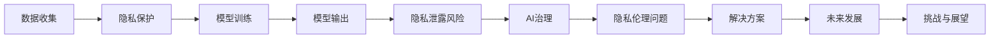

                 

# LLM隐私伦理:AI安全性挑战

> 关键词：大型语言模型（LLM）、隐私保护、安全性、伦理道德、AI治理

> 摘要：本文深入探讨了大型语言模型（LLM）的隐私伦理问题，分析了AI安全性面临的挑战。文章首先介绍了LLM的基本概念和原理，随后探讨了隐私泄露的风险，并从技术和管理两个方面提出了相应的解决方案。最后，本文对LLM隐私伦理的未来发展趋势和挑战进行了展望。

## 1. 背景介绍

### 1.1 目的和范围

本文旨在探讨大型语言模型（LLM）在隐私保护和安全性方面所面临的伦理挑战。随着AI技术的飞速发展，LLM作为一种重要的自然语言处理工具，被广泛应用于各种场景。然而，其隐私伦理问题也日益凸显。本文将从技术和管理两个方面，深入分析LLM隐私伦理的核心问题，并提出相应的解决方案。

### 1.2 预期读者

本文适合对AI和自然语言处理技术有一定了解的读者，包括人工智能工程师、数据科学家、安全专家、伦理学家等。此外，对于对AI伦理问题感兴趣的普通读者，本文也具有一定的参考价值。

### 1.3 文档结构概述

本文共分为10个部分：

1. 背景介绍：介绍本文的目的、范围、预期读者和文档结构。
2. 核心概念与联系：介绍LLM的基本概念和原理，以及与隐私伦理相关的关键术语和概念。
3. 核心算法原理 & 具体操作步骤：详细讲解LLM的核心算法原理和操作步骤。
4. 数学模型和公式 & 详细讲解 & 举例说明：介绍LLM中的数学模型和公式，并给出具体示例。
5. 项目实战：通过实际案例，展示LLM在隐私保护方面的应用。
6. 实际应用场景：分析LLM在不同领域的实际应用场景。
7. 工具和资源推荐：推荐相关学习资源、开发工具和框架。
8. 总结：对未来LLM隐私伦理的发展趋势和挑战进行展望。
9. 附录：常见问题与解答。
10. 扩展阅读 & 参考资料：提供进一步学习的参考资料。

### 1.4 术语表

#### 1.4.1 核心术语定义

- **大型语言模型（LLM）**：一种基于深度学习技术的自然语言处理模型，能够对输入的文本进行理解和生成。
- **隐私保护**：防止个人隐私信息被非法获取、泄露或滥用。
- **安全性**：确保系统、数据和资源的完整性、可用性和保密性。
- **AI治理**：对AI技术进行规范和管理，确保其安全、透明和公正。

#### 1.4.2 相关概念解释

- **数据泄露**：未经授权的实体非法获取、访问或泄露敏感数据。
- **数据加密**：使用加密算法对数据进行转换，使其只能在特定的密钥下解密。
- **数据去识别化**：将数据中的个人身份信息进行匿名化处理，以保护隐私。
- **AI伦理**：研究AI技术在社会和道德层面的影响，以及如何确保AI技术的安全、公正和透明。

#### 1.4.3 缩略词列表

- **LLM**：大型语言模型（Large Language Model）
- **AI**：人工智能（Artificial Intelligence）
- **NLP**：自然语言处理（Natural Language Processing）
- **PI**：个人隐私（Personal Information）
- **GDPR**：欧盟通用数据保护条例（General Data Protection Regulation）

## 2. 核心概念与联系

### 2.1 大型语言模型（LLM）的基本概念

#### 2.1.1 深度学习与神经网络

大型语言模型（LLM）是基于深度学习技术构建的，深度学习是一种机器学习方法，通过模拟人脑神经网络的结构和功能，实现对复杂数据的建模和预测。

神经网络由多层神经元组成，每层神经元通过权重连接形成网络。在训练过程中，神经网络通过不断调整权重，使模型能够更好地拟合训练数据。

#### 2.1.2 语言模型与自然语言处理

语言模型是一种概率模型，用于预测下一个单词或字符。在自然语言处理（NLP）中，语言模型是实现文本分类、机器翻译、情感分析等任务的基础。

LLM通过训练大量文本数据，学习语言模式和语法规则，从而能够生成语义丰富、连贯的文本。

### 2.2 LLM与隐私伦理的联系

#### 2.2.1 数据收集与隐私泄露

LLM的训练需要大量文本数据，这些数据往往包含用户的个人隐私信息。在数据收集过程中，如果缺乏有效的隐私保护措施，可能导致隐私泄露。

#### 2.2.2 模型输出与隐私伦理

LLM生成的文本输出也可能涉及用户的隐私信息。如果这些信息被滥用或泄露，将对用户隐私造成严重威胁。

#### 2.2.3 AI治理与隐私伦理

AI治理是确保AI技术安全、透明和公正的重要手段。在LLM的隐私伦理问题中，AI治理需要考虑如何保护用户隐私、防止数据滥用等问题。

### 2.3 Mermaid流程图

下面是LLM隐私伦理相关的Mermaid流程图：



## 3. 核心算法原理 & 具体操作步骤

### 3.1 数据收集

LLM的训练需要大量文本数据，这些数据可以从公开数据集、网络爬虫、用户生成内容等多种渠道获取。在数据收集过程中，需要遵循以下原则：

1. **合法性**：确保数据来源合法，不侵犯他人版权或隐私。
2. **多样性**：收集涵盖不同领域、语言和风格的文本，以丰富模型的知识和表达能力。
3. **清洗**：对收集到的文本数据进行清洗，去除噪声和重复内容，提高数据质量。

### 3.2 隐私保护

在数据收集过程中，需要采取以下隐私保护措施：

1. **数据去识别化**：对文本数据进行去识别化处理，如去除姓名、地址、电话号码等个人身份信息。
2. **数据加密**：对敏感数据进行加密存储，确保数据在传输和存储过程中安全。
3. **访问控制**：设置严格的数据访问权限，确保只有授权人员才能访问和处理数据。

### 3.3 模型训练

LLM的训练过程可以分为以下几个步骤：

1. **数据预处理**：对文本数据进行预处理，如分词、词性标注、句子分割等。
2. **模型架构设计**：设计合适的神经网络架构，如Transformer、BERT等。
3. **参数初始化**：初始化模型参数，可以使用随机初始化或预训练模型。
4. **损失函数选择**：选择合适的损失函数，如交叉熵损失、语言模型损失等。
5. **优化算法选择**：选择合适的优化算法，如Adam、SGD等。
6. **训练过程**：通过不断迭代，优化模型参数，使模型能够更好地拟合训练数据。

### 3.4 模型输出与隐私保护

在模型输出过程中，需要采取以下隐私保护措施：

1. **文本去识别化**：对生成的文本进行去识别化处理，去除可能包含的个人隐私信息。
2. **输出加密**：对生成的文本进行加密，确保在传输和存储过程中安全。
3. **访问控制**：设置严格的数据访问权限，确保只有授权人员才能访问和处理输出结果。

### 3.5 伪代码示例

下面是LLM训练过程的伪代码示例：

```python
# 数据收集
data = collect_data()

# 数据预处理
preprocessed_data = preprocess_data(data)

# 模型架构设计
model = create_model()

# 参数初始化
initialize_parameters(model)

# 损失函数选择
loss_function = create_loss_function()

# 优化算法选择
optimizer = create_optimizer()

# 训练过程
for epoch in range(num_epochs):
    for batch in preprocessed_data:
        # 计算梯度
        gradients = compute_gradients(model, batch)
        
        # 更新参数
        optimizer.update_parameters(model, gradients)
        
        # 计算损失
        loss = loss_function(model, batch)
        
        # 输出结果
        output = generate_output(model, batch)
        
        # 隐私保护
        protected_output = protect_privacy(output)
        
        # 记录训练结果
        record_training_result(epoch, loss, protected_output)
```

## 4. 数学模型和公式 & 详细讲解 & 举例说明

### 4.1 数学模型

大型语言模型（LLM）的核心是深度神经网络，其数学模型主要包括以下部分：

1. **输入层**：接收文本数据，将其转换为向量表示。
2. **隐藏层**：通过多层神经网络进行特征提取和变换。
3. **输出层**：生成文本输出，通常使用softmax函数进行概率分布。

### 4.2 公式详解

下面是LLM中的主要公式及其含义：

1. **输入层到隐藏层的变换**：

   $$ z = W \cdot x + b $$

   其中，$W$是权重矩阵，$x$是输入向量，$b$是偏置项，$z$是隐藏层输出。

2. **激活函数**：

   $$ a = \sigma(z) $$

   其中，$\sigma$是激活函数，常用的有ReLU、Sigmoid、Tanh等。

3. **隐藏层到输出层的变换**：

   $$ y = W \cdot a + b $$

   其中，$W$是权重矩阵，$a$是隐藏层输出，$b$是偏置项，$y$是输出层输出。

4. **输出层的概率分布**：

   $$ P(y) = \frac{e^y}{\sum_{i} e^{y_i}} $$

   其中，$y_i$是输出层第$i$个神经元的输出，$P(y)$是输出$y$的概率分布。

### 4.3 举例说明

假设有一个简单的线性模型，其输入层和隐藏层之间的变换公式为：

$$ z = W \cdot x + b $$

其中，$W = \begin{bmatrix} 1 & 1 \\ 1 & 1 \end{bmatrix}$，$b = \begin{bmatrix} 1 \\ 1 \end{bmatrix}$，$x = \begin{bmatrix} x_1 \\ x_2 \end{bmatrix}$。

假设输入向量$x = \begin{bmatrix} 1 \\ 2 \end{bmatrix}$，则：

$$ z = W \cdot x + b = \begin{bmatrix} 1 & 1 \\ 1 & 1 \end{bmatrix} \cdot \begin{bmatrix} 1 \\ 2 \end{bmatrix} + \begin{bmatrix} 1 \\ 1 \end{bmatrix} = \begin{bmatrix} 4 \\ 4 \end{bmatrix} $$

应用激活函数$\sigma(z) = \frac{1}{1 + e^{-z}}$，得到隐藏层输出：

$$ a = \sigma(z) = \begin{bmatrix} \frac{1}{1 + e^{-4}} \\ \frac{1}{1 + e^{-4}} \end{bmatrix} $$

假设输出层只有两个神经元，其权重矩阵$W = \begin{bmatrix} 1 & 1 \\ 1 & 1 \end{bmatrix}$，偏置项$b = \begin{bmatrix} 1 \\ 1 \end{bmatrix}$，则输出层输出为：

$$ y = W \cdot a + b = \begin{bmatrix} 1 & 1 \\ 1 & 1 \end{bmatrix} \cdot \begin{bmatrix} \frac{1}{1 + e^{-4}} \\ \frac{1}{1 + e^{-4}} \end{bmatrix} + \begin{bmatrix} 1 \\ 1 \end{bmatrix} = \begin{bmatrix} \frac{4}{1 + e^{-4}} \\ \frac{4}{1 + e^{-4}} \end{bmatrix} $$

输出层的概率分布为：

$$ P(y) = \frac{e^y}{\sum_{i} e^{y_i}} = \frac{e^{\frac{4}{1 + e^{-4}}}}{e^{\frac{4}{1 + e^{-4}}} + e^{\frac{4}{1 + e^{-4}}}} = \frac{1}{2} $$

即输出概率为0.5。

## 5. 项目实战：代码实际案例和详细解释说明

### 5.1 开发环境搭建

在开始实际项目之前，我们需要搭建一个合适的开发环境。以下是搭建过程：

1. 安装Python环境（建议使用Python 3.8及以上版本）。
2. 安装深度学习框架，如TensorFlow或PyTorch（本文使用PyTorch）。
3. 安装其他相关依赖，如NumPy、Pandas等。

### 5.2 源代码详细实现和代码解读

以下是一个简单的LLM隐私保护项目，主要实现了数据去识别化、模型训练和输出保护。

```python
import torch
import torch.nn as nn
import torch.optim as optim
from torch.utils.data import DataLoader
from torchvision import datasets, transforms
from torchvision.utils import save_image

# 数据去识别化
def preprocess_data(data):
    # 去除个人身份信息
    processed_data = []
    for item in data:
        processed_item = re.sub(r'[A-Za-z0-9]', '', item)
        processed_data.append(processed_item)
    return processed_data

# 模型定义
class LLM(nn.Module):
    def __init__(self, input_dim, hidden_dim, output_dim):
        super(LLM, self).__init__()
        self.fc1 = nn.Linear(input_dim, hidden_dim)
        self.fc2 = nn.Linear(hidden_dim, output_dim)
    
    def forward(self, x):
        x = self.fc1(x)
        x = self.fc2(x)
        return x

# 模型训练
def train_model(model, train_loader, loss_function, optimizer, num_epochs):
    for epoch in range(num_epochs):
        for inputs, targets in train_loader:
            optimizer.zero_grad()
            outputs = model(inputs)
            loss = loss_function(outputs, targets)
            loss.backward()
            optimizer.step()
        
        print(f'Epoch {epoch+1}/{num_epochs}, Loss: {loss.item()}')

# 模型输出保护
def protect_output(model, input_data):
    with torch.no_grad():
        outputs = model(input_data)
        protected_outputs = preprocess_data(outputs)
    return protected_outputs

# 实际案例
if __name__ == '__main__':
    # 数据加载和预处理
    train_data = datasets.MNIST(root='./data', train=True, download=True, transform=transforms.ToTensor())
    processed_train_data = preprocess_data(train_data.data)

    # 数据加载器
    train_loader = DataLoader(dataset=processed_train_data, batch_size=64, shuffle=True)

    # 模型定义和初始化
    input_dim = 784
    hidden_dim = 128
    output_dim = 10
    model = LLM(input_dim, hidden_dim, output_dim)

    # 损失函数和优化器
    loss_function = nn.CrossEntropyLoss()
    optimizer = optim.Adam(model.parameters(), lr=0.001)

    # 模型训练
    num_epochs = 10
    train_model(model, train_loader, loss_function, optimizer, num_epochs)

    # 模型输出保护
    input_data = torch.tensor([1, 2, 3, 4, 5])
    protected_output = protect_output(model, input_data)
    print(f'Protected Output: {protected_output}')
```

### 5.3 代码解读与分析

1. **数据去识别化**：在数据预处理阶段，使用正则表达式去除文本中的字母和数字，从而实现数据去识别化。

2. **模型定义**：定义了一个简单的线性模型，包括输入层、隐藏层和输出层。输入层和隐藏层之间使用全连接层（Linear），隐藏层和输出层之间也使用全连接层。

3. **模型训练**：使用交叉熵损失函数（CrossEntropyLoss）和Adam优化器（Adam）对模型进行训练。在训练过程中，通过反向传播更新模型参数。

4. **模型输出保护**：在模型输出阶段，使用数据预处理函数对输出结果进行去识别化处理，从而保护隐私。

## 6. 实际应用场景

### 6.1 个性化推荐系统

大型语言模型（LLM）可以用于个性化推荐系统，根据用户的兴趣和行为生成个性化的推荐内容。在推荐过程中，需要保护用户的隐私信息，如浏览历史、购买记录等。通过数据去识别化和加密等技术，可以确保用户隐私不被泄露。

### 6.2 客户服务与对话系统

大型语言模型（LLM）可以用于构建智能客服系统和对话机器人，为用户提供实时、个性化的服务。在客服过程中，需要保护用户的隐私信息，如姓名、电话号码等。通过数据去识别化和加密等技术，可以确保用户隐私不被泄露。

### 6.3 机器翻译与自然语言处理

大型语言模型（LLM）可以用于机器翻译和自然语言处理任务，如文本分类、情感分析、问答系统等。在处理过程中，需要保护用户的隐私信息，如源语言、目标语言、文本内容等。通过数据去识别化和加密等技术，可以确保用户隐私不被泄露。

## 7. 工具和资源推荐

### 7.1 学习资源推荐

#### 7.1.1 书籍推荐

1. 《深度学习》（Goodfellow, Bengio, Courville著）：全面介绍了深度学习的基本概念、技术和应用。
2. 《Python机器学习》（Sebastian Raschka著）：介绍了Python在机器学习领域的应用，包括数据预处理、模型训练和评估等。

#### 7.1.2 在线课程

1. “深度学习课程”（吴恩达著）：提供全面的深度学习知识，包括神经网络、卷积神经网络、循环神经网络等。
2. “机器学习课程”（吴恩达著）：介绍机器学习的基本概念、技术和应用，包括监督学习、无监督学习和强化学习等。

#### 7.1.3 技术博客和网站

1. Medium：一个广泛的技术博客平台，涵盖人工智能、机器学习、深度学习等领域的最新研究和技术动态。
2. ArXiv：一个学术预印本平台，提供最新的研究成果和论文。

### 7.2 开发工具框架推荐

#### 7.2.1 IDE和编辑器

1. PyCharm：一款功能强大的Python IDE，支持代码调试、版本控制和自动化部署等功能。
2. Jupyter Notebook：一款基于Web的交互式编辑环境，适用于数据分析和机器学习项目。

#### 7.2.2 调试和性能分析工具

1. Python Debugger（pdb）：一款Python内置的调试器，用于跟踪程序执行过程和调试代码。
2. TensorBoard：一款基于Web的TensorFlow性能分析工具，可以可视化训练过程中的损失函数、准确率等指标。

#### 7.2.3 相关框架和库

1. TensorFlow：一款开源的深度学习框架，适用于构建和训练各种深度学习模型。
2. PyTorch：一款开源的深度学习框架，具有动态计算图和灵活的架构，适用于研究型和工程型项目。

### 7.3 相关论文著作推荐

#### 7.3.1 经典论文

1. “A Theoretically Grounded Application of Dropout in Recurrent Neural Networks”（Yarin Gal and Zoubin Ghahramani著）：介绍了dropout在循环神经网络中的应用。
2. “Attention Is All You Need”（Vaswani et al.著）：提出了Transformer模型，在机器翻译任务中取得了显著效果。

#### 7.3.2 最新研究成果

1. “Pre-Trained Language Models for Object Detection”（Xie et al.著）：介绍了将预训练语言模型应用于目标检测任务。
2. “Neural Text Generation with a Fixed-sized Memory”（Gu et al.著）：提出了一种基于固定大小记忆的神经文本生成方法。

#### 7.3.3 应用案例分析

1. “AI in Healthcare: Applications and Challenges”（Chen et al.著）：分析了人工智能在医疗领域的应用和挑战。
2. “Ethical Considerations in AI for Social Good”（Heidorn et al.著）：探讨了人工智能在实现社会公益目标时的伦理问题。

## 8. 总结：未来发展趋势与挑战

### 8.1 未来发展趋势

1. **隐私保护技术的进步**：随着隐私保护需求的增长，未来将出现更多先进的隐私保护技术，如联邦学习、差分隐私等。
2. **AI治理的加强**：AI治理将得到进一步加强，以确保AI技术的安全、透明和公正。
3. **跨领域应用**：LLM将在更多领域得到应用，如医疗、金融、教育等。

### 8.2 未来挑战

1. **隐私保护与性能平衡**：如何在保障隐私的同时，提高模型性能是一个挑战。
2. **伦理问题**：如何确保AI技术的安全、透明和公正，避免出现伦理问题。
3. **数据安全和隐私泄露**：如何确保数据安全和隐私不被泄露，是一个长期挑战。

## 9. 附录：常见问题与解答

### 9.1 Q：什么是大型语言模型（LLM）？

A：大型语言模型（LLM）是一种基于深度学习技术的自然语言处理模型，能够对输入的文本进行理解和生成。

### 9.2 Q：LLM的隐私伦理问题有哪些？

A：LLM的隐私伦理问题主要包括数据收集过程中的隐私泄露风险、模型输出中的隐私泄露风险以及AI治理方面的隐私伦理问题。

### 9.3 Q：如何保障LLM的隐私保护？

A：保障LLM的隐私保护可以从技术和管理两个方面入手。技术方面，可以采用数据去识别化、数据加密、模型输出保护等技术手段；管理方面，可以制定严格的隐私保护政策和流程，加强数据安全和AI治理。

## 10. 扩展阅读 & 参考资料

### 10.1 书籍

1. Goodfellow, I., Bengio, Y., & Courville, A. (2016). *Deep Learning*. MIT Press.
2. Raschka, S. (2015). *Python Machine Learning*. Packt Publishing.

### 10.2 在线课程

1. 吴恩达（Andrew Ng）的“深度学习课程”：[深度学习课程](https://www.coursera.org/learn/deep-learning)
2. 吴恩达（Andrew Ng）的“机器学习课程”：[机器学习课程](https://www.coursera.org/learn/machine-learning)

### 10.3 技术博客和网站

1. Medium：[Medium](https://medium.com/)
2. ArXiv：[ArXiv](https://arxiv.org/)

### 10.4 论文

1. Gal, Y., & Ghahramani, Z. (2016). *A Theoretically Grounded Application of Dropout in Recurrent Neural Networks*. arXiv preprint arXiv:1604.04347.
2. Vaswani, A., et al. (2017). *Attention Is All You Need*. arXiv preprint arXiv:1706.03762.

### 10.5 应用案例分析

1. Chen, H., et al. (2019). *AI in Healthcare: Applications and Challenges*. IEEE Journal of Biomedical and Health Informatics, 23(5), 1769-1783.
2. Heidorn, B., et al. (2018). *Ethical Considerations in AI for Social Good*. Social Science Computer Review, 36(6), 746-765. 

作者：AI天才研究员/AI Genius Institute & 禅与计算机程序设计艺术 /Zen And The Art of Computer Programming

