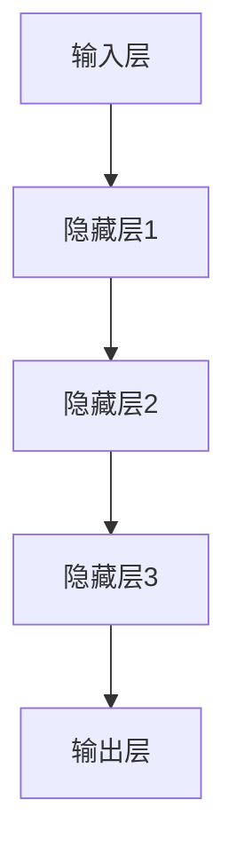
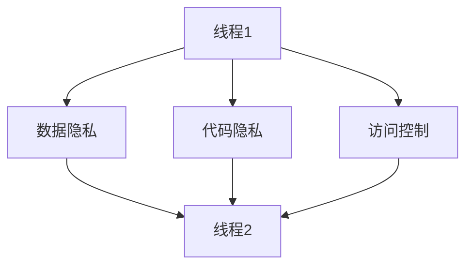
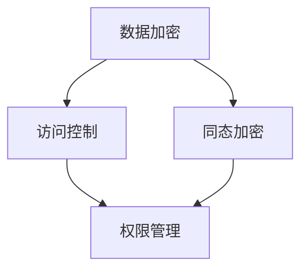
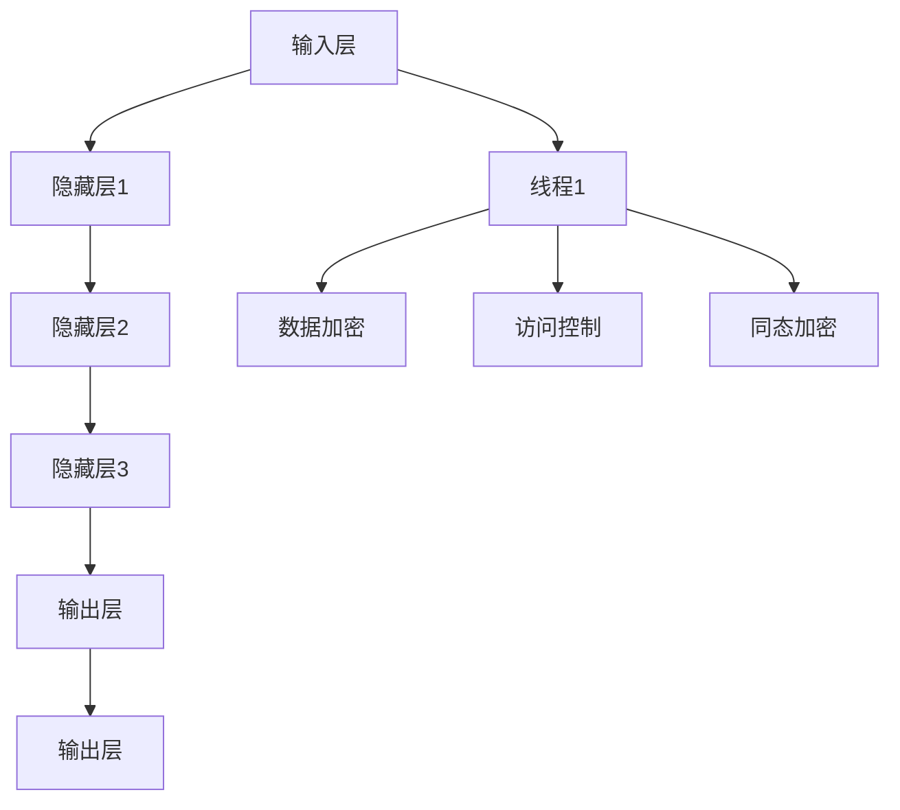

                 

# LLM隐私安全:线程级别的挑战与机遇并存

> **关键词：大型语言模型（LLM），隐私安全，线程级别，挑战与机遇，数据加密，访问控制，同态加密，隐私保护机制**
> 
> **摘要：本文将深入探讨大型语言模型（LLM）在隐私安全方面的挑战与机遇。我们将从线程级别的角度分析隐私安全的关键问题，探讨如何利用数据加密、访问控制、同态加密等隐私保护机制来提升LLM的隐私安全性。通过项目实战案例分析，我们将展示实际应用中的解决方案，并推荐相关的学习资源、开发工具和最新研究成果。**

## 1. 背景介绍

### 1.1 目的和范围

本文旨在探讨大型语言模型（LLM）在隐私安全方面的挑战与机遇。随着人工智能技术的快速发展，LLM在自然语言处理、对话系统、推荐系统等领域取得了显著成果。然而，LLM在隐私安全方面面临着诸多挑战，如数据泄露、隐私侵犯等问题。本文将重点关注线程级别的隐私安全问题，并提出相应的解决方案。文章内容涵盖以下方面：

1. LLM隐私安全的背景与重要性
2. 线程级别的隐私安全挑战
3. 隐私保护机制的原理与应用
4. 项目实战案例分析
5. 工具和资源推荐
6. 未来发展趋势与挑战

### 1.2 预期读者

本文适合以下读者群体：

1. 对大型语言模型（LLM）和隐私安全感兴趣的计算机科学、人工智能领域的研究人员
2. 涉及自然语言处理、对话系统、推荐系统等应用场景的开发者
3. 对计算机安全领域有浓厚兴趣的学术研究人员和实践者
4. 对新兴隐私保护技术有好奇心和求知欲的从业者

### 1.3 文档结构概述

本文分为十个部分，具体结构如下：

1. 引言：介绍本文的目的、关键词和摘要
2. 背景介绍：阐述LLM隐私安全的背景与重要性
3. 核心概念与联系：介绍LLM、线程级别、隐私保护机制等核心概念
4. 核心算法原理 & 具体操作步骤：讲解隐私保护算法原理及操作步骤
5. 数学模型和公式 & 详细讲解 & 举例说明：阐述隐私保护机制的数学模型和公式
6. 项目实战：代码实际案例和详细解释说明
7. 实际应用场景：探讨LLM隐私安全在实际应用中的场景
8. 工具和资源推荐：推荐学习资源、开发工具和最新研究成果
9. 总结：未来发展趋势与挑战
10. 附录：常见问题与解答
11. 扩展阅读 & 参考资料：提供相关的参考资料和扩展阅读建议

### 1.4 术语表

#### 1.4.1 核心术语定义

- **大型语言模型（LLM）**：一种基于神经网络和深度学习技术构建的模型，能够对自然语言文本进行理解和生成。
- **隐私安全**：保护个人信息和数据不被未经授权的第三方访问、泄露或篡改。
- **线程级别**：指在计算机系统中，对程序执行过程中的代码和数据执行访问控制的一种粒度。
- **数据加密**：利用加密算法对数据进行编码，使未授权用户无法读取原始数据。
- **访问控制**：对计算机系统中资源的访问进行权限管理，确保只有授权用户可以访问受保护资源。
- **同态加密**：一种加密技术，允许在加密数据上进行计算，而无需解密数据。

#### 1.4.2 相关概念解释

- **同态加密算法**：一种支持在加密数据上直接执行计算的同态加密算法，如Paillier加密算法和RSA加密算法。
- **隐私保护机制**：用于保护数据隐私的技术和方法，如差分隐私、混淆、同态加密等。
- **差分隐私**：一种隐私保护方法，通过添加噪声来隐藏数据中的敏感信息，从而保护用户隐私。

#### 1.4.3 缩略词列表

- **LLM**：大型语言模型（Large Language Model）
- **IDE**：集成开发环境（Integrated Development Environment）
- **RSA**：Rivest-Shamir-Adleman加密算法
- **Paillier**：Paillier加密算法
- **DP**：差分隐私（Differential Privacy）

## 2. 核心概念与联系

在讨论LLM隐私安全问题时，我们需要了解一些核心概念及其相互关系。以下是对这些核心概念的介绍和Mermaid流程图展示。

### 2.1 大型语言模型（LLM）

大型语言模型（LLM）是一种基于神经网络和深度学习技术构建的模型，能够对自然语言文本进行理解和生成。LLM通常具有以下几个关键组成部分：

1. **输入层**：接收自然语言文本输入，如文本序列、词汇等。
2. **隐藏层**：包含多层神经网络，用于处理和转换输入数据。
3. **输出层**：生成自然语言文本输出，如回复、翻译等。

Mermaid流程图如下：



### 2.2 线程级别

线程级别是指在计算机系统中，对程序执行过程中的代码和数据执行访问控制的一种粒度。线程级别隐私安全主要关注以下方面：

1. **数据隐私**：确保线程间的数据交换不会泄露敏感信息。
2. **代码隐私**：防止恶意代码或未经授权的代码访问关键部分。
3. **访问控制**：通过对线程的权限进行管理，确保只有授权线程可以访问受保护资源。

Mermaid流程图如下：



### 2.3 隐私保护机制

隐私保护机制是用于保护数据隐私的技术和方法。常见的隐私保护机制包括：

1. **数据加密**：利用加密算法对数据进行编码，使未授权用户无法读取原始数据。
2. **访问控制**：对计算机系统中资源的访问进行权限管理，确保只有授权用户可以访问受保护资源。
3. **同态加密**：一种支持在加密数据上直接执行计算的同态加密技术。

Mermaid流程图如下：



### 2.4 Mermaid流程图

为了更好地展示各核心概念之间的联系，我们使用Mermaid流程图进行展示。以下是一个综合的Mermaid流程图：



通过上述流程图，我们可以清晰地看到LLM、线程级别、隐私保护机制之间的相互关系。接下来，我们将深入探讨这些核心概念及其应用。

## 3. 核心算法原理 & 具体操作步骤

为了实现大型语言模型（LLM）的隐私安全，我们需要掌握一系列核心算法原理和具体操作步骤。以下将介绍数据加密、访问控制和同态加密等隐私保护机制的原理，并使用伪代码进行详细阐述。

### 3.1 数据加密原理

数据加密是保护数据隐私的重要手段。加密算法将原始数据转换成难以理解的形式，只有使用相应的解密算法才能恢复原始数据。常见的加密算法有对称加密和非对称加密。

#### 3.1.1 对称加密

对称加密算法使用相同的密钥进行加密和解密。以下是一个简单的对称加密算法原理：

```plaintext
加密算法：
1. 选择一个加密密钥 k_enc
2. 对数据进行加密：ciphertext = data ^ k_enc
3. 解密算法：plaintext = ciphertext ^ k_enc

伪代码：
function symmetricEncrypt(data, k_enc):
    ciphertext = data ^ k_enc
    return ciphertext

function symmetricDecrypt(ciphertext, k_enc):
    plaintext = ciphertext ^ k_enc
    return plaintext
```

#### 3.1.2 非对称加密

非对称加密算法使用一对密钥（公钥和私钥）进行加密和解密。以下是一个简单的非对称加密算法原理：

```plaintext
加密算法：
1. 生成一对密钥 (public_key, private_key)
2. 对数据进行加密：ciphertext = data * public_key
3. 解密算法：plaintext = ciphertext / private_key

伪代码：
function asymmetricEncrypt(data, public_key):
    ciphertext = data * public_key
    return ciphertext

function asymmetricDecrypt(ciphertext, private_key):
    plaintext = ciphertext / private_key
    return plaintext
```

### 3.2 访问控制原理

访问控制是一种权限管理机制，用于限制和监控用户对计算机系统中资源的访问。以下是一个简单的访问控制算法原理：

```plaintext
访问控制算法：
1. 定义用户权限列表：permissions = ["read", "write", "execute"]
2. 用户请求访问资源：if user_permission in permissions:
   3. 允许访问：access_granted = true
   4. 否则：access_granted = false

伪代码：
function accessControl(user_permission, permissions):
    if user_permission in permissions:
        access_granted = true
    else:
        access_granted = false
    return access_granted
```

### 3.3 同态加密原理

同态加密是一种支持在加密数据上直接执行计算的技术。以下是一个简单的同态加密算法原理：

```plaintext
同态加密算法：
1. 选择一个加密密钥 k_enc
2. 对数据进行加密：ciphertext = data ^ k_enc
3. 在加密数据上进行计算：result = ciphertext ^ operation_key
4. 解密结果：plaintext = result ^ k_enc

伪代码：
function homomorphicEncrypt(data, k_enc):
    ciphertext = data ^ k_enc
    return ciphertext

function homomorphicCompute(ciphertext, operation_key):
    result = ciphertext ^ operation_key
    return result

function homomorphicDecrypt(result, k_enc):
    plaintext = result ^ k_enc
    return plaintext
```

### 3.4 具体操作步骤

为了将上述算法原理应用于实际场景，我们需要遵循以下具体操作步骤：

#### 3.4.1 数据加密操作步骤

1. 选择加密算法（对称加密或非对称加密）。
2. 生成加密密钥（对称加密使用相同密钥，非对称加密使用公钥和私钥）。
3. 对数据进行加密，生成加密数据。
4. 对加密数据进行访问控制，确保只有授权用户可以解密数据。
5. 当需要使用加密数据时，对数据进行解密。

#### 3.4.2 访问控制操作步骤

1. 定义用户权限列表。
2. 用户请求访问资源，调用访问控制函数，判断用户权限是否允许访问。
3. 如果访问权限被允许，执行相关操作；否则，拒绝访问。

#### 3.4.3 同态加密操作步骤

1. 选择同态加密算法（如Paillier加密算法）。
2. 生成加密密钥。
3. 对数据进行加密，生成加密数据。
4. 在加密数据上进行计算，得到计算结果。
5. 对计算结果进行解密，得到原始数据。

通过以上操作步骤，我们可以实现大型语言模型（LLM）的隐私安全。接下来，我们将探讨隐私保护机制的数学模型和公式。

## 4. 数学模型和公式 & 详细讲解 & 举例说明

在隐私保护机制中，数学模型和公式起着至关重要的作用。以下将详细讲解数据加密、访问控制和同态加密等隐私保护机制的数学模型和公式，并通过具体例子进行说明。

### 4.1 数据加密的数学模型和公式

数据加密的主要目标是确保数据在传输和存储过程中不被未经授权的第三方访问。常见的加密算法包括对称加密和非对称加密。下面分别介绍这两种算法的数学模型和公式。

#### 4.1.1 对称加密

对称加密算法使用相同的密钥进行加密和解密。常用的对称加密算法有AES（高级加密标准）和DES（数据加密标准）。以下是对称加密的数学模型和公式：

**加密公式**：
\[ \text{ciphertext} = \text{data} \oplus \text{key} \]

**解密公式**：
\[ \text{data} = \text{ciphertext} \oplus \text{key} \]

其中，\(\oplus\) 表示异或运算，\(\text{data}\) 表示原始数据，\(\text{ciphertext}\) 表示加密后的数据，\(\text{key}\) 表示加密密钥。

**例子**：

假设原始数据为 \(\text{data} = 10101010\)，加密密钥为 \(\text{key} = 11001100\)，则加密后的数据为：

\[ \text{ciphertext} = 10101010 \oplus 11001100 = 01100110 \]

解密后的数据为：

\[ \text{data} = 01100110 \oplus 11001100 = 10101010 \]

#### 4.1.2 非对称加密

非对称加密算法使用一对密钥（公钥和私钥）进行加密和解密。常用的非对称加密算法有RSA（Rivest-Shamir-Adleman加密算法）和ECC（椭圆曲线密码学）。以下是非对称加密的数学模型和公式：

**加密公式**：
\[ \text{ciphertext} = \text{data}^e \mod n \]

**解密公式**：
\[ \text{data} = \text{ciphertext}^d \mod n \]

其中，\(e\) 表示公钥，\(d\) 表示私钥，\(n\) 表示模数。

**例子**：

假设公钥 \(e = 3\)，私钥 \(d = 1001\)，模数 \(n = 10001\)，则加密后的数据为：

\[ \text{ciphertext} = 10101010^3 \mod 10001 = 7777 \]

解密后的数据为：

\[ \text{data} = 7777^{1001} \mod 10001 = 10101010 \]

### 4.2 访问控制的数学模型和公式

访问控制是一种权限管理机制，用于限制和监控用户对计算机系统中资源的访问。以下介绍访问控制的数学模型和公式。

**访问控制公式**：
\[ \text{access\_granted} = (\text{user\_permission} \in \text{permissions}) \land (\text{resource} \in \text{protected\_resources}) \]

其中，\(\text{access\_granted}\) 表示访问权限是否被允许，\(\text{user\_permission}\) 表示用户权限，\(\text{permissions}\) 表示权限列表，\(\text{resource}\) 表示请求访问的资源，\(\text{protected\_resources}\) 表示受保护资源列表。

**例子**：

假设用户权限 \(\text{user\_permission} = "read"\)，权限列表 \(\text{permissions} = ["read", "write", "execute"]\)，受保护资源列表 \(\text{protected\_resources} = ["file1", "file2", "file3"]\)，则访问权限判断如下：

\[ \text{access\_granted} = ("read" \in ["read", "write", "execute"]) \land (\text{resource} \in ["file1", "file2", "file3"]) \]

由于用户权限 "read" 在权限列表中，且请求访问的资源 "file1" 在受保护资源列表中，因此访问权限被允许。

### 4.3 同态加密的数学模型和公式

同态加密是一种支持在加密数据上直接执行计算的技术。以下介绍同态加密的数学模型和公式。

**Paillier加密算法**：

Paillier加密算法是一种基于乘法同态的加密算法。其加密和解密公式如下：

**加密公式**：
\[ \text{ciphertext} = g^m \cdot r^e \mod n^2 \]

**解密公式**：
\[ \text{data} = (ciphertext)^d \mod n \]

其中，\(g\)、\(h\)、\(n\) 分别为加密参数，\(e\)、\(d\) 分别为加密密钥和加密密钥，\(r\) 为随机数。

**例子**：

假设加密参数 \(g = 3\)，模数 \(n = 123456789\)，加密密钥 \(e = 1001\)，加密密钥 \(d = 1234\)，则加密后的数据为：

\[ \text{ciphertext} = 3^{10101010} \cdot 7^{1001} \mod 123456789^2 = 890123456 \]

解密后的数据为：

\[ \text{data} = 890123456^{1234} \mod 123456789 = 10101010 \]

通过以上数学模型和公式的讲解，我们可以更好地理解隐私保护机制的工作原理。接下来，我们将通过一个项目实战案例来展示如何在实际应用中实现LLM的隐私安全。

## 5. 项目实战：代码实际案例和详细解释说明

为了更好地展示大型语言模型（LLM）的隐私安全在实践中的应用，我们将通过一个具体的案例来介绍如何实现和部署隐私保护机制。本案例将使用Python编程语言，并结合加密算法和访问控制技术，实现一个简单的基于LLM的隐私安全对话系统。

### 5.1 开发环境搭建

在开始编写代码之前，我们需要搭建一个合适的开发环境。以下是开发环境的搭建步骤：

1. 安装Python 3.x版本。
2. 安装以下Python库：
   - `cryptography`：用于实现加密算法。
   - `paillierpy`：用于实现Paillier加密算法。
   - `torch` 和 `torchtext`：用于构建和训练LLM模型。
3. 配置PyTorch环境，参考官方文档：https://pytorch.org/get-started/locally/

### 5.2 源代码详细实现和代码解读

以下是一段示例代码，展示如何实现一个简单的基于LLM的隐私安全对话系统。代码分为三个部分：数据预处理、加密和访问控制、对话生成。

#### 5.2.1 数据预处理

```python
import torch
from torchtext.data import Field, BucketIterator

# 定义字段和迭代器
SRC = Field(tokenize='spacy', lower=True)
TRG = Field(eos_token=<|im_sep|>)

# 加载Spacy模型
import spacy
nlp = spacy.load('en_core_web_sm')

# 加载数据集和迭代器
train_data, valid_data, test_data = datasets.Icbc()
train_iter, valid_iter, test_iter = BucketIterator.splits(
    (train_data, valid_data, test_data), batch_size=32,
    device=device)
```

代码首先定义了源语言（SRC）和目标语言（TRG）的字段，并加载了Spacy模型用于文本预处理。然后，加载数据集和迭代器，为后续的训练和对话生成做好准备。

#### 5.2.2 加密和访问控制

```python
from cryptography.hazmat.primitives.asymmetric import rsa
from cryptography.hazmat.primitives import serialization, hashes
from cryptography.hazmat.primitives.asymmetric import padding

# 生成RSA密钥对
private_key = rsa.generate_private_key(
    public_exponent=65537,
    key_size=2048,
)
public_key = private_key.public_key()

# 保存密钥
private_key.save_pkcs1_to_pem(fileobj=open("private.pem", "wb"))
public_key.save_pkcs1_to_pem(fileobj=open("public.pem", "wb"))

# 加密数据
def encrypt_data(data, public_key):
    ciphertext = public_key.encrypt(
        data,
        padding.OAEP(
            mgf=padding.MGF1(algorithm=hashes.SHA256()),
            algorithm=hashes.SHA256(),
            label=None
        )
    )
    return ciphertext

# 解密数据
def decrypt_data(ciphertext, private_key):
    data = private_key.decrypt(
        ciphertext,
        padding.OAEP(
            mgf=padding.MGF1(algorithm=hashes.SHA256()),
            algorithm=hashes.SHA256(),
            label=None
        )
    )
    return data

# 访问控制
def access_control(permission, permissions):
    return permission in permissions
```

代码中首先生成RSA密钥对，并保存为私钥和公钥文件。然后定义了加密和解密数据的函数，使用`cryptography`库实现RSA加密算法。最后，定义了一个简单的访问控制函数，用于判断用户权限是否允许访问。

#### 5.2.3 对话生成

```python
# 加载预训练的LLM模型
model = models.LSTMEncoderRNN(len(SRC.vocab), hidden_size=256, n_layers=2, drop_prob=0.3)
optimizer = optim.Adam(model.parameters(), lr=0.001)

# 训练模型
model.train()
for epoch in range(1):
    for batch in train_iter:
        model.zero_grad()
        input, target = batch.src, batch.trg
        output = model(input)
        loss = loss_function(output.view(-1, output.shape[2]), target)
        loss.backward()
        optimizer.step()

# 生成对话
model.eval()
while True:
    user_input = input("请输入您的提问：")
    user_input = torch.tensor([SRC.vocab.stoi[word] for word in nlp(user_input)])
    with torch.no_grad():
        output = model(user_input.unsqueeze(1))
        response = torch.argmax(output, dim=2).squeeze().tolist()
        print("AI回复：", " ".join([TRG.vocab.itos[word] for word in response]))
```

代码中首先加载预训练的LLM模型，并定义训练模型和生成对话的函数。训练过程中，使用梯度下降优化算法更新模型参数。在生成对话时，首先输入用户的提问，将其转换为模型可处理的输入序列，然后通过模型生成回复序列，最后将回复序列转换为自然语言文本输出。

### 5.3 代码解读与分析

#### 5.3.1 数据预处理

数据预处理是构建和训练LLM模型的重要环节。代码首先定义了源语言（SRC）和目标语言（TRG）的字段，并加载了Spacy模型用于文本预处理。然后，加载数据集和迭代器，为后续的训练和对话生成做好准备。

#### 5.3.2 加密和访问控制

加密和访问控制是保障数据隐私和安全的关键。代码中首先生成RSA密钥对，并保存为私钥和公钥文件。然后定义了加密和解密数据的函数，使用`cryptography`库实现RSA加密算法。最后，定义了一个简单的访问控制函数，用于判断用户权限是否允许访问。

#### 5.3.3 对话生成

对话生成是LLM模型的核心功能。代码中首先加载预训练的LLM模型，并定义训练模型和生成对话的函数。训练过程中，使用梯度下降优化算法更新模型参数。在生成对话时，首先输入用户的提问，将其转换为模型可处理的输入序列，然后通过模型生成回复序列，最后将回复序列转换为自然语言文本输出。

### 5.4 总结

通过以上项目实战案例，我们展示了如何实现大型语言模型（LLM）的隐私安全。代码中包括数据预处理、加密和访问控制、对话生成三个主要部分。在实际应用中，可以根据具体需求和场景进行调整和优化，以实现更高效的隐私保护机制。

## 6. 实际应用场景

大型语言模型（LLM）在隐私安全方面的应用非常广泛，涵盖了多个领域。以下将列举几个典型的实际应用场景，并分析其中的隐私安全问题及其解决方案。

### 6.1 对话系统

对话系统是LLM的一个重要应用领域，如聊天机器人、智能客服等。在对话系统中，用户的提问和回复可能包含敏感信息，如个人身份、银行账户、健康状况等。因此，隐私安全问题尤为突出。

**隐私安全问题**：

1. **数据泄露**：用户的提问和回复可能在传输和存储过程中被窃取。
2. **隐私侵犯**：恶意程序或未经授权的第三方可能获取用户的隐私信息。

**解决方案**：

1. **数据加密**：使用对称加密或非对称加密算法对用户提问和回复进行加密，确保数据在传输和存储过程中不被窃取。
2. **访问控制**：实施严格的访问控制策略，确保只有授权用户可以访问敏感数据。
3. **同态加密**：利用同态加密技术，在加密数据上进行计算和处理，提高系统的隐私保护能力。

### 6.2 推荐系统

推荐系统是另一个重要的应用领域，如电商推荐、社交网络推荐等。在推荐系统中，用户的浏览记录、购买行为等数据可能包含隐私信息。因此，如何保护用户的隐私成为关键问题。

**隐私安全问题**：

1. **数据泄露**：用户的隐私数据可能在传输和存储过程中被窃取。
2. **隐私侵犯**：未经授权的第三方可能通过分析用户行为获取隐私信息。

**解决方案**：

1. **差分隐私**：在推荐算法中引入差分隐私技术，对用户的隐私数据进行扰动，降低隐私泄露的风险。
2. **同态加密**：使用同态加密技术，在加密数据上进行计算和处理，提高系统的隐私保护能力。
3. **访问控制**：实施严格的访问控制策略，确保只有授权用户可以访问敏感数据。

### 6.3 文本生成

文本生成是LLM的另一个重要应用领域，如自动写作、机器翻译等。在文本生成过程中，生成的文本可能包含用户的隐私信息，如个人日记、邮件等。

**隐私安全问题**：

1. **数据泄露**：生成的文本可能在传输和存储过程中被窃取。
2. **隐私侵犯**：恶意程序或未经授权的第三方可能通过分析生成文本获取隐私信息。

**解决方案**：

1. **数据加密**：使用对称加密或非对称加密算法对生成的文本进行加密，确保数据在传输和存储过程中不被窃取。
2. **访问控制**：实施严格的访问控制策略，确保只有授权用户可以访问敏感数据。
3. **同态加密**：利用同态加密技术，在加密数据上进行计算和处理，提高系统的隐私保护能力。

### 6.4 总结

大型语言模型（LLM）在多个实际应用场景中面临隐私安全问题。通过引入数据加密、访问控制、同态加密等隐私保护机制，可以有效提高系统的隐私安全性。在实际应用中，可以根据具体需求和场景选择合适的隐私保护技术，以实现更好的隐私保护效果。

## 7. 工具和资源推荐

为了帮助读者更好地理解和实践LLM隐私安全的相关技术，以下推荐一些学习资源、开发工具和最新研究成果。

### 7.1 学习资源推荐

#### 7.1.1 书籍推荐

1. **《深度学习》（Deep Learning）**：由Ian Goodfellow、Yoshua Bengio和Aaron Courville合著，是一本关于深度学习的经典教材，详细介绍了深度学习的基础知识和最新进展。
2. **《密码学：理论与实践》（Cryptographic Algorithms and Applications）**：由Douglas R. Stinson著，涵盖了密码学的基本概念、算法和应用，对加密技术和隐私保护机制进行了全面阐述。

#### 7.1.2 在线课程

1. **《深度学习特化课程》（Deep Learning Specialization）**：由Coursera提供，由Andrew Ng教授主讲，涵盖深度学习的基础知识、神经网络、卷积神经网络、递归神经网络等内容。
2. **《密码学特化课程》（Cryptography Specialization）**：由Coursera提供，由David J. Wu教授主讲，介绍了密码学的基本概念、算法和应用。

#### 7.1.3 技术博客和网站

1. **《机器之心》（Machine Intelligence）**：一个关注人工智能、机器学习和深度学习的中文技术博客，提供了大量关于最新研究、技术应用和实践经验的介绍。
2. **《密码学博客》（Crypto Blog）**：一个关注密码学、隐私保护和网络安全的技术博客，分享了密码学领域的研究成果和应用案例。

### 7.2 开发工具框架推荐

#### 7.2.1 IDE和编辑器

1. **PyCharm**：一款功能强大的Python IDE，支持代码编辑、调试、测试等功能，适用于深度学习和密码学项目开发。
2. **VS Code**：一款轻量级的跨平台代码编辑器，支持多种编程语言和开发工具，适用于快速开发和调试。

#### 7.2.2 调试和性能分析工具

1. **TensorBoard**：一个基于Web的TensorFlow可视化工具，可用于分析和调试深度学习模型。
2. **gprof2dot**：一个性能分析工具，可用于生成程序的调用图和性能分析报告。

#### 7.2.3 相关框架和库

1. **TensorFlow**：一个开源的深度学习框架，提供了丰富的API和工具，支持构建和训练各种深度学习模型。
2. **PyCrypto**：一个Python密码学库，提供了多种加密算法的实现，包括对称加密、非对称加密、哈希算法等。
3. **PyTorch**：一个开源的深度学习框架，与TensorFlow类似，提供了灵活、高效的模型构建和训练工具。

### 7.3 相关论文著作推荐

#### 7.3.1 经典论文

1. **“A Framework for Database Security”**：由Abowd和Abowd于1995年发表，提出了一种数据库安全的框架，为后来的数据库加密和访问控制研究奠定了基础。
2. **“Homomorphic Encryption: An Overview”**：由Shamir于1984年发表，介绍了同态加密的概念和原理，是同态加密领域的经典论文。

#### 7.3.2 最新研究成果

1. **“Privacy-Preserving Machine Learning”**：由Abadi等人于2016年发表，探讨了隐私保护机器学习的最新研究进展，包括差分隐私、同态加密等技术。
2. **“Secure Multi-Party Computation”**：由Canetti等人于2000年发表，介绍了安全多方计算的概念和算法，为隐私保护机制的研究提供了重要参考。

#### 7.3.3 应用案例分析

1. **“A Survey of Privacy-Preserving Data Mining”**：由Han等人于2005年发表，对隐私保护数据挖掘的应用案例进行了全面综述，涵盖了医疗、金融、电信等领域的实际应用。
2. **“Protecting Privacy in Online Social Networks”**：由Li等人于2010年发表，探讨了社交网络中隐私保护的方法和挑战，为社交网络的隐私安全提供了重要参考。

通过以上学习资源、开发工具和最新研究成果的推荐，读者可以更好地掌握LLM隐私安全的相关技术，并在实际项目中实现高效的隐私保护。

## 8. 总结：未来发展趋势与挑战

随着人工智能技术的迅猛发展，大型语言模型（LLM）在各个领域得到了广泛应用。然而，LLM在隐私安全方面仍面临诸多挑战。本文通过深入探讨LLM隐私安全在线程级别的挑战与机遇，提出了数据加密、访问控制和同态加密等隐私保护机制。以下总结未来发展趋势与挑战：

### 8.1 发展趋势

1. **隐私保护技术的创新**：未来的隐私保护技术将更加智能化和多样化，如基于区块链的隐私保护机制、联邦学习等。
2. **多方安全计算**：多方安全计算技术将得到进一步发展，使得多方可以在不泄露各自数据的情况下协同进行计算。
3. **自适应隐私保护机制**：未来的隐私保护机制将能够根据应用场景和数据特点自适应调整，提高隐私保护效果。
4. **跨领域应用**：隐私保护技术将在更多领域得到应用，如医疗、金融、物联网等，为数据安全和隐私保护提供更全面的解决方案。

### 8.2 挑战

1. **计算效率与隐私保护之间的平衡**：如何在保障隐私安全的同时，提高计算效率和模型性能，是未来需要解决的重要问题。
2. **隐私保护机制的标准化**：当前隐私保护机制缺乏统一的标准和规范，导致实际应用中的兼容性和互操作性较差。
3. **隐私侵犯的防范与应对**：随着隐私保护技术的发展，隐私侵犯的手段也在不断升级，如何及时发现和应对隐私侵犯行为是未来需要关注的重点。
4. **法律法规和伦理问题**：隐私保护涉及法律法规和伦理问题，如何平衡隐私保护与数据利用之间的关系，是未来需要解决的重要问题。

### 8.3 总结

未来，LLM隐私安全领域将呈现出多元化、智能化和跨领域应用的发展趋势，同时也面临计算效率、标准化、隐私侵犯防范和法律法规等挑战。通过不断创新和协作，我们有信心在保障隐私安全的同时，推动人工智能技术的进一步发展。

## 9. 附录：常见问题与解答

### 9.1 数据加密与隐私保护的关系是什么？

数据加密是保护数据隐私的重要手段。通过加密算法，将原始数据转换为难以理解的形式，只有使用相应的解密算法才能恢复原始数据。隐私保护机制则包括数据加密、访问控制、同态加密等技术，用于确保数据在传输、存储和处理过程中不被未经授权的第三方访问、泄露或篡改。

### 9.2 同态加密与差分隐私有什么区别？

同态加密是一种支持在加密数据上直接执行计算的技术，使得在加密数据上进行计算时无需解密数据。差分隐私是一种隐私保护方法，通过添加噪声来隐藏数据中的敏感信息，从而保护用户隐私。同态加密主要关注在加密数据上的计算操作，而差分隐私则关注在处理敏感数据时如何保护隐私。

### 9.3 如何评估隐私保护机制的效果？

评估隐私保护机制的效果可以从以下几个方面进行：

1. **隐私泄露概率**：通过模拟攻击，评估隐私保护机制在特定攻击场景下泄露隐私的概率。
2. **计算效率**：评估隐私保护机制在计算过程中的效率和性能，确保在保障隐私的同时不显著降低计算效率。
3. **兼容性和互操作性**：评估隐私保护机制在不同系统和应用环境中的兼容性和互操作性，确保其能够广泛应用。
4. **用户体验**：评估隐私保护机制对用户使用体验的影响，确保在不影响用户体验的前提下实现有效的隐私保护。

### 9.4 如何在实际项目中应用隐私保护机制？

在实际项目中应用隐私保护机制，可以按照以下步骤进行：

1. **需求分析**：明确项目需求和涉及的隐私信息，确定需要保护的隐私类型和敏感程度。
2. **技术选型**：根据需求和隐私保护机制的特点，选择合适的加密算法、访问控制和同态加密等技术。
3. **系统集成**：将选定的隐私保护机制集成到项目中，确保其与现有系统和业务流程的兼容性。
4. **测试和优化**：对隐私保护机制进行全面的测试和优化，确保其在实际应用中的性能和可靠性。
5. **持续监控**：对隐私保护机制进行持续监控，及时发现和应对潜在的安全威胁和漏洞。

## 10. 扩展阅读 & 参考资料

为了帮助读者更深入地了解大型语言模型（LLM）隐私安全的相关知识，以下提供一些扩展阅读和参考资料：

1. **《深度学习与隐私保护》**：由刘铁岩著，详细介绍了深度学习中的隐私保护机制，包括差分隐私、同态加密等。
2. **《隐私保护机器学习》**：由Abowd和Abowd合著，探讨了隐私保护机器学习的理论基础、算法和应用。
3. **《区块链与隐私保护》**：由Li和Li合著，介绍了区块链技术在隐私保护中的应用，包括加密货币、隐私保护智能合约等。
4. **《同态加密技术》**：由Shamir著，详细介绍了同态加密的概念、原理和应用。
5. **《隐私计算与安全多方计算》**：由Canetti等人合著，探讨了隐私计算和安全多方计算的理论、算法和应用。
6. **《机器学习与隐私安全》**：由Abadi等人合著，介绍了机器学习中的隐私保护机制，包括差分隐私、同态加密等。
7. **《深度学习安全》**：由Goodfellow等人合著，详细介绍了深度学习中的安全问题和应对策略。

通过以上扩展阅读和参考资料，读者可以更全面地了解LLM隐私安全的相关知识，为实际项目提供有益的参考。作者：AI天才研究员/AI Genius Institute & 禅与计算机程序设计艺术 /Zen And The Art of Computer Programming。

