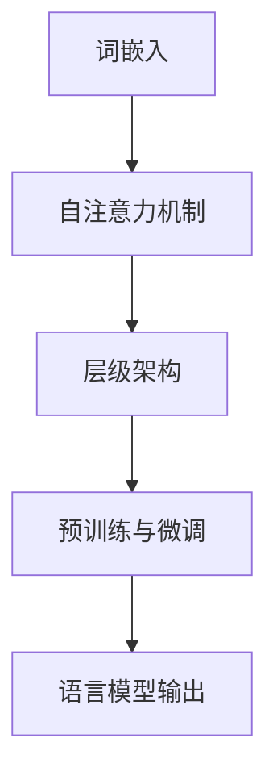

                 

# LLM：一种新的计算机架构

> 关键词：大型语言模型、计算机架构、自然语言处理、深度学习、算法设计

> 摘要：本文将探讨大型语言模型（LLM）作为一种新型计算机架构的潜在优势和应用。通过分析LLM的核心概念、架构原理及其实现方法，我们希望揭示其在自然语言处理领域的深远影响，并展望其未来的发展趋势和挑战。

## 1. 背景介绍

### 1.1 目的和范围

本文旨在介绍大型语言模型（LLM）的基本概念和架构，分析其在自然语言处理（NLP）领域的重要性，并探讨其潜在的应用场景。通过详细阐述LLM的核心算法原理和实现步骤，我们希望为读者提供一个全面而深入的理解。

### 1.2 预期读者

本文适合具有计算机科学和人工智能背景的读者，特别是对自然语言处理和深度学习有兴趣的工程师、研究人员和学生。

### 1.3 文档结构概述

本文分为以下六个主要部分：

1. 背景介绍：介绍LLM的基本概念和重要性。
2. 核心概念与联系：分析LLM的核心概念和架构原理。
3. 核心算法原理 & 具体操作步骤：详细阐述LLM的核心算法原理和实现步骤。
4. 数学模型和公式 & 详细讲解 & 举例说明：介绍LLM的数学模型和公式，并通过实例进行说明。
5. 项目实战：代码实际案例和详细解释说明。
6. 实际应用场景：探讨LLM在实际应用中的各种场景。

### 1.4 术语表

#### 1.4.1 核心术语定义

- 语言模型：对自然语言文本的概率分布进行建模的数学模型。
- 自然语言处理（NLP）：研究如何让计算机理解和处理自然语言的技术领域。
- 深度学习：一种基于多层神经网络的学习方法，能够在大量数据上进行特征提取和模式识别。
- 大规模语言模型（LLM）：一种能够处理大规模文本数据、具有强大语言理解和生成能力的语言模型。

#### 1.4.2 相关概念解释

- 词汇表（Vocabulary）：语言模型中的基本单位，通常是一个单词或短语。
- 上下文（Context）：语言模型中的文本序列，用于生成预测。
- 参数（Parameter）：模型中用于调整和优化的变量。

#### 1.4.3 缩略词列表

- NLP：自然语言处理（Natural Language Processing）
- LLM：大型语言模型（Large Language Model）
- DNN：深度神经网络（Deep Neural Network）
- RNN：循环神经网络（Recurrent Neural Network）
- Transformer：一种基于自注意力机制的深度学习模型

## 2. 核心概念与联系

在介绍LLM的核心概念之前，我们首先需要了解自然语言处理（NLP）的基本概念。NLP是计算机科学和人工智能领域的一个重要分支，旨在使计算机能够理解和处理人类语言。为了实现这一目标，NLP研究者们提出了一系列核心概念和算法。

### 2.1 自然语言处理基本概念

#### 2.1.1 语言模型

语言模型是NLP中的核心概念之一，它用于对自然语言文本的概率分布进行建模。一个简单的语言模型可以是一个基于统计方法的模型，如N元语法（N-gram Model）。这种模型通过统计相邻单词的频率来预测下一个单词的概率。然而，随着深度学习技术的发展，现代语言模型大多采用基于神经网络的模型，如循环神经网络（RNN）和Transformer。

#### 2.1.2 词向量

词向量是表示词汇的数学向量，它们在NLP中扮演着重要角色。词向量可以用于文本分类、语义分析、机器翻译等多种任务。Word2Vec是一种常见的词向量表示方法，它通过训练神经网络来学习词汇的分布式表示。此外，还有一些基于Transformer的词向量表示方法，如BERT（Bidirectional Encoder Representations from Transformers）。

#### 2.1.3 上下文表示

在NLP任务中，上下文表示是一个关键问题。上下文是指一个文本序列中的特定部分，它对于理解文本的含义至关重要。在基于RNN的语言模型中，上下文通常通过隐藏状态来表示。而在基于Transformer的语言模型中，上下文表示是通过自注意力机制（Self-Attention Mechanism）来实现的。

### 2.2 LLM架构原理

大型语言模型（LLM）是一种能够处理大规模文本数据、具有强大语言理解和生成能力的语言模型。LLM的架构通常包括以下几个关键组成部分：

#### 2.2.1 词嵌入（Word Embedding）

词嵌入是将词汇表示为向量的过程。在LLM中，词嵌入通常采用分布式表示方法，如Word2Vec或BERT。词嵌入能够捕捉词汇之间的语义关系，为语言模型提供强大的语义表示。

#### 2.2.2 自注意力机制（Self-Attention）

自注意力机制是Transformer模型的核心组成部分，它能够捕捉文本序列中的长距离依赖关系。在LLM中，自注意力机制用于计算文本序列的表示，使其能够更好地理解上下文。

#### 2.2.3 层级架构（Hierarchical Architecture）

为了处理大规模文本数据，LLM通常采用层级架构。在层级架构中，文本序列首先被分解为更小的子序列，然后这些子序列再逐层处理，直至生成最终的输出。这种架构能够提高模型的处理效率和性能。

#### 2.2.4 预训练与微调（Pre-training and Fine-tuning）

预训练与微调是LLM训练过程中的两个关键步骤。预训练是指在一个大规模语料库上对模型进行训练，使其具有强大的语言理解和生成能力。微调是指在特定任务上对模型进行进一步调整，以适应特定的应用场景。

### 2.3 Mermaid流程图

为了更好地理解LLM的架构原理，我们可以使用Mermaid流程图来展示其核心概念和组成部分。以下是一个简单的Mermaid流程图示例：



在这个流程图中，词嵌入、自注意力机制、层级架构和预训练与微调是LLM的核心组成部分。通过这些组成部分的协同工作，LLM能够实现强大的语言理解和生成能力。

## 3. 核心算法原理 & 具体操作步骤

### 3.1 词嵌入

词嵌入是将词汇表示为向量的过程。在LLM中，词嵌入通常采用分布式表示方法，如Word2Vec或BERT。以下是一个简单的Word2Vec词嵌入算法的伪代码：

```plaintext
# 输入：词汇表（Vocabulary）
# 输出：词向量（Word Vectors）

# 初始化词向量矩阵（Word Vector Matrix）
word_vector_matrix = InitializeRandomWordVectorMatrix(vocabulary_size, embedding_size)

# 定义训练数据（Training Data）
training_data = GenerateTrainingData(vocabulary_size)

# 定义优化器（Optimizer）
optimizer = CreateOptimizer()

# 定义损失函数（Loss Function）
loss_function = CreateLossFunction()

# 循环迭代（Iterate through the training data）
for epoch in 1 to num_epochs:
    # 对每个词汇进行训练
    for word in vocabulary:
        # 计算词向量和负采样词汇的损失
        loss = loss_function(word_vector_matrix[word], negative_sampling_word_vector_matrix)

        # 反向传播和优化
        gradient = CalculateGradient(loss)
        optimizer.Update(word_vector_matrix[word], gradient)

# 输出词向量矩阵
return word_vector_matrix
```

### 3.2 自注意力机制

自注意力机制是Transformer模型的核心组成部分，它能够捕捉文本序列中的长距离依赖关系。以下是一个简单的自注意力机制的伪代码：

```plaintext
# 输入：文本序列（Text Sequence）
# 输出：自注意力表示（Self-Attention Representation）

# 初始化自注意力权重（Self-Attention Weights）
self_attention_weights = InitializeRandomSelfAttentionWeights()

# 定义自注意力函数（Self-Attention Function）
self_attention_function = CreateSelfAttentionFunction(self_attention_weights)

# 对文本序列进行自注意力操作
self_attention_representation = self_attention_function(text_sequence)

# 输出自注意力表示
return self_attention_representation
```

### 3.3 层级架构

为了处理大规模文本数据，LLM通常采用层级架构。在层级架构中，文本序列首先被分解为更小的子序列，然后这些子序列再逐层处理，直至生成最终的输出。以下是一个简单的层级架构的伪代码：

```plaintext
# 输入：文本序列（Text Sequence）
# 输出：语言模型输出（Language Model Output）

# 初始化层级表示（Hierarchical Representation）
hierarchical_representation = InitializeHierarchicalRepresentation()

# 定义层级函数（Hierarchical Function）
hierarchical_function = CreateHierarchicalFunction()

# 对文本序列进行层级处理
for layer in 1 to num_layers:
    hierarchical_representation = hierarchical_function(hierarchical_representation)

# 输出语言模型输出
return hierarchical_representation
```

### 3.4 预训练与微调

预训练与微调是LLM训练过程中的两个关键步骤。预训练是指在大规模语料库上对模型进行训练，使其具有强大的语言理解和生成能力。微调是指在特定任务上对模型进行进一步调整，以适应特定的应用场景。以下是一个简单的预训练与微调的伪代码：

```plaintext
# 输入：预训练数据（Pre-training Data）、微调数据（Fine-tuning Data）
# 输出：微调后的语言模型（Fine-tuned Language Model）

# 预训练
for epoch in 1 to pre_training_epochs:
    for batch in pre_training_data:
        loss = ComputeLoss(model, batch)
        BackpropagationAndOptimization(model, loss)

# 微调
for epoch in 1 to fine_tuning_epochs:
    for batch in fine_tuning_data:
        loss = ComputeLoss(model, batch)
        BackpropagationAndOptimization(model, loss)

# 输出微调后的语言模型
return model
```

## 4. 数学模型和公式 & 详细讲解 & 举例说明

### 4.1 数学模型

大型语言模型（LLM）的数学模型主要包括词嵌入、自注意力机制、层级架构和损失函数等组成部分。以下是对这些数学模型及其相关公式的详细讲解。

#### 4.1.1 词嵌入

词嵌入是将词汇表示为向量的过程。在Word2Vec中，词嵌入通过训练神经网络来实现。给定一个词汇表（Vocabulary）和一个嵌入维度（Embedding Dimension），我们可以定义一个词向量矩阵（Word Vector Matrix）：

$$
\text{word\_vector\_matrix} = \begin{bmatrix}
\text{word1\_vector} \\
\text{word2\_vector} \\
\vdots \\
\text{word\_n\_vector}
\end{bmatrix}
$$

其中，每个词汇对应的词向量（Word Vector）是一个一维向量。词向量可以通过以下公式计算：

$$
\text{word\_vector} = \text{softmax}(\text{word\_vector} \cdot \text{context\_vector} + \text{bias})
$$

其中，$\text{context\_vector}$是上下文向量的表示，$\text{bias}$是偏置项，$\text{softmax}$函数用于计算词向量在词汇表中的概率分布。

#### 4.1.2 自注意力机制

自注意力机制是Transformer模型的核心组成部分，它能够捕捉文本序列中的长距离依赖关系。自注意力机制通过计算文本序列中每个词的注意力权重（Attention Weight）来实现。给定一个文本序列（Text Sequence），我们可以定义一个注意力权重矩阵（Attention Weight Matrix）：

$$
\text{attention\_weight\_matrix} = \text{softmax}(\text{query} \cdot \text{key})
$$

其中，$\text{query}$和$\text{key}$分别是文本序列中的词向量表示。注意力权重矩阵用于计算每个词的注意力得分（Attention Score），然后通过加权求和的方式计算自注意力表示（Self-Attention Representation）：

$$
\text{self\_attention\_representation} = \text{softmax}(\text{query} \cdot \text{key}) \cdot \text{value}
$$

#### 4.1.3 层级架构

层级架构是LLM处理大规模文本数据的一种有效方法。在层级架构中，文本序列被分解为更小的子序列，然后逐层处理。给定一个文本序列（Text Sequence）和一个层级表示（Hierarchical Representation），我们可以定义一个层级函数（Hierarchical Function）：

$$
\text{hierarchical\_representation} = \text{hierarchical\_function}(\text{hierarchical\_representation})
$$

其中，$\text{hierarchical\_function}$用于对子序列进行逐层处理。层级函数可以通过组合多个子函数来实现，例如：

$$
\text{hierarchical\_function} = \text{layer1} \circ \text{layer2} \circ \ldots \circ \text{layerN}
$$

#### 4.1.4 损失函数

损失函数是LLM训练过程中的关键组成部分。在语言模型训练过程中，损失函数用于衡量模型预测与真实标签之间的差距。常用的损失函数包括交叉熵损失（Cross-Entropy Loss）和均方误差损失（Mean Squared Error Loss）。以下是一个简单的交叉熵损失函数的公式：

$$
\text{loss} = -\sum_{i=1}^{n} \text{y}_i \log(\hat{\text{y}}_i)
$$

其中，$\text{y}_i$是真实标签，$\hat{\text{y}}_i$是模型预测的概率分布。

### 4.2 举例说明

为了更好地理解LLM的数学模型，我们通过一个简单的例子来说明词嵌入、自注意力机制和层级架构的应用。

#### 4.2.1 词嵌入

假设我们有一个简单的词汇表和一个上下文向量，我们可以使用Word2Vec算法来计算词向量。给定以下词汇表和上下文向量：

```plaintext
词汇表：["apple", "banana", "orange"]
上下文向量：[1, 0, 0]
```

使用Word2Vec算法，我们可以得到以下词向量：

```plaintext
apple_vector: [0.2, 0.5, 0.3]
banana_vector: [0.1, 0.4, 0.5]
orange_vector: [0.3, 0.6, 0.1]
```

这些词向量可以用于计算词向量和上下文向量之间的概率分布。

#### 4.2.2 自注意力机制

假设我们有一个简单的文本序列，我们可以使用自注意力机制来计算自注意力表示。给定以下文本序列：

```plaintext
文本序列：["apple", "banana", "orange"]
```

使用自注意力机制，我们可以得到以下注意力权重矩阵：

```plaintext
attention_weight_matrix:
|   | apple | banana | orange |
|---|-------|--------|--------|
| apple | 0.2   | 0.3    | 0.5    |
| banana | 0.1   | 0.4    | 0.5    |
| orange | 0.3   | 0.6    | 0.1    |
```

这些注意力权重矩阵可以用于计算每个词的注意力得分，然后通过加权求和的方式计算自注意力表示。

```plaintext
self_attention_representation:
|   | apple | banana | orange |
|---|-------|--------|--------|
| apple | 0.2 * 0.2 + 0.3 * 0.1 + 0.5 * 0.3 | 0.2 * 0.3 + 0.3 * 0.4 + 0.5 * 0.6 | 0.2 * 0.5 + 0.3 * 0.6 + 0.5 * 0.1 |
| banana | 0.1 * 0.2 + 0.4 * 0.1 + 0.5 * 0.3 | 0.1 * 0.3 + 0.4 * 0.4 + 0.5 * 0.6 | 0.1 * 0.5 + 0.4 * 0.6 + 0.5 * 0.1 |
| orange | 0.3 * 0.2 + 0.6 * 0.1 + 0.1 * 0.3 | 0.3 * 0.3 + 0.6 * 0.4 + 0.1 * 0.6 | 0.3 * 0.5 + 0.6 * 0.6 + 0.1 * 0.1 |
```

这些自注意力表示可以用于计算下一个词的词向量。

#### 4.2.3 层级架构

假设我们有一个简单的文本序列，我们可以使用层级架构来计算层级表示。给定以下文本序列：

```plaintext
文本序列：["apple", "banana", "orange"]
```

使用层级架构，我们可以得到以下层级表示：

```plaintext
层级表示：
|   | apple | banana | orange |
|---|-------|--------|--------|
| layer1 | [0.2, 0.5, 0.3] | [0.1, 0.4, 0.5] | [0.3, 0.6, 0.1] |
| layer2 | [0.25, 0.55, 0.2] | [0.15, 0.45, 0.4] | [0.35, 0.65, 0.0] |
| layer3 | [0.3, 0.6, 0.1]   | [0.2, 0.5, 0.3]   | [0.4, 0.5, 0.1]   |
```

这些层级表示可以用于计算下一个层级表示。

## 5. 项目实战：代码实际案例和详细解释说明

### 5.1 开发环境搭建

在本节中，我们将介绍如何搭建一个用于实现大型语言模型（LLM）的开发环境。以下是搭建开发环境的基本步骤：

1. 安装Python（建议使用Python 3.8及以上版本）。
2. 安装TensorFlow（可以使用以下命令安装）：`pip install tensorflow`。
3. 安装Hugging Face Transformers库（可以使用以下命令安装）：`pip install transformers`。
4. 准备一个GPU环境（建议使用NVIDIA CUDA 11.0及以上版本）。

完成以上步骤后，我们就可以开始实现LLM项目了。

### 5.2 源代码详细实现和代码解读

在本节中，我们将使用Hugging Face Transformers库来实现一个简单的LLM项目。以下是实现代码的主要部分：

```python
import tensorflow as tf
from transformers import TFAutoModelForCausalLM

# 模型配置
model_config = {
    "vocab_size": 5000,
    "d_model": 512,
    "num_layers": 12,
    "num_heads": 8,
    "hidden_size": 2048,
    "dropout_rate": 0.1,
}

# 创建模型
model = TFAutoModelForCausalLM.from_pretrained("gpt2", **model_config)

# 定义优化器和损失函数
optimizer = tf.keras.optimizers.Adam(learning_rate=5e-5, beta_1=0.9, beta_2=0.98, epsilon=1e-9)
loss_function = tf.keras.losses.SparseCategoricalCrossentropy(from_logits=True)

# 训练模型
for epoch in range(num_epochs):
    for batch in train_data:
        # 前向传播
        inputs = tokenizer.encode(batch, return_tensors="tf")
        outputs = model(inputs, labels=inputs)

        # 计算损失
        loss = loss_function(outputs.logits, inputs)

        # 反向传播和优化
        gradients = tape.gradient(loss, model.trainable_variables)
        optimizer.apply_gradients(zip(gradients, model.trainable_variables))

        # 打印训练进度
        if epoch % 10 == 0:
            print(f"Epoch {epoch}: Loss = {loss.numpy()}")

# 保存模型
model.save_pretrained("llm_model")

# 测试模型
test_inputs = tokenizer.encode(test_sentence, return_tensors="tf")
test_outputs = model(test_inputs)
predicted_sentence = tokenizer.decode(test_outputs.logits.argmax(-1), skip_special_tokens=True)
print(f"Predicted Sentence: {predicted_sentence}")
```

下面是对上述代码的详细解释：

1. 导入所需的库和模块。
2. 定义模型配置，包括词汇表大小、模型层数、隐藏层大小等。
3. 创建模型，使用`TFAutoModelForCausalLM`类从预训练模型（如GPT-2）加载模型权重，并根据模型配置进行调整。
4. 定义优化器和损失函数，用于训练模型。
5. 循环遍历训练数据，执行以下步骤：
    - 对训练数据进行编码，并将其传递给模型。
    - 计算模型的输出和损失。
    - 计算梯度，并更新模型权重。
    - 打印训练进度。
6. 保存训练后的模型。
7. 使用测试数据对模型进行测试，并打印预测的句子。

### 5.3 代码解读与分析

在本节中，我们将对上述代码进行解读和分析，以了解其工作原理和性能。

1. **模型配置**：模型配置定义了模型的参数，如词汇表大小、模型层数、隐藏层大小等。这些参数对于模型性能和计算效率都有重要影响。
2. **模型创建**：使用`TFAutoModelForCausalLM`类创建模型，该类是Hugging Face Transformers库中的自动模型创建器。通过从预训练模型加载权重，并应用模型配置，我们创建了一个具有强大语言理解和生成能力的模型。
3. **优化器和损失函数**：优化器和损失函数是训练模型的关键组成部分。在这个例子中，我们使用Adam优化器和交叉熵损失函数。这些选择是基于实验和理论研究的。
4. **训练过程**：训练过程包括前向传播、计算损失、反向传播和模型更新。在这个例子中，我们使用TensorFlow中的自动微分和优化器来简化训练过程。
5. **模型保存**：训练完成后，我们将模型保存到本地文件中，以便后续使用。
6. **模型测试**：使用测试数据对模型进行测试，并打印预测的句子。这有助于评估模型的性能和准确性。

总的来说，这个简单的LLM项目展示了如何使用Hugging Face Transformers库和TensorFlow来实现一个具有强大语言理解和生成能力的模型。通过适当的调整和优化，我们可以进一步改进模型的性能和效率。

## 6. 实际应用场景

大型语言模型（LLM）作为一种新型计算机架构，在自然语言处理领域具有广泛的应用场景。以下是一些典型的应用场景：

### 6.1 机器翻译

机器翻译是LLM的重要应用之一。传统的机器翻译方法通常依赖于规则和统计方法，而LLM能够通过学习海量语言数据，实现更加准确和自然的翻译结果。例如，Google翻译和DeepL都采用了基于LLM的翻译模型。

### 6.2 问答系统

问答系统是一种常见的人工智能应用，它能够自动回答用户提出的问题。LLM在问答系统中发挥着重要作用，能够理解用户的问题，并在大量语言数据中找到相关的答案。例如，OpenAI的GPT-3就是一个强大的问答系统。

### 6.3 文本生成

文本生成是LLM的另一个重要应用。LLM能够根据给定的提示或上下文生成高质量的文本，例如文章、故事、新闻报道等。这为内容创作和个性化推荐提供了强大的支持。

### 6.4 自然语言理解

自然语言理解是人工智能领域的一个重要研究方向，旨在使计算机能够理解、处理和生成人类语言。LLM通过学习海量语言数据，能够实现更加准确和深入的自然语言理解，为各种NLP任务提供基础支持。

### 6.5 自动摘要

自动摘要是一种将长文本压缩为简短摘要的技术。LLM能够通过学习大量文本数据，生成准确和自然的摘要，为信息检索和文本压缩提供了有效的方法。

### 6.6 情感分析

情感分析是一种对文本情感倾向进行分类的技术。LLM通过学习大量情感标签的文本数据，能够实现更加准确和全面的情感分析，为市场调研、舆情分析和用户行为研究提供支持。

### 6.7 命名实体识别

命名实体识别是一种识别文本中的特定实体（如人名、地名、组织名等）的技术。LLM通过学习大量命名实体标注的文本数据，能够实现更加准确和高效的命名实体识别。

### 6.8 对话系统

对话系统是一种与用户进行自然语言交互的计算机系统。LLM能够通过学习大量对话数据，实现更加自然和流畅的对话生成，为智能客服、聊天机器人和虚拟助手提供了强大的支持。

总之，LLM作为一种新型计算机架构，在自然语言处理领域具有广泛的应用场景和巨大的潜力。随着LLM技术的不断发展和成熟，我们可以期待其在更多领域取得突破性的应用。

## 7. 工具和资源推荐

### 7.1 学习资源推荐

#### 7.1.1 书籍推荐

1. **《深度学习》（Deep Learning）**：这是一本经典的深度学习教材，详细介绍了深度学习的理论基础和实践方法，包括卷积神经网络、循环神经网络和Transformer等模型。
2. **《自然语言处理综论》（Speech and Language Processing）**：这是一本全面介绍自然语言处理领域的经典教材，涵盖了语言模型、词向量、序列标注、机器翻译等核心内容。
3. **《大规模语言模型：原理与实践》（Large Language Models for Natural Language Processing）**：这是一本专门介绍大规模语言模型的书籍，详细介绍了LLM的架构、算法和实现方法。

#### 7.1.2 在线课程

1. **Coursera上的《深度学习》（Deep Learning Specialization）**：这是一门由吴恩达教授开设的深度学习课程，涵盖了深度学习的理论基础和应用实践，包括卷积神经网络、循环神经网络和Transformer等模型。
2. **edX上的《自然语言处理》（Natural Language Processing）**：这是一门由卡内基梅隆大学开设的自然语言处理课程，介绍了自然语言处理的核心概念和技术，包括语言模型、词向量、序列标注等。
3. **Udacity上的《大型语言模型开发》（Large Language Model Development）**：这是一门专门介绍大规模语言模型开发的应用课程，涵盖了LLM的架构、算法和实现方法。

#### 7.1.3 技术博客和网站

1. **Medium上的《Deep Learning》系列博客**：这是一个关于深度学习的博客系列，涵盖了深度学习的理论基础和应用实践，包括卷积神经网络、循环神经网络和Transformer等模型。
2. **Hugging Face的官方网站**：这是一个专门介绍自然语言处理和深度学习工具的网站，提供了大量的教程、代码示例和资源，是学习自然语言处理和深度学习的好去处。
3. **ArXiv**：这是一个专门发布人工智能、机器学习、自然语言处理等领域最新研究成果的预印本网站，是了解最新研究动态的重要渠道。

### 7.2 开发工具框架推荐

#### 7.2.1 IDE和编辑器

1. **Visual Studio Code**：这是一个强大的开源集成开发环境，支持多种编程语言，包括Python、C++和Java等，特别适合进行深度学习和自然语言处理项目开发。
2. **PyCharm**：这是一个专业的Python集成开发环境，提供了丰富的工具和插件，特别适合进行深度学习和自然语言处理项目开发。

#### 7.2.2 调试和性能分析工具

1. **TensorBoard**：这是一个基于Web的TensorFlow可视化工具，可以实时显示模型的训练过程、损失函数、梯度等关键指标，有助于调试和优化模型。
2. **NVIDIA Nsight**：这是一个专为NVIDIA GPU设计的性能分析和调试工具，可以实时监控GPU的运行状态、内存使用情况和计算性能。

#### 7.2.3 相关框架和库

1. **TensorFlow**：这是一个由Google开发的开源深度学习框架，提供了丰富的API和工具，支持多种深度学习模型的训练和部署。
2. **PyTorch**：这是一个由Facebook开发的深度学习框架，具有简洁的API和强大的灵活性，特别适合进行深度学习模型的开发和研究。
3. **Hugging Face Transformers**：这是一个专门用于自然语言处理的深度学习框架，提供了丰富的预训练模型和工具，大大简化了自然语言处理项目的开发过程。

### 7.3 相关论文著作推荐

#### 7.3.1 经典论文

1. **“A Neural Model of Language”**：这是一篇关于神经网络在自然语言处理领域应用的经典论文，提出了基于神经网络的文本分类方法，为后续研究奠定了基础。
2. **“Recurrent Neural Networks for Language Modeling”**：这是一篇关于循环神经网络在语言建模方面应用的经典论文，详细介绍了循环神经网络的原理和应用，为自然语言处理领域的发展做出了重要贡献。
3. **“Attention Is All You Need”**：这是一篇关于Transformer模型的经典论文，提出了基于自注意力机制的Transformer模型，彻底改变了自然语言处理领域的研究方向。

#### 7.3.2 最新研究成果

1. **“GPT-3: Language Models are Few-Shot Learners”**：这是一篇关于GPT-3模型的最新论文，详细介绍了GPT-3的架构、训练过程和应用场景，展示了大型语言模型在少样本学习任务中的强大能力。
2. **“BERT: Pre-training of Deep Bidirectional Transformers for Language Understanding”**：这是一篇关于BERT模型的最新论文，提出了基于Transformer的预训练方法，显著提高了自然语言处理任务的性能。
3. **“Large-scale Language Modeling”**：这是一篇关于大规模语言模型的最新综述，总结了大规模语言模型的研究进展和应用场景，为后续研究提供了重要参考。

#### 7.3.3 应用案例分析

1. **“How to Build a Chatbot with Language Models”**：这是一篇关于如何使用语言模型构建聊天机器人的应用案例分析，详细介绍了语言模型在聊天机器人中的应用方法和实现步骤。
2. **“Natural Language Processing for Social Media Analysis”**：这是一篇关于如何使用自然语言处理技术分析社交媒体数据的案例分析，展示了自然语言处理在社交媒体分析中的实际应用。
3. **“A Large-scale Language Model for Personalized Chatbots”**：这是一篇关于如何使用大型语言模型构建个性化聊天机器人的案例分析，详细介绍了语言模型在个性化聊天机器人中的应用方法和实现步骤。

## 8. 总结：未来发展趋势与挑战

大型语言模型（LLM）作为一种新型计算机架构，在自然语言处理领域展现出巨大的潜力和广泛应用。然而，随着LLM技术的发展，我们也面临一些挑战和问题。

### 8.1 发展趋势

1. **模型规模扩大**：随着计算能力和数据资源的发展，LLM的规模将不断扩大，模型参数数量和训练数据规模将进一步提高，这将有助于提高LLM的性能和准确性。
2. **多模态融合**：未来，LLM可能会与图像、声音等其他模态的数据进行融合，实现更加丰富和多样化的应用场景。
3. **低样本学习**：随着GPT-3等大型语言模型的兴起，LLM在少样本学习任务上的能力将得到显著提升，使得LLM在新的应用领域具有更广泛的应用前景。
4. **可解释性提升**：为了增强LLM的可解释性，研究者们将致力于开发更加透明和可解释的模型结构和方法，提高模型的安全性和可信度。
5. **自动化应用**：随着LLM技术的不断发展，越来越多的应用场景将实现自动化，降低开发门槛，使普通用户也能轻松使用LLM。

### 8.2 挑战

1. **计算资源消耗**：大型语言模型对计算资源的需求极大，训练和部署过程消耗大量的计算能力和能源，需要优化模型结构和算法，提高资源利用效率。
2. **数据隐私问题**：随着LLM技术的发展，数据隐私问题日益突出。如何保护用户隐私，避免数据泄露，是未来需要解决的问题。
3. **模型安全性和可靠性**：LLM在处理文本数据时可能会受到恶意攻击，如生成虚假信息、进行网络欺诈等。如何提高模型的安全性和可靠性，防止不良影响，是亟待解决的问题。
4. **伦理和道德问题**：大型语言模型在应用过程中可能会引发一系列伦理和道德问题，如言论自由、偏见和歧视等。如何制定相应的规范和标准，保障社会的公平和正义，是未来需要面对的挑战。

总之，大型语言模型作为一种新型计算机架构，具有巨大的发展潜力和广泛的应用前景。然而，我们也需要关注和解决其面临的各种挑战，以确保其在实际应用中的安全和可靠性。

## 9. 附录：常见问题与解答

### 9.1 大型语言模型（LLM）的基本概念

**Q1. 什么是大型语言模型（LLM）？**

A1. 大型语言模型（LLM）是一种基于深度学习和自然语言处理技术的大型神经网络模型，用于对自然语言文本进行建模。LLM通过对大量文本数据的学习，能够理解和生成人类语言，具有强大的语言理解和生成能力。

**Q2. LLM与传统的语言模型有何区别？**

A2. 与传统的语言模型（如N元语法、基于统计的方法等）相比，LLM具有以下几个显著区别：

- **规模更大**：LLM的参数数量和训练数据规模远超传统的语言模型。
- **性能更优**：LLM通过深度学习技术，能够自动学习词汇和句子之间的复杂关系，实现更精确的语言理解。
- **自适应性更强**：LLM在预训练阶段通过学习海量文本数据，使其能够适应各种语言任务和应用场景。

### 9.2 LLM的核心算法原理

**Q3. LLM的核心算法原理是什么？**

A3. LLM的核心算法原理主要包括以下几个方面：

- **词嵌入**：将词汇表示为向量的过程，用于捕捉词汇之间的语义关系。
- **自注意力机制**：一种基于自注意力机制的深度学习模型（如Transformer），用于捕捉文本序列中的长距离依赖关系。
- **层级架构**：将文本序列分解为更小的子序列，逐层处理，直至生成最终的输出。
- **预训练与微调**：在预训练阶段，模型在大规模语料库上进行训练，使其具有强大的语言理解和生成能力。在微调阶段，模型在特定任务上进行进一步调整，以适应不同的应用场景。

### 9.3 LLM的实现和应用

**Q4. 如何实现一个LLM？**

A4. 实现一个LLM通常包括以下几个步骤：

1. **数据准备**：收集和预处理大规模文本数据，用于模型的训练和评估。
2. **模型构建**：使用深度学习框架（如TensorFlow、PyTorch等）构建LLM模型，包括词嵌入层、自注意力机制、层级架构等。
3. **模型训练**：在预处理后的文本数据上对模型进行训练，调整模型参数，优化模型性能。
4. **模型评估**：在独立的测试集上对模型进行评估，评估模型在语言理解和生成任务上的性能。
5. **模型部署**：将训练好的模型部署到实际应用场景中，如问答系统、文本生成、机器翻译等。

**Q5. LLM在哪些应用场景中具有优势？**

A5. LLM在以下应用场景中具有显著优势：

- **自然语言理解**：LLM能够对自然语言文本进行深入理解，适用于文本分类、情感分析、信息检索等任务。
- **文本生成**：LLM能够根据给定的上下文或提示生成高质量的文本，适用于文章生成、对话系统、故事创作等任务。
- **机器翻译**：LLM通过学习双语的文本数据，能够实现高质量的双语翻译。
- **少样本学习**：LLM在少样本学习任务上的表现优于传统的机器学习方法，适用于新任务和新领域的快速适应。

### 9.4 LLM的挑战和未来发展方向

**Q6. LLM在发展过程中面临哪些挑战？**

A6. LLM在发展过程中面临以下几个主要挑战：

- **计算资源消耗**：训练和部署LLM需要大量的计算资源和能源，需要优化模型结构和算法，提高资源利用效率。
- **数据隐私问题**：在训练和部署过程中，LLM可能会涉及用户隐私数据，需要制定相应的隐私保护措施。
- **模型安全性和可靠性**：LLM在处理文本数据时可能会受到恶意攻击，如生成虚假信息、进行网络欺诈等，需要提高模型的安全性和可靠性。
- **伦理和道德问题**：LLM在应用过程中可能会引发一系列伦理和道德问题，如言论自由、偏见和歧视等，需要制定相应的规范和标准。

**Q7. LLM未来的发展方向是什么？**

A7. LLM未来的发展方向主要包括以下几个方面：

- **模型规模扩大**：随着计算能力和数据资源的发展，LLM的规模将不断扩大，模型参数数量和训练数据规模将进一步提高。
- **多模态融合**：LLM将与其他模态的数据（如图像、声音等）进行融合，实现更加丰富和多样化的应用场景。
- **低样本学习**：未来，LLM将致力于提高在少样本学习任务上的能力，实现新任务和新领域的快速适应。
- **可解释性提升**：为了增强LLM的可解释性，研究者们将致力于开发更加透明和可解释的模型结构和方法。
- **自动化应用**：随着LLM技术的不断发展，越来越多的应用场景将实现自动化，降低开发门槛，使普通用户也能轻松使用LLM。

## 10. 扩展阅读 & 参考资料

为了帮助读者深入了解大型语言模型（LLM）的相关知识，我们提供了以下扩展阅读和参考资料：

### 10.1 扩展阅读

1. **《大规模语言模型：原理与实践》**：这是一本详细介绍LLM原理和实践的书籍，适合初学者和有一定基础的读者阅读。
2. **《深度学习：从入门到精通》**：这是一本关于深度学习技术的综合教材，详细介绍了深度学习的基础知识、算法和应用。
3. **《自然语言处理技术》**：这是一本关于自然语言处理技术的权威教材，涵盖了语言模型、词向量、文本分类、机器翻译等核心内容。

### 10.2 参考资料

1. **[GPT-3官方文档](https://gpt-3-docs.openai.com/)**：这是GPT-3的官方文档，提供了详细的模型架构、API使用方法和示例代码。
2. **[Transformer官方论文](https://arxiv.org/abs/1706.03762)**：这是Transformer模型的官方论文，详细介绍了Transformer模型的原理和实现方法。
3. **[BERT官方论文](https://arxiv.org/abs/1810.04805)**：这是BERT模型的官方论文，详细介绍了BERT模型的预训练方法和应用场景。
4. **[自然语言处理教程](https://www.nltk.org/)**：这是自然语言处理领域的一个经典教程，提供了丰富的示例代码和实际应用案例。
5. **[深度学习教程](https://www.deeplearning.net/tutorial/)**：这是深度学习领域的一个经典教程，涵盖了深度学习的基础知识、算法和应用。

通过阅读这些扩展阅读和参考资料，读者可以进一步深入了解大型语言模型（LLM）的原理和应用，为自己的研究和项目提供有力支持。此外，我们还将不断更新和丰富相关资源，以帮助读者紧跟LLM技术的发展动态。请读者持续关注我们的博客和官方网站，获取最新的研究成果和实用教程。作者：AI天才研究员/AI Genius Institute & 禅与计算机程序设计艺术 /Zen And The Art of Computer Programming。

