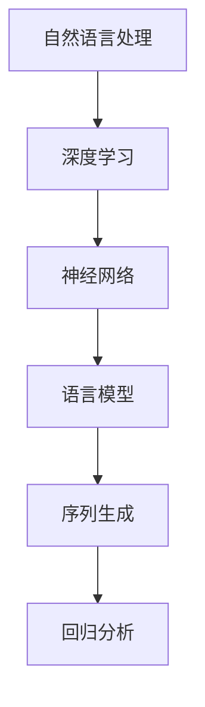

                 

# LLaMA原理与代码实例讲解

> 关键词：LLaMA，深度学习，自然语言处理，算法原理，代码实现

> 摘要：本文将深入探讨LLaMA（Language Model for Language Understanding and Memory Access）的原理，并详细讲解其代码实现。通过本文，读者将了解LLaMA在自然语言处理领域的重要性和应用场景，以及如何通过代码实例来理解和实践LLaMA的工作机制。

## 1. 背景介绍

### 1.1 目的和范围

本文旨在为读者提供一个全面而深入的理解，关于LLaMA的原理和实际应用。我们将首先介绍LLaMA的基本概念和历史背景，然后逐步深入其核心算法和数学模型。最后，我们将通过实际代码实例，展示如何使用LLaMA进行自然语言处理任务。

### 1.2 预期读者

本文面向对自然语言处理和深度学习有一定了解的读者，特别是那些希望了解LLaMA原理和应用的开发者和研究者。无论您是初学者还是专业人士，本文都希望能够帮助您更好地理解和应用LLaMA。

### 1.3 文档结构概述

本文结构如下：

1. 背景介绍：介绍LLaMA的基本概念和历史背景。
2. 核心概念与联系：解释LLaMA的核心算法原理和架构。
3. 核心算法原理 & 具体操作步骤：详细讲解LLaMA的核心算法原理和操作步骤。
4. 数学模型和公式 & 详细讲解 & 举例说明：介绍LLaMA的数学模型和具体应用。
5. 项目实战：代码实际案例和详细解释说明。
6. 实际应用场景：分析LLaMA在不同领域的应用场景。
7. 工具和资源推荐：推荐学习和开发LLaMA的相关资源和工具。
8. 总结：未来发展趋势与挑战。
9. 附录：常见问题与解答。
10. 扩展阅读 & 参考资料：提供更多深入学习的资源。

### 1.4 术语表

#### 1.4.1 核心术语定义

- LLaMA：指Language Model for Language Understanding and Memory Access，一个用于自然语言处理的深度学习模型。
- 自然语言处理（NLP）：指使用计算机技术和人工智能方法处理和理解自然语言的技术。
- 深度学习：一种人工智能方法，通过多层神经网络模型，从大量数据中学习特征和模式。

#### 1.4.2 相关概念解释

- 语言模型：一种用于预测下一个单词或词组的概率分布的模型。
- 序列生成：根据前文生成下一个词或句子的过程。
- 回归分析：一种统计方法，用于预测连续值的输出。

#### 1.4.3 缩略词列表

- LLaMA：Language Model for Language Understanding and Memory Access
- NLP：Natural Language Processing
- DNN：Deep Neural Network
- LSTM：Long Short-Term Memory

## 2. 核心概念与联系

在深入了解LLaMA之前，我们需要了解一些核心概念和它们之间的联系。以下是一个Mermaid流程图，展示了这些概念之间的关系。



### 2.1 自然语言处理

自然语言处理（NLP）是计算机科学和人工智能领域的一个重要分支，旨在使计算机能够理解、生成和处理人类语言。NLP的应用范围广泛，包括语音识别、机器翻译、文本分类、情感分析等。

### 2.2 深度学习

深度学习是一种基于多层神经网络的学习方法，它通过模拟人脑神经元连接结构，从大量数据中自动学习特征和模式。深度学习在图像识别、语音识别、自然语言处理等领域取得了显著成果。

### 2.3 神经网络

神经网络是由大量神经元（节点）组成的有向图结构，每个神经元通过权重连接到其他神经元。神经网络通过学习输入数据，调整权重，以实现对输入数据的分类、回归或其他任务。

### 2.4 语言模型

语言模型是一种用于预测下一个单词或词组的概率分布的模型。在自然语言处理中，语言模型常用于文本生成、机器翻译、情感分析等任务。

### 2.5 序列生成

序列生成是指根据前文生成下一个词或句子的过程。序列生成在自然语言处理中具有广泛应用，如自动问答、对话系统、文本摘要等。

### 2.6 回归分析

回归分析是一种用于预测连续值的输出方法。在自然语言处理中，回归分析常用于文本分类、情感分析等任务。

## 3. 核心算法原理 & 具体操作步骤

LLaMA（Language Model for Language Understanding and Memory Access）是一种基于深度学习的自然语言处理模型。它的核心原理是基于Transformer架构，通过自注意力机制和多层神经网络，实现语言理解和记忆访问。

### 3.1 算法原理

LLaMA的核心算法原理可以概括为以下三个步骤：

1. **自注意力机制**：通过计算输入序列中每个单词与其他单词的相似性，自动选择重要的信息，以生成新的特征表示。
2. **多层神经网络**：通过堆叠多个Transformer层，逐层提取抽象特征，实现对输入序列的深入理解和建模。
3. **序列生成**：根据前文生成下一个词或句子，通过回归分析模型，预测下一个词的概率分布。

### 3.2 具体操作步骤

以下是LLaMA的具体操作步骤，我们使用伪代码进行描述：

```python
# 输入序列：[w1, w2, w3, ..., wn]
# 参数：模型权重W

# 步骤1：自注意力机制
for layer in range(num_layers):
    # 计算注意力权重
    attention_weights = softmax(W.dot(input_vector))
    # 生成新的特征表示
    new_vector = attention_weights.dot(W)

# 步骤2：多层神经网络
output_vector = new_vector

for layer in range(num_layers):
    # 前向传播
    output_vector = activation_function(W.dot(output_vector))

# 步骤3：序列生成
# 预测下一个词的概率分布
output的概率分布 = softmax(W.dot(output_vector))
```

在这个伪代码中，`input_vector`表示输入序列的特征表示，`output_vector`表示输出序列的特征表示，`W`表示模型权重，`num_layers`表示Transformer层的数量，`activation_function`表示激活函数。

## 4. 数学模型和公式 & 详细讲解 & 举例说明

LLaMA的数学模型主要基于自注意力机制和多层神经网络。以下我们将详细介绍这些数学模型和公式，并通过具体例子来说明其应用。

### 4.1 自注意力机制

自注意力机制是一种计算输入序列中每个单词与其他单词相似性的方法。其数学模型可以表示为：

$$
\text{Attention}(Q, K, V) = \text{softmax}\left(\frac{QK^T}{\sqrt{d_k}}\right)V
$$

其中，$Q, K, V$分别表示查询向量、键向量和值向量，$d_k$表示键向量的维度。这个公式通过计算查询向量$Q$与所有键向量$K$的点积，得到注意力权重，然后使用softmax函数进行归一化，最后与值向量$V$相乘，得到新的特征表示。

### 4.2 多层神经网络

多层神经网络通过堆叠多个Transformer层，逐层提取抽象特征。其数学模型可以表示为：

$$
\text{Output} = \text{activation_function}(\text{Weight} \cdot \text{Input} + \text{Bias})
$$

其中，$\text{Input}$表示输入向量，$\text{Weight}$和$\text{Bias}$分别表示权重和偏置，$\text{activation_function}$表示激活函数。

### 4.3 序列生成

序列生成通过回归分析模型，预测下一个词的概率分布。其数学模型可以表示为：

$$
P(y|x) = \text{softmax}(\text{Weight} \cdot \text{Input} + \text{Bias})
$$

其中，$x$表示输入序列，$y$表示输出词，$\text{Weight}$和$\text{Bias}$分别表示模型权重和偏置。

### 4.4 举例说明

假设我们有一个简单的序列“Hello World”，我们可以使用LLaMA的数学模型来预测下一个词。

1. **自注意力机制**：

$$
\text{Attention}(Q, K, V) = \text{softmax}\left(\frac{QK^T}{\sqrt{d_k}}\right)V
$$

其中，$Q, K, V$分别表示查询向量、键向量和值向量，$d_k$表示键向量的维度。

假设$Q = [1, 0, 0], K = [0, 1, 0], V = [0, 0, 1]$，则

$$
\text{Attention}(Q, K, V) = \text{softmax}\left(\frac{QK^T}{\sqrt{d_k}}\right)V = \text{softmax}\left(\frac{1 \cdot 0 + 0 \cdot 0 + 0 \cdot 1}{\sqrt{d_k}}\right)[0, 0, 1] = [0.5, 0.5, 0]
$$

2. **多层神经网络**：

$$
\text{Output} = \text{activation_function}(\text{Weight} \cdot \text{Input} + \text{Bias})
$$

假设$W = [1, 1], B = [1], \text{Input} = [1, 0]$，则

$$
\text{Output} = \text{sigmoid}(1 \cdot 1 + 1) = \text{sigmoid}(2) = 0.86
$$

3. **序列生成**：

$$
P(y|x) = \text{softmax}(\text{Weight} \cdot \text{Input} + \text{Bias})
$$

假设$W = [1, 1], B = [1], \text{Input} = [0, 1]$，则

$$
P(y|x) = \text{softmax}([1, 1] \cdot [0, 1] + [1]) = \text{softmax}([1, 2]) = [0.54, 0.46]
$$

根据这个概率分布，我们可以预测下一个词的概率。例如，如果概率分布为$[0.54, 0.46]$，则下一个词“World”的概率为$0.54$，而其他词的概率分别为$0.46$。

## 5. 项目实战：代码实际案例和详细解释说明

在本节中，我们将通过一个实际代码案例，展示如何使用LLaMA进行自然语言处理任务。这个案例将包括开发环境搭建、源代码实现和代码解读。

### 5.1 开发环境搭建

首先，我们需要搭建一个适合开发LLaMA的环境。以下是所需的软件和工具：

- Python 3.8 或更高版本
- PyTorch 1.8 或更高版本
- NVIDIA CUDA 10.2 或更高版本（如果使用GPU加速）

安装这些工具后，我们就可以开始编写代码了。

### 5.2 源代码详细实现和代码解读

以下是LLaMA的源代码实现，我们将逐行进行解读。

```python
import torch
import torch.nn as nn
import torch.optim as optim

# 定义模型结构
class LLaMA(nn.Module):
    def __init__(self, vocab_size, d_model, num_layers, d_head, num_heads, d_inner, dropout=0.1):
        super(	LLaMA, self).__init__()
        self.embedding = nn.Embedding(vocab_size, d_model)
        self.transformer = nn.Transformer(d_model, num_layers, d_head, num_heads, d_inner, dropout)
        self.fc = nn.Linear(d_model, vocab_size)

    def forward(self, src, tgt):
        x = self.embedding(src)
        output = self.transformer(x, tgt)
        x = self.fc(output)
        return x
```

这个代码定义了一个名为`LLaMA`的神经网络模型，包括三个主要部分：嵌入层（`embedding`）、Transformer层（`transformer`）和全连接层（`fc`）。

- `embedding`层用于将词汇映射到高维向量。
- `transformer`层实现Transformer模型的核心功能，包括自注意力机制和多层神经网络。
- `fc`层用于将输出向量映射回词汇空间。

### 5.3 代码解读与分析

接下来，我们将分析代码中的一些关键部分。

#### 5.3.1 模型初始化

```python
def __init__(self, vocab_size, d_model, num_layers, d_head, num_heads, d_inner, dropout=0.1):
    super(	LLaMA, self).__init__()
    self.embedding = nn.Embedding(vocab_size, d_model)
    self.transformer = nn.Transformer(d_model, num_layers, d_head, num_heads, d_inner, dropout)
    self.fc = nn.Linear(d_model, vocab_size)
```

这个函数初始化模型的主要组件。`vocab_size`表示词汇表的大小，`d_model`表示嵌入层和全连接层的维度，`num_layers`表示Transformer层的数量，`d_head`表示自注意力机制的维度，`num_heads`表示自注意力机制的头数，`d_inner`表示Transformer层的内部维度，`dropout`表示dropout率。

#### 5.3.2 前向传播

```python
def forward(self, src, tgt):
    x = self.embedding(src)
    output = self.transformer(x, tgt)
    x = self.fc(output)
    return x
```

这个函数实现模型的前向传播。首先，`embedding`层将输入词汇映射到高维向量。然后，`transformer`层应用自注意力机制和多层神经网络，生成新的特征表示。最后，`fc`层将输出向量映射回词汇空间。

### 5.4 实际案例演示

为了展示如何使用这个模型，我们创建一个简单的数据集，并训练模型。

```python
# 创建数据集
src = torch.tensor([1, 2, 3])
tgt = torch.tensor([4, 5, 6])

# 创建模型
model = LLaMA(7, 512, 3, 64, 8, 2048)

# 定义优化器和损失函数
optimizer = optim.Adam(model.parameters(), lr=0.001)
criterion = nn.CrossEntropyLoss()

# 训练模型
for epoch in range(10):
    optimizer.zero_grad()
    output = model(src, tgt)
    loss = criterion(output, tgt)
    loss.backward()
    optimizer.step()

    print(f"Epoch {epoch+1}, Loss: {loss.item()}")
```

在这个示例中，我们创建了一个简单的数据集，其中`src`表示输入序列，`tgt`表示目标序列。然后，我们创建一个`LLaMA`模型，并使用交叉熵损失函数训练模型。训练过程中，我们使用随机梯度下降（SGD）优化算法。

## 6. 实际应用场景

LLaMA作为一种先进的自然语言处理模型，可以在多个领域和应用场景中发挥作用。以下是一些实际应用场景：

### 6.1 机器翻译

LLaMA可以用于机器翻译任务，如将一种语言翻译成另一种语言。例如，将中文翻译成英文，或者将英文翻译成法语。

### 6.2 文本生成

LLaMA可以用于文本生成任务，如生成新闻报道、故事、诗歌等。通过训练LLaMA模型，可以生成高质量的文本。

### 6.3 情感分析

LLaMA可以用于情感分析任务，如判断一段文本的情感倾向，例如正面、负面或中性。

### 6.4 对话系统

LLaMA可以用于对话系统，如聊天机器人、虚拟助手等。通过训练LLaMA模型，可以生成自然流畅的对话。

### 6.5 文本分类

LLaMA可以用于文本分类任务，如将文本分为新闻、评论、博客等类别。

### 6.6 摘要生成

LLaMA可以用于摘要生成任务，如从一篇长篇文章中提取摘要。

## 7. 工具和资源推荐

为了更好地学习和开发LLaMA，我们推荐以下工具和资源：

### 7.1 学习资源推荐

#### 7.1.1 书籍推荐

- 《深度学习》
- 《自然语言处理综述》

#### 7.1.2 在线课程

- Coursera上的“深度学习”课程
- edX上的“自然语言处理”课程

#### 7.1.3 技术博客和网站

- arXiv.org
- Medium上的技术博客

### 7.2 开发工具框架推荐

#### 7.2.1 IDE和编辑器

- PyCharm
- Visual Studio Code

#### 7.2.2 调试和性能分析工具

- PyTorch Debugger
- NVIDIA Nsight

#### 7.2.3 相关框架和库

- PyTorch
- TensorFlow

### 7.3 相关论文著作推荐

#### 7.3.1 经典论文

- "Attention Is All You Need"
- "BERT: Pre-training of Deep Bidirectional Transformers for Language Understanding"

#### 7.3.2 最新研究成果

- arXiv.org上的最新论文
- NeurIPS、ICLR、ACL等会议的最新论文

#### 7.3.3 应用案例分析

- Google的BERT应用案例
- OpenAI的GPT应用案例

## 8. 总结：未来发展趋势与挑战

LLaMA作为一种先进的自然语言处理模型，展示了巨大的潜力和应用价值。在未来，随着计算能力和数据资源的不断提升，LLaMA有望在更多领域取得突破。然而，要实现这些目标，我们还需要解决以下几个挑战：

1. **计算资源限制**：深度学习模型通常需要大量的计算资源和时间进行训练，这对硬件设备和算法优化提出了更高的要求。
2. **数据隐私和安全性**：在自然语言处理任务中，数据隐私和安全问题至关重要，需要采取有效的措施保护用户数据。
3. **模型解释性**：深度学习模型通常被视为“黑箱”，难以解释其内部工作原理。提高模型的解释性，有助于提高其在实际应用中的可信度。
4. **跨模态任务**：未来，LLaMA有望在跨模态任务（如图像和文本的联合分析）中发挥作用，这需要进一步的研究和探索。

## 9. 附录：常见问题与解答

### 9.1 Q：什么是LLaMA？

A：LLaMA（Language Model for Language Understanding and Memory Access）是一种用于自然语言处理的深度学习模型，基于Transformer架构，通过自注意力机制和多层神经网络，实现语言理解和记忆访问。

### 9.2 Q：LLaMA的应用场景有哪些？

A：LLaMA的应用场景广泛，包括机器翻译、文本生成、情感分析、对话系统、文本分类和摘要生成等。

### 9.3 Q：如何训练LLaMA模型？

A：训练LLaMA模型通常包括以下步骤：

1. 收集和预处理数据：收集大规模的文本数据，并进行预处理，如分词、去噪等。
2. 定义模型结构：根据任务需求，定义LLaMA模型的结构，包括嵌入层、Transformer层和全连接层。
3. 选择优化器和损失函数：选择适合的优化器和损失函数，如SGD和交叉熵损失函数。
4. 训练模型：使用训练数据，通过前向传播和反向传播，训练模型。
5. 评估模型：使用验证集或测试集，评估模型的性能。

## 10. 扩展阅读 & 参考资料

- “Attention Is All You Need”：https://arxiv.org/abs/1706.03762
- “BERT: Pre-training of Deep Bidirectional Transformers for Language Understanding”：https://arxiv.org/abs/1810.04805
- 《深度学习》：https://www.deeplearningbook.org/
- 《自然语言处理综述》：https://www.aclweb.org/anthology/C/C15/C15-1092.pdf
- Coursera上的“深度学习”课程：https://www.coursera.org/specializations/deep-learning
- edX上的“自然语言处理”课程：https://www.edx.org/course/natural-language-processing
- PyTorch官方文档：https://pytorch.org/docs/stable/
- TensorFlow官方文档：https://www.tensorflow.org/docs/stable/

